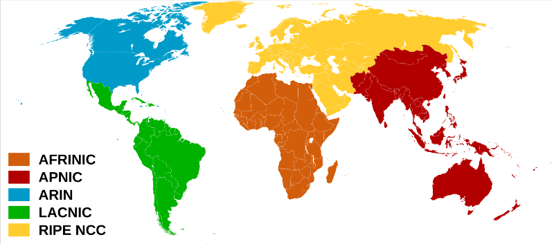
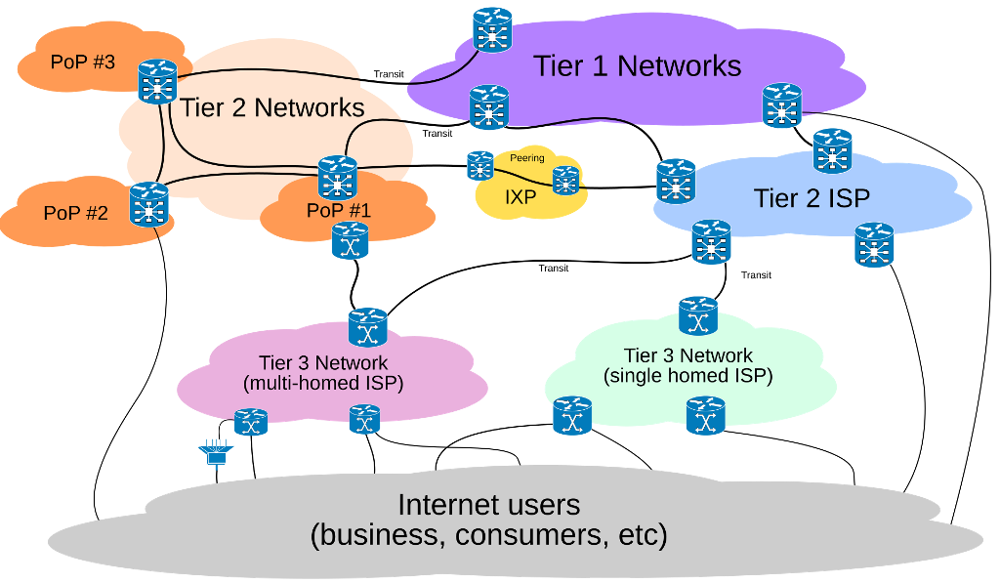

[<- До підрозділу](README.md)

# Організація роботи Інтернет: теоретична частина

Це чернетка

План

1. Вступ: потреба в координації для глобальної мережі
2. Історичні передумови: від ARPANET до Інтернету
3. Основні напрями координації
4. Інституції та організації
   - ICANN та IANA
   - Regional Internet Registries (RIPE, ARIN, APNIC, LACNIC, AfriNIC)
   - IETF та роль RFC
   - W3C та інші суміжні органи
5. Механізми розподілу та делегування
   - від IANA до RIR
   - LIR та національні інтернет-реєстри
   - делегування доменів верхнього рівня
6. Питання керування і контролю
   - централізація і децентралізація
   - фінансування та вплив зацікавлених сторін
   - критика і дискусії навколо «монополії ICANN»
7. Безпека і довіра
   - RPKI та контроль за маршрутизацією
   - DNSSEC і захист імен
8. Майбутні виклики
   - інтернет-суверенітет і альтернативні системи
   - нові технології (IoT, IPv6) і потреби координації
9. Висновки: баланс між глобальною єдністю та локальними інтересами

## Вступ: потреба в координації для глобальної мережі

**Інтернет** — це глобальна мережа, що поєднує мільйони локальних і регіональних мереж у різних країнах світу. Його часто називають «мережею мереж», оскільки він не має єдиного власника чи керівного центру, а функціонує завдяки взаємодії незалежних учасників за спільними технічними правилами.

Щоб забезпечити зв’язок, кожен пристрій у мережі має власну **IP-адресу** — унікальний числовий ідентифікатор (наприклад 8.8.8.8), подібний до поштової адреси. Оскільки запам’ятовувати числові адреси незручно, використовуються їх буквенні представлення, які будуються та керуються системою доменних імен **DNS** (*Domain Name System*). Вона дозволяє користуватися зрозумілими назвами, наприклад [www.example.com](http://www.example.com).

У свою чергу для організації маршрутизації передачі даних мережі, що складають основу Інтернету, об’єднуються в **автономні системи**, які обмінюються маршрутною інформацією між собою. Кожна автономна система повинна мати унікальний в Інтернеті номер **ASN** (*Autonomous System Number*), який дозволяє однозначно ідентифікувати її серед інших та підтримувати правильний обмін даними на глобальному рівні.

Саме існування IP-адрес, DNS і ASN показує, що Інтернету потрібна координація — механізми, які забезпечують їх унікальність і узгодженість. Без цього глобальна мережа швидко перетворилася б на набір несумісних фрагментів.

Координація в Інтернеті виникає як практична потреба забезпечити сумісність і передбачуваність функціонування мережі. Якби кожна країна, компанія чи установа самостійно визначала правила присвоєння IP-адрес або формування доменних імен, глобальний зв’язок швидко втратив би цілісність. Крім технічної узгодженості, координація також покликана вирішувати організаційні та правові питання, пов’язані з використанням мережевих ресурсів, їхнім розподілом і контролем.

Таким чином, потреба у координації в Інтернеті не означає централізованого керування, а радше формування спільних правил і процедур, яких дотримуються всі учасники. Саме завдяки цим механізмам Інтернет зберігає єдність, доступність і надійність, залишаючись водночас відкритим для розвитку й інновацій.

## Історичні передумови: від ARPANET до Інтернету

Витоки координації в Інтернеті сягають часу створення першої комп’ютерної мережі з комутацією пакетів **ARPANET**, розробленої наприкінці 1960-х років під керівництвом Агентства передових оборонних дослідницьких проєктів США (ARPA). Її метою було забезпечення надійного обміну даними між науковими установами та військовими центрами. ARPANET стала експериментальним майданчиком для перевірки ідей децентралізованої архітектури, де зв’язок зберігається навіть за відмови окремих вузлів, і водночас виявила потребу у спільних технічних правилах для взаємодії різнорідних систем.

У 1970-х роках з’явилися перші документи серії RFC, які започаткували традицію відкритого обговорення технічних рішень. Тоді ж було розроблено протоколи **TCP/IP**, що стали універсальним стандартом міжмережевої комунікації. Коли 1 січня 1983 року ARPANET офіційно перейшла на TCP/IP, цей момент вважають символічним народженням Інтернету.

У 1980-х роках ARPANET поступово втратила значення як окрема дослідна мережа та інтегрувалася в ширший простір міжмережевих з’єднань, що отримав назву «Інтернет». Це висунуло на передній план питання координації: розподіл адресного простору, керування доменними іменами та створення інституцій для підтримки глобальної сумісності. До процесу дедалі активніше долучалися міжнародні наукові спільноти та незалежні організації, що вивело Інтернет за межі військових програм і зробило його глобальною інфраструктурою.

## Основні напрями координації

Координація в Інтернеті охоплює кілька ключових напрямів, без яких неможливе його стабільне функціонування.

Перший з них — це розподіл IP-адрес, які забезпечують унікальну ідентифікацію кожного пристрою в мережі. 

Другий — підтримка системи ASN (*Autonomous System Number*), що дозволяє відрізняти й правильно взаємодіяти між собою тисячам автономних систем, які формують основу глобальної маршрутизації. 

Третій — це система доменних імен DNS(*Domain Name System*), яка забезпечує зручний перехід від буквеної адреси до числової IP-адреси та вимагає суворої ієрархії й узгодженості.

Не менш важливим є і напрям стандартизації протоколів. Саме спільно ухвалені правила, описані у відповідних документах, гарантують сумісність між різними мережами та пристроями і дозволяють Інтернету залишатися відкритим до розвитку нових технологій.

Разом ці напрямки забезпечують єдність і передбачуваність роботи глобальної мережі.

## Інституції та організації

Для забезпечення координації в Інтернеті сформувалася низка організацій, кожна з яких відповідає за свій напрям діяльності.

Насамперед варто відзначити **ICANN** (*Internet Corporation for Assigned Names and Numbers*) — корпорацію з керування інтернет-іменами та номерами. Вона координує розподіл доменів верхнього рівня, підтримує єдиний корінь системи доменних імен (**DNS**) і здійснює загальний нагляд за системою адресації. У межах ICANN працює підрозділ **IANA** (*Internet Assigned Numbers Authority*), який історично відповідає за виділення діапазонів IP-адрес, автономних системних номерів (**ASN**) і технічних параметрів протоколів.

Розподіл IP-адрес і ASN у регіонах здійснюють регіональні інтернет-реєстри (**RIR**), які у свою чергу взаємодіють із місцевими інтернет-реєстраторами (LIR) та провайдерами, забезпечуючи ефективне використання адресного простору.

Окремий напрям координації стосується системи доменних імен (**DNS**). Вона перетворює зрозумілі людині адреси, наприклад `www.example.com`, на числові IP-адреси. ICANN забезпечує унікальність кожного домену верхнього рівня (наприклад .com, .org чи національні .ua), а оператори доменів і компанії-реєстратори надають користувачам можливість реєструвати власні адреси. Завдяки цьому система DNS лишається єдиною і запобігає дублюванню імен.

Важливу роль відіграє й **IETF** (*Internet Engineering Task Force*) — відкрита міжнародна спільнота інженерів і дослідників. Саме вона створює й публікує документи серії RFC (*Request for Comments*), у яких описані протоколи, формати даних і принципи роботи мережевих систем. Саме завдяки IETF були стандартизовані TCP/IP, електронна пошта та сучасні протоколи безпеки. Для розвитку веб-технологій працює **W3C** (*World Wide Web Consortium*), який визначає стандарти HTML, CSS та інших складових Всесвітньої павутини. У той час як ICANN та IANA більше відповідають за координацію ресурсів (адреси, імена), IETF і W3C формують правила взаємодії, які роблять Інтернет і веб сумісними та відкритими для розвитку.

Завдяки діяльності цих організацій Інтернет зберігає цілісність: ресурси розподіляються без дублювання, протоколи працюють однаково в усьому світі, а користувачі отримують доступ до єдиної глобальної мережі.

Офіційні ресурси:

- ICANN — https://www.icann.org
- IANA — https://www.iana.org
- IETF — https://www.ietf.org
- W3C — https://www.w3.org

## Автономні системи та їхня координація

Основою Інтернету є не окремі комп’ютери чи провайдери, а **автономні системи (AS)**. Автономна система — це сукупність мереж, які перебувають під єдиним адмініструванням і мають спільну політику маршрутизації. Прикладом може бути велика телекомунікаційна компанія, університет чи національний оператор.

Щоб маршрутизація між автономними системами була узгодженою, кожна з них отримує унікальний номер **ASN** (*Autonomous System Number*). Цей номер використовується в різних протоколах маршрутизації (побудови маршрутних таблиць) зокрема  в протоколі BGP (*Border Gateway Protocol*), за допомогою якого автономні системи обмінюються маршрутною інформацією. Таким чином, ASN виконує роль «ідентифікатора учасника» в глобальній системі обміну даними. 

Координація тут має вирішальне значення. Якщо б один і той самий ASN використовували різні організації, це призвело б до плутанини та збоїв у маршрутизації. Саме тому виділення ASN централізовано здійснюється через IANA, яка виділяє номери автономних систем регіональним інтернет-реєстрам (**RIR**). У свою чергу RIR розподіляють або надають номери автономних систем операторам мереж відповідно до власних політик. П’ять регіональних реєстрів [такі](https://www.iana.org/assignments/as-numbers/as-numbers.xhtml):

- AFRINIC (Африка) https://www.afrinic.net
- APNIC (Азійсько-тихоокеанський регіон) https://www.apnic.net
- ARIN (Північна Америка) https://www.arin.net 
- LACNIC (Латинська Америка і Кариби) https://www.lacnic.net
- RIPE NCC (Європа, Близький Схід, частина Центральної Азії) https://www.ripe.net

Отримати номер автономної системи можна у відповідному реєстрі свого регіону.

рис.1. Карта регіональних інтернет-реєстрів (Джерело Вікіпедія)

Завдяки такій системі глобальний Інтернет може функціонувати як єдина мережа мереж: незалежні організації мають свободу у визначенні власної політики маршрутизації, але при цьому залишаються частиною узгодженої архітектури. Це яскравий приклад того, як технічна складова (номери ASN, протоколи BGP) поєднується з організаційними механізмами (розподіл номерів і підтримка унікальності).

Серед прикладів великих автономних систем можна навести глобальних операторів, таких як AT&T (AS7018), Deutsche Telekom (AS3320), Orange (AS3215), чи великі інтернет-компанії на кшталт Google (AS15169), Microsoft (AS8075) і Facebook/Meta (AS32934). Кожна з цих організацій управляє власною інфраструктурою, але завдяки унікальним ASN і протоколу BGP вони можуть взаємодіяти одна з одною у складі єдиного Інтернету.

Автономні системи (AS) належать не лише провайдерам доступу до Інтернету (ISP). Власниками можуть бути й інші організації, якщо їм потрібно напряму керувати маршрутизацією та мати власні унікальні ASN. Ось основні категорії:

- Великі інтернет-компанії та контент-провайдери. Наприклад, Google (AS15169), Meta/Facebook (AS32934), Microsoft (AS8075), Amazon (AS16509), Netflix (AS2906). Вони мають власні глобальні мережі для оптимізації доставки контенту.
- Корпорації з великою розподіленою інфраструктурою. Банки, міжнародні промислові холдинги, авіакомпанії чи виробники можуть мати власний ASN, якщо у них є потреба у глобальній приватній мережі з прямим пірингом.
- Університети та науково-дослідні центри. Наприклад, мережі CERN, MIT чи українських університетів (через URAN — Українську науково-освітню мережу) мають власні AS для керування маршрутизацією на рівні академічних об’єднань.
- Урядові структури та органи влади. Державні інформаційні системи або захищені мережі органів безпеки іноді функціонують у вигляді автономних систем.
- Хмарні та CDN-провайдери. Akamai (AS20940), Cloudflare (AS13335), DigitalOcean (AS14061) та інші. Вони обов’язково мають власні AS, бо керують розподіленими дата-центрами й кешами по всьому світу.

Тобто володіння ASN не обмежується лише «класичними» провайдерами доступу. Це атрибут будь-якої організації, яка бере участь у глобальній маршрутизації напряму, а не через посередника.

рис.2. Класичні (ієрархічні) взаємовідносини між різними рівнями інтернет-провайдерів до появи великих постачальників контенту та CDN. (Джерело Вікіпедія)

Мережа рівня 1 (Tier 1 network) — це мережа Інтернет-протоколу (IP), яка може досягти будь-якої іншої мережі в Інтернеті виключно за рахунок безкоштовної взаємної взаємодії (також відомої як settlement-free peering). Іншими словами, мережі рівня 1 можуть обмінюватися трафіком одна з одною без будь-якої оплати за передавання даних в обидва боки. На відміну від них, деякі мережі рівня 2 та всі мережі рівня 3 повинні платити за передавання трафіку через інші мережі.

Не існує офіційного органу, який визначає рівні мереж, що беруть участь в Інтернеті. Найпоширеніше й загальноприйняте визначення мережі рівня 1 таке: це мережа, яка може досягти будь-якої іншої мережі в Інтернеті без купівлі IP-транзиту чи оплати за взаємодію. Відповідно, мережа рівня 1 повинна бути транзитно незалежною (не купує транзит) і мати безкоштовний піринг з усіма іншими мережами рівня 1, а також мати змогу досягати всіх основних мереж Інтернету. При цьому не всі транзитно незалежні мережі є мережами рівня 1, адже можна відмовитися від транзиту, оплачуючи піринг, або ж залишатися без транзиту, але не мати змоги досягати всіх основних мереж.

Найчастіше цитованим джерелом для визначення мереж рівня 1 є публікації компанії Renesys Corporation, проте базова інформація для підтвердження цього доступна у відкритих джерелах, наприклад у базі даних RIPE RIS, на серверах Oregon Route Views, у Packet Clearing House та інших.

Визначити, чи мережа сплачує за піринг або транзит, часто важко, оскільки такі бізнес-угоди рідко публікуються або ж захищені угодами про нерозголошення. Спільнота пірингу в Інтернеті — це приблизно коло координаторів взаємодії, які працюють у точках обміну трафіком (IXP) на більш ніж одному континенті. Її підмножина, що представляє мережі рівня 1, існує радше як неформальне розуміння, ніж як офіційно опублікований список.

Поширені визначення мереж рівня 2 і рівня 3:

- **Мережа рівня 2**: мережа, яка має безкоштовний піринг із деякими іншими мережами, але все ще купує IP-транзит або сплачує за піринг, щоб охопити певну частину Інтернету.
- **Мережа рівня 3**: мережа, яка повністю купує транзит чи піринг у інших мереж для участі в Інтернеті.

Приблизно з 2010 року ця ієрархічна модель взаємозв’язків в Інтернеті зазнала змін. Великі постачальники контенту з приватними мережами та CDN, такі як Google, Netflix і Meta, значно зменшили роль провайдерів рівня 1 і «сплющили» топологію Інтернету, оскільки вони напряму з’єднуються з більшістю інших ISP, оминаючи транзитних провайдерів рівня 1.

Двостороння приватна угода про піринг зазвичай передбачає пряме фізичне з’єднання між двома партнерами. Трафік з однієї мережі в іншу тоді в основному маршрутизується через цей прямий канал.

Мережа рівня 1 може мати кілька таких з’єднань з іншими мережами рівня 1. Піринг ґрунтується на принципі рівності обміну трафіком між партнерами, і тому іноді виникають суперечки, коли одна зі сторін в односторонньому порядку розриває зв’язок, намагаючись змусити іншу перейти на схему з оплатою. Такі випадки де-пірингу неодноразово траплялися у перше десятиліття XXI століття. Якщо йдеться про великі мережі з мільйонами клієнтів, це може фактично розділити частину Інтернету, особливо якщо оператори блокують маршрутизацію через альтернативні шляхи. Проблема тут радше комерційна, ніж технічна: фінансовий спір вирішується шляхом тиску на користувачів іншої сторони. У найгіршому випадку абоненти кожної з мереж, які мають лише одне підключення, взагалі не зможуть досягти абонентів іншої. Сторона, що ініціює де-піринг, сподівається, що клієнти іншої мережі постраждають більше і змушені будуть тиснути на свого провайдера, аби той поступився. Нижчі за рівнем провайдери, не залучені в суперечку, зазвичай не страждають, оскільки мають кілька маршрутів до потрібної мережі. Такі суперечки зазвичай стосувалися «чистого пірингу», де обмінювався лише трафік, призначений для мереж-партнерів, без транзиту в інші частини Інтернету. За строгим визначенням, мережа рівня 1 пірингує лише з іншими мережами рівня 1 і не купує транзит. На практиці ж мережі рівня 1 виступають транзитними для нижчих рівнів і пірингують тільки з рівними собі за масштабом.

У більш широкому розумінні, піринг означає обмін збалансованим обсягом трафіку між двома мережами, що не виключає наявності паралельних угод про оплатний транзит. У контексті маршрутизації безкоштовний піринг передбачає заборону використовувати мережу партнера для транзитного трафіку, тоді як транзитні угоди якраз охоплюють такий трафік. Провайдери рівня 1 є центральними для інтернет-«хребта»: вони не купують транзит у нижчих рівнів, натомість продають його іншим. Завдяки масштабам своїх мереж провайдери рівня 1 рідко беруть участь у публічних точках обміну трафіком, надаючи транзит як послугу та віддаючи перевагу приватному пірингу. Центри колокації часто є місцем для таких приватних з’єднань між клієнтами, провайдерами рівня 1 та хмарними компаніями.

За логікою, провайдер рівня 1 ніколи не платить за транзит, оскільки:

1. усі провайдери рівня 1 пірингують один з одним у світі,
2. угоди про піринг дають доступ до клієнтів усіх інших Tier 1,
    що означає, що мережа рівня 1 охоплює всіх користувачів глобального Інтернету.
    Фактичні витрати на транзит між двома мережами рівня 1 симетричні, тому взаємних платежів не виникає.

### Поява гіпермасштабних мереж і CDN

Традиційну ієрархію Інтернету порушила поява великих постачальників контенту та хмарних сервісів (гіперскейлерів). Вони стали головними джерелами глобального трафіку і почали будувати власну інфраструктуру світового масштабу, яка часто працює паралельно чи навіть оминає класичних провайдерів рівня 1.

Сьогодні лише кілька компаній — Google (YouTube, Cloud), Meta (Facebook, Instagram), Amazon (AWS, Prime Video), Microsoft (Azure, Xbox) та Netflix — генерують близько 75% міжнародного інтернет-трафіку (станом на 2024 рік). Така концентрація змінила економіку Інтернету: доступним провайдерам стало вигідніше напряму з’єднуватися з цими гігантами, ніж купувати «повний транзит» у Tier 1.

Гіперскейлери інвестують у власні глобальні інфраструктури, що часто дорівнюють або перевищують масштаби традиційних Tier 1:

- **Глобальні дата-центри та регіони хмар**: сотні об’єктів у десятках країн (AWS, Azure, Google Cloud).
- **Приватні оптоволоконні «хребти»**: міжрегіональний трафік рухається через закриті мережі без виходу в публічний Інтернет.
- **Підводні кабелі**: сьогодні контент-провайдери є головними інвесторами у нові системи, фінансуючи мільярдні проєкти. Google, наприклад, володіє найбільшою мережею з понад 30 власними кабелями.

Щоб доставляти контент швидше та дешевше, вони застосовують дві стратегії:

- **Широкий піринг**: прямі з’єднання з доступними ISP у точках обміну та приватних вузлах.
- **Локальні кеші**: розміщення власних серверів усередині мереж провайдерів (Netflix Open Connect, Google Global Cache), щоб популярний контент віддавався напряму, без навантаження на зовнішні канали.

Ці зміни поставили питання: чи вважати гіперскейлерів новими мережами рівня 1? За масштабами інфраструктури вони не поступаються, а інколи й перевершують класичних провайдерів. Але за функцією вони відрізняються: їхні мережі створені насамперед для обслуговування власних сервісів, а не для продажу універсального транзиту.

Отже, сьогоднішній Інтернет — це вже не чітка піраміда з провайдерами рівня 1 на вершині, а складна екосистема, де поруч існують дві категорії глобальних «хребтів»: традиційні Tier 1 і гіперскейлерні мережі, які взаємодіють між собою та з тисячами менших провайдерів.

https://en.wikipedia.org/wiki/Internet

Теоретичне заняття розробив ChatGPT під координацією [Олександр Пупена](https://github.com/pupenasan)  

Якщо Ви хочете залишити коментар у Вас є наступні варіанти:

- [Обговорення у WhatsApp](https://chat.whatsapp.com/BRbPAQrE1s7BwCLtNtMoqN)
- [Обговорення в Телеграм](https://t.me/+GA2smCKs5QU1MWMy)
- [Група у Фейсбуці](https://www.facebook.com/groups/asu.in.ua)

Про проект і можливість допомогти проекту написано [тут](https://asu-in-ua.github.io/atpv/)
