[<- До підрозділу](README.md)

# Протоколи та утиліти IP: практична частина

**Тривалість**: 2 години

**Мета:**  Навчитися налаштовувати систему на роботу з IP та перевіряти функціонування роботи протоколу

## Лабораторна установка для проведення лабораторної роботи у віртуальному середовищі.

**Необхідне апаратне забезпечення.** 

Для проведення лабораторних робіт необхідно мати комп’ютер з наступною мінімальною апаратною конфігурацією:

- CPU Intel/AMD 1 ГГц / RAM 2 ГБ / HDD 10 ГБ (вільних)  

**Необхідне програмне забезпечення.** 

Усі досліди проводяться на комп’ютері (ПК) на якому встановлена віртуальна машина. Передбачається, що хостова ОС є однією з версій починаючи з Winodws XP. Інші хостові ОС також можуть бути використані, але опис роботи з ними не розглядаються в даній лабораторній роботі. 

Між хостовою та гостьовою ОС до існуючої віртуальної мережі (для Internet) створюється ще одна, яка буде використовуватися в дослідах.


Рис. Функціональна схема лабораторної установки

## Загальна постановка задачі

Цілі роботи: 

- навчитися конфігурувати мережні карти на роботу з протоколом IP
- навчитися перевіряти налаштуванням та роботу мережних карт при роботі з протоколом IP

- навчитися перевіряти наявність з'єднання з іншим хостом IP та виявляти проблеми таких з'єднань

- навчитися виводити маршрутні таблиці

- навчитися перевіряти роботу DNS  

## Послідовність виконання роботи

### 1. Встановлення віртуальної машини та перевірка налаштувань мережних карт з використанням вікон або утиліт Windows  

- [ ] Ознайомтеся з можливостями налаштування мережі у додатку 2.1 
- [ ] Виконайте пункти 1-3 та 6 з [практичної роботи по Ethernet](../ethernetstart/lab.md), якщо Ви цього ще не зробили.
- [ ] Визначте плинні значення налаштування адрес IP для:
  - [ ] мережної карти хостової машини, через який йде вихід в Інтернет
  - [ ] віртуальної мережної карти хостової машини, через який йде зв'язок з віртуальною машиною
  - [ ] обидвох мережних карт віртуальної машини
- [ ] Запишіть визначені значення в таблицю для звіту що має формат, як показано нижче

Табл.2.1. Налаштування IPv4 для мережних карт

| Назва та тип мережної карти | IP адреса | Маска | Маршрутизатор за замовченням | Адреса DNS |
| --------------------------- | --------- | ----- | ---------------------------- | ---------- |
|                             |           |       |                              |            |
|                             |           |       |                              |            |
|                             |           |       |                              |            |

### 2. Перевірка роботи протоколу ICMP

- [ ] Ознайомтеся з протоколом ICMP у додатку 2.2.
- [ ] Налаштуйте гостьову та хостові ОС таким чином, щоб вони реагували на ехо-запити (відлуння) ICMP

Деякі вузли не реагують на ехо-запити PING. Наприклад замовченням вони часто відключені у Winidows.  Для активації їх в Winidows необхідно активувати цю опцію в налаштуваннях брандмауера (Рис.Д1.16 та Рис.Д1.17):

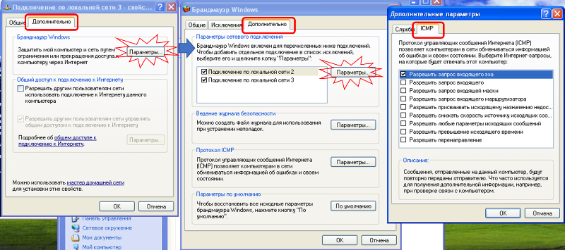

 Рис.Д1.16. Увімкнення реагування на запит відлуння у Windows XP

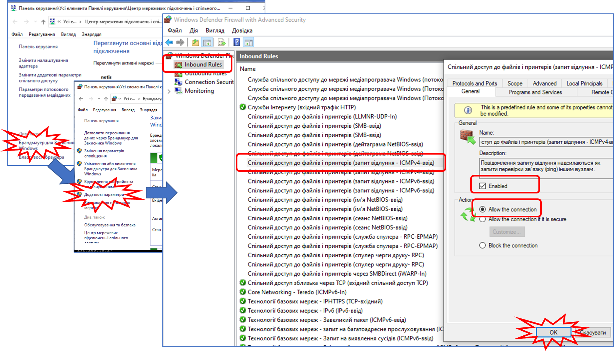

 Рис.Д1.17. Увімкнення реагування на запит відлуння у Windows 10

- [ ] Перевірте наявність з’єднання між гостьовою та хостовою системою за допомогою утиліти PING. Якщо ехо-запити повертаються – перейдіть до наступного пункту, якщо ні - попросіть допомоги у викладача. Процедуру перевірки з’єднання виконати з обидвох кінців - зі сторони хостової і гостьової ОС.

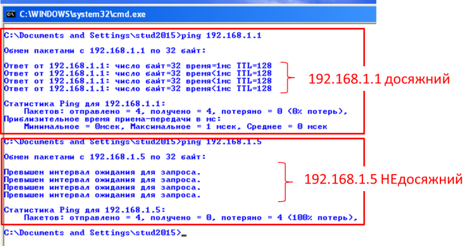

Рис.Д1.15.

- [ ] Запустіть Wireshark і налаштуйте захват пакетів на віртуальну мережу VirtualBox. У програмі WireShark на панелі списку пакетів за допомогою фільтру виведіть пакети з протоколом ICMP. Детальніше робота з Wireshark описана в практичному занятті [по Ethernet](../ethernetstart/lab.md) 

```
icmp
```

- [ ] Відправте ехо-запит ping від хостової до гостьової ОС. Після захвату пакетів ICMP зупиніть захватування.
- [ ] Розкрийте панель детального аналізу пакету у WireShark і використовуючи додаток 2.2 проаналізуйте:

- заголовок кадру Ethernet: MAC адреси відправника та отримувача;
- заголовок IP: IP адреси відправника та отримувача;
- повідомлення ICMP;

Зробіть копії екрану сторінки з розкритим аналізом пакетів. 

### 3. Перевірка роботи IP протокола з маршрутизацією 

- [ ] Запустіть Wireshark і налаштуйте захват пакетів на мережу, через яку йде зв'язок з Інтернет. У програмі WireShark на панелі списку пакетів за допомогою фільтру виведіть пакети з протоколом ICMP.
- [ ] Відправте ехо-запит ping від хостової системи за адресою `8.8.8.8`. 

```bash
ping -n 1 8.8.8.8
```

- [ ] Після захвату пакетів ICMP зупиніть захватування.
- [ ] Розкрийте панель детального аналізу пакету у WireShark і використовуючи додаток 2.2 проаналізуйте:

- заголовок кадру Ethernet: MAC адреси відправника та отримувача;

- заголовок IP: IP адреси відправника та отримувача;

- повідомлення ICMP;

Зробіть копії екрану сторінки з розкритим аналізом пакетів. 

- [ ] використовуючи команду `arp -a` проаналізуйте який саме вузол (з яким IP) в мережі Ethernet, відповідав на ехо-запити. Чому саме так? Запишіть вашу відповідь у звіті.

### 4. Статичне виставлення 2 IP адрес на одну мережну карту

- [ ] На карті віртуальної машини, що зв'язується з хостовою ОС через віртуальну мережу зробіть наступні налаштування статичних IP адрес (приклад на рис.2.1):

- першу статичну адресу, таку, яка була до цього в цієї карти (див.таб.2.1)
- другу статичну адресу, що відрізняється номером підмережі

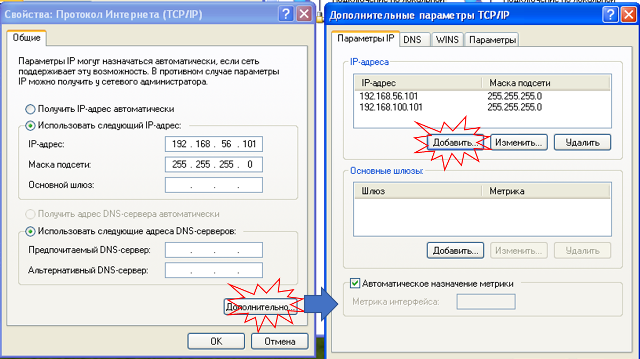

рис.2.1. Приклад налаштування 2-х статичних IP адрес на одній мережній карті

- [ ] Зробть копії екранів налаштувань карти для звіту.
- [ ] Перевірте доступність адрес з хостової машини утилітою `ping`

Добавлення нової IP адреси на гостьовій машині не дасть можливість звертатися за нею. Подумайте чому і занотуйте причину. 

- [ ] Змініть налаштування віртуальної мережної карти в хостовій ОС, щоб добитися можливості адресації за 2-ма IP статичними адресами.
- [ ] Зробть копії екранів налаштувань карти для звіту.

### 5. Перевірка роботи шляху утилітою tracert  

- [ ] Ознайомтеся з утилітою TRACERT у [додатку 2.1](d2_1.md)
- [ ] Зробіть перевірку з’єднання з хостової машини `8.8.8.8` утилітою `ping`. При позитивному результаті перевірте проходження шляху ехо-запитів за допомогою утиліти `tracert`. Якщо ехо-запити не повертаються – зверніться до викладача за допомогою. Зробіть копію екрану для звіту.
- [ ] Зробіть перевірку з’єднання з віртуальної машини `8.8.8.8` утилітою `ping`. При позитивному результаті перевірте проходження шляху ехо-запитів за допомогою утиліти `tracert`. Якщо ехо-запити не повертаються – зверніться до викладача за допомогою. Зробіть копію екрану для звіту.
- [ ] Проаналізуйте та порівняйте два отримані результати. Запишіть відмінність між ними та запишіть в звіт.
- [ ] Відключіть хостову машину від мережі Інтернет (наприклад відключившись від мережі). Перевірте проходження шляху ехо-запитів за допомогою утиліти `tracert` та зробіть копію екрану для звіту. Можете не очікувати усіх ехо-запитів, достатньо тільки перших трьох.  Поясніть отримані результати та запишіть у звіт. 

### 6. Виведення таблиць маршрутизації  

- [ ] Ознайомтеся з утилітами `Route` та `NetStat` у [додатку 2.2](d2_2.md) 

- [ ] За допомогою утиліти Route виведіть таблицю маршрутизації для хостової та гостьової ОС. Проаналізуйте її зміст та зробіть копію екрану для звіту. 

```bash
route print
```

- [ ] За допомогою утиліти NetStat виведіть таблицю маршрутизації для хостової та гостьової ОС. Проаналізуйте її зміст та зробіть копію екрану для звіту. 

```bash
netstat -r
```

### 7. Робота з системою DNS

- [ ] З віртуальної машини за допомогою  `ping` з ключом `-a`

- Виведіть інформацію про домен IP адреси `8.8.8.8` 

```
ping -a 8.8.8.8
```

- Виведіть інформацію про IP доменної адреси `iasu-nuft.pp.ua` 
- Виведіть інформацію про доменне ім'я маршрутизатору, через яку хостова машина виходить в Інтернет (скористайтеся нотатками наведеними вище) 
- Зробіть копії екранів результатів виведення для звіту 

- [ ] Ознайомтеся з утилітою `nslookup` у [додатку 2.1](d2_1.md)
- [ ] З віртуальної машини за допомогою `nslookup`:
- Виведіть інформацію про домен `iasu-nuft.pp.ua`
- Виведіть інформацію про доменне ім'я маршрутизатору, через яку хостова машина виходить в Інтернет (скористайтеся нотатками наведеними вище) 
- Зробіть копії екранів результатів виведення для звіту 

- [ ] На віртуальній машині за допомогою блокноту змініть файл `C:\Windows\System32\drivers\etc\hosts` записавши туди рядок встановлення імені маршрутизатору за його IP адресою, за шаблоном:

```
1.2.3.4 MyRouter
```

- [ ] Збережіть файл 
- [ ] За допомогою `ping`  та `nslookup` виведіть інформацію про доменне ім'я маршрутизатору. Зробіть копії екранів. Подумайте чому саме такі результати Ви отримали.
- [ ] Зробіть копії екранів результатів виведення для звіту 

### Перевірка виконання роботи та питання до захисту.

Викладачем перевіряється виконання всіх пунктів роботи відповідно до занотованих у звіті результатів. Оцінюється повнота результатів. Кінцева оцінка коригується по усному опитуванню при очному спілкуванню. Кожен результат студент повинен пояснити. У випадку виникнення помилок або запитань щодо проведення певного пункту, його необхідно буде повторити. 

1. Які цілі були поставлені в 1-й частині лабораторної роботи? Як вони досягалися?
2. Що таке IP адреса? Як можна дізнатися IP адреси мережних карт?
3. Що таке IPv4?
4. Як можна задати IP адреси мережним картам? Як можна задати кілька IP адрес одній мережній карті?
5. Що таке "білі" та "сірі" IP адреси? Що таке статичні та динамічні адреси? 
6. Розкажіть про роботу протоколу ICMP? Які утиліти і як його використовують?
7. Яке призначення і як працює утиліта `ping`? Прокоментуйте отримані в лабораторній роботі результати за допомогою цієї утиліти. 
8. Використовуючи інформацію зі звіту прокоментуйте основні поля структури IP пакету.
9. Яке призначення утиліти `tracert`? На якому принципі побудована її робота? Прокоментуйте отримані в лабораторній роботі результати за допомогою цієї утиліти. 
10. Яке призначення утиліт `Route` і `NetStat`? Прокоментуйте отримані в лабораторній роботі результати за допомогою цих утиліт. 
11. Що таке DNS? Яким способом можна отримати IP адресу вузла за його доменним іменем?
12. Де і навіщо налаштовуються DNS-сервери на пристроях?
13. Яке призначення утиліти `nslookup`? Прокоментуйте отримані в лабораторній роботі результати за допомогою цієї утиліти.
14. Яке призначення і як використовувати файл `hosts`?


### Додаток 2.1. Вбудовані засоби WINDOWS для конфігурування та перевірки роботи IP та TCP

ipconfig – виводить всіх плинні параметри TCP/IP та оновлює параметри DHCP та DNS

tracert – виводить маршрут (IP-адреси вузлів) до місця призначення

pathping – виводить статистику роботи маршрутизаторів на шляху маршруту до місця призначення

route – виводить маршрутні таблиці

netsh – дає можливість відображати та змінювати настройки мережної карти    

net – робота з мережними службами Windows

nslookup – діагностична утиліта для роботи з DNS

netstat – виводить статистику по мережі та підключенням на транспортному рівні


#### Вікна налаштування та діагностики мережної карти. 

Для налаштування параметрів роботи мережної карти та її діагностики можна скористатися графічними засобами провідника Windows. Для різних версій Windows вигляд та доступ до вікон може відрізнятися. Для універсальності в лабораторній роботі застосовується віртуальна машина на Windows XP, тому далі ці налаштування будуть показані саме для цієї версії ОС. 

Для налаштування властивостей мережних карт у Windows XP необхідно викликати "Свойства" в контекстному меню "Сетевого окружения", а далі вибрати аналогічний пункт в контекстному меню вибраного підключення (рис.д2.1).   

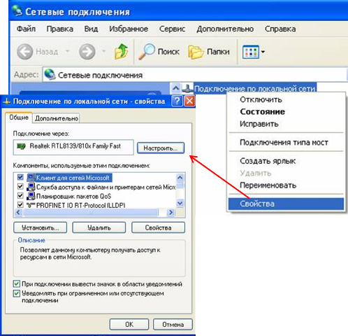

рис.д2.1. 

Налаштування роботи карти та драйверу Ethernet проводиться через кнопку "Настроить...". Зокрема на вкладці "Дополнительно" (рисд2.2) можна налаштувати швидкість передачі та тип з’єднання (LinkSpeed/DuplexMode), вручну виставити MAC-адресу (NetworkAddress), налаштувати параметри мічення кадрів VLAN (802.1Q/1p VLAN Tagging).  

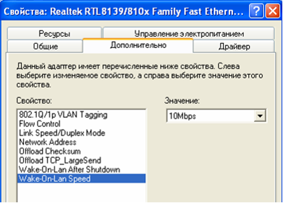

Рис.д2.2. Вікно додаткових властивостей мережної карти

У списку компонентів для вказаного підключення вказані служби та драйвери протколів, які інстальовані для нього. Для мережних карт Ethernet (а також IEEE 802.11 WiFi) на комп’ютері з ОС Windows, разом з системою автоматично інсталюються драйвери TCP/IP, які можна налаштувати нажавши кнопку "Свойства", після вибору даного пункту (рис.д2.3). 

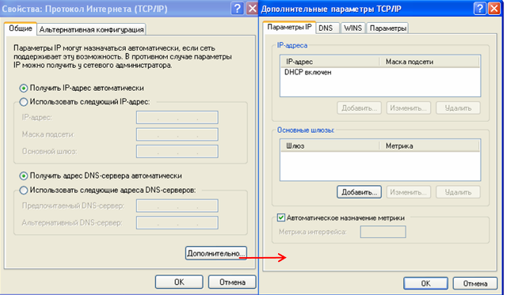

Рис.д2.3. Налаштування протколу TCP/IP.

Основні властивості протколу TCP/IP налаштовуються у вікні "Общие" (рис.д2.3). IP-адресу можна задати статично ("Использовать следующий IP-адрес") або вказати динамічний режим ("Получить IP-адрес автоматически"), при якому адреса буде видаватися DHCP-сервером. При статичній адресації крім самої IP-адреси треба задати маску підмережі, та адресу основного шлюзу (маршрутизатору), при необхідності міжмережного з’єднання. У налаштуваннях вказується також два первинні DNS-сервери, через які проводиться отримання адрес по доменному імені. 

Для розширеного налаштування протоколу необхідно визвати вікно додаткових параметрів (кнопка "Дополнительно").

Для відображення стану роботи мережі можна скористуватися кнопкою "Состояние" в контекстному меню вибраного підключення. Там вказується активні налаштування IP, МАС-адреса, швидкість і т.д (рис.д2.4). 

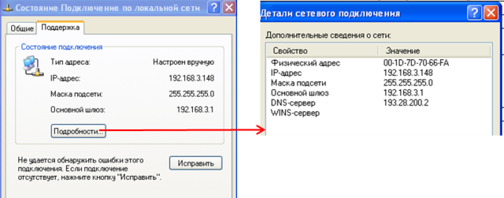

 Рис.д2.4 Вікна відображення стану роботи мережі.

Для Windows 10 до налаштування карти та відображення стану можна зробити через панель керування або провідник, наприклад як це показано на рис.д2.5.

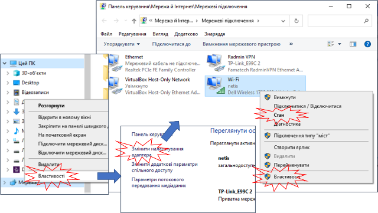

 Рис.д2.5. Доступ да налаштувань мережної карти Windows 10

#### Утиліта IPCONFIG 

Утиліта служить для відображення всіх плинних параметрів мережі TCP/IP та оновлення параметрів DHCP та DNS. При виклику команди `ipconfig` без параметрів виводяться тільки IP-адреса, маска підмережі та основний шлюз для кожного мережного адаптеру. Синтаксис для Winxp:

```
ipconfig [/all] [/renew [адаптер]] [/release [адаптер]] [/flushdns] [/displaydns] [/registerdns] [/showclassid адаптер] [/setclassid адаптер [код_класу]]
```

  Таб. Д2.1. Параметри команди ipconfig.

| Параметр                        | Призначення параметру                                        |
| ------------------------------- | ------------------------------------------------------------ |
| /?                              | виводить довідку по використанню                             |
| /all                            | Виведення повної конфігурації TCP/IP для всіх адаптерів. Адаптери  можуть представляти собою як фізичні інтерфейси (мережні карти), так і  логічні інтерфейси (підключення віддаленого доступу) |
| /renew [адаптер]                | Оновлення конфігурації DHCP для всіх адаптерів (якщо  адаптер на заданий) або для заданого адаптеру. Даний параметр доступний  тільки для адаптерів, налаштованих на отримання IP-адрес. |
| /release [адаптер]              | Відправка повідомлення DHCPRELEASE серверу DHCP для  вивільнення поточної конфігурації DHCP та видалення конфігурації IP-адрес для  всіх адаптерів (якщо адаптер не заданий) або для заданого адаптеру. |
| /flushdns                       | Скидання та очистка вмісту кешу зіставлених імен DNS  клієнта. Під час усунення неполадок DNS цю процедуру виконують для видалення  з кешу записів зіставлення |
| /displaydns                     | Відображення змісту кешу зіставлення імен DNS клієнту,  завантажених з файлу Hosts, та останні отримані записи ресурсів. Ця  інформація використовується службою DNS-клієнту для швидкого зіставлення  частих імен без звернення до DNS-серверу |
| /registerdns                    | Динамічна реєстрація вручну імен DNS та IP-адрес,  налаштованих на ПК. Цей параметр корисний при усуненні неполадок у випадку  відмови в реєстрації імені DNS або при виявленні причин неполадок динамічного  оновлення між клієнтом та DNS-сервером без перевантаження клієнту. |
| /showclassid адаптер            | Відображення коду класу DHCP для вказаного адаптеру. Щоб  подивитися для всіх адаптерів, замість адаптеру вказується зірочка ().  Даний параметр доступний тільки для адаптерів, налаштованих на отримання  IP-адрес. |
| /setclassid адаптер [код_класу] | Завдання коду класу DHCP для вказаного адаптеру. Щоб  задати для всіх адаптерів, замість адаптеру вказується зірочка ().  Даний параметр доступний тільки для адаптерів, налаштованих на отримання  IP-адрес. Якщо код класу DHCP не заданий, плинний код класу видаляється. |

 Якщо ім’я адаптеру містить пробіли, його треба брати в лапки.  

Приклади:

Виведення основної конфігурації TCP/IP для всіх адаптерів:

```bash
ipconfig
```

Виведення повної конфігурації TCP/IP для всіх адаптерів:

```bash
ipconfig /all
```

Відновлення конфігурації IP-адреси, призначеної DHCP-сервером для адаптеру `Wireless LAN adapter Wi-Fi`

```bash
ipconfig /renew "Wireless LAN adapter Wi-Fi"
```

Скидання кешу зіставлення імен DNS при наявності неполадок: 

```bash
ipconfig /flushdns
```

Виведення коду класу DHCP для всіх адаптерів з іменами, які починаються зі слова "Подключение":

```
ipconfig /showclassid Подключение*
```

Задавання коду класу DHCP " TEST " для адаптеру "Подключение по локальной сети":

```
ipconfig /setclassid "Подключение по локальной сети" TEST
```

#### Утиліта TRACERT 

Діагностична утиліта TRACERT визначає маршрут до місця призначення, відсилаючи ехо-запити ICMP з різними значеннями TTL, постійно збільшуючи їх. Враховуючи, що кожний маршрутизатор зменшує значення поля TTL, при 0-му значенні він відсилає ICMP-відповідь з помилкою нульового часу життя. На кожному кроці TRACERT фіксує адресу маршрутизатору та час відправки і відповіді. Процес повторюється до тих пір, поки пакет не досягне цільового вузу. При отриманні відповіді від цього вузла, процес трасування вважається закінченим. На монітор виводиться упорядкований список адрес маршрутизаторів на шляху.

Слід зазначити, що деякі маршрутизатори не відсилають повідомлень про закінчення часу для пакетів з нульовими значеннями TTL і тому не видимі для команди tracert. У цьому випадку для даного переходу відображається ряд зірочок (`*`).

Щоб виконати трасування маршруту, вивести значення затримки розповсюдження по мережі і втрат пакету на кожному маршрутизаторі та вузлі в мережі, необхідно використовувати команду pathping. 

Синтаксис:

```
tracert [-d] [-h максимальна_кількість_переходів] [-j список_вузлів] [-w інтервал] [ім’я_кінцевого_комп’ютера] 
```

  Таб.Д2.2. Параметри команди tracert.

| Параметр                           | Призначення параметру                                        |
| ---------------------------------- | ------------------------------------------------------------ |
| /?                                 | виводить довідку по  використанню                            |
| -d                                 | Запобігає намагання команди  tracert отримувати імена проміжних маршрутизаторів по їх адресі. Збільшує  швидкість виводу результатів |
| -h максимальна_кількість_переходів | Задає максимальну кількість  переходів на шляху при пошуку кінцевого об’єкту. Значення по замовченню  дорівнює 30 |
| -j список_вузлів                   | Вказує для повідомлень з  ехо-запитом використання параметру вільної маршрутизації в заголовку IP з  набором проміжних місць призначення, вказаних в списку вузлів. При вільній  маршрутизації успішні проміжні місця призначення можуть бути розділені одним  або декількома маршрутизаторами. Максимальна кількість адрес або імен в  списку – 9. Список адрес представляє набор IP-адрес, розділених пробілами |
| -w інтервал                        | Визначає в мілісекундах час  очікування для отримання ехо-відповідей протоколу ICMP або ICMP-повідомлень  про закінчення часу, що відповідає даному ехо-запиту. Якщо повідомлення не  отримане протягом заданого часу, віводиться зірочка (). Таймаут по  замовченню 4000 (4 секунди) |
| ім’я_кінцевого_вузлу               | Задає точку призначення,  вказану IP-адресою або іменем вузла |

Приклади:

У наступному прикладі пакет повинен пройти два маршрутизатори (`157.54.48.1` та `11.1.0.67`) щоб досягнути вузла `11.1.0.1`. У цьому прикладі основний шлюз - `157.54.48.1` а IP-адреса маршрутизатору в мережі `11.1.0.0` - `11.1.0.67`.

```
C:\>tracert 11.1.0.1 
  Tracing route to 11.1.0.1 over a maximum of 30 hops
  1   2 ms   3 ms   2 ms 157.54.48.1
  2  75 ms  83 ms  88 ms 11.1.0.67
  3  73 ms  79 ms  93 ms 11.1.0.1
  Trace complete.    
```

​           

#### Утиліта Route 

Утиліта дає можливість вивести на екран або змінити записи в локальній таблиці IP-маршрутизації. 

Синтаксис:

route [-f] [-p] [команда [кінцева_точка] [mask маска_мережі] [шлюз] [metric метрика]] [if інтерфейс]]

Таб. Д2.3. Параметри команди route.

| Параметр          | Призначення параметру                                        |
| ----------------- | ------------------------------------------------------------ |
| /?                | виводить довідку по  використанню                            |
| -f                | очищує таблицю маршрутизації  від всіх записів, які не являються вузловими маршрутами (маршрути з маскою підмережі  255.255.255.255), мережним маршрутом на себе (адреса 127.0.0.0 і маска  255.0.0.0) або маршрутом багатоадресної розсилки (адреса 224.0.0.0 і маска 240.0.0.0);  при використанні даного параметру сумісно з однією із команд (таких, як add,  change  або delete) таблиця очищується перед виконанням команди |
| -p                | при використанні даного параметру з командою add  вказаний маршрут добавляється в реєстр та використовується для ініціалізації  таблиці IP-маршрутизації кожний раз при запуску протоколу TCP/IP; по замовченню  добавлені маршрути не зберігаються при запуску протоколу TCP/IP; при  використанні з командою print виводить на екран список  постійних маршрутів; всі інші команди ігнорують даний параметр; постійні  маршрути зберігаються в реєстрі HKEY_LOCAL_MACHINE\SYSTEM\CurrentControlSet\Services\Tcpip\Parameters\PersistentRoutes |
| команда           | вказує команду, яка буде запущена на віддаленій системі; в  наступній таблиці представлений список допустимих параметрів:  add – добавлення маршруту  change – зміна існуючого  маршруту  delete – видалення маршруту або  маршрутів  print– вивід маршруту або  маршрутів |
| кінцева_точка     | Визначає кінцеву точку маршруту. Кінцевою точкою може бути  мережна IP-адреса (де розряди в мережній адресі мають значення 0), IP-адресу  маршруту до вузла, чи значення 0.0.0.0 для маршруту по замовченню. |
| mask маска_мережі | Вказує маску мережі (маска підмережі) у відповідності з  точкою призначення. По замовченню 255.255.255.255. |
| шлюз              | Вказує IP-адресу пересилки або  настпуного переходу, по якому доступний набір адрес, визначений кінцевою  точкою і маскою підмережі. Для локально-підключених маршрутів підмережі,  адреса шлюзу — це IP-адреса, назначена інтерфейсу, який підключений до  підмережі. Для віддалених маршрутів, які доступні через один або декілька  маршрутизаторів, адреса шлюзу — безпосередньо доступна IP-адреса найближчого  маршрутизатору. |
| metric метрика    | Задає чисельну метрику вартості  маршруту (в межах від 1 до 9999) для маршруту, яка використовується при  виборі в таблиці маршрутизації одного або декількох маршрутів, найбільш  близько відповідного адресі призначення відправленого пакету. Вибирається  маршрут з найменшою метрикою. Метрика відображає кількість переходів,  швидкість проходження шляху, надійність шляху, пропускну здатність шляху і  засоби адміністрування |
| if интерфейс      | Вказує індекс інтерфейсу, через  який доступна точка призначення. Для виводу списку інтерфейсів та їх  відповідних індексів використовується команда route print. Значення індексів інтерфейсів можуть бути  як десяткові так і 16-кові. Перед 16-ковими номерами вводиться 0х.  У випадку, коли параметр if відсутній, інтерфейс визначається з адреси  шлюзу. |
|                   |                                                              |

 

Приклади:

Виведення на екран таблиці IP-маршрутизації:

```
route print
```

Виведення на екран маршрутів з таблиці IP-маршрутизації, які починаються з "10.*":

```
route print 10.*
```

Добавлення маршруту по замовченню з адресою стандартного шлюзу 192.168.12.1:

```
route add 0.0.0.0 mask 0.0.0.0 192.168.12.1
```

Добавлення маршруту до кінцевої точки 10.41.0.0 з маскою підмережі 255.255.0.0 і настпною адресою переходу 10.27.0.1:

```
route add 10.41.0.0 mask 255.255.0.0 10.27.0.1
```

Добавлення постійного маршруту до кінцевої точки 10.41.0.0 з маскою підмережі 255.255.0.0 і настпною адресою переходу 10.27.0.1:

```
route -p add 10.41.0.0 mask 255.255.0.0 10.27.0.1
```

Добавлення маршруту до кінцевої точки 10.41.0.0 з маскою підмережі 255.255.0.0 та настпною адресою переходу 10.27.0.1 та метрикою 7:

```
route add 10.41.0.0 mask 255.255.0.0 10.27.0.1 metric 7
```

Добавлення маршруту до кінцевої точки 10.41.0.0 з маскою підмережі 255.255.0.0 та наступною адресою переходу 10.27.0.1 та використанням індексу інтерфейсу 0х3:

```
route add 10.41.0.0 mask 255.255.0.0 10.27.0.1 if 0x3
```

Видалення маршруту до кінцевої точки 10.41.0.0 з маскою підмережі 255.255.0.0:

```
route delete 10.41.0.0 mask 255.255.0.0
```

Видалення всіх маршрутів з таблиці IP-маршрутизації, які починаються з "10.":

```
route delete 10.
```

Зміна наступної адреси переходу для маршруту з кінцевою точкою 10.41.0.0 і маскою підмережі 255.255.0.0 з 10.27.0.1 на 10.27.0.25:

```
route change 10.41.0.0 mask 255.255.0.0 10.27.0.25
```

#### Утиліта NetStat

Утиліта відображає активні підключення TCP, порти, які прослуховуються комп’ютером, статистику Ethernet, таблиці маршрутизації IP, статистику IPv4 (для протоколів IP, ICMP, TCP и UDP). Викликана без параметрів, команда netstat відображає підключення TCP.

Синтаксис:

```
netstat [-a] [-e] [-n] [-o] [-p протокол] [-r] [-s] [інтервал]
```

Таб.Д2.4. Параметри команди netstat.

| Параметр    | Призначення параметру                                        |
| ----------- | ------------------------------------------------------------ |
| /?          | виводить довідку по  використанню                            |
| -a          | виводить всі порти TCP та TCP та UDP,  які прослуховуються.  |
| -e          | виводить статистику Ethernet, наприклад кількість  відправлених та прийнятих байтів та пакетів; цей параметр може комбінуватися  з ключем -s. |
| -n          | виводить активні підключення TCP з відображенням адрес та  номерів портів в числовому форматі без визначення імен |
| -o          | виводить активні підключення TCP та включення коду процесу  (PID) для кожного підключення; цей параметр може комбінуватися з ключами -a,  -n та -p. |
| -p протокол | виводить підключення для протоколу, вказаного параметром протокол.  У цьому випдаку параметр протокол  може приймати значення `tcp`, `udp`, `tcpv6` або  `udpv6`.  Якщо даний параметр використовується з ключем `-s` для виводу  статистики по протоколу, параметр протокол может мати занчення `tcp`,  `udp`, `icmp`, `ip`, `tcpv6`, `udpv6`, `icmpv6` або `ipv6`. |
| -s          | виводить статистику по протоколу; по замовченню виводиться  статистика для протоколів TCP, UDP, ICMP та IP; параметр -p може використовуватися для  вказівки набору протоколів. |
| -r          | виводить зміст таблиці маршрутизації IP; ця команда  еквівалентна route print. |
| інтервал    | оновлення вибраних даних з інтервалом, визначеним  параметром інтервал (в секундах); нажимання CTRL+C зупиняє оновлення;  якщо параметр опущений netstat виводить дані тільки  один раз |
|             |                                                              |

Параметри вводяться через дефіс (-), а не косу (/). Команда Netstat виводить статистику для наступних об’єктів. 

- Протокол:  TCP або UDP;
- Локальні  адреси: IP-адреса локального комп’ютера та номер порту, який використовується; якщо порт не назначений, показується зірочка (`*`).
- Зовнішні адреси: IP-адреса віддаленого вузла та номер порту, який використовується; якщо порт не назначений, показується зірочка (`*`).
- (Стан):  вказівка стану підключення TCP. Можливі значення: `CLOSE_WAIT`, `CLOSED`, `ESTABLISHED`,      `FIN_WAIT_1`, `FIN_WAIT_2`, `LAST_ACK`, `LISTEN`, `SYN_RECEIVED`, `SYN_SEND`, `TIMED_WAIT`

Приклади:

Виведення статистики по Ethernet і по всім протоколам разом:

```
netstat -e -s
```

Виведення статистики тільки по протоколам TCP та UDP:

```
netstat -s -p tcp || udp
```

Виведення активних підключень TCP і кодів процесів (PID) кожні 5 секунд:

```
netstat -o 5
```

Виведення активних підключень TCP та кодів з використанням числового формату:

```
netstat -n -o
```

#### Утиліта nslookup

[nslookup](https://uk.wikipedia.org/wiki/Nslookup) - це утиліта, що надає користувачеві інтерфейс командного рядка для звернення до системи DNS. Дозволяє задавати різні типи запитів і запрошувати довільно вказані сервери. Її аналогом є утиліти `host` і `dig`. Розроблена у складі пакету BIND (для UNIX-систем). Утиліта портована на Windows безпосередньо фірмою Microsoft і поставляється разом з операційною системою. 

`nslookup` може працювати в інтерактивному режимі, коли спочатку запускається утиліта, а потім вводяться команди.  Наприклад:

```bash
C:\Users\user>nslookup
Default Server:  mail.startnet.com.ua
Address:  91.217.179.254

> ?
Commands:   (identifiers are shown in uppercase, [] means optional)
NAME            - print info about the host/domain NAME using default server
NAME1 NAME2     - as above, but use NAME2 as server
help or ?       - print info on common commands
set OPTION      - set an option
    all                 - print options, current server and host
    [no]debug           - print debugging information
    [no]d2              - print exhaustive debugging information
    [no]defname         - append domain name to each query
    [no]recurse         - ask for recursive answer to query
    [no]search          - use domain search list
    [no]vc              - always use a virtual circuit
    domain=NAME         - set default domain name to NAME
    srchlist=N1[/N2/.../N6] - set domain to N1 and search list to N1,N2, etc.
    root=NAME           - set root server to NAME
    retry=X             - set number of retries to X
    timeout=X           - set initial time-out interval to X seconds
    type=X              - set query type (ex. A,AAAA,A+AAAA,ANY,CNAME,MX,NS,PTR,SOA,SRV)
    querytype=X         - same as type
    class=X             - set query class (ex. IN (Internet), ANY)
    [no]msxfr           - use MS fast zone transfer
    ixfrver=X           - current version to use in IXFR transfer request
server NAME     - set default server to NAME, using current default server
lserver NAME    - set default server to NAME, using initial server
root            - set current default server to the root
ls [opt] DOMAIN [> FILE] - list addresses in DOMAIN (optional: output to FILE)
    -a          -  list canonical names and aliases
    -d          -  list all records
    -t TYPE     -  list records of the given RFC record type (ex. A,CNAME,MX,NS,PTR etc.)
view FILE           - sort an 'ls' output file and view it with pg
exit            - exit the program
```

Команда `?` - виводить допомогу

Приклад режиму командного рядку для виведення IP-адреси `nuft.edu.ua`:

```bash
C:\Users\user>nslookup nuft.edu.ua
Server:  mail.startnet.com.ua
Address:  91.217.179.254

Non-authoritative answer:
Name:    nuft.edu.ua
Address:  193.28.200.16
```

 Спочатку виводиться DNS-сервер, з яким відбувається спілкування. Потім виводиться результат запиту.

 Приклад режиму командного рядку для виведення доменного імені по IP-адресі `8.8.8.8`:

```
Name:    dns.google
Address:  8.8.8.8
```

### Додаток 2.2. Мережні протоколи.

#### Д.2.2.1.Ethernet та 802.1

На сьогоднішній день існує два формати кадрів Ethernet: кадри DIX Ethernet II та IEEE 802.3. Вони ідентичні по кількості та довжині полів (рис.Д2.6), однак є відмінності в змісті полів та їх інтерпретації станціями, які відправляють та отримують кадри. Враховуючи це, будь яка станція може відправити будь який з цих кадрів. Відрізняється структура преамбули, однак наповнення та інтерпретація цієї частини буде однаковою. Поля адреси призначення та адреси відправника однакові і призначені для адресації за допомогою МАС-адреси (також називається фізичною адресою\). 

Призначення поля – довжина/тип (які також називаються EtherType) дещо відрізняються в стандартах. Для DIX це поле описує тип PDU вищого рівня (мережного), який переноситься даним кадром. Наприклад $800_{16}$ вказує, що кадр використовується для пакету IP. В кадрі IEEE 802.3 дане поле використовується як для вказівки типу PDU, так і для опису довжини кадру. Якщо значення цього поля < $600_{16}$, воно вказує на довжину поля даних, а в іншому випадку на тип протоколу даних. 

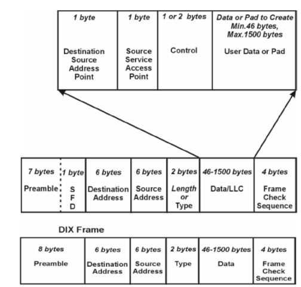

Рис.Д2.6. Структура кадрів IEEE 802.3 та Ethernet II

#### Д.2.2.2.IPv4

ІР (Internet Protocol) – протокол мережного рівня, який служить для об’єднання сегментів мережі в єдину мережу, забезпечуючи доставку пакетів даних між будь-якими вузлами мережі через довільну кількість проміжних вузлів (маршрутизаторів). IP не гарантує надійну доставку пакету до адресату – зокрема, пакети можуть прийти не в тому порядку, в якому були відправлені, продублюватися (приходять дві копії одного пакету), буди пошкодженими, або взагалі не прийти. Надійність доставки може гарантувати протоколи верхнього рівня (наприклад TCP). 

На сьогоднішній день існує дві версії протоколу ІР: IPv4 та IPv6. Хоч остання версія більш перспективна, поки що як правило користуються IPv4, тому надалі буде розглядатися тільки цей протокол. 

У IPv4 для адресації пристроїв відправників та отримувачів використовуються унікальні 32-бітні (4-байтові) ІР-адреси\. Якщо пункт призначення знаходиться в тій самій підмережі (сегменті мережі), що і вузол-відправник, то ІР пакет відправляється безпосередньо йому, якщо ні – то маршрутизатору, який повинен знаходитися в цій самій підмережі. Інтерфейс IP-підключення вузла до мережі часто називають хостом\. Тому слова "хост" і "вузол мережі IP" являються синонімами.  

Для виділення підмережі з IP адреси, вузлу необхідно знати, скільки біт буде використано в якості ідентифікатору підмережі і скільки для ідентифікатору самого вузлу. Це визначається за допомогою маски підмережі. Маска підмережі (subnet mask) - це 32-бітне значення, яке вміщує біти, встановлені в одиницю для ідентифікатору підмережі, і біти, встановлені в нуль для ідентифікатору вузла. Наприклад, якщо вказана IP-адреса 192.168.9.134 та маска 255.255.255.0, то перші 24 біти будуть вказувати на номер під мережі, тобто 192.168.9 а останні 8 біт на номер вузла в мережі, тобто 134. Альтернативний вигляд запису цієї ж адреси з маскою - 192.168.9.134/24, де 24 – це кількість біт, що виділяються під адресу підмережі. 

Серед IP-адрес є зарезервовані для спеціального призначення. 

Приватні IP-адреси (англ. private IP address) – які також називаються внутрішніми, внутрі-мережними, локальними або "сірими" – це IP-адреси, які належать до спеціального діапазону, що не використовуються в Інтернет. Такі адреси призначені для застосування в локальних мережах, розподіл таких адрес ніким не контролюється. У зв’язку з дефіцитом вільних IP-адрес, провайдери часто роздають своїм абонентам саме внутрішні мережні адреси.

Наступні діапазони визначені IANA як адреси, виділені локальним мережам:

- 10.0.0.0 - 10.255.255.255 (маска підмережі 255.0.0.0)
- 172.16.0.0 - 172.31.255.255 (маска підмережі 255.240.0.0)
- 192.168.0.0 - 192.168.255.255 (маска підмережі 255.255.0.0)

Для створення адреси зворотного зв’язку (петлі) зарезервований діапазон 127.0.0.0 — 127.255.255.255. Пакет відправлений протоколом верхнього рівня на будь-яку адресу з цього діапазону повинна повертатися на цей же вузол. На практиці як правило використовують тільки 127.0.0.1/32. 

До даних верхнього рівня реалізація протоколу IP добавляє заголовок, поля якого показані на рис.Д2.7.

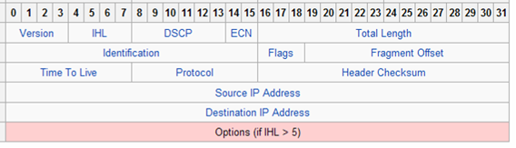

Рис.Д2.7. IP-датаграма, поля IP-заголовку.

Серед всіх полів заголовку окремо виділимо TOS, TTL, протокол, IP-адреси та опції.

DSCP або ToS - (тип сервісу - type-of-service) вміщує біти-прапорці, які характеризують особливість сервісу: мінімальна затримка, максимальна пропускна здатність, максимальна надійність і мінімальна вартість. Тільки один із цих бітів може бути в стані "1". Якщо всі біти дорівнюють "0", то при передачі IP-датаграми використовується звичайний сервіс. 

TTL – (час життя - time-to-live) вміщує максимальну кількість пересилань (маршрутизаторів), через які може пройти датаграма. Це поле обмежує час життя датаграми, так як це значення зменшується на 1 кожним маршрутизатором, який обробляє цю датаграму. Коли значення поля досягає 0, датаграма знищується, а відправнику повідомляється про це ICMP-повідомленням. Такий алгоритм запобігає за циклюванню пакетів в маршрутизації.  

Поле протоколу використовується для визначення протоколу верхнього рівня, дані якого пересилає дана IP-датаграма. 

IP-адреса відправника (Source IP Address\) та IP-адреса отримувача (Destination IP Address\) в протколі IPv4 задається в 32-біному форматі. 

Поле опцій (options\) – це список додаткової інформації. На сьогоднішній день найбільш популярні опції: безпека і обробка обмежень, запис кожного маршруту та IP адреси, відмітка часу (запис кожного маршруту, його IP адреси, відмітки часу), вільна маршрутизація від джерела, жорстка маршрутизація від джерела. 

#### Д.2.2.3. IP-маршрутизація 

Більшість операційних систем на сьогоднішній час можуть бути скнофігуровані таким чином, щоб виступати в якості маршрутизатору. Для операційних систем Windows XP маршрутизація включається через реєстр. 

```
HKEY_LOCAL_MACHINE\SYSTEM\CurrentControlSet\Services\Tcpip\Parameters
Ім’я параметра: IPEnableRouter.
Тип значення: REG_DWORD.
Значення: 1
```

Є можливість вказати простий алгоритм маршрутизації, який буде використовуватися як хостом так і маршрутизатором. Основна фундаментальна різниця між хостом і маршрутизатором заключається в тому, що хост ніколи не перенаправляє датаграми з одного мережного інтерфейсу на інший, тоді як маршрутизатор перенаправляє. 

У відповідності з загальною схемою, IP може отримувати датаграми від власних рівнів TCP, UDP, ICMP та IGMP (тобто датаграм які формуються тут же), які необхідно відправити, однак датаграми можуть бути прийняті з якого-небудь мережного інтерфейсу (ці датаграми повинні бути перенаправлені). IP рівень має в пам’яті таблицю маршрутизації, яку він переглядає кожний раз при отриманні датаграми, яку необхідно перенаправити. Коли дата грама прийнята з мережного інтерфейсу, IP по перше перевіряє, чи не належить йому вказана IP-адреса призначення або чи не являється ця IP адреса широкомовною. Якщо це так, то датаграма поставляється в модуль протоколу, вказаний в полі протоколу в IP заголовку. Якщо датаграма не призначена для цього IP рівня, якщо IP рівень був сконфігурований для того щоб працювати як маршрутизатор, пакет перенаправляється (в цьому випадку датаграма обробляється як вихідна) інакше датаграма знищується.

Кожний пункт таблиці маршрутизації вміщує наступну інформацію:

Таб. Д2.5. Інформація в таблиці маршрутизації.

|                                                              |                                                              |
| ------------------------------------------------------------ | ------------------------------------------------------------ |
| IP-адреса призначення                                        | Це може бути як повна адреса  хоста (host address) або адреса мережі (network address), що вказується в  полі прапорців. Адреса хоста має ненульове значення ідентифікатору хоста і  вказує на один конкретний хост, тоді як адреса мережі має ідентифікатор  хоста, встановлений в 0, і вказує на всі хости, включені в певну мережу |
| IP-адреса маршрутизатора  наступної пересилки(next-hop router) | Це IP адреса безпосередньо  підключеної мережі. Маршрутизатор наступної пересилки належить одній із  безпосередньо підключених мереж, в яку ми можемо відправити датаграми для їх  доставки. Маршрутизатор наступної пересилки це не кінцевий пункт призначення,  однак він приймає датаграми, які ми відсилаємо, і перенаправляє їх в напрямку  кінцевого пункту. |
| Прапорці                                                     | Один прапорець вказує, чи  являється IP адреса пункта  призначення, адресою мережі чи адресою хоста. Інший прапорець вказує на те,  чи являється маршрутизатор наступнї пересилки дійсно маршрутизатором чи це  безпосередньо підключений інтерфейс. |
| Вказівка на мережний інтерфейс                               | Вказівка на те, який мережний  інтерфейс повинен бути переданий датаграмі для передачі |

IP-маршрутизація відбувається за принципом пересилка-за-пересилкою. Як ми можемо побачити з таблиці маршрутизації, IP не знає повний маршрут до пункту призначення (за виключенням тих пунктів призначення, які безпосередньо підключені до відправляючого хоста). Все, що може надати IP маршрутизація – це IP адреса маршрутизатора наступної пересилки, на який посилається датаграма. При цьому робиться припущення, що маршрутизатор наступної пересилки ближче до пункту призначення, ніж відправляючий хост. Також робиться припущення, що маршрутизатор наступної пересилки напряму підключений до відправляючого хоста. 

IP маршрутизація проводить наступні дії:

1. Проводить пошук в таблиці маршрутизації, при цьому шукається пункт, який співпадає з повною адресою пункта призначення (повинен співпасти ідентифікатор мережі та ідентифікатор хоста). Якщо пункт знайдений в таблиці маршрутизації, пакет відправляється на вказаний маршрутизатор наступної пересилки або на безпосередньо підключений інтерфейс (в залежності від поля прапорців). Як правило, так визначаються канали точка-точка, при яких інший кінець такого каналу, як правило являється повною IP адресою віддаленого хоста.

2. Відбувається пошук в таблиці маршрутизації пункта, який співпадає, як мінімум з ідентифікатором мережі призначення. Якщо пункт знайдений, пакет відсилається на вказаний маршрутизатор наступної пересилки або на безпосередньо підключений інтерфейс (в залежності від поля прапорців). Маршрутизація до всіх хостів, які находяться в мережі призначення, відбувається з використанням цього єдиного пункту таблиці маршрутизації. Наприклад, всі хости локальної мережі Ethernet представляються в таблиці маршрутизації саме таким чином. Ця перевірка співпадіння ідентифікатору мережі відбувається з використанням можливої маски підмережі. 

3. У таблиці маршрутизації шукається пункт, помічений "по замовченню" (default). Якщо пункт знайдений, пакет відсилається на вказаний маршрутизатор по замовченню.  

Якщо жоден з пунктів не дає позитивного результату, датаграма вважається недоставленою. Якщо недоставлена датаграма була сгенерована даним хостом, то як правило повертається помилка "Хост недоступний" (host unreachable) або "мережа недоступна" (network unreachable). Цей код помилки повертається прикладній програмі, яка сгенерувала датаграму. 

Напочатку завжди відбувається порівняння на співпадіння повної адреси хоста, після чого відбувається порівняння ідентифікатору мережі. Тільки в цьому випадку, якщо результат обидвох порівнянь негативний, використовується маршрут за замовченням. 

#### Д.2.2.6.ICMP

ICMP (Internet Control Message Protocol ) – мережний протокол, який входить в стек протоколів TCP/IP. У основному ICMP використовується для передачі повідомлень про помилки та інші нештатні ситуації які виникають при передачі даних, наприклад, коли послуга недоступна, або хост чи маршрутизатор не відповідають. Також на ICMP накладаються деякі сервісні функції. 

Підтримка протоколу ICMP обов’язкова при реалізації стеку TCP/IP. ICMP-пакети інкапсулюються в IP-пакети (рис.Д2.10). Теперішня версія ICMP для IPv4 називається `ICMPv4`, для IPv6 - `ICMPv6`. 

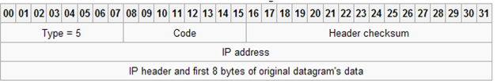

Рис.Д2.10. Формат повідомлення ICMP.

Всі ICMP-повідомлення вміщують заголовок (ICMP header), який складається з трьох полів: 

- 1 – тип повідомлення (`TYPE`): 1 байт;

- 2 - код (`CODE`): 1 байт;
- 3 – контрольна сума (`CHECKSUM`): 2 байти;

В залежності від типу, поле повідомлення ICMP має різний зміст. 

Таблиця Д2.6.

| Type | Code | Опис                                                         |
| ---- | ---- | ------------------------------------------------------------ |
| 0    | 0    | ехо-відповідь                                                |
| 3    |      | Помилка - пункт призначеннянедоступний:                      |
|      | 0    | мережа недоступна                                            |
|      | 1    | вузол недосутпний                                            |
|      | 2    | протокол недосутпний                                         |
|      | 3    | порт недоступний                                             |
|      | 4    | необхідна фрагментація привстановленому прапорці "не фрагментувати" |
|      | 5    | не працює маршрутизація відджерела                           |
|      | 6    | невідома мережа призначення                                  |
|      | 7    | невідомий вузол призначення                                  |
|      | 8    | вузол-джерело ізольований                                    |
|      | 9    | мережа призначення закритаадміністратором                    |
|      | 10   | вузол призначення закритийадміністратором                    |
|      | 11   | мережа недоступна для ToS(типу сервісу)                      |
|      | 12   | вузол недоступний для ToS (типусервісу)                      |
|      | 13   | зв’язок адміністративно закритийшляхом фільтрації            |
|      | 14   | порушено порядок віддачіпереваги вузлів                      |
|      | 15   | старшинство роз’єднане                                       |
| 4    | 0    | помилка: здержуванняджерела – датаграми приходять частіше, ніж можуть бути оброблені |
| 5    |      | помилка: перенаправлення                                     |
|      | 0    | перенаправлення в мережу                                     |
|      | 1    | перенаправлення до вузлу                                     |
|      | 2    | перенаправлення для типу сервісу                             |
|      | 3    | перенаправлення для типу сервісу і вузлу                     |
| 8    | 0    | ехо-запит                                                    |
| 9    | 0    | об’ява маршрутизатору:пересилка маршрутизатором своєї адреси та адрес інших доступних в під мережімаршрутизаторів |
| 10   | 0    | запит маршрутизатору: запитна отримання адреси доступного в підмережі маршрутизатору |
| 11   |      | помилка часу                                                 |
|      | 0    | час життя стало рівним 0 впроцесі передачі                   |
|      | 1    | час життя стало рівним 0 впроцесі повторної збірки           |
| 12   |      | помилка - проблеми зпараметрами                              |
|      | 0    | неправильний IP заголовок                                    |
|      | 1    | відсутня необхідна опція                                     |
| 13   | 0    | запит відмітки часу (вмілісекундах від опівночі)             |
| 14   | 0    | відповідь з відміткою часу                                   |
| 15   | 0    | інформаційний запит                                          |
| 16   | 0    | інформаційна відповідь                                       |
| 17   | 0    | запит маски адреси                                           |
| 18   | 0    | відповідь з маскою адреси                                    |

#### Д.2.2.7.ARP 

ARP (англ. Address Resolution Protocol — проткол визначення адреси) — проткол в комп’ютерних мережах, призначений для визначення MAC адреси за відомою IP адресою.

Функціонування ARP розглянемо на прикладі. Комп’ютер А (IP адреса 10.0.0.1) та комп’ютер Б (IP адрес 10.22.22.2) з’єднані мережею Ethernet. Комп’ютер А хоче відіслати пакет даних на комп’ютер Б, IP адреса комп’ютера Б йому відома. Однак мережа Ethernet, якою вони з’єднані, не працює з IP-адресами, тому комп’ютеру А для забезпечення передачі через Ethernet потребується дізнатися адресу комп’ютера Б в мережі Ethernet (MAC адреса в термінах Ethernet). Для цієї задачі використовується протокол ARP. За цим протколом комп’ютер А відправляє широкомовний запит, адресований усім комп’ютерам в одному сегменті Ethernet. Суть запиту «комп’ютер с IP адресою 10.22.22.2, повідомте свою MAC адресу комп’ютеру з IP адресою 10.0.0.1». Мережа Ethernet доатсвляє цей запит всім пристроєм у тому ж сегменті Ethernet, в тому числі і комп’ютеру Б. Комп’ютер Б відповідає комп’ютеру А на запит і повідомляє свою MAC адресу (напр. 00:ea:d1:11:f1:11) Тепер, отримав MAC адресу комп’ютера Б, комп’ютер А може передавати йому будь які дані через мережу Ethernet.

На рис.Д2.11 показана структура пакету, який використовується в запитах і відповідях ARP. У мережах Ethernet в цих пакетах використовується EtherType 0x0806, та розсилається широкомовно MAC-адреса — FF:FF:FF:FF:FF:FF. 

- Hardware type (HTYPE) – номер(код) протоколу канального рівня; для Ethernet=0x0001.
- Protocol type (PTYPE) – номер(код) мережного протоколу; для IPv4=0x0800.
- Hardware length (HLEN) – довжина адреси для канального рівня в байтах; адреси Ethernet мають довжину 6 байт.
- Protocol length (PLEN) – довжина адреси мережного рівня в байтах; для IPv4 = 4 байта.
- Operation - код операції відправника: 1 у випадку запиту і 2 у випадку відповіді.
- Sender hardware address (SHA) – фізична адреса відправника (для Ethernet - MAC-адреса).
- Sender protocol address (SPA)  - логічна адреса відправника (для IP – IP адреса)
- Target hardware address (THA)  - фізична адреса отримувача (для Ethernet - MAC-адреса): при запиті поле порожнє;
- Target protocol address (TPA) - логічна адреса отримувача (для IP – IP адреса)

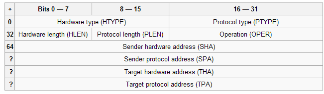

Рис.Д2.11. Формат повідомлення ARP.

У рамках протоколу ARP можливі пакети з самозверненням (gratuitous ARP). При такому запиті ініціатор формує пакет, де в якості IP використовується його власна IP-адреса. Це буває потрібно, коли відбувається стартова конфігурація мережного інтерфейсу. У такому запиті IP-адреси відправника і отримувача співпадають. 

Запити с самозверненням дозволяють вузлам вирішити дві проблеми. По-перше, визначити, чи немає в мережі об’єкту який має ту ж IP-адресу. Тобто при старті пристрою, він формує gratuitous ARP. Якщо на такий запит прийде відклик, то вузол видасть повідомлення про однакову IP-адресу. 

По-друге, у випадку заміни мережної карти проводиться коригування запису в АRP-таблицях вузлів, які вміщували стару МАС-адресу ініціатору. Вузол, який отримує ARP-запит з адресою, що вміщується в таблиці, повинен відновити цей запис.


Практичне заняття розробив [Олександр Пупена](https://github.com/pupenasan). 
