All original material copyright © 2007 by Aaron Balchunas (aaron@routeralley.com), unless otherwise noted. All other material copyright © of their respective owners. This material may be copied and used freely, but may not be altered or sold without the expressed written consent of the owner of the above copyright. Updated material may be found at http://www.routeralley.com.

Даний матеріал є дослівним перекладом з  https://lucidresource.com/guides/ospf.pdf

# OSPF (Open Shortest Path First)

**OSPF** — це стандартизований протокол маршрутизації типу стану каналу (Link-State), розроблений для ефективного масштабування та підтримки великих мереж.

OSPF дотримується таких характеристик протоколів стану каналу:

- OSPF використовує ієрархічну структуру мережі, що базується на областях (Areas).
- OSPF формує сусідські відносини (neighbor relationships) із суміжними маршрутизаторами в межах однієї області.
- Замість того щоб повідомляти про відстань до підключених мереж, OSPF повідомляє про стан безпосередньо підключених каналів за допомогою оголошень про стан каналу (Link-State Advertisements, LSAs).
- OSPF надсилає оновлення (LSAs), коли відбувається зміна будь-якого з його каналів, і при цьому передає лише інформацію про зміну. Крім того, LSAs оновлюються кожні 30 хвилин.
- Трафік OSPF передається багатоадресно (multicast) на адресу 224.0.0.5 (усі маршрутизатори OSPF) або 224.0.0.6 (усі призначені маршрутизатори — Designated Routers).
- OSPF використовує алгоритм Дейкстри (Dijkstra Shortest Path First) для визначення найкоротшого шляху.
- OSPF є безкласовим протоколом (classless protocol) і підтримує змінні маски підмереж (VLSM).

Інші характеристики OSPF:

- OSPF підтримує лише маршрутизацію IP.
- Маршрути OSPF мають адміністративну відстань (administrative distance) 110.
- OSPF використовує як метрику вартість (cost), що обчислюється на основі пропускної здатності каналу. OSPF не має обмеження за кількістю переходів (hop count).

Процес OSPF створює та підтримує три окремі таблиці:

- таблицю сусідів (neighbor table) — містить список усіх суміжних маршрутизаторів;
- таблицю топології (topology table) — містить список усіх можливих маршрутів до всіх відомих мереж у межах області;
- таблицю маршрутизації (routing table) — містить найкращий маршрут до кожної відомої мережі.

## Сусіди OSPF (OSPF Neighbors)

OSPF формує сусідські відносини, які називаються **суміжностями** (**adjacencies**), з іншими маршрутизаторами в межах тієї ж **області** (**Area**), обмінюючись **Hello-пакетами** через багатоадресну адресу 224.0.0.5. Лише після встановлення суміжності маршрутизатори можуть обмінюватися маршрутною інформацією.

Кожен маршрутизатор OSPF ідентифікується унікальним ідентифікатором маршрутизатора (**Router ID**). Router ID може визначатися трьома способами:

- Ідентифікатор маршрутизатора може бути вказаний вручну.
- Якщо його не задано вручну, то найвища IP-адреса, призначена будь-якому інтерфейсу типу Loopback на маршрутизаторі, стає Router ID.
- Якщо інтерфейсу Loopback не існує, то використовується найвища IP-адреса, призначена будь-якому фізичному інтерфейсу.

За замовчуванням Hello-пакети надсилаються через інтерфейси з увімкненим OSPF кожні 10 секунд для широкомовних (broadcast) і точка-до-точки (point-to-point) інтерфейсів, та кожні 30 секунд для неширокомовних (non-broadcast) і типу точка-до-множини (point-to-multipoint) інтерфейсів.

У OSPF також існує **інтервал недоступності** (**Dead Interval**), який вказує, як довго маршрутизатор чекатиме без отримання жодного Hello-пакета, перш ніж оголосить сусіда «**недоступним**» (**down**). За замовчуванням Dead Interval становить 40 секунд для широкомовних і точка-до-точки інтерфейсів, та 120 секунд для неширокомовних і точка-до-множини інтерфейсів. Зверни увагу, що за замовчуванням таймер Dead Interval у чотири рази більший за Hello Interval.

Ці таймери можна змінювати окремо для кожного інтерфейсу:

```
 Router(config-if)# ip ospf hello-interval 15
 Router(config-if)# ip ospf dead-interval 60
```

Маршрутизатори OSPF стануть сусідами лише якщо такі параметри всередині Hello-пакета ідентичні на кожному маршрутизаторі:

- Area ID
- Тип області (Area Type: stub, NSSA тощо)
- Префікс (Prefix)
- Маска підмережі (Subnet Mask)
- Hello Interval
- Dead Interval
- Тип мережі (Network Type: broadcast, point-to-point тощо)
- Аутентифікація (Authentication)

Hello-пакети також виконують роль keepalive-повідомлень, що дозволяють маршрутизаторам швидко виявляти, якщо сусід став недоступним. Крім того, Hello-пакети містять **поле сусідів** (**neighbor field**), у якому перелічені Router ID усіх маршрутизаторів-сусідів, з якими встановлено зв’язок.

**Таблиця сусідів** (**neighbor table**) створюється на основі отриманих Hello-пакетів і містить таку інформацію:

-  Router ID кожного сусіднього маршрутизатора;
-  поточний стан (state) кожного сусіднього маршрутизатора;
-  інтерфейс, що безпосередньо з’єднує з кожним сусідом;
-  IP-адресу віддаленого інтерфейсу кожного сусіда.

## Призначені маршрутизатори OSPF (OSPF Designated Routers)

У мережах із множинним доступом (multi-access), таких як Ethernet, можлива поява великої кількості сусідських відносин на одному фізичному сегменті. На прикладі чотири маршрутизатори підключені до одного сегмента з множинним доступом.

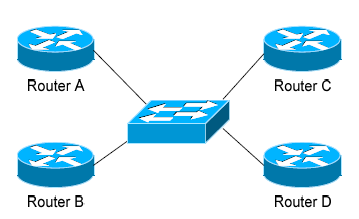

Якщо використати формулу, де «n» — кількість маршрутизаторів `n(n−1)/2` то очевидно, що для повністю з’єднаної мережі (fully meshed network) необхідно шість окремих суміжностей (adjacencies). Якщо збільшити кількість маршрутизаторів до п’яти, то вже буде потрібно десять окремих суміжностей. Це призводить до значного обсягу зайвого трафіку оголошень стану каналу (Link-State Advertisement, LSA).

Якщо один із каналів маршрутизатора `A` вийде з ладу, він розповсюдить цю інформацію всім своїм сусідам. Кожен із них, у свою чергу, знову поширить цю ж інформацію всім іншим сусідам. Це створює марне навантаження на пропускну здатність і процесори. Щоб запобігти цьому, OSPF обирає **призначений маршрутизатор** (**Designated Router**, **DR**) для кожної мережі з множинним доступом. Передача до DR здійснюється через багатоадресну адресу 224.0.0.6. Для забезпечення резервування також обирається **резервний призначений маршрутизатор** (**Backup Designated Router**, **BDR**).

Маршрутизатори OSPF формують суміжності лише з DR і BDR. Якщо в мережі відбувається зміна стану каналу, оновлення передається лише до DR, який далі поширює його всім іншим маршрутизаторам. Це суттєво зменшує обсяг розсилання LSA. Вибори DR і BDR визначаються за пріоритетом OSPF (OSPF priority) маршрутизатора, який задається окремо для кожного інтерфейсу (оскільки маршрутизатор може мати кілька інтерфейсів у різних мережах із множинним доступом). Маршрутизатор із найвищим пріоритетом стає DR, із другим за величиною — BDR. Якщо пріоритети однакові, то DR стає маршрутизатор із вищим Router ID.

Щоб змінити пріоритет на інтерфейсі:

```
 Router(config-if)# ip ospf priority 125
```

За замовчуванням пріоритет на маршрутизаторах Cisco дорівнює 1. Пріоритет 0 запобігає участі маршрутизатора у виборах DR або BDR.
 Примітка: процес виборів DR не є передавальним (non-preemptive). Отже, якщо до мережі буде додано маршрутизатор із вищим пріоритетом, він не замінить чинного DR автоматично. Тому маршрутизатор, який ніколи не повинен ставати DR, слід завжди налаштовувати з пріоритетом 0.


## Стани сусідів OSPF (OSPF Neighbor States)

Суміжності між сусідами (neighbor adjacencies) у OSPF проходять через кілька послідовних станів:

**Down** – означає, що маршрутизатор не отримував жодного Hello-пакета від сусіда.

**Init** – означає, що отримано Hello-пакет від сусіда, але двосторонній обмін ще не ініційовано.

**2-Way** – означає, що двосторонній зв’язок (bidirectional communication) встановлено. Нагадаємо, що Hello-пакети містять поле сусідів (neighbor field). Таким чином, зв’язок вважається двостороннім, коли маршрутизатор бачить власний Router ID у Hello-пакеті свого сусіда. Саме на цьому етапі відбуваються вибори призначеного (Designated Router, DR) та резервного призначеного маршрутизатора (Backup Designated Router, BDR).

**ExStart** – означає, що маршрутизатори готуються до обміну інформацією про стан каналів. Для цього між ними формується відношення “ведучий/ведений” (master/slave), щоб визначити, хто почне обмін.

**Exchange** – означає, що маршрутизатори обмінюються описами баз даних (Database Descriptors, DBDs). DBD містять опис топологічної бази даних маршрутизатора (Topology Database). Кожен маршрутизатор аналізує DBD свого сусіда, щоб визначити, чи має він нову інформацію для обміну.

**Loading** – означає, що маршрутизатори нарешті обмінюються оголошеннями про стан каналів (Link-State Advertisements, LSAs), які містять інформацію про всі канали, підключені до кожного маршрутизатора. Фактично, маршрутизатори діляться своїми таблицями топології (topology tables).

**Full** – означає, що маршрутизатори повністю синхронізовані. Таблиці топології всіх маршрутизаторів у межах області тепер мають бути ідентичними. Залежно від «ролі» сусіда, стан може відображатися так:

-  Full/DR – сусід є призначеним маршрутизатором (Designated Router)
-  Full/BDR – сусід є резервним призначеним маршрутизатором (Backup Designated Router)
-  Full/DROther – сусід не є ані DR, ані BDR

У мережі з множинним доступом (multi-access network) маршрутизатори OSPF формують повні суміжності (Full adjacency) лише з DR і BDR. Інші маршрутизатори (не-DR і не-BDR) також утворюють суміжності, але залишаються в стані 2-Way. Це нормальна поведінка OSPF.

## Типи мереж OSPF (OSPF Network Types)

Функціональність OSPF відрізняється залежно від типу топології мережі. Взаємодія OSPF із Frame Relay буде пояснена в окремому розділі.

**Broadcast Multi-Access** – тип топології, у якій підтримується широкомовлення (broadcast).

- Приклади: Ethernet, Token Ring, ATM.
- У цьому типі мереж OSPF обирає призначений (Designated Router, DR) та резервний призначений маршрутизатор (Backup Designated Router, BDR).
- Трафік, що надсилається до DR і BDR, передається багатоадресно (multicast) на адресу 224.0.0.6, а трафік від DR і BDR до інших маршрутизаторів — на адресу 224.0.0.5.
- Сусіди не потребують ручного визначення.

**Point-to-Point** – тип топології, у якій два маршрутизатори з’єднані безпосередньо один з одним.

- Приклад: з’єднання типу point-to-point T1.
- OSPF не обирає DR і BDR.
- Увесь трафік OSPF передається багатоадресно на адресу 224.0.0.5.
- Сусіди не потребують ручного визначення.

**Point-to-Multipoint** – тип топології, у якій один інтерфейс може з’єднуватися з кількома вузлами. Кожне з’єднання між джерелом і призначенням розглядається як окремий канал типу point-to-point.

- Приклад: Frame Relay у режимі Point-to-Multipoint.
- OSPF не обирає DR і BDR.
- Увесь трафік OSPF передається багатоадресно на адресу 224.0.0.5.
- Сусіди не потребують ручного визначення.

**Non-broadcast Multi-Access Network (NBMA)** – тип топології, у якій один інтерфейс може з’єднуватися з кількома вузлами, але широкомовні (broadcast) повідомлення не можуть передаватися через таку мережу.

- Приклад: Frame Relay.
- У цьому типі мереж OSPF обирає DR і BDR.
- Сусіди OSPF повинні бути визначені вручну, тому весь трафік OSPF передається уніадресно (unicast), а не багатоадресно.

Запам’ятай: у неширокомовних мережах (non-broadcast networks) сусіди мають бути вказані вручну, оскільки multicast Hello-пакети в таких мережах не дозволені.

## Налаштування типів мережі OSPF (Configuring OSPF Network Types)

Тип мережі OSPF за замовчуванням для базового Frame Relay — це неширокомовна мережа з множинним доступом (Non-broadcast Multi-access Network, NBMA). Для ручного налаштування:

```
Router(config)# interface s0
Router(config-if)# encapsulation frame-relay
Router(config-if)# frame-relay map ip 10.1.1.1 101
Router(config-if)# ip ospf network non-broadcast
Router(config)# router ospf 1
Router(config-router)# neighbor 10.1.1.1
```

Зверни увагу, що сусід (neighbor) вказаний вручну, оскільки у NBMA багатоадресна передача (multicast) не дозволена.
 Однак мережу Frame Relay можна «обманути», дозволивши широкомовлення, що усуває потребу у ручному визначенні сусідів:

```
Router(config)# interface s0
Router(config-if)# encapsulation frame-relay
Router(config-if)# frame-relay map ip 10.1.1.1 101 broadcast
Router(config-if)# ip ospf network broadcast
```

Зверни увагу, що тип мережі OSPF змінено на broadcast, а до команди `frame-relay map` додано параметр `broadcast`. Тепер не потрібно явно визначати сусідів, оскільки багатоадресна передача (multicast) дозволена через цю карту.

Тип мережі OSPF за замовчуванням для Ethernet і Token Ring — це широкомовна мережа з множинним доступом (Broadcast Multi-Access). Для ручного налаштування:

```
Router(config)# interface e0
Router(config-if)# ip ospf network broadcast
```

Тип мережі OSPF за замовчуванням для каналів T1 (HDLC або PPP) та Frame Relay у режимі точка-точка (Point-to-Point) — це Point-to-Point. Для ручного налаштування:

```
Router(config)# interface s0
Router(config-if)# encapsulation frame-relay
Router(config)# interface s0.1 point-to-point
Router(config-if)# frame-relay map ip 10.1.1.1 101 broadcast
Router(config-if)# ip ospf network point-to-point
```

Тип мережі OSPF за замовчуванням для Frame Relay у режимі Point-to-Multipoint також є NBMA.
 Однак OSPF підтримує додатковий тип мережі — **Point-to-Multipoint**, який дозволяє автоматичне виявлення сусідів. Для налаштування:

```
Router(config)# interface s0
Router(config-if)# encapsulation frame-relay
Router(config)# interface s0.2 multipoint
Router(config-if)# frame-relay map ip 10.1.1.1 101 broadcast
Router(config-if)# ip ospf network point-to-multipoint
```

Крім того, до команди `ip ospf network` можна додати параметр `non-broadcast`, якщо потрібно явно вказати, що це неширокомовна мережа:

```
Router(config)# interface s0
Router(config-if)# encapsulation frame-relay
Router(config)# interface s0.2 multipoint
Router(config-if)# frame-relay map ip 10.1.1.1 101
Router(config-if)# ip ospf network point-to-multipoint non-broadcast
Router(config)# router ospf 1
Router(config-router)# neighbor 10.1.1.1
```

Зверни увагу на відмінність у конфігурації: команда `frame-relay map` більше не містить параметра `broadcast`, оскільки широкомовлення та багатоадресна передача у неширокомовній мережі заборонені.

Отже, у конфігурації маршрутизатора OSPF сусідів знову потрібно вказувати вручну. Передача даних до них відбуватиметься уніадресно (unicast), а не багатоадресно (multicast).

Типи мережі OSPF мають бути однаковими на двох сусідніх маршрутизаторах, інакше суміжність (adjacency) між ними ніколи не буде встановлена.

## Ієрархія OSPF (The OSPF Hierarchy)

OSPF — це ієрархічна система, яка розділяє автономну систему (Autonomous System, AS) на окремі області (Areas). Трафік OSPF може бути трьох типів:

- **внутрішньообласний (intra-area)** — передається в межах однієї області,
- **міжобласний (inter-area)** — передається між різними областями,
- **зовнішній (external)** — походить з іншої автономної системи.

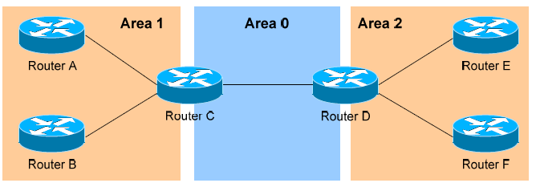

Маршрутизатори OSPF створюють базу даних топології (Topology Database), що містить інформацію про всі канали в межах своєї області. Усі маршрутизатори в одній області мають ідентичну базу топології. Маршрутні оновлення між цими маршрутизаторами містять лише інформацію про канали, що належать до їхньої області. Обмеження бази даних лише локальною інформацією зменшує споживання пропускної здатності та навантаження на процесор.

Область 0 є обов’язковою для функціонування OSPF і вважається магістральною областю (Backbone Area). Як правило, усі інші області повинні мати з’єднання з областю 0, хоча це правило можна обійти, використовуючи віртуальні зв’язки (virtual links), які будуть розглянуті далі. Область 0 часто називають транзитною областю (transit area), оскільки вона з’єднує всі інші області.

Маршрутизатори OSPF можуть належати до кількох областей, і тому вони мають окрему базу топології для кожної області. Такі маршрутизатори називаються прикордонними маршрутизаторами області (Area Border Routers, ABRs). Розглянемо приклад. Існує три області: `Area 0`, `Area 1` і `Area 2`.  `Area 0`,, як і раніше, є магістральною для цієї автономної системи.  `Area 1`, та  `Area 2`, повинні мати пряме з’єднання з областю 0. Маршрутизатори `A` і `B` повністю належать до `Area 1`, а маршрутизатори `E` і `F` — до `Area 2`. Такі маршрутизатори називаються внутрішніми (Internal Routers). Маршрутизатор `C` належить одночасно до `Area 0` і `Area 1`, отже, він є ABR. Оскільки він має інтерфейс в `Area 0`, його також можна вважати магістральним маршрутизатором (Backbone Router). Те саме стосується маршрутизатора `D`, який належить до `Area 0` і `Area 2`.

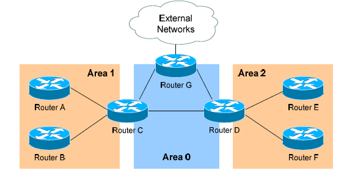

Тепер розглянемо приклад вище. До мережі додано маршрутизатор `G`, який належить до області 0 (`Area 0`). Однак маршрутизатор `G` також має з’єднання з Інтернетом, який знаходиться поза цією автономною системою (Autonomous System). Це робить маршрутизатор `G` прикордонним маршрутизатором автономної системи (Autonomous System Border Router, **ASBR**). Маршрутизатор може стати ASBR двома способами:

- підключенням до іншої автономної системи, наприклад до Інтернету;
- розповсюдженням (redistribution) маршрутів з іншого протоколу маршрутизації в процес OSPF.

Маршрутизатори ASBR забезпечують доступ до зовнішніх мереж.
 OSPF визначає два типи зовнішніх маршрутів (external routes):

- **Тип 2 (E2)** – включає лише зовнішню вартість (external cost) до мережі призначення. Зовнішня вартість — це метрика, яка рекламується ззовні домену OSPF. Це тип маршруту, який призначається за замовчуванням усім зовнішнім маршрутам.

- **Тип 1 (E1)** – включає як зовнішню вартість, так і внутрішню вартість (internal cost) до ASBR, щоб визначити загальну метрику до мережі призначення.
   Маршрути типу 1 завжди мають пріоритет над маршрутами типу 2 до тієї самої цільової мережі.

Отже, у протоколі OSPF існує чотири окремі типи маршрутизаторів:

- **Внутрішні маршрутизатори (Internal Routers)** – усі їхні інтерфейси належать лише до однієї області.
- **Прикордонні маршрутизатори області (Area Border Routers, ABRs)** – мають інтерфейси принаймні у двох різних областях.
- **Магістральні маршрутизатори (Backbone Routers)** – мають хоча б один інтерфейс в області 0.
- **Прикордонні маршрутизатори автономної системи (Autonomous System Border Routers, ASBRs)** – мають з’єднання з окремою автономною системою.

## LSA та база даних топології OSPF (LSAs and the OSPF Topology Database)

OSPF, як протокол маршрутизації типу стану каналу (link-state routing protocol), не покладається на принцип «маршрутизації за чутками» (routing-by-rumor), який використовують протоколи RIP та IGRP. Замість цього маршрутизатори OSPF відстежують стан каналів (links) у межах своїх областей. Канал — це просто інтерфейс маршрутизатора. На основі списку каналів і їхнього стану створюється база даних топології (topology database). Маршрутизатори OSPF розповсюджують оголошення про стан каналу (Link-State Advertisements, LSAs), щоб забезпечити узгодженість бази топології на всіх маршрутизаторах у межах однієї області.

Існує кілька типів LSA:

- Router LSA (Type 1) – містить список усіх локальних каналів маршрутизатора, а також їхній стан і «вартість» (cost). LSА типу 1 створюються всіма маршрутизаторами OSPF і поширюються (flooded) серед усіх інших маршрутизаторів у межах локальної області.
- Network LSA (Type 2) – створюється усіма призначеними маршрутизаторами (Designated Routers) у OSPF і містить список усіх маршрутизаторів, підключених до цього призначеного маршрутизатора.
- Network Summary LSA (Type 3) – створюється усіма прикордонними маршрутизаторами області (Area Border Routers, ABRs) у OSPF і містить список усіх мереж призначення в межах області. LSА типу 3 надсилаються між областями, щоб забезпечити міжобласну маршрутизацію (inter-area communication).
- ASBR Summary LSA (Type 4) – створюється ABR у OSPF і містить маршрут до будь-якого прикордонного маршрутизатора автономної системи (ASBR) у системі OSPF. LSА типу 4 надсилаються з ABR у його локальну область, щоб внутрішні маршрутизатори знали, як виходити за межі автономної системи.
- External LSA (Type 5) – створюється ASBR у OSPF і містить маршрути до мереж призначення, що розташовані за межами локальної автономної системи. LSА типу 5 також можуть бути у формі маршруту за замовчуванням (default route) до всіх зовнішніх мереж. LSА типу 5 поширюються у всі області системи OSPF.

- Мультиадресний OSPF (Multicast OSPF, MOSPF) використовує LSA типу 6, але це виходить за межі цього посібника.

- Далі в цьому розділі буде детально описано LSA типу 7 — NSSA External LSAs.

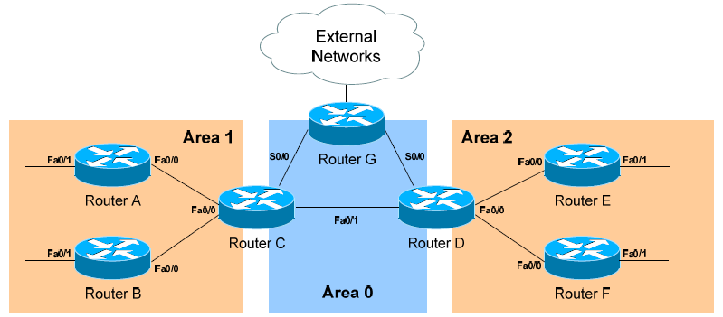


Із наведеного прикладу можна визначити таке:

- маршрутизатори A, B, E та F є внутрішніми маршрутизаторами (Internal Routers);
- маршрутизатори C і D є прикордонними маршрутизаторами області (Area Border Routers, ABRs);
- маршрутизатор G є прикордонним маршрутизатором автономної системи (Autonomous System Border Router, ASBR).

Усі маршрутизатори створюють оголошення про стан каналу маршрутизатора — Router LSA (Type 1). Наприклад, маршрутизатор A створить LSA типу 1, який міститиме стан каналів FastEthernet 0/0 і FastEthernet 0/1. Це LSA буде поширено (flooded) серед усіх інших маршрутизаторів у межах області 1. Призначені маршрутизатори (Designated Routers) створюють оголошення про стан мережі — Network LSA (Type 2). Наприклад, якщо маршрутизатор C буде обрано DR для мережі з множинним доступом у межах області 1, він створить LSA типу 2, що міститиме список усіх маршрутизаторів, підключених до нього.

Прикордонні маршрутизатори області (ABR) створюють оголошення про підсумок мережі — Network Summary LSA (Type 3).
 Наприклад, маршрутизатор C є ABR між областями 0 і 1, тому він надсилатиме LSA типу 3 в обидві області.
 LSA типу 3, надіслані в область 0, міститимуть список мереж, що належать до області 1, а також вартості (cost) для досягнення цих мереж.
 LSA типу 3, надіслані в область 1, міститимуть список мереж, що належать до області 0, а також усіх інших областей, підключених до області 0.
 Це дозволяє області 1 досягати будь-якої іншої області, а іншим областям — досягати області 1.

Прикордонні маршрутизатори області (ABR) також створюють оголошення про підсумок ASBR — ASBR Summary LSA (Type 4).
 Наприклад, маршрутизатор C надсилатиме LSA типу 4 в область 1, що міститиме маршрут до ASBR. Це дозволяє маршрутизаторам у межах області 1 знати шлях виходу за межі автономної системи (Autonomous System).

Прикордонні маршрутизатори автономної системи (ASBR) створюють зовнішні оголошення — External LSA (Type 5).
 Наприклад, маршрутизатор G створюватиме LSA типу 5, які міститимуть маршрути до мереж, що знаходяться за межами автономної системи. Ці LSA типу 5 розповсюджуються (flooded) до маршрутизаторів усіх областей.

Кожен тип LSA поширюється у трьох випадках:

- коли утворюється нова суміжність (adjacency);
- коли відбувається зміна у таблиці топології;
- коли LSA досягає свого максимального віку (за замовчуванням кожні 30 хвилин).

Отже, хоча OSPF зазвичай вважається протоколом, що надсилає оновлення лише при змінах, LSA все одно періодично оновлюються кожні 30 хвилин.

## Метрика OSPF (The OSPF Metric)

OSPF визначає найкращий (або найкоротший) шлях до мережі призначення за допомогою метрики вартості (cost), що базується на пропускній здатності (bandwidth) інтерфейсів. Загальна вартість маршруту є сумою вартостей усіх вихідних інтерфейсів уздовж шляху. Найменша вартість має пріоритет. У Cisco за замовчуванням для певних типів інтерфейсів застосовуються такі вартості:

| Тип інтерфейсу       | Вартість (Cost) |
| -------------------- | --------------- |
| Serial (56K)         | 1785            |
| Serial (64K)         | 1562            |
| T1 (1.544 Mbps)      | 64              |
| Token Ring (4 Mbps)  | 25              |
| Ethernet (10 Mbps)   | 10              |
| Token Ring (16 Mbps) | 6               |
| Fast Ethernet        | 1               |

На послідовних інтерфейсах (Serial interfaces) OSPF використовує налаштовану пропускну здатність (у кбіт/с) для обчислення вартості:

```
Router(config)# interface s0
Router(config-if)# bandwidth 64
```

За замовчуванням вартість інтерфейсу можна перевизначити вручну:

```
Router(config)# interface e0
Router(config-if)# ip ospf cost 5
```

Зміна вартості інтерфейсу може вплинути на те, який шлях OSPF вважатиме найкоротшим, тому робити це слід з великою обережністю. Щоб змінити спосіб, у який OSPF обчислює стандартні метрики для інтерфейсів, використовується команда:

```
Router(config)# router ospf 1
Router(config-router)# ospf auto-cost reference-bandwidth 100
```

У наведеній команді параметр `reference-bandwidth` має значення 100, що є стандартним за замовчуванням. Це означає, що канал зі швидкістю 100 Мбіт/с матиме вартість 1 (оскільки 100/100 = 1). Усі інші вартості обчислюються відносно цього значення. Наприклад, для мережі Token Ring із пропускною здатністю 4 Мбіт/с вартість дорівнює 25, оскільки 100/4 = 25.

## Налаштування базового OSPF (Configuring Basic OSPF)


Налаштування протоколу маршрутизації виконується в глобальному режимі конфігурації (Global Configuration mode). На прикладі маршрутизатора A конфігурація OSPF виглядає так:

```
RouterA(config)# router ospf 1
RouterA(config-router)# router-id 1.1.1.1
RouterA(config-router)# network 172.16.0.0 0.0.255.255 area 1
RouterA(config-router)# network 172.17.0.0 0.0.255.255 area 0
```

Перша команда `router ospf 1` активує процес OSPF. Число «1» означає ідентифікатор процесу OSPF (process ID), який може бути унікальним для кожного маршрутизатора. Ідентифікатор процесу дозволяє запускати кілька незалежних процесів OSPF на одному маршрутизаторі. Команда `router-id` призначає цьому маршрутизатору унікальний ідентифікатор OSPF — 1.1.1.1.

Зверни увагу, що в команді `network` використовується маска шаблону (wildcard mask), а не звичайна маска підмережі. В OSPF ми не вказуємо, які саме мережі потрібно анонсувати; ми повідомляємо маршрутизатор, які інтерфейси потрібно включити до певної області, щоб через них могли формуватися сусідські відносини (neighbor relationships). Маска 0.0.255.255 означає, що останні два октети можуть мати будь-яке значення. Перша команда `network` додає інтерфейс E0 маршрутизатора A до області 1, а друга — інтерфейс S0 до області 0. Цю конфігурацію можна записати точніше:

```
RouterA(config)# router ospf 1
RouterA(config-router)# network 172.16.1.2 0.0.0.0 area 1
RouterA(config-router)# network 172.17.1.1 0.0.0.0 area 0
```

Щоб маршрутизатор B сформував сусідські відносини з маршрутизатором A, його підключений інтерфейс повинен бути в тій самій області, що й інтерфейс маршрутизатора A:

```
RouterB(config)# router ospf 1
RouterB(config-router)# router-id 2.2.2.2
RouterB(config-router)# network 172.17.1.2 0.0.0.0 area 0
RouterB(config-router)# network 172.18.1.1 0.0.0.0 area 2
```

Якщо інтерфейс S0 маршрутизатора B буде розміщено в іншій області, ніж інтерфейс S0 маршрутизатора A, то ці два маршрутизатори ніколи не зможуть сформувати сусідські відносини і, відповідно, не обмінюватимуться маршрутними оновленнями.

## Пасивні інтерфейси OSPF (OSPF Passive-Interfaces)

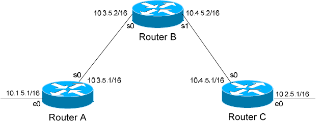


У OSPF можна контролювати, які інтерфейси маршрутизатора братимуть участь у процесі OSPF. Так само, як у протоколах EIGRP та RIP, для цього використовується команда `passive-interface`. Однак слід зазначити, що команда `passive-interface` працює в OSPF інакше, ніж у RIP чи IGRP.
 OSPF не буде формувати сусідські відносини (neighbor relationships) через «пасивний» інтерфейс. Тобто ця команда забороняє надсилання та приймання оновлень через такий інтерфейс:

```
RouterC(config)# router ospf 1
RouterC(config-router)# network 10.4.0.0 0.0.255.255 area 0
RouterC(config-router)# network 10.2.0.0 0.0.255.255 area 0
RouterC(config-router)# passive-interface s0
```

У цьому прикладі маршрутизатор C не формуватиме суміжність (adjacency) із маршрутизатором B. Можна зробити всі інтерфейси пасивними за допомогою команди `passive-interface default`, а потім окремо дозволити формування сусідських відносин на потрібних інтерфейсах за допомогою команди `no passive-interface`:

```
RouterC(config)# router ospf 1
RouterC(config-router)# network 10.4.0.0 0.0.255.255 area 0
RouterC(config-router)# network 10.2.0.0 0.0.255.255 area 0
RouterC(config-router)# passive-interface default
RouterC(config-router)# no passive-interface e0
```

Завжди пам’ятай: команда `passive-interface` у OSPF (як і в EIGRP) блокує формування сусідських відносин через цей інтерфейс. Через нього не передаватимуться маршрутні оновлення ні в одному, ні в іншому напрямку.

## Аутентифікація OSPF (OSPF Authentication)

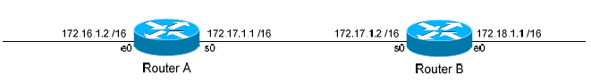

OSPF підтримує аутентифікацію для захисту маршрутних оновлень. Проте конфігурація аутентифікації в OSPF відрізняється від механізму, який використовується в RIP або EIGRP. Існує дві форми аутентифікації OSPF: із використанням відкритого тексту (clear-text) або з хешуванням MD5. Щоб налаштувати аутентифікацію у відкритому тексті, спочатку потрібно ввімкнути аутентифікацію для області (area) у процесі маршрутизації OSPF:

```
RouterA(config)# router ospf 1
RouterA(config-router)# network 172.17.0.0 0.0.255.255 area 0
RouterA(config-router)# area 0 authentication
```

Після цього потрібно задати ключ аутентифікації на відповідному інтерфейсі:

```
RouterA(config)# interface s0
RouterA(config-if)# ip ospf authentication
RouterA(config-if)# ip ospf authentication-key MYKEY
```

Щоб налаштувати аутентифікацію з хешуванням MD5, першим кроком також є ввімкнення аутентифікації для області у процесі OSPF:

```
RouterA(config)# router ospf 1
RouterA(config-router)# network 172.17.0.0 0.0.255.255 area 0
RouterA(config-router)# area 0 authentication message-digest
```

Зверни увагу на додатковий параметр `message-digest`, який додається до команди `area 0 authentication`. Далі потрібно задати ключ аутентифікації з MD5-хешуванням на інтерфейсі:

```
RouterA(config)# interface s0
RouterA(config-if)# ip ospf message-digest-key 10 md5 MYKEY
```

Аутентифікація області має бути ввімкнена на всіх маршрутизаторах у межах цієї області, і форма аутентифікації (clear-text або MD5) має бути однаковою. Ключі аутентифікації не обов’язково мають бути однаковими на всіх маршрутизаторах області, але вони повинні збігатися на інтерфейсах, які безпосередньо з’єднують два сусідні маршрутизатори. Зверни увагу: якщо аутентифікацію ввімкнено для області 0, її потрібно налаштувати також і на віртуальних зв’язках (Virtual Links), оскільки вони вважаються «розширенням» області 0.

## Віртуальні зв’язки OSPF (OSPF Virtual Links)

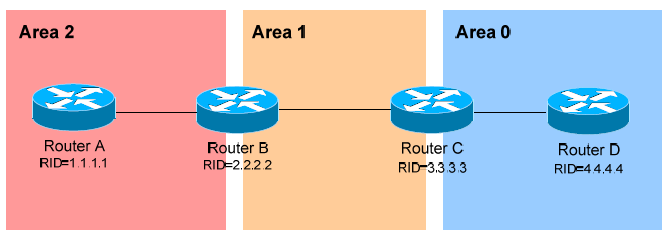

Раніше в цьому посібнику зазначалося, що всі області мають безпосередньо підключатися до області 0 (Area 0). У прикладі вище область 2 не має прямого з’єднання з областю 0, але повинна проходити через область 1, щоб досягти магістральної області (backbone area). У нормальній роботі OSPF така ситуація не повинна бути можливою.

Однак у певних випадках можуть виникати обставини, що перешкоджають прямому з’єднанню області з областю 0. У таких випадках можна використати віртуальні зв’язки (virtual links) — логічні з’єднання, що дозволяють приєднати відокремлену область до області 0. У прикладі вище віртуальний зв’язок фактично створює тунель між областю 2 та областю 0, використовуючи область 1 як транзитну (transit area).  Один кінець віртуального зв’язку повинен бути підключений до області 0.

Конфігурація виконується на прикордонних маршрутизаторах області (Area Border Routers, ABRs), які з’єднують область 1 з областю 2 (маршрутизатор B) та область 1 з областю 0 (маршрутизатор C). Налаштування на маршрутизаторі B:

```
RouterB(config)# router ospf 1
RouterB(config-router)# router-id 2.2.2.2
RouterB(config-router)# area 1 virtual-link 3.3.3.3
```

Перша команда активує процес OSPF. Друга команда вручну задає ідентифікатор маршрутизатора (router-id) для маршрутизатора B — 2.2.2.2.
Третя команда створює сам віртуальний зв’язок. Зверни увагу, що в ній зазначено область 1 — транзитну область, а також вказано ідентифікатор віддаленого ABR (Router ID) — 3.3.3.3. Налаштування на маршрутизаторі C:

```
RouterC(config)# router ospf 1
RouterC(config-router)# router-id 3.3.3.3
RouterC(config-router)# area 1 virtual-link 2.2.2.2
```

Також можлива ситуація, коли існують дві розділені (або неперервні) області 0 (discontiguous Area 0). Щоб OSPF функціонував правильно, ці дві області 0 потрібно з’єднати за допомогою віртуального зв’язку (virtual link). Знову ж таки, конфігурація виконується на прикордонних маршрутизаторах області (ABR), що належать до транзитної області:

```
RouterB(config)# router ospf 1
RouterB(config-router)# router-id 2.2.2.2
RouterB(config-router)# area 1 virtual-link 3.3.3.3

RouterC(config)# router ospf 1
RouterC(config-router)# router-id 3.3.3.3
RouterC(config-router)# area 1 virtual-link 2.2.2.2
```

Завжди пам’ятай: область, указана в команді `virtual-link`, є транзитною (transit area). Крім того, транзитна область не може бути стубовою (stub area). Як зазначалося раніше, якщо для області 0 увімкнено аутентифікацію, то така сама аутентифікація повинна бути налаштована і для віртуальних зв’язків,  оскільки вони вважаються «розширеннями» області 0:

```
RouterB(config)# router ospf 1
RouterB(config-router)# area 1 virtual-link 3.3.3.3 message-digest-key 1 md5 MYKEY

RouterC(config)# router ospf 1
RouterC(config-router)# area 1 virtual-link 2.2.2.2 message-digest-key 1 md5 MYKEY
```

## Міжобласна сумаризація в OSPF (Inter-Area OSPF Summarization)

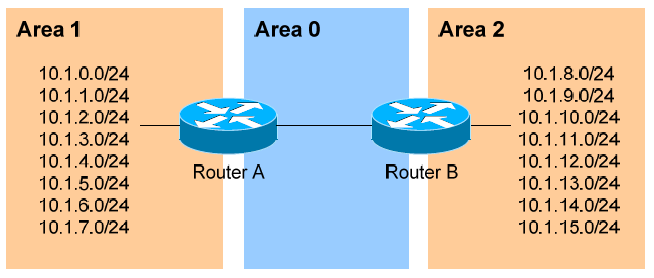

Розглянемо приклад вище. OSPF є безкласовим протоколом маршрутизації (classless routing protocol), тому всі перелічені мережі будуть оголошуватись окремо. Це збільшує розмір баз даних топології та таблиць маршрутизації на маршрутизаторах у домені,  що може бути небажаним. Анонсування лише сумарного маршруту (summary route) для міжобласного обміну (inter-area communication)  дозволяє зменшити навантаження на процесор маршрутизатора. Наприклад, усі мережі в області 1 можна підсумувати як 10.1.0.0/21, а всі мережі в області 2 — як 10.1.8.0/21. Міжобласна сумаризація налаштовується на прикордонних маршрутизаторах області (Area Border Routers, ABRs). Налаштування на маршрутизаторі A виглядатиме так:

```
RouterA(config)# router ospf 1
RouterA(config-router)# network 10.1.0.0 0.0.7.255 area 1
RouterA(config-router)# area 1 range 10.1.0.0 255.255.248.0
```

Команда `network` додає всі мережі діапазону 10.1.x.0 до області 1. Команда `area 1 range` створює сумарний маршрут для цих мереж, який потім рекламується в область 0 замість кожного маршруту окремо. Згідно з правильною практикою проєктування, для сумарної мережі слід створити статичний маршрут,  який вказує на інтерфейс Null. Це дозволяє надсилати будь-який трафік, адресований безпосередньо сумарній адресі, «в нікуди», щоб запобігти утворенню петель маршрутизації:

```
RouterA(config)# ip route 10.1.0.0 255.255.248.0 null0
```

У версіях IOS 12.1(6) і пізніших цей статичний маршрут створюється автоматично.

## Зовнішня сумаризація в OSPF (External OSPF Summarization)

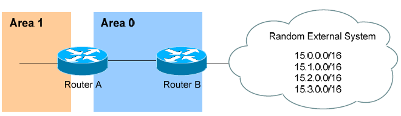

Розглянемо приклад вище. Маршрутизатор B є прикордонним маршрутизатором автономної системи (Autonomous System Border Router, ASBR). Можна виконати повторне розповсюдження (redistribution) чотирьох «зовнішніх» мереж у систему OSPF.  Проте в такому випадку кожна мережа буде анонсована окремо. Це є неефективним. Усі чотири зовнішні мережі можна підсумувати до однієї — 15.0.0.0/14.

Зовнішня сумаризація (External Summarization) налаштовується на маршрутизаторах ASBR і застосовується лише до зовнішніх маршрутів, отриманих через повторне розповсюдження.  Налаштування на маршрутизаторі B виглядатиме так:

```
RouterB(config)# router ospf 1
RouterB(config-router)# summary-address 15.0.0.0 255.252.0.0
```

Цей сумарний маршрут буде розповсюджений серед усіх маршрутизаторів у всіх областях OSPF.

Сумаризацію також можна використати для фільтрації окремих маршрутів (повноцінна фільтрація маршрутів описується в окремому посібнику). Щоб змусити OSPF анонсувати мережі 15.0.0.0 і 15.1.0.0 як сумарний маршрут,  але не анонсувати префікси 15.2.0.0 і 15.3.0.0, виконується таке налаштування:

```
RouterB(config)# router ospf 1
RouterB(config-router)# summary-address 15.0.0.0 255.254.0.0
RouterB(config-router)# summary-address 15.2.0.0 255.255.0.0 not-advertise
RouterB(config-router)# summary-address 15.3.0.0 255.255.0.0 not-advertise
```

Перша команда `summary-address` підсумовує мережі 15.0.0.0/16 та 15.1.0.0/16 до 15.0.0.0/15 і рекламує цей сумарний маршрут у межах домену OSPF.
 Наступні дві команди `summary-address` явно вказують мережі 15.2.0.0/16 і 15.3.0.0/16  з параметром `not-advertise`, що означає — ці мережі не будуть анонсовані в OSPF.

## Типи областей OSPF (OSPF Area Types)

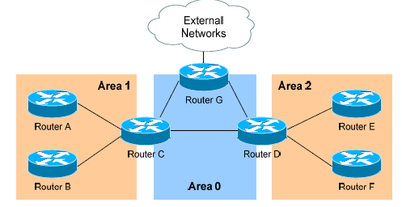

Для контролю розповсюдження LSA в домені OSPF було розроблено кілька типів областей.

**Standard Area** – «звичайна» область OSPF.

- Маршрутизатори в межах стандартної області обмінюються LSA типу 1 (Router) і типу 2 (Network), щоб побудувати свої таблиці топології. Після повної синхронізації всі маршрутизатори в області матимуть ідентичні таблиці топології.
- Стандартні області приймають LSA типу 3 (Network Summary), які містять маршрути до мереж в інших областях.
- Стандартні області також приймають LSA типу 4 (ASBR Summary) і типу 5 (External), які містять маршрути до ASBR та до зовнішніх мереж відповідно.

Налаштування стандартної області досить просте:

```
Router(config)# router ospf 1
Router(config-router)# network 10.1.0.0 0.0.7.255 area 1
```

**Stub Area** – область, що запобігає надходженню зовнішніх маршрутів (external routes) у межі області.

- Як і стандартні області, маршрутизатори в Stub-області обмінюються LSA типу 1 і типу 2, щоб побудувати таблиці топології.
- Stub-області також приймають LSA типу 3, які дозволяють досягати мереж в інших областях.
- Stub-області не приймають LSA типу 4 або типу 5, які містять маршрути до зовнішніх мереж.

Мета Stub-областей — обмежити кількість LSA, що поширюються в межах області, для економії пропускної здатності та зниження навантаження на процесори маршрутизаторів. Прикордонний маршрутизатор області (ABR) автоматично вводить маршрут за замовчуванням у Stub-область, щоб її маршрутизатори могли досягати зовнішніх мереж. ABR буде наступним переходом (next-hop) для цього маршруту за замовчуванням.

Конфігурація Stub-областей також досить проста:

```
Router(config)# router ospf 1
Router(config-router)# network 10.1.0.0 0.0.7.255 area 1
Router(config-router)# area 1 stub
```

Команду `area 1 stub` потрібно задати на всіх маршрутизаторах у межах Stub-області. ASBR у Stub-області не допускаються.

**Повністю стубова область OSPF (Totally Stubby Area)**. Повністю стубова область (Totally Stubby Area) запобігає розповсюдженню як міжобласних (inter-area), так і зовнішніх (external) маршрутів у межах області.

- Як і у стандартних та стубових областях, маршрутизатори Totally Stubby обмінюються LSA типу 1 (Router) і типу 2 (Network), щоб побудувати свої таблиці топології.
- Totally Stubby області не приймають LSA типу 3, що містять маршрути до інших областей.
- Totally Stubby області також не приймають LSA типу 4 або типу 5, які описують маршрути до зовнішніх мереж.

Мета Totally Stubby областей — зменшити кількість LSA, що поширюються в області, щоб заощадити пропускну здатність і ресурси процесора маршрутизаторів.  У цьому випадку ABR автоматично вводить маршрут за замовчуванням (default route) у Totally Stubby область, щоб маршрутизатори всередині неї могли досягати як міжобласних, так і зовнішніх мереж. ABR виступає наступним переходом (next-hop) для цього маршруту за замовчуванням. Конфігурація Totally Stubby області досить проста:

```
Router(config)# router ospf 1
Router(config-router)# network 10.1.0.0 0.0.7.255 area 1
Router(config-router)# area 1 stub no-summary
```

Команда `area 1 stub no-summary` задається лише на ABR Totally Stubby області, а інші маршрутизатори в межах цієї області налаштовуються з командою `area 1 stub`.  ASBR у Totally Stubby області не допускаються. У прикладі вище, якщо налаштувати область 1 як Totally Stubby, вона не прийматиме жодних зовнішніх маршрутів, що походять від ASBR (маршрутизатора G). Вона також не прийматиме LSA типу 3, які містять інформацію про маршрути з області 0 та області 2. Натомість маршрутизатор C (ABR) введе маршрут за замовчуванням у область 1, і всі маршрутизатори в межах області 1 використовуватимуть маршрутизатор C як шлюз (gateway) до всіх інших мереж.

**Не зовсім стубова область (Not So Stubby Area, NSSA)**

Не зовсім стубова область (NSSA) подібна до стубової області (Stub Area), але має одну важливу відмінність: вона запобігає розповсюдженню зовнішніх маршрутів (external routes) у межах області, якщо ці маршрути не походять від ASBR, який знаходиться всередині самої області NSSA.

- Як і в стандартних та стубових областях, маршрутизатори NSSA обмінюються LSA типу 1 (Router) і типу 2 (Network), щоб побудувати свої таблиці топології.
- NSSA також приймають LSA типу 3 (Network Summary), які містять маршрути до мереж в інших областях.
- NSSA не приймають LSA типу 4 або типу 5, які описують маршрути до зовнішніх мереж.
- Якщо в межах області NSSA існує ASBR, він створює LSA типу 7.

Таким чином, області NSSA майже ідентичні стубовим областям. Якщо б область 1 була налаштована як NSSA, вона не приймала б жодних зовнішніх маршрутів, що походять від маршрутизатора G (ASBR, розташованого за межами області 1). Проте, якщо в області 1 є власний ASBR (наприклад, маршрутизатор A), то зовнішні маршрути, які він оголошує, поширюватимуться всередині області 1 у вигляді LSA типу 7. Ці LSA типу 7 не пересилаються в інші області безпосередньо;  замість цього прикордонний маршрутизатор області (ABR, маршрутизатор C) конвертує їх у LSA типу 5 перед тим, як передати їх далі.

Конфігурація NSSA області досить проста:

```
Router(config)# router ospf 1
Router(config-router)# network 10.1.0.0 0.0.7.255 area 1
Router(config-router)# area 1 nssa
```

Команду `area 1 nssa` потрібно застосувати на всіх маршрутизаторах у межах області NSSA.

**Повністю не зовсім стубова область (Totally Not So Stubby Area, TNSSA)**. Повністю не зовсім стубова область (TNSSA) подібна до повністю стубової області (Totally Stubby Area). Вона запобігає розповсюдженню як міжобласних (inter-area), так і зовнішніх (external) маршрутів у межах області,
 за винятком тих зовнішніх маршрутів, які походять від ASBR, що знаходиться всередині самої області NSSA.

- Як і у стандартних та стубових областях, маршрутизатори TNSSA обмінюються LSA типу 1 (Router) і типу 2 (Network), щоб побудувати свої таблиці топології.
- TNSSA не приймають LSA типу 3, що описують маршрути до інших областей.
- TNSSA не приймають LSA типу 4 або типу 5, які містять маршрути до зовнішніх мереж.
- Якщо всередині області TNSSA існує ASBR, він створює LSA типу 7.

Окрім відсутності міжобласних маршрутів, області TNSSA функціонально ідентичні областям NSSA. Конфігурація області TNSSA досить проста:

```
Router(config)# router ospf 1
Router(config-router)# network 10.1.0.0 0.0.7.255 area 1
Router(config-router)# area 1 nssa no-summary
```

Команда `area 1 nssa no-summary` задається лише на прикордонному маршрутизаторі області (ABR). Інші маршрутизатори в межах цієї області налаштовуються з командою `area 1 nssa`.

## OSPF і маршрути за замовчуванням (OSPF and Default Routes)

Ми розглянули чотири типи областей OSPF:

- стандартні області (Standard areas)
- стубові області (Stub areas)
- повністю стубові області (Totally Stubby areas)
- не зовсім стубові області (Not So Stubby areas, NSSA)

Прикордонні маршрутизатори області (ABR) та прикордонні маршрутизатори автономної системи (ASBR) у стандартних областях не створюють (і не вводять) маршрути за замовчуванням автоматично. Розглянемо такий приклад:

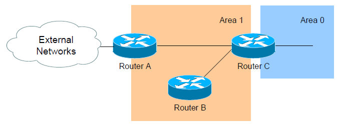

Припустімо, що область 1 налаштована як стандартна (Standard area). Маршрутизатор C пересилатиме LSA типу 3 з усіх інших областей до області 1, дозволяючи маршрутизаторам A і B досягати міжобласних (inter-area) мереж. Також зверни увагу, що маршрутизатор A є прикордонним маршрутизатором автономної системи (ASBR),  оскільки він підключений до зовнішньої автономної системи. Отже, маршрутизатор A створюватиме LSA типу 5, які міститимуть маршрути до цих зовнішніх мереж.

Щоб додатково змусити маршрутизатор A створити маршрут за замовчуванням (default route), вказавши себе як наступний перехід (next hop) до зовнішніх мереж, і поширити цей маршрут у межах області 1,  необхідно виконати такі команди. Цей маршрут за замовчуванням буде оголошений у вигляді LSA типу 5 у всі інші області:

```
RouterA(config)# router ospf 1
RouterA(config-router)# default-information originate
```

Маршрутизатор A повинен мати маршрут за замовчуванням у своїй таблиці маршрутизації, щоб ця команда працювала. Цей маршрут за замовчуванням повинен указувати на вищестоящий маршрутизатор у зовнішній автономній системі. 

Якщо в таблиці маршрутизації немає маршруту за замовчуванням,  можна примусово змусити маршрутизатор A рекламувати маршрут за замовчуванням,  використовуючи параметр `always`:

```
RouterA(config)# router ospf 1
RouterA(config-router)# default-information originate always
```

Прикордонні маршрутизатори (ABR) у стубових (Stub) і повністю стубових (Totally Stubby) областях автоматично створюють і вводять маршрут за замовчуванням (0.0.0.0/0) у межах області.  Маршрутизатори у Stub-областях використовують цей маршрут, щоб досягати зовнішніх мереж, а маршрутизатори у Totally Stubby — щоб досягати як міжобласних, так і зовнішніх мереж.

Щоб змінити метрику вартості (cost) маршруту за замовчуванням у Stub або Totally Stubby області (налаштовується на ABR):

```
Router(config)# router ospf 1
Router(config-router)# area 1 stub
Router(config-router)# area 1 default-cost 10
```

Прикордонні маршрутизатори областей NSSA повинні бути вручну налаштовані на створення та розповсюдження маршруту за замовчуванням у межах області:

```
Router(config)# router ospf 1
Router(config-router)# area 1 nssa default-information-originate
```

Крім того, прикордонний маршрутизатор автономної системи (ASBR) у межах NSSA також може створювати та вводити маршрут за замовчуванням. Цей маршрут буде оголошено у вигляді LSA типу 7,  оскільки LSA типу 5 не допускаються в NSSA. Команда використовується така сама, як і для введення маршруту за замовчуванням із NSSA ABR:

```
Router(config)# router ospf 1
Router(config-router)# area 1 nssa default-information-originate
```

## Таймери SPF у OSPF (OSPF SPF Timers)

Щоб змінити таймери SPF у OSPF, використовується команда:

```
Router(config)# router ospf 1
Router(config-router)# timers spf 10 15
```

Команда `timers spf` має два параметри, вимірювані в секундах. Перший параметр (10) визначає затримку SPF (SPF-Delay) — тобто час, який OSPF чекатиме після отримання зміни топології перед повторним обчисленням найкоротшого шляху. Другий параметр (15) визначає інтервал SPF-Holdtime — час очікування між окремими обчисленнями SPF. Однак команда `timers spf` зараз вважається застарілою (deprecated). Її замінено новою формою:

```
Router(config)# router ospf 1
Router(config-router)# timers throttle spf 5 10000 80000
```

Команда `timers throttle spf` має три параметри, вимірювані в мілісекундах:

- перший параметр (5) — час, який OSPF чекатиме після зміни топології перед перерахунком найкоротшого шляху;
- другий параметр (10000) — час затримки між окремими обчисленнями SPF (hold-down time);
- якщо OSPF отримує нові зміни топології протягом цього інтервалу, він подвоює час затримки, доки не досягне максимального значення (80000 мс).

Мета обох команд SPF-таймерів — запобігти постійній конвергенції OSPF у випадках, коли канали мережі «флапають» (тобто часто змінюють свій стан). Команди `timers spf` і `timers throttle spf` не можуть використовуватися одночасно.

## Розширене налаштування OSPF (Advanced OSPF Configuration)

Щоб змусити процес OSPF ігнорувати багатоадресні LSA (Multicast LSAs) типу 6, використовується команда:

```
Router(config)# router ospf 1
Router(config-router)# ignore lsa mospf
```

Щоб змусити інтерфейс фільтрувати всі вихідні LSA протоколу OSPF, застосовується така команда:

```
Router(config)# interface e0
Router(config-if)# ip ospf database-filter all out
```

Інтерфейси типу loopback обробляються в OSPF інакше, ніж інші інтерфейси. OSPF рекламує інтерфейс loopback як окремий «хост-маршрут» (host route) з маскою /32 (255.255.255.255). Щоб змусити OSPF анонсувати інтерфейс loopback із його реальною маскою підмережі, використовується така конфігурація:

```
Router(config)# interface loopback0
Router(config-if)# ip address 10.50.5.1 255.255.255.0
Router(config-if)# ip ospf network point-to-point
```

## Налагодження OSPF (Troubleshooting OSPF)

Щоб переглянути таблицю сусідів OSPF (Neighbor Table):

```
Router# show ip ospf neighbor
Neighbor ID     Pri   State        Dead Time   Address         Interface
7.7.7.7          1     FULL/ -      00:00:36    150.50.17.2     Serial0
6.6.6.6          1     FULL/DR      00:00:11    150.50.18.1     Ethernet0
```

Таблиця сусідів містить таку інформацію про кожного сусіда:

- ідентифікатор маршрутизатора (Router ID) віддаленого сусіда;
- пріоритет OSPF віддаленого маршрутизатора (використовується для виборів DR/BDR);
- поточний стан сусідства (neighbor state);
- таймер Dead Interval;
- IP-адресу інтерфейсу віддаленого сусіда;
- локальний інтерфейс, що підключений до сусіда.

Щоб переглянути таблицю топології OSPF (Topology Table):

```
Router# show ip ospf database
OSPF Router with ID (9.9.9.9) (Process ID 10)

Router Link States (Area 0)
Link ID     ADV Router   Age   Seq#         Checksum  Link count
7.7.7.7     7.7.7.7       329   0x80000007   0x42A0    2
8.8.8.8     8.8.8.8       291   0x80000007   0x9FFC    1

Summary Net Link States (Area 0)
Link ID        ADV Router   Age   Seq#         Checksum
192.168.12.0   7.7.7.7       103   0x80000005   0x13E4
192.168.34.0   7.7.7.7       105   0x80000003   0x345A
```

Таблиця топології містить таку інформацію:

- фактичне з’єднання (канал) або маршрут;
- ідентифікатор маршрутизатора, який рекламує цей канал (Advertising Router ID);
- таймер віку стану каналу (link-state age);
- номер послідовності (sequence number) і контрольну суму (checksum) кожного запису.

Щоб переглянути детальну інформацію про конкретний процес OSPF:

```
Router# show ip ospf 1
Routing Process "ospf 1" with ID 9.9.9.9
Supports only single TOS(TOS0) routes
Supports opaque LSA
SPF schedule delay 5 secs, Hold time between two SPFs 10 secs
Minimum LSA interval 5 secs. Minimum LSA arrival 1 secs
Number of external LSA 0. Checksum Sum 0x0
Number of opaque AS LSA 0. Checksum Sum 0x0
Number of DCbitless external and opaque AS LSA 0
Number of DoNotAge external and opaque AS LSA 0
Number of areas in this router is 1. 1 normal 0 stub 0 nssa
External flood list length 0

Area BACKBONE(0)
Number of interfaces in this area is 1
Area has no authentication
SPF algorithm executed 3 times
Area ranges are
Number of LSA 2. Checksum Sum 0xDDEC
Number of opaque link LSA 0. Checksum Sum 0x0
Number of DCbitless LSA 0
Number of indication LSA 0
Number of DoNotAge LSA 0
Flood list length 0
```

Команда `show ip ospf` надає таку інформацію:

- локальний ідентифікатор маршрутизатора (Router ID);
- інформацію про планування SPF і значення різних таймерів SPF;
- кількість інтерфейсів у кожній області, включно з типом області;
- таймер віку LSA;
- номер послідовності та контрольну суму для кожного запису.

Щоб переглянути інформацію, специфічну для OSPF, на певному інтерфейсі:

```
Router# show ip ospf interface s0
Serial0 is up, line protocol is up
Internet Address 192.168.79.2/24, Area 0
Process ID 10, Router ID 9.9.9.9, Network Type POINT_TO_POINT, Cost: 64
Transmit Delay is 1 sec, State POINT_TO_POINT,
Timer intervals configured, Hello 10, Dead 40, Wait 40, Retransmit 5
Hello due in 00:00:04
Index 1/1, flood queue length 0
Next 0x0(0)/0x0(0)
Last flood scan length is 1, maximum is 1
Last flood scan time is 0 msec, maximum is 0 msec
Neighbor Count is 1, Adjacent neighbor count is 1
Adjacent with neighbor 7.7.7.7
Suppress hello for 0 neighbor(s)
```

Команда `show ip ospf interface` надає таку інформацію:

- локальний ідентифікатор маршрутизатора (Router ID);
- тип мережі інтерфейсу (Network Type);
- вартість інтерфейсу (Cost);
- значення таймерів Hello і Dead для інтерфейсу;
- список сусідських суміжностей (neighbor adjacencies).

Щоб переглянути загальну інформацію про протокол маршрутизації OSPF:

```
Router# show ip protocols
Routing Protocol is "ospf 10"
Invalid after 0 seconds, hold down 0, flushed after 0
Outgoing update filter list for all interfaces is
Incoming update filter list for all interfaces is
Routing for Networks:
192.168.79.0 0.0.0.255 area 0
192.168.109.0 0.0.0.255 area 0
Routing Information Sources:
Gateway        Distance     Last Update
7.7.7.7        110          00:01:05
Distance: (default is 110)
```

Команда `show ip protocols` надає таку інформацію:

- локальні мережі, що рекламуються (Locally originated networks);
- джерела маршрутної інформації (Routing Information Sources);
- адміністративну відстань (Administrative Distance) сусідніх джерел.

Щоб скинути процес OSPF, включно з сусідськими суміжностями:

```
Router# clear ip ospf process
```

Щоб відобразити інформацію про віртуальні зв’язки OSPF:

```
Router# show ip ospf virtual-links
```

Щоб відобразити маршрути до прикордонних маршрутизаторів області (ABR) і автономної системи (ASBR):

```
Router# show ip ospf border-routers
```

Щоб увімкнути налагодження (debug) OSPF у режимі реального часу:

```
Router# debug ip ospf adj
Router# debug ip ospf events
Router# debug ip ospf hello
```

All original material copyright © 2007 by Aaron Balchunas (aaron@routeralley.com), unless otherwise noted. All other material copyright © of their respective owners. This material may be copied and used freely, but may not be altered or sold without the expressed written consent of the owner of the above copyright. Updated material may be found at http://www.routeralley.com.

Даний матеріал є дослівним перекладом з  https://lucidresource.com/guides/ospf.pdf