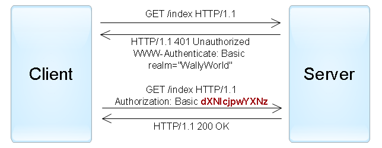
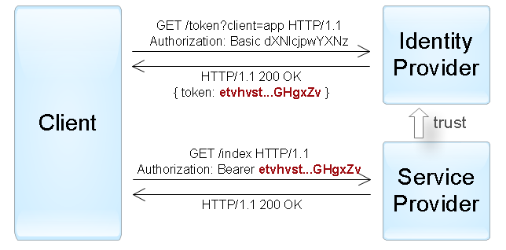

[<- До підрозділу](README.md) 			[Коментувати](#feedback)

# Автентифікація та авторизація у WEB-застосунках 

Автентифікація та авторизація є двома основними частинами вебкомунікації. Автентифікація використовується для перевірки особи користувача, тоді як авторизація означує його права доступу та рівні дозволів. У цьому розділі розглядаються різні схеми автентифікації та авторизації у WEB-застосунках та сервісах.

Важливо враховувати, що у вебсистемах існують різні типи користувачів, які вимагають різних механізмів автентифікації. Перший тип — це **люди**, які взаємодіють із системою через браузери, мобільні додатки або інші інтерфейси. Для них характерні форми входу, сесійні cookie, багатофакторні методи та безпарольні технології. Другий тип — це **програми та служби**, які звертаються до ресурсів автоматизовано. Для таких клієнтів використовуються інші механізми: ключі API, токени доступу, JWT, OAuth та інші протоколи делегованої авторизації. Вибір конкретного підходу залежить від того, хто саме є “користувачем” у певному контексті (людина чи програмна система), та які вимоги до безпеки і масштабу ставить розроблювана архітектура.

У межах власне протоколу HTTP існує набір стандартних механізмів автентифікації, які спираються на заголовки `WWW-Authenticate` та `Authorization`.  Поза межами HTTP-схем формується ширший набір сучасних практик, які сьогодні становлять основу вебавтентифікації. Нижче розглянемо кілька з них.  

## 1. HTTP Автентифікація та авторизація

### Основні концепції 

HTTP Authentication є частиною самого протоколу HTTP і забезпечує стандартний механізм перевірки користувача під час доступу до захищених ресурсів. У межах цього підходу сервер може вимагати автентифікацію, надсилаючи клієнту спеціальний заголовок `WWW-Authenticate` у відповіді 401` Unauthorized`. Клієнт, своєю чергою, повторює запит, включивши у заголовок `Authorization` дані, необхідні для вибраної схеми автентифікації. Завдяки цьому змістова частина протоколу не змінюється, а автентифікація працює як гнучкий надбудований механізм, підтримуваний усіма реалізаціями HTTP.

Існує декілька схем автентифікації, офіційно визначених у специфікаціях HTTP. Вони можуть суттєво відрізнятися за безпекою та механізмом роботи, але всі мають однакову структуру взаємодії клієнта і сервера. Важливо розуміти, що HTTP Authentication обмежується лише тими механізмами, які означені у відповідних RFC і формально належать до протоколу. 

### Заголовок WWW-authenticate

Заголовок відповіді HTTP `WWW-authenticate` є частиною фреймворку автентифікації HTTP, означеного у RFC 7235. Він створюється та включається у HTTP-відповіді сервера, коли клієнт запитує захищений ресурс, а сервер повертає помилку HTTP `401 Unauthorized`. 

Точний формат заголовка HTTP залежить від використовуваної схеми автентифікації. Деякі приклади форматів наведено нижче:

```http
WWW-Authenticate: <auth-scheme>
WWW-Authenticate: <auth-scheme> token68
WWW-Authenticate: <auth-scheme> auth-param1=param-token1
WWW-Authenticate: <auth-scheme> auth-param1=param-token1, …, auth-paramN=param-tokenN
WWW-Authenticate: <auth-scheme> realm=<realm> token68
WWW-Authenticate: <auth-scheme> realm=<realm> token68 parameter1=token1
```

Обов’язковою директивою у заголовку є `<auth-scheme>`, тоді як дві інші директиви — `realm` і `token68` — є необов’язковими.  `<auth-scheme>` - токен без урахування регістру, що вказує на використану схему автентифікації. Заголовок HTTP `WWW-authenticate` містить принаймні одну схему автентифікації та будь-які параметри або дані, необхідні для виконання автентифікації з її використанням. Можна вказувати кілька схем — або в окремих рядках, або в одному рядку, розділяючи їх комами. Найчастіше використовувані схеми автентифікації — `Basic`, `Digest` і `Negotiate`  і `AWS4-HMAC-SHA256`. IANA веде список схем автентифікації, але хостингові сервіси можуть пропонувати й інші. Інші директиви:

- `<auth-param>` - параметр автентифікації, формат якого залежить від `<auth-scheme>`. 

- `<realm>` -  це типовий параметр у багатьох схемах автентифікації. Рядок `realm`, після якого йде `=` та рядок у лапках, що описує захищену область, наприклад `realm="staging environment"`. `Realm` дозволяє серверу розділяти області, які він захищає (якщо це підтримує схема, що дозволяє таке розділення). Деякі клієнти відображають це значення користувачу, щоб підказати, які саме облікові дані потрібні — хоча більшість браузерів припинили це робити, щоб протидіяти фішингу. Єдиний надійно підтримуваний набір символів для цього значення — `us-ascii`. Якщо `realm` не вказано, клієнти часто показують форматоване ім’я хоста.

- `<token68>` - токен, що може бути корисним для деяких схем. Він дозволяє 66 незарезервованих символів URI та кілька додаткових. Він може містити кодування `base64`, `base64url`, `base32` або `base16 (hex)` з або без заповнення, але без пробілів. Альтернатива `token68` для списків `auth-param` підтримується для сумісності зі старими схемами автентифікації.

Загалом необхідно перевіряти відповідні специфікації, щоб визначити параметри автентифікації, потрібні для кожної `<auth-scheme>`. У наступних розділах описано токени та параметри автентифікації для деяких поширених схем.

### Basic Authentication

Basic Authentication — це механізм автентифікації, у якому облікові дані користувача, такі як ім’я користувача та пароль, кодуються у Base64 і надсилаються разом із HTTP-запитом. Зазвичай він поєднується з HTTPS, щоб забезпечити шифрування всієї комунікації.

- Спочатку клієнт надсилає серверу запит на будь-який ресурс.
- Якщо потрібна автентифікація, сервер відповідає статус-кодом `401 Unauthorized` та заголовком `WWW-Authenticate: Basic`.
- Після отримання коду `401 Unauthorized` клієнт надсилає повторний запит із заголовком `Authorization`, який містить слово `Basic` і закодовану в Base64 інформацію.



рис.1.

Для `Basic authentication` директива `realm` є обов’язковою, `charset="UTF-8"` є необов’язковою і повідомляє клієнту про бажану схему кодування, яку сервер хоче використовувати під час надсилання імені користувача та пароля. Єдине допустиме значення — рядок UTF-8 без урахування регістру. Це не стосується кодування самого рядка `realm`.

У цьому прикладі надсилається запит без заголовка `Authorization`, що призводить до відповіді `401 UNAUTHORIZED`.

```http
GET https://httpbin.org/basic-auth/ HTTP/1.1
```

Заголовки відповіді


У цьому прикладі надсилається HTTP-запит із заголовком `Authorization`.

```http
GET https://httpbin.org/basic-auth/user1/1 HTTP/1.1
Authorization: Basic dXNlcjox
```

Переваги Basic Authentication

- Простий у реалізації.
- Підтримується всіма HTTP-клієнтами.

Обмеження Basic Authentication

- Він не є безпечним, оскільки облікові дані в заголовку `Authorization` передаються у вигляді Base64, який легко декодувати.
- Для забезпечення безпеки використовується разом із HTTPS, що забезпечує шифрування.

### Digest Authentication

Digest Authentication у HTTP — це механізм автентифікації за принципом «запит–відповідь», у якому облікові дані захищено шляхом хешування. Він забезпечує кращий рівень безпеки, ніж Basic Authentication, оскільки пароль не передається у відкритому вигляді.

- Спочатку клієнт надсилає запит серверу.
- Сервер відповідає статусом `401 Unauthorized` і заголовком `WWW-Authenticate`, який містить `nonce`, `realm` та інформацію про алгоритм.
- Клієнт використовує ці дані разом із власним ім’ям користувача та паролем для генерації хешованої відповіді.
- Потім сервер перевіряє хешовану відповідь і, не отримуючи пароль у відкритому вигляді, вирішує надати доступ чи відмовити.

Директиви:

- `<realm>`  - необов'язково, вказує, яке ім’я користувача й пароль слід використовувати. Мінімально має включати ім’я хоста, але може також вказувати конкретних користувачів або групу, що мають доступ.

- `domain` - необов’язково рядок у лапках із префіксами URI, розділеними пробілом, які визначають усі місця, де може використовуватися інформація автентифікації. Якщо цей ключ не вказано, інформація автентифікації може використовуватися будь-де в корені вебсайту.

- `nonce` - рядок у лапках, означений сервером, який сервер може використовувати для контролю часу, протягом якого певні облікові дані вважаються чинними. Він має генеруватися заново під час кожної відповіді 401 і може генеруватися частіше (наприклад, дозволяючи використовувати дайджест лише один раз). У специфікації наведено поради щодо можливих алгоритмів для генерації цього значення. Значення nonce є непрозорим для клієнта.

- `opaque` - рядок у лапках, означений сервером, який має бути повернений без змін у заголовку `Authorization`. Це значення є непрозорим для клієнта. Рекомендовано, щоб сервер використовував Base64 або шістнадцяткові дані.

- `stale` - необов’язковий прапорець без урахування регістру, який вказує, що попередній запит клієнта було відхилено, оскільки використаний `nonce` є надто старим. Якщо значення `true` — запит можна повторити з тими самими обліковими даними, але з новим `nonce`. Якщо будь-яке інше значення — ім’я користувача / пароль є недійсними і повинні бути повторно отримані від користувача.

- `algorithm` - необов’язковий рядок, що вказує алгоритм, використаний для створення дайджесту. 

  - Чинні несесійні значення: `MD5` (стандарт, якщо `algorithm` не вказано), `SHA-256`, `SHA-512`. 

  - Чинні сесійні значення: `MD5-sess`, `SHA-256-sess`, `SHA-512-sess`.

- `qop` - рядок у лапках, який вказує рівень захисту, що підтримується сервером. Має бути вказаний, а нерозпізнані опції повинні ігноруватися.

  - "auth": автентифікація

  - "auth-int": автентифікація з перевіркою цілісності

- `charset="UTF-8"` -  необов’язковий параметр, повідомляє клієнту про бажану схему кодування, яку сервер хоче використовувати для надсилання імені користувача та пароля. Єдине дозволене значення — рядок "UTF-8" без урахування регістру.

- `userhash` -  необов’язковий. Сервер може вказати "true", щоб показати, що він підтримує хешування імені користувача (за замовчуванням "false").

У цьому прикладі надсилається запит без заголовка `Authorization`, що призводить до відповіді `401 UNAUTHORIZED`.

```http
GET https://httpbin.org/digest-auth/auth/user/1 HTTP/1.1
```

заголовок `WWW-Authenticate` у відповіді має наступний вигляд: 

```http
WWW-Authenticate: Digest realm="me@kennethreitz.com", nonce="9350aaae80e3bf0e984c6bf8707dd717", qop="auth", opaque="f87b69b2487d5be902c33d769485b55c", algorithm=MD5, stale=FALSE
```

Отже треба використовувати наступні параметри:


```http
Authorization: Digest username="user", realm="me@kennethreitz.com", nonce="9350aaae80e3bf0e984c6bf8707dd717", uri="/digest-auth/auth/user/1", algorithm="MD5", qop=auth, nc=00000001, cnonce="a1b2c3d4e5f6", response="15cf2fba77ee1b2d30fca62de1631634", opaque="f87b69b2487d5be902c33d769485b55c"
```

Пояснення:

- `realm="me@kennethreitz.com"` – те саме значення, що прислав сервер.
- `nonce="..."` – те саме значення nonce із WWW-Authenticate.
- `algorithm=MD5` – як у виклику.
- `qop=auth` – також як у виклику.
- `nc=00000001` – “nonce-count”, шістнадцятковий лічильник, скільки разів клієнт використав цей `nonce`; перший раз зазвичай `00000001`.
- `cnonce="a1b2c3d4e5f6"` – довільний рядок, придуманий клієнтом (client nonce), випадкове значення.
- `opaque="..."` – копіюється значення з `WWW-Authenticate` без змін.
- `response="..."` – MD5-хеш, який обчислюється за формулами RFC:
  1. `HA1 = MD5(username : realm : password)` тобто `MD5("user:me@kennethreitz.com:1")`
  2. `HA2 = MD5(method : uri)` наприклад, `MD5("GET:/protected/file")`
  3. `response = MD5(HA1 : nonce : nc : cnonce : qop : HA2)`

### Bearer Authentication

Аутентифікація за допомогою `Bearer token` — це механізм, у якому для доступу до ресурсу використовується певна послідовність символів. Якщо послідовність символів невірна, сервер відповідатиме `401 UNAUTHORIZED`. Ця послідовність передається в заголовку `Authorization` запиту. 

У цьому прикладі надсилається запит без заголовка `Authorization`, що призводить до відповіді `401 UNAUTHORIZED`.

```http
GET https://httpbin.org/bearer HTTP/1.1
```

заголовок `WWW-Authenticate` у відповіді має наступний вигляд: 

```
WWW-Authenticate:Bearer
```

Запит з автентифікацією матиме наступний вигляд:

```
Authorization: Bearer 12345678
```

## 2. Механізми передавання облікових даних

Механізми передавання облікових даних описують те, яким саме способом клієнт надсилає серверу інформацію для первинної автентифікації. Вони не означують, яким буде подальший механізм підтримки автентифікованого стану, але є критично важливим етапом процесу входу. Оскільки HTTP є протоколом безстановим, необхідно мати спосіб передати логін, пароль або інші облікові дані в рамках одного запиту, після чого сервер може або створити сесію, або згенерувати токен, або повернути помилку (див. нижче). Механізми передачі облікових даних залежать від типу клієнта, моделі взаємодії та вимог до безпеки.

Вище ми розглянули, що у стандартній HTTP Автентифікації Basic логін і пароль надсилаються у заголовку `Authorization` у форматі Base64. Хоча цей спосіб не забезпечує шифрування сам по собі, він залишається простим і формально визначеним механізмом, який можна застосовувати в сценаріях, де канал зв’язку захищено TLS. У сучасних API логін/пароль через Basic часто використовують виключно для отримання токенів доступу, після чого подальші запити виконуються вже з використанням токенів, а не паролів.

Одним із найпоширеніших способів є автентифікація через HTML-форму, де користувач вводить логін і пароль вручну, а браузер надсилає їх методом `POST` у форматі `form-urlencoded` або `multipart/form-data`. Це природний варіант для вебінтерфейсів, орієнтованих на людей. Наприклад у веб-застосунок включається HTML-форма, в яку користувач повинен ввести своє ім'я та пароль (рис.2). Вони відправляються на сервер через HTTP метод `POST` для аутентифікації. У разі успіху веб-застосунок створює маркер (`token`), який може поміщатися в браузерні куки (`cookies`) . При наступних веб-запитах маркер автоматично передається на сервер і дозволяє застосунку отримати інформацію про поточного користувача для авторизації запиту.


рис. 2. Приклад автентифікації через форму.

Подібний механізм працює і для програмних клієнтів, які надсилають облікові дані у форматі JSON через спеціальний `login endpoint`, що технічно є аналогом форми без графічного інтерфейсу. Такий підхід часто використовується у REST API та мобільних застосунках, де користувач взаємодіє з локальним інтерфейсом, а автентифікація виконується через фоновий POST-запит.

Передавання облікових даних може також базуватися на інших формах облікових даних: одноразових паролях, параметрах запиту, client certificates у TLS або апаратних ключах. У таких випадках механізм передачі є частиною більшого протоколу або фреймворку і не обмежується традиційним логіном і паролем. Незалежно від обраної схеми, передавання облікових даних повинно відбуватися через захищений канал, а сервер повинен обробляти отримані дані так, щоб мінімізувати ризики перехоплення або повторного використання.

## 3. Використання серверних сесій

Автентифікація на основі сесій є класичним і одним із найпоширеніших механізмів у вебзастосунках. Вона виникла разом із появою перших інтерактивних сайтів, де була необхідність визначати користувача між різними HTTP-запитами, оскільки сам протокол HTTP є безстановим і не зберігає інформації про попередні взаємодії. Суть механізму полягає в тому, що після успішної перевірки логіна й пароля сервер створює окремий **запис сесії**, який містить інформацію про користувача та його стан, а клієнт отримує унікальний **ідентифікатор цієї сесії**. Починаючи з цього моменту кожен запит клієнта супроводжується цим ідентифікатором, завдяки чому сервер може розпізнати користувача і застосовувати відповідні дозволи. 

Технічно найчастіше сесійний ідентифікатор зберігається у `cookie`, встановленому через заголовок `Set-Cookie`, після чого браузер автоматично додає його до всіх наступних запитів. Це дає можливість будувати багатокрокові взаємодії, здійснювати авторизацію доступу та підтримувати індивідуальний контекст роботи користувача без потреби повторно вводити облікові дані. Самі сесії можуть зберігатися у пам’яті сервера, у файлах або у зовнішніх сховищах на кшталт Redis чи бази даних, залежно від масштабності застосунку та вимог до відмовостійкості.

Попри широке використання, сесійна автентифікація потребує належного захисту. Сесійні ідентифікатори повинні бути криптографічно стійкими, а `cookie` — захищеними від викрадення через налаштування `Secure`, `HttpOnly` та `SameSite`. Окрім того, сервер має контролювати термін життя сесії та надавати механізми її оновлення або примусового завершення. За правильної реалізації автентифікація на основі сесій залишається простим, зрозумілим і надійним способом керування доступом у вебсередовищі.

## 4. Використання безстанових токенів 

На відміну від сесійного підходу, у якому сервер зберігає інформацію про користувача, токен-орієнтована автентифікація перекладає цей стан на сам **токен (маркер)**, що передається клієнтом з кожним запитом. Після успішної автентифікації (наприклад через форму) сервер генерує токен — компактний маркер доступу, який клієнт додає до запитів, зазвичай у заголовку `Authorization`. Сервер при цьому не зобов’язаний вести таблицю активних сесій, оскільки вся необхідна інформація або міститься всередині токена, або перевіряється криптографічно. Це робить механізм зручним у розподілених системах і сервісах із високим навантаженням.

**JWT (JSON Web Token)** є компактним токеном у форматі JSON, який використовується для передачі інформації між клієнтом і сервером у криптографічно підписаному вигляді. Токен складається з трьох частин — заголовка, корисного навантаження та підпису, що дозволяє серверу швидко перевірити його цілісність без звернення до централізованого сховища. 

JWT можуть передаватися кількома способами, але в сучасних вебсистемах переважають два основні підходи: через заголовок `Authorization` або через `cookie`.  Найпоширеніший спосіб — передача JWT у заголовку `Authorization` з використанням схеми `Bearer`. У такому випадку клієнт додає токен до кожного запиту таким чином: `Authorization: Bearer <jwt>`. Цей метод широко застосовується в API, мобільних застосунках і односторінкових вебклієнтах, де клієнтський код самостійно керує токенами.

Другий поширений варіант — передача JWT у `cookie`, зазвичай із налаштуваннями `HttpOnly`, `Secure` і `SameSite`, що зменшує ризики викрадення токена через XSS. У цьому випадку токен автоматично додається браузером до всіх запитів, що підходить для класичних вебзастосунків, але потребує уважного налаштування для уникнення CSRF-атак.

Також JWT можуть передаватися як параметри URL або у тілі запиту, але це вважається менш безпечним і застосовується лише у специфічних сценаріях, наприклад під час початкового отримання токена в OAuth або OpenID Connect.

**API Keys** є простим і широко використовуваним механізмом автентифікації в веб-API, особливо там, де потрібне ідентифікування застосунку або сервісу, а не конкретного користувача. Ключ API зазвичай є довгим випадковим рядком, який видає сервер і який клієнт додає до кожного запиту — найчастіше в заголовку, параметрах URL або тілі запиту. На відміну від токенів із чіткою структурою, ключ API зазвичай є непрозорим маркером, який перевіряється через серверну базу даних чи іншу систему керування ключами. Цей підхід є легким у реалізації, але він не забезпечує складних моделей прав доступу, тому часто використовується для простих служб або машинної взаємодії, де достатньо базового контролю доступу

Важливою характеристикою токенів є їхня тривалість життя. Токени з мали часом життя мають короткий термін дії, що зменшує ризики у разі компрометації, оскільки викрадений маркер швидко втрачає чинність. Вони часто використовуються в архітектурах, де сервер не зберігає стану, а валідація виконується лише криптографічно, як у випадку з JWT. Токени з довгим часом життя, навпаки, мають триваліший термін дії і застосовуються для стабільних інтеграцій або міжсервісної взаємодії, але їх використання потребує підвищеної обережності, бо вони залишаються дійсними протягом тривалого часу і, у разі викрадення, можуть надати зловмиснику доступ до системи. Токени оновлення (Refresh tokens) доповнюють короткоживучі токени й дозволяють клієнту отримувати новий access-token без повторної автентифікації. Це створює баланс між безпекою та зручністю: короткоживучий токен мінімізує вплив його можливого витоку, а refresh token забезпечує неперервність роботи користувача без необхідності повторно вводити пароль.

## 5. Протоколи делегованої автентифікації та авторизації

Протоколи делегованої автентифікації та авторизації виникли як відповідь на зростаючу потребу у взаємодії між незалежними вебсервісами, коли один застосунок повинен надати іншому обмежений доступ до своїх ресурсів без передачі пароля користувача. У таких протоколах користувач автентифікується не в сервісі, який запитує доступ, а в окремому сервері ідентифікації. Це дозволяє зберігати паролі в одному довіреному місці, а зовнішнім застосункам передавати лише маркери доступу, що визначають рівень дозволів. 

На прикладі, зображеному на рис.10, клієнт спочатку звертається до Identity Provider і автентифікується там за допомогою наприклад `Basic Authentication`. `Identity Provider` перевіряє облікові дані й видає клієнту токен доступу. Цей токен є підтвердженням того, що автентифікація відбулася успішно, і містить інформацію, достатню для того, щоб інші системи могли прийняти рішення щодо доступу без повторної перевірки пароля.

Після отримання токена клієнт надсилає запит до іншої служби — `Service Provider` — але вже не з логіном і паролем, а з токеном у заголовку `Authorization` за схемою `Bearer`. `Service Provider` довіряє `Identity Provider` і покладається на те, що токен був виданий легітимно. Він перевіряє токен, не знаючи при цьому пароля користувача, і надає доступ до ресурсу, якщо токен чинний. Така модель дозволяє розділити відповідальність: `Identity Provider` займається автентифікацією, а `Service Provider` — лише авторизацією запитів на основі довірених маркерів. Перевагою цього підходу є підвищена безпека, централізоване керування користувачами та можливість масштабування системи без дублювання логіки автентифікації в кожному сервісі.


рис.10.  Приклад автентифікації «активного» клієнта за допомогою маркера, переданого за допомогою  схеми Bearer: trust - дозвіл. 

Одним із найвідоміших представників цього класу є OAuth 2.0, який став стандартом де-факто для делегованої авторизації у вебі, мобільних застосунках та API. Детальніше OAuth 2.0 розглядається нижче.


## 4. Безпарольні та криптографічні механізми

Сучасні методи автентифікації, що не передбачають передачі пароля.

4.1 WebAuthn
 4.2 FIDO2
 4.3 Passkeys
 4.4 Одноразові паролі TOTP/HOTP
 4.5 MFA (багатофакторна автентифікація)

Безпарольні та криптографічні механізми автентифікації виникли як відповідь на суттєві недоліки традиційних паролів, які легко вгадати, викрасти або перехопити. У сучасних вебсистемах дедалі частіше застосовуються методи, що базуються на криптографічних операціях, апаратних ключах та багатофакторній взаємодії. Їхня ключова ідея полягає в тому, що користувач більше не передає секрет у вигляді пароля; натомість автентифікація відбувається шляхом підтвердження володіння приватним ключем або фізичним пристроєм. Це дає значно вищий рівень захисту, оскільки приватний ключ ніколи не залишає меж безпечного середовища, а перевірка здійснюється за допомогою криптографічних підписів.

### WebAuthn/FIDO2

Одним із найпоширеніших представників таких технологій є WebAuthn, який дозволяє браузерам і серверам використовувати апаратні ключі, мобільні пристрої або вбудовані модулі безпеки для створення криптографічних пар ключів. Під час автентифікації сервер надсилає виклик, а клієнтський пристрій створює підпис, підтверджуючи володіння приватним ключем. Це усуває можливість перехоплення чи повторного використання секретів, оскільки кожен підпис унікальний і прив’язаний до конкретного вебсайту. Модель, яку пропонує WebAuthn та стандарт FIDO2, зменшує залежність від паролів і спрощує входи для користувачів, водночас підвищуючи рівень безпеки.

Розглянемо приклад роботи безпарольної автентифікації на основі технологій WebAuthn/FIDO2, що використовується у сервісах Google. У сервісах Google (Gmail, YouTube, Google Drive та інших) реалізовано механізм безпарольного входу, який базується на криптографічній автентифікації. У цьому підході для входу в обліковий запис не використовується пароль; натомість автентифікація виконується за допомогою смартфона або іншого пристрою, що містить криптографічний ключ.

1) Після введення лише адреси електронної пошти на сторінці входу користувач не заповнює поле пароля. 
2) Google надсилає на прив’язаний смартфон запит на підтвердження спроби входу. 
3) На телефоні користувача з’являється повідомлення із зазначенням браузера, місця та часу спроби входу, після чого пропонується підтвердити дію за допомогою біометрії або PIN-коду. На цьому етапі приватний криптографічний ключ, що зберігається у захищеному середовищі смартфона, використовується для створення цифрового підпису на основі одноразового виклику (challenge), який надіслав сервер Google.  
4) Створений підпис надсилається на сервер Google, де перевіряється за допомогою відповідного публічного ключа, що був пов’язаний з обліковим записом користувача під час початкового налаштування. 
5) Якщо підпис є чинним, сервер підтверджує особу та завершуються всі необхідні кроки автентифікації. Протягом усього процесу пароль не використовується, а приватний ключ ніколи не передається мережею.

Такий метод забезпечує високий рівень захисту, оскільки виключає можливість перехоплення або повторного використання автентифікаційних даних, а також робить неможливим доступ без фізичного володіння пристроєм користувача. Безпарольна автентифікація Google є прикладом практичного застосування стандартів WebAuthn та FIDO2 і демонструє сучасний підхід до забезпечення безпеки в інтернет-сервісах.

### passkeys 

Ще одним важливим елементом є passkeys — користувацькі ключі, що можуть синхронізуватися між пристроями, але все одно працюють на основі криптографічної автентифікації. Вони роблять можливим безпарольний вхід, коли користувач підтверджує свою особу біометрією або PIN-кодом на пристрої, а сам процес автентифікації виконується апаратним модулем. До криптографічних методів належать і одноразові паролі (TOTP/HOTP), які хоч і потребують введення коду, однак не передають постійних секретів і використовують алгоритмічну синхронізацію між сервером і клієнтом. Сукупно ці механізми формують сучасний напрямок розвитку автентифікації, де ключову роль відіграють криптографія, апаратні гарантії та зменшення залежності від традиційних паролів.

Passkeys є сучасною реалізацією безпарольної автентифікації, у якій для входу замість пароля використовується криптографічна пара ключів, пов’язана з конкретним обліковим записом. Приватний ключ зберігається на пристрої користувача (смартфоні або комп’ютері), а публічний — у сервісі, на якому реєструється обліковий запис. Завдяки цьому автентифікація виконується без передачі будь-якого секрету мережею.

При першому налаштуванні passkey користувач створює ключ на пристрої, підтверджуючи операцію біометрією або PIN-кодом. Після цього сервіс зберігає отриманий публічний ключ і пов’язує його з обліковим записом. Для повторного входу користувач на сторінці автентифікації вказує лише ім’я облікового запису або вибирає його зі списку. Сервер надсилає пристрою одноразовий криптографічний виклик, який має бути підписаний приватним ключем. Після підтвердження біометрією (або іншою локальною дією) пристрій створює цифровий підпис і повертає його сервісу.

Сервер перевіряє підпис за допомогою публічного ключа. Якщо підпис дійсний, автентифікація завершується успішно. Завдяки цьому пароль не вводиться, не зберігається та не передається, а приватний ключ ніколи не покидає пристрій користувача. Passkeys також можуть синхронізуватися між особистими пристроями користувача через захищені механізми iCloud Keychain, Google Password Manager або аналогічні системи, що забезпечує можливість входу з різних пристроїв без повторної реєстрації ключів.

Такий підхід робить фішингові атаки практично неможливими, повністю усуває ризики, пов’язані з використанням паролів, і забезпечує безперервний та зручний досвід автентифікації для користувачів. Passkeys вже підтримуються більшістю сучасних браузерів і операційних систем та стають стандартним механізмом доступу до облікових записів у багатьох онлайн-сервісах.


## 5. Механізми для підвищення безпеки автентифікації

Вони не є окремими методами автентифікації, але доповнюють інші механізми.

5.1 PKCE для OAuth
 5.2 Device Authorization Flow
 5.3 Rate limiting / anti-bruteforce
 5.4 CAPTCHA
 5.5 Контекстна автентифікація (IP, fingerprinting)

## OAuth 2.0

Каркас **OAuth** (Open Authorization) означує механізм отримання доступу одного застосунку до іншого від імені користувача без необхідності вводу імені користувача та паролю.  OAuth дозволяє користувачам, як власникам ресурсів (`resource owner`) роздавати клієнтським застосункам (`client`)  маркери доступу до власних даних , що розміщуються на серверах ресурсів (`resource server`). Кожен маркер доступу надає доступ до конкретного серверу ресурсів (наприклад, сайту редагування відео) навіть до конкретних ресурсів на них (наприклад, тільки відео від конкретного альбому) та на означений термін (наприклад, на наступні 2 години). Це дозволяє користувачам надавати доступ клієнтським застосункам до їх інформації, що зберігається на інших серверах — провайдерів сервісів, не передаючи повною мірою самих даних та без застосування імені/паролю. 

Поточна версія каркасу 2.0 опублікована в 2012 р. як стандарт у кількох документах RFC, зокрема RFC 6749 The OAuth 2.0 Authorization Framework. Компоненти OAuth 2.0:

- `Resource Owner`: користувач, власник ресурсу, який надає дозвіл серверу авторизації.
- `Client`: застосунок, що запитує доступ до ресурсу від імені користувача.
- `Resource Server`: сервер, на якому розміщено ресурс, який потрібний клієнту; він перевіряє токени та надає доступ до запитаного ресурсу.
- `Authorization Server`: сервер, який отримує згоду власника ресурсу і відповідає за видачу токенів після автентифікації клієнта.

У загальному весь процес складається з декількох кроків (рис.12.):

1. Власник ресурсу (`resource owner`) дає дозвіл клієнтському застосунку (`client`) на доступ до певного ресурсу у вигляді гранту, який розглядається нижче.
2. Клієнтський застосунок (`Client`) звертається до сервера авторизації та в обмін на грант власника отримує маркер доступу до ресурсу. При виклику застосунок додатково автентифікується за допомогою ключа доступу, виданим йому за попередньою реєстрацією.
3. Програма використовує цей маркер для отримання необхідних даних від сервера ресурсів.


рис.12.  Взаємодія компонентів у стандарті OAuth.

Специфікація описує чотири види **грантів**, які означують можливі сценарії застосування:

1. `Authorization Code` - цей грант користувач може отримати від сервера авторизації після успішної автентифікації і підтвердження згоди на надання доступу. Такий спосіб найбільш часто використовується у веб-застосунках. 
2. `Implicit` - застосовується, коли у застосунку немає можливості безпечно отримати маркер від сервера авторизації (наприклад, JavaScript-застосунок у браузері). У цьому випадку грант є маркером, отриманим від сервера авторизації, а крок №2 виключається зі сценарію вище.
3. `Resource Owner Password Credentials` - грант є парою `username/password` користувача. Може застосовуватися, якщо застосунок є «інтерфейсом» для сервера ресурсів (наприклад, застосунок - мобільний клієнт для Gmail).
4. `Client Credentials` - у цьому випадку немає ніякого користувача, а застосунок отримує доступ до своїх ресурсів за допомогою власних джерел доступу (виключається крок №1). 

Стандарт не означує формат маркеру, який отримує застосунок: в сценаріях, адресованих стандартом, з застосунком немає необхідності аналізувати маркер, так як він лише використовується для отримання доступу до ресурсів. Тому ні маркер, ні грант самі по собі не можуть бути використані для автентифікації користувача. Однак якщо з застосунком необхідно отримати достовірну інформацію про користувача, існують кілька способів це зробити:

1. Як правило API сервера  ресурсів включають операцію, яка надає інформацію про самого користувача (наприклад, `/me` у Facebook API). Застосунок може виконувати цю операцію кожного разу після отримання маркеру для ідентифікації клієнту. Такий метод інколи називають *псевдо-автентифікацією*. 
2. Використовувати стандарт **OpenID Connect**, розроблений як шар облікових даних поверх OAuth (опублікований в 2014 р). Відповідно до цього стандарту, сервер авторизації надає додатковий маркер авторизації на кроці № 2. Цей маркер в форматі JWT буде містити набір певних полів з інформацією про користувача.

Варто зауважити, що OpenID Connect, який замінив попередні версії стандарту OpenID 1.0 і 2.0, також містить набір необов'язкових доповнень для пошуку серверів авторизації, динамічної реєстрації клієнтів і управління сесією користувача.


Існує кілька поширених форматів маркерів для веб-застосунків, усі вони захищені шифруванням:

- Simple Web Token (SWT) - у форматі кодування форми HTML
- JSON Web Token (JWT) - у форматі JSON
- Security Assertion Markup Language (SAML) - в XML-форматі


Сучасні екосистеми будують поверх OAuth розширені протоколи, серед яких OpenID Connect, що додає шар ідентифікації користувача і дозволяє сервісам отримувати підтверджену інформацію про профіль, і SAML 2.0, який широко використовується в корпоративних системах для організації єдиного входу між різними доменами. Ці протоколи дозволяють будувати моделі взаємодії, де доступ до ресурсів визначається не локальними обліковими даними, а довіреними твердженнями, виданими спеціалізованим сервером авторизації.

У делегованих протоколах доступ надається за допомогою токенів, які підтверджують повноваження клієнта. Сервер, що запитує ресурс, не повинен знати пароля користувача, а лише передає токен доступу, підписаний або виданий сервером авторизації. Такий підхід значно підвищує безпеку, оскільки зводить до мінімуму коло систем, які обробляють критичні облікові дані. Крім того, це спрощує інтеграцію між різними застосунками й платформами, оскільки кожний із них може покладатися на загальний механізм довіри та перевірки токенів. У результаті протоколи делегованої авторизації стали фундаментом сучасних екосистем ідентичності в інтернеті.


Працюють поверх HTTP, але мають власні правила.

3.1 OAuth 2.0
 3.2 OAuth 2.1
 3.3 OpenID Connect
 3.4 SAML 2.0 (SSO між доменами)
 3.5 Enterprise SSO (Kerberos у вебі, але поза Negotiate схеми)


## Джерела

1. https://www.tutorialspoint.com/http/http_authentication_and_authorization.htm

2. https://developer.mozilla.org/en-US/docs/Web/HTTP/Reference/Headers/WWW-Authenticate

   

## Автори


Теоретичне заняття розробив [Олександр Пупена](https://github.com/pupenasan). 


## Feedback

Якщо Ви хочете залишити коментар у Вас є наступні варіанти:

- [Обговорення у WhatsApp](https://chat.whatsapp.com/BRbPAQrE1s7BwCLtNtMoqN)
- [Обговорення в Телеграм](https://t.me/+GA2smCKs5QU1MWMy)
- [Група у Фейсбуці](https://www.facebook.com/groups/asu.in.ua)

Про проект і можливість допомогти проекту написано [тут](https://asu-in-ua.github.io/atpv/)