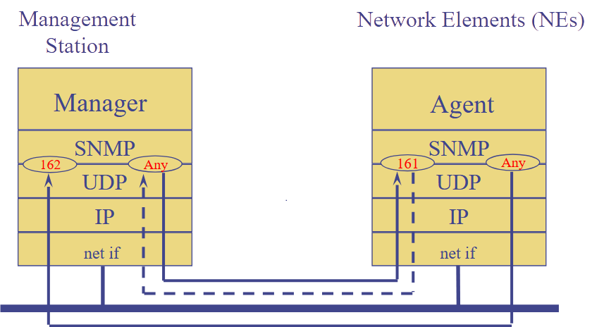
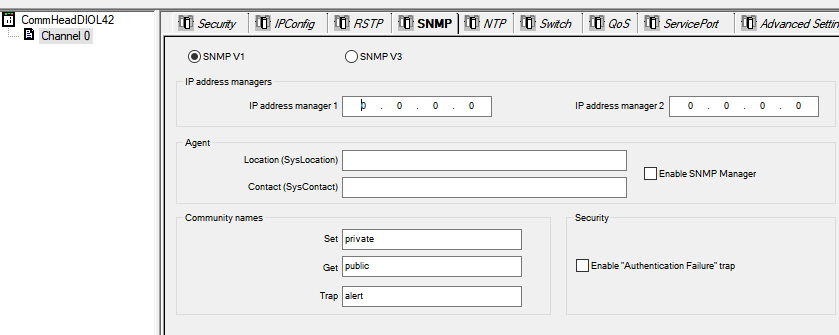

[<- До підрозділу](README.md)

# Сервіси SNMP: теоретична частина

## 1. Загальні поняття

**SNMP (Simple Network Management Protocol)** — це стандартний протокол для моніторингу та керування мережними пристроями. Він використовується адміністраторами для отримання інформації про стан обладнання, контроль параметрів роботи та віддалене керування. Протокол працює поверх UDP (порти 161 і 162) і є складовою архітектури Internet Protocol Suite.

Основні функції SNMP

1. Моніторинг - збір даних про стан пристроїв. 
2. Керування - можливість змінювати параметри роботи обладнання (наприклад, вмикати/вимикати порти, оновлювати конфігурацію).
3. Сповіщення (Traps/Inform) - надсилання повідомлень у разі подій чи збоїв.

SNMP є стандартом де-факто для:

- моніторингу мережної інфраструктури (маршрутизатори, комутатори, точки доступу);
- контролю та керування серверами й робочими станціями;
- роботи з IoT та промисловими пристроями (датчики, контролери);
- реалізації систем керування мережею (NMS); 

Варто відмітити, що **NMS** (Network Management System) - це централізована система керування мережею, що використовує SNMP (та інші протоколи) для моніторингу стану мережевих пристроїв, збору показників, візуалізації та оповіщень, віддаленого керування мережевою інфраструктурою. Приклади NMS - Zabbix, Nagios, SolarWinds, PRTG, OpenNMS.

NMP дозволяє отримувати та контролювати різні дані, наприклад:

- загальна інформація про пристрій — модель, версія прошивки чи операційної системи;
- час безперервної роботи з моменту останнього перезавантаження;
- стан мережних інтерфейсів — чи активні вони, як називаються;
- статистика трафіку — скільки байтів отримано й передано через певний порт;
- використання ресурсів — завантаження процесора, доступна й зайнята пам’ять, заповненість дисків;
- стан активних з’єднань у мережі, наприклад кількість відкритих TCP-сесій.

У свою чергу SNMP дає можливість також керувати пристроями. Наприклад, через нього можна дистанційно вмикати або вимикати мережний інтерфейс, скидати лічильники статистики, змінювати параметри конфігурації, а також надсилати команди на перезавантаження пристрою. Це дозволяє не лише спостерігати за станом мережі, а й активно впливати на її роботу. Таким чином адміністратор або інженер може централізовано бачити як працює обладнання й швидко реагувати на проблеми.

Архітектура системи контролю/керування мережею з точки зору SNMP включає наступні компоненти (рис.1):

- **Менеджер (SNMP Manager)** - програма чи сервер, що збирає та аналізує дані. 
- **Агент (SNMP Agent)** - процес, який працює на мережному пристрої (маршрутизатор, комутатор, сервер) і відповідає на запити менеджера. Саме агент відповідає за взаємодію з контрольованими та керованими даними на пристрої, через MIB.
- **MIB (Management Information Base)** - база даних у вигляді ієрархічного дерева об’єктів, яка описує доступні параметри для моніторингу й керування.


рис.1. Архітектура SNMP ([джерело](https://www.geeksforgeeks.org/computer-networks/simple-network-management-protocol-snmp))

Тобто на мережевих пристроях (маршрутизатори, комутатори тощо) працює SNMP Agent, який збирає дані з MIB-бази. SNMP Manager надсилає команди SNMP-команди через мережу Internet/Intranet до агента, який обробляє запит і повертає SNMP-відповіді, що містять потрібну інформацію про стан пристрою.

Для обладнання, яке не має власного SNMP-агента, використовується Proxy Agent. Це працює за наступним принципом (рис.2): Proxy Agent отримує SNMP-запити від менеджера, усередині він перетворює ці запити у формат, зрозумілий пристрою без SNMP (наприклад, через Modbus, HTTP, CLI чи інші протоколи). Потім Proxy Agent збирає потрібні дані з пристрою, конвертує їх у SNMP-відповідь і відправляє назад до SNMP Manager.


рис.2. Використання SNMP Proxy

## 2. Структурування та збереження мережних даних

У мережних пристроях є службова інформація про їхній стан і роботу, наприклад завантаження процесора, кількість трафіку через інтерфейси, обсяг доступної пам’яті чи статус портів. Ці характеристики описуються як керовані об’єкти (Managed Objects) — абстрактні сутності, що представляють окремі ресурси чи функції пристрою. Кожен керований об’єкт має один або кілька параметрів, які у MIB відображаються як змінні, доступні для зчитування чи зміни через SNMP.

Завдання формального опису й структурування керованих об’єктів вирішує **SMI** (Structure of Management Information), яка є стандартом, встановленим організаціями зі стандартизації (IETF), і означує базові правила кодування, типи даних та їхню ієрархічну організацію. Структурована інформація зберігається в базі даних MIB (Management Information Base). Структуру MIB, тобто які саме керовані об’єкти та їхні параметри будуть доступні, означують виробники обладнання та розробники програмного забезпечення для нього.

Кожна змінна у MIB має унікальний ідентифікатор OID (Object Identifier), що дозволяє однозначно посилатися на конкретний показник. І, нарешті, щоб ці дані можна було отримати або передати через мережу, використовується протокол SNMP, який стандартизований IETF і означує, як саме обмінюються повідомленнями менеджер та агенти.

### OID

**OID** (Object Identifier) — це унікальний ієрархічний ідентифікатор, який використовується в SNMP для позначення конкретної змінної (параметр керованого об'єкту) у MIB. Кожна змінна, яку можна опитати через SNMP (наприклад, завантаження CPU, кількість трафіку через інтерфейс, аптайм пристрою), має свій OID. 

Ось як пов'язані поняття об'єкту, параметру та змінної:

- Керований об’єкт (MO) - абстрактна сутність (наприклад, мережний інтерфейс).
- Параметр цього об’єкта - певна його характеристика (наприклад, швидкість інтерфейсу або стан лінку).
- Змінна SNMP - це параметр у вигляді, доступному через SNMP, і саме вона має OID.

OID виглядає як послідовність чисел, розділених крапками, наприклад:

```
1.3.6.1.2.1.1.3.0
```

Ці числа відповідають вузлам у дереві MIB. Дерево має глобальну ієрархію (всесвітню, як DNS), яку підтримує ISO/IETF. На рис.3 показаний приклад відображення змісту об'єкту в переглядачі MIB. 


рис.3. Скалярний об'єкт в дереві MIB Browser 

Приклад розбору `1.3.6.1.2.1.1.3.0`:

- 1 — `ISO (root)`
- 3 — `org`
- 6 — `dod` (Department of Defense)
- 1 — `internet`
- 2 — `mgmt` (керування)
- 1 — `MIB-2`
- 1 — `system` (група системних змінних)
- 3 — `sysUpTime` (час роботи від запуску)
- 0 — конкретний об’єкт (одне значення, не таблиця)

Типи OID:

1. Скалярні об’єкти. Завжди закінчуються .0 Приклади:
   - `1.3.6.1.2.1.1.1.0` → `sysDescr` (опис системи)
   - `1.3.6.1.2.1.1.3.0` → sysUpTime
2. Табличні об’єкти. Не мають фіксованого .0, а замість цього закінчуються індексами рядків. Приклад: `ifTable` (таблиця інтерфейсів)
   - `1.3.6.1.2.1.2.2.1.2.1` → опис першого інтерфейсу
   - `1.3.6.1.2.1.2.2.1.2.2` → опис другого інтерфейсу


рис.4. Табличний об'єкт в дереві MIB Browser 

Приклади OID у практиці:

- `1.3.6.1.2.1.1.1.0` → `sysDescr` (опис системи: ОС, версія, виробник)
- `1.3.6.1.2.1.1.3.0` → `sysUpTime` (скільки часу працює пристрій)
- `1.3.6.1.2.1.2.2.1.10.X` → ifInOctets (кількість отриманих байтів на інтерфейсі X)
- `1.3.6.1.2.1.25.3.3.1.2.X` → hrProcessorLoad (завантаження CPU на сервері)

Без OID менеджер мережі не зможе знати, що саме він читає. Вендори (Cisco, Siemens, Microsoft для Windows) додають власні об'єкти з відповідними OID, що починаються з гілки `1.3.6.1.4.1` (enterprise). Наприклад, у Cisco OID виглядають як `1.3.6.1.4.1.9...`, у Siemens — `1.3.6.1.4.1.4329...`. Але в реальній роботі з OID у чистому числовому вигляді майже ніхто не працює. Постійно запам’ятовувати довгі послідовності цифр незручно, а без додаткового опису вони нічого не говорять інженеру. Саме тому існує MIB - текстові файли, у яких визначено ієрархію об’єктів, їхні імена, типи даних і призначення. Завдяки MIB менеджер моніторингу може не просто опитати `1.3.6.1.2.1.1.3.0`, а зрозуміти, що це змінна `sysUpTime`, яка відображає час роботи пристрою. Таким чином, MIB є обов’язковим «словником» між цифрами OID та зрозумілими описами параметрів, без якого ефективне використання SNMP практично неможливе.

### MIB файли

MIB-файл не зберігається всередині агента і не передається через SNMP-протокол. Агент містить лише дані, впорядковані за OID, а їхній зміст і значення відображаються у вигляді числових ідентифікаторів. MIB файли описують у форматі ASN.1, що означає кожен OID і які типи даних йому відповідають. Таким чином, на практиці менеджер мережі завжди має набір стандартних MIB (наприклад, RFC1213-MIB, IF-MIB, HOST-RESOURCES-MIB), які підтримуються більшістю обладнання, а також додаткові MIB, які постачають виробники конкретних пристроїв чи програмного забезпечення (PLC, маршрутизатори, комутатори). Завантаживши MIB у засіб моніторингу, інженер отримує зрозуміле представлення даних і може оперувати іменами змінних, а не лише їхніми числовими ідентифікаторами.

Нижче наведена таблиця, яка узагальнює базові MIB для різних категорій пристроїв:

Таб.1. 

| Категорія                                                    | MIB                                                | Призначення                                                  |
| ------------------------------------------------------------ | -------------------------------------------------- | ------------------------------------------------------------ |
| Загальні (обов’язкові для всіх пристроїв)                    | RFC1213-MIB (MIB-II)                               | Базові змінні: sysDescr, sysUpTime, ifTable (стан інтерфейсів), статистика мережі |
|                                                              | SNMPv2-MIB                                         | Розширення для SNMPv2: повідомлення, типи даних              |
|                                                              | SNMPv2-SMI, SNMPv2-TC                              | Технічні основи для типів і модулів                          |
|                                                              | IF-MIB                                             | Детальний опис інтерфейсів: статус, помилки, швидкість, лічильники пакетів |
| Сервери (Windows, Linux)                                     | HOST-RESOURCES-MIB                                 | Стан процесора, пам’яті, дисків, процесів                    |
|                                                              | UCD-SNMP-MIB (Linux, Net-SNMP)                     | Додаткові змінні: CPU load, swap, файлові системи            |
|                                                              | DISMAN-EVENT-MIB                                   | Генерація подій за умовами (для алертів)                     |
| Мережне обладнання (маршрутизатори, комутатори, точки доступу) | IP-MIB                                             | Інформація про IP-протоколи: адреси, маршрути, статистика    |
|                                                              | TCP-MIB / UDP-MIB                                  | Моніторинг TCP/UDP-з’єднань                                  |
|                                                              | BRIDGE-MIB                                         | Таблиці MAC-адрес у комутаторах                              |
|                                                              | RMON-MIB                                           | Розширена статистика трафіку, віддалений моніторинг          |
|                                                              | ENTITY-MIB                                         | Опис модульної архітектури пристрою (шасі, карти, порти)     |
| Промислові пристрої та PLC                                   | MODBUS-MIB (vendor-specific)                       | Якщо пристрій підтримує Modbus через SNMP                    |
|                                                              | Vendor MIBs (Siemens, Schneider, Beckhoff…)        | Специфічні змінні для PLC, датчиків, приводів                |
|                                                              | SENSOR-MIB (vendor-specific)                       | Параметри від сенсорів: температура, вологість тощо          |
| Windows-агенти                                               | Windows SNMP Agent MIBs                            | Базові лічильники CPU, пам’яті, дисків (через HOST-RESOURCES-MIB) |
|                                                              | Microsoft Management Packs (частково пропрієтарні) | Додаткові специфічні MIB для Windows-середовища              |

MIB-файли необхідно отримувати з офіційних джерел. Стандартизовані MIB публікуються разом з RFC і доступні у відкритих репозиторіях, наприклад на сайті IETF чи інших базах OID (наприклад https://oidref.com/). Виробники обладнання, такі як Cisco, Siemens або Schneider, поширюють власні MIB через розділи підтримки та завантажень на своїх сайтах. Часто потрібні MIB уже постачаються разом із програмним забезпеченням або агентами, наприклад у складі пакета Net-SNMP чи Windows SNMP Agent. Для роботи з менеджерами моніторингу або MIB Browser необхідно підвантажити відповідні файли у систему.

У літературі часто зустрічається назва MIB-II — це стандартний набір базових керованих об’єктів (RFC 1213), обов’язковий для всіх пристроїв з підтримкою SNMP, який є частиною загальної бібліотеки MIB. Тому усі таблиці MIB для SNMP по факту є частинами однієї ієрархічної бази керованих об’єктів, де MIB-II становить мінімальний обов’язковий набір, а решта MIB розширюють його залежно від функцій пристрою чи виробника.

У MIB-II усі керовані об’єкти згруповані за функціональними розділами, щоб спростити їх пошук та використання. Кожна група відповідає за певний аспект роботи пристрою: системна інформація, інтерфейси, протоколи мережного рівня тощо. Завдяки такому поділу адміністратор або менеджер SNMP може швидко орієнтуватися в даних і зосереджуватись на потрібній категорії. 

Таб.2. Основні групи об'єктів MIB-II

| Група                    | Призначення                                                  |
| ------------------------ | ------------------------------------------------------------ |
| system                   | Загальна інформація про пристрій: опис, аптайм, контакт, ім’я, розташування. |
| interfaces               | Відомості про всі мережні інтерфейси: стани, швидкості, статистика переданих і втрачених пакетів. |
| at (Address Translation) | Таблиці відповідності IP ↔ MAC (подібно до ARP-таблиці).     |
| ip                       | Інформація про IP-протокол: адреси, маршрути, помилки, статистика. |
| icmp                     | Дані про використання ICMP (echo, unreachable, errors).      |
| tcp                      | Статистика TCP-з’єднань: кількість відкритих сокетів, стани, помилки. |
| udp                      | Статистика UDP: кількість датаграм, помилки, активні порти.  |
| egp                      | Параметри старого протоколу зовнішнього шлюзу (EGP, зараз майже не використовується). |
| snmp                     | Дані про сам SNMP-агент: кількість запитів, помилок, trap-повідомлень. |
| transmission             | Це зарезервоване місце в дереві OID для MIB-об’єктів, що описують специфіку різних технологій передачі даних (Ethernet, FDDI, DSL тощо). Тобто тут не одна єдина стандартна група, а скоріше контейнер для розширень, де виробники чи стандартизаційні організації додають визначення для своїх інтерфейсів. |


рис.5. Групи об'єктів MIB

На рис.5 видно, що крім класичних груп MIB-II у дереві є й додаткова гілка `host`. Це пов’язано з тим, що MIB-дерево може розширюватися як стандартними розширеннями, так і вендорськими гілками. Саме тому необхідно мати відповідні файли MIB, адже виробники обладнання та програмного забезпечення часто додають власні об’єкти до базових MIB-II. Без цих описів менеджер не зможе інтерпретувати додаткові параметри, і користувач побачить лише числові OID без пояснень. На рис.5 показане дерево HOST-RESOURCES-MIB, призначене для серверів і робочих станцій, яке містить групу `host` з описом ресурсів хоста: процесорів, пам’яті, дисків, процесів і встановленого програмного забезпечення.

## 3. Робочі та тестові SNMP Менеджери

### Менеджери SNMP

Менеджери SNMP у практичному використанні найчастіше відповідають за централізований моніторинг великої кількості пристроїв у мережі. Вони дозволяють одночасно опитувати тисячі агентів, збирати статистику про використання процесора, пам’яті чи мережних інтерфейсів, а також автоматично реагувати на події, наприклад, коли зникає зв’язок із вузлом чи перевищується навантаження. Типовий кейс – адміністратор підприємства бачить у єдиній панелі стан маршрутизаторів, комутаторів, серверів, принтерів чи навіть PLC, і може налаштувати порогові значення, при перевищенні яких надсилається сповіщення.

Одним із найпопулярніших інструментів є Zabbix (https://www.zabbix.com). Це відкрите рішення, яке може збирати дані як через SNMP, так і через власних агентів, а також підтримує інші протоколи. Zabbix добре підходить для великих інфраструктур завдяки масштабованості та розгалуженим можливостям побудови дашбордів, створення тригерів і автоматизації реакцій на події. Його часто використовують як у корпоративних мережах, так і в промислових системах. Про Zabbix в народному посібнику є [окремий модуль](../../dataview/zabbix/README.md). 

Іншим відомим інструментом є Nagios (https://www.nagios.org/). Він має довгу історію розвитку і значну спільноту користувачів. Nagios орієнтований на просте та гнучке підключення нових пристроїв через SNMP-плагіни, а також на генерацію сповіщень. Часто застосовується там, де потрібно отримати швидке рішення для відстеження базових метрик. Є багато комерційних продуктів, зокрема PRTG Network Monitor, SolarWinds Network Performance Monitor та ін.

Також драйвери SNMP використовуються і у SCADA-системах, з метою інтеграції мережного та IT-обладнання в загальну систему диспетчеризації. Зазвичай SCADA опитує контролери через промислові протоколи (Modbus, Profibus, OPC тощо), але інфраструктурне середовище теж потребує контролю. Наприклад, від надійності комутаторів, маршрутизаторів чи серверів залежить робота всієї АСКТП, тому їхній стан доцільно відслідковувати у тій самій SCADA, де оператор бачить і виробничі процеси. SNMP-драйвер у SCADA дає можливість читати керовані об’єкти з мережного обладнання: температуру шасі, завантаження процесора, статус портів комутатора чи аптайм маршрутизатора. На рівні візуалізації це може відображатися як сигнали тривоги, зміна кольору на мнемосхемі або повідомлення про несправність. Таким чином оператор одразу бачить не лише відмову датчика чи PLC, а й проблему з мережевим каналом чи сервером.

Прикладами SCADA-систем, що мають підтримку SNMP, є Plant SCADA (ex. Citect, Schneider Electric), SCADA zenon (COPA DATA), WinCC (Siemens), Wonderware System Platform (AVEVA Schneider Electric), Ignition від Inductive Automation (модуль SNMP), а також українські розробки, де SNMP часто додається як окремий драйвер OPC-сервера. У всіх випадках мета одна — об’єднати промислові дані та дані про мережеву інфраструктуру в єдиному середовищі моніторингу.

### Тестові SNMP-менеджери

У практиці налаштування мережного обладнання чи вивчення SNMP часто виникає потреба у швидкому інструменті для перевірки роботи агентів. Повноцінні системи моніторингу, такі як Zabbix або Nagios, мають складну архітектуру і вимагають тривалої конфігурації, що не завжди зручно для тестування окремих пристроїв чи навчання. Для таких випадків використовуються легкі тестові менеджери — спеціальні програми, які дозволяють у кілька кліків відправити SNMP-запит, переглянути відповідь агента, завантажити MIB-файл та оперувати окремими OID.

Призначення тестових менеджерів полягає у відпрацюванні базових принципів SNMP: перевірці працездатності агента, доступності пристрою, правильності community string, а також у дослідженні структури MIB. Вони корисні інженерам на етапі діагностики або початкового навчання, коли потрібно зрозуміти, як саме виглядає керований об’єкт і що повертає агент.

Серед безкоштовних інструментів найчастіше застосовуються:

- [iReasoning MIB Browser Free Edition](https://www.ireasoning.com/mibbrowser.shtml) - один із найпопулярніших тестових клієнтів з графічним інтерфейсом;
- [SnmpB](https://sourceforge.net/projects/snmpb/) - кросплатформений open-source менеджер із можливістю завантаження MIB;
- [Paessler SNMP Tester](https://www.paessler.com/tools/snmptester) — проста утиліта від розробників PRTG для перевірки агента без повної системи моніторингу.

Окремо варто зупинитися на [iReasoning MIB Browser](https://www.ireasoning.com/mibbrowser.shtml), який став стандартним інструментом для багатьох інженерів. У безкоштовній версії він дозволяє: завантажувати стандартні та вендорські MIB-файли, переглядати дерево керованих об’єктів, виконувати базові операції SNMP (Get, GetNext, GetBulk, Set), а також обробляти traps у реальному часі. Копії екранів з рис.3-5 зроблені саме з цього ПЗ. Завдяки зручному графічному інтерфейсу користувач може легко переходити по гілках MIB, бачити ієрархію OID та відразу відправляти запити. Цей інструмент особливо корисний для початківців, оскільки наочно показує, як виглядає таблиця інтерфейсів або системні параметри пристрою, і дозволяє швидко переконатися, що SNMP налаштований правильно.

Варто також згадати консольні утиліти з пакета Net-SNMP (https://www.net-snmp.org), які є стандартом де-факто для швидкої перевірки роботи SNMP. Найбільш поширені з них — `snmpget`, `snmpwalk` та `snmpset`. Вони дозволяють виконати базові операції: прочитати окреме значення (get), обійти дерево параметрів (`walk`) або змінити значення (`set`). Ці утиліти доступні як у Linux (через пакет `net-snmp-utils`), так і у Windows (з попередньо зібраними бінарними файлами), і часто застосовуються інженерами для діагностики або швидкого тестування SNMP-агентів без розгортання повноцінного середовища моніторингу. Наприклад, щоб перевірити аптайм пристрою, достатньо виконати команду:

```
snmpget -v2c -c public 192.168.1.1 sysUpTime.0
```

А щоб побачити всі доступні параметри системної групи:

```
snmpwalk -v2c -c public 192.168.1.1 system
```

Ці інструменти прості, не потребують додаткової конфігурації та дуже корисні у випадках, коли потрібно швидко підтвердити роботу агента чи правильність налаштувань SNMP.

## 4. Типові SNMP-агенти в системах АСКТП та SCADA

У системах автоматизованого керування технологічними процесами (АСКТП) та SCADA SNMP використовується не так широко, як у класичному мережному адмініструванні, однак його роль поступово зростає. Це пов’язано з потребою об’єднувати промислові контролери, сервери та мережне обладнання в єдину інфраструктуру моніторингу.

Найчастіше SNMP-агенти присутні в самих мережних пристроях, які входять до складу інфраструктури АСКТП - маршрутизаторах, керованих комутаторах, точках доступу. Завдяки їм інженери можуть відстежувати доступність і завантаження каналів зв’язку, які є критично важливими для безперервної роботи SCADA-систем та АСКТП.

Окрему категорію становлять сервери та робочі станції SCADA, які працюють під керуванням Windows чи Linux. У цих системах часто активуються стандартні SNMP-агенти, що надають інформацію про стан CPU, пам’яті, дисків, запущених процесів. Це дозволяє диспетчерам не тільки контролювати роботу прикладного ПЗ, але й своєчасно реагувати на збої апаратної чи операційної частини. Більшість робочих станцій працюють під ОС Windows, для яких можна використовувати SNMP-агенти, які забезпечують доступ до параметрів операційної системи через стандартні MIB. У старіших версіях Windows (до Windows Server 2012) SNMP-агент встановлювався як стандартна роль або компонент системи. У новіших версіях Windows (Server 2016, 2019, 2022) SNMP-агент доступний як додаткова опція, яку треба інсталювати через PowerShell командою `Add-WindowsCapability`. Після встановлення він працює аналогічно класичним агентам, але потребує ручної конфігурації.  Альтернативою вбудованим агентам є пакети з відкритим кодом, наприклад `Net-SNMP` для Windows (https://www.net-snmp.org). Вони дозволяють більш гнучко налаштовувати перелік об’єктів, які експортуються через SNMP, і можуть підтримувати додаткові MIB, яких немає у стандартному Windows-агенті. Такі рішення зручні тоді, коли потрібно інтегрувати Windows-сервери у більш складні системи моніторингу, або коли потрібна кросплатформність між Windows і Linux. Ще один варіант — використання спеціалізованих агентів від сторонніх постачальників. Наприклад, деякі системи резервного копіювання, антивірусні рішення чи моніторингові утиліти встановлюють власні SNMP-агенти, які додають нові MIB з інформацією про стан програмного забезпечення, ліцензії або активні події.

У Linux найбільш поширеним SNMP-агентом є Net-SNMP (snmpd), який входить до стандартних репозиторіїв практично всіх дистрибутивів і забезпечує підтримку базових MIB, таких як MIB-II та HOST-RESOURCES-MIB, з можливістю розширення власними скриптами чи модулями; він використовується для моніторингу стану системи, включаючи процесор, пам’ять, диски, інтерфейси та процеси. У старих інсталяціях все ще може зустрічатися його попередник UCD-SNMP, тоді як у великих системах на додачу застосовуються рішення на кшталт OpenNMS Minion або Collector, які збирають метрики й передають їх на центральний сервер. Окремі серверні програми, наприклад MySQL, PostgreSQL чи Apache, також можуть експортувати власні метрики через SNMP безпосередньо або через плагіни Net-SNMP. Крім того, у промислових Linux-пристроях часто використовуються вендорські агенти, зазвичай на основі Net-SNMP, які містять додаткові приватні MIB для доступу до специфічних параметрів, таких як стан модемів, процеси PLC чи показники від датчиків.

Особливу роль у промислових системах відіграють програмовані ПЛК. Багато виробників (Schneider Electric, Siemens,  Beckhoff, WAGO) реалізують у своїх контролерах підтримку SNMP, зазвичай у вигляді вбудованого агента. Через нього можна отримати інформацію про стан модулів вводу/виводу, рівень завантаження CPU, температуру, а також про мережні інтерфейси контролера. Деякі ПЛК дозволяють навіть генерувати SNMP-трапи для сигналізації аварійних станів або відмови живлення.

Крім ПЛК, SNMP-агенти в системах АСКТП можна зустріти в промислових шлюзах (наприклад, Modbus–TCP/IP чи OPC UA–SNMP), які інтегрують польові пристрої з рівнем диспетчерського керування. Багато контролерів живлення (UPS), промислових джерел безперебійного живлення та систем кондиціонування/охолодження серверних приміщень мають SNMP-агенти для відстеження стану. У деяких моделях датчиків і інтелектуальних приводів агенти також реалізовані для передачі технологічних параметрів і діагностики. 

У SCADA-програмах самих по собі SNMP-агенти зустрічаються рідко, оскільки вони виконують роль менеджерів, які опитують інші пристрої. Водночас SNMP-агенти у SCADA-середовищі можуть бути встановлені на сервери Hystorian, OPC-сервери чи допоміжні вузли, щоб надавати NMS або іншим інструментам централізованого моніторингу інформацію про стан цих компонентів.

Таким чином, типовими SNMP-агентами в АСКТП є:

- мережне обладнання, яке забезпечує комунікаційну інфраструктуру;
- сервери та операторські станції SCADA;
- ПЛК та інші промислові пристрої з підтримкою SNMP;
- допоміжні вузли (Hystorian, сервери резервування), які інтегруються в інфраструктуру моніторингу.

## 5. SNMP протокол

### Сервіси

У загальному вигляді протокол SNMP надає такі сервіси:

1. Читання даних (Get, GetNext, GetBulk) – менеджер може отримати значення змінних від агента. Це основний механізм моніторингу.
2. Запис даних (Set) – менеджер може змінювати значення деяких змінних, наприклад вимкнути інтерфейс чи оновити параметр.
3. Асинхронні повідомлення (Trap, Inform) – агент може сам надіслати менеджеру сигнал про подію (наприклад, збій інтерфейсу, перегрів).
4. Структурована організація доступу до інформації – через ієрархію OID, означену в MIB, менеджер може послідовно опитувати або обходити дерево змінних.

Таб.2. Сервіси

| Операція / сервіс | Виконує          | Призначення                                                  | Приклад використання                                         |
| ----------------- | ---------------- | ------------------------------------------------------------ | ------------------------------------------------------------ |
| Get               | Менеджер → Агент | Отримати значення конкретної змінної (керованого об’єкта).   | Запитати в маршрутизатора час роботи з моменту останнього запуску (`sysUpTime`). (рис.3) |
| GetNext           | Менеджер → Агент | Отримати наступну змінну в ієрархії OID (для послідовного обходу MIB). | Перебрати всі мережні інтерфейси (`ifTable`) поступовим відправленням GetNext. |
| GetBulk           | Менеджер → Агент | Отримати одразу кілька змінних за один запит (ефективніше в SNMPv2). | Зібрати статистику всіх портів комутатора одним запитом (рис.6). |
| Set               | Менеджер → Агент | Змінити значення змінної, щоб керувати пристроєм.            | Вимкнути порт на комутаторі (`ifAdminStatus = down`).        |
| Trap              | Агент → Менеджер | Надіслати повідомлення про подію без запиту менеджера.       | Комутатор сам повідомляє про падіння лінку.                  |
| Inform            | Агент → Менеджер | Надіслати повідомлення про подію з підтвердженням від менеджера. | Сервер надсилає повідомлення про перегрів і отримує підтвердження, що воно доставлено. |


рис.6. Використання GetBulk для збирання статистики всіх портів комутатора лічильників вхідного трафіку одним запитом

### Протокольний стек

Архітектура системи моніторингу SNMP базується на взаємодії менеджера та агента з використанням протоколу SNMP, який функціонує поверх транспортного протоколу UDP (рис.6). UDP забезпечує простий і швидкий обмін повідомленнями без встановлення з’єднання (про протоколи TCP та UDP описано в модулі [Основи протоколів TCP та UDP](../tcpudp/README.md)). Для цього використовуються стандартні порти:

- агент очікує запити менеджера на UDP-порті 161,
- менеджер отримує асинхронні повідомлення (traps/notifications) від агента на UDP-порті 162.
- Інші локальні порти можуть використовуватися довільно (Any) залежно від реалізації.



рис.7. 

На сьогодні протокол SNMP доступний в 3-х версіях: 

- SNMPv1 (1988) — початкова версія, проста, але з обмеженою безпекою.

- SNMPv2c (1993) — розширена функціональність, підтримка bulk-запитів (дозволяє за один запит отримати одразу кілька значень з MIB), але знову ж таки слабкий захист (паролі у відкритому вигляді).
- SNMPv3 (1998) — сучасна версія, що забезпечує аутентифікацію, шифрування і контроль доступу.

## 6. Автентифікація та безпека в SNMP

У практичній роботі з SNMP перше, що доведеться налаштовувати — це методи автентифікації, які залежать від версії протоколу. 

### SNMPv1 і SNMPv2c 

У SNMPv1 і SNMPv2c використовується методика з використанням `community string`. Це текстовий рядок, який виконує роль пароля і означує права доступу. Найчастіше зустрічаються два значення: `public` для доступу лише на читання та `private` для доступу на запис. Цей рядок потрібно вказати як на боці агента (у конфігурації пристрою чи сервера), так і на боці менеджера (у параметрах підключення під час опитування). На рис.8 показано як `community string` налаштовується для стандартного Windows агента. Рівень доступу задається при створенні:

- `READ ONLY` — дозволяє лише читати параметри (найчастіше саме так і використовують).
- `READ WRITE` — дозволяє змінювати конфігурацію через SNMP (небезпечніше). 


рис.8. Налаштування безпеки для стандартної служби агента SNMP Windows

На рис.9 покзані налаштування SNMP в Modicon PAC M580 (Schneider Electric). Тут  `community string` (`community names`) задаються для прав доступу через сервіси `SET` , `GET` та `Trap`.  



рис.9. Налаштування безпеки для агента SNMP в Modicon PAC M580 (Schneider Electric) 

Варто пам’ятати, що `community string` передається відкритим текстом, тому застосовувати цей підхід бажано лише у внутрішніх мережах або з додатковим захистом (VPN, фаєрволи).

У налаштуваннях SNMP-агентів може використовуватися додаткові поля IP, для означення того, кому дозволено надсилати SNMP-запити або куди відправляти SNMP-повідомлення (трапів). Є два основних варіанти:

1. Дозвіл доступу тільки з певних IP-адрес. У цьому випадку агент прийматиме SNMP-запити лише від вказаних хостів (менеджерів). Це базова форма контролю доступу: навіть якщо хтось знає `community string`, але його IP не внесений у список, агент ігноруватиме запити. Так наприклад зроблено в стандартному агенті Windows (рис.8)
2. Вказівка IP-адрес для надсилання `trap`. Агент може бути налаштований так, щоб надсилати повідомлення про події (`link up`, `link down`, перезапуск, помилки) лише на певні IP-адреси, де працюють SNMP-менеджери чи системи моніторингу.

Тобто IP-фільтрація в SNMP-агентах використовується як додатковий механізм безпеки й маршрутизації повідомлень: вона дозволяє означити, хто може опитувати агент і куди агент може сам ініціювати повідомлення.

### SNMPv3

SNMPv3 надає більш надійну методику, яка базується на автентифікації користувачів. У цьому випадку адміністратор створює облікові записи із вказанням імені користувача та пароля, а також рівня захисту: тільки автентифікація або автентифікація разом із шифруванням переданих даних. На стороні агента потрібно створити таких користувачів, а на стороні менеджера — задати відповідні облікові дані. Це дозволяє не лише захистити трафік, але й обмежити доступ до конкретних груп об’єктів у MIB для різних категорій користувачів.

У SNMPv3, крім самого механізму користувачів, задається рівень безпеки (`security level`), який означує, як саме буде захищене з’єднання між менеджером і агентом. Є три рівні:

- `noAuthNoPriv` — без автентифікації та без шифрування, фактично лише користувацьке ім’я;
- `authNoPriv` — автентифікація за допомогою пароля (MD5 або SHA), але без шифрування трафіку;
- `authPriv` — автентифікація плюс шифрування даних (AES або DES).

Наприклад, у Net-SNMP при додаванні користувача можна задати команду:

```
net-snmp-config --create-snmpv3-user -a MyAuthPass -x MyPrivPass -X AES -A SHA myuser
```

де `myuser` — ім’я користувача, `SHA` — алгоритм автентифікації, а `AES` — шифрування. У Cisco IOS ці рівні також задаються при створенні SNMPv3-груп і користувачів (через команди `snmp-server group` та `snmp-server user`).

На практиці це дозволяє обирати баланс між безпекою і продуктивністю: для внутрішніх лабораторних стендів часто вистачає `authNoPriv`, тоді як у промислових або корпоративних мережах рекомендується використовувати `authPriv`.

Варто пам’ятати, що SNMPv1 та SNMPv2c у багатьох пристроях і досі залишаються увімкненими «за замовчуванням». У цих версіях захист обмежується лише `community string`, який передається відкритим текстом, і будь-хто в тій самій мережі може його перехопити. Це створює серйозний ризик, особливо якщо для запису використовується `community` з правами `write`. Тому навіть якщо використовується старіший SNMP, слід хоча б обмежити доступ до агентів фільтрацією за IP-адресами — тобто дозволяти з’єднання лише від конкретного менеджера або сервера моніторингу. У Windows та Net-SNMP це робиться у конфігурації агента, у Cisco — через ACL.

У SCADA та промислових мережах часто зустрічаються обидва підходи: для швидкого підключення та тестування використовують `community string`, а для постійного моніторингу у виробничому середовищі налаштовують SNMPv3 з автентифікацією й шифруванням. Таким чином, інженеру потрібно розуміти, який рівень захисту підтримує конкретне обладнання, і правильно задати відповідні параметри на боці менеджера та агента.


## Питання для самоперевірки


Теоретичне заняття розробив [Олександр Пупена](https://github.com/pupenasan). 


Якщо Ви хочете залишити коментар у Вас є наступні варіанти:

- [Обговорення у WhatsApp](https://chat.whatsapp.com/BRbPAQrE1s7BwCLtNtMoqN)
- [Обговорення в Телеграм](https://t.me/+GA2smCKs5QU1MWMy)
- [Група у Фейсбуці](https://www.facebook.com/groups/asu.in.ua)

Про проект і можливість допомогти проекту написано [тут](https://asu-in-ua.github.io/atpv/)
