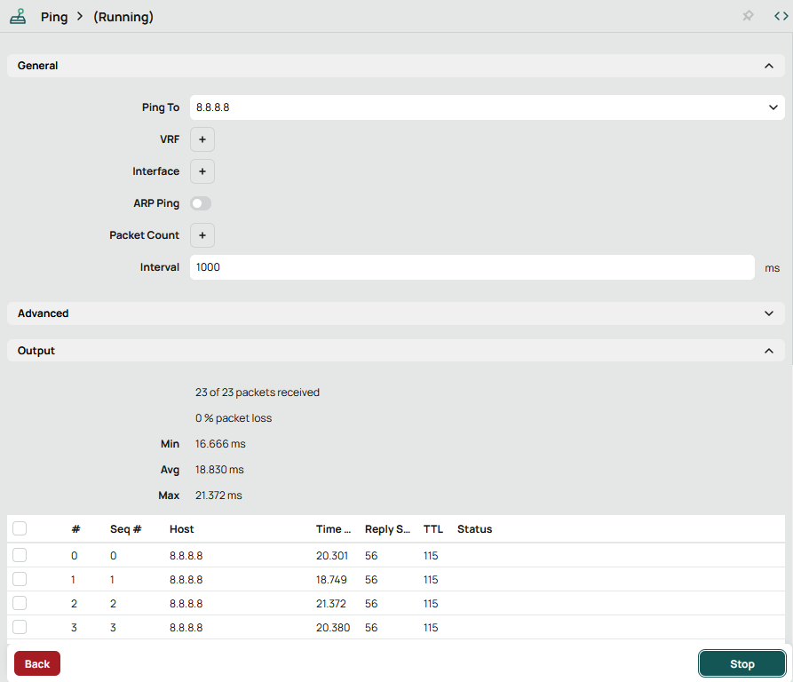
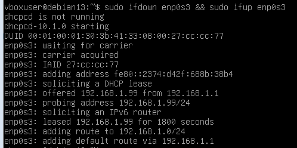

[<- До підрозділу](README.md)

# Базове налаштування маршрутизатору: практична частина

**Тривалість**: 4 акад. години (2 пари).

**Мета:** Навчитися налаштовувати маршрутизатор на типові задачі

### Лабораторна установка

**Необхідне апаратне забезпечення.** 

Для проведення лабораторних робіт необхідно мати комп’ютер з наступною мінімальною апаратною конфігурацією:

- CPU Intel/AMD 1 ГГц / RAM 2 ГБ / HDD 10 ГБ (вільних)  

**Необхідне програмне забезпечення.** 

Практичне завдання передбачає наявність встановленого ПЗ відповідно до заняття [Інструменти віддаленого доступу та налагодження: практична частина](../../nets/debug/lab.md), а саме:

- VirtualBox на хостовій машині
- встановлені віртуальні машини Windows 10 та Debian 
- сніфер Wireshark на VM Windows 10

**Загальна постановка задачі**. 

Цілі роботи: 

1) навчитися конфігурувати наступні функції маршрутиазтору:
   - IP адреси портів
   - DHCP
   - NAT

Лабораторна робота розроблена з урахуванням самостійного виконання без наявності реального обладнання. Тим не менше, вона емулює роботу реальної установки показаної на рис.1 (ліворуч). Реальна установка для проведення лабораторної роботи повинна б була включати:

- комп'ютери користувача з однією картою LAN або інший пристрій, що необхідно підключити до загальної мережі або Інтернет через мережу маршрутизатору LAN;
- маршрутизатор (Router) з двома мережними картами (LAN та WAN), що крім функцій маршрутизації має додаткові функції, що є типовими для сучасних маршрутизаторів побутового рівня і використовуються в даній лабораторній роботі;
- адміністративний комп'ютер, який використовується для налаштування маршрутизатору
- мереж LAN та WAN

Емуляція реальної установки проводиться з використанням VirtualBox та віртуальних машин:

- комп'ютери користувача емулюються через віртуальні машину з Windows 10 та Debian
- маршрутизатор (Router) емулюється через вітуальну машину з ОС Mikrotik 
- мережа LAN емулюється внутрішньою віртуальною мережею VirtualBox, до неї підключаються віртуальні машини користувача та маршрутизатору 
- мережа WAN VM Mikrotik підключається до реальної мережної карти хостової ОС через мостове налаштування     


рис.1. Структура лабораторної установки

### Послідовність виконання роботи

- [ ] Отримайте номер варіанту у викладача. **Номер варіанту повинен бути відмінний від `1`!**

#### 1. Встановлення віртуальної машини для маршрутизатору Mikrotik

- [ ] Встановіть віртуальну машину ОС маршрутизатору Mikrotik [додатку](d3_1.md) 
- [ ] Запустіть віртуальну машину маршрутизатору та перевірте доступ до Веб-консолі 

**Надалі під словом "маршрутизатор" буде розумітися віртуальна машина з ОС маршрутизатору Mikrotik.** 

#### 2. Налаштування мережної карти LAN для маршрутизатору 

- [ ] У веб-консолі маршрутизатору автентифікуйте себе (користувач та пароль). Ви автоматично перейдете у вікно швидких налаштувань. 
- [ ] Зверніть увагу на наявність 2-х мережних карт, що називаються `Internet` та `Local Network` (рис.2). Для WAN за замовченням вказується автоматичний режим отримання адреси IP (`Automatic`), тому тут мережний інтерфейс як DHCP-клієнт отримав адресу `192.168.10.106` та `Gateway = 192.168.10.50` від DHCP-серверу в мережі. **У Вашому випадку це буде інша адреса, яку необхідно буде враховувати в майбутніх пунктах!**     
- [ ] Для `Local Network` введіть `IP Address = 192.168.x.1` (де `x` - номер варіанту) та виберіть маску  Після цього натисніть `Apply Configuration` (рис.2.)  

**Увага, надалі в прикладах буде використовуватися віртуальна локальна мережа `192.168.1.0` у вашому випадку буде підмережа  `192.168.x.0/24` (де `x` - номер варіанту) !**

**Увага, проконтролюйте, що номер підмережі не співпадає з номером підмережі LAN Вашого реального маршрутизатора! Якщо співпадає, збільшіть номер мережі на 100**


рис.2. Налаштування мережної карти LAN для маршрутизатору

**Варто зауважити, що така конфігурація без включеного NAT на microtic не буде забезпечувати доступ до Інтернет. Хоч пристрої в локальній мережі будуть бачити маршрутизатор Microtic, і Microtic матиме доступ до Інтернет, ip-пакети не будуть перенаправлятися з реального маршрутизатора на Microtic, які стосуються локальної мережі  за ним.**

#### 3. Перевірка доступу до маршрутизатору до Internet

- [ ] У вікні веб-консолі маршрутизатору перейдіть до відображення усіх налаштувань (`Advanced`).

  

- [ ] Відкрийте вікно `Tools->Ping` та перевірте чи йдуть пінги до адреси в Інтернеті, наприклад `8.8.8.8`. Якщо пінги йдуть, зупиніть їх кнопкою `Stop` і переходьте до інших пунктів лабораторної. Якщо ні - проконсультуйтеся з викладачем.




рис.3. Вікно утиліти `ping` на маршрутизаторі 

#### 4. Налаштування віртуальної машини VM Windows 10 зі статичними адресами

- [ ] У VirtualBox Manager відкрийте налаштування віртуальної машини VM Windows 10.
- [ ] Налаштуйте `Адаптер 1` на роботу з віртуальною мережею `VirtualLAN` , усі інші адаптери відключіть.


рис.4. Налаштування мережної карти віртуальної машини

- [ ] Запустіть VM Windows 10
- [ ] Виставте статичну IP адресу на мережній карті:  
- `IP=192.168.1.10/24`
- `Default Gateway = 192.168.1.1`.
- `DNS = 8.8.8.8`


рис.5. Налаштування статичної IP-адреси для віртуальної машини

- [ ] Налаштуйте гостьову ОС таким чином, щоб вони реагували на ехо-запити (відлуння) ICMP. Для цього:
-  запустіть PowerShell від імені адміністратора


рис.6. Запуск PowerShell

- у рядку PowerShell наберіть команду

```powershell
Get-NetFirewallRule -DisplayName "*File and Printer Sharing (Echo Request - ICMPv4-In)*" | Set-NetFirewallRule -Enabled True
```

- перевірте, що всі правила виставлені в true

```powershell
Get-NetFirewallRule -DisplayName "*File and Printer Sharing (Echo Request - ICMPv4-In)*" | Select DisplayName, Enabled, Profile
```

Відповідь має бути наступною

```powershell
DisplayName                                         Enabled Profile
-----------                                         ------- -------
File and Printer Sharing (Echo Request - ICMPv4-In)    True  Domain
File and Printer Sharing (Echo Request - ICMPv4-In)    True Private
File and Printer Sharing (Echo Request - ICMPv4-In)    True  Public
```

- [ ] З віртуальної VM windows 10 зробіть пінгування маршрутизатору `ping 192.168.1.1`: має бути успішний
- [ ] З маршрутизатору зробіть пінгування віртуальної машини `ping 192.168.1.10`: має бути успішний  

#### 5. Налаштування віртуальної машини VM Debian зі статичними адресами

- [ ] У VirtualBox Manager відкрийте налаштування віртуальної машини VM Debian.
- [ ] Налаштуйте `Адаптер 1` на роботу з віртуальною мережею `VirtualLAN` , усі інші адаптери відключіть.
- [ ] Запустіть VM Debian
- [ ] Виставте статичну IP адресу на мережній карті:  
- `IP=192.168.1.11/24`
- `Default Gateway = 192.168.1.1`.
- `DNS = 8.8.8.8`

Для цього зробіть наступні дії:

- запустіть команду

  ```bash
  sudo nano /etc/network/interfaces
  ```

- додайте або змініть розділ для вашого інтерфейсу (зазвичай `enp0s3` або `eth0`):

```
allow-hotplug enp0s3
iface enp0s3 inet static
    address 192.168.1.11/24
    gateway 192.168.1.1
    dns-nameservers 8.8.8.8
```

- Збережіть зміни (`Ctrl+O`, `Enter`, `Ctrl+X`) і перезапустіть інтерфейси мережі:

```
sudo ifdown enp0s3 && sudo ifup enp0s3
```

Перевірте правильність налаштування:

```
ip a
ip route
ping 192.168.1.1
ping 192.168.1.10
```

#### 6. Налаштування DHCP для видачі з пула адрес

У цьому пункті налаштовується DHCP Server для видачі IP-адрес з налаштовуваного пулу. У цьому випадку динамічні IP адреси будуть видаватися з 50 до 100 (але починаючи з 100-ї)

- [ ] У вікні веб-консолі маршрутизатору перейдіть до відображення спрощеного інтерфейсу (`Quick Set`).

- [ ] Активуйте налаштування DHCP та зробіть діапазон видачі портів `192.168.1.50-192.168.1.100`. Після цього натисніть `Apply Configuration`   


рис.7. Налаштування DHCP

- [ ] На VM Windows 10 налаштуйте для мережної кати отримання IP адреси автоматично. Через кілька секунд після підтвердження перевірте чи мережна карта отримала налаштування.   


рис.8. Перегляд стану карти VM Windows 10

- [ ] На VM Debian налаштуйте для мережної кати отримання IP адреси автоматично.

- запустіть команду

```bash
sudo nano /etc/network/interfaces
```

- змініть файл в частині налаштування `enp0s3`

```bash
allow-hotplug enp0s3
iface enp0s3 inet dhcp
```

- Збережіть зміни (`Ctrl+O`, `Enter`, `Ctrl+X`) і перезапустіть інтерфейси мережі:

```
sudo ifdown enp0s3 && sudo ifup enp0s3
```

після цього в командному рядку повинні з'явитися написи



рис.9.

#### 7. Перегляд виданих адрес на Microtic

- [ ] У вікні веб-консолі маршрутизатору перейдіть до відображення усіх налаштувань  (`Advanced`).

  

- [ ] Перейдіть в налаштування DHCP-Servers подивіться в списку `Leases` тимчасво видані IP адреси.  


рис.10. Список налаштованих та виданих IP адрес.  

Наведений вище список містить усі записи для видачі та виданих IP адрес.

- [ ] Зайдіть в записи кліком по ньому. Зробіть копію екрану для звіту.

#### 8. Налаштування DHCP для видачі за MAC адресою

У цьому пункті необхідно налаштувати DHCP-сервер, щоб він видавав конкретну адресу за вказаним MAC. У Mikrotik це можна зробити назначивши динамічний запис як статичний.

- [ ] Виділіть записи виданої IP-адреси з  `Leases`. Натисніть кнопку `Make Static`. Тепер запис стає правилом.  


рис.11.Створення статичного запису в DHCP

- [ ] Зніміть виділення

- [ ] Знову відкрийте цей запис для VM Windows 10. Тепер зробіть певні зміни в налаштуваннях, що наведені нижче, після чого натисніть `Ok`:
- змініть останній байт IP-адреси на `21`
- видаліть `Client ID`, щоб правило діяло тільки на MAC-адресу 


рис.12. Налаштування статичного запису в DHCP

- [ ] Перейдіть у вікно стану мережної карти віртуальної машини і переактивуйте (деактивуйте а потім активуйте ) карту, щоб драйвер повторно запросив IP-адресу. Після цього у карти повинна з'явитися нова IP адреса.  

#### 9. Перегляд деякої інформації на маршрутизаторі

У цьому пункті пропонується подивитися вікна з деякими корисним налаштуваннями. Усі інші налаштування не є предметом даної лабораторної роботи.

- [ ] У веб-консолі маршрутизатору перейдіть до режиму відображення усіх налаштувань (`Advanced`), якщо це не так.
- [ ] Перейдіть до пункту меню `Interfaces`. На закладці `Interfaces` можна подивитися список та стан інтерфейсів а також налаштувати їх, клікнувши по конкретному інтерфейсу. У даній лабораторній роботі тут нічого змінювати не потрібно. 


рис.13. Список та стан інтерфейсів маршрутизатору 

- [ ] Перейдіть на пункт меню `IP->ARP`. Тут видно ARP таблицю.


рис.14. ARP таблиця маршуртизатору

- [ ] Перейдіть на пункт меню `IP->Addresses`. Тут видно список IP-адрес, які є у маршрутизатору.


рис.15. Список IP-адрес маршрутизатору

- [ ] Перейдіть на пункт меню `IP->DHCP-Client`. Тут видно список IP-адрес, які видані маршрутизатору як DHCP-клієнту на інтерфейсі `ether1` та їх статус.

- [ ] Перейдіть на пункт меню `IP->Routes `. Тут видно список маршрутів 


рис.16. Список маршрутів 

- [ ] Передивіться також наступні закладки `IP`:

- `DNS` - зокрема список DNS-серверів
- `Services` - список використовуваних сервісів на маршрутизаторі. Зверніть увагу на те, який сервіс деактивовано (`x`).

- [ ] Передивіться журнал `LOG`

#### 10. Визначення конфігурації мережі та маршрутних таблиць

- [ ] За доступними вікнами налаштування маршрутизатору та хостової ОС визначте конфігурацію IP-адрес мережі за прикладом на рис.17 та впишіть в  поля таблиці нижче:

Таб.3.1. Конфігурація мережних інтерфейсів пристроїв

| Вузол             | Адаптер: назва | IP-адреса | Мережа | Default Gateway | Примітка                                  |
| ----------------- | -------------- | --------- | ------ | --------------- | ----------------------------------------- |
| VM MikrotikRouter | 1:ether1       |           |        |                 | мост до фізичного WiFi Адаптеру           |
| VM MikrotikRouter | 1:ether2       |           |        | -               | віртуальна мережа                         |
| Admin Console     | 1:WiFiАдаптер  |           |        |                 | фізичний WiFi Адаптер, номер 15 (`if 15`) |
| VM Windows10      | 1: Ethernet    |           |        |                 | віртуальна мережа                         |
| VM Debian         |                |           |        |                 | віртуальна мережа                         |
| Internet Router   | 1:LAN          |           |        | -               |                                           |
| Internet Router   | 2:WAN          | -         | -      | -               | не має значення                           |


рис.17. Схема конфігурації мережі

- [ ] Виведіть таблицю маршрутизації для `VM MikrotikRouter` (див. попередній пункт, рис.16). Зробіть копію екрану.
- [ ] За допомогою команди `route print` виведіть таблицю маршрутизації для хостової ОС. Зробіть копію екрану в частині IPv4.
- [ ] Виведіть таблицю маршрутизації для `VM Windows10` (див ЛР2). Зробіть копію екрану.

#### 11. Налаштування NAT

У цьому пункті на маршрутизаторі встановиться NAT-сервер, який робить трансляцію IP-адрес з одного інтерфейсу мережі (за NAT-ом) в іншу. У нашому випадку NAT буде розгорнуто для LAN. Трансляція мережевих адрес (NAT, Network Address Translation) — це стандарт Інтернету, який дозволяє хостам у локальних мережах використовувати один набір IP-адрес для внутрішнього зв’язку та інший набір IP-адрес для зовнішнього зв’язку. Локальна мережа, яка використовує NAT, називається мережею за NAT-ом (`natted`). Для функціонування NAT у кожній мережі за NAT-ом має бути шлюз NAT. Шлюз NAT (маршрутизатор NAT) виконує перезапис IP-адреси під час переміщення пакета з/до локальної мережі. Деталі про організацію NAT читайте в лекції. 

- [ ] На віртуальних машинах `Windows10` та `Debian` зробіть пінгування `8.8.8.8` 

```bash
ping 8.8.8.8
```

Пінги не повинні пройти оскільки `Internet Router` не знає про мережу `192.168.1.0` і не зможе відповідати на відповідні запити. Одним з виходом з цієї ситуації є налаштування таблиць маршрутизації на `Internet Router`, подібно до того, як це було зроблено в попередньому пункті. Натомість на маршрутизаторі Mikrotik ми використаємо NAT-трансляцію. Так як `Internet Router` знає про мережу `192.168.2.0` (бо ця мережа безпосередньо підключена до нього), при NAT-трансляції усі вихідні пакети з  `Internet Router`  будуть йти від імені адреси `192.168.2.190`.    

- [ ] У вікні веб-консолі маршрутизатору перейдіть до відображення спрощеного інтерфейсу (`Quick set`).

- [ ] Для локальної мережі активуйте опцію використання серверу `NAT` і натисніть `Apply Configuration`


рис.18. Активація NAT-серверу

- [ ] На віртуальних машинах `Windows10` та `Debian`  зробіть пінгування `8.8.8.8`. Тепер пінги повинні проходити вдало.
- [ ] Зайдіть в `IP->Firewall->NAT`, в списку буде створене правило. 
- [ ] Зробіть трасування з однієї з віртуальних машин до хоста `8.8.8.8`. Зробіть копію екрану для звіту.

#### 12. Доступ до реального маршрутизатору

Цей пункт не є обов'язковим для виконання і виконується якщо у Вас є реальний маршрутизатор, до якого Ви маєте доступ. 

**Увага! Зміни у реальному обладнанні можуть привести до його непрацездатності та шкоді! Ви виконуєте цей пункт на свій страх та ризик!**  

- [ ] Прочитайте інструкцію користувача до Вашого маршрутизатору.   

- [ ] Дізнайтеся адресу IP вашого маршрутизатору, наприклад через перевірку виданих Вашому комп'ютеру адрес IP. 

- [ ] Спробуйте зайти на Веб-консоль за визначеним IP. Якщо Веб-консоль не відкривається, то можливо Ваш маршрутизатор не підтримує цю функцію, або вона відключена на порті, до якого Ви підключені. Якщо вдалося підключитися перейдіть до наступних пунктів.

- [ ] Пройдіть автентифікацію.

- [ ] Спробуйте за допомогою вбудованих вікон:

- подивитися налаштування усіх мережних інтерфейсів

- зробити пінг на якусь адресу в Інтернеті

- зробити пінг Вашого пристрою в локальній мережі

- подивитися список підключених пристроїв

- подивитися де прописуються правила фільтрування пакетів


### Перевірка виконання роботи та питання до захисту.

Викладачем перевіряється виконання всіх пунктів роботи відповідно до занотованих у звіті результатів. Оцінюється повнота результатів. Кінцева оцінка коригується по усному опитуванню при очному спілкуванню. Кожен результат студент повинен пояснити. У випадку виникнення помилок або запитань щодо проведення певного пункту, його необхідно буде повторити. 

1. Які цілі були поставлені в лабораторній роботі? Як вони досягалися?
2. Опишіть структуру лабораторної установки.
3. Розкажіть в чому полягає задача маршрутизації?
4. Що таке маршрутизатор (шлюз) за замовченням?
6. Яке призначення маршрутизатору?
7. Яке призначення LAN та WAN портів в маршрутизаторах?
8. Що значить автоматичне визначення IP адреси та статичне задання?
9. Як працює DHCP? Розкажіть на прикладі як налаштувати DHCP-сервер та проконтролювати його роботу.
10. Розкажіть про методику NAT-трансляції. Розкажіть на прикладі як налаштовується і контролюється сервіс NAT.
11. Що значить запис `192.168.10.50/24`?


Практичне заняття розробив [Олександр Пупена](https://github.com/pupenasan). 


Якщо Ви хочете залишити коментар у Вас є наступні варіанти:

- [Обговорення у WhatsApp](https://chat.whatsapp.com/BRbPAQrE1s7BwCLtNtMoqN)
- [Обговорення в Телеграм](https://t.me/+GA2smCKs5QU1MWMy)
- [Група у Фейсбуці](https://www.facebook.com/groups/asu.in.ua)

Про проект і можливість допомогти проекту написано [тут](https://asu-in-ua.github.io/atpv/)
