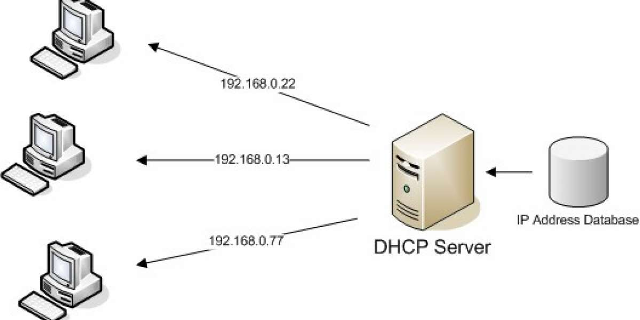
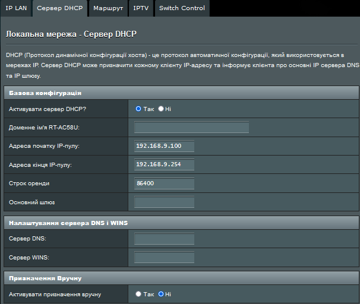
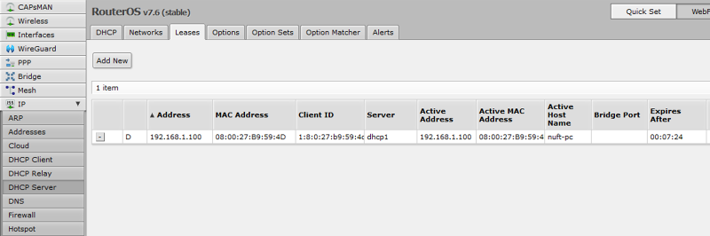
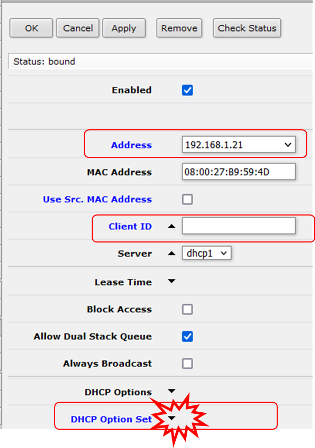
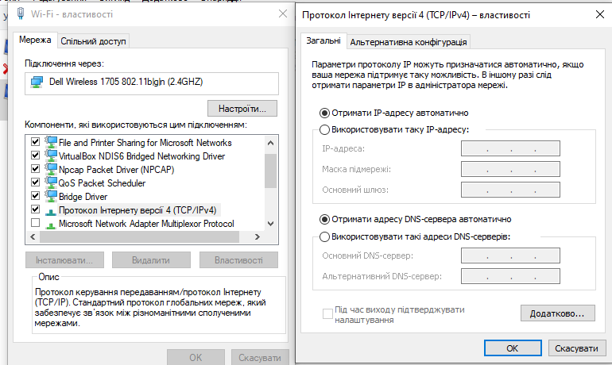
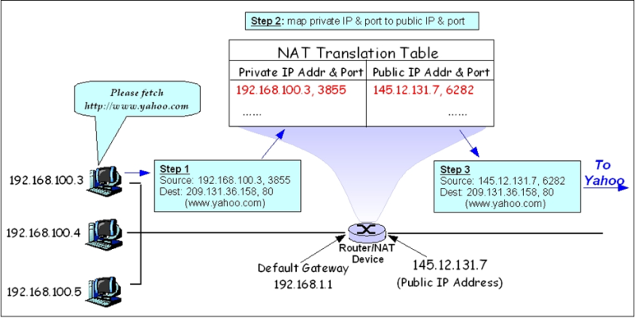
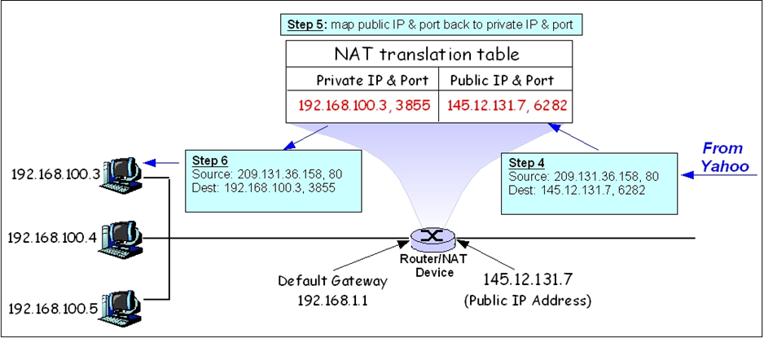
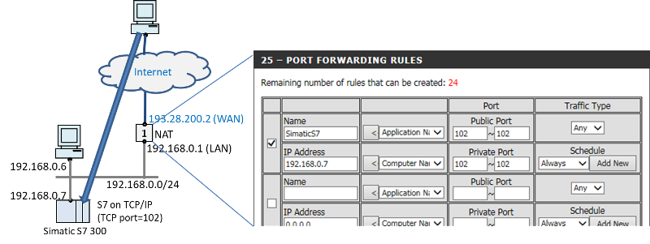

[<- До підрозділу](README.md)

# Додаткові служби TCP/IP: теоретична частина

## 1.DHCP

**DHCP** (Dynamic Host Configuration Protocol — протокол динамічної конфігурації вузла) — це стандартний протокол прикладного рівня, який дозволяє пристроям автоматично отримувати IP-адресу та інші параметри, необхідні для роботи в мережі IP. Для цього служба DHCP-клієнта на пристрої, що потребує адреси звертається відповідно до служби DHCP-сервера на іншому пристрої. Мережевий адміністратор може задати діапазон адрес на DHCP-сервері, які будуть розподілені між пристроями в мережі. Це дозволяє уникнути ручного налаштування комп'ютерів мережі й зменшує кількість помилок. Протокол DHCP використовується в більшості великих мереж TCP/IP. DHCP є розширенням протоколу BOOTP, що використовувався раніше для забезпечення бездискових робочих станцій IP-адресами при їхньому завантаженні, і зберігає з ним зворотну сумісність.

Крім IP-адреси, DHCP також може повідомляти клієнтові додаткові параметри (опції), необхідні для нормальної роботи в мережі, серед них найбільш вживаними є:

- IP-адреса маршрутизатора за замовчуванням;
- маска підмережі;
- адреси серверів DNS;
- ім'я домену DNS.

Деякі постачальники програмного забезпечення можуть визначати власні, додаткові опції DHCP. 

Служба DHCP-сервера як правило присутня в маршрутизаторах та в операційних системах десктопних комп'ютерів та інших мережних пристроях.  

### Принцип функціонування протоколу

Протокол DHCP працює за схемою клієнт-сервер, передача даних здійснюється за допомогою протоколу UDP, при цьому сервер приймає повідомлення від клієнтів на порт 67 і відправляє повідомлення клієнтам на порт 68. Під час запуску системи пристрій, який є DHCP-клієнтом, відправляє в мережу широкомовний (IP=255.255.255.255) запит `DHCPDISCOVER` на отримання IP-адреси. Тому DHCP-Сервер (або **DHCP-агент**, який є ретранслятором) і Клієнт повинні знаходитися в одній локальній мережі. Пакет містить апаратну адресу запитувача клієнта. Потім один або кілька серверів DHCP розглядають запит і  посилають у відповідь пакет `DHCPOFFER`, що містить пропоновану IP-адресу та деякі інші конфігураційні параметри і «час оренди». Клієнт вибирає адресу з отриманих пакетів `DHCPOFFER`. Вибір  клієнта залежить від його призначення — наприклад, він може вибрати  адресу з найбільшим часом оренди. Слідом за тим клієнт посилає пакет `DHCPREQUEST` з адресою вибраного сервера. Обраний сервер посилає підтвердження (`DHCPACK`) і процес  узгодження завершується. Пакет `DHCPACK` містить обумовлені адресу та час  оренди. Сервер позначає виділену адресу як зайняту — до закінчення  терміну оренди цю адресу не можна буде присвоїти іншому клієнту. Клієнту залишилося тільки сконфігурувати себе відповідно до надісланих даних і  можна приступати до роботи в мережі.

рис.5. Принцип роботи DHCP

DHCP-сервер може працювати в різних режимах, включаючи:

- Динамічний розподіл — адміністратор присвоює IP-діапазон адрес на сервері DHCP. Кожен клієнтський пристрій в мережі повинен запитати IP-адресу від DHCP-сервера, коли мережа ініціалізується за концепцією «оренди». Коли закінчується термін оренди, якщо вона не буде продовжена, DHCP-сервер має право повернути адресу і призначити її на інші комп'ютери.
- Автоматичне виділення — сервер DHCP буде постійно призначати вільний IP-адрес з діапазону, встановленого адміністратором, запитуючому пристрою. Основна відмінність з динамічним розподілом в тому, що сервер зберігає записи минулих сесій IP і намагається привласнити ту ж адресу тому ж пристрою для майбутніх мережних підключень.
- Статичний розподіл — сервер DHCP робить призначення IP-адрес виключно на основі таблиці MAC-адрес або символьної назви, які зазвичай заповнені вручну адміністратором мережі. Якщо MAC-адреса (або символьна назва) пристрою не зазначена в таблиці, йому не буде призначена адреса IP.

### Адміністрування клієнтів та серверів

Налаштування DHCP-серверів може відбуватися як через консольні команди пристроїв (наприклад маршрутизаторів) так і через вбудовані WEB-консолі, чи спеціалізовані програми. Для налаштування служби DHCP-серверу як правило вказують (рис.6):

- діапазон адрес IP-пулу
- строк аренди
- шлюз за замовченням (основний шлюз)
- сервери DNS та WINS

рис.6. Приклад простого налаштування DHCP-серверу

Перелік виданих IP-адрес також як правило можна проконтролювати (рис.7)

рис.7. Список налаштованих та виданих IP адрес. 

Приклад налаштування статичних записів з прив'язкою до MAC чи символьного ідентифікатору показано на рис 8.

рис.8. Приклад налаштування статичного запису в DHCP

Налаштування DHCP-клієнта здебільшого зводиться до виставлення опції "Отримати IP-адресу автоматично" (рис.9) 

рис.9. Спосіб налаштування мережної карти як DHCP-клієнта  

### Публічні, приватні, динамічні, статичні IP

У користувачів часто виникає плутанина в термінах: публічні ("білі"), приватні ("сірі"), динамічні та статичні IP адреси. 

Статична IP-адреса – видається на постійне користування (без терміну), наприклад шляхом налаштування інтерфейсу (мережної карти).

Динамічна IP-адреса – видається на певний час (термін дії адреси, термін аренди) з пула доступних адрес, наприклад DHCP-сервером.

"Сіра" IP-адреса – локальна (приватна) адреса, не видима з мережі Інтернет (можна вийти в Інтернет через NAT або Proxy). 

"Біла" IP-адреса – унікальна в Інтернет адреса, виділена провайдером і видима з мережі Інтернет

Таким чином можуть бути "білі динамічні", "сірі динамічні", "білі статичні", "сірі статичні".  

Ще раз зазначимо, що приватні IP-адреси (private IP address, внутрішньомережні, внутрішні, локальні,"сірі") належать до спеціального діапазону, що не призначені для використання в мережі Інтернет.  Вони призначені тільки для застосування в локальних (автономних) мережах, тому розподіл мережних адрес не контролюється організаціями, так як вони не видимі з глобальної мережі Інтернет. Адреси співпадають в різних автономних мережах і можуть отримувати доступ до Інтернет тільки через спеціалізовані служби: NAT, проксі-сервери або тунелювання.  

| Клас   | Діапазон                            |
| ------ | ----------------------------------- |
| Клас А | мережа  10.0.0.0                    |
| Клас В | мережі 172.16.0.0 — 172.31.0.0      |
| Клас С | мережі  192.168.0.0 — 192.168.255.0 |

## 2.NAT

**NAT** (від англ. Network Address Translation — «перетворення мережевих адрес») — це механізм у мережах TCP/IP, котрий дозволяє змінювати IP-адресу у заголовку пакунку, котрий проходить через пристрій маршрутизації трафіку. Також має назви IP Masquerading, Network Masquerading і Native Address Translation, NAPT (Network address and port translation). 

Служба NAT як правило є вбудованою у маршрутизатори. Найбільш популярним є SNAT (**source NAT**), суть механізму котрого складається у заміні адреси джерела (source) при проходженні пакету в одну сторону і зворотній заміні адреси призначення (destination) у зворотному пакеті. Поряд з адресами джерело/призначення можуть також замінюватися номера портів джерела і призначення.

Приймаючи пакет від локального комп'ютера (або іншого пристрою), роутер переглядає IP-адресу призначення. Якщо це локальна адреса, то пакет пересилається іншому локальному комп'ютерові. Якщо нi, то пакет слід переслати назовні, наприклад до Інтернету. Але зворотною адресою у пакеті вказана локальна адреса комп'ютера, котра з інтернету буде недоступна. Тому роутер «на льоту» транслює (підміняє) зворотню IP-адресу пакету на свою зовнішню (видиму з інтернету) IP-адресу, а також міняє номер порту (щоб розрізняти зворотні пакети, адресовані різним локальним комп'ютерам). Комбінацію, потрібну для зворотної підстановки, роутер зберігає у себе у тимчасовій таблиці. Через деякий час після того, як клієнт і сервер закінчать обмінюватися пакетами, роутер зітре у себе в таблиці запис про n-м порт за строком давнини.

Розглянемо це на прикладі, що наведений на рис.10 та 11. 

Крок 1. Процес на комп'ютері з приватною адресою `IP=192.168.100.3` відправляє пакет на комп'ютер у Інтернет з публічною адресою `209.131.36.158`. При цьому пакет відправляється від порта `3855` на TCP порт `80` (Веб-сервер). Враховуючи, що шлюз за замовченням в цьому пристрої вказаний як `192.168.1.1` пакет пройде через маршрутизатор з цим IP, на якому працює служба NAT серверу, що працює за принципом SNAT. З боку Інтернету, сервер має `IP=145.12.131.7`. 

Крок 2. Проходячи через NAT на маршрутизаторі, він формує новий динамічний TCP порт відправника та у свою таблицю NAT (`NAT Translation Table`) заносить запис, в якому фіксує: 

- дійсну приватну IP адресу та порт відправника 
- публічну IP адресу маршрутизатору та заново згенерований динамічний порт відправника      

Крок 3. Публічна адреса маршрутизатора та заново згенерований динамічний клієнтський порт вставляється в пакет відповідно замість приватної адреси та порту і відправляється за адресою призначення. Таким чином Веб-сервер на `209.131.36.158` буде вважати що спілкується з маршрутизатором.     

рис.10. Приклад відправлення пакету з внутрішнього комп'ютера до серверу в Інтернеті. 

Крок 4. Сервер відправляє пакет-відповідь, в заголовку якого, звісно, адреса та порт відправника та отримувача будуть поміняні місцями. Цей пакет прийде на маршрутизатор.

Крок 5. Служба NAT, за портом `6282` знаходить запис в таблиці і робить зворотну підстановку: замінює IP адресу та порт отримувача зі своєї на ті, що вказані в таблиці `192.168.100.3` та  `3855`. Запис з таблиці видаляється.

Крок 6. Пакет відправляється в локальну мережу на вказаний вузол.   

рис.11. Приклад повернення пакету з серверу в Інтернеті до внутрішнього комп'ютера до . 

Слід відмітити що така схема працює тільки в тому випадку, коли клієнтська програма (ініціатор зв'язку) працює на стороні приватної мережі. Якщо необхідно підключитися клієнту зі сторони публічної мережі до приватної мережі то необхідні додаткові заходи, наприклад прокидування портів.  

У найпростішому випадку для активації NAT достатньо виставити однойменну опцію. У складнішому випадку налаштовуються правила переадресації відповідно до необхідних принципів.

NAT має як переваги так і недоліки. До переваг можна віднести: можливість вирішення недостатньої кількості IPv4-адрес, простий спосіб організації (NAT-блоки включені у більшість маршрутизаторів), приховання структури мережі від "зовнішнього світу" (IP-адреси невидимі). До недоліків можна віднести: до вузлів не можна підключитися із зовнішньої мережі (треба спеціальні технології, наприклад port forwarding); порушуються принципи ієрархії протоколів, деякі протоколи не можуть коректно працювати (наприклад FTP); обмежена кількість записів в таблиці NAT та інші.

Описані тут механізми NAT не є вичерпними. Для тонкого налаштування NAT зверніться до довідкової інформації для конкретного пристрою.

## 3. Переадресація портів (Port Forwarding)

Разом з описаною вище методикою source NAT застосовуєтся також **destination NAT**, який ще називається переадресація портів (**Port forwarding**) або зіставлення портів (**port mapping**).  Цей тип NAT при проходженні пакетів через маршрутизатор перенаправляє запит зв’язку з однієї комбінації з адреси та номера порту на іншу. Ця техніка найчастіше використовується для того, щоб зробити доступними сервіси на хості, що знаходиться в захищеній або замаскованій (внутрішній) мережі для хостів на протилежній стороні шлюзу (зовнішньої мережі). 

Як описано вище, для зовнішнього інтерфейсу пристрою NAT налаштовано загальнодоступну IP-адресу. Комп’ютери за маршрутизатором, з іншого боку, невидимі для хостів в Інтернеті, оскільки кожен з них спілкується лише за допомогою приватної IP-адреси. Під час налаштування переадресації портів адміністратор мережі виділяє на маршрутизаторі діапазон портів для виключного використання зв’язку з сервісами в приватній мережі, розташованій на певному хості. Часто для того щоб звичайні Інтернет-сервіси могли бути реалізовані на хостах у приватних мережах для перенаправлення портів використовуються номери портів відомих Інтернет-сервісів, наприклад номер порту `80` для веб-сервісів (HTTP), при цьому порти призначення на хості можуть бути іншими.

На рис.12 показаний приклад налаштування переадресації портів. Усі вхідні порти з діапазону `102-102` (по факту один порт) перекидуються на такі самі порти в локальній мережі вузла `192.168.0.7`  

рис.12. Приклад Port Forwarding

Слід зазначити, що в реальній практиці приклад показаний на рис.12 з зазначеним промисловим контролером не варто реалізовувати, так як **це дуже небезпечно з точки зору кібербезпеки!** Це можна застосовувати тільки в локальних мережах.   

## Контрольні питання

1) Яке призначення DHCP? 
12) Розкажіть про функціонування DHCP.
13) Яку інформацію може передавати DHCP-сервер клієнтам?
14) Розкажіть про загальні принципи налаштування DHCP зі сторони клієнту та серверу.
15) Розкажіть про відмінність понять "Публічні", "приватні", "динамічні" та статичні IP.
16) Покажіть на прикладі принцип функціонування NAT (source NAT).
17) Які обмеження має методика NAT трансляції?
18) Розкажіть про принципи роботи та налаштування переадресації портів.

## Посилання на відеозаписи лекцій

[Запис Л8. Додаткові служби TCP/IP](https://youtu.be/pPc8U6D089Q?si=7VZXAKuwXHx_ATEg)

Теоретичне заняття розробив [Олександр Пупена](https://github.com/pupenasan). 

Якщо Ви хочете залишити коментар у Вас є наступні варіанти:

- [Обговорення у WhatsApp](https://chat.whatsapp.com/BRbPAQrE1s7BwCLtNtMoqN)
- [Обговорення в Телеграм](https://t.me/+GA2smCKs5QU1MWMy)
- [Група у Фейсбуці](https://www.facebook.com/groups/asu.in.ua)

Про проект і можливість допомогти проекту написано [тут](https://asu-in-ua.github.io/atpv/)
