[<- До підрозділу](README.md)

# Основні складові TCP

Це переклад статті https://hpbn.co/building-blocks-of-tcp


У центрі Інтернету лежать два протоколи — IP і TCP. IP (Internet Protocol) забезпечує маршрутизацію та адресацію між вузлами, а TCP (Transmission Control Protocol) надає абстракцію надійної мережі поверх ненадійного каналу. TCP/IP також часто називають стеком протоколів Інтернету. Його вперше запропонували Вінт Серф і Боб Кан у 1974 році в статті під назвою "A Protocol for Packet Network Intercommunication".

Початкову пропозицію (RFC 675) переглядали кілька разів, і у 1981 році специфікацію TCP/IP версії 4 опублікували не як один документ, а як два окремих RFC:

```
RFC 791 — Internet Protocol  
RFC 793 — Transmission Control Protocol
```

Відтоді було запропоновано і реалізовано багато вдосконалень TCP, але основний принцип його роботи істотно не змінився. TCP швидко замінив попередні протоколи і нині є протоколом вибору для більшості найпопулярніших застосунків: веб, електронна пошта, передавання файлів та багато інших.

TCP забезпечує ефективну абстракцію надійної мережі поверх ненадійного каналу, приховуючи більшість складнощів мережевої комунікації від застосунків: повторну передачу втрачених даних, доставку у правильному порядку, керування та уникнення перевантажень, цілісність даних тощо. Працюючи з TCP-потоком, ви маєте гарантію, що всі надіслані байти будуть ідентичні отриманим і прибудуть у тому самому порядку. Таким чином TCP оптимізовано під точність доставки, а не підчасовість. Як виявляється, це створює певні виклики при оптимізації продуктивності вебу в браузері.

Стандарт HTTP не зобов’язує використовувати TCP як єдиний транспорт. Теоретично ми могли б доставляти HTTP через датаграмний сокет (UDP) або інший транспортний протокол, але на практиці весь HTTP-трафік сьогодні передається через TCP через зручність і корисні можливості, які він надає.

Через це розуміння основних механізмів TCP є необхідним для побудови оптимізованого веб-досвіду. Ймовірно, ви ніколи не будете працювати з TCP-сокетами безпосередньо у своїй програмі, але вибори, зроблені на рівні застосунку, визначатимуть продуктивність TCP і мережі, по якій ваш застосунок доставляється.

### Переплетена історія протоколів TCP та IP

Ми всі знаємо IPv4 та IPv6, але що сталося з IPv{1,2,3,5}? Число 4 в IPv4 означає версію 4 стеку TCP/IP, яку опублікували у вересні 1981 року. Початкова пропозиція TCP/IP об’єднувала два протоколи, і саме в проєкті версії 4 їх офіційно розділили на окремі RFC. Тому 4 в IPv4 — це спадок його зв’язку з TCP: окремих протоколів IPv1, IPv2 чи IPv3 не існувало.

Коли у 1994 році робоча група почала працювати над "Internet Protocol next generation" (IPng), потрібен був новий номер версії, але v5 вже був закріплений за іншим експериментальним протоколом — Internet Stream Protocol (ST). Як виявилося, ST не прижився, тому про нього мало хто чув. Звідси й походить 6 в IPv6.

## Тристороннє рукостискання

Усі TCP-з’єднання починаються з тристороннього рукостискання (рисунок 2-1). Перш ніж клієнт і сервер зможуть обмінюватися даними застосунку, вони мають узгодити початкові номери послідовності пакетів та низку інших змінних, характерних для з’єднання з обох сторін. Номери послідовності обираються випадково з міркувань безпеки.

`SYN`: Клієнт обирає випадковий номер послідовності `x` і надсилає пакет `SYN`, який також може містити додаткові TCP-прапорці та опції. 

`SYN ACK`: Сервер збільшує `x` на одиницю, обирає власний випадковий номер послідовності `y`, додає свій набір прапорців і опцій і надсилає відповідь. 

`ACK` : Клієнт збільшує і `x`, і `y` на одиницю та завершує рукостискання, надсилаючи останній `ACK`-пакет. 

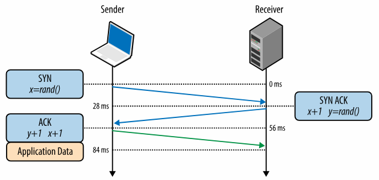

Рисунок 2-1. Тристороннє рукостискання

Після завершення тристороннього рукостискання дані застосунку можуть почати передаватися між клієнтом і сервером. Клієнт може відправити пакет даних одразу після `ACK`-пакета, а сервер повинен дочекатися `ACK`, перш ніж він зможе надсилати будь-які дані. Цей початковий процес застосовується до кожного нового TCP-з’єднання і має важливий вплив на продуктивність усіх мережевих застосунків, що працюють поверх TCP: кожне нове з’єднання має повну затримку одного раунду (round trip), перш ніж можуть передаватися будь-які дані застосунку.

Наприклад, якщо наш клієнт у Нью-Йорку, сервер у Лондоні, і ми встановлюємо нове TCP-з’єднання через оптоволоконну лінію, то тристороннє рукостискання займе мінімум 56 мілісекунд (таблиця 1-1): 28 мс на поширення пакета в одному напрямку, після чого відповідь має повернутися назад до Нью-Йорка. Зверніть увагу, що пропускна здатність каналу тут не відіграє ролі. Затримку визначає латентність між клієнтом і сервером, яка своєю чергою домінується часом поширення сигналу між Нью-Йорком і Лондоном.

Затримка, накладена тристороннім рукостисканням, робить нові TCP-з’єднання дорогими за часом створення. Саме тому повторне використання з’єднань є критичною оптимізацією для будь-якого застосунку, який працює на TCP.

### Прискорене відкриття TCP

Завантаження вебсторінки часто потребує отримання сотень ресурсів з десятків різних хостів. Це, у свою чергу, може змусити браузер встановити десятки нових TCP-з’єднань, і кожне з них повинне пройти через накладні витрати рукостискання TCP. Зрозуміло, що це може бути суттєвим джерелом затримок у вебперегляді, особливо в повільних мобільних мережах.

TCP Fast Open (TFO) — це механізм, який прагне усунути латентність, накладену створенням нового TCP-з’єднання, дозволяючи передавати дані вже у пакеті SYN. Однак він має свої обмеження: існують ліміти на максимальний розмір корисних даних у SYN-пакеті, лише певні типи HTTP-запитів можуть бути надіслані, і він працює тільки для повторних з’єднань через вимогу криптографічного cookie. Для детального розгляду можливостей і обмежень TFO зверніться до останнього проєкту IETF під назвою "TCP Fast Open".

Увімкнення TFO потребує явної підтримки клієнтом, сервером і застосунком. Для найкращих результатів слід використовувати сервер на Linux ядра v4.1+, сумісного клієнта (наприклад Linux або iOS9+ / OSX 10.11+) і встановити відповідні прапорці сокета у вашому застосунку.

За результатами аналізу трафіку та емуляції мережі, проведених у Google, дослідники показали, що TFO може зменшити мережеву затримку HTTP-транзакцій на 15%, середній час завантаження сторінки більш ніж на 10%, а в окремих випадках — до 40% у сценаріях з високою латентністю!

## Уникнення та контроль перевантаження

На початку 1984 року Джон Нейгл задокументував явище під назвою "колапс перевантаження", яке могло виникати в будь-якій мережі з асиметричною пропускною здатністю між вузлами:

> Керування перевантаженням є відомою проблемою в складних мережах. Ми виявили, що Internet Protocol (IP), протокол чистих датаграм, та Transmission Control Protocol (TCP), транспортний протокол, при спільному використанні піддаються незвичайним проблемам перевантаження, викликаним взаємодією між транспортним та датаграмним рівнями. Зокрема, IP-шлюзи вразливі до явища, яке ми називаємо "колапсом перевантаження", особливо коли такі шлюзи з’єднують мережі з дуже різною пропускною здатністю…
>
> Якщо час проходження туди-назад перевищить максимальний інтервал повторної передачі для будь-якого хоста, цей хост почне вводити в мережу все більше і більше копій одних і тих самих датаграм. Мережа опиняється у серйозній небезпеці. Зрештою всі доступні буфери у проміжних вузлах будуть заповнені, і пакети доведеться відкидати. Час проходження для пакетів, які все ж доставляються, стає максимальним. Хости надсилають кожен пакет кілька разів, і зрештою якась копія кожного пакета доходить до місця призначення. Це і є колапс перевантаження.
>
> Цей стан є стабільним. Коли досягнуто точку насичення, якщо алгоритм вибору пакетів для відкидання є справедливим, мережа продовжуватиме працювати, але в деградованому режимі.
>
> Джон Нейгл, RFC 896

У звіті робився висновок, що колапс перевантаження ще не став проблемою для ARPANET, оскільки більшість вузлів мали однакову пропускну здатність, а магістраль мала значний запас ресурсів. Однак жодне з цих тверджень недовго залишалося правдивим. У 1986 році, коли кількість вузлів (понад 5000) і їхня різноманітність збільшилися, мережу охопила серія інцидентів колапсу перевантаження — у деяких випадках пропускна здатність падала у 1000 разів, і мережа ставала непридатною до використання.

Щоб розв’язати ці проблеми, у TCP було впроваджено кілька механізмів для регулювання швидкості, з якою дані можуть надсилатися в обох напрямках: керування потоком, керування перевантаженням та уникнення перевантаження.

> Advanced Research Projects Agency Network (ARPANET) була попередником сучасного Інтернету та першою у світі діючою мережею пакетної комутації. Проєкт офіційно запустили у 1969 році, а у 1983 році протоколи TCP/IP замінили попередній NCP (Network Control Program) як основні комунікаційні протоколи. Далі, як то кажуть, історія.

## Керування потоком

Керування потоком — це механізм, який запобігає перенавантаженню отримувача даними, з якими він може не впоратися. Отримувач може бути зайнятий, працювати під високим навантаженням або просто бути готовим виділити лише обмежений обсяг буферної пам’яті. Щоб вирішити це, кожна сторона TCP-з’єднання рекламує (рисунок 2-2) власне приймальне вікно (rwnd), яке повідомляє розмір доступного буфера для прийому вхідних даних.

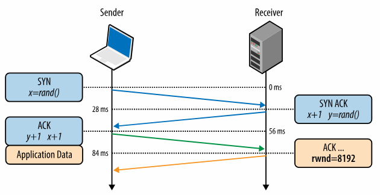

 Рисунок 2-2. Оголошення розміру приймального вікна (`rwnd`)

Коли з’єднання лише встановлюється, обидві сторони ініціалізують свої `rwnd`, використовуючи системні значення за замовчуванням. Типова вебсторінка передає більшість даних від сервера до клієнта, тому саме приймальне вікно клієнта зазвичай стає вузьким місцем. Однак якщо клієнт передає на сервер великі обсяги даних, наприклад під час завантаження зображення або відео, тоді обмеженням може стати приймальне вікно сервера.

Якщо з будь-якої причини одна зі сторін не може справлятися з потоком даних, вона може надіслати оголошення про менше вікно. Якщо вікно досягає нуля, це вважається сигналом того, що більше даних надсилати не можна, доки застосунок не очистить поточні дані з буфера. Такий цикл триває протягом усього життя TCP-з’єднання: кожен пакет ACK містить оновлене значення `rwnd`, дозволяючи обом сторонам динамічно регулювати швидкість передавання даних відповідно до можливостей і швидкості обробки відправника та отримувача.

### Масштабування вікна (RFC 1323)

Початкова специфікація TCP відводила 16 бітів на оголошення розміру приймального вікна, що встановлює жорстку верхню межу — 216, або 65 535 байтів — для рекламованого розміру. Як виявилося, цього часто недостатньо для досягнення оптимальної продуктивності, особливо в мережах з великим добутком пропускної здатності на затримку. Детальніше про це можна прочитати в розділі про Bandwidth-Delay Product.

Щоб це вирішити, був створений RFC 1323, який вводить опцію "масштабування TCP-вікна". Вона дозволяє збільшити максимальний розмір приймального вікна з 65 535 байтів до 1 гігабайта! Опція масштабування вікна передається під час тристороннього рукостискання і містить значення, яке представляє кількість бітів, на які слід змістити 16-бітове поле розміру вікна у подальших ACK.

Сьогодні масштабування TCP-вікна увімкнене за замовчуванням на всіх основних платформах. Однак проміжні вузли, маршрутизатори та брандмауери можуть переписувати або навіть повністю видаляти цю опцію. Якщо ваше з’єднання з сервером або клієнтом не використовує доступну пропускну здатність повною мірою, перевірка взаємодії розмірів вікон — це перше, з чого варто почати. У Linux параметр масштабування вікна можна перевірити та увімкнути за допомогою таких команд:

```bash
$> sysctl net.ipv4.tcp_window_scaling
$> sysctl -w net.ipv4.tcp_window_scaling=1
```

## Повільний старт

Попри наявність керування потоком у TCP, колапс перевантаження став реальною проблемою в середині — наприкінці 1980-х. Проблема була в тому, що керування потоком запобігало перенавантаженню отримувача, але не існувало механізму, який би запобігав перенавантаженню самої мережі: ні відправник, ні отримувач не знають доступної пропускної здатності на початку нового з’єднання, і тому потрібен механізм для її оцінки та адаптації швидкостей до постійно мінливих умов у мережі.

Щоб ілюструвати приклад, де така адаптація корисна, уявімо: ви вдома і транслюєте велике відео з віддаленого сервера, який повністю заповнив ваш канал завантаження, забезпечуючи максимальну якість. Потім інший користувач вашої домашньої мережі відкриває нове з’єднання для завантаження оновлень програмного забезпечення. Раптово доступна пропускна здатність для відеопотоку значно менша, і відеосервер повинен зменшити швидкість передавання — інакше, якщо він продовжить надсилати на тій самій швидкості, дані накопичуватимуться на якомусь проміжному вузлі, пакети відкидатимуться, і мережа використовуватиметься неефективно.

У 1988 році Ван Джейкобсон і Майкл Карелс задокументували кілька алгоритмів для вирішення цих проблем: slow-start, уникнення перевантаження, fast retransmit та fast recovery. Усі чотири швидко стали обов’язковою частиною специфікації TCP. Вважається, що саме ці оновлення запобігли фактичному колапсу Інтернету у 1980-х та на початку 1990-х, коли трафік зростав експоненційно.

Щоб зрозуміти slow-start, найкраще побачити його в дії. Отже, повернімося до нашого клієнта в Нью-Йорку, який намагається отримати файл із сервера в Лондоні. Спершу виконується тристороннє рукостискання, під час якого обидві сторони рекламують свої розміри приймальних вікон (`rwnd`) у ACK-пакетах (рисунок 2-2). Після відправлення останнього ACK можна починати передавання даних застосунку.

Єдиний спосіб оцінити доступну пропускну здатність між клієнтом і сервером — виміряти її під час обміну даними, і саме для цього призначений slow-start. Спочатку сервер ініціалізує нову змінну вікна перевантаження (`cwnd`) для кожного TCP-з’єднання та задає її консервативне початкове значення (`initcwnd` у Linux).

Congestion window size (`cwnd`) - Обмеження на стороні відправника: максимальна кількість даних, які можуть бути «в польоті» до отримання ACK.

Змінна cwnd не рекламується та не передається — у цьому прикладі вона є локальною змінною сервера в Лондоні. Далі вводиться нове правило: максимальна кількість даних «у польоті» між клієнтом і сервером дорівнює мінімуму з `rwnd` і `cwnd`. Але як визначити оптимальні значення `cwnd`? Адже умови в мережі змінюються постійно, навіть між тими самими вузлами. Було б чудово мати алгоритм, який не потребує ручного налаштування.

Рішення — почати повільно та збільшувати розмір вікна в міру отримання ACK: slow-start! Спочатку `cwnd = 1` сегмент; RFC 2581 підняв цей початковий розмір до 4 сегментів у 1999 році; а RFC 6928 у 2013 році — до 10 сегментів.

Максимальна кількість даних у польоті для нового з’єднання — це `min(rwnd, cwnd)`. Тому сучасний сервер може надіслати до десяти сегментів, після чого він повинен зупинитися й чекати `ACK`. Потім за кожен отриманий `ACK` сервер може збільшити `cwnd` на один сегмент — тобто на кожен підтверджений пакет можна відправити два нові. Ця фаза відома як «експоненційне зростання» (рисунок 2-3), оскільки клієнт і сервер намагаються швидко зблизитися до доступної пропускної здатності шляху між ними.

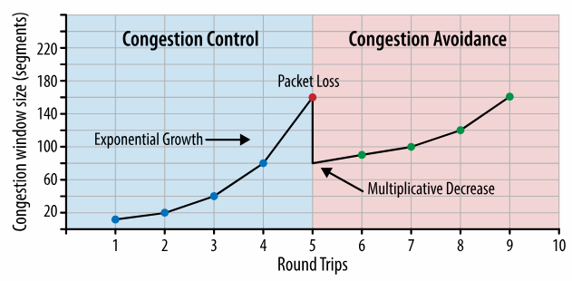

Рисунок 2-3. Керування та уникнення перевантаження

Чому slow-start важливий для браузерних застосунків? Тому що HTTP та багато інших протоколів працюють поверх TCP, і незалежно від доступної пропускної здатності, кожне нове TCP-з’єднання повинно пройти фазу повільного старту — ми не можемо використати повну швидкість каналу миттєво.

Ми стартуємо з малого вікна перевантаження і подвоюємо його щоразу за один RTT — експоненційне зростання. Отже, час, необхідний для досягнення певної пропускної здатності, залежить від RTT і початкового `cwnd`.

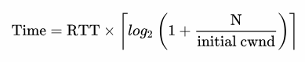

Для прикладу:

```
Приймальні вікна клієнта і сервера: 65 535 байтів (64 КБ)
Початкове congestion window: 10 сегментів
RTT: 56 мс (Лондон — Нью-Йорк)
```

Хоча `rwnd = 64 КБ`, початкова пропускна здатність нового TCP-з’єднання обмежена `cwnd`. Щоб досягнути межі 64 КБ, потрібно збільшити cwnd до 45 сегментів, що потребує 168 мс: 

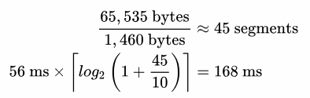

Це три RTT (рисунок 2-4), щоб досягти 64 КБ пропускної здатності! Те, що обидві сторони можуть передавати дані на швидкості у мегабітах, не має значення — це slow-start.

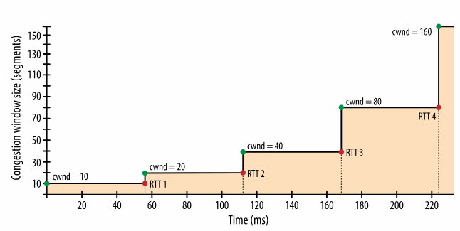

Рисунок 2-4. Зростання вікна перевантаження

Щоб зменшити час розгону вікна, можна зменшити RTT — наприклад, розташувати сервер ближче до клієнта. Або збільшити початкове `cwnd` до 10 сегментів (RFC 6928).

Slow-start не є великою проблемою для великих потокових завантажень, бо після кількох сотень мілісекунд вікна досягають максимуму, і передавання йде на повній швидкості. Але для багатьох HTTP-з’єднань, які часто короткі та сплескові, передавання може завершитися ще до досягнення максимального `cwnd`. У таких випадках продуктивність вебзастосунків обмежується RTT: slow-start зменшує доступну пропускну здатність для малих передавань.

### Перезапуск повільного старту

На додачу до регулювання швидкості нових з’єднань TCP реалізує механізм slow-start restart (SSR), який скидає congestion window після того, як з’єднання було неактивним певний час. Мотивація проста: умови в мережі могли змінитися, і щоб уникнути перевантаження, вікно повертається до «безпечного» значення.

Не дивно, що SSR може сильно погіршити продуктивність довготривалих TCP-з’єднань, які іноді простоюють — наприклад, через бездіяльність користувача. Тому зазвичай рекомендується вимикати SSR на сервері, щоб покращити роботу довготривалих HTTP-з’єднань. У Linux це робиться командами:

```shell
$> sysctl net.ipv4.tcp_slow_start_after_idle
$> sysctl -w net.ipv4.tcp_slow_start_after_idle=0
```

Щоб проілюструвати вплив тристороннього рукостискання та slow-start, уявімо, що клієнт у Нью-Йорку запитує файл 64 КБ з сервера в Лондоні (рисунок 2-5), і маємо такі параметри:

- RTT: 56 мс
- Пропускна здатність: 5 Мбіт/с
- `rwnd` клієнта і сервера: 65 535 байтів
- Початкове cwnd: 10 сегментів
- Час обробки запиту на сервері: 40 мс
- Відсутність втрат, один ACK на сегмент, GET уміщується в один сегмент

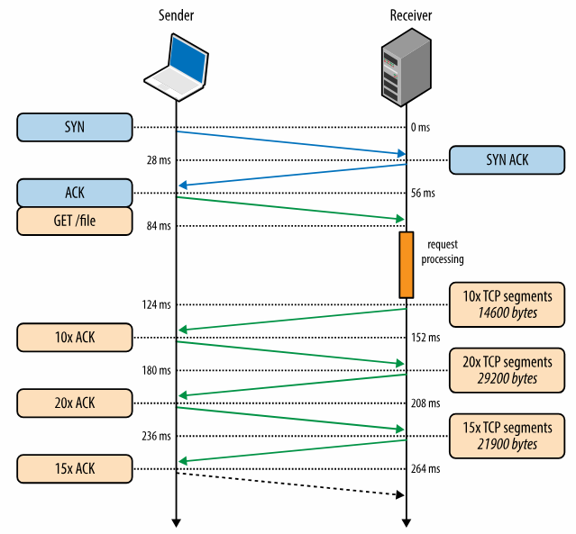

Рисунок 2-5. Отримання файлу через нове TCP-з’єднання

0 мс — клієнт надсилає SYN
 28 мс — сервер відповідає SYN-ACK
 56 мс — клієнт надсилає ACK і GET
 84 мс — сервер отримує запит
 124 мс — сервер формує відповідь і надсилає 10 сегментів
 152 мс — клієнт отримує їх і ACK-ить
 180 мс — сервер збільшує cwnd і відправляє 20 сегментів
 208 мс — клієнт ACK-ить
 236 мс — сервер надсилає останні 15 сегментів
 264 мс — клієнт ACK-ить

Підсумок: 264 мс для передавання 64 КБ на новому TCP-з’єднанні при RTT = 56 мс.

Тепер візьмемо повторне використання того самого з’єднання (рисунок 2-6):

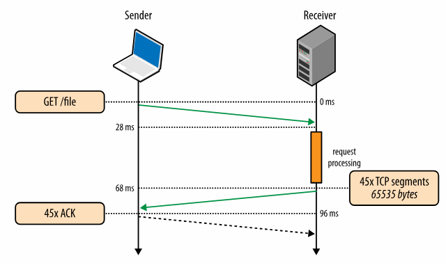

Рисунок 2-6. Отримання файлу через існуюче TCP-з’єднання

0 мс — клієнт надсилає запит
 28 мс — сервер отримує
 68 мс — сервер формує відповідь і одразу відправляє всі 45 сегментів
 96 мс — клієнт отримує та ACK-ить

Результат: 96 мс замість 264 мс — покращення на 275%.

У обох випадках те, що сервер і клієнт мають 5 Мбіт/с, не впливає на початкову фазу — обмежуючими факторами є RTT і cwnd.

### Збільшення початкового congestion window

Збільшення початкового cwnd до 10 сегментів (RFC 6928, IW10) — один із найпростіших способів покращити продуктивність TCP. Добра новина — багато ОС вже впровадили це у свої ядра.

У Linux IW10 — значення за замовчуванням для ядер від 2.6.39 і новіших. Але краще оновитися до 3.2+, щоб отримати й інші важливі поліпшення — див. Proportional Rate Reduction for TCP.

## Уникнення перевантаження

Важливо розуміти, що TCP спеціально розроблений так, щоб використовувати втрату пакетів як механізм зворотного зв’язку для регулювання своєї роботи. Тобто питання полягає не в тому, чи станеться втрата пакета, а коли вона станеться. Slow-start ініціалізує з’єднання консервативним вікном і кожного раунду передавання подвоює кількість даних у польоті, доки це значення не перевищить приймальне вікно отримувача, системний поріг (`ssthresh`) або доки не відбудеться втрата пакета. У цей момент включається алгоритм уникнення перевантаження (рисунок 2-3).


Рисунок 2-3. Керування та уникнення перевантаження

У цій фазі закладається непряма, але ключова передумова: втрата пакета є ознакою перевантаження мережі. Десь уздовж шляху місткий канал або маршрутизатор перевантажився та був змушений відкинути пакет, і отже ми повинні скоригувати розмір свого вікна, щоб не спричинити додаткових втрат і не перевантажувати мережу.

Після скидання congestion window алгоритм уникнення перевантаження визначає власні правила росту вікна так, щоб мінімізувати подальші втрати. Через певний час відбудеться нова втрата пакета, і процес повториться. Якщо ви коли-небудь бачили графік пропускної здатності TCP-з’єднання із зубчастим «пилкоподібним» патерном, тепер ви знаєте, чому він саме такий: це результат того, як алгоритми керування та уникнення перевантаження змінюють `cwnd` у відповідь на втрати в мережі.

Також варто відзначити, що поліпшення алгоритмів керування та уникнення перевантаження — активна сфера досліджень і розробок. Існують адаптації для різних типів мереж, різних профілів передавання тощо. Сьогодні, залежно від платформи, ви, швидше за все, користуєтеся однією з варіацій: TCP Tahoe та Reno (оригінальні реалізації), TCP Vegas, TCP New Reno, TCP BIC, TCP CUBIC (типово в Linux), Compound TCP (типово в Windows) та інші. Однак незалежно від конкретної реалізації, загальні принципи впливу уникнення перевантаження на продуктивність залишаються спільними для всіх.

### Пропорційне зменшення швидкості для TCP

Визначити оптимальний спосіб відновлення після втрати пакета — нетривіальне завдання: якщо ви надто агресивні, тоді випадкова одинична втрата пакета може значно знизити пропускну здатність з’єднання; якщо ж реагуєте повільно, то спровокуєте ще більшу втрату пакетів.

Початкова реалізація TCP використовувала алгоритм AIMD (Additive Increase / Multiplicative Decrease): коли виникає втрата пакета, розмір congestion window зменшується вдвічі, а надалі збільшується на фіксовану величину кожного раунду. Але в багатьох випадках AIMD виявляється надто консервативним, і тому були розроблені нові алгоритми.

Proportional Rate Reduction (PRR) — це новий алгоритм, визначений у RFC 6937, метою якого є прискорення відновлення після втрати пакета. Наскільки він кращий? Згідно з вимірюваннями, проведеними у Google, де його розробили, PRR забезпечує зменшення середньої затримки на 3–10% на з’єднаннях із втратою пакетів.

PRR зараз є алгоритмом уникнення перевантаження за замовчуванням у ядрах Linux версії 3.2 і новіших — ще одна вагома причина оновити сервери!

## Добуток пропускної здатності на затримку

Вбудовані механізми керування та уникнення перевантаження в TCP мають ще одну важливу наслідкову властивість: оптимальні розміри вікон відправника й отримувача залежать від roundtrip time (RTT) та бажаної швидкості передавання даних між ними.

Щоб зрозуміти чому, пригадаємо, що максимальна кількість непідтверджених даних «у польоті» між відправником і отримувачем визначається як мінімум між розмірами приймального вікна (`rwnd`) і congestion window (`cwnd`). Приймальне вікно передається у кожному ACK, а `cwnd` динамічно коригується відправником згідно з алгоритмами керування та уникнення перевантаження.

Якщо відправник або отримувач перевищує цю максимальну кількість непідтверджених даних, він повинен призупинити передавання й чекати на ACK попередніх пакетів. На який час? На значення roundtrip time між вузлами.

Bandwidth-delay product (BDP) - Добуток пропускної здатності каналу та його кінцевої затримки. Це максимальна кількість непідтверджених даних, які можуть одночасно бути «у польоті».

Якщо будь-яка сторона часто змушена чекати на ACK, то між сегментами виникатимуть паузи (рисунок 2-7). Це буде обмежувати максимальну пропускну здатність з’єднання. Щоб уникнути таких розривів, розмір вікна має бути достатньо великим, щоб сторона могла продовжувати надсилати дані до моменту, коли надійде ACK на попередній пакет — без пауз, з максимальною пропускною здатністю. Відповідно, оптимальний розмір вікна залежить від roundtrip time. Якщо вибрати занадто мале вікно, пропускна здатність буде низькою незалежно від доступної або рекламованої швидкості лінії.

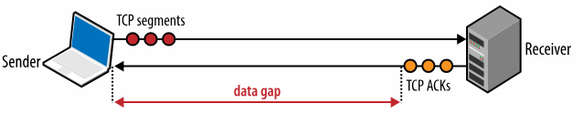

Рисунок 2-7. Прогалини у передаванні через мале congestion window

Отже, якими мають бути значення `rwnd` та `cwnd`? Обчислення просте. Припустимо, що мінімум між `cwnd` та `rwnd` становить 16 КБ, а roundtrip time — 100 мс: 

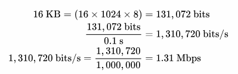

У цьому випадку TCP-з’єднання не перевищить швидкість приблизно 1.31 Мбіт/с, незалежно від доступної пропускної здатності каналу. Щоб досягнути більшого throughput, потрібно збільшити розмір вікна або зменшити RTT.

Так само, можна обчислити оптимальний розмір вікна, знаючи RTT і доступну пропускну здатність. Припустимо, RTT залишається 100 мс, але відправник має канал 10 Мбіт/с, а отримувач — на 100 Мбіт/с+. Припускаємо відсутність перевантажень. Наша мета — повністю завантажити 10 Мбіт/с:

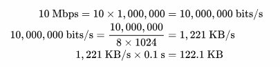

Розмір вікна має бути щонайменше 122.1 КБ, щоб наситити канал 10 Мбіт/с. Нагадаю, що максимальне `rwnd` у TCP — 64 КБ, якщо не використано масштабування вікна (див. RFC 1323). Тому перевірте налаштування клієнта й сервера!

Добра новина — узгодження та налаштування розмірів вікон зазвичай робить сама мережна стекова логіка. Погана новина — інколи саме вона стає обмеженням. Якщо вам коли-небудь здавалося, що файли передаються у кілька разів повільніше за потенційну швидкість, хоча обидві сторони здатні на більше, швидше за все, причина — мале вікно: клієнт або сервер рекламує малий rwnd, або мережа має втрати, що зменшують `cwnd`, або використовується traffic shaping.

### Bandwidth-Delay Product у високошвидкісних LAN

BDP залежить від roundtrip time та цільової пропускної здатності. І хоча RTT зазвичай стає обмеженням у мережах з великою затримкою поширення, це може бути критично й у локальній мережі.

Щоб досягти 1 Гбіт/с при RTT 1 мс, потрібен congestion window щонайменше 122 КБ. Обчислення таке саме, просто числа більші.

## Блокування початку черги

TCP забезпечує абстракцію надійної мережі поверх ненадійного каналу. Це включає базову перевірку помилок, виправлення, доставку даних у правильному порядку, повторну передачу втрачених пакетів, а також керування потоком, керування перевантаженням і уникнення перевантаження, призначені для роботи мережі на максимально ефективному рівні. Разом ці властивості роблять TCP переважним транспортним протоколом для більшості застосунків.

Однак, хоча TCP і популярний, він не єдиний і не завжди найкращий варіант. Деякі властивості, наприклад сувора доставка у порядку та гарантована доставка, не завжди потрібні і можуть спричиняти зайві затримки та негативно впливати на продуктивність.

Щоб зрозуміти чому, згадаємо, що кожен TCP-пакет під час передавання отримує унікальний номер послідовності, а дані повинні передаватися отримувачу суворо по порядку (рисунок 2-8). Якщо якийсь пакет загубиться по дорозі, то всі наступні пакети повинні чекати в буфері TCP на отримувачі, поки втрачений пакет не буде повторно переданий і не прибуде. Оскільки вся ця робота виконується всередині TCP, застосунок не бачить ані повторних передач, ані черги пакетів у буфері — він просто спостерігає затримку під час спроби зчитати дані зі сокета. Цей ефект називається блокуванням початку черги (TCP head-of-line blocking).

Затримка, яку викликає це блокування, позбавляє застосунки необхідності самостійно обробляти порушення порядку пакетів або їх збирання, що значно спрощує код. Але ціною за це є непередбачувані коливання затримки прибуття пакетів, тобто джитер, який може погіршити роботу застосунку.

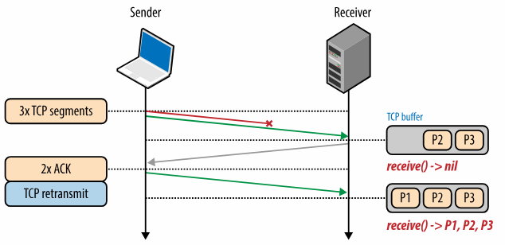

Рисунок 2-8. TCP блокування початку черги

Крім того, деяким застосункам узагалі може не бути потрібною ані гарантована доставка, ані доставка в порядку. Якщо кожен пакет містить автономне повідомлення, то доставка по порядку не потрібна. Якщо кожне нове повідомлення повністю замінює попереднє, тоді вимогу гарантованої доставки також можна відкинути. TCP не надає таких можливостей — усі пакети нумеруються і доставляються суворо по порядку.

Застосунки, що здатні працювати з втратою або позапорядковою доставкою, і які чутливі до затримок чи джитера, зазвичай краще працюють із альтернативним транспортом, наприклад UDP.

### Втрата пакетів — це нормально

Насправді втрата пакетів є необхідною умовою для оптимальної роботи TCP! Кожен загублений пакет є механізмом зворотного зв’язку, який дозволяє відправнику та отримувачу підлаштувати швидкість передавання, щоб не перевантажувати мережу та зменшити затримки; див. Bufferbloat in Your Local Router. Крім того, деякі типи даних можуть сприймати втрати без негативних наслідків. Аудіо, відео та оновлення ігрового стану — типовий приклад таких даних, яким не потрібна ні гарантована, ні впорядкована доставка. Саме тому WebRTC використовує UDP як базовий транспорт.

Якщо втрачається аудіопакет, аудіокодек може просто вставити коротку паузу та продовжувати опрацьовувати наступні пакети. Якщо прогалина маленька, користувач може цього навіть не помітити, а очікування на повторну передачу могло б спричинити довші та більш помітні затримки.

Схожа логіка діє й для передачі ігрових станів: немає сенсу чекати пакет із даними за час T–1, коли вже отримано пакет за T. Ідеально — отримати всі, але щоб уникнути затримок у геймплеї, втрати можна приймати заради меншої затримки.

## Оптимізація роботи TCP

TCP — це адаптивний протокол, розроблений так, щоб справедливо розподіляти ресурси між усіма вузлами мережі та максимально ефективно використовувати доступну інфраструктуру. Тому найкращий спосіб оптимізувати TCP полягає у налаштуванні того, як TCP виявляє поточний стан мережі та адаптує свою поведінку залежно від характеристик рівнів нижче й вище нього. Наприклад, бездротові мережі можуть потребувати інших алгоритмів керування перевантаженням, а деякі застосунки можуть вимагати специфічних механізмів якості обслуговування (QoS), щоб забезпечити найкращий користувацький досвід.

Тісний зв’язок між вимогами застосунків і численними параметрами TCP робить налаштування та оптимізацію TCP практично невичерпною сферою досліджень. У цьому розділі ми лише поверхово торкнулися чинників, що визначають продуктивність TCP. Додаткові механізми — такі як SACK, відкладені ACK, fast retransmit тощо — роблять кожну TCP-сесію ще складнішою (або цікавішою, залежно від погляду).

Попри це, фундаментальні принципи залишаються незмінними:

```
Тристороннє рукостискання TCP додає повний раунд затримки.  
Slow-start застосовується до кожного нового з’єднання.  
Керування потоком і перевантаженням регулюють пропускну здатність.  
Пропускна здатність TCP визначається поточним розміром congestion window.
```

У результаті швидкість передавання в сучасних високошвидкісних мережах часто обмежена саме roundtrip time. Пропускна здатність мереж зростає, але затримка обмежена швидкістю світла і вже наблизилась до своєї фізичної межі. У більшості випадків саме затримка, а не пропускна здатність, є вузьким місцем TCP.

## Налаштування конфігурації сервера

Перед тим як налаштовувати десятки буферів і таймаутів у TCP, набагато корисніше просто оновити систему до найновішої версії ядра. Найактуальніші найкращі практики і алгоритми TCP з’являються саме в нових ядрах. Отже, найперший крок — підтримувати сервери в актуальному стані, щоб забезпечити оптимальну взаємодію TCP-стеків клієнта і сервера.

На перший погляд, оновлення ядра здається тривіальною порадою, але на практиці її часто уникають: багато серверів налаштовані під конкретні версії ядра, і адміністратори неохоче проводять оновлення. Проте, попри ризики, це часто найкраща інвестиція для покращення роботи TCP.

Після оновлення ядра варто впевнитися, що сервер використовує такі рекомендовані налаштування:

- Збільшення початкового congestion window - Більший початковий розмір cwnd дозволяє передати більше даних у перший RTT і значно прискорює розгін вікна.

- Перезапуск повільного старту - Вимкнення slow-start після періоду неактивності покращує роботу довготривалих TCP-з’єднань з періодичними сплесками активності.
- Масштабування вікна (RFC 1323) - Дозволяє збільшити приймальне вікно та забезпечити кращу пропускну здатність у мережах з високою затримкою.
- Прискорене відкриття TCP (TCP Fast Open) - Дозволяє передавати дані вже в SYN-пакеті в певних випадках. Потребує підтримки на клієнті й сервері — варто дослідити, чи може ваш застосунок скористатися TFO.

Поєднання цих налаштувань і оновленого ядра забезпечує найкращу продуктивність TCP — нижчу затримку й вищу пропускну здатність.

Залежно від застосунку може бути необхідним тюнінг інших параметрів TCP для оптимізації використання пам’яті, роботи з великими потоками підключень тощо. Варто проконсультуватися з документацією платформи і з рекомендаціями HTTP Working Group у документі "TCP Tuning for HTTP".

Для користувачів Linux інструмент ss є дуже корисним для аналізу відкритих сокетів: команда ss --options --extended --memory --processes --info показує параметри з’єднань та статистику.

### Налаштування поведінки застосунку

Оптимізація TCP дозволяє серверу й клієнту досягати найкращих показників у рамках одного з’єднання. Але те, як саме застосунок використовує нові чи існуючі TCP-з’єднання, може мати ще більший вплив:

- Жоден біт не швидший за той, який не був надісланий — зменшуйте кількість даних.  
- Біт не можна змусити рухатись швидше, але можна розташувати дані ближче до користувача.  
- Повторне використання TCP-з’єднань є критично важливим.

Найкраща оптимізація — уникати зайвих передач даних: прибирати непотрібні ресурси, застосовувати стиснення. Далі — розташовувати дані ближче до користувача шляхом географічного розподілу серверів або CDN. І нарешті, де можливо, використовувати повторно вже встановлені TCP-з’єднання, мінімізуючи накладні витрати slow-start та інших механізмів.

### Чекліст продуктивності

Оптимізація TCP дає значні переваги для кожного підключення. Короткий список:

- Оновіть ядро сервера до найновішої версії.  
- Переконайтеся, що початковий cwnd = 10.  
- Переконайтеся, що масштабування вікна увімкнене.  
- Вимкніть slow-start після простою.  
- Дослідіть можливість увімкнення TCP Fast Open.  
- Усуньте зайві передачі даних.  
- Стискайте передані дані.  
- Розміщуйте сервери ближче до користувачів для зменшення RTT.  
- Повторно використовуйте TCP-з’єднання.  
- Ознайомтеся з рекомендаціями "TCP Tuning for HTTP".


