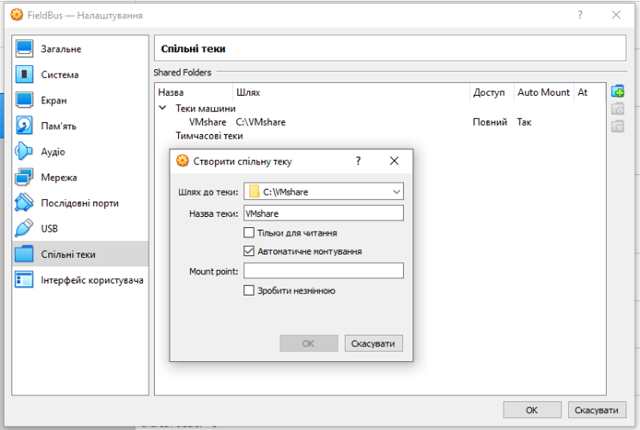
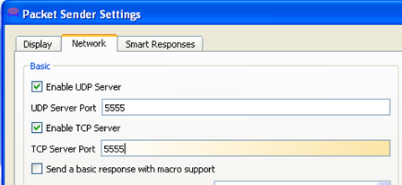
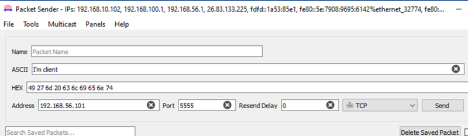
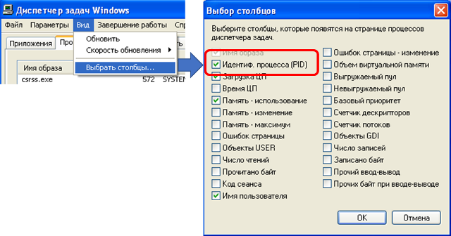
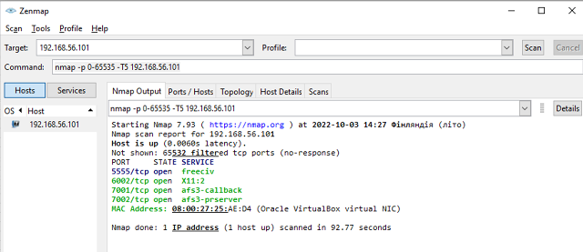
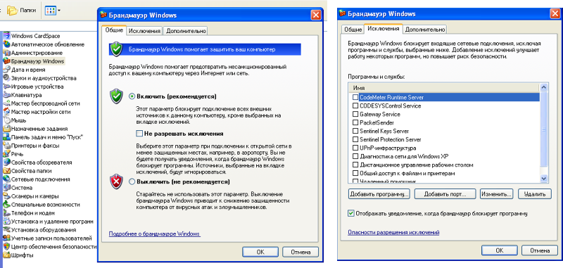
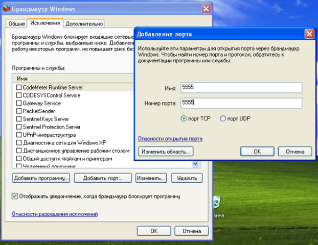
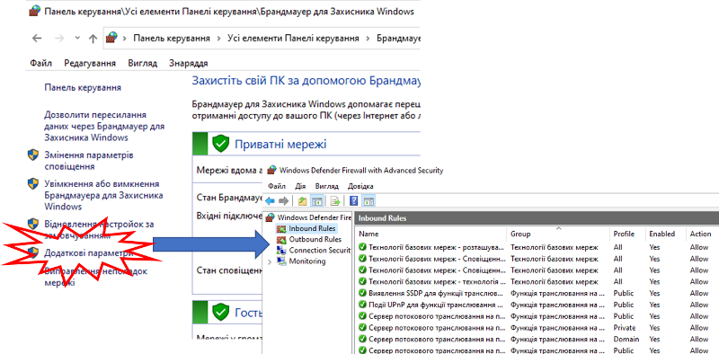

[<- До підрозділу](README.md)

# Основи протоколів TCP та UDP: практична частина

**Тривалість**: 2 акад. години (1 пара).

**Мета:** Навчитися перевіряти наявні з'єднання TCP, стан портів в ОС, відкривати та закривати порти для зовнішнього доступу.

### Лабораторна установка

**Необхідне апаратне забезпечення.** 

Для проведення лабораторних робіт необхідно мати комп’ютер з наступною мінімальною апаратною конфігурацією:

- CPU Intel/AMD 1 ГГц / RAM 2 ГБ / HDD 10 ГБ (вільних)  

**Необхідне програмне забезпечення.** 

- На комп’ютері повинна бути встановлена одна з операційних систем, підтримуваних віртуальною машиною Virtual Box та налаштована відповідно до вимог минулої лабораторної роботи  
- Безкоштовне ПЗ Packet Sender:
  - для хостової ОС <https://packetsender.com/download#show>
  - для гостьової ОС Windows XP  <https://github.com/dannagle/PacketSender/releases/download/4.9/PacketSender_2016-02-23.exe>
- Безкоштовне ПЗ Zenmap <https://nmap.org/download.html#windows>

**Загальна постановка задачі**. Цілі роботи: 

1) навчитися використовувати тестові утиліти для роботи з портами

2) навчитися передивлятися стан портів на пристрої

3) навчитися використовувати утиліти для аналізу стану TCP/UDP портів на іншому пристрої в мережі

4) навчитися конфігурувати вбудовані в ОС брандмауери для обмеження доступу до TCP/UDP портів пристрою 


### Послідовність виконання роботи

#### 1. Налаштування віртуальної машини на роботу зі спільними теками   

- [ ] Вимкніть віртуальну машину, якщо вона в роботі
- [ ] Налаштуйте віртуальну машину на роботу зі спільними теками 



рис.2.2. Налаштування спільної папки між віртуальною машиною та хостовою системою

#### 2. Встановлення `packetsender`   

- [ ] Завантажте безкоштовну утиліту `Packetsender` (<https://packetsender.com/download#show>) на хостову операційну систему відповідно до її версії. Встановіть  `Packetsender`. При інсталяції погодьтеся на надавання дозволів для доступу до ваших мережних ресурсів.  
- [ ] Завантажте стару версію 4.9 `Packetsender` , що підтримується Windows XP за [цим](https://github.com/dannagle/PacketSender/releases/download/4.9/PacketSender_2016-02-23.exe) посиланням. Додаткові варіанти завантаження доступні за [цим посиланням](https://github.com/dannagle/PacketSender/releases/tag/4.9). За допомогою спільної теки перенесіть завантаження на віртуальну машину і запустіть інсталятор. При інсталяції погодьтеся на надавання дозволів для доступу до ваших мережних ресурсів.  

#### 3. Робота з Packet Sender 

- [ ] Запустіть два екземпляри утиліти `Packet Sender` - один на хостовій машині, один на гостьовій.
- [ ] У налаштуваннях екземпляру на гостьовій ОС віртуальної машини у меню `File->Settings` вкажіть порт 5555 для серверного боку, а також активуйте повідомлення-відповідь (рис.2.3). 



рис.2.3. Налаштування серверних портів для `Packet Sender` на стороні віртуальної машини

- [ ] Для 1-го екземпляру (на хостовій ОС) вкажіть в повідомлення для відправки у форматі ASCII текст з вашим прізвищем англійською мовою, протокол `TCP`, порт `5555` та адресу віртуальної машини на віртуальній мережі, наприклад `192.168.56.101` і натисніть `Send`.



рис.2.4. Налаштування тексту відправки та портів отримувача для `Packet Sender` на стороні хостової ОС

- [ ] Перейдіть на вікно `Traffic Log` і проконтролюйте що повідомлення надійшло.   

#### 4. Прослуховування TCP трафіку  

- [ ] На хостовій ОС запустіть Wireshark і почніть прослуховувати віртуальну мережну карту.
- [ ] Повторіть відправку повідомлення з п.3. Після відправки повідомлення зупиніть прослуховування у Wireshark .
- [ ] Зробіть копію екрану Wireshark з обміном.
- [ ] Знайдіть 3-пакети TCP потрійного рукостискання.
- [ ] Знайдіть 1 пакет TCP з корисним навантаженням. Відкрийте його, знайдіть там текст, що відправлявся. Зробіть копію екрану, де видно зміст пакету.
- [ ] Знайдіть останні пакети TCP з підтвердженням та розривом з'єднання.    

#### 5. Аналіз портів з використанням NetStat   

- [ ] Ознайомтеся з утилітою `netstat` у [додатку 1](d2_2.md)
- [ ] На віртуальній машині виведіть активні підключень TCP і кодів процесів (PID):

```bash
netstat -o
```

- [ ] Викличте диспетчер задач на віртуальній машині, для цього скористайтеся меню VirtualBox:


рис.2.5. Виклик диспетчера задач в гостьовій ОС

- [ ] Активуйте в диспетчері задач відображення ідентифікаторів процесу (PID) 



рис.2.6. Показати колонку ідентифікатору процесу в диспетчері задач

- [ ] Знайдіть в диспетчері задач процеси, які були показані через `netstat`. 

Це мають бути службові програми, які є частиною підготовленої віртуальної машини, яка використовується для різних лабораторних робіт. Тому їх варто видалити, для спрощення подальшого аналізу.

- [ ] Видаліть процеси з PID, які виводив `netstat`
- [ ] Перевірте що `netstat -o` на віртуальній машині дійсно видає порожній список
- [ ] Виведіть усі порти що прослуховуються

```bash
netstat -a -o
```

- [ ] Проаналізуйте отриманий результат, знайдіть там процес PacketSender. Зробіть копію екрану.

#### 6. Аналіз відкритих портів zenmap

- [ ] Завантажте та встановіть на хостову ОС безкоштовну туліту для прослуховування відкритих портів `nmap` за [цим посиланням](https://nmap.org/download.html#windows)
- [ ] Запустіть на виконання `nmap` 
- [ ] У полі `Command` команду перегляду усіх відкритих портів на IP адресі віртуальної машини, наприклад:

```bash
nmap -p 0-65535 -T5 192.168.56.101
```



рис.2.7. Вікно сканування портів 

- [ ] Запустіть сканування використовуючи кнопку `Scan`
- [ ] Дочекайтеся результатів, це займе кілька хвилин. Зробіть копію екрану.

Дане сканування сканує усі відкриті порти на вказаній IP-адресі. Як видно з рисунку 2.7 5-ть портів надаються для зовнішнього користування. 

#### 7. Налаштування брандмауера для обмеження доступу Windows XP

У всіх сучасних ОС доступ до TCP та UDP портів обмежується вбудованими брандмауерами або спеціалізованим ПЗ, наприклад антивірусами. Якщо якісь порти треба використовувати тільки для внутрішнього користування, їх блокують. Практика безпечного користування передбачає що спочатку все блокується, а потім відкривається за необхідності. У старій ОС Windows XP брандмауер при включенні блокує доступ до всіх портів, окрім тих, що вказані у винятках. Попередні відкриті порти, що показувалися  в `nmap` якраз і є тими винятками. Ці винятки можуть бути пов'язані з програмами, які прослуховують ці порти, або конкретними портами.

- [ ] Зайдіть в панель керування з меню Пуск віртуальної машини. Відключіть усі винятки для блокування у брандмауера ОС Windows XP (рис.2.8).



рис.2.8. Налаштування винятків у брандмауера ОС Windows XP. 

- [ ] Використовуючи `nmap` перевірте доступність портів 1-8000:

```bash
nmap -p 0-8000 -T5 192.168.56.101
```

- [ ] На віртуальній машині перевірте стан портів

```bash
netstat -a -o
```

- [ ] Спробуйте відправити з `Packetsender` дані з хостової на віртуальну машину.

Результатом сканування `nmap` є порожній список, а відправка буде не вдалою. При цьому порти до сих пір прослуховуються (netstat). Це тому, що брандмауер закрив доступ по мережі. Відкриємо тільки один порт, який прослуховує `Packetsender`.

- [ ] У брандмауері Windows XP віртуальної машини добавте у список виключення TCP порт 5555 (`Добавити порт`) 



рис.2.9. Добавлення порту у список виключення брандмауера Windows XP 

- [ ] Перевірте доступність портів через `nmap` (має бути один доступний порт) та можливість відправки через `Packetsender`.
- [ ] Зробіть копії екранів для звітів

#### 8. Налаштування брандмауера у хостовій системі

Виконання даного пункту залежить від хостової ОС. Приклад буде показано для Windows 10. Ви повинні мати права адміністратора.

- [ ] Відкрийте панель керування, а в ньому налаштування брандмауеру. 
- [ ] Подивіться налаштування правил через додаткові параметри (рис.2.10).    



рис.2.10. Налаштування правил вхідних та висхідних з'єднань. 

У Windows 10 брандмауер має більше можливостей налаштування. Кожне правило включає багато різних вкладок, на яких можна тонко налаштувати правила використання вхідних або вихідних портів.  

### Перевірка виконання роботи та питання до захисту.

Викладачем перевіряється виконання всіх пунктів роботи відповідно до занотованих у звіті результатів. Оцінюється повнота результатів. Кінцева оцінка коригується по усному опитуванню при очному спілкуванню. Кожен результат студент повинен пояснити. У випадку виникнення помилок або запитань щодо проведення певного пункту, його необхідно буде повторити. 

1. Які цілі були поставлені в 1-й частині лабораторної роботи? Як вони досягалися?
2. Що таке IP адреса? Як можна дізнатися IP адреси мережних карт?
3. Що таке IPv4?
4. Як можна задати IP адреси мережним картам? Як можна задати кілька IP адрес одній мережній карті?
5. Що таке "білі" та "сірі" IP адреси? Що таке статичні та динамічні адреси? 
6. Розкажіть про роботу протоколу ICMP? Які утиліти і як його використовують?
7. Яке призначення і як працює утиліта `ping`? Прокоментуйте отримані в лабораторній роботі результати за допомогою цієї утиліти. 
8. Використовуючи інформацію зі звіту прокоментуйте основні поля структури IP пакету.
9. Яке призначення утиліти `tracert`? На якому принципі побудована її робота? Прокоментуйте отримані в лабораторній роботі результати за допомогою цієї утиліти. 
10. Яке призначення утиліт `Route` і `NetStat`? Прокоментуйте отримані в лабораторній роботі результати за допомогою цих утиліт. 
11. Що таке DNS? Яким способом можна отримати IP адресу вузла за його доменним іменем?
12. Де і навіщо налаштовуються DNS-сервери на пристроях?
13. Яке призначення утиліти `nslookup`? Прокоментуйте отримані в лабораторній роботі результати за допомогою цієї утиліти.
14. Яке призначення і як використовувати файл `hosts`?
15. Які цілі були поставлені в 2-й частині лабораторної роботи? Як вони досягалися?
16. Яке призначення утиліти `Packetsender` ? Як вона використовувалася в даній лабораторній роботі?
17. Прокоментуйте результати аналізу трафіку Wireshark при обміні через Packet Sender а також основні поля TCP/UDP-пакетів.
18. Яке призначення утиліти  `netstat`?  Прокоментуйте отримані в лабораторній роботі результати за допомогою цієї утиліти.
19. Яке призначення утиліти `zenmap`? Прокоментуйте отримані в лабораторній роботі результати за допомогою цієї утиліти.
20. Розкажіть яким чином в ОС Windows налаштовується доступ до портів. Навіщо потрібно налаштоувати такий доступ? 


Практичне заняття розробив [Олександр Пупена](https://github.com/pupenasan). 
