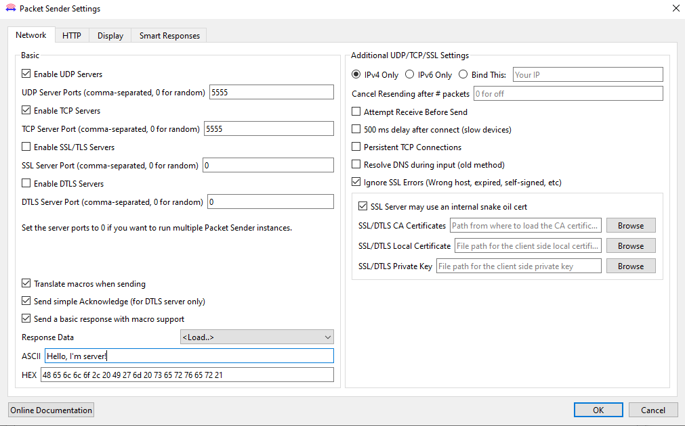
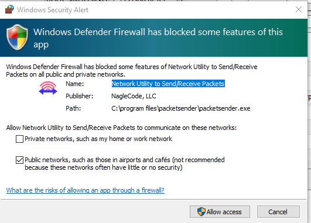
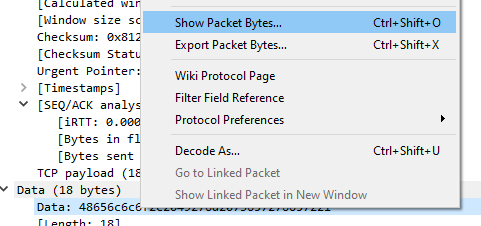
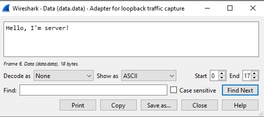
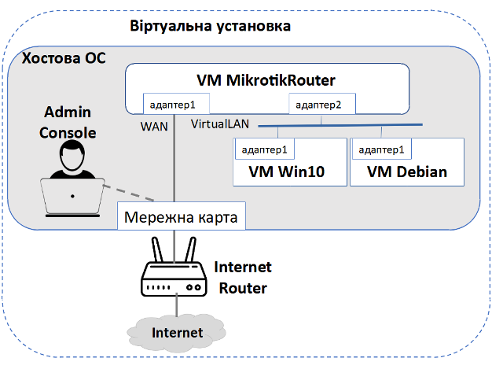
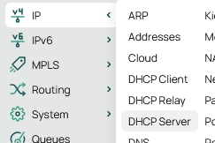
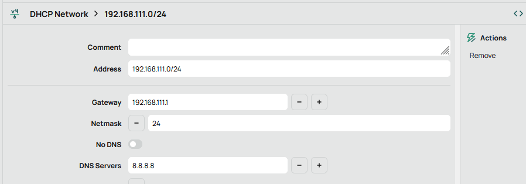
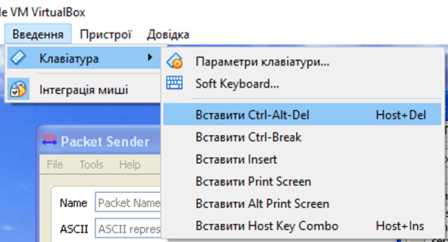
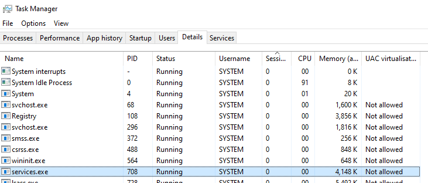
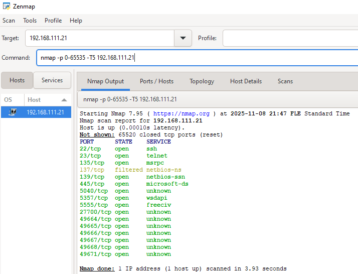

[<- До підрозділу](README.md)

# Основи TCP: практична частина

**Тривалість**: 2 акад. години (1 пара).

**Мета:** Навчитися перевіряти наявні з'єднання TCP, стан портів в ОС, відкривати та закривати порти для зовнішнього доступу.

### Лабораторна установка

**Необхідне апаратне забезпечення.** 

Для проведення лабораторних робіт необхідно мати комп’ютер з наступною мінімальною апаратною конфігурацією:

- CPU Intel/AMD 1 ГГц / RAM 2 ГБ / HDD 10 ГБ (вільних)  

**Необхідне програмне забезпечення.** 

Практичне завдання передбачає наявність встановленого ПЗ відповідно до заняття [Інструменти віддаленого доступу та налагодження: практична частина](../../nets/debug/lab.md) та [Базове налаштування маршрутизатору: практична частина](../../nets/tcpiipadd/lab.md) а саме: 

- VirtualBox на хостовій машині
- встановлені віртуальні машини VM Windows 10, VM Debian, VM Mikrotik
- сніфер Wireshark на VM Windows 10

**Додаткове ПЗ, яке потрібно встановлювати на VM:**

- Безкоштовне ПЗ Packet Sender для VM Windows 10 <https://packetsender.com/download#show>
- Безкоштовне ПЗ Zenmap та nmap <https://nmap.org/download.html#windows>

**Загальна постановка задачі**. Цілі роботи: 

1) навчитися використовувати тестові утиліти для роботи з портами

2) навчитися передивлятися стан портів на пристрої

3) навчитися використовувати утиліти для аналізу стану TCP портів на іншому пристрої в мережі

4) навчитися конфігурувати вбудовані в ОС брандмауери для обмеження доступу до TCP портів пристрою

5) вивчити роботу протоколу TCP з використанням WireShark


### Послідовність виконання роботи

#### 1. Завантаження та встановлення Packet Sender та nmap

- [ ] Налаштуйте роботу 2-ї віртуальної мережної карти VM Windows 10 в режимі NAT.

- [ ] Запустіть VM Windows 10.
- [ ] Завантажте та встановіть на VM Windows 10 безкоштовну утиліту `Packetsender` (<https://packetsender.com/download#show>) на хостову операційну систему відповідно до її версії. За необхідності вимкніть мережну карту, що відповідає за віртуальний адаптер 1. 
- [ ] Встановіть  `Packetsender`. При інсталяції погодьтеся на надавання дозволів для доступу до ваших мережних ресурсів.  
- [ ] Завантажте та встановіть на VM Windows10 безкоштовну утиліту для прослуховування відкритих портів `nmap` за [цим посиланням](https://nmap.org/download.html#windows)

#### 2. Робота з Packet Sender 

- [ ] Запустіть два екземпляри утиліти `Packet Sender` на VM Windows 10, один будемо називати  `Client1` , а інший `Server1`.
- [ ] У одному екземплярі у меню `File->Settings` вкажіть порт 5555 для серверного боку, а також активуйте повідомлення-відповідь (рис.1) і натисніть `Ок`.  



рис.1. Налаштування серверних портів для `Packet Sender` з боку `Server1` та відповіді.

- [ ] Підтвердіть доступ  `Packet Sender`  до серверного порту (рис.2)



рис.2. Надання дозволу до порту з боку `Server1` .

- [ ] Для  `Client1`  вкажіть в повідомлення для відправки у форматі ASCII текст з вашим прізвищем англійською мовою, протокол `TCP`, порт `5555` та адресу 127.0.0.1 (loopback) і натисніть `Send`.


рис.3. Налаштування тексту відправки та портів отримувача  з боку `Client1` .

- [ ] Перейдіть на вікно `Traffic Log` і проконтролюйте що запит і відповідь надійшли.   

#### 3. Прослуховування та аналіз TCP трафіку  

- [ ] На VM Windows 10 запустіть Wireshark і почніть прослуховувати loopback interface.
- [ ] Повторіть відправку повідомлення з п.2. Після відправки повідомлення зупиніть прослуховування у Wireshark.
- [ ] Використайте фільтр за номером порту, якщо спостерігається якийсь інший трафік за loopback interface.
- [ ] Зробіть копію екрану Wireshark з обміном. Зверніть увагу на значення полів `protocol`.
- [ ] Знайдіть пакети TCP потрійного рукостискання. Перегляньте зміст пакетів, зокрема стан прапорціів.  
- [ ] Знайдіть пакети TCP розірвання з'єднання. Перегляньте зміст пакетів, зокрема стан прапорціів. 
- [ ] Знайдіть пакети TCP з корисним навантаженням та їх підтвердження іншою стороною. Відкрийте його, проаналізуйте наступні поля та визначені Wireshark'ом властивості пакету, та заповніть таблицю 1:
  - [ ] source port
  - [ ] destination port
  - [ ] корисне навантаження
  - [ ] sequence number 
  - [ ] sequence number raw
  - [ ] next sequence number 
  - [ ] ack number
  - [ ] ack number raw
  - [ ] flags (тільки одиничні) 
  - [ ] checksum
  - [ ] window

- [ ] У пункті "Поле" поставте `+` якщо це поле. Якщо це визначені властивість Wireshark'ом, поясніть як він це зробив.

Таблиця 1. Значення властивостей пакету 

| Поле/властивість пакету | Значення | Поле чи властивість | Пояснення |
| ----------------------- | -------- | ------------------- | --------- |
|                         |          |                     |           |

- [ ] Використайте вікно аналізу корисного навантаження пакету для відображення даних у вигляді ASCII (рис.4) 





рис.4. Зміна властивостей для відображення корисного навантаження

#### 4. Використання серверного порту `23`  

- [ ] Добавте в `Server1` ще один серверний порт з номером `23` (через кому).
- [ ] Запустіть Wireshark і почніть прослуховувати loopback interface.
- [ ] Повторіть відправку даних від `Client1` але вже на порт `23` і зупиніть захват пакетів.
- [ ] Зробіть копію екрану Wireshark з обміном. Зверніть увагу на значення полів `protocol` і порівняйте з тим що було в п.3. Запишіть у звіт чому Wireshark змінив це поле і чому саме на це значення?
- [ ] Знайдіть пакети TCP з корисним навантаженням. Подивіться в якому форматі ці дані відображаються. У звіті напишіть чому так. 

#### 5. Підготовка віртуальної мережі

- [ ] Деактивуйте другу мережну карту на VM Windows 10, яка пов'язана через NAT на хості. 
- [ ] Налаштуйте за необхідності мережні карти на VM Debian та VM Mikrotik, щоб вони були в одній віртуальній мережі (рис.5). Як це зробити можна подивитися в практичній роботі [Базове налаштування маршрутизатору: практична частина](../../nets/tcpiipadd/lab.md)  



рис.5. До налаштування віртуальної мережі.

- [ ] Запустіть VM Debian та VM Mikrotik, переконайтеся що всі три віртуальні машини знаходяться в одній IP мережі і отримали свої IP адреси.
- [ ] Зробіть `ping 8.8.8.8` і перевірте що є доступ до Інтернету через VM Mikrotik. Якщо немає, то перевірте усі налаштування відповідно до рис.5.  
- [ ] На VM Windows 10 запустіть браузер і перевірте що є доступ до якогось сайту в Інтернеті. Якщо немає, то зробіть наступні дії:
- Зайдіть в налаштування Mikrotik, перейдіть в режим "Advanced" 
- перейдіть на вкладку `DHCP Server`



рис.6. Перехід до налаштувань DHCP Server

- зайдіть в налаштування Networks
- вкажіть `8.8.8.8` у поле DNS Servers



рис.7. 

#### 6. Аналіз серверних портів VM Windows 10 з використанням NetStat   

- [ ] Запустіть у командному рядку VM Windows10 команду

```bash
netstat /?
```

- [ ] Подивіться які опції доступні в netstat
- [ ] Виведіть активні підключення TCP і кодів процесів (PID):

```bash
netstat -ao -p tcp
```

- [ ] Викличте диспетчер задач на віртуальній машині, для цього скористайтеся меню VirtualBox:



рис.8. Виклик диспетчера задач в гостьовій ОС

- [ ] Відкрийте в диспетчері задач відображення деталей процесів 



рис.9. Детальне відображення даних процесів в диспетчері задач Windows 10

- [ ] Знайдіть в диспетчері задач процеси, які були показані через `netstat`. 

- [ ] Проаналізуйте отриманий результат, знайдіть там процес PacketSender. 

- [ ] Зробіть те саме для протоколу udp.

```bash
netstat -ao -p udp
```

#### 7. Аналіз серверних TCP портів VM Windows10 з використанням PowerShell 

- [ ] У VM Windows 10 запустіть PowerShell і введіть туди команду

```powershell
Get-NetTCPConnection -State Listen |
Where-Object { $_.LocalAddress -notmatch ':' } |
Select-Object LocalAddress,LocalPort,@{Name='Process';Expression={(Get-Process -Id $_.OwningProcess).ProcessName}} |
Sort-Object LocalPort |
Format-Table -AutoSize
```

#### 8. Аналіз відкритих портів з використанням zenmap у VM Windows10

- [ ] У VM Windows 10 запустіть на виконання `nmap` 
- [ ] У полі `Command` команду перегляду усіх відкритих портів на власній IP адресі:

```bash
nmap -p 0-65535 -T5 192.168.111.21
```

- [ ] Запустіть сканування використовуючи кнопку `Scan`
- [ ] Дочекайтеся результатів, це займе кілька хвилин. Зробіть копію екрану.



рис.10. Вікно сканування портів 

Дане сканування сканує усі відкриті порти на вказаній IP-адресі, а також . 

Таблиця 2. Значення статусу

| Статус       | Значення                                                     |
| ------------ | ------------------------------------------------------------ |
| `open`       | порт слухає і приймає з’єднання                              |
| `closed`     | порт не слухає, але доступний (можна підключитись — одразу відмовляє) |
| `filtered`   | фаєрвол блокує або фільтрує запити                           |
| `unfiltered` | порт доступний, але nmap не зміг визначити стан точно        |

#### 9. Аналіз відкритих портів з використанням nmap з VM Debian 

- [ ] На VM Debian встановіть nmap

```bash
sudo apt update
sudo apt install -y nmap
```

- [ ] Перевірте стан доступу до портів VM Windows10 з VM Debian, використовуючи ту саму команду що в попередньому пункті але під правами `sudo`

```bash
nmap -p 0-65535 -T5 192.168.111.21
```

- [ ] Дочекайтеся результатів, це займе кілька хвилин. Зробіть копію екрану.
- [ ] Порівняйте результати з попереднім пунктом. Подумайте чому вони відрізняються?

#### 10. Аналіз відкритих портів у VM Debian 

- [ ] За допомогою zenmap pробіть аналіз відкритих портів у VM Debian з VM Windows10

#### 11. Спроба підключитися до закритого порту VM Windows10 з VM Debian 

- [ ] Проконтролюйте, що на VM Windows10 запущений Packet Sender з налаштуваннями `Server1`
- [ ] На VM Debian спробуйте відправити текст на IP VM Windows10 і порт 5555, якщо команда виконається вдало, Ви побачите цей текст в  Packet Sender.  

```bash
echo -e "hello\n" > /dev/tcp/192.168.111.21/5555
```

Очевидно, що якщо порт 5555 не буде в списку відкритих, команда не дасть позитивного результату. 

#### 12. Налаштування брандмауера для обмеження доступу Windows 10

У всіх сучасних ОС доступ до TCP та UDP портів обмежується вбудованими брандмауерами або спеціалізованим ПЗ, наприклад антивірусами. Якщо якісь порти треба використовувати тільки для внутрішнього користування, їх блокують. Практика безпечного користування передбачає що спочатку все блокується, а потім відкривається за необхідності. У ОС Windows 10 брандмауер вмикається за замовчуванням і контролює всі вхідні та вихідні з’єднання, навіть якщо користувач не встановлював додаткове ПЗ безпеки. За замовчуванням він блокує вхідні з’єднання для всіх застосунків, окрім тих, яким явно надано дозвіл (наприклад, системні служби, служби спільного доступу до файлів, служба віддаленого робочого столу тощо). Вихідні з’єднання, навпаки, зазвичай дозволені, щоб програми могли ініціювати комунікацію назовні.

Щоб програма могла приймати підключення (тобто порт став “відкритим” для зовнішнього доступу), для неї потрібно створити дозвіл у брандмауері. Це можна зробити через графічний інтерфейс («Дозволити програмі або компоненту через брандмауер Windows Defender») або через PowerShell або командний рядок.

У корпоративних середовищах правила можуть централізовано задаватися через політики групи (Group Policy), а в домашніх системах — вручну або антивірусним пакетом.

У Linux ситуація подібна: роль брандмауера виконують `iptables` або `nftables`, які керують політиками фільтрації пакетів у ядрі. У більшості дистрибутивів їх роботу спрощує сервіс `ufw` або `firewalld`, що дозволяють швидко закривати чи відкривати окремі порти:

```bash
sudo ufw allow 22/tcp
sudo ufw deny 5555/tcp
```

- [ ] Запустіть VM Windows10 PowerSheell від імені адміністратора. Запустіть команду, що дозволяє доступ до 5555 порта.

```powershell
New-NetFirewallRule -DisplayName "Allow TCP 5555" -Direction Inbound -Protocol TCP -LocalPort 5555 -Action Allow
```

- [ ] Використовуючи `nmap` ще раз перевірте доступність порту 5555 з VM Debian

#### 13.  Повторна спроба підключитися до закритого порту VM Windows10 з VM Debian 

- [ ] Повторіть пункт 11, він має дати позитивний результат.


### Питання до захисту

1. У роботі  був використаний llopback інтерфейс, поясніть що це значить.
2. Чому Wireshark не надав в п.3 інформацію про корисне навантаження в текстовому вигляді але зробив це в п.4?
3.  


Практичне заняття розробив [Олександр Пупена](https://github.com/pupenasan). 


Якщо Ви хочете залишити коментар у Вас є наступні варіанти:

- [Обговорення у WhatsApp](https://chat.whatsapp.com/BRbPAQrE1s7BwCLtNtMoqN)
- [Обговорення в Телеграм](https://t.me/+GA2smCKs5QU1MWMy)
- [Група у Фейсбуці](https://www.facebook.com/groups/asu.in.ua)

Про проект і можливість допомогти проекту написано [тут](https://asu-in-ua.github.io/atpv/)
