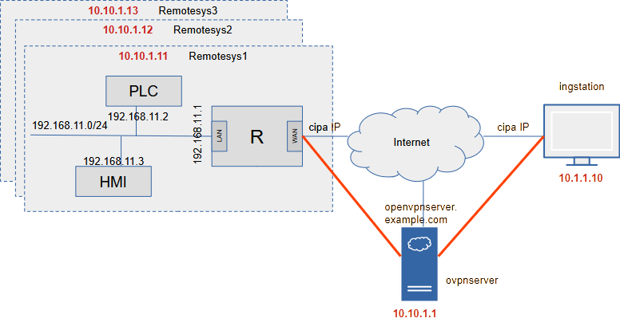
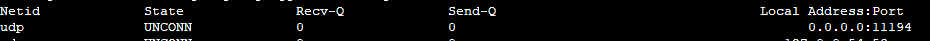
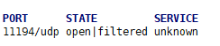
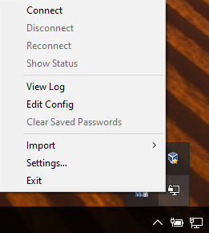
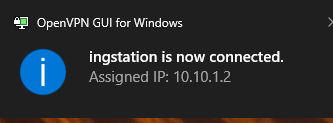
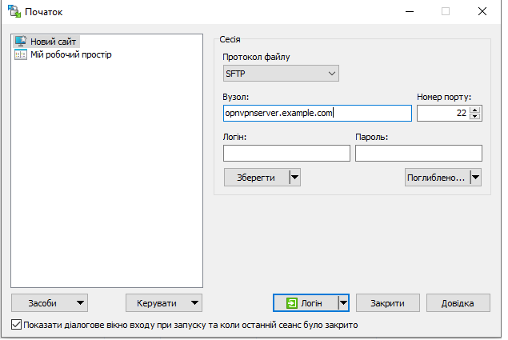
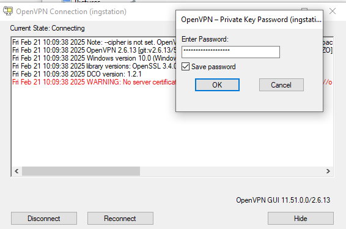
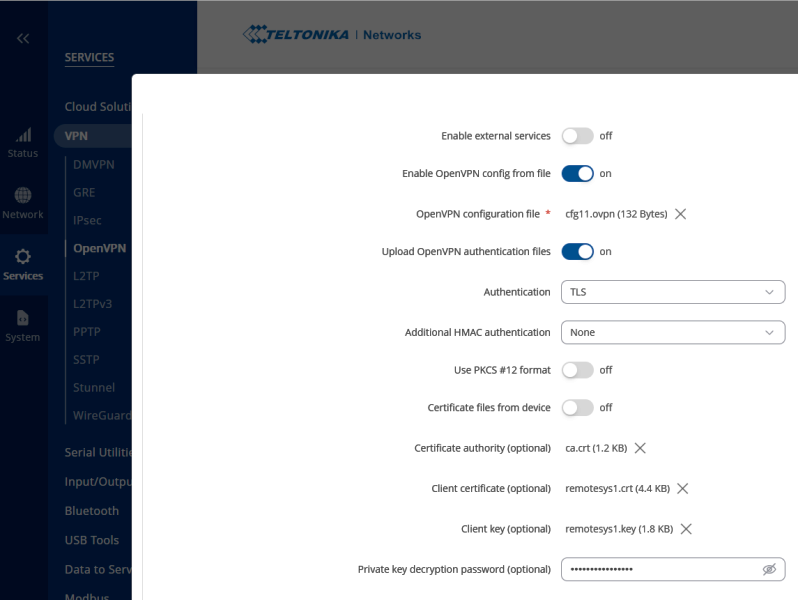
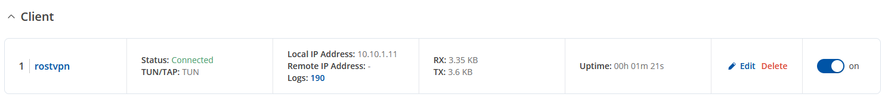
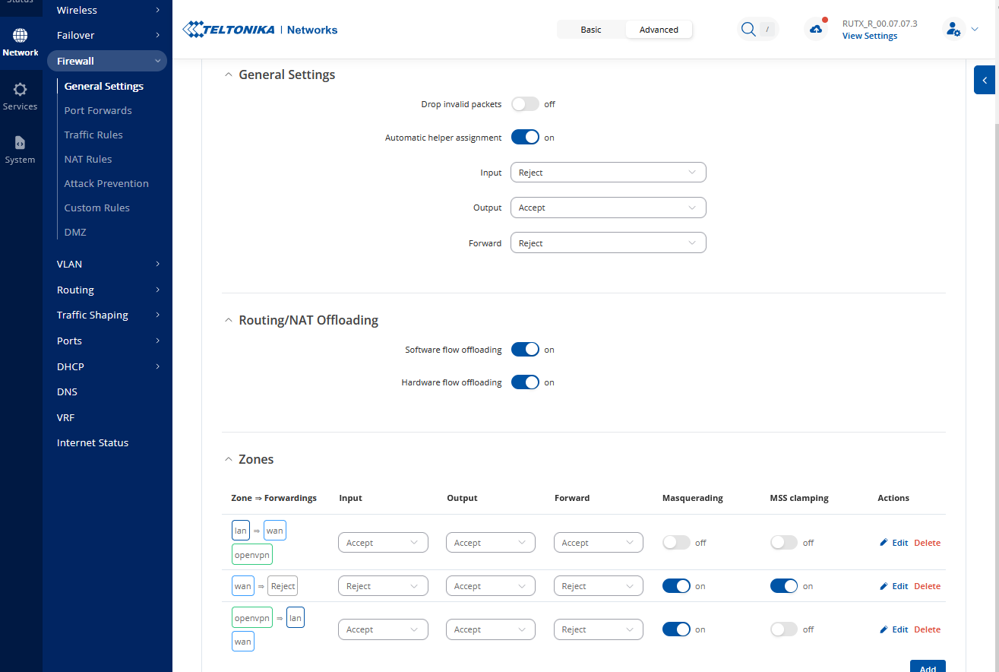

[<- До підрозділу](README.md)

# Створення Open VPN для віддаленого налагодження об'єктів: практична частина

**Тривалість**: 4 академічні години 

**Мета:**  Навчитися налаштовувати служби OpenVPN для побудови VPN рішень доступу до віддалених локальних мереж з метою віддаленого моніторингу та налагодження. 

## Лабораторна установка для проведення лабораторної роботи

**Апаратне забезпечення, матеріали та інструменти для проведення віртуальної лабораторної роботи.** 

- віртуальна машина на Windows 10
- маршрутизатора Teltonika RUT або будь який інший з підтримкою OpenVPN; можна використовувати віртуальні машини з прошивками Microtic або інші, однак в лабораторній роботі опис йде саме для Teltonika RUT
- віртуальна машина в хмарі, або реальний комп'ютер з Debian/Ubuntu та виділеним IP; можливі інші варіанти пристроїв з іншими ОС та виділеною "білою" IP адресою, однак в лабораторній роботі опис йде саме для Debian
- доступ до Internet     

**Програмне забезпечення, що використане у віртуальній лабораторній роботі.** 

1. Служби OpenVPN comunity версії.
2. Утиліти Easy-RSA
3. [WinSCP](https://winscp.net/eng/docs/lang:uk)

## Загальна постановка задачі

У якості завдання для лабораторної роботи використовується структура цільової системи для віддаленого налагодження об'єктів автоматизації, яка пояснюється в [лекції](openvpn.md). Рішення з використанням OpenVPN  повинно забезпечити доступ віддаленої станції `Інженерна станція` до мережі будь якого з об'єктів віддаленої підсистеми за необхідності. Передбачається що доступ до мережі клієнта відбуватиметься через маршрутизатор (позначено як `R`), який буде маршрутизувати весь клієнтський трафік через Internet до інженерної станції і у зворотній бік. Рішення базується на конфігурації OpenVPN  `client-server`.  На схемі використовується наступне апаратне та програмне забезпечення: 

- `ovpnserver` - один OpenVPN сервер , який забезпечує функціонування обміну між потрібними приватними мережами, має білу IP адресу: надалі в прикладах буде використовуватися недійсне доменне ім'я `openvpnserver.example.com`
- `remotesys1` ... `remotesysn` - OpenVPN клієнти для віддалених систем, мають сірі IP адреси, за NAT; для перевірки прикладу використовуватимуться віртуальні машини, що підключені до маршрутизатору.  
- `R` - маршрутизатор з вбудованими функціями OpenVPN; у даній лабораторній роботі використовується Teltonika RUT, однак замість неї можна використовувати маршрутизатори з аналогічною функціональністю;
- `ingstation` - OpenVPN клієнт для інженерної станції, мають сіру IP адресу, за NAT, ОС Windows 10; 
- `ПК Адміністратора` - комп'ютер з якого відбувається налаштування, не є `ingstation`. 



рис.1. Структура рішення на базі OpenVPN

Червоним текстом на рис.1. показані внутрішні IP-адреси кінцевих точок для тунелів, червоними лініями самі тунелі.

Цілі роботи: 

- встановити на сервері службу OpenVPN
- встановити на інженерну станцію `ingstation` службу OpenVPN
- створити та перевірити простий незахищений тунель `p2p` між `ingstation` і `ovpnserver` 
- розгорнути на віртуальній машині PKI, створити сертифікати:
  - кореневий CA, який буде підписувати усі інші сертифікати 
  - для сервера OpenVPN `ovpnserver`
  - для клієнтів `remotesys1` та `ingstation`
- створити файли конфігурацій OpenVPN для клієнтів і серверів для реалізації рішення з рис.1  
- налаштувати на  `remotesys1` службу OpenVPN

## Послідовність виконання роботи

### 1. Корисні посилання

- [ ] Ознайомтеся з посиланнями, які можливо знадобляться для частого перегляду:

- Теорія пояснюється в [лекції](openvpn.md). 
- Усі параметри конфігураційного файлу для версії 2.6 доступні [за посиланням](https://openvpn.net/community-resources/reference-manual-for-openvpn-2-6/#introduction)
- Деталі роботи з OpenVPN в Debian описані в [цій статті](openvpndebian.md) 
- Документація по Easy-RSA 3
  - [Easy-RSA 3 Documentation Readme](https://github.com/OpenVPN/easy-rsa/blob/master/doc/EasyRSA-Readme.md)
  - [Easy-RSA Advanced Reference](https://github.com/OpenVPN/easy-rsa/blob/master/doc/EasyRSA-Advanced.md)

### 2. Корисні команди

- [ ] Ознайомтеся з командами, які часто використовуються в лабораторній роботі:

#### Перемикання режиму роботи з консоллю від імені суперкористувача 

```
sudo -s
```

Вийти з режиму `sudo -s` можна кількома способами:

1. Ввести `exit` і натиснути `Enter`
2. Натиснути `Ctrl + D`

Обидва варіанти завершують сесію суперкористувача й повертають вас до звичайного користувача.

#### Переглянути список процесів `openvpn`

```
ps aux | grep openvpn
```

- `ps aux` - wе команда для перегляду всіх запущених процесів у системі.

  - `a` – показує процеси всіх користувачів.

  - `u` – відображає інформацію у зручному форматі (з іменами користувачів, CPU, пам’яттю тощо).

  - `x` – показує процеси без терміналу (наприклад, демони).

-  `|` (пайп) gередає вивід команди `ps aux` у вхід команди `grep`.

- `grep openvpn`- шукає у виводі тільки рядки, що містять `openvpn`.

#### Завершити усі процеси з іменем `openvpn` 

```
killall openvpn 
```

#### Вивести файл на консоль

Наприклад переглянути зміст `/var/log/vpnapp1.log`

```
cat /var/log/vpnapp1.log
```

#### Редагувати файл

Наприклад редагувати `server.conf`

```
nano server.conf
```

Вийти з редактора, зберігши налаштування: `CTRL+x`, потім `Y`, потім `Enter`

### 3. Встановлення OpenVPN на сервері 

Передбачається, що у вас є віртуальна машина в хмарі або реальний ПК з Debian або Ubuntu, з виділеною "білою" IP. Якщо Ви ще не маєте досвіду роботи з віртуальними машинами в хмарі, варто познайомитися з темою [Вступ до хмарних технологій](../../vm/cloudsintro/README.md) 

- [ ] Використовуючи консоль з ПК адміністратора підключіться до серверу і встановіть пакет openvpn. 

```
sudo apt update
sudo apt-get install openvpn
```

Деталі роботи з OpenVPN в Debian описані в [цій статті](openvpndebian.md) 

### 4. Створення простої конфігурації для сервера 

У цьому пункті необхідно створити папку та файл з налаштуваннями простої конфігурації тунелю типу "точка-точка" (`p2p`) з боку сервера. У цій конфігурації передбачається, що буде тільки один тунель з двома вузлами: 

- `10.10.1.1` - серверна сторона тунелю (прослуховування на порту `11194`), яка виконується на сервері з Debian з білою IP адресою
- `10.10.1.2` - клієнтська сторона тунелю, інженерна станція, яка виконується на Windows 10, це перший варіант підключення інженрної станції `ingstation` 

- [ ] Переключіть консоль до сервера в режим суперкористувача

```
sudo -s
```

- [ ] Створіть папку `vpnapp1` для конфігурації рішення та перейдіть в неї.

```
mkdir -p /etc/openvpn/vpnapp1
cd /etc/openvpn/vpnapp1
```

- [ ] Запустіть редактор `nano` для створення файлу конфігурування `server.conf`

```
nano server.conf
```

- [ ] Скопіюйте туди наступний текст

```
proto udp
port 11194
ifconfig 10.10.1.1 10.10.1.2
dev tun
verb 3
daemon
log /var/log/vpnapp1.log
```

- [ ] Вийдіть з редактора, зберігши налаштування: `CTRL+x`, потім `Y`, потім `Enter`

Пояснення ключів файлу конфігурації:

- `proto udp`: даний параметр вказує що протокол буде `udp` 
- `port 11194`: це локальний порт, який OpenVPN слухатиме. 
- `dev tun`: це означує назву пристрою `tun`, який буде використовуватися для сервера. Не додаючи номер за `tun`, ми наказуємо OpenVPN відкрити новий пристрій `tun`. Цьому новому пристрою буде призначено перший доступний номер у ядрі системи, починаючи з 0 (`tun0`, `tun1`, `tun2` тощо). 
- `ifconfig 10.10.1.1 10.10.1.10`: параметри адаптера TUN/TAP в точка-точка, перший аргумент IP-адреса локальної кінцевої точки VPN, наступний аргумент IP-адреса VPN віддаленої кінцевої точки VPN
- `verb 3`: це встановлює рівень детальності на значення за замовчуванням 3
- `daemon`: повідомляє OpenVPN демонізувати себе, що означає, що процес OpenVPN продовжуватиме працювати навіть після закриття вікна терміналу, у якому було запущено OpenVPN
- `log`: виводити журнал 

### 5. Запуск openvpn з вказаною конфігурацією на сервері 

- [ ] Запустіть openvpn з вказаним файлом конфігурації

```
openvpn --config server.conf
```

- [ ] Виведіть журнал на консоль:

```
cat /var/log/vpnapp1.log
```

Має вивести щось на кшталт наступного:

```
2025-02-20 13:28:04 No tls-client or tls-server option in configuration detected. Disabling data channel offload.
2025-02-20 13:28:04 DEPRECATION: No tls-client or tls-server option in configuration detected. OpenVPN 2.7 will remove the functionality to run a VPN without TLS. See the examples section in the manual page for examples of a similar quick setup with peer-fingerprint.
2025-02-20 13:28:04 OpenVPN 2.6.3 x86_64-pc-linux-gnu [SSL (OpenSSL)] [LZO] [LZ4] [EPOLL] [PKCS11] [MH/PKTINFO] [AEAD] [DCO]
2025-02-20 13:28:04 library versions: OpenSSL 3.0.15 3 Sep 2024, LZO 2.10
2025-02-20 13:28:04 DCO version: N/A
2025-02-20 13:28:04 ******* WARNING *******: '--cipher none' was specified. This means NO encryption will be performed and tunnelled data WILL be transmitted in clear text over the network! PLEASE DO RECONSIDER THIS SETTING!
2025-02-20 13:28:04 ******* WARNING *******: '--auth none' was specified. This means no authentication will be performed on received packets, meaning you CANNOT trust that the data received by the remote side have NOT been manipulated. PLEASE DO RECONSIDER THIS SETTING!
2025-02-20 13:28:04 ******* WARNING *******: All encryption and authentication features disabled -- All data will be tunnelled as clear text and will not be protected against man-in-the-middle changes. PLEASE DO RECONSIDER THIS CONFIGURATION!
2025-02-20 13:28:04 TUN/TAP device tun0 opened
2025-02-20 13:28:04 net_iface_mtu_set: mtu 1500 for tun0
2025-02-20 13:28:04 net_iface_up: set tun0 up
2025-02-20 13:28:04 net_addr_ptp_v4_add: 10.10.1.1 peer 10.10.1.2 dev tun0
2025-02-20 13:28:04 Could not determine IPv4/IPv6 protocol. Using AF_INET
2025-02-20 13:28:04 Socket Buffers: R=[212992->212992] S=[212992->212992]
2025-02-20 13:28:04 UDPv4 link local (bound): [AF_INET][undef]:11194
2025-02-20 13:28:04 UDPv4 link remote: [AF_UNSPEC]
```

### 6. Перевірка прослуховування та доступності порта ззовні на сервері 

- [ ] Запустіть команду для перегляду портів які прослуховуються

```
ss -tulnp
```

Розшифровка ключів:

- `-t` – TCP
- `-u` – UDP
- `-l` – тільки порти, які прослуховуються
- `-n` – виводити IP-адреси й порти в числовому форматі (швидше)

У переліку портів має бути `11194`, наприклад:



рис.2. Фрагмент таблиці портів що прослуховуються

- [ ] Перевірте ззовні чи відритий порт, наприклад за допомогою утиліти [zenmap](https://nmap.org/zenmap/) або <https://nmap.online> набравши наступну команду (де `opnvpnserver.example.com` - адреса серверу): 

```
nmap -p 11194 -sU opnvpnserver.example.com
```

Має показати щось подібне до наступного:



рис.3. Фрагмент екрану з виведеним станом портів

- [ ] Якщо порти закриті, то відкрийте порти, які планується використовувати для тунелів, у цьому прикладі це буде порт `11194`.  Як відкрити порт описано наприклад в [цій статті](openvpndebian.md) 

### 7. Встановлення, налаштування та запуск служби OpenVPN на інженерній станції з Windows 

У даній лабораторній роботи замість реальної машини інженерної станції використовується віртуальна машина з Windows 10. Про налаштування та встановлення гостьових систем в гіпервізорі Wirtual Box можна прочитати за [цим посиланням](../../vm/vbox/README.md).

- [ ] На інженерній станції завантажте файл `*.msi`  [зі сторінки завантаження](https://openvpn.net/community-downloads/) і запустіть процес інсталяції. Дочекайтеся, коли інсталяція завершиться.

- [ ] Створіть текстовий файл `ingstation.ovpn` і відкрийте за допомогою текстового редактору. Внесіть туди наступні зміни і збережіть. 

```
proto udp
port 11194
remote opnvpnserver.example.com
ifconfig 10.10.1.2 10.10.1.1
dev tun
```

де `remote openvpnserver.example.com`:  вказує назву сервера VPN, до якого потрібно підключитися, замість `opnvpnserver.example.com` вставте білу IP адресу або доменну адресу вашого серверу 

- [ ] Зайдіть в папку `C:\Program Files\OpenVPN\config` , створіть папку з іменем `vpnapp1`. Скопіюйте туди створений файл.

Папка `C:\Program Files\OpenVPN\config` або її підпапки повинні містити конфігураційні файли OpenVPN, кожен із яких має розширення `.ovpn`. Коли запускається OpenVPN GUI, конфігураційні файли в цій папці та її підпапок додаються до списку доступних підключень.

- [ ] Запустіть OpenVPN GUI. Через контекстне меню OpenVPN GUI па панелі  натисніть `Connect`.



рис.4. Вигляд контекстного меню OpenVPN GUI

- [ ] Може виникнути вікно з попередженням брандмауеру, зробіть підтвердження `allow access`.

- [ ] Дочекайтеся коли відбудеться підключення або виникне помилка. У першому випадку вікно з виведенням стану закриється, натомість з'явиться  повідомлення:



рис.5. Повідомлення про вдале підключення

У другому випадку в журналі стану з'являться повідомлення про помилки.

- [ ] У контекстному меню OpenVPN натисніть `view log`, подивіться на журнал підключення, має бути щось на кшталт:.

```
2025-02-20 15:57:59 DEPRECATION: No tls-client or tls-server option in configuration detected. OpenVPN 2.7 will remove the functionality to run a VPN without TLS. See the examples section in the manual page for examples of a similar quick setup with peer-fingerprint.
2025-02-20 15:57:59 OpenVPN 2.6.13 [git:v2.6.13/5662b3a8eb9e5744] Windows [SSL (OpenSSL)] [LZO] [LZ4] [PKCS11] [AEAD] [DCO] built on Jan 15 2025
2025-02-20 15:57:59 Windows version 10.0 (Windows 10 or greater), amd64 executable
2025-02-20 15:57:59 library versions: OpenSSL 3.4.0 22 Oct 2024, LZO 2.10
2025-02-20 15:57:59 DCO version: 1.2.1
2025-02-20 15:57:59 ******* WARNING *******: '--cipher none' was specified. This means NO encryption will be performed and tunnelled data WILL be transmitted in clear text over the network! PLEASE DO RECONSIDER THIS SETTING!
2025-02-20 15:57:59 ******* WARNING *******: '--auth none' was specified. This means no authentication will be performed on received packets, meaning you CANNOT trust that the data received by the remote side have NOT been manipulated. PLEASE DO RECONSIDER THIS SETTING!
2025-02-20 15:57:59 ******* WARNING *******: All encryption and authentication features disabled -- All data will be tunnelled as clear text and will not be protected against man-in-the-middle changes. PLEASE DO RECONSIDER THIS CONFIGURATION!
2025-02-20 15:57:59 open_tun
2025-02-20 15:57:59 tap-windows6 device [OpenVPN TAP-Windows6] opened
2025-02-20 15:57:59 Notified TAP-Windows driver to set a DHCP IP/netmask of 10.10.1.2/255.255.255.252 on interface {F823C6AF-0337-4593-8309-34FF9DF8CE53} [DHCP-serv: 10.10.1.1, lease-time: 31536000]
2025-02-20 15:57:59 Successful ARP Flush on interface [17] {F823C6AF-0337-4593-8309-34FF9DF8CE53}
2025-02-20 15:57:59 IPv4 MTU set to 1500 on interface 17 using service
2025-02-20 15:57:59 TCP/UDP: Preserving recently used remote address: [AF_INET]1.2.3.4:11194
2025-02-20 15:57:59 UDPv4 link local (bound): [AF_INET][undef]:11194
2025-02-20 15:57:59 UDPv4 link remote: [AF_INET]1.2.3.4:11194
2025-02-20 15:58:09 Peer Connection Initiated with [AF_INET]1.2.3.4:11194
2025-02-20 15:58:15 Initialization Sequence Completed
```

- [ ] У Windows інженерної станції запустіть командний рядок, перевірте доступність IP тунелю серверу з клієнту:

```
ping 10.10.1.1
```

- [ ] З консолі ПК адміністратора, який підключений до серверу перевірте доступність IP тунелю клієнта з серверу

```
ping 10.10.1.2
```

### 9. Обговорення рішення з захищеним з'єднанням 

Створення тунелю в попередніх пунктах потрібне для початкових кроків, однак таке рішення має велику кількість недоліків. Надалі будуть розглядатися кроки для створення захищеної VPN системи, яка описується в загальній постановці задачі. А саме:

- встановити та налаштувати центр сертифікації.
- створити центр сертифікації та кореневий сертифікат
- створити та підписати сертифікати для сервера та клієнтів  
- скопіювати сертифікати на пристрої з OpenVP службами
- змінити конфігурації на стороні сервера та клієнтів для роботи з сертифікатами та необхідними мережами    

### 10. Створення центру сертифікації CA на сервері

- [ ] У консолі підключеної до серверу вийдіть з режиму суперкористувача, після чого перейдіть на домашню директорію

```
exit
cd
```

- [ ] Завантажте архів пакету EasyRSA

```
wget https://github.com/OpenVPN/easy-rsa/releases/download/v3.2.2/EasyRSA-3.2.2.tgz
```

- [ ] Розпакуйте

```
tar -xzvf EasyRSA-3.2.2.tgz
```

У процесі розпакування виведе наступну іфнормацію

```
EasyRSA-3.2.2/
EasyRSA-3.2.2/openssl-easyrsa.cnf
EasyRSA-3.2.2/._gpl-2.0.txt
tar: Ignoring unknown extended header keyword 'LIBARCHIVE.xattr.com.apple.metadata:kMDItemTextContentLanguage'
EasyRSA-3.2.2/gpl-2.0.txt
EasyRSA-3.2.2/ChangeLog
EasyRSA-3.2.2/x509-types/
EasyRSA-3.2.2/README.md
EasyRSA-3.2.2/COPYING.md
EasyRSA-3.2.2/easyrsa
EasyRSA-3.2.2/doc/
EasyRSA-3.2.2/vars.example
EasyRSA-3.2.2/README.quickstart.md
EasyRSA-3.2.2/doc/Intro-To-PKI.md
EasyRSA-3.2.2/doc/EasyRSA-Readme.md
EasyRSA-3.2.2/doc/EasyRSA-Contributing.md
EasyRSA-3.2.2/doc/Hacking.md
EasyRSA-3.2.2/doc/EasyRSA-Renew-and-Revoke.md
EasyRSA-3.2.2/doc/EasyRSA-Advanced.md
EasyRSA-3.2.2/doc/EasyRSA-Upgrade-Notes.md
EasyRSA-3.2.2/x509-types/ca
EasyRSA-3.2.2/x509-types/server
EasyRSA-3.2.2/x509-types/COMMON
EasyRSA-3.2.2/x509-types/kdc
EasyRSA-3.2.2/x509-types/code-signing
EasyRSA-3.2.2/x509-types/client
EasyRSA-3.2.2/x509-types/email
EasyRSA-3.2.2/x509-types/serverClient

```

- [ ] Зробіть копію файлу `vars.example` з іменем `vars`

```
cd EasyRSA-3.2.2
cp vars.example vars
```

- [ ] Відкрийте файл `vars` для редагування 

```
nano ./vars
```

- [ ] Зніміть коментар  (`#`) на `set_var EASYRSA` та встановіть наступний шлях

```
set_var EASYRSA	"/usr/local/etc/easy-rsa"
```

- [ ] Змініть також інші змінні, в яких вкажіть релевантну для Вас інформацію

```
set_var EASYRSA_REQ_COUNTRY	"UA"
set_var EASYRSA_REQ_PROVINCE	"Kyiv"
set_var EASYRSA_REQ_CITY	"Kyiv"
set_var EASYRSA_REQ_ORG	"user_name"
set_var EASYRSA_REQ_EMAIL	"user_name@ukr.net"
set_var EASYRSA_REQ_OU		"usernameOU"
```

- [ ] Змініть також змінну `EASYRSA_CERT_EXPIRE`, в якій вкажіть час дії сертифікату (в днях), наприклад на 10 років:

```
set_var EASYRSA_CERT_EXPIRE 3650
```

- [ ] Збережіть файл `vars`  (`CTRL+X`, `y`, enter)

- [ ] Cтворіть папку і скопіюйте туди файли

```
sudo mkdir -p /usr/local/etc/easy-rsa
sudo cp openssl-easyrsa.cnf /usr/local/etc/easy-rsa
sudo cp -r x509-types /usr/local/etc/easy-rsa/
```

- [ ] Ініціюйте PKI 

```
sudo ./easyrsa init-pki
```

Має вивести щось на кшталт:

```
Using Easy-RSA 'vars' configuration:
* /home/osboxes/EasyRSA-3.2.2/vars

Notice
------
'init-pki' complete; you may now create a CA or requests.

Your newly created PKI dir is:
* /usr/local/etc/easy-rsa/pki

Using Easy-RSA configuration:
* /home/osboxes/EasyRSA-3.2.2/vars

```

- [ ] Створіть кореневий сертифікат

```
sudo ./easyrsa build-ca
```

- [ ] Після того придумайте і введіть секретну фразу для кореневого сертифікату CA (`passphrase`) і загальне імя (`commonname`). **Запам'ятайте секретну фразу, вона потрібна буде пізніше для керування сертифікатами!**

```
Enter New CA Key Passphrase:
Confirm New CA Key Passphrase:
Common Name (eg: your user, host, or server name) [Easy-RSA CA]:
```

Після чого з'явиться інформація:

```
CA creation complete. Your new CA certificate is at:
* /usr/local/etc/easy-rsa/pki/ca.crt
Create an OpenVPN TLS-AUTH|TLS-CRYPT-V1 key now: See 'help gen-tls'
Build-ca completed successfully.
```

- [ ] Подивіться сертифікат CA:

```
sudo openssl x509 -in /usr/local/etc/easy-rsa/pki/ca.crt -text -noout
```

### 11. Створення порожнього списку відкликаних сертифікатів на сервері

- [ ] Створіть порожній список відкликаних сертифікатів

```
sudo ./easyrsa gen-crl
```

- [ ] Введіть секретну фразу CA з попереднього пункту, виведе наступне:

```
Using Easy-RSA 'vars' configuration:
* /home/osboxes/EasyRSA-3.2.2/vars
Using configuration from /usr/local/etc/easy-rsa/openssl-easyrsa.cnf
Enter pass phrase for /usr/local/etc/easy-rsa/pki/private/ca.key:

Notice
------
An updated CRL DER copy has been created:
* /usr/local/etc/easy-rsa/pki/crl.der

An updated CRL has been created:
* /usr/local/etc/easy-rsa/pki/crl.pem

IMPORTANT: When the CRL expires, an OpenVPN Server which uses a
CRL will reject ALL new connections, until the CRL is replaced.
```

- [ ] Виведіть список відкликаних сертифікатів: 

```
sudo openssl crl -noout -text -in /usr/local/etc/easy-rsa/pki/crl.pem
```

Виведе щось таке

```
crl: Option -in needs a value
crl: Use -help for summary.
osboxes@osboxes:~/EasyRSA-3.2.2$ sudo openssl crl -noout -text -in /usr/local/etc/easy-rsa/pki/crl.pem
Certificate Revocation List (CRL):
        Version 2 (0x1)
        Signature Algorithm: sha256WithRSAEncryption
        Issuer: CN = servername
        Last Update: Feb  3 10:12:05 2025 GMT
        Next Update: Aug  2 10:12:05 2025 GMT
        CRL extensions:
            X509v3 Authority Key Identifier:
                keyid:AC:3A:32:1C:F7:47:BE:A7:8A:1E:FF:50:06:B5:CA:B8:24:6B:AE:E1
                DirName:/CN=servername
                serial:7A:65:D7:C8:A1:E4:6A:AF:19:0E:CA:57:41:B3:0D:7D:B0:D4:FB:B4

No Revoked Certificates.
    Signature Algorithm: sha256WithRSAEncryption
         c4:29:8a:60:a2:a3:5f:08:26:78:a7:24:16:34:16:b5:56:90:
         ...
```

### 12. Створення серверного сертифікату на сервері

- [ ] Створіть і підпишіть серверний сертифікат для `server`

```
sudo ./easyrsa build-server-full server
```

Внизу виведений повний діалог:

- спочатку треба придумати і ввести PEM для сертифікату серверу `passphrase` і підтвердити її, **запам'ятайте цю фразу!** 
- потім явно ввести `yes`, коли попросять
- потім задати секретну фразу CA з пункту 10 для підписання сертифікату серверу 

```
Using Easy-RSA 'vars' configuration:
* /home/osboxes/EasyRSA-3.2.2/vars
Generating a RSA private key
..................+++++
.........+++++
writing new private key to '/usr/local/etc/easy-rsa/pki/0c7cc353/temp.2.1'
Enter PEM pass phrase:
Verifying - Enter PEM pass phrase:
-----

Notice
------
Private-Key and Public-Certificate-Request files created.
Your files are:
* req: /usr/local/etc/easy-rsa/pki/reqs/server.req
* key: /usr/local/etc/easy-rsa/pki/private/movpn-server.key

You are about to sign the following certificate:

  Requested CN:     'server'
  Requested type:   'server'
  Valid for:        '3650' days

subject=
    commonName                = server

Type the word 'yes' to continue, or any other input to abort.
  Confirm requested details: yes

Using configuration from /usr/local/etc/easy-rsa/pki/a8d357bf/temp.6.1
Enter pass phrase for /usr/local/etc/easy-rsa/pki/private/ca.key:
Check that the request matches the signature
Signature ok
The Subject's Distinguished Name is as follows
commonName            :ASN.1 12:'server'
Certificate is to be certified until May  9 10:34:41 2027 GMT (3650 days)

Write out database with 1 new entries
Data Base Updated

Notice
------
Inline file created:
* /usr/local/etc/easy-rsa/pki/inline/private/server.inline


Notice
------
Certificate created at:
* /usr/local/etc/easy-rsa/pki/issued/server.crt
```

- [ ] Подивіться сертифікат

```
sudo openssl x509 -noout -text -in /usr/local/etc/easy-rsa/pki/issued/server.crt
```

### 13. Створення сертифікату для клієнтів на сервері

- [ ] Створіть і підпишіть сертифікат для `remotesys1`

```
sudo ./easyrsa build-client-full remotesys1
```

- спочатку треба придумати і ввести PEM для сертифікату клієнту `passphrase` і підтвердити її, **запам'ятайте секретну фразу!** 
- потім явно ввести `yes`, коли попросять
- потім задати секретну фразу CA з пункту 10 для підписання сертифікату серверу 

- [ ] Аналогічно створіть і підпишіть сертифікат для `ingstation`, **запам'ятайте секретну фразу!** 

```
sudo ./easyrsa build-client-full ingstation
```

### 14. Копіювання серверних ключів та сертифікатів в папку проекту серверу

- [ ] Перейдіть в папку організації мережі `vpnapp1`

```
sudo -s
cd /etc/openvpn/vpnapp1
```

- [ ] Для спрощення подальших дій встановіть змінній середовища `PKI` шлях до згенерованих ключів 

```
PKI=/usr/local/etc/easy-rsa/pki
```

- [ ] Скопіюйте ключ серверу та публічні сертифікати (серверний та CA) в папку:

```
cp -a $PKI/ca.crt ca.crt 
cp -a $PKI/issued/server.crt server.crt
cp -a $PKI/private/server.key server.key
```

- [ ] Створіть файл параметрів DH:

```
openssl dhparam -out dh2048.pem 2048
```

Після цього запуститься процес створення, що займе біля хвилини.

### 15. Початкове налаштування режиму клієнт/сервер на сервері 

У даному пункті необхідно змінити налаштування конфігураційного файлу серверу, щоб тунель використовував шифрування а також використовував режим "клієнт-сервер". 

- [ ] Запустіть редактор для внесення змін в конфігурацію

```
nano server.conf
```

- [ ] Змініть зміст файлу і збережіть його:

```
proto udp
port 11194
dev tun
server 10.10.1.0 255.255.255.0
topology subnet
persist-key
persist-tun
keepalive 10 60
dh /etc/openvpn/vpnapp1/dh2048.pem
ca /etc/openvpn/vpnapp1/ca.crt
cert /etc/openvpn/vpnapp1/server.crt
key /etc/openvpn/vpnapp1/server.key
user nobody
group nogroup
verb 3
daemon
askpass 
log /var/log/vpnapp1.log
```

- `server 10.10.1.0 255.255.255.0`: Директива `server` переводить OpenVPN у режим сервера. IP-підмережа та маска підмережі вказують підмережу та маску для використання сервером і клієнтами VPN. Серверу VPN призначається перша адреса, яка в даному випадку `10.10.1.1`. Першому клієнту призначається адреса `10.10.1.2` (оскільки ми використовуємо `topology subnet`). Директива `server` для цієї конфігурації внутрішньо розширена наступним чином:
- `persist-tun` і `persist-key`: наказує OpenVPN не відкривати повторно пристрій `tun`, і не генерувати новий матеріал ключа під час перезапуску тунелю. Ці параметри особливо корисні в поєднанні з користувачем `nobody`, оскільки користувач `nobody` зазвичай не має прав доступу для відкриття нового інтерфейсу `tun`.
- `keepalive 10 60`: це використовується, щоб переконатися, що з’єднання VPN працює, навіть якщо через тунель не надходить трафік. Інструкція `keepalive` — це макрос для команд `ping` і `ping-restart`. 
- `dh <шлях до файлу Diffie Hellman>`: указує шлях до файлу DH, який потрібен для сервера OpenVPN. Без цього файлу сервер не зможе встановити безпечне TLS-з’єднання з клієнтами. Бажано використовувати абсолютний шлях для цього файлу (а також шляхи інших сертифікатів і закритих ключів).
- `ca <шлях до файлу CA>`: це вказує шлях до файлу CA. Файл CA повинен містити сертифікат CA (або навіть набір сертифікатів), який використовувався для підпису клієнтських сертифікатів. Це не обов’язково має бути той самий CA, який використовувався для підпису сертифіката сервера, хоча в налаштуваннях PKI ми використовували той самий CA. Бажано використовувати абсолютний шлях для цього файлу (а також шляхи інших сертифікатів і закритих ключів).
- `cert <шлях до файлу сертифіката X.509>`: указує шлях до файлу публічного сертифіката сервера X.509. Цей сертифікат потрібен серверу OpenVPN, навіть якщо клієнти підключаються без використання сертифікатів. Бажано використовувати абсолютний шлях для цього файлу (а також шляхи інших сертифікатів і закритих ключів).
- `key <шлях до файлу приватного ключа>`: це вказує шлях до файлу приватного ключа сервера. Цей файл закритого ключа потрібен серверу OpenVPN, навіть якщо клієнти підключаються без використання сертифікатів або закритих ключів. Цей файл має бути доступним для читання лише користувачу `root` (або адміністратору), оскільки будь-хто з доступом на читання приватних ключів може розшифрувати трафік OpenVPN. Зауважте, що OpenVPN прочитає цей файл перед тим, як позбутися привілеїв користувача. Бажано використовувати абсолютний шлях для цього файлу (а також шляхи інших сертифікатів і закритих ключів).
- `user nobody` і `group nobody`: це вказує OpenVPN перейти до користувача Unix `nobody` і `group nobody` після встановлення з’єднання. Це додатково підвищує безпеку, оскільки атака на тунель з меншою вірогідністю призведе до root-експлойту. Зауважте, що в Debian/Ubuntu використовується група `nogroup`.
- `askpass` - отримання паролю до сертифіката з консолі або файлу, перш ніж він перейде в режим демона

- [ ] Зупиніть `openvpn` і запустіть службу заново

```
killall openvpn
openvpn --config server.conf
```

Після запуску необхідно ввести пароль серверу.

- [ ] Перегляньте зміст журналу

```
cat /var/log/vpnapp1.log
```

Внизу файлу повинен буде рядок `Initialization Sequence Completed`

### 16. Копіювання файлів сертифікату з серверу на ПК адміністратора

- [ ] Скопіюйте сертифікати CA та клієнтів в домашню директорію для можливості доступу ззовні. Для цього в консолі сервера введіть:

```
cd /home
PKI=/usr/local/etc/easy-rsa/pki
cp -a $PKI/ca.crt ca.crt 
cp -a $PKI/issued/remotesys1.crt remotesys1.crt
cp -a $PKI/private/remotesys1.key remotesys1.key
cp -a $PKI/issued/ingstation.crt ingstation.crt
cp -a $PKI/private/ingstation.key ingstation.key
```

- [ ] Щоб їх можна було скопіювати, надайте усім файлам права доступні для читання 

```
chmod a+r ./*
```

Скопіювати файли з віддаленого серверу можна з використанням команд консолі Windows `pscp` або `scp`. Однак в цій лабораторній роботі ми скористуємося утилітою [WinSCP](https://winscp.net/eng/docs/lang:uk).

- [ ] Завантажте та інсталюйте на ПК адміністратора WinSCP як вказано на [цій сторінці](https://winscp.net/eng/docs/lang:uk) 
- [ ] Встановіть з'єднання з сервером вказавши IP серверу або ім'я DNS, логін та пароль, натисніть `Збергети` та `Логін`.



рис.6.  

- [ ] Виділіть на правій панелі файли сертифікатів які необхідно скопіювати а на лівій куди скопіювати та натисніть "Завантаження"

### 17. Зміна та перезапуск конфігурації на інженерній станції 

- [ ] Запустіть комп'ютер або віртуальну машину з клієнтом інженерної станції (`ingstation`). 
- [ ] Скопіюйте файли сертифікатів з ПК адміністратора в папку інженерної станції  `C:\Program Files\OpenVPN\config\vpnapp1`

- [ ] Змініть на інженерній станції файл конфігурації `ingstation.ovpn` наступним чином (врахуйте заміну `opnvpnserver.example.com`) та збережіть зміни:

```
client
proto udp
remote opnvpnserver.example.com 
port 11194
dev tun
nobind
ca ca.crt
cert ingstation.crt
key ingstation.key
```

Вказані ключі мають наступні значення:

- `client`: Це переводить OpenVPN у режим клієнта. Він наказує OpenVPN з’єднатися з віддаленим сервером і отримати та обробити параметри конфігурації з сервера після успішного підключення. 

- `nobind`: це вказує клієнту OpenVPN не прив’язуватися до (і не слухати) порту, указаного за допомогою port. Натомість клієнт OpenVPN використовуватиме порт у діапазоні анонімних портів, який зазвичай становить `1024-65335`.

- [ ] Перепідключіться через контекстне меню OpenVPN, при підключенні треба буде ввести секретну фразу з пункту 13 зі збереженням (рис.7)



рис.7. Вікно стану OpenVPN GUI на інженерній станції з введенням секретної фрази клієнта  

- [ ] Використовуюxи утиліту `ping` перевірте доступність з інженерної станції `10.10.1.1` 

### 18. Обговорення кінцевого рішення

У наступних пунктах необхідно забезпечити щоб кожен клієнт `ingstation`  отримував виділену адресу `10.10.1.10`, а клієнти `Remotesys1` - `Remotesys 3` надавали доступ до свої локальних мереж. Для цього необхідно змінити налаштування серверу, щоб:

- він маршрутизував трафік локальних мереж віддалених систем через себе
- маршрутизував трафік між клієнтами
- відправляв кожному клієнту додаткові налаштування через файли CCD 


рис.1. Структура рішення на базі OpenVPN

### 19. Налаштування серверу для передачі клієнтських налаштувань до клієнтів

- [ ] На сервері відкрийте файл конфігурації для редагування

```
sudo -s
cd /etc/openvpn/vpnapp1
nano server.conf
```

- [ ] Добавте три рядки всередину та один рядок в кінці файлу:

```
client-config-dir /etc/openvpn/vpnapp1/clients 
route 192.168.11.0 255.255.255.0 10.10.1.1
client-to-client

status /var/run/openvpn.status 3
```

 , щоб налаштування  виглядало наступним чином і збережіть файл:

```
proto udp
port 11194
dev tun
server 10.10.1.0 255.255.255.0
topology subnet
persist-key
persist-tun
keepalive 10 60
dh /etc/openvpn/vpnapp1/dh2048.pem
ca /etc/openvpn/vpnapp1/ca.crt
cert /etc/openvpn/vpnapp1/server.crt
key /etc/openvpn/vpnapp1/server.key
client-config-dir /etc/openvpn/vpnapp1/clients
route 192.168.11.0 255.255.255.0 10.10.1.1
client-to-client
user nobody
group nogroup
verb 3
daemon
askpass 
log /var/log/vpnapp1.log
status /var/run/openvpn.status 3
```

Пояснення

- `client-config-dir /etc/openvpn/vpnapp1/clients`: вказує розміщення файлів CCD, в яких адміністратор може вказати конкретні параметри саме для клієнта. 
- `client-to-client`: Оскільки режим сервера OpenVPN обробляє кілька клієнтів через один інтерфейс `tun`, він фактично є маршрутизатором. Цей прапорець повідомляє OpenVPN внутрішньо маршрутизувати трафік клієнт-клієнт, а не надсилати весь трафік, що надходить від клієнта, до інтерфейсу TUN/TAP. Коли використовується цей параметр, кожен клієнт «бачить» інших клієнтів, які наразі підключені. Інакше кожен клієнт бачитиме лише сервер. 
- `route 192.168.11.0 255.255.255.0 10.10.1.1` додає маршрут до таблиці маршрутизації після встановлення з’єднання. Можна вказати декілька маршрутів. Це вказує що весь трафік мережі `192.168.11.0` треба перенаправлятися на інтерфейс `10.10.1.1`.
- `status /var/run/openvpn.status 3` - файл статусу OpenVPN постійно оновлюється процесом OpenVPN і містить таку інформацію:
  - Які клієнти підключені
  - З якої IP-адреси підключаються клієнти
  - Кількість байтів, отриманих і переданих кожним клієнтом
  - Час підключення клієнта
  - Крім того, таблиця маршрутизації також показує, які мережі маршрутизуються до кожного клієнта

### 20. Налаштування файлів CCD на сервері

- [ ] На сервері в `/etc/openvpn/vpnapp1/` створіть папку `clients`

```
mkdir /etc/openvpn/vpnapp1/clients
```

- [ ] За допомогою nano створіть CCD файл для `ingstation`

```
nano /etc/openvpn/vpnapp1/clients/ingstation
```

- [ ] Впишіть туди наступний код і збережіть файл:

```
ifconfig-push 10.10.1.10 255.255.255.0
push "route 192.168.11.0 255.255.255.0 10.10.1.1"
```

- `ifconfig-push 10.10.1.10 255.255.255.0` - надсилає IP віртуальної кінцевої точки  для клієнтського тунелю, замінюючи динамічний розподіл. Таким чином клієнт `ingstation`  отримає IP адресу тунелю `10.10.1.10`
- `push "route 192.168.11.0 255.255.255.0 10.10.1.1"` - надсилає клієнту параметри вказані в лапках. У даному випадку це маршрут для маршрутної таблиці, який вказує що трафік підмережі  `192.168.11.0` буде проходити через маршрутизатор `10.10.1.1`. Таким чином при взаємодії з даною підмережею, служба даного клієнта буде перенаправляти трафік до служби сервера.

- [ ] За допомогою редактору `nano` створіть CCD файл для `remotesys1`

```
nano /etc/openvpn/vpnapp1/clients/remotesys1
```

- [ ] Впишіть туди наступний код і збережіть файл:

```
ifconfig-push 10.10.1.11 255.255.255.0
iroute 192.168.11.0 255.255.255.0
```

- `iroute 192.168.11.0 255.255.255.0` - вказує на те, що підмережа даного клієнта `192.168.11.0` стає доступною в VPN. 

### 21. Перезапуск служб oepnvpn на сервері та інженерної станції з новою конфігурацією

- [ ] Перезапустіть oepnvpn на сервері з новою конфігурацією 

```
killall openvpn 
openvpn  --config server.conf 
```

- [ ] Подивіться записи в журналі щодо успішності запуску

```
cat /var/log/vpnapp1.log
```

- [ ] Перепідключіться на станції ingstation через контекстну команду  `reconnect` 

- [ ] Подивіться записи в журналі щодо успішності запуску

```
cat /var/run/openvpn.status
```

Ви побачите статистику підключень, щось на кшталт наступного:

```
OpenVPN CLIENT LIST
Updated,2025-02-21 09:46:49
Common Name,Real Address,Bytes Received,Bytes Sent,Connected Since
ingstation,46.229.61.71:50160,22122,4052,2025-02-21 09:43:42
ROUTING TABLE
Virtual Address,Common Name,Real Address,Last Ref
10.10.1.10,ingstation,46.229.61.71:50160,2025-02-21 09:46:05
GLOBAL STATS
Max bcast/mcast queue length,1
END
```

У списку `ROUTING TABLE` видно що `ingstation` має адресу кінцевої точки тунелю `10.10.1.10`

### 22. Налаштування клієнта для клієнта віддаленої станції `remotesys1`

У даному пункті необхідно створити конфігурацію для клієнта `remotesys1` та налаштувати його. У лабораторній роботі використовується маршрутизатор Teltonika, який на рис.1 показано літерою `R`. Однак можуть використовуватися інші типи маршрутизаторів, які мають можливості роботи з OpenVPN.

- [ ] На ПК адмінстратора створіть файл `client.opnvpn` впишіть туди наступний текст (зверніть увагу на необхідність вказівки IP вашого серверу замість `opnvpnserver.example.com`):

```
client
proto udp
remote opnvpnserver.example.com 
port 11194
dev tun
nobind
ca ca.crt
cert remotesys1.crt
key remotesys1.key
```

- [ ] Підключіться до маршрутизатора, та налаштуйте йому зв'язок з Інтернетом, локальну мережу `192.168.11.0/24` та інші налаштування.  

- [ ] Перейдіть на закладку конфігурації OpenVPN, створіть новий `instance` з роллю `client` та налаштуйте щоб конфігурація завантажувалася з файлу (`Enable OpenVPN config from file`) (рис.8) та:
  - завантажте файл конфігурації
  - завантажте файл сертифікату CA
  - завантажте файл сертифікату клієнта
  - завантажте файл ключа клієнта 
  - вкажіть секретну фразу з пункту 13.




рис.8. Налаштування OpenVPN на Teltonika

- [ ] Зробіть підтвердження зміни конфігурації.

Через певний час повинен з'явитися статус `connected` з відповідною адресою `10.10.1.11` (рис.9)



рис.9. Стан підключення OpenVPN 

- [ ] За допомогою консолі сервера перевірте стан підключених клієнтів 

```
cat /var/run/openvpn.status
```

Має бути щось на кшталт

```
OpenVPN CLIENT LIST
Updated,2025-02-21 10:35:42
Common Name,Real Address,Bytes Received,Bytes Sent,Connected Since
remotesys1,46.229.61.71:35272,5150,4881,2025-02-21 10:28:09
ingstation,46.229.61.71:50160,61401,15788,2025-02-21 09:43:42
ROUTING TABLE
Virtual Address,Common Name,Real Address,Last Ref
10.10.1.10,ingstation,46.229.61.71:50160,2025-02-21 10:28:16
192.168.11.0/24,remotesys1,46.229.61.71:35272,2025-02-21 10:28:09
10.10.1.11,remotesys1,46.229.61.71:35272,2025-02-21 10:28:09
GLOBAL STATS
Max bcast/mcast queue length,1
END
```

- [ ] Перевірте, що налаштування Firewall дозволяє маршрутизувати трафік openvpn: `input` та `Output` повинні бути дозволені (рис.9) 



рис.9. Налаштування Firewall в маршрутизаторі Teltonika.

### 23. Перевірка доступу до мережі `remotesys1` з `ingstation`

- [ ] Використовуючи термінал ПК адміністратора перевірте доступ з серверу openvpn до маршрутизатору через ping його локальної адреси 

```
ping 192.168.11.1
```

- [ ] Підключіть до локальної мережі маршрутизатора `R` якийсь пристрій або віртуальну машину, які відповідають на ехо-запити ping . Налаштуйте IP-адресу. Якщо IP-адреса надається статично, то обов'язково вкажіть маршрутизатор за замовченням `192.168.11.1`.
- [ ] Дізнайтеся яка IP адреса підключеного пристрою та зробіть ping з інженерної станції.

Зверніть увагу, що політики налаштування брандмауерів пристроїв можуть бути налаштовані на заборону ICMP ехо-запитів, тому перевірте налаштування.


Практичне заняття розробив [Олександр Пупена](https://github.com/pupenasan) за підтримки та консультування [Сергія Обрусника](https://www.linkedin.com/in/serhii-obrusnyk-7a2378261/) 

Якщо Ви хочете залишити коментар у Вас є наступні варіанти:

- [Обговорення у WhatsApp](https://chat.whatsapp.com/BRbPAQrE1s7BwCLtNtMoqN)
- [Обговорення в Телеграм](https://t.me/+GA2smCKs5QU1MWMy)
- [Група у Фейсбуці](https://www.facebook.com/groups/asu.in.ua)

Про проект і можливість допомогти проекту написано [тут](https://asu-in-ua.github.io/atpv/)
