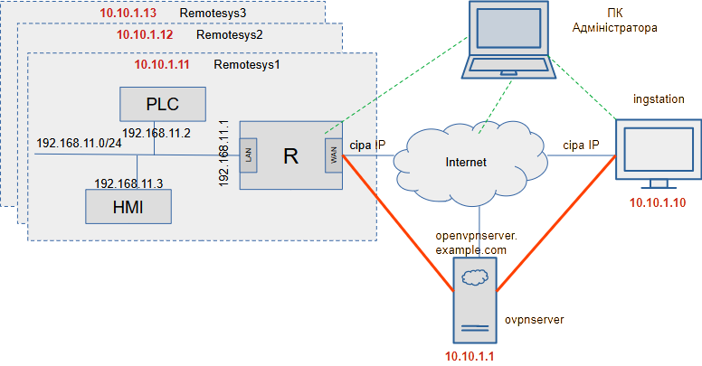

[<- До підрозділу](README.md)

# OpenVPN: теоретична частина

## 1. Загальні поняття

OpenVPN — це одне з рішень віртуальної приватної мережі ([VPN](teor.md)), який був розроблений Джеймсом Йонаном і є вільним програмним забезпеченням, випущеним згідно з умовами GNU General Public License версії 2 (GPLv2). На сьогодні доступні як версія [community edition](https://openvpn.net/community/) (яка є безкоштовною версією з відкритим кодом) так і комерційні рішення. До останніх відносяться OpenVPN Access Server (OpenVPN-AS), яка базується на версії Community Edition, але надає додаткові платні та власні функції, такі як інтеграція LDAP, SMB-сервер, керування веб-інтерфейсом користувача, а також надає набір інструментів встановлення та налаштування, які, як повідомляється, спрощують швидке розгортання рішення віддаленого доступу до VPN. 

Надалі програмне або програмно-апаратне забезпечення, що реалізує OpenVPN будемо називати **службами OpenVPN**. Служби OpenVPN розроблено для більшості популярних десктопних операційних систем (Linux, Unix, Windows, MacOS) та вбудовано в кілька спеціалізованих систем для комунікаційних засобів (DD-WRT, SoftEther VPN та інші). Таким чином це одне з найпоширеніших рішень в області VPN. 

OpenVPN також реалізовано в мікропрограмі маршрутизаторів деяких виробників або загальнодоступних прошивок (типу DD-WRT), що дозволяє користувачам запускати OpenVPN у режимі клієнта або сервера зі своїх мережних маршрутизаторів. Наприклад, маршрутизатор, на якому працює OpenVPN у режимі клієнта, дозволяє будь-якому пристрою в мережі отримувати доступ до VPN без необхідності встановлення OpenVPN на самому кінцевому пристрої. 

OpenVPN може використовуватися як для створення безпечних з’єднань типу «точка-точка» так і «сайт-сайт». При цьому тунелювання може забезпечуватися як на рівні 3 пакетів IP (режим TUN) так і на рівні 2 кадрів (режим TAP).  

OpenVPN підтримує кілька механізмів автентифікації:

- попередньо створених секретних ключів
- з використанням сертифікатів та інфраструктури PKI
- через ім'я користувача та пароль 

Для шифрування трафіку в тунелі використовується бібліотека шифрування OpenSSL, а також протокол TLS, і міститься багато функцій безпеки та керування. OpenVPN використовує спеціальний протокол безпеки, який базується на SSL/TLS для обміну ключами. 

У загальному процес налаштування та запуску OpenVPN проходить в такому порядку: 

1) Проектується система, визначаються:
   - необхідні кінцеві пристрої на яких мають працювати служби OpenVPN, які забезпечують зв'язок між собою через тунелі,
   - означуються необхідні мережі та пристрої, які входять в приватну мережу
   - означується архітектура інфраструктури приватних ключів PKI, якщо вона передбачається  

2) На мережні вузли з тунелями встановлюються служби OpenVPN. 

3) На вузли PKI встановлюється необхідне ПЗ.

4) Генеруються необхідні файли сертифікатів та ключів.

5) Створюються файли конфігурацій для всіх служб OpenVPN, служби запускаються в роботу.       

## 2. Контекст для розгляду OpenVPN 

У даній лекції ми не будемо розглядати усі нюанси використання OpenVPN, натомість зупинимося на одному з застосувань VPN в промисловій автоматизації. Це ж рішення імплементується через послідовність дій, яка наводиться в [практичному занятті](lab.md), тут більше зупинимося на теоретичних аспектах та тлумаченні команд.

У якості завдання на рис.1 показано структуру цільової системи для віддаленого налагодження об'єктів автоматизації. Рішення з використанням OpenVPN  повинно забезпечити доступ віддаленої станції `Інженерна станція` до мережі будь якого з об'єктів віддаленої підсистеми за необхідності. Передбачається що доступ до мережі клієнта відбуватиметься через маршрутизатор (позначено як `R`), який буде маршрутизувати весь клієнтський трафік через Internet до інженерної станції і у зворотній бік. На схемі не показана вся необхідна інфраструктура, а тільки загальна постановка завдання, структура рішення з OpenVPN  показана на рис.6 і описується в кінці лекції.    


рис.1. Структура для прикладу розгляду OpenVPN, як рішення для віддаленого налагодження об'єктів автоматизації 

## 3. Функціонування

### Тунелі та кінцеві точки

Як вже зазначалося в лекції про [VPN](teor.md) віртуальні приватні мережі базуються на концепціях **тунелів** (рис.2) які з'єднують **кінцеві точки** (endpoints) між собою. VPN BOX на рис.2 є службами OpenVPN, які представляють ці кінцеві точки. Нижче розглянемо який саме мережний трафік передається, які протоколи є носієм цього трафіку в середині тунелю та як відбувається захист цього трафіку в OpenVPN. 


рис.2. Тунель між двома VPN вузлами поєднані Internet

Між кінцевими точками по тунелю йдуть по факту два трафіки: 

- **трафік керування**, який відповідає за запуск, підтримку з’єднання, обмін службовими повідомленнями та контроль стану тунелю; канал керування використовується переважно під час запуску VPN-з’єднання, а також для обміну новим матеріалом ключа шифрування через певний період (на основі параметрів `--reneg-sec`, `--reneg-bytes` або `--reneg-pkts`).
- і **трафік даних**, що переносить основний корисний трафік користувача, наприклад, IP-пакети, файли або інші мережеві дані. 

Відповідно кажуть про два віртуальні канали обміну, винятком є старіший режим «точка-точка» зі спільним ключем, у якому використовується лише один канал - даних. 

### Мережа

OpenVPN пропонує два типи інтерфейсів для роботи в мережі: IP-тунель рівня 3 (TUN), або Ethernet-тунель рівня 2 (TAP). В режимі TUN кінцеві точки будуть передавати по тунелю IP-пакети, а в TAP - Ethernet кадри. Детально про варіанти тунелювання TUN/TAP описано в лекції про [VPN](teor.md). 

Концепція драйвера tun/tap походить зі світу Unix/Linux, де він часто доступний як частина операційної системи. Це віртуальний мережний адаптер, який операційна система сприймає як адаптер «точка-точка» (у стилі tun) лише для IP-трафіку, або як повний віртуальний адаптер Ethernet для всіх типів трафіку (у стилі tap). На базі цього адаптера і працюють такі програми як OpenVPN, які обробляють вхідний та вихідний трафік з адаптера (рис.3). 


рис.3. Адаптер tun/tap в ядрі ОС Linux. 

На рис. 3 показано потік трафіку від програми користувача на адресу, доступну через тунель OpenVPN. Кроки такі:

1. Програма передає пакет операційній системі.
2. ОС вирішує за допомогою звичайних правил маршрутизації, що пакет має бути маршрутизований через VPN.
3. Потім пакет пересилається на пристрій `tun` рівня ядра (показано як `tun0`).
4. Пристрій `tun` пересилає пакети до процесу OpenVPN (у просторі користувача).
5. Процес OpenVPN шифрує та підписує пакет, фрагментує його, якщо необхідно, а потім знову передає ядру для надсилання на адресу віддаленої кінцевої точки VPN.
6. Ядро збирає зашифрований пакет і пересилає його на віддалену кінцеву точку VPN, де той самий процес відбувається у зворотному порядку.

З рис.3. також видно, що продуктивність OpenVPN завжди буде нижчою, ніж продуктивність звичайного мережного підключення. Для більшості програм втрата продуктивності мінімальна тому прийнятна. Однак для швидкостей, що перевищують 1 ГБ/с, в такому обміні продуктивність буде значно нижчою, як з точки зору пропускної здатності, так і з точки затримок. 

Слід зазначити, що продуктивність драйвера Windows буде набагато нижчою, ніж продуктивність власних адаптерів `tun/tap` в інших операційних системах. Для одного клієнта OpenVPN це буде не сильно відрізнятися, однак для великомасштабного сервера OpenVPN, який обслуговує багато клієнтів, це може стати проблемою. Це одна з головних причин, чому рекомендується використовувати хост на базі Unix/Linux в якості сервера OpenVPN.

### Транспортний протокол в тунелі

Незалежно від того, чи використовується режим TUN чи TAP, при конфігурації можна вибрати який саме транспортний протокол буде використовуватися для обміну даними між кінцевими точками по тунелю. Наразі (версія 2.6) OpenVPN підтримує два способи зв’язку по тунелю: за допомогою пакетів UDP або за допомогою пакетів TCP. 

Детально про TCP та UDP ви можете прочитати в лекції [Основи протоколів TCP та UDP](../tcpudp/teor.md), тут тільки коротко нагадаємо. UDP - це простий протокол без встановлення з’єднання, який просто інкапсулює дані які необхідно передавати конкретному сервісу без контролю доставки, фрагментування, гарантування послідовності і т.п. TCP в противагу до UDP навпаки є надійним протоколом передачі даних, що передбачає встановлення з'єднання, контроль доставки, сегментування даних і т.д. Але така надійність обходиться додатковими витратами на ресурси та збільшення службового трафіку, а отже сповільнення передачі корисних даних. Таким чином обидва способи спілкування: UDP - швидкий і ненадійний (тобто не контролює а просто переносить дані як може), а TCP - надійний але повільніший. 

Визначення найкращого режиму зв’язку залежить від типу трафіку, який надсилається через тунель VPN:

- Якщо застосунки, що спілкуються між собою в приватній мережі через тунель, використовують здебільшого протокол TCP, то саме вони можуть контролювати обмін, тому втрати UDP-пакетів, які переносять трафік з TCP-пакетами не мають сенсу. Якщо ж при цьому в тунелі буде використовуватися TCP, то це буде в два рази зменшувати продуктивність особливо при поганій якості зв'язку.      
- Можна так само стверджувати, що надсилання UDP за допомогою UDP також не є гарною ідеєю. Якщо ж програма, яка використовує для свого трафіку UDP чутлива до видалення повідомлень або перевпорядкування пакетів, то базове зашифроване з’єднання TCP підвищить безпеку таких програм навіть більше, ніж базова VPN на основі UDP. Якщо основна частина трафіку через VPN базується на UDP, то між кінцевими точками VPN іноді краще використовувати з’єднання TCP.

Вибираючи між транспортом UDP або TCP, загальне емпіричне правило таке: якщо підходить UDP (режим udp) то треба використовувати його, якщо режим показує погану роботу (велика втрата пакетів) то можна спробувати TCP (режим tcp-сервер і режим tcp-клієнт). Деякі комутатори та маршрутизатори неправильно пересилають трафік UDP, що може також стати проблемою, особливо якщо до одного комутатора чи маршрутизатора підключено кілька клієнтів OpenVPN. Так само на продуктивність OpenVPN через TCP може серйозно вплинути вибір Інтернет-провайдерів (ISP): деякі Інтернет-провайдери використовують нетипові розміри MTU або правила фрагментації пакетів, що призводить до надзвичайно низької продуктивності OpenVPN через TCP порівняно з незашифрованим трафіком TCP.

### Мережний протокол в тунелі

У якості мережного протоколу в середині тунелю, OpenVPN може використовувати як IPv4 так і IPv6 (з версії 2.3.x). Він має здатність працювати через більшість проксі-серверів (включно з HTTP) і добре працює через трансляцію мережевих адрес (NAT) і виходить через брандмауери. 

### Шифрування

В OpenVPN шифрування забезпечує захист як службового, так і користувацького трафіку по тунелю. Шифрування та автентифікація (підписання) для каналу керування та каналу даних визначаються по-різному:

1. Шифрування каналу керування (Control Channel Encryption). Використовується для аутентифікації, обміну ключами та керування сесією. Для шифрування використовується протокол TLS та бібліотека OpenSSL (або `mbedTLS` - апаратний прискорювач). Під час ініціалізації каналу керування шифр і алгоритм хешування узгоджуються між клієнтом і сервером. Можливі алгоритми:

   - RSA або ECDSA для аутентифікації

   - Diffie-Hellman або ECDH для обміну ключами

   - HMAC для перевірки цілісності (наприклад, `tls-auth` або `tls-crypt`)

2. Шифрування каналу даних (Data Channel Encryption). Використовується для захисту основного трафіку VPN, що переносить дані вірутальної приватної мережі. Для шифрування використовується протокол OpenVPN власний (не TLS) і бібліотека OpenSSL. Алгоритми шифрування:
   - AES (128 або 256 біт) у режимі CBC або GCM (GCM забезпечує одночасно шифрування і перевірку цілісності)
   - ChaCha20-Poly1305 (ефективний на пристроях із низькою продуктивністю)

Вибір алгоритмів залежить від потреб у швидкодії та рівні безпеки. Для сучасних систем рекомендується AES-GCM або ChaCha20-Poly1305 у поєднанні з TLS 1.3.

Те як OpenVPN використовує TLS, відрізняється від того, як його використовує веб-браузер. Таким чином, коли OpenVPN запускається через TCP (використання порту 443 є звичайним методом ухилення від брандмауерів), трафік можна відрізнити від звичайного трафіку TLS. Брандмауер, який використовує Deep Packet Inspection (DPI), може легко фільтрувати трафік OpenVPN. Основна відмінність між OpenVPN-TLS і browser-TLS полягає в тому, як пакети підписуються. OpenVPN пропонує функції захисту від DoS-атак шляхом підписання пакетів каналу керування за допомогою спеціального статичного ключа (--tls-auth ta.key 0|1). Пакети каналу даних, які надсилаються через те саме з’єднання UDP або TCP, підписуються абсолютно по-різному, і їх дуже легко відрізнити від трафіку HTTPS. 

Принцип шифрування трафіку на пакетах показана на рис.4.


рис.4. Стан пакета під час подорожі всередині локальної мережі та VPN в режимі TAP (на рівні кадрів L2)

### Автентифікація

Автентифікація в OpenVPN — це процес підтвердження особи або пристрою, який підключається до мережі, щоб гарантувати, що з'єднання встановлюється тільки між довіреними сторонами. OpenVPN має кілька способів автентифікації однорангових користувачів один з одним. 

1. Сертифікатна автентифікація (X.509). Для підтвердження особи використовуються SSL/TLS-сертифікати. Сулжби OpenVPN обмінюються сертифікатами, підписаними центром сертифікації (CA). Вважається найбільш надійним та багатофункціональним. 
2. Автентифікація за логіном і паролем (Static Credentials). Сервер (до кого підключаються) перевіряє файл із обліковими даними або використовує зовнішню систему (наприклад, PAM). 
3. Гібридна автентифікація (сертифікат + логін/пароль)
4. Автентифікація на основі спільного ключа (PSK). Сервер і клієнт мають однаковий ключ (`static.key`), який відправляється в якості підтвердження дозволу при підключенні. Є самим простим способом автентифікації.  

В OpenVPN автентифікація тісно пов'язана з шифруванням. Автентифікація (через TLS) також використовується для безпечного обміну ключами, які потім використовуються для шифрування трафіку. Без автентифікації шифрування було б вразливим до атак типу «людина посередині» (MITM).

### Моделі розгортання (режими підключення)

У OpenVPN виділяють два основних режими роботи стосовно логіки підключення:

- Point-to-Point Mode.
- Client-Server Mode. 

Режим **Point-to-Point** (точка-точка) передбачає зв'язок між двома кінцевими точками, в якому тунель функціонує тільки для обміну даними двох сторін: хост-хост, хост-сайт або сайт-сайт. OpenVPN налаштовується за допомогою попередньо наданих секретних ключів для попередньо означених кінцевих точок. До одного езкземпляру сервера одночасно може підключитися тільки одна кінцева точка . Термін «сервер» досить умовний, оскільки обидві кінцеві точки більш-менш однакові, коли йдеться про функціональність. Кінцева точка, яка ініціює підключення, вважається клієнтом, інша кінцева точка – сервером. Така конфігурація має досить великі обмеження, коли необхідно об'єднати в єдину систему кілька сайтів або віддалених хостів, оскільки це передбачає окреме попарне з'єднання між точками на всіх службах OpenVPN. На рис.5 показаний приклад такої конфігурації для трьох сайтів.  


рис.5. З'єднання в мережу трьох сайтів через P2P.  

У режимі **Client-Server ** сервер є єдиним процесом OpenVPN, до якого можуть підключитися кілька клієнтів. Кожному автентифікованому та авторизованому клієнту призначається IP-адреса з пулу IP-адрес, якими керує сервер OpenVPN. Клієнти не можуть безпосередньо спілкуватися один з одним. Весь трафік проходить через сервер, що має як переваги, так і недоліки.

Переваги наступні:

- Контроль: адміністратор VPN-сервера може контролювати, якому трафіку дозволено перетікати між клієнтами. За замовчуванням трафік між клієнтами не дозволяється. Однак, використовуючи опцію OpenVPN `client-to-client` або використовуючи розумний брандмауер і правила маршрутизації, можна дозволити клієнтам спілкуватися один з одним.

- Простота розгортання: Набагато легше налаштувати єдиний сервер, до якого може бути доступ багатьом клієнтам, ніж забезпечити з’єднання між безліччю клієнтів, кожен із власною мережею та конфігураціями брандмауера.

Недоліки наступні:

- Масштабованість: оскільки весь трафік переходить від клієнта до сервера (і навпаки), сервер може швидко стати вузьким місцем у великомасштабних налаштуваннях VPN.

- Продуктивність: оскільки весь трафік між двома клієнтами (клієнтами A та B) має надходити від клієнта A до сервера, а потім від сервера до клієнта B, продуктивність цього типу VPN завжди буде нижчою порівняно з прямим підключенням `client-to-client`.

Найпоширенішим сценарієм розгортання для цього режиму є сервер OpenVPN на корпоративному сайті, до якого підключаються різні клієнти VPN. Серед клієнтів можуть бути супутникові офіси, дорожні воїни, люди, які працюють вдома, а також користувачі смартфонів і планшетів. Ця модель розгортання покриває 95 відсотків типових вимог для VPN і є кращою перед більш складними налаштуваннями з використанням розширених функцій, таких як `bridging`. Ця модель розгортання буде недостатньою лише за наявності певних вимог до маршрутизації не-IP-трафіку (наприклад, застарілого IPX-трафіку) або якщо є потреба сформувати єдиний широкомовний домен мережі.

Надалі в лекції будемо розглядати тільки модель розгортання `client-server` з режимом `tun` .

## 4. Встановлення та налаштування

ПЗ для для служб OpenVPN comunity deition доступне для завантаження на https://openvpn.net/community-downloads/.  

### Встановлення та робота на Debian

Деталі встановлення та запуску служб OpenVPN на Debian описано [цій статті](openvpndebian.md). Пакунок є в репозиторіях тому встановлюється як зазвичай

```
sudo apt update
sudo apt-get install openvpn
```

Якщо використовується графічна оболонка GNOME то можна встановити пакунок `network-manager-openvpn-gnome` для керування з робочого столу. Надалі будемо вважати що все керування та конфігурування відбувається через командний рядок.

Керування службою openvpn проводиться через вказівку опцій. Їх можна задавати з командного рядку, але враховуючи їх велику кількість і складність зручніше використовувати командний файл. При запуску з командного рядку кожен параметр (опція) можна вказати за допомогою такої команди:

```
openvpn --<деяка_опція1> <аргументи_опції1> --<деяка_опція2> <аргументи_опції2> ...
```

Так само ці параметри можна вказати у файлі конфігурації в окремому рядку за допомогою `<деяка_опція> <аргумент_опції>`, тобто видалити два тире перед аргументом командного рядка. Файл конфігурації вказується в командному рядку запуску служби за допомогою параметра `--config <path>`. Майже всі параметри, указані у файлі конфігурації, обробляються так, ніби вони були вказані в командному рядку. Також можна змішувати конфігураційні файли та аргументи командного рядка. Це полегшує збереження часто використовуваних параметрів у файлі конфігурації, який можна змінити за допомогою аргументів командного рядка. Однак не всі параметри конфігурації можна змінити, а деякі параметри можна вказати кілька разів (зокрема, `remote <remote-host>`). 

Для прикладу, якщо цей конфігураційний файл зберігається як `server.conf`, тоді команда для запуску служби буде виглядати так:

```
openvpn --server.conf
```

Зауважте, що порядок аргументів командного рядка важливий. Усі параметри, указані перед параметром `--config <шлях>`, замінюються параметрами, указаними у файлі конфігурації. Усі параметри, вказані після параметра `-- config option`, мають перевагу над параметрами у файлі конфігурації (за кількома винятками, як зазначено раніше).

Конфігураційні файли як і інші файли що потребуються для служби прийнято зберігати в  папці `/etc/openvpn/`. У цій папці також будуть міститися інші файли потрібні для роботи, зокрема файли сертифікатів та приватних ключів.

Враховуючи що при запуску служби вказується конкретний конфігураційний файл, в одній ОС можуть працювати одночасно кілька екземплярів служб openvpn, а отже функціонувати кілька тунелей для реалізації кількох приватних мереж.  

Службу openvpn можна запускати різним чином: як процес клієнта, як демон (керується з openvpn) як сервіс Systemd (керується менеджером Systemd) також у вигляді контейнера (наприклад, Docker) або вручну з командного рядка для тестування і налагодження. Це дає гнучкість у налаштуванні залежно від потреб і середовища розгортання. 

Таким чином на пристроях з ОС Debian налаштування здебільшого проводиться через конфігураційні файли які при запуску служби вказуються в якості аргументів. 

Окрім служби openvpn на пристрої можуть знадобитися інші служби, наприклад для роботи з PKI, які будуть розглянуті нижче. 

### Встановлення та робота на Windows

Встановлення служби openvpn на Windows не відрізняється від встановлення інших програм - [зі сторінки завантаження](https://openvpn.net/community-downloads/) завантажується файл `*.msi` і встановлюється на ОС. 

Як зазначено вище, хоч openwpn може виконуватися на Windows в режимі серверу, це не рекомендується. 

Для запуску підключень OpenVPN у вас є два основні варіанти:

- OpenVPN GUI - доступний як аплет tray
- OpenVPNService - системний сервіс, не встановлюється за замовченням 

Графічний інтерфейс OpenVPN GUI використовується для запуску VPN-з’єднань на вимогу. У противагу йому OpenVPNService запускає всі конфігурації в config-auto під час завантаження та має використовуватися для постійних з’єднань OpenVPN, які не прив’язані до жодного конкретного сеансу користувача. 

Для розміщення конфігураційних файлів та файлів ключів/сертифікатів передбачено один з каталогів конфігурації OpenVPN:

    C:\Program Files\OpenVPN\config (global configs)
    C:\Program Files\OpenVPN\config-auto (autostarted global configs)
    %USERPROFILE%\OpenVPN\config (per-user configs)

- `C:\Program Files\OpenVPN\config` або його підкаталоги повинні містити конфігураційні файли OpenVPN, кожен із яких має розширення `.ovpn`. Коли запускається OpenVPN GUI, конфігураційні файли в цьому каталозі та його підкаталогах додаються до списку доступних підключень.

- `C:\Program Files\OpenVPN\config-auto` або його підкаталоги мають містити конфігураційні файли OpenVPN, кожен із яких має розширення `.ovpn`, які мають автоматично запускатися під час завантаження. Після запуску OpenVPNService для кожного файлу конфігурації буде створено окремий процес OpenVPN. Графічний інтерфейс OpenVPN сканує цей каталог і його підкаталоги на наявність файлів конфігурації та перераховує їх у меню «Persistent Profiles», якщо цю функцію не вимкнено. Якщо OpenVPN PLAP dll зареєстровано, ці конфігурації також доступні з екрана входу для «Почати перед входом».
- `%USERPROFILE%\OpenVPN\config` аналогічно `C:\Program Files\OpenVPN\config` але призначено для конкретного користувача Windows.

Кожна папка може містити більше ніж один файл `.ovpn`. У цьому випадку можливо використовувати кілька конфігурацій і кілька тунелів.

Для запуску служби через OpenVPN GUI, використовується контекстне меню відповідної піктограми на робочому столі або панелі tray. Якщо доступні кілька конфігурацій (кілька файлів `.ovpn`) то можна вибрати яку саме треба запускати.  Для запуску з’єднань OpenVPN за допомогою файлів конфігурації, що зберігаються в глобальному каталозі конфігурації не потрібні права адміністратора. 

Користувачі, які належать до вбудованої групи адміністраторів або до локальної групи «Адміністратор OpenVPN», також можуть зберігати файли конфігурації в `%USERPROFILE%\OpenVPN\config`.  В обох цих випадках має бути запущено `OpenVPN Interactive Service`: якщо це не так, для успішного запуску підключень OpenVPN все одно потрібні права адміністратора. Для отримання додаткової інформації зверніться до документації OpenVPN GUI: https://github.com/OpenVPN/openvpn-gui

OpenVPN 2.5 і новіші версії постачаються в комплекті з двома системними службами:

- `OpenVPNService` - сервіс, не встановлюється за замовченням 
- `OpenVPNServiceInteractive` - потребується для запуску GUI без прав адміністратора

Інсталятор автоматично запускає `OpenVPNServiceInteractive` і налаштовує його на запуск під час запуску системи. Це робиться для того, щоб непривілейовані користувачі могли запускати підключення OpenVPN за допомогою графічного інтерфейсу OpenVPN без будь-яких додаткових налаштувань. `OpenVPNService` базується на `openvpnserv2`, повністю переписаній оболонці служби OpenVPN. Він призначений для запуску екземплярів OpenVPN, які повинні бути активними в будь-який час, а не запускатися користувачем вручну. `OpenVPNService` може перезапустити окремі процеси OpenVPN у разі їх збою, а також працює належним чином у останніх версіях Windows.

## 5. Сертифікати і PKI  

### Автентифікація через сертифікати

Для автентифікації клієнта та сервера та шифрування трафіку у OpenVPN зазвичай використовують сертифікати X.509. Сертифікат X.509 — це стандартний формат для цифрових сертифікатів, що використовується для автентифікації особистостей і захисту даних у криптографічних протоколах, таких як TLS/OpenVPN. Він містить наступну інформацію:

- Публічний ключ: ключ для шифрування даних або перевірки цифрового підпису.
- Інформація про власника сертифікату: ім’я (CN), організація, країна тощо.
- Інформація про видавця (CA): хто підписав даний сертифікат.
- Термін дії сертифікату: дата початку і закінчення дії сертифіката.
- Серійний номер: унікальний ідентифікатор сертифіката.
- Цифровий підпис CA: підтвердження справжності сертифіката.
- Розширення: додаткові атрибути, наприклад, для VPN — параметри використання ключа.

Це текстовий файл що має розширення `.crt`  в має вигляд як показано нижче. 

```
Certificate:
    Data:
        Version: 3 (0x2)
        Serial Number:
            e1:17:5a:76:bc:95:be:ce:a6:d7:61:e3:bb:da:15:ea
        Signature Algorithm: sha256WithRSAEncryption
        Issuer: CN=pkiservercloud
        Validity
            Not Before: Feb  3 12:11:54 2025 GMT
            Not After : May  9 12:11:54 2027 GMT
        Subject: CN=rostersys1
        Subject Public Key Info:
            Public Key Algorithm: rsaEncryption
                Public-Key: (2048 bit)
                Modulus:
                    00:a2:97:c3:f8:2d:8f:22:46:58:61:32:57:48:da:
                    ...
    Signature Algorithm: sha256WithRSAEncryption
    Signature Value:
        10:62:87:b3:4f:10:e0:fe:91:dc:f1:d1:d0:02:a9:3b:a5:48:
        ...
        2a:61:3f:b2
-----BEGIN CERTIFICATE-----
MIIDXzCCAkegAwIBAgIRAOEXWna8lb7Optdh47vaFeowDQYJKoZIhvcNAQELBQAw
...
YT+y
-----END CERTIFICATE-----
```

Отже, сертифікат має кілька функцій:

1. Автентифікація — підтверджує справжність особи або пристрою, наприклад, сервера чи клієнта в OpenVPN.
2. Шифрування — забезпечує безпечний обмін даними, дозволяючи шифрувати інформацію для конкретного отримувача.
3. Цілісність — гарантує, що дані сертифіката не були змінені завдяки цифровому підпису CA.
4. Керування довірою — дозволяє встановити довірчі відносини між різними сторонами через ієрархію сертифікаційних центрів.
5. Контроль доступу — обмежує або дозволяє доступ до систем на основі довірених сертифікатів.

Детально про сертифікацію і шифрування можна почитати в темі [Керування ідентифікацією і доступом](../security/teor.md).

Для довіри до сертифікату, він підписується центром сертифікації CA (Certificate Authority). Підписується, це значить що CA створює цифровий підпис, який додається до сертифіката, використовуючи свій приватний ключ. Цей підпис генерується шляхом обчислення хешу (контрольної суми) від вмісту сертифіката та його шифрування приватним ключем CA. Під час перевірки сертифіката інша сторона розшифровує підпис за допомогою публічного ключа CA (який доступний всім учаснкам) та порівнює хеші. Якщо хеші співпадають, то сертифікат вважається справжнім і неушкодженим. 

Публічний ключ CA є частиною сертифіката `ca.crt` який є єдиними самопідписаним сертифікатом, якому всі довіряють. Тому він повинен знаходитися на всіх вузлах зі службами OpenVPN які хочуть комунікувати між собою або бути доступний на довірених вузлах.   

Таким чином усім учасникам зв'язку необхідно мати або отримати:

- сертифікат CA `ca.crt`, якому довіряють усі
- сертифікат партнера, підписаний CA
- власний сертифікат, підписаний CA
- власний приватний ключ (`*.key`), за допомогою якого створюється цифровий підпис свого сертифікату

### PKI

Для забезпечення керування цифровими сертифікатами та криптографічними ключами для захисту даних і автентифікації використовується інфраструктура публічних ключів  **PKI** (Public Key Infrastructure). Основні компоненти PKI:

- CA (Certificate Authority) — центр сертифікації, який видає та підписує сертифікати.
- RA (Registration Authority) — реєстраційний орган, що перевіряє особу перед видачею сертифіката (іноді об'єднаний із CA).
- Сертифікати (X.509) — цифрові документи, які підтверджують справжність публічного ключа.
- Пари ключів:
  - Публічний ключ — доступний усім, використовується для шифрування або перевірки підпису.
  - Приватний ключ — тримається в секреті, використовується для дешифрування або створення підпису.
- CRL (Certificate Revocation List) — список відкликаних сертифікатів.
- OCSP (Online Certificate Status Protocol) — протокол для перевірки статусу сертифіката в реальному часі.

PKI працює наступним чином:

- Створення CA: генерується пара ключів і самопідписаний сертифікат CA.
- Видача сертифіката: користувач генерує запит (CSR), CA підписує його, створюючи сертифікат.
- Автентифікація: під час з'єднання одна сторона перевіряє сертифікат іншої через довірений CA.
- Перевірка статусу: перевіряється, чи сертифікат не відкликано (CRL/OCSP).

PKI для середніх і великих систем, як правило, є ієрархічною організацією з кількома мережними вузлами з відповідними службами. Ця ієрархія передбачає наявність не тільки кореневого сертифікату CA але проміжні CA, сертифікати яких підписані кореневим, і можуть підписувати інші сертифікати. Це добре функціонує в Інтернеті, наприклад для HTTPS, навіть без розуміння механізму кінцевими користувачами. Однак в OpenVPN це приводить до необхідності ручного налаштування. Нові користувачі OpenVPN і будь-якого програмного забезпечення, яке потребує PKI, стикаються з перешкодою в налаштуванні та керуванні — як концептуально, так і технічно. У випадку загальнодоступних веб-сайтів необхідна перевірка сайту третьої сторони довіреним органом. Однак у контексті OpenVPN, як правило, в організації існує єдина сутність, якій довіряють, – ІТ-відділ. OpenVPN зазвичай використовується в одній організації, і довіра до них є невід’ємною частиною. Щоб допомогти новачкам і досвідченим користувачам краще керувати PKI були написані Easy-RSA та ssl-admin. 

З єдиним зв’язком "point-to-point" часто немає сенсу залучати складність PKI для захисту тунелю; достатньо спільних ключів. Однак, коли задіяно багато користувачів, існує набагато більше шансів на втрату та крадіжку ключів і плинність кадрів. З належним чином налаштованим PKI відносно просто відкликати втрачений сертифікат або сертифікат працівника, який звільняється. Новий так само легко створити та повторно розгорнути.

У межах наведеного вище контексту ми будемо розглядати простий приклад, в якому сертифікати будуть створюватися на сервері OpenVPN і копіюватися вручну на клієнтські пристрої. Таким чином CA і сервер будуть знаходитися на одному і тому ж пристрої.

### PKI з використанням Easy-RSA

Для генерування та інших дій з сертифікатами використовується двійковий файл OpenSSL, який містить усі інструменти, необхідні для ручного керування PKI. Але параметри цих команд складні, і, якщо вони не автоматизовані, можуть бути схильні до помилок. Організаціям або окремим особам рекомендується використовувати сценарій або інший пакет для керування PKI. Це не тільки обмежує кількість помилок, але й краще дотримується правил та інших загальних критеріїв. 

Існують два проекти з відкритим вихідним кодом, які чітко розроблені для того, щоб добре працювати з реалізаціями OpenVPN. 

- `Easy-RSA` 
- `ssl-admin`

У лабораторній роботі використовується Easy-RSA, тому тут коротко зупинимося на основних моментах.

#### Завантаження та ініціювання Easy-RSA PKI

Пакет необхідно завантажити та розпакувати, наприклад:

```
wget https://github.com/OpenVPN/easy-rsa/releases/download/v3.2.2/EasyRSA-3.2.2.tgz
tar -xzvf EasyRSA-3.2.2.tgz
```

У розпаковані паці міститься `vars.example`, який необхідно скопіювати для використання його в якості прототипу файлу налаштувань для PKI і змінити зміст наприклад через редактор `nano`. Багато рядків містять символ коментару `#` для зручностізміни тієї чи іншої змінної що має значення за замовченням.

По перше, рекомендується змінити робочий каталог Easy-RSA, тому вказати в змінній `EASYRSA` наприклад `/usr/local/etc/easy-rsa`. Також варто встановити організаційні поля, наприклад:

```
set_var EASYRSA_REQ_COUNTRY	"UA"
set_var EASYRSA_REQ_PROVINCE	"Kyiv"
set_var EASYRSA_REQ_CITY	"Kyiv"
set_var EASYRSA_REQ_ORG	"myorg"
set_var EASYRSA_REQ_EMAIL	"mymail@ukr.net"
set_var EASYRSA_REQ_OU		"myOU"
```

Значення використовуються як стандартні для всіх згенерованих запитів на сертифікати, включаючи кореневий CA. Переконайтеся, що ці рядки у файлі розкоментовані.  Ніяких інших змін до змінних не потрібно.

Далі створюється вказана робоча папка і копіюються туди файл `openssl-easyrsa.cnf` та папка `x509-types`, які йдуть в пакунку. 

Після цього необхідні ініціювати Easy-RSA PKI:

```
sudo ./easyrsa init-pki
```

Процес ініціалізації очищає вміст, у цьому випадку, каталогу `pki`, і створює підкаталоги `private` і `reqs`. Можна мати кілька файлів `vars` для керування декількома центрами сертифікації, і всі вони вкладені в той самий кореневий каталог `EASYRSA`. Для цього потрібно змінити змінну `EASYRSA_PKI` для кожного CA.

#### Створення сертифікату CA

Спочатку створюється сертифікат CA, який буде доступний усім учасникам і використовуватиметься для перевірки підпису інших сертифікатів. Окрім цього створюється приватний ключ CA. 

Щоб створити пару сертифікат/ключ кореневого центру сертифікації, використовується команда `build-ca`. При створенні необхідно буде ввести інформацію, яка буде включена у запит на сертифікат, основне це `Common Name` , який зазвичай описує сам центр сертифікації. У полі `Common Name` не можна використовувати пробіли. Далі вказується секретна фраза `CA Key Passphrase` яку треба запам'ятати, так як вона буде надалі використовуватися при підписуванні інших сертифікатів.   

#### Список відкликаних сертифікатів (CRL)

Підкоманда `gen-crl` генерує CRL (Список відкликаних сертифікатів). Рекомендується заздалегідь створити порожній CRL, це дає змогу налаштувати конфігурацію OpenVPN із файлом і не потребуватиме перезапуску пізніше. OpenVPN реєструватиме помилки, якщо в його конфігурації вказано неіснуючий CRL, але файл можна замінити на льоту, оскільки він перечитується під час кожного підключення клієнта.

#### Серверні та клієнтські сертифікати

Easy-RSA підтримує підписання сертифікатів за допомогою параметра використання ключа сервера за допомогою підкоманди `build-server-full`. При цьому вказується назва серверу, наприклад для екземпляру `ovpnserver`:

```
sudo ./easyrsa build-server-full ovpnserver
```

При цьому також необхідно ввести секретну фразу `PEM pass phrase`, вона використовуватиметься під час запуску служби серверу. 

Аналогічно використовується підкоманда `build-client-full` для створення і підпису сертифікату клієнту, наприклад для віддаленої станції з нашого прикладу це: 

```
sudo ./easyrsa build-client-full remotesys1
```

Для інженерної станції:

```
sudo ./easyrsa build-client-full ingstation
```

У кожному з цих випадків буде сформовано по два файли, що мають назви які вказані в командному рядку та розширення: `.crt`  - публічний сертифікат, `.key` - приватний ключ. Публічний сертифікат як і файл `ca.crt` має бути доступний по обидві сторони тунелю, тоді як приватний ключ тільки у власника сертифікату.

Таким чином після створення і підпису сертифікатів відповідні файли необхідно перемістити у каталоги служб OpenVPN.

Також на сервері необхідно створити файл параметрів Діффі-Хеллмана (DH), який потрібен для ключів сеансу VPN. Сеансові ключі є ефемерними або тимчасовими ключами та генеруються під час першого встановлення з’єднання між клієнтом і сервером. Для забезпечення оптимальної безпеки ефемерні ключі генеруються протягом сеансу через фіксовані проміжки часу. Стандартний інтервал ключа для OpenVPN становить одну годину, але його можна налаштувати за допомогою різних параметрів OpenVPN. 

Щоб створити файл параметрів DH, виконується команди:

```
openssl dhparam -out dh2048.pem 2048
Generating DH parameters, 2048 bit long safe prime, generator 2
This is going to take a long time
........+................................................................
..................................................................+......
```

У цьому прикладі ми вибираємо розмір ключа DH 2048 біт, що є рекомендованим розміром. Ви також можете використовувати більший розмір ключа DH, але це сповільнить початковий процес підключення для кожного клієнта OpenVPN. Тепер ми готові налаштувати та запустити сервер OpenVPN.

## 6. Конфігурування OpenVPN

### Деталізована структура прикладу

Як вже зазначалося, у даній лекції ми розглядаємо тільки один кейс, наведений на рис.1. Згідно цього пропонується наступне рішення на OpenVPN (рис.2):

- конфігурація `client-server` 
- `ovpnserver` - один OpenVPN сервер , який забезпечує функціонування обміну між потрібними приватними мережами, має білу IP адресу та доступний за доменним іменем `openvpnserver.example.com`
- `remotesys1` ... `remotesysn` - OpenVPN клієнти для віддалених систем, мають сірі IP адреси, за NAT
- `ingstation` - OpenVPN клієнт для інженерної станції, мають сірe IP адресу, за NAT



рис.6. Структура рішення на базі OpenVPN

Червоним показані внутрішні IP-адреси кінцевих точок для тунелів. 

Як зазначено вище, налаштування OpenVPN відбувається через вказівку необхідних параметрів в конфігураційних файлах. Для початку зупинимося на основних моментах конфігурування. 

### Топологія

OpenVPN історично підтримує декілька топологій у режимі `tun`, які означуються параметром `topology`:

- `p2p` - наразі майже ніколи не використовується, був перший метод призначення однієї IP-адреси клієнту VPN.
- `net30` - кожному клієнту та серверу призначається блок із чотирьох IP-адрес
- `subnet` - призначати кожному клієнту єдину IP-адресу, що значно полегшує керування великомасштабною VPN

### Спеціальна конфігурація для клієнта - файли CCD

У налаштуваннях, де один сервер може обслуговувати багато клієнтів, іноді необхідно встановити параметри для кожного клієнта, які переважають над глобальними параметрами, або додати додаткові параметри для конкретного клієнта. Опція `client-config-dir` в конфігураційному файлі серверу вказує розміщення файлів **CCD**, в яких адміністратор може вказати конкретні параметри саме для клієнта. Це може бути призначення конкретної IP-адреси клієнту, надіслати певні параметри, такі як сервер DNS, або тимчасово вимкнути клієнта взагалі. Цей параметр також життєво важливий, якщо необхідно спрямувати трафік підмережи зі  сторони клієнта до сторони сервера.

 Файл CCD може містити такі параметри, які аналогічні дії параметрів в загальному cfg файлі:

- `push`: це корисно для надсилання серверів DNS і WINS, маршрутів тощо

- `Push-reset`: це корисно для скасування глобальних параметрів push

- `iroute`: це корисно для маршрутизації клієнтських підмереж IPv4 до сервера

- `iroute-ipv6`: це корисно для маршрутизації клієнтських підмереж IPv6 до сервера

- `ifconfig - push`: це корисно для призначення конкретної адреси IPv4 клієнту

- `ifconfig-ipv6-push`: це корисно для призначення конкретної адреси IPv6 клієнту

- `disable`: це корисно для тимчасового вимкнення клієнта взагалі

- `config`: це корисно для включення іншого файлу конфігурації CCD

Щоб використовувати файли CCD, до конфігураційного файлу `.conf` серверу додається відповідний рядок  наприклад: 

```
client-config-dir /etc/openvpn/movpn/clients
```

Ім’я файлу CCD має мати таку саму назву як суб’єкт сертифіката без розширення.

### Приклад та пояснення налаштування

Усі параметри конфігураційного файлу для версії 2.6 доступні [за посиланням](https://openvpn.net/community-resources/reference-manual-for-openvpn-2-6/#introduction)

#### Налаштування сервера: ovpnserver.cfg та CCD

Зміст конфігураційного файлу сервера `ovpnserver.cfg` а також пояснення параметрів наведений нижче.

```
proto udp
port 1194
dev tun
server 10.10.1.0 255.255.255.0
topology subnet
persist-key
persist-tun
keepalive 10 60
dh /etc/openvpn/movpn/dh2048.pem
ca /etc/openvpn/movpn/ca.crt
cert /etc/openvpn/movpn/ovpnserver.crt
key /etc/openvpn/movpn/ovpnserver.key
client-config-dir /etc/openvpn/movpn/clients
client-to-client
route 192.168.11.0 255.255.255.0 10.10.1.1 
user nobody
group nogroup
verb 3
daemon
askpass 
log-append /var/log/openvpn.log
status /var/run/openvpn.status 3
```

Пояснення

- `proto udp`: даний параметр вказує що протокол буде `udp` , хоча це протокол за замовчуванням, доцільно явно вказати його у файлі конфігурації, щоб уникнути будь-якої плутанини.
- `port 1194`: це локальний порт, який OpenVPN слухатиме. Значення за замовчуванням — `1194`, але можна використовувати будь-який дійсний і доступний номер порту.
- `dev tun`: це означує назву пристрою `tun`, який буде використовуватися для сервера. Не додаючи номер за `tun`, ми наказуємо OpenVPN відкрити новий пристрій `tun`. Цьому новому пристрою буде призначено перший доступний номер у ядрі системи, починаючи з 0 (`tun0`, `tun1`, `tun2` тощо). 
- `server 10.10.1.0 255.255.255.0`: Директива `server` переводить OpenVPN у режим сервера. IP-підмережа та маска підмережі вказують підмережу та маску для використання сервером і клієнтами VPN. Серверу VPN призначається перша адреса, яка в даному випадку `10.10.1.1`. Першому клієнту призначається адреса `10.10.1.2` (оскільки ми використовуємо `topology subnet`).  Однак, якщо ми явно в CCD вказуємо адресу, саме вона буде використовуватися. 
- `topology subnet`: означує топологію для VPN. 
- `persist-tun` і `persist-key`: наказує OpenVPN не відкривати повторно пристрій `tun`, і не генерувати новий матеріал ключа під час перезапуску тунелю. Ці параметри особливо корисні в поєднанні з користувачем `nobody`, оскільки користувач `nobody` зазвичай не має прав доступу для відкриття нового інтерфейсу `tun`.
- `keepalive 10 60`: використовується, щоб переконатися, що з’єднання VPN працює, навіть якщо через тунель не надходить трафік. Інструкція `keepalive` — це макрос для команд `ping` і `ping-restart`. 
- `dh /etc/openvpn/movpn/dh2048.pem`: указує шлях до файлу DH, який потрібен для сервера OpenVPN. Без цього файлу сервер не зможе встановити безпечне TLS-з’єднання з клієнтами. Бажано використовувати абсолютний шлях для цього файлу (а також шляхи інших сертифікатів і закритих ключів).
- `ca /etc/openvpn/movpn/ca.crt`: вказує шлях до файлу CA. Файл CA повинен містити сертифікат CA (або навіть набір сертифікатів), який використовувався для підпису клієнтських сертифікатів. Це не обов’язково має бути той самий CA, який використовувався для підпису сертифіката сервера, хоча в налаштуваннях PKI ми використовували той самий CA. Бажано використовувати абсолютний шлях для цього файлу (а також шляхи інших сертифікатів і закритих ключів).
- `cert /etc/openvpn/movpn/ovpnserver.crt`: указує шлях до файлу публічного сертифіката сервера X.509. Цей сертифікат потрібен серверу OpenVPN, навіть якщо клієнти підключаються без використання сертифікатів. Бажано використовувати абсолютний шлях для цього файлу (а також шляхи інших сертифікатів і закритих ключів).
- `key /etc/openvpn/movpn/ovpnserver.key`:  вказує шлях до файлу приватного ключа сервера. Цей файл закритого ключа потрібен серверу OpenVPN, навіть якщо клієнти підключаються без використання сертифікатів або закритих ключів. Цей файл має бути доступним для читання лише користувачу `root` (або адміністратору), оскільки будь-хто з доступом на читання приватних ключів може розшифрувати трафік OpenVPN. Зауважте, що OpenVPN прочитає цей файл перед тим, як позбутися привілеїв користувача. Бажано використовувати абсолютний шлях для цього файлу (а також шляхи інших сертифікатів і закритих ключів).
- `client-config-dir /etc/openvpn/movpn/clients`: вказує розміщення файлів CCD, в яких адміністратор може вказати конкретні параметри саме для клієнта. 
- `client-to-client`: Оскільки режим сервера OpenVPN обробляє кілька клієнтів через один інтерфейс `tun`, він фактично є маршрутизатором. Цей прапорець повідомляє OpenVPN внутрішньо маршрутизувати трафік клієнт-клієнт, а не надсилати весь трафік, що надходить від клієнта, до інтерфейсу TUN/TAP. Коли використовується цей параметр, кожен клієнт «бачить» інших клієнтів, які наразі підключені. Інакше кожен клієнт бачитиме лише сервер. 
-  `route 192.168.11.0 255.255.255.0 10.10.1.1` додає маршрут до таблиці маршрутизації після встановлення з’єднання. Можна вказати декілька маршрутів. Це вказує що весь трафік мережі `192.168.11.0` треба перенаправлятися на інтерфейс `10.10.1.1`.
- `user nobody` і `group nogroup`: вказує OpenVPN перейти до користувача Unix `nobody` і `group nogroup` після встановлення з’єднання. Це додатково підвищує безпеку, оскільки атака на тунель з меншою вірогідністю призведе до root-експлойту. 
- `verb 3`: це встановлює рівень детальності на значення за замовчуванням 3. Збільште це число, щоб переглянути детальніші результати процесу OpenVPN. Якщо для детальності встановлено значення 0, вихідні дані журналу майже не створюються. 
- `daemon`: повідомляє OpenVPN демонізувати себе, що означає, що процес OpenVPN продовжуватиме працювати навіть після закриття вікна терміналу, у якому було запущено OpenVPN. Альтернативним варіантом є використання менеджера Systemd.
- `askpass` : вказує що необхідно явно ввести пароль сервера перед запуском демона, інакше сервер не зможе автентифікувати користувача що його запускає.
- `log-append /var/log/openvpn.log`: вказує шлях до файлу журналу сервера. Використовуючи `log-append` замість `log`, ми не даємо OpenVPN затирати старі дані в файлі журналу під час кожного його запуску. Для цього файлу також бажано використовувати абсолютний шлях.
- `status /var/run/openvpn.status 3` - файл статусу OpenVPN постійно оновлюється процесом OpenVPN і містить таку інформацію:
  - Які клієнти підключені
  - З якої IP-адреси підключаються клієнти
  - Кількість байтів, отриманих і переданих кожним клієнтом
  - Час підключення клієнта
  - Крім того, таблиця маршрутизації також показує, які мережі маршрутизуються до кожного клієнта

Файл CCD для `ingstation` містить наступну іфнормацію:

```
ifconfig-push 10.10.1.10 255.255.255.0
push "route 192.168.11.0 255.255.255.0 10.10.1.1"
```

- `ifconfig-push 10.10.1.10 255.255.255.0` - надсилає IP віртуальної кінцевої точки  для клієнтського тунелю, замінюючи динамічний розподіл. Таким чином клієнт `ingstation`  отримає IP адресу тунелю `10.10.1.10`
- `push "route 192.168.11.0 255.255.255.0 10.10.1.1"` - надсилає клієнту параметри вказані в лапках. У даному випадку це маршрут для маршрутної таблиці, який вказує що трафік підмережі  `192.168.11.0` буде проходити через маршрутизатор `10.10.1.1`. Таким чином при взаємодії з даною підмережею, служба даного клієнта буде перенаправляти трафік до служби сервера.

Файл CCD для `remotesys1`

```
ifconfig-push 10.10.1.11 255.255.255.0
iroute 192.168.11.0 255.255.255.0
```

- `iroute 192.168.11.0 255.255.255.0` - вказує на те, що підмережа даного клієнта `192.168.11.0` стає доступною в VPN. 

#### Клієнт remotesys1: remotesys1.cfg

Зміст конфігураційного файлу клієнта `remotesys1.cfg` а також пояснення параметрів наведений нижче.

```
client
proto udp
remote openvpnserver.example.com
port 1194
dev tun
nobind
ca ca.crt
cert remotesys1.crt
key remotesys1.key
```

- `client` - переводить OpenVPN у режим клієнта. Він наказує OpenVPN з’єднатися з віддаленим сервером і отримати та обробити параметри конфігурації з сервера після успішного підключення.

- `remote openvpnserver.example.com`:  вказує назву сервера VPN, до якого потрібно підключитися.
- `port 1194`: це порт, який клієнт OpenVPN використовуватиме для підключення до сервера. Значення за замовчуванням — `1194`, але можна використовувати будь-який дійсний і доступний номер порту.

-  `nobind`: вказує клієнту OpenVPN не прив’язуватися до (і не слухати) порту, указаного за допомогою port. Натомість клієнт OpenVPN використовуватиме порт у діапазоні анонімних портів, який зазвичай становить `1024-65335`.

-  `ca <шлях до файлу CA>`: це вказує шлях до файлу CA. Цей файл CA має містити сертифікат CA (або навіть набір сертифікатів), який використовувався для підпису сертифіката сервера. 

-  `cert remotesys1.crt`: указує шлях до файлу загальнодоступного сертифіката X.509 клієнта. 

-  `key remotesys1.key`:  вказує шлях до файлу приватного ключа клієнта.

#### Клієнт ingstation: ingstation.opnvpn

Зміст конфігураційного файлу клієнта `ingstation.opnvpn` аналогічний наведеним вище, однак враховуючи що він використовується для OpenVPN під Windows, то має інше розширення.

```
client
proto udp
remote openvpnserver.example.com 
port 1194
dev tun
nobind
ca ca.crt
cert ingstation.crt
key ingstation.key
```

Зверніть увагу що всі файли сертифікатів та секретних ключів мають знаходитися в тій же папці що і файл `.opnvpn`


## Посилання

Лекція розроблена на основі наступних матеріалів:

- Mastering OpenVPN 2015 Published by Packt Publishing Ltd.
- https://en.wikipedia.org/wiki/OpenVPN
- https://openvpn.net/community-resources/reference-manual-for-openvpn-2-6/
- http://openmaniak.com/openvpn.php


Теоретичне заняття розробили: 

- [Олександр Пупена](https://github.com/pupenasan)
- [Сергій Обрусник](https://www.linkedin.com/in/serhii-obrusnyk-7a2378261/) 


Якщо Ви хочете залишити коментар у Вас є наступні варіанти:

- [Обговорення у WhatsApp](https://chat.whatsapp.com/BRbPAQrE1s7BwCLtNtMoqN)
- [Обговорення в Телеграм](https://t.me/+GA2smCKs5QU1MWMy)
- [Група у Фейсбуці](https://www.facebook.com/groups/asu.in.ua)

Про проект і можливість допомогти проекту написано [тут](https://asu-in-ua.github.io/atpv/)
