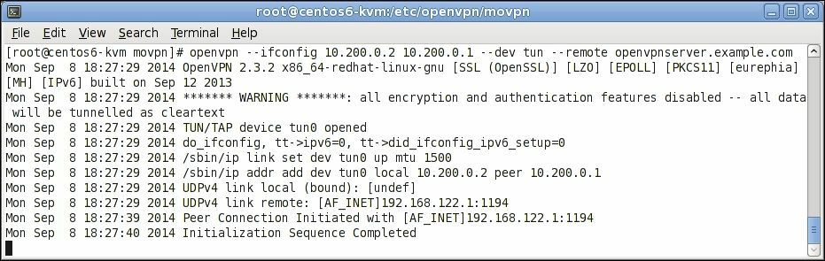
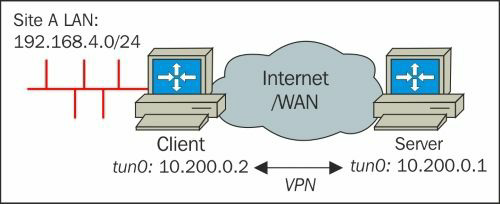
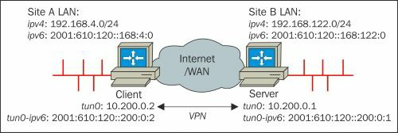
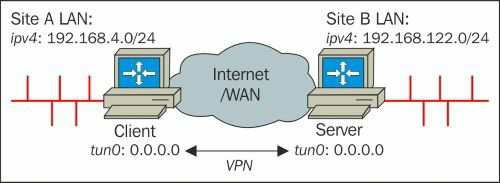
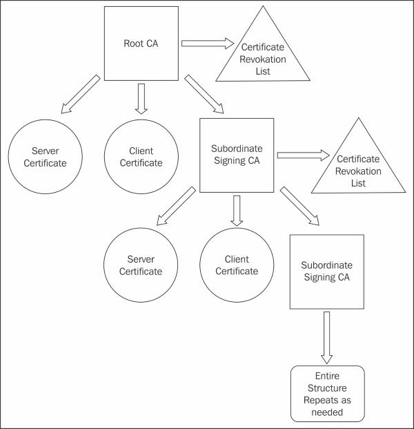
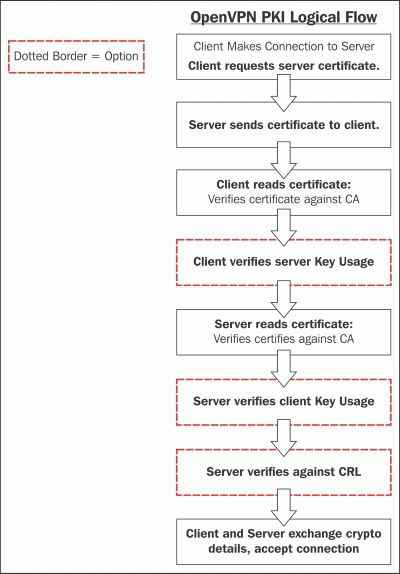
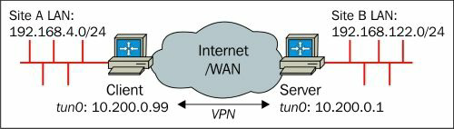
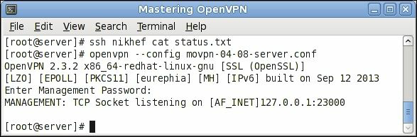

[<- До підрозділу](README.md)

# Опанування OpenVPN

Це є частковий переклад книги Mastering OpenVPN 2015 Published by Packt Publishing

### Режими TCP та UDP

Наразі OpenVPN підтримує два способи зв’язку між кінцевими точками: за допомогою пакетів UDP або за допомогою пакетів TCP. UDP — це протокол без з’єднання або протокол із втратою даних; якщо пакет відкидається під час передавання, мережний стек не виправляє це прозоро. Пакети TCP є протоколом, орієнтованим на з'єднання; пакети надсилаються та доставляються за допомогою протоколу рукостискання, що забезпечує доставку кожного пакета іншій стороні.

Обидва способи спілкування мають свої переваги та недоліки. Визначення найкращого режиму зв’язку залежить від типу трафіку, який надсилається через тунель VPN. Використання програми на основі TCP через VPN на основі TCP може призвести до подвійної втрати продуктивності, особливо якщо базове мережеве з’єднання погане. У цьому випадку виконується повторна передача втрачених пакетів для пакетів, втрачених як усередині, так і поза тунелем, що призводить до подвійного зниження продуктивності. Це гарно пояснюється в статті Чому TCP поверх TCP є поганою ідеєю на http://sites.inka.de/~W1011/devel/tcp-tcp.html.

Однак можна так само стверджувати, що надсилання UDP через UDP також не є хорошою ідеєю. Якщо програма, яка використовує для свого трафіку UDP, сприйнятлива до атак на видалення повідомлень або перевпорядкування пакетів, базове зашифроване з’єднання TCP підвищить безпеку таких програм навіть більше, ніж базова VPN на основі UDP. Якщо основна частина трафіку через VPN базується на UDP, іноді краще використовувати з’єднання TCP між кінцевими точками VPN.

Вибираючи між транспортом UDP або TCP, загальне емпіричне правило таке: якщо UDP (режим udp) вам підходить, використовуйте його; якщо ні, спробуйте TCP (режим tcp-сервер і режим tcp-клієнт). Деякі комутатори та маршрутизатори неправильно пересилають трафік UDP, що може бути проблемою, особливо якщо до одного комутатора чи маршрутизатора підключено кілька клієнтів OpenVPN. Так само на продуктивність OpenVPN через TCP може серйозно вплинути вибір Інтернет-провайдерів (ISP): деякі Інтернет-провайдери використовують дивні розміри MTU або правила фрагментації пакетів, що призводить до надзвичайно низької продуктивності OpenVPN через TCP порівняно з незашифрованим трафіком TCP.


## 2. Режим Point-to-point

Спочатку режим «точка-точка» з використанням попередньо наданих ключів був єдиним доступним варіантом під час використання OpenVPN. Зараз існує кілька способів використання OpenVPN, але режим «точка-точка» все ще має своє застосування. Термін «режим «точка-точка» з використанням спільних ключів» часто скорочується до «спільних ключів» (pre-shared keys).

У режимі «точка-точка» OpenVPN налаштовується за допомогою попередньо наданих секретних ключів для попередньо означених кінцевих точок, і лише одна кінцева точка може підключитися до примірника сервера одночасно. Термін «сервер» можна вважати оманливим, оскільки обидві кінцеві точки більш-менш однакові, коли йдеться про функціональність. Кінцева точка, яка ініціює підключення, вважається клієнтом, інша кінцева точка – сервером.

Ми почнемо з демонстрації дуже простого прикладу. Після цього ми обговоримо додаткові функції OpenVPN. Ми розглянемо такі теми:

- Протокол TCP і різні порти

- Режим TAP

- Секретні ключі OpenVPN

- Маршрутизація

- Повне налаштування, включаючи IPv6

- Налаштування без IP

- Тристороння маршрутизація

- Мостові адаптери TAP на обох кінцях

- Поєднання режиму «точка-точка» із сертифікатами

### Плюси і мінуси режиму ключа (key mode)

Основним випадком використання режиму попереднього спільного ключа є з’єднання двох віддалених мереж, наприклад, головного офісу та віддаленого офісу невеликої компанії. Якщо потрібно більше трьох користувачів або кінцевих точок, набагато простіше використовувати режим клієнт/сервер, як описано в Розділі 4, Режим клієнт/сервер із налаштуваннями пристроїв. Приклад того, як з’єднати три сайти разом за допомогою спільних ключів, наведено далі в цьому розділі, і стане зрозуміло, чому режим попереднього спільного ключа не масштабується далеко за межі трьох сайтів або користувачів.

Основні переваги використання режиму попереднього ключа:

- Дуже легко налаштувати

- Немає потреби в інфраструктурі відкритих ключів (PKI) або сертифікатах X.509

- Може працювати на обмеженому обладнанні, такому як комутатори чи маршрутизатори на базі Linux

Недоліки використання режиму попереднього спільного ключа:

- Як вказує назва «точка-точка», лише дві кінцеві точки можуть використовуватися одним з’єднанням. Тому цей режим погано масштабується.

- Деякі оболонки графічного інтерфейсу для OpenVPN (наприклад, GNOME NetworkManager) не підтримують попередньо надані ключі. Те саме стосується клієнтів Android та iOS.

- Секретний ключ необхідно скопіювати на віддалену кінцеву точку за допомогою безпечного каналу, наприклад, за допомогою SSH. Іноді це може становити загрозу безпеці.

- Неможливо зашифрувати секретний ключ за допомогою парольної фрази, як це можливо під час використання відкритих/приватних ключів X.509.

- Він вважається трохи менш безпечним, оскільки безпека повністю залежить від безпеки та надійності попереднього спільного секретного ключа. Крім того, у цьому режимі немає ідеальної секретності пересилання (**PFS**). Без PFS зловмисник може записати весь зашифрований трафік VPN. Якщо зловмиснику вдається зламати шифрування в якийсь момент, то весь записаний трафік VPN може бути розшифрований. За допомогою PFS неможливо розшифрувати старі дані.

Важливо розуміти, що OpenVPN насправді працює по-іншому, якщо використовується попередні спільні ключі, порівняно з використанням сертифікатів і налаштувань клієнт/сервер. Шляхи коду, які застосовуються в OpenVPN, насправді зовсім інші, наприклад, узгодження каналу керування не потрібне. Пересічний кінцевий користувач не побачить цих відмінностей, але важливо знати про ці відмінності, коли потрібне усунення несправностей для підключення OpenVPN. Крім того, під час читання файлу журналу OpenVPN із високою детальністю (тобто все, що перевищує 5), вихід підключення зі спільним ключем виглядатиме зовсім інакше порівняно з виводом підключення на основі сертифіката.

Якщо не зазначено інше, всі приклади в цьому розділі базуються на кінцевих точках, на яких працює CentOS 6 64bit. Версія встановленого програмного забезпечення OpenVPN — v2.3.2, взята з репозиторію CentOS-EPEL.

### The first example

Давайте розглянемо наш найперший приклад:

1.	Найпростіший і найкоротший приклад з’єднання двох комп’ютерів за допомогою OpenVPN – запустити першу кінцеву точку в режимі прослуховування, використовуючи фіксовані IP-адреси та мережу типу tun:

```
[root@server] # openvpn \
--ifconfig 10.200.0.1 10.200.0.2 \
--dev tun
```

2.	Далі запустіть клієнт OpenVPN:

```
[root@client] # openvpn \
--ifconfig 10.200.0.2 10.200.0.1 \
--dev tun \
-- remote openvpnserver.example.com
```

3.	В іншому вікні терміналу перелічіть мережевий пристрій:

```
[root@client] # ip addr show tun0

7: tun0: <POINTOPOINT,MULTICAST,NOARP,UP,LOWER_UP> mtu 1500 qdisc pfifo_fast state UNKNOWN group default qlen 100 link/none

inet 10.200.0.2 peer 10.200.0.1/32 scope global tun0 valid_lft forever preferred_lft forever
```

На наступних знімках екрана показано, як встановлюється з’єднання:



4. Тепер ми можемо пінгувати кінцеві точки OpenVPN з будь-якої сторони, за умови, що брандмауер і правила SELinux дозволяють це.

Журнал підключень показує кілька цікавих деталей. Версія OpenVPN на стороні клієнта – 2.3.2 x86_64-redhat-linux-gnu. Це підтверджує, що ми використовуємо v2.3.2 на 64-розрядній версії похідної системи RedHat Linux.

Журнал підключень показує попередження:

```
Mon Sep 8 18:27:29 2014 ******* WARNING *******: all encryption and authentication features disabled -- all data will be tunnelled as cleartext
```

Це попередження друкується, оскільки не було вказано секретний ключ для шифрування з’єднання, що робить цей приклад не дуже безпечним.

- Для підключення відкрито пристрій Linux `tun0`. Ми вказали `--dev tun`, який повідомляє OpenVPN відкрити перший доступний адаптер `tun`. Якщо зараз буде розпочато друге підключення OpenVPN, цей екземпляр використовуватиме `tun1`.

- Для налаштування мережевого адаптера `tun0` використовується команда Linux `iproute2 /sbin/ip` . Призначається вказана IP-адреса разом із максимальною одиницею передачі (MTU) за замовчуванням у 1500 байт.

- За замовчуванням для встановлення з’єднання OpenVPN використовуватиме порт UDP 1194. Якщо потрібен протокол TCP, то аргументи командного рядка на обох кінцях дещо відрізняються (це показано в наступному розділі).

- З відміток часу, надрукованих на початку кожного рядка, видно, що для встановлення початкового з’єднання потрібно 10 секунд.

Якщо надруковане наступне повідомлення, це означає, що з’єднання виконано успішно. Однак у наступних прикладах ми побачимо, що це не обов’язково означає, що VPN функціонує належним чином.

```
Mon Sep 8 18:27:40 2014 Initialization Sequence Completed
```

### Протокол TCP та інші порти

Стандартним протоколом, який використовує OpenVPN, є UDP, оскільки він зазвичай більше підходить для з’єднань VPN. Однак, якщо потрібен протокол TCP, попередній приклад потрібно лише трохи змінити:

Наприкінці прослуховування запустіть примірник сервера OpenVPN:

```
[root@server] # openvpn \
--ifconfig 10.200.0.1 10.200.0.2 \
--dev tun \
--proto tcp-server
```

На стороні клієнта код виглядає наступним чином:

```
[root@client] # openvpn \
--ifconfig 10.200.0.2 10.200.0.1 \
--dev tun \
--proto tcp-client \
-- remote openvpnserver.example.com
```

Тепер OpenVPN підключатиметься через TCP-порт 1194. Також можна змінити номер порту за допомогою параметра `-- port`, наприклад `--port 5000`.

### Режим TAP

Якщо через VPN-тунель необхідно передати трафік, що не є протоколом TCP/IP (наприклад, застарілий трафік AppleTalk або IPX), потрібен пристрій `tap`. Пристрій `tap` забезпечує інтерфейс для передачі повних кадрів Ethernet через тунель VPN. Накладні витрати при передачі повних кадрів Ethernet незначні. Призначення IP для пристрою `tap` відрізняється від пристрою `tun`, оскільки пристрій  `tap`  діє як звичайний мережевий адаптер, якому потрібно призначити одну IP-адресу та маску мережі.

Попередній приклад тепер змінено. Наприкінці прослуховування запустіть процес сервера OpenVPN:

```
[root@server] # openvpn \
--ifconfig 10.200.0.1 255.255.255.0 \
--dev tap
```

На стороні клієнта код виглядає наступним чином:

```
[root@client] # openvpn \
--ifconfig 10.200.0.2 255.255.255.0 \
--dev tap \
-- remote openvpnserver.example.com
```

Знову перерахуємо конфігурацію мережевого пристрою:

```
[root@client] # ip addr show tap0
8: tap0: <BROADCAST,MULTICAST,UP,LOWER_UP> mtu 1500
	qdisc pfifo_fast state UNKNOWN group default qlen 100 
	link/ether 6e:ea:0e:47:a3:d8 brd ff:ff:ff:ff:ff:ff 
		inet 10.200.0.2/24 brd 10.200.0.255 scope global tap0 
			valid_lft forever preferred_lft forever 
		inet6 fe80::6cea:eff:fe47:a3d8/64 scope link 
			valid_lft forever preferred_lft forever
```

Порівняйте це з конфігурацією з першого прикладу.

### Топологія підмережі

OpenVPN 2.1 і новіші версії підтримують нову топологію, топологію підмережі для призначення IP-адрес у мережах типу `tun` ( tun-style), яка дуже схожа на IP-адреси, що використовуються в мережах типу `tap` (tap-style). У разі використання опції ` -- topology subnet` одна IP-адреса та маска мережі призначаються інтерфейсу `tun` без вказівки однорангової адреси.

Хоча немає великого сенсу використовувати цей режим топології для виділеного зв’язку «точка-точка», можна використати цю опцію топології, щоб зробити налаштування «точка-точка» у стилі `tun` майже таким же, як і відповідне налаштування стилю `tap`. Щоб використовувати цей новий режим топології, використовуйте налаштування, описані далі.

Наприкінці прослуховування почніть:

```
[root@server] # openvpn \
--ifconfig 10.200.0.1 255.255.255.0 \
--dev tun \
--topology subnet
```

На стороні клієнта код виглядає наступним чином:

```
[root@client] # openvpn \
--ifconfig 10.200.0.2 255.255.255.0 \
--dev tun \
--topology subnet \
-- remote openvpnserver.example.com
```

Рядок `- -ifconfig` тепер такий самий, як у прикладі `tap`. Єдиною іншою зміною є додавання `- - topology subnet` на обох кінцях.

### Тунель відкритого тектсу

У попередньому прикладі не використовуються шифри шифрування чи ключі автентифікації; отже, ви отримуєте таке попередження:

```
Mon Sep 8 18:27:29 2014 ******* WARNING *******: all encryption and authentication features disabled -- all data will be tunnelled as cleartext
```

Однак тунель відкритого тексту має своє використання. У надійному середовищі, де безпека обробляється на іншому рівні (наприклад, за допомогою спеціального оптоволоконного кабелю), тунель із відкритим текстом забезпечує кращу продуктивність порівняно з зашифрованим тунелем, і легше контролювати потік трафіку через тунель.

Крім того, якщо ви заздалегідь знаєте, що весь трафік, який проходитиме через тунель, зашифровано (наприклад, увесь трафік суворо HTTPS), тоді можна використовувати тунель із відкритим текстом, щоб уникнути подвійного шифрування, яке іноді може призвести до зниження продуктивності. Особливо під час запуску OpenVPN на невеликому або вбудованому обладнанні (наприклад, Raspberry Pi або навіть на деяких платах Arduino), шифрування вносить значне стягнення на продуктивність.

Тунель відкритого тексту можна налаштувати за допомогою прикладів, наведених у попередньому розділі. Якщо секретний ключ не вказано, шифрування та автентифікація (підпис HMAC) автоматично вимикаються. Їх також можна вимкнути явно :

Наприкінці прослуховування почніть:

```
[root@server] # openvpn \
--ifconfig 10.200.0.1 10.200.0.2 \
--dev tun \
--cipher none --auth none
```

На стороні клієнта код виглядає наступним чином:

```
[root@client] # openvpn \
--ifconfig 10.200.0.2 10.200.0.1 \
--dev tun \
--cipher none --auth none \
-- remote openvpnserver.example.com
```

Після встановлення з’єднання ми можемо перевірити, що вміст дійсно надіслано у відкритому вигляді за допомогою команди tcpdump (або еквівалента, наприклад, Wireshark):

1.	Запустіть підключення.

2.	Запустіть tcpdump і прослухайте звичайний мережевий інтерфейс, а не сам інтерфейс тунелю, і відфільтруйте пакети OpenVPN (UDP-порт 1194) за допомогою такої команди:

```
[root@server] # tcpdump -l -w - eth0 udp port 1194 | strings
```

3.	Тепер надішліть деякий текст через тунель, використовуючи, наприклад, nc (netcat):

-  On the Server side:

```
$ nc -l -p 31000
```

- On the Client side:

```
$ nc 10.200.0.1 31000 hello from openvpn client goodbye
```

4.	Висновок tcpdump тепер повинен показувати щось на зразок цього:

```
tcpdump: listening on eth0, link-type EN10MB (Ethernet), capture size 65535 bytes
V~hello from openvpn client
5goodbye
```

Символи, показані у вигляді текстових повідомлень, є артефактами інкапсуляції пакетів OpenVPN.

### Секретні ключі OpenVPN 

Щоб захистити з’єднання OpenVPN, потрібен секретний ключ. Спочатку ми згенеруємо такий ключ. Потім його потрібно скопіювати на віддалену кінцеву точку за допомогою безпечного каналу (приклад SCP):

```
$ openvpn --genkey --secret secret.key
```

Зауважте, що не обов’язково виконувати цю команду від імені користувача root (звідси запит $). Отриманий файл секретного ключа має такий формат:

```
##
2048 bit OpenVPN static key
# -----BEGIN OpenVPN Static key V1-----
1393ae687606c1f7d465d70227bf63e8
8963e9d1401450002d073d6eab1bffde
b06d1a33cc5c45d4a667016339e921d3
3ac36b1a949eb52e9217e41e4b035a7b
987ddfa9d6766d3b5e4c952dc27f518d
12ccff6b2f0966284382ddc0f62b824a
f576f0982beec9d6a4728d0788499a75
0fd7055ef681404fd463d9862d3a40a9
31fca7d87997c70c07b8303a1b85f1ff
76aa7790e7c341353d2b4ea5049b11a2
51346e7dd39fc1f1e53ae57c46cf60c8
24db00a871262fee78050a9df6a57322
0bb0d980b6cf1be90a2f304f99fb9cde
7cdf72d20e7dee555c7c99950aa4d8e6
86a020c3a63125fb99d56181ff4ca20c
d6711eab15a4d6faf706f2601eb6 61b7
-----END OpenVPN Static key V1-----
```

Після публікації ключа тут більше не секрет.

Команда openvpn `-- genkey` генерує 2048-бітний ключ або 256 байт випадкових даних. Ці 256 байт перераховані в шістнадцятковому форматі в `secret.key`, але не всі 256 байтів наразі використовуються (як ми побачимо пізніше).

Секретний ключ використовується OpenVPN як для шифрування, так і для автентифікації (підпису) кожного пакета. Шифр шифрування за замовчуванням – це шифр Blowfish (`BF-CBC`), а алгоритм HMAC за замовчуванням — `SHA1`. Шифр Blowfish використовував 128-бітове шифрування, тоді як ключ, який використовується для алгоритму SHA1, має 160-бітне шифрування.

Якщо OpenVPN запускається зі збільшеним виходом налагодження (`--verb 7` або вище), використані ключі друкуються під час запуску:

На стороні прослуховування (сервер) запустіть демон OpenVPN:

```
[root@server] # openvpn \
--ifconfig 10.200.0.1 10.200.0.2 \
--dev tun \
--secret secret.key \
--verb 7
```

На стороні клієнта команда виглядає так:

```
[root@client] # openvpn \
--ifconfig 10.200.0.2 10.200.0.1 \
--dev tun \
--secret secret.key \
-- remote openvpnserver.example.com
```

Вихід журналу на стороні сервера міститиме рядки такої форми:

```
Static Encrypt: Cipher 'BF-CBC' initialized with 128 bit key Static Encrypt: CIPHER KEY: 1393ae68 7606c1f7 d465d702 27bf63e8 Static Encrypt: CIPHER block_size=8 iv_size=8 Static Encrypt: Using 160 bit message hash 'SHA1' for HMAC authentication
Static Encrypt: HMAC KEY: 987ddfa9 d6766d3b 5e4c952d c27f518d 12ccff6b Static Encrypt: HMAC size=20 block_size=20
Static Decrypt: Cipher 'BF-CBC' initialized with 128 bit key Static Decrypt: CIPHER KEY: 1393ae68 7606c1f7 d465d702 27bf63e8 Static Decrypt: CIPHER block_size=8 iv_size=8 Static Decrypt: Using 160 bit message hash 'SHA1' for HMAC authentication
Static Decrypt: HMAC KEY: 987ddfa9 d6766d3b 5e4c952d c27f518d 12ccff6b Static Decrypt: HMAC size=20 block_size=20
```

Ключ шифру `BF-CBC` — це `1393 ae68 7606 c1f7 d465 d702 27bf 63e8`, це точно перший рядок файлу секретного ключа OpenVPN

Ключ HMAC `SHA1` — це `987d dfa9 d676 6d3b 5e4c 952d c27f 518d 12cc ff6b`, який також можна знайти у файлі секретного ключа, починаючи з п’ятого рядка.

Зауважте, що ті самі ключі використовуються для шифрування та дешифрування даних, а також для автентифікації даних. У наступному розділі ми побачимо, як ми можемо використовувати різні ключі для шифрування, дешифрування та автентифікації.

### Використання кількох ключів

OpenVPN підтримує використання направлені ключі (directional keys), тобто різні ключі використовуються для вхідних і вихідних даних. Це додатково підвищує безпеку. Додавши позначку напрямку до параметра `-- secret`, ми можемо вказати, що мають використовуватися різні ключі. Прапор напрямку має бути встановлений на `0` на одному кінці та на `1` на іншому кінці:

На стороні прослуховування (сервері) запустіть:

```
[root@server] # openvpn \
--ifconfig 10.200.0.1 10.200.0.2 \
--dev tun \
--secret secret.key 0\
--verb 7
```

На стороні клієнта код виглядає наступним чином:

```
[root@client] # openvpn \
--ifconfig 10.200.0.2 10.200.0.1 \
--dev tun \
--secret secret.key 1\
--remote openvpnserver.example.com \
--verb 7
```

Вихід журналу на стороні сервера тепер міститиме рядки такої форми:

```
Static	Encrypt:	CIPHER KEY:	1393ae68	7606c1f7	d465d702	27bf63e8
Static	Encrypt:	HMAC KEY:	987ddfa9	d6766d3b	5e4c952d	c27f518d
								12ccff6b
Static	Decrypt:	CIPHER KEY:	31fca7d8	7997c70c	07b8303a	1b85f1ff
Static	Decrypt:	HMAC KEY:	0bb0d980	b6cf1be9	0a2f304f	99fb9cde
								7cdf72d2
```

Ключі шифрування CIPHER і HMAC тепер чітко відрізняються від ключів CIPHER і HMAC дешифрування. Крім того, кожен із цих ключів можна знайти в секреті OpenVPN. ключовий файл:

- Encryption CIPHER KEY starts at 1 line, 128 bits or 16 bytes long

- Encryption HMAC KEY starts at 5 line, 160 bits or 20 bytes long

- Decryption CIPHER KEY starts at 9 line, 128 bits or 16 bytes long

- Decryption HMAC KEY starts at 13 line, 160 bits or 20 bytes long

Крім того, вивід журналу на стороні клієнта показує, що ключі перевернуті:

```
Static Encrypt:	CIPHER KEY:	31fca7d8	7997c70c	07b8303a	1b85f1ff
Static Encrypt:	HMAC KEY:	0bb0d980	b6cf1be9	0a2f304f	99fb9cde
							7cdf72d2
Static Decrypt:	CIPHER KEY:	1393ae68	7606c1f7	d465d702	27bf63e8
Static Decrypt:	HMAC KEY:	987ddfa9	d6766d3b	5e4c952d	c27f518d
							12ccff6b
```

Це необхідно для функціонування VPN-тунелю, оскільки ключі, необхідні на стороні сервера для шифрування даних, потрібні на стороні клієнта для розшифровки даних і навпаки.

### Використання різних алгоритмів шифрування та автентифікації 

OpenVPN підтримує багато різних алгоритмів шифрування та автентифікації (підпис HMAC). Розмір ключів, які використовуються в кожному шифрі шифрування та алгоритмі HMAC, різний, з поточним максимумом 256 біт для шифрів (наприклад, AES256) і 512 біт для ключа HMAC (наприклад, SHA512). Статичний ключ OpenVPN має 2048 біт, що достатньо для 512-бітного шифру та 512-бітного ключа HMAC.

Якщо ми вкажемо як AES256 як шифр шифрування, так і SHA512 як алгоритм автентифікації, то побачимо, що використовувані ключі збільшуються в розмірі:

На стороні прослуховування (сервері) запустіть:

```
[root@server] # openvpn \
--ifconfig 10.200.0.1 10.200.0.2 \
--dev tun \
--secret secret.key 0\
--cipher AES256 --auth SHA512 \
--verb 7
```

На стороні клієнта код виглядає наступним чином:

```
[root@client] # openvpn \
--ifconfig 10.200.0.2 10.200.0.1 \
--dev tun \
--secret secret.key 1\
--cipher AES256 --auth SHA512 \
--remote openvpnserver.example.com \
--verb 7
```

Вихід журналу на стороні сервера тепер містить такі рядки:

```
Static Encrypt: Cipher 'AES-256-CBC' initialized with 256 bit key Static Encrypt: CIPHER KEY: 1393ae68 7606c1f7 d465d702 27bf63e8
8963e9d1 40145000 2d073d6e ab1bffde Static Encrypt: CIPHER block_size=16 iv_size=16 Static Encrypt: Using 512 bit message hash 'SHA512' for HMAC authentication
Static	Encrypt:	HMAC	KEY:	987ddfa9	d6766d3b	5e4c952d	c27f518d
12ccff6b	2f096628	4382ddc0	f62b824a
f576f098	2beec9d6	a4728d07	88499a75
0fd7055e	f681404f	d463d986	2d3a40a9
Static Encrypt: HMAC size=64 block_size=64
Static Decrypt: Cipher 'AES-256-CBC' initialized with 256 bit key Static Decrypt: CIPHER KEY: 31fca7d8 7997c70c 07b8303a 1b85f1ff
76aa7790 e7c34135 3d2b4ea5 049b11a2 Static Decrypt: CIPHER block_size=16 iv_size=16 Static Decrypt: Using 512 bit message hash 'SHA512' for HMAC authentication
Static	Decrypt:	HMAC	KEY:	0bb0d980	b6cf1be9	0a2f304f	99fb9cde
7cdf72d2	0e7dee55	5c7c9995	0aa4d8e6
86a020c3	a63125fb	99d56181	ff4ca20c
d6711eab	15a4d6fa	f706f260	1eb661b7
```

Цей журнал можна порівняти з файлом `secret.key`:

• КЛЮЧ шифрування тепер відповідає першим 2 рядкам файлу

• КЛЮЧ шифрування HMAC тепер відповідає рядкам 5-8 файлу

Його можна порівняти так само для ключів дешифрування.

Примітка

Тунель VPN функціонує як і раніше, але тепер із надійнішим шифруванням і автентифікацією. Якщо в майбутньому будуть представлені ще більш надійні шифри або алгоритми HMAC, формат статичного ключа OpenVPN доведеться оновити.

### Маршрутизація

Як зазначалося раніше, основним варіантом використання мереж у стилі «точка-точка» є з’єднання двох віддалених мереж через безпечний тунель. У попередньому прикладі захищений тунель було встановлено, але мережеві маршрути не додано.

Для наступного прикладу розглянемо такий макет мережі:



Клієнтську мережу `192.168.4.0/24` (з маскою мережі `255.255.255.0`) потрібно спрямувати через тунель VPN на сервер.

На стороні прослуховування (сервері) ми починаємо:

```
[root@server] # openvpn \
--ifconfig 10.200.0.1 10.200.0.2 \
--dev tun \
--secret secret.key 0\
--route 192.168.4.0 255.255.255.0 \
--daemon --log /var/log/movpn-02-server.log
```

На стороні клієнта код виглядає наступним чином:

```
[root@client] # openvpn \
--ifconfig 10.200.0.2 10.200.0.1 \
--dev tun \
--secret secret.key 1\
--remote openvpnserver.example.com \
--daemon --log /var/log/movpn-02-client.log
```

На стороні сервера було додано оператор маршруту (`route`), щоб повідомити OpenVPN, що мережа `192.168.4.0/24` знаходиться на іншому кінці тунелю. Сам OpenVPN мало що з цим зробить, але він видасть відповідну системну команду `/sbin/route` або `/sbin/ip` route для налаштування системних таблиць маршрутизації. Замість використання оператора OpenVPN `-- route` ми також можемо використати таку команду:

```
[root@server] # route add -net 192.168.4.0/24 gw 10.200.0.2
```

Після встановлення VPN-з’єднання ми можемо використовувати команду `iproute2`:

```
[root@server] # ip route add 192.168.4.0/24 via 10.200.0.2
```

Другий рядок інструкцій, доданих у цьому прикладі, наказує OpenVPN демонізувати себе (тобто безшумно працювати у фоновому режимі) і реєструвати всі повідомлення у файлі `/var/log/movpn-02-server.log`.

Подібним чином той самий оператор daemon+log додається на стороні клієнта.

Примітка. Оператор `--log` починає файл журналу під час кожного запуску OpenVPN. Якщо ви хочете додати до попереднього файлу журналу, скористайтеся такою командою:

```
--log-append /var/log/movpn-02-server.log
```

На даний момент приклад ще не повністю функціональний. Якщо ми перевіряємо хост на клієнтській локальній мережі з сервера VPN, ми не отримаємо жодної відповіді. Це має мало спільного з самим OpenVPN, але переважно з маршрутизацією TCP/IP. Більшість запитань у списку розсилки користувачів OpenVPN і на інтернет-форумі OpenVPN насправді є питаннями маршрутизації.

Причина відсутності відповіді від клієнтської локальної мережі є в двух речах:

- На клієнті OpenVPN потрібно увімкнути IP-переадресацію або маршрутизацію. Для кожної операційної системи це досягається різним способом. У Linux зазвичай достатньо додати або змінити рядок у файлі `/etc/sysctl.cnf` і перезавантажити систему. Необхідно змінити наступний рядок:

```
net.ipv4.ip_forward = 1
```

Можна уникнути перезавантаження, виконавши таку команду:

```
# sysctl -p
```

- Нам також потрібно переконатися, що є зворотний маршрут до сервера OpenVPN у локальній мережі клієнта. Це можна зробити, додавши маршрут до шлюзу локальної мережі або додавши статичний маршрут до кожної машини в локальній мережі клієнта. У цьому прикладі ми додаємо маршрут на машині Linux, підключеній до клієнтської локальної мережі:

```
# route add -net 10.200.0.0/24 gw 192.168.4.100
```

Тут `192.168.4.100` — IP-адреса локальної мережі клієнта OpenVPN.

Примітка. Маршрути, додані таким чином, не є постійними та зникнуть після перезавантаження. Постійне додавання маршрутів залежить від розподілу.

Тепер приклад працює, як очікувалося. З сервера OpenVPN ми можемо перевіряти IP-адреси локальної мережі машин у клієнтській локальній мережі та навпаки:

```
$ ping -c 2 192.168.4.100
PING 192.168.4.100 (192.168.4.100) 56(84) bytes of data.
64 bytes from 192.168.4.100: icmp_seq=1 ttl=64 time=5.97 ms
64 bytes from 192.168.4.100: icmp_seq=2 ttl=64 time=4.22 ms
$ ping -c 2 192.168.4.10
PING 192.168.4.10 (192.168.4.10) 56(84) bytes of data.
64 bytes from 192.168.4.10: icmp_seq=1 ttl=63 time=7.37 ms
64 bytes from 192.168.4.10: icmp_seq=2 ttl=63 time=6.09 ms
```

### Конфігураційні файли проти командного рядка

Як видно з попереднього прикладу, аргументи командного рядка для OpenVPN можуть швидко стати довгими та складними. Також можна (і бажано) використовувати файли конфігурації для зберігання часто використовуваних параметрів для OpenVPN. Загалом, кожен параметр можна вказати в командному рядку за допомогою такої команди:

```
--<some option> <option-arguments>
```

Його також можна вказати у файлі конфігурації за допомогою `<some option> <option-arguments>`, тобто видалити два тире перед аргументом командного рядка.

Файл конфігурації вказується в командному рядку за допомогою параметра `--config <path>`. Майже всі параметри, указані у файлі конфігурації, обробляються так, ніби вони були вказані в командному рядку. Як ми побачимо далі в цій книзі, у файлі конфігурації можна зберігати сертифікати та файли закритих ключів. Непросто зробити те саме за допомогою аргументів командного рядка.

Також можна змішувати конфігураційні файли та аргументи командного рядка. Це полегшує збереження часто використовуваних параметрів у файлі конфігурації, який можна змінити за допомогою аргументів командного рядка.

Примітка. Не всі параметри конфігурації можна змінити. Деякі параметри можна вказати кілька разів (зокрема, `remote <remote-host>`). У таких випадках зазвичай спочатку пробують перший випадок.

Командний рядок на стороні сервера з попереднього прикладу можна перетворити на такий файл конфігурації:

```
ifconfig 10.200.0.1 10.200.0.2 dev tun
secret secret.key 0
route 192.168.4.0 255.255.255.0
daemon
log /var/log/movpn-02-server.log
```

Якщо цей конфігураційний файл зберігається як `movpn-02-01-server.conf`, тоді команда для запуску слухача буде виглядати так:

```
[root@server] # openvpn --config movpn-02-01-server.conf
```

Зауважте, що порядок аргументів командного рядка важливий. Усі параметри, указані перед параметром `--config <шлях>`, замінюються параметрами, указаними у файлі конфігурації. Усі параметри, вказані після параметра `-- config option`, мають перевагу над параметрами у файлі конфігурації (за кількома винятками, як зазначено раніше).

### Повне налаштування

Базуючись на попередніх прикладах, тепер ми можемо створити повне налаштування робочого рівня, використовуючи файли конфігурації, включаючи маршрутизацію, журналювання, підтримку IPv6, а також кілька інших робочих функцій, які пропонує OpenVPN.

Розглянемо таку структуру мережі:



Для сервера ми створюємо такий файл конфігурації `movpn-02-02-server.conf:`

```
dev tun
proto udp
local openvpnserver.example.com
lport 1234
remote openvpnclient.example.com
rport 4321
secret secret.key 0
ifconfig 10.200.0.1 10.200.0.2
route 192.168.4.0 255.255.255.0
tun-ipv6
ifconfig-ipv6 2001:610:120::200:0:1 2001:610:120::200:0:2
user nobody
groupnobody # use 'group nogroup' on Debian/Ubuntu
persist-tun
persist-key
keepalive 10 60
ping-timer-rem
verb 3
daemon
log-append /var/log/openvpn.log
```

Для клієнта створюємо файл `movpn-02-02-client.conf`:

```
dev tun
proto udp
local openvpnclient.example.com
lport 4321
remote openvpnserver.example.com
rport 1234
secret secret.key 1
ifconfig 10.200.0.2 10.200.0.1
route 192.168.122.0 255.255.255.0
tun-ipv6
ifconfig-ipv6 2001:610:120::200:0:2 2001:610:120::200:0:1
user nobody
group nobodygroup nobody # use 'group nogroup' on Debian/Ubuntu
persist-tun
persist-key
keepalive 10 60
ping-timer-rem
verb 3
daemon
log-append /var/log/openvpn.log
```

Файли конфігурації клієнта та сервера дуже схожі, за винятком дзеркальних адрес і дзеркального напрямку ключа.

У цих конфігураційних файлах представлено кілька нових параметрів:

- Хоча `proto udp` є протоколом за замовчуванням, доцільно явно вказати його у файлі конфігурації, щоб уникнути будь-якої плутанини.
-  `local <IP>` — локальна адреса IPv4, на якій OpenVPN прослуховуватиме вхідні з’єднання. Якщо ця адреса не вказана, OpenVPN слухатиме адресу `0.0.0.0`, що означає всі інтерфейси.
- `lport` — це локальний порт, який OpenVPN слухатиме. Значення за замовчуванням – `1194`, але можна використовувати будь-який дійсний і доступний номер порту.
-  `remote <IP>` – це віддалена IPv4-адреса, з якої процес сервера OpenVPN прийматиме вхідні з’єднання. Якщо цю адресу не вказано, OpenVPN прийматиме вхідні з’єднання з усіх адрес.
- `rport` — це віддалений порт, до якого підключатиметься OpenVPN. Зазвичай це вказується за допомогою порту, але коли використовується інший локальний порт, зручніше явно вказати rport.
- `tun - ipv6` наказує OpenVPN створити тунель, здатний пропускати трафік IPv6.
- `ifconfig -ipv6` налаштовує локальні та віддалені кінцеві точки IPv6. У цьому прикладі останні три цифри адреси IPv6 відповідають кінцевим точкам IPv4.
- `user nobody` і `group nobody` вказують OpenVPN після встановлення з’єднання перейти до користувача UNIX `nobody` і його грпу. Це додатково підвищує безпеку, оскільки атака на тунель з меншою вірогідністю призведе до root-експлойту. Зверніть увагу, що в Debian/Ubuntu використовується група `nogroup`.
- `persist-tun` і `persist-key` вказують OpenVPN не відкривати повторно пристрій налаштування та не генерувати новий матеріал ключа під час перезапуску тунелю. Ці параметри особливо корисні в поєднанні з користувачем nobody, оскільки користувач nobody зазвичай не має прав доступу для відкриття нового інтерфейсу tun.
- `keep-alive 10 60` і `ping-timer-rem` є корисними параметрами, щоб переконатися, що з'єднання VPN залишається в робочому стані, навіть якщо через тунель не надходить трафік.

Замість того, щоб вказувати дуже довгий командний рядок для запуску кінців тунелю, тепер ми можемо запускати обидва кінці за допомогою таких команд:

```
[root@server] # openvpn --config movpn-02-02-server.conf 
[root@client] # openvpn --config movpn-02-02-client.conf 
```

Перевірте файли `openvpn.log` на обох кінцях, щоб знайти чарівне речення:

```
Thu Sep 11 13:21:51 2014 Initialization Sequence Completed 
```

Нарешті, ми перевіряємо, чи можемо дістатися до іншого кінця тунелю за допомогою `ping` і `ping6`:

```
# remote IPv4 LAN address
$ ping -c 2 192.168.4.100
PING 192.168.4.100 (192.168.4.100) 56(84) bytes of data.
64 bytes from 192.168.4.100: icmp_seq=1 ttl=64 time=3 ms
64 bytes from 192.168.4.100: icmp_seq=2 ttl=64 time=5 ms
# remote IPv6 tunnel address
$ ping6 -c 2 2001:610:120::200:0:2
PING 2001:610:120::200:0:2(2001:610:120::200:0:2) 56 data bytes
64 bytes from 2001:610:120::200:0:2: icmp_seq=1 ttl=64 time=4 ms
64 bytes from 2001:610:120::200:0:2: icmp_seq=2 ttl=64 time=4 ms
# remote IPv6 LAN address
$ ping6 -c 2 2001:610:120::168:4:100
PING 2001:610:120::168:4:100(2001:610:120::168:4:100) 56 data byte
64 bytes from 2001:610:120::168:4:100: icmp_seq=1 ttl=64 time=6 ms
64 bytes from 2001:610:120::168:4:100: icmp_seq=2 ttl=64 time=3 ms
```

Зауважте, що для того, щоб маршрутизація працювала, нам тепер потрібна IP-переадресація на обох кінцях, а також зворотний маршрут для комп’ютерів у сегменті локальної мережі. У локальній мережі на стороні клієнта нам потрібні такі маршрути:

```
# route add -net 10.200.0.0/24 gw 192.168.4.100
# route add -net 192.168.122.0/24 gw 192.168.4.100
```

Тут `192.168.4.100` — це адреса локальної мережі клієнта OpenVPN.

У локальній мережі на стороні сервера нам знадобиться наступне:

```
# route add -net 10.200.0.0/24 gw 192.168.122.1
# route add -net 192.168.4.0/24 gw 192.168.122.1
```

Тут `192.168.122.1` — адреса локальної мережі сервера OpenVPN.

Примітка. Наразі потрібно завжди вказувати адресу IPv4 за допомогою `ifconfig`, навіть якщо тунель призначений лише для IPv6. Цей недолік буде усунено в налаштуваннях OpenVPN 2.4+IP-less.

### Advanced IP-less setup

Здатність OpenVPN дозволяти запускати визначені користувачем сценарії під час запуску з’єднання VPN дозволяє виконати деякі додаткові налаштування. У цьому прикладі ми використаємо спеціальний сценарій для створення тунелю OpenVPN, не призначаючи IP-адреси кінцевим точкам тунелю. У налаштуваннях маршрутизованої мережі це гарантує, що кінцеві точки тунелю ніколи не можуть бути досягнуті, що додає деяку безпеку, а також може зробити таблиці маршрутизації трохи коротшими.

Цей сценарій було перевірено лише на системах Linux, оскільки він вимагає певної конфігурації мережевого інтерфейсу, недоступної на інших платформах.

Ми використовуємо таку саму структуру мережі, що й у попередньому прикладі, але без адресації IPv6:



...

### Three-way routing

Як зазначено у вступі, мережі «точка-точка» є чудовим вибором для підключення невеликої кількості кінцевих точок. У цьому прикладі ми покажемо, як з’єднати три сайти разом за допомогою тунелів «точка-точка». Це також покаже, як швидко конфігурація такого налаштування може стати дуже складною.

Розглянемо таку структуру мережі:


Ми створимо три тунелі між сайтами та створимо резервні маршрути. Таким чином, якщо один із тунелів вийде з ладу, усі сайти залишаться видимими один для одного. Однак це відбувається за рахунок штрафу за продуктивність. Припустімо, що зв’язок між сайтом A і сайтом B не працює. Резервний маршрут проходить від сайту A до сайту C до сайту B, тож тепер трафік із сайту A до сайту B має зробити додатковий стрибок.

...

### Route, net_gateway, vpn_gateway, and metrics

The following configuration statements are vital in this setup. The word vpn_gateway is a special OpenVPN keyword and it specifies the VPN remote endpoint address. Normally, this keyword does not have to be specified, unless it is also necessary to specify the metric for this route.

Наступні оператори конфігурації є життєво важливими для цього налаштування. Слово `vpn_gateway` є спеціальним ключовим словом OpenVPN і означує адресу віддаленої кінцевої точки VPN. Зазвичай це ключове слово не потрібно вказувати, якщо тільки не потрібно вказати метрику для цього маршруту.

...


### Bridged tap adapter on both ends

Іншим розширеним варіантом використання виділеної VPN типу «точка-точка» є з’єднання двох віддалених сегментів мережі. OpenVPN дозволяє об’єднати два сегменти мережі з однаковим діапазоном IP-адрес разом, щоб сформувати єдиний прозорий сегмент мережі. Як правило, це не рекомендується робити, оскільки продуктивність такої мостової мережі не буде оптимальною. У деяких випадках цього не уникнути. Зазвичай було б краще призначати різні підмережі для обох кінців, але іноді спеціальне програмне забезпечення прив’язане до певної IP-адреси, і немає іншого вибору, окрім як мати ту саму підмережу на обох кінцях.

...


### Removing the bridges

...


### Поєднання режиму «точка-точка» з сертифікатами

Для наступного прикладу ми запозичимо деякі фрагменти з розділу 3, PKI і сертифікати. У режимі клієнт/сервер OpenVPN налаштовується за допомогою інфраструктури відкритих ключів (PKI) із сертифікатами X.509 і закритими ключами. Також можна використовувати сертифікати X.509 і закриті ключі для налаштування тунелю «точка-точка». Перевага використання сертифікатів X.509 перед спільними ключами полягає в тому, що вони пропонують ідеальну секретність пересилання (PFS), що значно підвищує безпеку ваших даних VPN. Без PFS, якщо зловмиснику вдається зламати шифрування в якийсь момент, тоді весь попередньо записаний трафік VPN може бути розшифрований. За допомогою PFS неможливо розшифрувати старі дані.

...

### Висновки

У початкових версіях OpenVPN єдиною підтримуваною конфігурацією була точка-точка. У цій главі ми почали з дуже простого прикладу «точка-точка». Ми представили більше функцій OpenVPN і побачили, що є вагомі причини використовувати цей режим у робочому середовищі. В останньому варіанті використання мостові адаптери TAP використовуються як на стороні клієнта, так і на стороні сервера.

Це єдиний розділ, у якому пояснюється режим «точка-точка». У наступному розділі ми правильно налаштуємо сертифікати, необхідні для використання іншого режиму OpenVPN, моделі клієнт/сервер.

## 3. PKIs і сертифікати 

Основним чином OpenVPN використовує сертифікати `X.509` для автентифікації клієнта та шифрування трафіку VPN, хоча цю підтримку можна вимкнути. Дивлячись на список розсилки та історію каналів IRC, налаштування та обслуговування інфраструктури приватних ключів (PKI) для сертифікатів X.509 є складною концепцією та може бути громіздким завданням.

Двійковий файл OpenSSL містить усі інструменти, необхідні для ручного керування PKI, але параметри команд складні, і, якщо вони не автоматизовані, можуть бути схильні до помилок. Організаціям або окремим особам рекомендується використовувати сценарій або інший пакет для керування PKI. Це не тільки обмежує кількість помилок, але й краще дотримується правил та інших загальних критеріїв.

Існують два проекти з відкритим вихідним кодом, які чітко розроблені для того, щоб добре працювати з реалізаціями OpenVPN. Easy-RSA — це давній проект, який завжди був тісно пов’язаний із проектом OpenVPN. Спочатку написаний разом із OpenVPN, його початковою метою було створити центр сертифікації (CA) та його необхідні компоненти. Сьогодні цей проект все ще підтримується разом із проектом OpenVPN, хоча вони технічно окремі.

Інший проект, `ssl-admin`, — це сценарій Perl, написаний для заповнення прогалин у коді Easy-RSA. Два проекти по-різному підходять до завдань управління PKI, і обидва мають унікальне рішення. Проект `ssl-admin` — це інтерактивний сценарій, який надає меню та відгуки користувачів, тоді як Easy-RSA — це переважно пакетна утиліта.

Сьогодні проекти `Easy-RSA` та `ssl-admin` обслуговуються Еріком Крістом. Джош Сепек приєднався та написав більшість початкового коду v3.0 Easy-RSA. Мета полягає в тому, щоб зрештою об’єднати два проекти та зберегти всі функціональні можливості обох.

### Огляд PKI

PKI, як правило, є ієрархічною організацією сертифіката шифрування та пар ключів. Як правило, у більшості веб-сайтів верхньою частиною ієрархії є CA. Це корінь усього дерева, і довіра закладена на цьому рівні. Якщо корінь є надійним, всі базові пари ключів також будуть довіреними. Від CA кореневого рівня можуть бути сертифікати клієнта, сертифікати сервера, суб-CA і списки відкликаних сертифікатів (CRL). Цей список можливостей повторюється під кожним суб-CA.



Для повного використання потенціалу PKI користувачі та системи повинні довіряти кореневому CA і будь-яким проміжним CA у ланцюжку. У більшості сучасних веб-браузерів автори або постачальники браузерів перевірили та схвалили великий список центрів сертифікації кореневого рівня, яким можна довіряти за замовчуванням. Ці органи влади зазвичай є комерційними постачальниками, такими як VeriSign, Go Daddy, Comodo, Trend Micro, різні державні установи та багато інших.

Через цей попередньо затверджений список для браузерів переважна більшість користувачів Інтернету абсолютно не знають, як працює PKI. Як наслідок, нові користувачі OpenVPN і будь-якого програмного забезпечення, яке потребує PKI, стикаються з перешкодою в налаштуванні та управлінні — як концептуально, так і технічно. У випадку загальнодоступних веб-сайтів необхідна перевірка сайту третьої сторони довіреним органом. Однак у контексті OpenVPN, як правило, в організації існує єдина сутність, якій безумовно довіряють, – ІТ-відділ. OpenVPN зазвичай використовується в одній організації, і довіра до них є невід’ємною частиною. Easy-RSA та ssl-admin були написані, щоб допомогти новачкам і досвідченим користувачам краще керувати PKI.

З єдиним зв’язком «точка-точка» часто немає сенсу залучати складність PKI для захисту тунелю; достатньо спільних ключів. Однак, коли задіяно багато користувачів, існує набагато більше шансів на втрату та крадіжку ключів і плинність кадрів. З належним чином налаштованим PKI відносно просто відкликати втрачений сертифікат або сертифікат працівника, який звільняється. Новий так само легко створити та повторно розгорнути.

Використовуючи як Easy-RSA, так і ssl-admin, ми створимо просту PKI з CA, сертифікатом сервера, деякими сертифікатами клієнта та списком відкликаних сертифікатів. Крім того, ми будемо використовувати ці утиліти для генерації параметрів Діффі-Хеллмана (DH), які використовуватимуться та обговорюватимуться в наступних розділах.

Потік OpenVPN PKI виглядає наступним чином:



### PKI з використанням Easy-RSA

На момент написання цього розділу Easy-RSA 2.2.2 був офіційно останнім випуском разом із v3.0.0-rc2. Оскільки серія v3.0 наближається до випуску, цей розділ буде зосереджений на цій версії. Випуски для Easy-RSA можна знайти за адресою https://github.com/OpenVPN/easy-rsa/releases

Ця вправа продемонструє, як створити CA з нуля. Оновлення з Easy-RSA 2.2 тут не розглядається. Після завантаження пакета Easy-RSA розпакуйте файли, і ви повинні знайти каталог (у нашому випадку EasyRSA-3.0.0-rc2):

```
ecrist@computer:~/Downloads-> tar -xzvf EasyRSA-3.0.0-rc2.tgz
x EasyRSA-3.0.0-rc2/
x EasyRSA-3.0.0-rc2/x509-types/
x EasyRSA-3.0.0-rc2/x509-types/server
x EasyRSA-3.0.0-rc2/x509-types/ca
x EasyRSA-3.0.0-rc2/x509-types/COMMON
x EasyRSA-3.0.0-rc2/x509-types/client
x EasyRSA-3.0.0-rc2/openssl-1.0.cnf
x EasyRSA-3.0.0-rc2/ChangeLog
x EasyRSA-3.0.0-rc2/Licensing/
x EasyRSA-3.0.0-rc2/Licensing/gpl-2.0.txt
x EasyRSA-3.0.0-rc2/COPYING
x EasyRSA-3.0.0-rc2/KNOWN_ISSUES
x EasyRSA-3.0.0-rc2/doc/
x EasyRSA-3.0.0-rc2/doc/Hacking.md
x EasyRSA-3.0.0-rc2/doc/EasyRSA-Upgrade-Notes.md
x EasyRSA-3.0.0-rc2/doc/EasyRSA-Readme.md
x EasyRSA-3.0.0-rc2/doc/EasyRSA-Advanced.md
x EasyRSA-3.0.0-rc2/doc/Intro-To-PKI.md
x EasyRSA-3.0.0-rc2/README.quickstart.md
x EasyRSA-3.0.0-rc2/vars.example
x EasyRSA-3.0.0-rc2/easyrsa
```

Коли це буде видобуто, скопіюйте файл `vars.example` до `vars`. 

Рекомендується встановити робочий каталог Easy-RSA. Рядок 45 `vars` визначає `EASYRSA` як `$PWD` (поточний робочий каталог) за замовчуванням. Це може бути проблематично, особливо якщо ви використовуєте Easy-RSA для керування кількома центрами сертифікації. Розкоментуйте цей рядок і змініть його на щось розумне для вашого середовища, наприклад `/usr/local/etc/easy-rsa`. Підказка. Після ініціалізації Easy-RSA все в каталозі EASYRSA буде видалено. Будьте обережні з тим, що ви тут означаєте. У каталозі EASYRSA знаходиться сховище сертифікатів. Тут не знаходяться виконувані файли та змінні.

Ймовірно, ви захочете встановити організаційні поля, які є такими змінними:

- EASYRSA_REQ_COUNTRY

- EASYRSA_REQ_PROVICE

- EASYRSA_REQ_CITY

- EASYRSA_REQ_ORG

- EASYRSA_REQ_EMAIL

- EASYRSA_REQ_OU

Значення використовуються як стандартні для всіх згенерованих запитів на сертифікати, включаючи кореневий CA. Переконайтеся, що ці рядки у файлі розкоментовані. 

Ніяких інших змін до змінних не потрібно.

Якщо визначений вами каталог EASYRSA не існує, створіть його зараз і скопіюйте `openssl-1.0.cnf` із розповсюдження пакунків у ваш новий каталог. Для наших прикладів ми розмістили сховище сертифікатів EASYRSA в `/usr/local/etc/easy-rsa`:

```
ecrist@computer:~/Downloads/EasyRSA-3.0.0-rc2-> mkdir -p /usr/local/etc/easy-rsa
ecrist@computer:~/Downloads/EasyRSA-3.0.0-rc2-> cp openssl-1.0.cnf /usr/local/etc/easy-rsa
ecrist@computer:~/Downloads/EasyRSA-3.0.0-rc2-> cp –R x509-types /usr/local/etc/easy-rsa/
```

Далі ми готові ініціалізувати Easy-RSA PKI:

```
ecrist@computer:~/Downloads/EasyRSA-3.0.0-rc2-> ./easyrsa init-pki
```

Зауважте, що ми використовуємо конфігурацію Easy-RSA з `./vars`.

```
init-pki complete; you may now create a CA or requests.
Your newly created PKI dir is: /usr/local/etc/easy-rsa/pki
```

У цьому випадку процес ініціалізації очищає вміст, у цьому випадку, каталогу `pki`, і створює підкаталоги `private` і `reqs`.
Ви можете мати кілька файлів `vars` для керування декількома центрами сертифікації, і всі вони вкладені в той самий кореневий каталог `EASYRSA`. Для цього вам потрібно змінити змінну `EASYRSA_PKI` для кожного CA.

#### Створення центру сертифікації CA

Підкоманда `build-ca` спочатку генерує запит на підписання сертифіката (CSR), а потім самостійно підписує цей запит.

Щоб створити пару сертифікат/ключ кореневого центру сертифікації, виконайте команду `build-ca`:

```
ecrist@computer:~/Downloads/EasyRSA-3.0.0-rc2-> ./easyrsa build-ca
Note: using Easy-RSA configuration from: ./vars
Generating a 2048 bit RSA private key
.......+++
............+++
writing new private key to '/usr/local/etc/easy-rsa/pki/private/ca.key'
Enter PEM pass phrase:
Verifying - Enter PEM pass phrase:
-----
```

Вас попросять ввести інформацію, яка буде включена у ваш запит на сертифікат. Те, що ви збираєтеся ввести, це те, що називається відмінним іменем або DN (Distinguished Name). Полів досить багато, але ви можете залишити деякі порожніми; деякі поля матимуть значення за замовчуванням. Якщо ви введете `.`, поле залишиться порожнім.

```
-----
Common Name (eg: your user, host, or server name) [Easy-RSA CA]:Mastering OpenVPN
```

Підказка. У полі `Common Name` не можна використовувати пробіли. Це спричинить проблеми в Easy-RSA, а також потенційно з CCD, загальне ім’я як ім’я користувача та інші випадки. Переконайтеся, що після шляху є коса риска (`/`), інакше деякі підкоманди (`gen-crl` та інші) не працюватимуть.

```
CA creation complete and you may now import and sign cert requests.
Your new CA certificate file for publishing is at:
/usr/local/etc/easy-rsa/pki/ca.crt
```

Під час самопідписання для обмеження CA встановлюється значення true та визначаються ключові параметри використання, що дозволяє цьому новому сертифікату підписувати інші сертифікати, зокрема **Список відкликаних сертифікатів (CRL, Certificate Revocation List)**. Цю інформацію можна перевірити за допомогою утиліти командного рядка `openssl`:

```
ecrist@computer:~/Downloads/EasyRSA-3.0.0-rc2-> openssl x509 -in /usr/local/etc/easy-rsa/pki/ca.crt -text -noout
Certificate:
    Data:
        Version: 3 (0x2)
        Serial Number:
        89:39:42:bb:f3:6b:a9:f6
        Signature Algorithm: sha256WithRSAEncryption
        Issuer: CN=Mastering OpenVPN
        Validity
        Not Before: Oct 1 15:02:44 2014 GMT
        Not After : Sep 28 15:02:44 2024 GMT
        Subject: CN=Mastering OpenVPN
        Subject Public Key Info:
        Public Key Algorithm: rsaEncryption
        RSA Public Key: (2048 bit)
        Modulus (2048 bit):
        ...
        Exponent: 65537 (0x10001)
        X509v3 extensions:
        X509v3 Subject Key Identifier:
        69:6C:A3:85:63:61:09:DE:8F:7D:38:F7:A2:CB:1C:31:75:90:34:93
        X509v3 Authority Key Identifier:
        keyid:69:6C:A3:85:63:61:09:DE:8F:7D:38:F7:A2:CB:1C:31:75:90:34:93
        DirName:/CN=Mastering OpenVPN
        serial:89:39:42:BB:F3:6B:A9:F6
        X509v3 Basic Constraints:
        CA:TRUE
        X509v3 Key Usage:
        Certificate Sign, CRL Sign
    Signature Algorithm: sha256WithRSAEncryption
    ...
```

У вихідних даних `openssl` ми бачимо  x509v3 Basic Constraints (базові обмеження ), а також параметри  x509v3 Key Usage. Тепер ваш CA готовий почати підписувати сертифікати клієнта та сервера.


#### Список відкликаних сертифікатів (CRL)

Підкоманда `gen-crl` генерує CRL (Список відкликаних сертифікатів). Хоча на даний момент ми маємо лише сертифікат CA, рекомендується створити порожній CRL. Це дає змогу налаштувати конфігурацію OpenVPN із файлом і не потребуватиме перезапуску пізніше. OpenVPN реєструватиме помилки, якщо в його конфігурації вказано неіснуючий CRL, але файл можна замінити на льоту, оскільки він перечитується під час кожного підключення клієнта.

```
ecrist@computer:~/Downloads/EasyRSA-3.0.0-rc2-> ./easyrsa gen-crl

Note: using Easy-RSA configuration from: ./vars
Using configuration from /usr/local/etc/easy-rsa/openssl-1.0.cnf
Enter pass phrase for /usr/local/etc/easy-rsa/pki/private/ca.key:

An updated CRL has been created.
CRL file: /usr/local/etc/easy-rsa/pki/crl.pem
```

Ми можемо перевірити CRL за допомогою команди openssl `crl`:

```
ecrist@computer:~/Downloads/EasyRSA-3.0.0-rc2-> openssl crl -noout -text -in /usr/local/etc/easy-rsa/pki/crl.pem
Certificate Revocation List (CRL):
Version 2 (0x1)
Signature Algorithm: sha256WithRSAEncryption
Issuer: /CN=Mastering OpenVPN
Last Update: Oct 1 15:50:46 2014 GMT
Next Update: Mar 30 15:50:46 2015 GMT
CRL extensions:
X509v3 Authority Key Identifier:
keyid:69:6C:A3:85:63:61:09:DE:8F:7D:38:F7:A2:CB:1C:31:75:90:34:93
DirName:/CN=Mastering OpenVPN
serial:89:39:42:BB:F3:6B:A9:F6
No Revoked Certificates.
Signature Algorithm: sha256WithRSAEncryption
...
```

#### Серверні сертифікати

OpenVPN може використовувати параметри використання ключів x509, забезпечуючи підключення клієнтів за допомогою дійсних сертифікатів клієнтів, а клієнти можуть переконатися, що сервер авторизований як сервер. Це запобігає використанню одного з ваших клієнтських сертифікатів як сервера в атаці Man-In-The-Middle (MITM). Без цього обмеження будь-який сертифікат, підписаний VPN CA, може використовуватися для імітації клієнта або сервера. Оскільки фальшивий сертифікат знаходиться в тому самому PKI, сам сертифікат все ще дійсний і пройде загальні перевірки PKI.

Easy-RSA підтримує підписання сертифікатів за допомогою параметра використання ключа сервера за допомогою підкоманди `build-server-full`.

```
ecrist@computer:~/EasyRSA-3.0.0-rc2-> ./easyrsa build-server-full movpn-server
Note: using Easy-RSA configuration from: ./vars
Generating a 2048 bit RSA private key
............+++
..............................+++
writing new private key to '/usr/local/etc/easy-rsa/pki/private/movpn-server.key'
Enter PEM pass phrase:
Verifying - Enter PEM pass phrase:
-----
Using configuration from /usr/local/etc/easy-rsa/openssl-1.0.cnf
Enter pass phrase for /usr/local/etc/easy-rsa/pki/private/ca.key:
Check that the request matches the signature
Signature ok
The Subject's Distinguished Name is as follows
commonName :PRINTABLE:'movpn-server'
Certificate is to be certified until Oct 18 19:15:31 2024 GMT (3650 days)
Write out database with 1 new entries
Data Base Updated
```

Ми можемо перевірити сертифікат сервера за допомогою команди openssl:

```
ecrist@computer:~/EasyRSA-3.0.0-rc2-> openssl x509 -noout -text -in /usr/local/etc/easy-rsa/pki/issued/movpn-server.crt
Certificate:
Data:
Version: 3 (0x2)
Serial Number: 1 (0x1)
Signature Algorithm: sha256WithRSAEncryption
Issuer: CN=Mastering OpenVPN
Validity
Not Before: Oct 21 19:15:31 2014 GMT
Not After : Oct 18 19:15:31 2024 GMT
Subject: CN=movpn-server
Subject Public Key Info:
Public Key Algorithm: rsaEncryption
Public-Key: (2048 bit)
Modulus:
...
Exponent: 65537 (0x10001)
X509v3 extensions:
X509v3 Basic Constraints:
CA:FALSE
X509v3 Subject Key Identifier:
11:AD:47:E2:1C:87:91:3B:C0:A1:53:F5:77:A7:2F:9F:0B:0F:5D:9E
X509v3 Authority Key Identifier:
keyid:F0:AF:20:ED:6F:A7:47:0F:C7:F2:B0:EC:CF:8B:30:09:02:E4:81:A0
DirName:/CN=Mastering OpenVPN
serial:84:9E:B9:14:2B:62:B4:50
X509v3 Extended Key Usage:
TLS Web Server Authentication
X509v3 Key Usage:
Digital Signature, Key Encipherment
Signature Algorithm: sha256WithRSAEncryption
...
```

Зверніть увагу на розділ використання ключа x509v3 та ідентифікацію  TLS Web Server Authentication. Це те, що поточні версії OpenVPN шукають, коли вказуються типи віддалених сертифікатів.

#### Клієнтські сертифікати

Подібно до сертифікатів сервера, клієнти можуть бути автентифіковані за допомогою сертифікатів для клієнтів. За допомогою цього методу можна вимагати від кожного клієнта унікальний сертифікат. Загальне ім’я сертифіката (CN, Common Name) можна використовувати для означення інших параметрів, які потрібно надіслати на дане з’єднання за допомогою сценаріїв підключення клієнта або параметра `client-config-dir`. Починаючи з версії OpenVPN 2.3.7, все ще існує підтримка `client-cert-not-required`. Були розмови про вилучення цієї підтримки з майбутнього випуску. `client-cert-not-required` дозволяє клієнту підключатися без унікального (або будь-якого) попередньо означеного сертифіката, подібно до того, як веб-браузер підключається до веб-сервера.

Команда `easyrsa` використовується для створення сертифіката клієнта приблизно так само, як ми створили сертифікат сервера:

```
ecrist@computer:~/EasyRSA-3.0.0-rc2-> ./easyrsa build-client-full client1
Note: using Easy-RSA configuration from: ./vars
Generating a 2048 bit RSA private key
...............+++
................................................................................................
..........................+++
writing new private key to '/home/ecrist/EasyRSA-3.0.0-rc2/pki/private/client1.key'
Enter PEM pass phrase:
Verifying - Enter PEM pass phrase:
-----
Using configuration from /home/ecrist/EasyRSA-3.0.0-rc2/openssl-1.0.cnf
Enter pass phrase for /home/ecrist/EasyRSA-3.0.0-rc2/pki/private/ca.key:
Check that the request matches the signature
Signature ok
The Subject's Distinguished Name is as follows
commonName :PRINTABLE:'client1'
Certificate is to be certified until Oct 18 19:37:40 2024 GMT (3650 days)
Write out database with 1 new entries
Data Base Updated
```

Ми можемо використовувати команду openssl, щоб перевірити параметри використання ключа:

```
ecrist@computer:~/EasyRSA-3.0.0-rc2-> openssl x509 -noout -text -in /usr/local/etc/easyrsa/
pki/issued/client1.crt
Certificate:
Data:
Version: 3 (0x2)
Serial Number: 2 (0x2)
Signature Algorithm: sha256WithRSAEncryption
Issuer: CN=Mastering OpenVPN
Validity
Not Before: Oct 21 19:37:40 2014 GMT
Not After : Oct 18 19:37:40 2024 GMT
Subject: CN=client1
Subject Public Key Info:
Public Key Algorithm: rsaEncryption
Public-Key: (2048 bit)
Modulus:
...
Exponent: 65537 (0x10001)
X509v3 extensions:
X509v3 Basic Constraints:
CA:FALSE
X509v3 Subject Key Identifier:
47:80:59:8D:5F:63:4B:1C:21:C6:DE:C6:C0:7B:DE:6A:5D:53:F9:37
X509v3 Authority Key Identifier:
keyid:F0:AF:20:ED:6F:A7:47:0F:C7:F2:B0:EC:CF:8B:30:09:02:E4:81:A0
DirName:/CN=Mastering OpenVPN
serial:84:9E:B9:14:2B:62:B4:50
X509v3 Extended Key Usage:
TLS Web Client Authentication
X509v3 Key Usage:
Digital Signature
Signature Algorithm: sha256WithRSAEncryption
...
```

Як зазначено в розділі серверів, ми розглядаємо розширене використання ключа x509v3. У випадку клієнта ми шукаємо TLS Web Client Authentication. Знову ж таки, це використовується під час перевірки типу сертифіката віддаленого клієнта.

### PKI using ssl-admin

Проект ssl-admin було розпочато в той час, коли Easy-RSA вважався покинутим і зламаним. Це інтерактивна утиліта з меню, написана мовою Perl. Як і Easy-RSA, ssl-admin є оболонкою для утиліт командного рядка OpenSSL.

Щоб інсталювати ssl-admin на FreeBSD, інсталюйте порт security/ssl-admin. Для всіх інших систем на основі Unix, включаючи OS X, експорт svn є найпростішим методом. Наступні приклади виконуються в Mac OS X, але це буде подібно для інших операційних систем.

Щоб отримати ssl-admin в ОС, відмінній від FreeBSD, скористайтеся утилітою командного рядка SVN, щоб експортувати поточну версію:

```
ftp://ftp.secure-computing.net/pub/ssl-admin/

ecrist@computer:—> curl -o ssa.tgz ftp://ftp.secure-computing.net//pub/ssl-admin/ssl-admin-1.2.1.tar.gz

% Total	% Received	%	Xferd	Average Speed Time Time Time Current

Dload Upload Total Spent Left Speed 100 11196	100 11196	0	0	17568	0 --:--:-- --:--:-- --:--:-- 17548
```

Сервер `ftp2.secure-computing.net` можна використовувати як альтернативу, якщо основний, `ftp.secure-computing.net`, знаходиться в offline.

```
ecrist@computer:~-> tar -xzvf ssa.tgz
x ssl-admin-1.2.1/
x ssl-admin-1.2.1/man5/
x ssl-admin-1.2.1/man1/
x ssl-admin-1.2.1/ssl-admin
x ssl-admin-1.2.1/ssl-admin.conf
x ssl-admin-1.2.1/Makefile
x ssl-admin-1.2.1/configure
x ssl-admin-1.2.1/openssl.conf
x ssl-admin-1.2.1/ssl-admin-e
x ssl-admin-1.2.1/man1/ssl-admin.1
x ssl-admin-1.2.1/man1/ssl-admin.1-e
x ssl-admin-1.2.1/man5/ssl-admin.conf.5
x ssl-admin-1.2.1/man5/ssl-admin.conf.5-e
```


#### OpenVPN server certificates

#### OpenVPN client certificates

#### Other features

### Multiple CAs and CRLs

### Extra security – hardware tokens, smart cards, and PKCS#11

#### Background information

#### Supported platforms

#### Initializing a hardware token

#### Generating a certificate/private key pair

#### Generating a private key on a token

#### Generating a certificate request

#### Writing an X.509 certificate to the token

#### Getting a hardware token ID

#### Using a hardware token with OpenVPN

### Summary

У цій главі ми обговорили інструменти та методи створення кореневого центру сертифікації, а також основні сертифікати сервера та клієнта. Крім того, було розглянуто концепцію PKCS#11, хоча базова технологія постійно розвивається. Тепер ви повинні мати повний PKI та інструменти для його розширення.

У наступному розділі буде описано налаштування маршрутизованої VPN. Також буде обговорено використання мережевого пристрою tun і вимоги рівня 3 для робочого з’єднання.

## 4. Режим Client/Server з tun Devices

Найпоширенішою моделлю розгортання OpenVPN є один сервер із кількома віддаленими клієнтами, здатними маршрутизувати IP-трафік. Ми називаємо цю модель розгортання режимом клієнт/сервер із пристроями `tun`.

У цьому розділі ми починаємо з базового налаштування клієнт/сервер. По ходу роботи ми додамо більше функцій, а в кінці цього розділу наведено кілька складних прикладів налаштування OpenVPN у режимі клієнт/сервер. У наступному розділі ми пояснимо, як інтегрувати налаштування клієнта/сервера на основі `tun` в існуючі налаштування мережі, включаючи такі теми, як спільний доступ до файлів Windows і маршрутизація на основі політики.

У цьому розділі будуть розглянуті наступні теми:

- Налаштування інфраструктури відкритих ключів

- Початкове налаштування режиму клієнт/сервер

- Додавання додаткової безпеки за допомогою файлів конфігурації робочого рівня

- Маршрутизація та маршрутизація на стороні сервера

- Спеціальна конфігурація клієнта за допомогою файлів CCD

- Маршрутизація на стороні клієнта

- Переспрямування шлюзу за замовчуванням

- Файл статусу OpenVPN

- Інтерфейс керування OpenVPN

- Повторне узгодження ключа сеансу

- Використання IPv6

- Проксі ARP

- Роздача публічних IP-адрес

### Розуміння режиму клієнт/сервер

Режим клієнт/сервер вперше був представлений у OpenVPN 2.0. У цьому режимі сервер є єдиним процесом OpenVPN, до якого можуть підключитися кілька клієнтів. Кожному автентифікованому та авторизованому клієнту призначається IP-адреса з пулу IP-адрес, якими керує сервер OpenVPN. Клієнти не можуть безпосередньо спілкуватися один з одним. Весь трафік проходить через сервер, що має як переваги, так і недоліки.

Переваги наступні:

- Контроль: адміністратор VPN-сервера може контролювати, якому трафіку дозволено перетікати між клієнтами. За замовчуванням трафік між клієнтами не дозволяється. Однак, використовуючи опцію OpenVPN client-to-client або використовуючи розумний брандмауер і правила маршрутизації, можна дозволити клієнтам спілкуватися один з одним.

- Простота розгортання: Набагато легше налаштувати єдиний сервер, до якого може бути доступ багатьом клієнтам, ніж забезпечити з’єднання між безліччю клієнтів, кожен із власною мережею та конфігураціями брандмауера.

Недоліки такі:

- Масштабованість: оскільки весь трафік переходить від клієнта до сервера (і навпаки), сервер може швидко стати вузьким місцем у великомасштабних налаштуваннях VPN.

- Продуктивність: оскільки весь трафік між двома клієнтами (клієнтами A та B) має надходити від клієнта A до сервера, а потім від сервера до клієнта B, продуктивність цього типу VPN завжди буде нижчою порівняно з прямим підключенням client-to-client.

Найпоширенішим сценарієм розгортання для цього режиму є сервер OpenVPN на корпоративному сайті, до якого підключаються різні клієнти VPN. Серед клієнтів можуть бути супутникові офіси, дорожні воїни, люди, які працюють вдома, а також користувачі смартфонів і планшетів.

Ця модель розгортання покриває 95 відсотків типових вимог для VPN і є кращою перед більш складними налаштуваннями з використанням розширених функцій, таких як bridging. Ця модель розгортання буде недостатньою лише за наявності певних вимог до маршрутизації не-IP-трафіку (наприклад, застарілого IPX-трафіку) або якщо є потреба сформувати єдиний широкомовний домен мережі.

### Налаштування інфраструктури відкритих ключів (PKI)

У режимі клієнт/сервер OpenVPN налаштовується за допомогою інфраструктури відкритих ключів (PKI) із сертифікатами X.509 і закритими ключами. Перш ніж ми зможемо налаштувати клієнт/сервер VPN, нам потрібно спочатку налаштувати цей PKI. PKI складається з CA, закритих ключів і сертифікатів (відкритих ключів) як для клієнта, так і для сервера. У розділі 3, PKI та сертифікати, ми детально обговорювали, як налаштувати таку PKI. Цей розділ базується на сертифікатах і ключах, згенерованих у тому розділі.

Спочатку ми копіюємо сертифікат і ключі в окреме місце. Загалом, хороша практика безпеки – зберігати файли PKI в окремому місці, якщо це можливо, навіть на окремому комп’ютері. Слід приділяти особливу увагу захисту файлу `ca.key`, оскільки вся безпека вашої PKI залежить від цього файлу. Якщо файл `ca.key`, скомпрометовано будь-яким способом, весь PKI стане незахищеним і його слід залишити. У наведених нижче командах передбачається, що файли PKI генеруються за допомогою `ssladmin` і зберігаються в каталозі `<PKI_DIR>`, де `<PKI_DIR>` представляє справжній каталог у системі. Виконайте такі команди, щоб скопіювати необхідні файли PKI для сервера:

```
[root@server] # mkdir -p /etc/openvpn/movpn
[root@server] # chmod 700 /etc/openvpn/movpn
[root@server] # cd /etc/openvpn/movpn
[root@server] # PKI=<PKI_DIR>/ssladmin/active
[root@server] # cp -a $PKI/ca.crt movpn-ca.crt
[root@server] # cp -a $PKI/Mastering_OpenVPN_Server.crt server.crt
[root@server] # cp -a $PKI/Mastering_OpenVPN_Server.key server.key
```

Нам також потрібно створити файл параметрів Діффі-Хеллмана (DH), який потрібен для ключів сеансу VPN. Сеансові ключі є ефемерними або тимчасовими ключами та генеруються під час першого встановлення з’єднання між клієнтом і сервером. Для забезпечення оптимальної безпеки ефемерні ключі генеруються протягом сеансу через фіксовані проміжки часу. Стандартний інтервал ключа для OpenVPN становить одну годину, але його можна налаштувати за допомогою різних параметрів OpenVPN. Це буде пояснено пізніше в цій главі в розділі Переузгодження ключа сеансу.

Щоб створити файл параметрів DH, виконайте такі команди:

```
[root@server] # cd /etc/openvpn/movpn
[root@server] # openssl dhparam -out dh2048.pem 2048
Generating DH parameters, 2048 bit long safe prime, generator 2
This is going to take a long time
........+................................................................
..................................................................+......
```

У цьому прикладі ми вибираємо розмір ключа DH 2048 біт, що є рекомендованим розміром. Ви також можете використовувати більший розмір ключа DH, але це сповільнить початковий процес підключення для кожного клієнта OpenVPN. Тепер ми готові налаштувати та запустити сервер OpenVPN.

### Початкове налаштування режиму клієнт/сервер

Щоб налаштувати базовий сервер OpenVPN, ми спочатку створюємо файл конфігурації сервера, виконавши такі дії:

1. Створіть наступний файл

```
proto udp
port 1194
dev tun
server 10.200.0.0 255.255.255.0
topology subnet
persist-key
persist-tun
keepalive 10 60
dh /etc/openvpn/movpn/dh2048.pem
ca /etc/openvpn/movpn/movpn-ca.crt
cert /etc/openvpn/movpn/server.crt
key /etc/openvpn/movpn/server.key
user nobody
group nobody # use ‘group nogroup’ on Debian/Ubuntu
verb 3
daemon
log-append /var/log/openvpn.log
```

2. Потім збережіть його як `movpn-04-01-server.conf`. Детальне пояснення кожного з рядків конфігурації буде надано пізніше.
3. Запустіть сервер OpenVPN:

```
[root@server] # openvpn --config movpn-04-01-server.conf
```

4. Команда не створить жодного виводу в командному рядку, оскільки весь вивід перенаправляється до файлу журналу `/var/log/openvpn.log`.
Перегляньте цей файл, щоб дізнатися про повідомлення про запуск OpenVPN:

```
OpenVPN 2.3.2 x86_64-redhat-linux-gnu [SSL (OpenSSL)] [LZO] [EPOLL] [PKCS11] [eurephia]
[MH] [IPv6] built on Sep 12 2013
Enter Private Key Password:
WARNING: this configuration may cache passwords in memory -- use the auth-nocache option to
prevent this
TUN/TAP device tun0 opened
do_ifconfig, tt->ipv6=0, tt->did_ifconfig_ipv6_setup=0
/sbin/ip link set dev tun0 up mtu 1500
/sbin/ip addr add dev tun0 10.200.0.1/24 broadcast 10.200.0.255
GID set to nobody
UID set to nobody
UDPv4 link local (bound): [undef]
UDPv4 link remote: [undef]
Initialization Sequence Completed
```

5. Зверніть увагу, що зазвичай кожен запис у файлі журналу починається з позначки часу. Для ясності цю позначку часу видалено.
6. Далі створіть файл конфігурації клієнта:

```
client
proto udp
remote openvpnserver.example.com
port 1194
dev tun
nobind
ca /etc/openvpn/movpca.crt
cert /etc/openvpn/movpn/client1.crt
key /etc/openvpn/movpn/client1.key
```

Збережіть його як `movpn-04-01-client.conf`.
7. Передайте файли PKI клієнту за допомогою безпечного каналу, наприклад, за допомогою команди scp:

```
[root@client]# mkdir -p /etc/openvpn/movpn
[root@client]# chmod 700 /etc/openvpn/movpn
[root@client]# cd /etc/openvpn/movpn
[root@client]# PKI_HOST=openvpnserver.example.com
[root@client]# PKI=<PKI_DIR>/ssladmin/active
[root@client]# scp root@$PKI_HOST:$PKI/ca.crt movpn-ca.crt
[root@client]# scp root@$PKI_HOST:$PKI/client1.crt client1.crt
[root@client]# scp root@$PKI_HOST:$PKI/client1.key client1.key
```

8. Запустіть клієнт OpenVPN:

```
[root@client]# openvpn --config movpn-04-01-client.conf --suppress-timestamps
OpenVPN 2.3.2 x86_64-redhat-linux-gnu [SSL (OpenSSL)] [LZO] [EPOLL] [PKCS11] [eurephia]
[MH] [IPv6] built on Sep 12 2013
WARNING: No server certificate verification method has been enabled. See
http://openvpn.net/howto.html#mitm for more info.
UDPv4 link local: [undef]
UDPv4 link remote: [AF_INET]openvpnserver:1194
[Mastering OpenVPN Server] Peer Connection Initiated with [AF_INET]openvpnserver:1194
TUN/TAP device tun0 opened
do_ifconfig, tt->ipv6=0, tt->did_ifconfig_ipv6_setup=0
/sbin/ip link set dev tun0 up mtu 1500
/sbin/ip addr add dev tun0 10.200.0.2/24 broadcast 10.200.0.255
Initialization Sequence Completed
```

9. Мітки часу знову відсутні, але цього разу вони придушені за допомогою параметра OpenVPN suppress-timestamps, як
    вказано в командному рядку.
10. Після встановлення з’єднання перевірте наявність такого повідомлення:

```
Initialization Sequence Completed
```

11. Ви можете переконатися, що з’єднання функціонує належним чином, виконавши ping на адресу VPN сервера:

### Детальне пояснення конфігураційних файлів

Оскільки це перший приклад клієнта/сервера, докладне пояснення конфігураційних файлів сервера та клієнта необхідне. Файл конфігурації сервера містить такі рядки:

- `proto udp`: хоча це протокол за замовчуванням, доцільно явно вказати його у файлі конфігурації, щоб уникнути будь-якої плутанини.

- `port 1194`: це локальний порт, який OpenVPN слухатиме. Значення за замовчуванням — `1194`, але можна використовувати будь-який дійсний і доступний номер порту.

- `dev tun`: це визначає назву пристрою tun, який буде використовуватися для сервера. Не додаючи номер за `tun`, ми наказуємо OpenVPN відкрити новий пристрій `tun`. Цьому новому пристрою буде призначено перший доступний номер у ядрі системи, починаючи з 0 (`tun0`, `tun1`, `tun2` тощо). Для серверів Windows бажано залишити цей рядок як є. Якщо потрібно використовувати певний пристрій Windows, то потрібна опція `dev - node`.

- `server 10.200.0.0 255.255.255.0`: Оператор server переводить OpenVPN у режим сервера. IP-підмережа та маска підмережі вказують підмережу та маску для використання сервером і клієнтами VPN. Серверу VPN призначається перша адреса, яка в даному випадку `10.200.0.1`. Першому клієнту призначається адреса `10.200.0.2` (оскільки ми використовуємо топологію підмережі). Інструкція сервера для цієї конфігурації внутрішньо розширена наступним чином:

```
mode server
tls-server
push “topology subnet”
ifconfig 10.200.0.1 255.255.255.0
ifconfig-pool 10.200.0.2 10.200.0.254 255.255.255.0
push “route-gateway 10.200.0.1”
```

Це взято зі сторінки посібника OpenVPN за адресою https://community.openvDn.net/openvDn/wiki/OpenvDn23ManPaee. Якщо ці рядки конфігурації використовуються замість сервера макросів, використовується та сама конфігурація.

Примітка. Розширення включає `push "topology subnet"`, оскільки ми також вказали `topology subnet` у файлі конфігурації. Без цього рядка розширення не відбулося б.

- `topology subnet`: визначає топологію для VPN. Поточна топологія за замовчуванням — `net30`, у якій серверу та кожному клієнту призначається окремий мініатюрний простір підмережі `/30`. Більш детально про використання топології підмережі та топології `net30` наведено в наступному розділі.

- `persist-tun` і `persist-key`: наказує OpenVPN ані повторно відкривати пристрій `tun`, ані генерувати новий матеріал ключа під час перезапуску тунелю. Ці параметри особливо корисні в поєднанні з користувачем `nobody`, оскільки користувач `nobody` зазвичай не має прав доступу для відкриття нового інтерфейсу `tun`.

- `keepalive 10 60`: це використовується, щоб переконатися, що з’єднання VPN працює, навіть якщо через тунель не надходить трафік. Інструкція `keepalive` — це макрос для команд `ping` і `ping-restart`. Інструкція `keepalive 10 60` у конфігурації на стороні сервера розширюється до:

```
ping 10
ping-restart 120
push “ping 10”
push “ping-restart 60”
```

- Попередній код означає:
  - Надсилати повідомлення ping кожному клієнту кожні 10 секунд

  - Перезапустити з'єднання, якщо клієнт не відповідає протягом 120 секунд (2 * 60 = 120)

  - Надіслати оператори `ping 10` і `ping-restart 60` кожному клієнту

- `dh <шлях до файлу Diffie Hellman>`: указує шлях до файлу DH, який потрібен для сервера OpenVPN. Без цього файлу сервер не зможе встановити безпечне TLS-з’єднання з клієнтами. Бажано використовувати абсолютний шлях для цього файлу (а також шляхи інших сертифікатів і закритих ключів).

- `ca <шлях до файлу CA>`: це вказує шлях до файлу CA. Файл CA повинен містити сертифікат CA (або навіть набір сертифікатів), який використовувався для підпису клієнтських сертифікатів. Це не обов’язково має бути той самий CA, який використовувався для підпису сертифіката сервера, хоча в налаштуваннях PKI ми використовували той самий CA. Бажано використовувати абсолютний шлях для цього файлу (а також шляхи інших сертифікатів і закритих ключів).

- `cert <шлях до файлу сертифіката X.509>`: указує шлях до файлу публічного сертифіката сервера X.509. Цей сертифікат потрібен серверу OpenVPN, навіть якщо клієнти підключаються без використання сертифікатів. Бажано використовувати абсолютний шлях для цього файлу (а також шляхи інших сертифікатів і закритих ключів).

- `key <шлях до файлу приватного ключа>`: це вказує шлях до файлу приватного ключа сервера. Цей файл закритого ключа потрібен серверу OpenVPN, навіть якщо клієнти підключаються без використання сертифікатів або закритих ключів. Цей файл має бути доступним для читання лише користувачу `root` (або адміністратору), оскільки будь-хто з доступом на читання приватних ключів може розшифрувати трафік OpenVPN. Зауважте, що OpenVPN прочитає цей файл перед тим, як позбутися привілеїв користувача. Бажано використовувати абсолютний шлях для цього файлу (а також шляхи інших сертифікатів і закритих ключів).

- `user nobody` і `group nobody`: це вказує OpenVPN перейти до користувача Unix `nobody` і `group nobody` після встановлення з’єднання. Це додатково підвищує безпеку, оскільки атака на тунель з меншою вірогідністю призведе до root-експлойту. Зауважте, що в Debian/Ubuntu використовується група `nogroup`.

- `verb 3`: це встановлює рівень детальності на значення за замовчуванням 3. Збільште це число, щоб переглянути детальніші результати процесу OpenVPN. Якщо для детальності встановлено значення 0, вихідні дані журналу майже не створюються. Однак це не рекомендується.

- `daemon`: це повідомляє OpenVPN демонізувати себе, що означає, що процес OpenVPN продовжуватиме працювати навіть після закриття вікна терміналу, у якому було запущено OpenVPN.

- `log-append <шлях до файлу журналу>`: це вказує шлях до файлу журналу сервера. Використовуючи `log-append` замість `log <шлях до файлу>`, ми не даємо OpenVPN скорочувати файл журналу під час кожного його запуску. Для цього файлу також бажано використовувати абсолютний шлях.

Файл конфігурації клієнта містить (усі повторювані опущені):

• `client`: Це переводить OpenVPN у режим клієнта. Він наказує OpenVPN з’єднатися з віддаленим сервером і отримати та обробити параметри конфігурації з сервера після успішного підключення. Заява клієнта внутрішньо розширена таким чином:

```
tls-client
pull
```

- `remote openvpnserver.example.com`: це вказує назву сервера VPN, до якого потрібно підключитися. Ім’я може бути повним доменним іменем (FQDN) або адресою IPv4. Далі в цьому розділі ми побачимо, як підключитися до сервера VPN на основі IPv6.

- `port 1194`: це порт, який клієнт OpenVPN використовуватиме для підключення до сервера. Значення за замовчуванням — `1194`, але можна використовувати будь-який дійсний і доступний номер порту.

Примітка. Є кілька способів вказати віддалену адресу та порт для сервера VPN. Наприклад, також можна використовувати дистанційне керування

-  `nobind`: це вказує клієнту OpenVPN не прив’язуватися до (і не слухати) порту, указаного за допомогою port. Натомість клієнт OpenVPN використовуватиме порт у діапазоні анонімних портів, який зазвичай становить `1024-65335`.

- `ca <шлях до файлу CA>`: це вказує шлях до файлу CA. Цей файл CA має містити сертифікат CA (або навіть набір сертифікатів), який використовувався для підпису сертифіката сервера. Це не обов’язково має бути той самий центр сертифікації, який використовувався для підпису сертифіката клієнта, хоча ми використовували той самий центр сертифікації в налаштуваннях PKI. У Linux/Unix доцільно використовувати абсолютний шлях для цього файлу (а також інших шляхів сертифіката та закритого ключа).

- `cert <шлях до файлу сертифіката X.509>`: указує шлях до файлу загальнодоступного сертифіката X.509 клієнта. Можна налаштувати OpenVPN на використання автентифікації за іменем користувача/паролем замість сертифікатів, але це вважається менш безпечним. У Linux/Unix доцільно використовувати абсолютний шлях для цього файлу (а також шляхи інших сертифікатів і закритих ключів).

- `key <шлях до файлу приватного ключа>`: це вказує шлях до файлу приватного ключа клієнта. Цей файл має бути доступним для читання лише користувачу root (або адміністратору), оскільки OpenVPN прочитає цей файл перед тим, як втратити права користувача. У Linux бажано використовувати абсолютний шлях для цього файлу (а також інших шляхів сертифіката та закритого ключа).

Зауважте, що ми не вказали демон або `log - append` для конфігурації клієнта, оскільки в більшості випадків програма-оболонка запускатиме процес openvpn. Потім ця програма-оболонка контролюватиме журналювання OpenVPN. Найбільш часто використовувані програми-огортки:

| **Operating system** | **Wrapper applications**                              |
| -------------------- | ----------------------------------------------------- |
| Windows              | `OpenVPN-GUI.exe` (part of OpenVPN installer package) |
| Mac OS X             | Tunnelblick or Viscosity                              |
| Linux                | NetworkManager (with OpenVPN plugin)                  |

### Топологія subnet проти топології net30

OpenVPN підтримує декілька топологій у режимі tun:

- `net30` (за замовчуванням, може змінитися з v2.4)

- `subnet`

- `p2p`

Почнемо з останнього. Топологія `p2p` майже ніколи не використовується, і це був перший метод призначення однієї IP-адреси клієнту VPN. Однак він працює лише на похідних Linux і Unix і, отже, ніколи не використовувався дуже широко.

Топологія `net30` є поточною за замовчуванням. У цьому режимі OpenVPN налаштовує мережевий інтерфейс «точка-точка» для кожного клієнта (і для сервера) і призначає підмережу `/30` кожному. Це означає, що серверу та кожному клієнту призначається блок із чотирьох IP-адрес. У файлі конфігурації сервера вказано сервер `10.200.0.0 255.255.255.0`. З топологією `net30` це змушує OpenVPN призначати наступні IP-блоки:

- Серверу OpenVPN присвоєно номери від `10.200.0.0` до `10.200.0.3`.

- Першому клієнту призначається з `10.200.0.4` по `10.200.0.7`.

- Другий клієнт призначається з `10.200.0.8` на `10.200.0.11` і так далі. Кожна `/30` підмережа складається з чотирьох адрес; для першого клієнта ці адреси такі:

  - `10.200.0.4`: це мережева адреса підмережі `/30`. Кожна підмережа зазвичай повинна мати таку адресу, пов’язану з нею. 

  - `10.200.0.5`: це адреса віртуальної кінцевої точки. Ця адреса необхідна для функціонування OpenVPN, але її фактично не можна використовувати, і її навіть неможливо перевірити.

  - `10.200.0.6`: це IP-адреса VPN клієнта.

  - `10.200.0.7`: це широкомовна адреса підмережі `/30`. Кожна підмережа повинна мати таку широкомовну адресу, пов’язану з нею.

Як бачите, це не дуже ефективний спосіб призначення IP-адрес — для кожного VPN-клієнта призначається чотири IP-адреси. Для невеликих налаштувань VPN цей метод працює нормально, але цей метод не масштабується для сервера, до якого підключено понад 100 клієнтів.

Щоб подолати цю проблему, було введено режим підмережі топології. Це дозволяє OpenVPN призначати єдину IP-адресу всім клієнтам, що значно полегшує керування великомасштабною VPN. Існують деякі проблеми з маршрутизацією на стороні сервера (додаткову інформацію див. у розділі «Маршрутизація та маршрутизація на стороні сервера» далі в цьому розділі), через які цей режим топології не став стандартним, але очікується, що з версії 2.4 це буде бути режимом топології за замовчуванням.

### Adding extra security

### Using tls-auth keys

### Generating a tls-auth key

### Checking certificate key usage attributes

### Basic production-level configuration files

### TCP-based configuration

### Configuration files for Windows

### Routing and server-side routing

### Special parameters for the route option

### Masquerading

### Redirecting the default gateway

### Спеціальна конфігурація для клієнта - файли CCD

У налаштуваннях, де один сервер може обслуговувати багато клієнтів, іноді необхідно встановити параметри для кожного клієнта, які переважають над глобальними параметрами, або додати додаткові параметри для конкретного клієнта. Опція `client-config-dir` дуже корисна для цього. Це дозволяє адміністратору VPN призначати певну IP-адресу клієнту, щоб надіслати певні параметри, такі як сервер DNS, конкретному клієнту або тимчасово вимкнути клієнта взагалі. Цей параметр також життєво важливий, якщо ви хочете спрямувати підмережу від сторони клієнта до сторони сервера, як ми побачимо пізніше.

 `client-config-dir` або файл CCD може містити такі параметри:

- `push`: це корисно для надсилання серверів DNS і WINS, маршрутів тощо

- `Push-reset`: це корисно для скасування глобальних параметрів push

- `iroute`: це корисно для маршрутизації клієнтських підмереж IPv4 до сервера

- `iroute-ipv6`: це корисно для маршрутизації клієнтських підмереж IPv6 до сервера

- `ifconfig - push`: це корисно для призначення конкретної адреси IPv4 клієнту

- `ifconfig-ipv6-push`: це корисно для призначення конкретної адреси IPv6 клієнту

- `disable`: це корисно для тимчасового вимкнення клієнта взагалі

- `config`: це корисно для включення іншого файлу конфігурації CCD

Щоб використовувати файли CCD, ми додаємо рядок до конфігураційного файлу `basic-udp-server.conf`: 

```
client-config-dir /etc/openvpn/movpn/clients
```

Збережіть його як `movpn-04-04-server.conf`. Далі створіть каталог CCD і створіть у ньому файл CCD для клієнта з сертифікатом `clientl.crt`:

```
[root@server]# mkdir -p /etc/openvpn/movpn/clients
[root@server]# echo “ifconfig-push 10.200.0.99 255.255.255.0” \
				> /etc/openvpn/movpn/clients/client1
[root@server]# chmod 755 /etc/openvpn/movpn/clients
[root@server]# chmod 644 /etc/openvpn/movpn/clients/client1
```

Ім’я файлу CCD базується на загальній назві суб’єкта сертифіката (частина `/CN=`), яка міститься у файлі `clientl.crt`:

```
$ openssl x509 -subject -noout -in client1.crt
subject= /C=ZA/ST=Enlightenment/O=Mastering OpenVPN/CN=client1/emailAddress=root@example.org
```

У цьому випадку ім’я файлу має бути просто `client1` без розширення, навіть у Windows! Якщо в загальному імені присутні пробіли, їх потрібно перетворити на підкреслення (`_`). Якщо Провідник Windows налаштовано на приховування розширень для поширених типів файлів, то найпростіше відкрити вікно командної оболонки (`cmd.exe`) і видалити розширення за допомогою таких команд:

```
C:\> cd %PROGRAMFILES%\openvpn\config\clients
C:\> rename client1.txt client1,145.102.134.201:35519
```

Далі ми запускаємо сервер OpenVPN за допомогою цього файлу конфігурації та підключаємо VPN-клієнт. Журнал підключень показує, що клієнту присвоєно адресу `10.200.0.99`:

```
[root@client]# openvpn --config basic-udp-client.conf
OpenVPN 2.3.2 x86_64-redhat-linux-gnu [SSL (OpenSSL)] [LZO] [EPOLL] [PKCS11] [eurephia] [MH]
[IPv6] built on Sep 12 2013
Control Channel Authentication: using ‘/etc/openvpn/movpn/ta.key’ as a OpenVPN static key file
UDPv4 link local: [undef]
UDPv4 link remote: [AF_INET]openvpnserver:1194
[Mastering OpenVPN Server] Peer Connection Initiated with [AF_INET]openvpnserver:1194
TUN/TAP device tun0 opened
do_ifconfig, tt->ipv6=0, tt->did_ifconfig_ipv6_setup=0
/sbin/ip link set dev tun0 up mtu 1500
/sbin/ip addr add dev tun0 10.200.0.99/24 broadcast 10.200.0.255
Initialization Sequence Completed
```

Журнал на стороні сервера не відображає жодних повідомлень про отримання файлу CCD під час використання параметра детальності за замовчуванням. Збільште параметр детальності до 5 або вище, щоб побачити, чи обробляється файл CCD:

```
<client-ip>:49299 [client1] Peer Connection Initiated with [AF_INET]<client-ip>:49299
client1/<client-ip>:49299 OPTIONS IMPORT: reading client specific options from:
/etc/openvpn/movpn/clients/client1client1/<client-ip>:49299 MULTI: Learn: 10.200.0.99 ->
client1/<client-ip>:49299
```

### Як визначити, чи правильно обробляється файл CCD

Усунення несправностей, чи правильно обробляється файл CCD, може бути дещо складним. Наступні вказівки допоможуть у вирішенні проблем із файлами CCD:

- Завжди вказуйте повний шлях для параметра `client-config-dir`.

- Переконайтеся, що каталог доступний, а файл CCD доступний для читання користувачем, який використовується для запуску OpenVPN (у більшості випадків `nobody` або `openvpn`; у конфігураціях, наведених у цій книзі, використовується користувач `nobody`).

- Переконайтеся, що для файлу CCD використовується правильна назва файлу без будь-яких розширень.

- Якщо можливо, додайте параметр `ccd-exclusive` до файлу конфігурації сервера. Це вказує OpenVPN дозволяти підключення клієнта, лише якщо для цього клієнта існує певний файл CCD. Якщо виникла проблема з читанням CCD-файлу для конкретного клієнта, то клієнту також буде відмовлено в доступі. Таким чином ви дізнаєтеся, що ваші параметри каталогу конфігурації клієнта неправильно налаштовані.

### Файли CCD і топологія net30

Якщо ви використовуєте налаштування топології (за замовчуванням) (топологія `net30`), то оператор `ifconfig - push` дещо відрізняється. Оскільки тепер кожному клієнту призначено підмережу `/30`, оператор `ifconfig-push` має вказати дійсну підмережу VPN `/30`. Застосовуються такі правила:

- Кожна `/30` підмережа має починатися з адреси, що ділиться на 4 (4, 8, 12 тощо)

- Локальний IP VPN є третьою адресою в цій підмережі

- Другою адресою є IP віртуальної віддаленої кінцевої точки

Наприклад, дійсна IP-адреса для клієнта VPN – `10.200.0.50`:

- Підмережа `10.200.0.48/32`, де 48 кратне 4

- IP-адреса VPN становить 50 (48+2 = 50)

- Віртуальна віддалена кінцева точка становить 49 (48 + 1 = 49)

Тепер файл CCD має містити таке: `ifconfig-push 10.200.0.50 10.200.0.49`

### Client-side routing

Іноді корисно дозволити серверу VPN (або іншим клієнтам VPN) доступ до ресурсів, підключених до конкретного клієнта. Це відомо як маршрутизація на стороні клієнта. Для маршрутизації на стороні клієнта в OpenVPN потрібен файл CCD для цього клієнта, який містить оператор `iroute`. Він також вимагає відповідного оператора маршруту у файлі конфігурації сервера OpenVPN.

Розглянемо таку структуру мережі:



Підмережа `192.168.4.0/24` має бути доступна з локальної мережі на стороні сервера, а підмережа `192.168.122.0/24` на стороні сервера має бути доступна з локальної мережі на стороні клієнта. Цього можна досягти наступним чином:

1. Додати два рядки до конфігураційного файлу `basic-udp-server.conf`:

  ```
  client-config-dir /etc/openvpn/movpn/clients
  route 192.168.4.0 255.255.255.0 10.200.0.1
  ```

  Зберегти його як `movpn-04-05-server.conf`
2. Створіть файл CCD `client1` у каталозі `/etc/openvpn/movpn/clients` із вмістом:

  ```
  ifconfig-push 10.200.0.99 255.255.255.0
  iroute 192.168.4.0 255.255.255.0
  push “route 192.168.122.0 255.255.255.0”
  ```
3. Переконайтеся, що переадресацію IP-трафіку ввімкнено та дозволено як на клієнті, так і на сервері:

  ```
  [root@client]# sysctl -w net.ipv4.ip_forward=1
  [root@server]# sysctl -w net.ipv4.ip_forward=1
  ```
4. Запустіть сервер OpenVPN за допомогою файлу конфігурації

  ```
  movpn-04-05-server.conf.
  ```
5. Підключіть клієнт за допомогою файлу конфігурації за замовчуванням

  ```
  basic-udp-client.conf.
  ```
6. Після встановлення з’єднання ми перевіряємо, що обидві підмережі можуть досягати одна одної за допомогою ping:

  ```
  [root@client]# ping -c 3 192.168.122.184
  PING 192.168.122.184 (192.168.122.184) 56(84) bytes of data.
  64 bytes from 192.168.122.184: icmp_seq=1 ttl=63 time=3.29 ms
  64 bytes from 192.168.122.184: icmp_seq=2 ttl=63 time=3.27 ms
  64 bytes from 192.168.122.184: icmp_seq=3 ttl=63 time=3.31 ms
  --- 192.168.122.184 ping statistics ---
  3 packets transmitted, 3 received, 0% packet loss, time 2006ms
  rtt min/avg/max/mdev = 3.277/3.296/3.317/0.016 ms
  [root@server]# ping -c 3 192.168.4.10
  PING 192.168.4.10 (192.168.4.10) 56(84) bytes of data.
  64 bytes from 192.168.4.10: icmp_seq=1 ttl=63 time=6.31 ms
  64 bytes from 192.168.4.10: icmp_seq=2 ttl=63 time=5.07 ms
  64 bytes from 192.168.4.10: icmp_seq=3 ttl=63 time=5.14 ms
  --- 192.168.4.10 ping statistics ---
  3 packets transmitted, 3 received, 0% packet loss, time 2007ms
  rtt min/avg/max/mdev = 5.073/5.512/6.317/0.575 ms
  ```

  

### Поглиблене пояснення конфігурації client-config-dir

На першому кроці ми додаємо два нові рядки до файлу конфігурації сервера. Ці рядки налаштовують `client-config-dir` і вказують OpenVPN додати системний мережевий маршрут для підмережі `192.168.4.0/24`. Нам потрібно явно вказати тут адресу шлюзу `10.200.0.1` через незначну помилку в OpenVPN. Очікується, що цей недолік буде усунено у версії 2.4, після чого ви зможете знову вказати маршрут `192.168.4.0 255.255.255.0`.

Вміст файлу CCD вказує OpenVPN, що коли клієнт із загальним іменем `clientl` підключається, IP-адреса для цього клієнта має бути `10.200.0.99`. Крім того, OpenVPN потрібно встановити внутрішній маршрут (`iroute`) для цього клієнта, щоб сама OpenVPN знала, що підмережа `192.168.4.0/24` розташована за цим конкретним клієнтом.

Нарешті, оператор push route наказує OpenVPN надсилати маршрут для цієї конкретної підмережі до клієнта `client1`. Таким чином, сервер OpenVPN може прозоро надсилати різні маршрути різним клієнтам.

Примітка. Вибіркове просування маршруту до конкретного клієнта може бути зручним, але воно не захищене від втручання. Підроблений VPN-клієнт, який самостійно додає маршрут до цієї підмережі, також матиме до неї доступ. Якщо вам потрібно контролювати доступ до певної підмережі, використовуйте рішення брандмауера, наприклад `iptables` або `ipfw`.

Цей приклад демонструє гнучкість параметрів конфігурації OpenVPN. Не змінюючи жодного рядка у файлі конфігурації клієнта, можна призначити іншу IP-адресу, маршрутизувати певну підмережу до клієнта або маршрутизувати певну підмережу з клієнтської мережі до локальної мережі на стороні сервера.

### Трафік від клієнта до клієнта

OpenVPN також дозволяє налаштувати міжклієнтський трафік. За замовчуванням VPN-клієнтам заборонено безпосередньо спілкуватися один з одним. Це хороший захід безпеки, але іноді необхідно дозволити міжклієнтський трафік. Майте на увазі, що весь трафік VPN від клієнта до клієнта проходитиме через сервер OpenVPN: від клієнта до сервера VPN, а потім знову від сервера VPN до клієнта 2 і навпаки. Це може легко призвести до проблем із продуктивністю.

У режимі `tun` підключення клієнт-клієнт може бути досягнуто за допомогою `iptables` або за допомогою параметра OpenVPN `client-to-client`. Варіант `client-to-client` має перевагу в тому, що він швидший: трафік від одного клієнта, що надходить на сервер, автоматично перенаправляється до другого клієнта без проходження системних таблиць маршрутизації або правил брандмауера. Недоліком є те, що важко контролювати трафік і неможливо застосувати контроль доступу.

Без параметра `client-to-client` трафік від одного клієнта отримує сервер OpenVPN, пересилає до системної маршрутизації та таблиць брандмауера та (якщо налаштовано правильно) знову повертається на сервер OpenVPN. Потім сервер пересилає його другому клієнту.

Якщо іншим клієнтам VPN потрібно отримати доступ до підмережі `192.168.4.0/24`, як зазначено в попередньому прикладі, тоді конфігурацію сервера потрібно розширити рядком:

```
push "192.168.4.0 255.255.255.0"
```

Це вказує серверу OpenVPN проштовхувати маршрут до всіх клієнтів, до яких підмережа `192.168.4.0/24` доступна через тунель VPN, за винятком клієнта `client1`. Сам клієнт `client1` виключається через відповідний запис `iroute`.

### Файл статусу OpenVPN

OpenVPN пропонує кілька варіантів моніторингу клієнтів, підключених до сервера. Найпоширенішим методом є використання файлу стану. Файл статусу OpenVPN постійно оновлюється процесом OpenVPN і містить таку інформацію:

- Які клієнти підключені
- З якої IP-адреси підключаються клієнти
- Кількість байтів, отриманих і переданих кожним клієнтом
- Час підключення клієнта
- Крім того, таблиця маршрутизації також показує, які мережі маршрутизуються до кожного клієнта

Ми змінюємо `client-side routing` у файлі конфігурації сервера  `movpn-04-05-server.conf`, додаючи рядок:

```
proto udp
port 1194
dev tun
server 10.200.0.0 255.255.255.0
topology subnet
persist-key
persist-tun
keepalive 10 60
remote-cert-tls client
tls-auth /etc/openvpn/movpn/ta.key 0
dh /etc/openvpn/movpn/dh2048.pem
ca /etc/openvpn/movpn/movpn-ca.crt
cert /etc/openvpn/movpn/server.crt
key /etc/openvpn/movpn/server.key

user nobody
group nobody

verb 3
daemon
log-append /var/log/openvpn.log

client-config-dir /etc/openvpn/movpn/clients
route 192.168.4.0 255.255.255.0 10.200.0.1

status /var/run/openvpn.status 3
```

Збережіть його як `movpn-04-07-server.conf`. Після повторного встановлення VPN-з’єднання ми бачимо наступний вміст у файлі стану після того, як клієнт VPN-клієнт `client1` підключився та передав деякі дані:

```
OpenVPN CLIENT LIST
Updated,Tue Oct 21 15:45:27 2014
Common Name,Real Address,Bytes Received,Bytes Sent,Connected Since
client1,<client-IP>:35519,7730,9342,Tue Oct 21 15:44:35 2014
ROUTING TABLE
Virtual Address,Common Name,Real Address,Last Ref
192.168.4.0/24,client1,145.102.134.201:35519,Tue Oct 21 15:44:35 2014
10.200.0.99,client1,145.102.134.201:35519,Tue Oct 21 15:44:35 2014
GLOBAL STATS
Max bcast/mcast queue length,0
END
```

CLIENT LIST показує список підключених клієнтів, включаючи інформацію про кількість отриманих і надісланих байтів.

ROUTING TABLE показує список внутрішніх маршрутів OpenVPN:

- Підмережа 192.168.4.0/24 спрямовується до `client1` через оператор `iroute` у конфігурації сервера
- IP-адреса 10.200.0.99 — це IP-адреса `client1`, яку ми явно встановили у файлі CCD під назвою `client1`

Коли клієнт від’єднується, файл статусу оновлюється через 3 секунди, і підключений клієнт більше не відображається в списку.

Примітка. Коли клієнт відключається, уся інформація видаляється з файлу стану, а вся статистика скидається. Якщо клієнт знову підключається пізніше, кількість отриманих і надісланих байтів знову починається з нуля. Сценарію відключення клієнта надається вся інформація про стан, коли клієнт було відключено.

Другим параметром параметра статусу є інтервал, після якого файл статусу оновлюється (перезаписується). Значення за замовчуванням становить 60 секунд.

### Надійне відстеження з'єднання для режиму UDP

Під час використання протоколу UDP сервер OpenVPN не може відразу виявити, що клієнт від’єднано навмисно або через поганий недолік: серверу OpenVPN потрібен деякий час, щоб зрозуміти, що клієнта немає.

Клієнт OpenVPN може явно повідомити сервер про відключення за допомогою опції `explicit-exit-notify`. Цей параметр приймає один параметр, який визначає кількість явних повідомлень, які клієнт намагається надіслати на сервер. Значення за замовчуванням — 1, що не працює належним чином, якщо базове мережеве підключення саме по собі нестабільне. У цьому випадку рекомендується збільшити це значення до 3.

Якщо використовується `explicit-exit-notify`, сервер OpenVPN негайно отримує повідомлення про віддалений вихід, коли клієнт від’єднується, як можна побачити у файлі журналу сервера:

```
SIGTERM[soft,remote-exit] received, client-instance exiting
```

Зауважте, що ця проблема не виникає, коли використовується `proto tcp`, оскільки припинення з’єднання TCP відразу помічається сервером.

### Інтерфейс керування OpenVPN

Одним із найпотужніших, але менш відомих варіантів OpenVPN є інтерфейс керування. Інтерфейс керування доступний як на стороні сервера, так і на стороні клієнта. На стороні сервера його можна використовувати для збору статистики, моніторингу та керування підключеними клієнтами та виконання інших завдань, пов’язаних із керуванням. На стороні клієнта його можна використовувати для запиту паролів, введення інформації проксі для встановлення з’єднання з сервером VPN, взаємодії з пристроєм PKCS#11 і збору статистики на стороні клієнта.

Плагін OpenVPN для Linux NetworkManager широко використовує інтерфейс керування для керування запуском і завершенням з’єднання VPN.

Щоб використовувати інтерфейс керування, додайте рядок керування `127.0.0.1 23000 stdin` до файлу конфігурації клієнта або сервера. Цей параметр наказує OpenVPN налаштувати інтерфейс керування на IP-адресу `127.0.0.1`, порт `23000` і використовувати стандартний вхід для вказівки пароля керування.

Якщо ми додамо це до конфігураційного файлу `basic-udp-server.conf` і запустимо сервер OpenVPN, OpenVPN спочатку запитає у нас пароль керування для використання:



Потім ми можемо використовувати telnet для входу в інтерфейс керування (введені користувачем дані виділені жирним шрифтом):

```
[root#server]# telnet 127.0.01 23000
Trying 127.0.0.1...
Connected to 127.0.01.
Escape character is ‘^]’.
ENTER PASSWORD:[password]
SUCCESS: password is correct
>INFO:OpenVPN Management Interface Version 1 -- type ‘help’ for more info
help
Management Interface for OpenVPN 2.3.2 x86_64-redhat-linux-gnu [SSL (OpenSSL)]
[LZO] [EPOLL] [PKCS11] [eurephia] [MH] [IPv6] built on Sep 12 2013
Commands:
auth-retry t : Auth failure retry mode
(none,interact,nointeract).
bytecount n : Show bytes in/out, update every n secs
(0=off).
echo [on|off] [N|all] : Like log, but only show messages in echo
buffer.
exit|quit : Close management session.
forget-passwords : Forget passwords entered so far.
help : Print this message.
[...]
END
```

Цей необроблений інтерфейс telnet можна використовувати для перегляду стану сервера, забезпечуючи той самий вихід, що й опція status з попереднього прикладу. Його також можна використовувати для негайного припинення підключення клієнта за допомогою такої команди:

```
kill client1
```

Це призведе до відключення клієнта `client1` . Зверніть увагу, що в більшості випадків клієнт автоматично намагатиметься повторно підключитися. Тепер введіть `exit`, щоб завершити сеанс Telnet.

Інтерфейс керування можна використовувати для керування OpenVPN різними способами (адаптовано зі сторінки посібника OpenVPN https://community.openvDn.net/openvpn/wiki/Qpenvpn23ManPaae):

-  `management IP port [pw-file]`: Enable a TCP server on IP:port to handle daemon management functions. pw-file, if specified, is a password file (password on first line) or stdin to prompt from standard input. The password provided will set the password which TCP clients will need to provide in order to access management functions.

The management interface can also listen on a Unix domain socket, if supported. To use a domain socket, specify the Unix socket pathname in place of IP and set port to unix. The management interface provides a special mode where the TCP management link can operate over the tunnel itself. To enable this mode, set IP = "tunnel". Tunnel mode will cause the management interface to listen for a TCP connection on the local VPN address of the TUN/TAP interface.

- `management-client`: The management interface will connect as a TCP/Unix domain client to IP:port specified by - -management rather than listen as a TCP server or on a Unix domain socket. If the client connection fails to connect or is disconnected, a SIGTERM signal will be generated, and cause OpenVPN to quit.

- `management-query-passwords`: This is the query management channel for private key password and `- -auth-user-pass` username/password.

- `management - hold`: Start OpenVPN in a hibernating state, until a client of the management interface explicitly starts it with the hold release command.

- `management - signal`: Send SIGUSR1 signal to OpenVPN if management session disconnects. This is useful when you wish to disconnect an OpenVPN session on user logoff.

- `management-client-auth`: This gives management interface client the responsibility to authenticate clients after their client certificate has been verified.

### Session key renegotiation

### A note on PKCS#11 devices

### Using IPv6

### Protected IPv6 traffic

### Using IPv6 as transit

### Advanced configuration options

### Proxy ARP

### How does Proxy ARP work?

### Assigning public IP addresses to clients

### Summary

