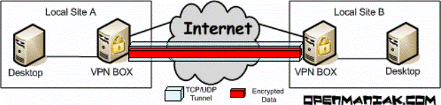
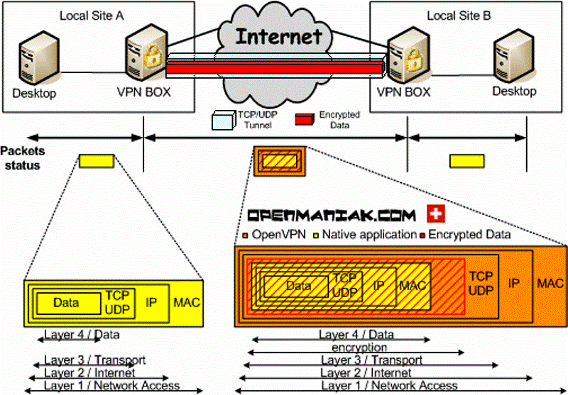

[<- До підрозділу](README.md)

# Про VPN: теоретична частина

## Загальні поняття

Віртуальна приватна мережа (**VPN**, **Virtual private network**) — це мережна архітектура для віртуального розширення **приватної мережі**, тобто будь-якої комп’ютерної мережі, яка не є загальнодоступною, через одну чи декілька інших загальнодоступних мереж (наприклад Інтернет). Передбачається що ці загальнодоступні мережі є ненадійними, оскільки вони не контролюються суб’єктом, який прагне реалізувати VPN, а приватні мережі при цьому потребують ізоляції, тобто бути невидимими з загальнодоступної мережі.

VPN може розширити доступ до приватної мережі для користувачів, які не мають прямого доступу до неї, наприклад, до офісної мережі, що забезпечує безпечний доступ ззовні через Інтернет. Це досягається створенням зв'язку між обчислювальними пристроями та комп'ютерними мережами за допомогою протоколів мережного тунелювання.

**Тунель** у контексті мережевих технологій — це захищений канал, створений між двома точками в мережі для передачі даних. Тунелювання — це спосіб інкапсуляції даних та їхньої передачі, який забезпечує:

- Приховування оригінального трафіку
- Шифрування даних
- Анонімність і безпеку

Таким чином, використовуючи тунелі між спеціальними службами на мережних пристроях, можна зробити VPN безпечним для використання поверх незахищеного середовища зв’язку (наприклад, публічного Інтернету). При цьому можуть використовуватися різні технології VPN та протоколи тунелювання (див. нижче), які у свою чергу використовують певні методи та аглоритми шифрування. Таким чином, замість того щоб прокладати власну мережну інфраструктуру (кабелі, мережні пристрої, тощо), використовується загальнодоступна інфраструктура (наприклад Інтернет) поверх якої прокладається захищений тунель. Так, наприклад на рис.1 дві локальні мережі `Site A` та `Site B` поєднані в одну приватну мережу, використовуючи тунель між VPN службами, які позначені як  `VPN BOX`. Тобто, якщо опустити деталі та багатоваріантність, усі пристрої в мережах  `Site A` та `Site B` будуть спілкуватися між собою, наче ці мережі вони з'єднані між собою маршрутизаторами `VPN BOX`.   

рис.1. Тунель між двома VPN вузлами поєднані Internet

Багато компаній надають також комерційні сервіси VPN, які надають доступ до приватних мереж клієнтів через власну інфраструктуру в Інтернеті, підключаючи до них своїх клієнтів за допомогою відповідних протоколів тунелювання VPN. Здебільшого цей підхід не вимагає від користувачів розуміння принципів функціонування і налаштовується шляхом простих дій активацій. У той же час, клієнт має довіряти постачальникам таких сервісів, а самі послуги як правило платні.  

Принцип роботи VPN залежить від того, на яких технологіях і протоколах побудовано VPN. Як вже зазначалося, для передачі мережних повідомлень з однієї сторони на іншу використовується конкретний протокол тунелювання. Мета полягає в тому, щоб отримати мережні повідомлення від програм на одній стороні тунелю та відтворити їх на іншій стороні. 

Слід зазначити, що є окремі програми, які реалізують функції тунелювання або проксі-сервера для себе, і часто також називаються VPN. Однак, якщо такі програми не роблять функції обміну даними доступними в якості мережного інтерфейсу, вони не вважаються реалізаціями VPN. При цьому такі програми можуть досягати тієї самої чи подібної мети кінцевому користувачу щодо обміну приватним вмістом із віддаленою мережею. Прикладом є захищені браузери типу Tor або плагіни до браузерів які вмикають опцію VPN за необхідності. Тобто включення режиму VPN для браузера ніяк не впливає на обмін інших програм на тому ж самому пристрої. Порівняння плагіну з VPN-мережами показаний таблиці 1.

Таб.1. Порівняння VPN VPN-плагінів для браузерів. 

| Характеристика       | VPN                                    | VPN-плагін для браузера                        |
| -------------------- | -------------------------------------- | ---------------------------------------------- |
| Зона дії             | Весь трафік пристрою                   | Трафік лише браузера                           |
| Шифрування           | Захищає всі дані                       | Шифрування може бути відсутнім                 |
| Зміна IP-адреси      | Повна зміна                            | Лише в межах роботи браузера                   |
| Складність установки | Потрібен окремий застосунок або служба | Легко встановлюється як розширення до браузера |

## Конфігурації топології VPN

Конфігурації віртуальних приватних мереж можна класифікувати залежно від призначення, що робить різні стратегії тунелювання відповідними для різних топологій.

### Віддалений доступ (Remote access tunnels)

Конфігурація віддаленого доступу, яку можна назвати "хост до мережі" (або клієнта до серверу) аналогічна приєднанню одного або кількох комп’ютерів до однієї віддаленої мережі, до якої вони не можуть бути підключені безпосередньо. Цей тип розширення забезпечує доступ комп’ютера до локальної мережі віддаленого розташування, або будь-якої більш широкої корпоративної мережі, наприклад внутрішньої мережі компанії. Кожен комп’ютер відповідає за активацію власного тунелю до мережі, до якої він хоче приєднатися. Для кожного тунелю приєднана мережа знає лише про один віддалений хост. Це може бути використано для віддалених працівників або для надання людям доступу до їхніх приватних домашніх чи корпоративних ресурсів, не відкриваючи їх у загальнодоступному Інтернеті. 

Тунелі віддаленого доступу можуть працювати як на вимогу, так і 24/7. Оскільки місцезнаходження віддаленого хоста зазвичай невідоме центральній мережі, поки хост не спробує досягти його, то для реалізації необхідно, щоб віддалений хост ініціював зв’язок із центральною мережею, до якої він має доступ.

### Сайт-сайт (Site-to-site)

Конфігурація "сайт-сайт" з'єднує дві мережі. Ця конфігурація розширює мережу в географічно розрізнених місцях. Тунелювання здійснюється лише між двома пристроями (наприклад, маршрутизаторами, брандмауерами, шлюзами VPN, серверами тощо), розташованими в обох мережевих розташуваннях. Потім ці пристрої роблять тунель доступним для інших хостів локальної мережі, які прагнуть досягти будь-якого хоста з іншого боку. Це використовуються в тому випадку, коли необхідно підтримувати стабільний зв’язок мереж між собою, наприклад мережі офісу з головним офісом, або центром обробки даних. У цьому випадку будь-яка сторона може бути налаштована на ініціювання зв’язку, якщо вона знає, як зв’язатися з іншою стороною в середній мережі. 

Як правило, окремі особи взаємодіють із мережами VPN використовуючи віддалений доступ, тоді як компанії, як правило, використовують з’єднання «сайт-сайт» для сценаріїв «бізнес-бізнес», хмарних обчислень і філій. Однак ці технології не є взаємовиключними, і в дуже складній бізнес-мережі їх можна об’єднати, щоб забезпечити віддалений доступ до ресурсів, розташованих на будь-якому конкретному місці, наприклад система замовлення, яка знаходиться в центрі обробки даних (рис.2). Зверніть увагу що лініями показані тунелі, якими з'єднуються відповідні VPN служби. 

рис.2. Огляд з’єднання VPN, де показано конфігурації інтрамережі «сайт-сайт» і конфігурації віддаленої роботи, що використовуються разом

## Класифікації VPN

Окрім загальної конфігурації топології, VPN також можна класифікувати за наступними ознаками:

- протоколом тунелювання, який використовується 
- розташуванням кінцевої точки тунелю, наприклад, на межі споживача або межі постачальника мережі
- наданими функціями безпеки
- рівень OSI, який вони представляють для з’єднувальної мережі, наприклад зв’язок канального рівня (L2) або мережного рівня (L3)
- кількість одночасних дозволених тунелів
- відносини між суб’єктом, який реалізує VPN, і власником/провайдером мережевої інфраструктури, і чи довіряє перший середовищу провайдер чи ні.

Для адаптації до наведених вище характеристик існує дуже багато технологій VPN, кожна з яких забезпечує різні можливості мережного тунелювання та різне охоплення або інтерпретацію моделі безпеки (рис.3).

рис.3. Дерево класифікації VPN спочатку базується на топології, а потім на використовуваній технології

## Вбудована та стороння підтримка VPN

Постачальники та розробники операційних систем зазвичай пропонують власну підтримку вибору протоколів VPN, які можуть змінюватися протягом багатьох років, оскільки деякі з них виявилися небезпечними щодо сучасних вимог і очікувань, а також з’явилися інші.

### Підтримка VPN у споживчих операційних системах

Операційні системи настільних комп’ютерів, смартфонів та інших пристроїв кінцевого користувача зазвичай підтримують налаштування VPN віддаленого доступу за допомогою графічних інструментів або інструментів командного рядка. Однак через різноманітність протоколів VPN (часто нестандартних) існує багато програм сторонніх розробників, які реалізують додаткові протоколи, які ще не підтримуються або більше не підтримуються ОС.

Наприклад, Android не мав вбудованої підтримки IPsec IKEv2 до версії 11, і людям потрібно було встановлювати програми сторонніх розробників, щоб підключити такий тип VPN, тоді як Microsoft Windows, BlackBerry OS та інші підтримували її в минулому.

Навпаки, Windows не підтримує звичайну власну конфігурацію VPN віддаленого доступу IPsec IKEv1 (зазвичай використовується рішеннями Cisco та Fritz!Box VPN), що робить використання програм сторонніх розробників обов’язковим для людей і компаній, які покладаються на такий протокол VPN.

### Підтримка VPN на мережних пристроях

Часто мережні пристрої, такі як брандмауери або маршрутизатори, вже включають функції шлюзу VPN. При цьому їхні інтерфейси адміністрування наприклад через Веб-доступ полегшують налаштування віртуальних приватних мереж із вибором підтримуваних протоколів, які були інтегровані для легкого налаштування з коробки. Перелік таких протоколів може бути досить обширним, задовольняючи потенційні потреби користувача.

У деяких операційних системах з відкритим вихідним кодом, призначених для брандмауерів і мережних пристроїв (наприклад, OpenWrt, IPFire, PfSense або OPNsense), можна також додати підтримку додаткових протоколів VPN, встановивши відсутні програмні компоненти або програми сторонніх розробників.

Деякі мережні пристрої можуть підтримувати власні рішення VPN, у той же час, використовуючи стандартні протоколи тунелювання. Вони можуть не відкривати тонкі налаштування забезпечуючи типові кейси. Це часто стосується пристроїв, які покладаються на апаратне прискорення VPN для забезпечення вищої пропускної здатності або підтримки більшої кількості одночасно підключених користувачів. Також може бути надана власна інфраструктура VPN за платної підписки, яка зручніша в налаштуванні для менш досвідчених користувачів і підтримується розробником пристроїв.   

## Механізми безпеки

Оскільки VPN використовує в якості транспортування даних ненадійне середовище, варто забезпечити щоб ці дані були захищені з точки зору:

- конфіденційності, щоб запобігти розкриттю приватної інформації або аналізу даних; тобто навіть якщо мережний трафік аналізується на рівні пакетів (за допомогою мережного аналізатору, наприклад Wireshark), зловмисник побачить лише зашифровані дані, а не необроблені дані;
- цілісності повідомлень, тобто виявлення та відхилення підроблених повідомлень; тобто усі пакети даних захищені від підробки за допомогою додаткового коду автентифікації повідомлення, який формується при відправці і перевіряється при отриманні.

У той же час VPN не передбачають анонімність користувачів, які підключаються. Однак VPN може використовувати протоколи, які підвищують конфіденційність користувача з точки зору видимості в загальнодоступній мережі.

VPN передбачає обмеження доступу до приватної мережі неавторизованих користувачів. Більшість протоколів передбачають автентифікацію на кінцях тунелю через різні механізми:

- може відбуватися одразу після запуску VPN, наприклад, за допомогою простого додавання білої IP-адреси кінцевої точки в білий список, 
- може відбуватися після того, як фактичні тунелі вже активні, наприклад, за допомогою веб-порталу приєднання 

VPN із віддаленим доступом, які зазвичай ініціюються користувачем, можуть використовувати паролі, біометричні дані, двофакторну автентифікацію або інші криптографічні методи. Людей, які ініціюють цей вид VPN з невідомих довільних мережних місць, також називають «воїнами дороги»(road-warriors). У таких випадках у якості безпечних факторів автентифікації неможливо використовувати вихідні властивості мережі, наприклад, IP-адреси, тому потрібні більш надійні методи. 

VPN типу "сайт-сайт" часто використовують паролі (спільні ключі) або цифрові сертифікати. Залежно від протоколу VPN вони можуть зберігати ключ, щоб тунель VPN відкривався автоматично без втручання адміністратора, або тільки при ручному ініціювання запуску служби.

## Варіанти тунелювання TUN/TAP

Як вже зазначалося, будь яка з реалізацій VPN потребує тунелювання. Тунель працює за принципом включення (**інкапсуляції**) мережних пакетів що проходять через тунель в захищені пакети протоколу тунелю. Якщо провести аналогію, то це як паром (пакет протоколу тунелю), який перевозить різноманітні транспортні засоби (мережні пакети локальних мереж). При цьому, виникає питання: пакети якого рівня мережі треба переносити через тунель? Адже на канальному рівні ми маємо справу з кадрами (наприклад Ethernet), на мережному - з IP-датаграмами, на транспортному з пакетами TPC або UDP і т.д. Деякі рішення VPN надають вибір користувачеві, надаючи різні режими тунелювання. Серед типових пропозицій є вибір між режимами TUN та TAP.        

Режими TUN і TAP — це по факту інтерфейси, які використовуються для роботи з віртуальними мережами. Вони забезпечують тунелювання трафіку на різних рівнях мережної моделі. 

Режим **TUN** (Тунельний інтерфейс) працює на рівні IP (мережевий рівень). Особливості:

- Тунелює IP-пакети. Тобто IP-пакети які необхідно переслати по тунелю, шифруються і інкапсулюються в пакет, що є носієм по тунелю. Наприклад, якщо для трафіку в тунелю використовується OpenVPN поверх UDP, то усі IP пакети будуть зашифровані і відправлені по тунелю як корисне навантаження пакету UDP.   
- Використовується для створення VPN-з'єднань точка-точка  (Point-to-Point) або (Clent-Server). У будь якому випадку, з'єднуються попарно два кінцеві пристрої, які можна вважати з'єднані тунелями маршрутизатори.   
- Обробляє лише IP-трафік (IPv4, IPv6).
- Приклад застосування: OpenVPN у режимі маршрутизації (routing).

Обмеження цього режиму в тому, що зв’язок, програмне забезпечення та мережа, які базуються на рівні 2 і широкомовних пакетах, наприклад NetBIOS, що використовується в мережах Windows, можуть підтримуватися не повністю, як у локальній мережі. Для подолання цього обмеження можна використати режим TAP.

Режим **TAP** (Тунельний доступний порт) працює на канальному рівні (наприклад Ethernet). Особливості:

- Тунелює кадри (наприклад Ethernet). Наприклад, якщо для трафіку в тунелю використовується OpenVPN поверх TCP, то усі кадри Ethernet будуть зашифровані і відправлені по тунелю як корисне навантаження TCP (рис.4).   
- Дозволяє передавати не лише IP-трафік, але й кадри інших протоколів (наприклад, ARP)
- Імітує мережний адаптер у віртуальній мережі.
- Приклад застосування: OpenVPN у режимі моста (bridging), коли потрібен доступ до локальної мережі.

Режим TUN підходить для ефективної передачі IP-трафіку між різними мережами, тоді як режим TAP потрібен у тому випадку, коли необхідно передавати весь Ethernet-трафік, включно з кадрами інших протоколів, що звісно завантажує трафік тунелю. 

Зверніть увагу що для пристроїв, які показані на рис.4 як `Desktop` тунелювання є прозорим, оскільки цим процесом займаються пристрої з назвою `VPN BOX`. Ethernet кадри, що показані жовтим кольором - внутрішній трафік приватної мережі (аналогія - транспорт на паромі). Кадри помічені помаранчевим - це трафік всередині тунелю (аналогія - паром). У цьому випадку всі внутрішні кадри приватної мережі, перед передачею по тунелю шифруються як корисне навантаження пакету TCP.      

рис.4. Стан пакета під час подорожі всередині локальної мережі та VPN в режимі TAP (на рівні кадрів L2)

## VPN протоколи

Віртуальні приватні мережі базуються на протоколах тунелювання та можуть бути поєднані з іншими мережними або програмними протоколами, надаючи додаткові можливості та іншу модель безпеки.

### IPsec

Безпечний Інтернет-протокол (IPsec, Internet Protocol Security) наріз є обов’язковим для всіх сумісних із стандартами реалізацій IPv6, але він також широко використовується з IPv4. Його конструкція відповідає більшості цілей безпеки: доступність, цілісність і конфіденційність. IPsec використовує шифрування, інкапсулюючи IP-пакет у пакет IPsec (рис.5). У кінці тунелю відбувається зворотній процес (деінкаплсуялція), де оригінальний IP-пакет розшифровується та пересилається до призначення. Тунелі IPsec налаштовані за протоколом Internet Key Exchange (**IKE**) версії 1, у той же час їх часто об’єднують із протоколом тунелювання рівня 2 (**L2TP**, Layer 2 Tunneling Protocol). Таке поєднання дозволяє повторно використовувати існуючі реалізації, пов’язані з L2TP, для більш гнучких функцій автентифікації (наприклад, Xauth), бажаних для конфігурацій віддаленого доступу. Для забезпечення функціональності IPsec VPN, можуть використовуватися окремо IKE версії 2, створеної Microsoft і Cisco. Основними перевагами є вбудована підтримка автентифікації за допомогою розширюваного протоколу автентифікації (**EAP**, Extensible Authentication Protocol), а також те, що тунель можна легко відновити, коли IP-адреса пов’язаного хоста змінюється (типово для мобільного пристрою). IPsec також часто підтримується мережними апаратними прискорювачами, що робить IPsec VPN бажаним для сценаріїв з низьким енергоспоживанням, так як конфігурації VPN із постійним віддаленим доступом.

рис.5. Фази життєвого циклу тунелю IPSec у віртуальній приватній мережі

### SSL/TLS

Transport Layer Security (SSL/TLS) може тунелювати як трафік усієї мережі (як це робиться в проектах OpenVPN і SoftEther VPN) так і захищати окреме з’єднання. Детально про SSL/TLS можна почитати в темі [Керування ідентифікацією і доступом](../security/teor.md).

Багато постачальників надають можливості віддаленого доступу до VPN через TLS. VPN на основі TLS може підключатися з місць, де підтримується звичайна веб-навігація TLS (HTTPS) без спеціальних додаткових налаштувань, Дві основні цілі SSL/TLS:

- Автентифікація сервера і клієнта за допомогою інфраструктури відкритих ключів (PKI).
- Забезпечення зашифрованого з'єднання для клієнта та сервера для обміну повідомленнями.

Стандартна модель OSI складається з семи рівнів, тоді як чотирирівнева модель більше відповідає архітектурі TCP/IP, яка використовується переважною більшістю програм. SSL розташований між прикладним і транспортним рівнями та шифрує прикладний рівень.

рис.6. Розміщення рівня SSL/TLS в стеці TCP/IP

### Інші протоколи

- **DTLS**. Datagram Transport Layer Security (DTLS) – використовується в Cisco AnyConnect VPN і OpenConnect VPN для вирішення проблем, які TLS має з тунелюванням через TCP (SSL/TLS базуються на TCP, і тунелювання TCP через TCP може призвести до великих затримок і з’єднання переривається).
- **MPPE**. Microsoft Point-to-Point Encryption (MPPE) працює з протоколом тунелювання точка-точка та в кількох сумісних реалізаціях на інших платформах.
- **SSTP**. Протокол Microsoft Secure Socket Tunneling Protocol (SSTP) тунелює трафік протоколу Point-to-Point Protocol (PPP) або Layer 2 Tunneling Protocol через канал SSL/TLS (SSTP було представлено в Windows Server 2008 і Windows Vista Service Pack 1).
- **MPVPN**. Multi Path Virtual Private Network (MPVPN). Компанія Ragula Systems Development володіє зареєстрованою торговою маркою «MPVPN».
- **SSH VPN**. Secure Shell (SSH) VPN – OpenSSH пропонує VPN-тунелювання (на відміну від переадресації портів) для захисту віддалених з’єднань із мережею, міжмережевих з’єднань і віддалених систем. Сервер OpenSSH забезпечує обмежену кількість одночасних тунелів. Сама функція VPN не підтримує особисту автентифікацію. SSH частіше використовується для віддаленого підключення до машин або мереж замість VPN-з’єднання між сайтами.
- **WireGuard**. WireGuard — це протокол. У 2020 році підтримку WireGuard було додано в ядра Linux і Android, відкривши його для впровадження постачальниками VPN. За замовчуванням WireGuard використовує протокол Curve25519 для обміну ключами та ChaCha20-Poly1305 для шифрування та автентифікації повідомлень, але також включає можливість попереднього спільного використання симетричного ключа між клієнтом і сервером.
- **OpenVPN.** OpenVPN — це безкоштовний протокол VPN із відкритим вихідним кодом на основі протоколу TLS. Він підтримує ідеальну пряму секретність і більшість сучасних безпечних наборів шифрів, як-от AES, Serpent, TwoFish тощо. Наразі він розробляється та оновлюється OpenVPN Inc., некомерційною організацією, що надає безпечні Технології VPN. Детальніше про цей протокол можете почитати [в цьому параграфі](openvpn.md) посібника.
- **CIPE**. Crypto IP Encapsulation (CIPE) — це безкоштовна реалізація VPN з відкритим вихідним кодом для тунелювання пакетів IPv4 через UDP за допомогою інкапсуляції. CIPE був розроблений для операційних систем Linux Олафом Тітцем, а портація на Windows реалізована Деміоном К. Вілсоном. Розробка CIPE завершилася в 2002 році.

## Надійні мережі доставки

Довірені мережі VPN не використовують криптографічне тунелювання; замість цього для захисту трафіку вони покладаються на безпеку мережі одного провайдера. 

- Multiprotocol Label Switching (MPLS) часто накладається на VPN, часто з контролем якості обслуговування через надійну мережу доставки.
- L2TP, який є заміною на основі стандартів і є компромісом, який використовує хороші характеристики кожного з двох власних протоколів VPN: Cisco Layer 2 Forwarding (L2F)(застарілий станом на 2009 рік) і Microsoft Point-to-- Протокол точкового тунелювання (PPTP).

З точки зору безпеки VPN має або довіряти базовій мережі доставки, або забезпечувати захист за допомогою механізму в самій VPN. За винятком випадків, коли довірена мережа доставки працює лише серед фізично захищених сайтів, як надійним, так і безпечним моделям потрібен механізм автентифікації, щоб користувачі могли отримати доступ до VPN.

Даний матеріал розроблений на основі наступних джерел:

- [Вікіпедія](https://en.wikipedia.org/wiki/Virtual_private_network) 

- https://openmaniak.com

Теоретичне заняття розробив [Олександр Пупена](https://github.com/pupenasan). 

Якщо Ви хочете залишити коментар у Вас є наступні варіанти:

- [Обговорення у WhatsApp](https://chat.whatsapp.com/BRbPAQrE1s7BwCLtNtMoqN)
- [Обговорення в Телеграм](https://t.me/+GA2smCKs5QU1MWMy)
- [Група у Фейсбуці](https://www.facebook.com/groups/asu.in.ua)

Про проект і можливість допомогти проекту написано [тут](https://asu-in-ua.github.io/atpv/)
