[<- До підрозділу](README.md)		[Коментувати](#feedback)

# Інтегрування Node-RED з застосунком Google Sheet: практична частина

**Тривалість**: 2 акад год (1 пара)

**Мета:** Навчитися інтегрувати застосунки рівня зв'язку з об'єктом з хмарними застосунками 

**Лабораторна установка**

- Апаратне забезпечення: ПК
- Програмне забезпечення: Node-RED, хмарні застосунки Google Sheet, сервіси Telegram

## Порядок виконання роботи 

У цій лабораторній роботі необхідно забезпечити інтегрування Node-RED з хмарним застосунком `Google Sheet` (Електронна таблиця) та сервісом `Telegram`. Це дасть можливість забезпечити передачу даних з RaspberryPI на хмару для аналізу та взаємодію з віддаленим користувачем. Node-RED можна запускати як на ПК так і на RPI.   

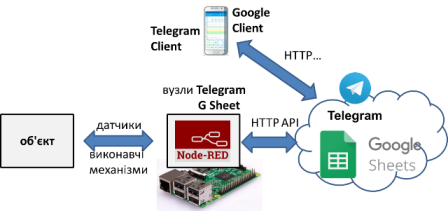

рис.1.Структура системи з використанням хмарних застосунків.

### Пре-реквізити

Для лабораторної роботи необхідно мати встановлений Node-RED, та мінімальні знання його використання.

- [ ] Якщо у Вас не встановлений Node-RED, пройдіть практичне заняття [Вступ до Node-RED: практичне заняття](../../nodered/intro/lab.md)
- [ ] Якщо у Вас немає облікового запису Google - створіть його [на сайті](https://www.google.com/). Це безкоштовно, потребується тільки поштова скринька і номер телефону. 

### 1.Створення проєкту та сервісного аккаунту Google 

#### 1.1. Створення проекту

У цьому пункті необхідно за допомогою консолі Google створити проєкт.  

- [ ] Зайдіть на сторінку налаштування API для сервісів, якими Ви користуєтеся на GoogleCloud  [https://console.cloud.google.com/apis](https://console.cloud.google.com/apis). 
- [ ] При першому входженні Вам запропонують прийняти умови використання. Для того, щоб користуватися сервісами виставте опцію "Приймаю умови використання" після чого натисніть кнопку "Прийняти і продовжити" 

- [ ] Натисніть `Select Project`

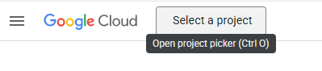

рис.1.

- [ ] Натисніть `New Project` , дайте назву проекту і натисніть `Create`

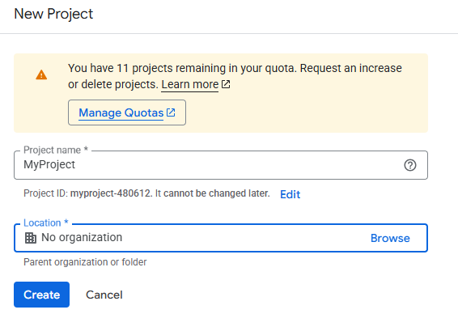

рис.2. Створення проекту (назва)

#### 1.2. Створення сервісного аккаунту

У цьому пункті необхідно за допомогою консолі Google створити сервісний аккаунт від імені якого буде проводитися доступ до API. 

- [ ] Зайдіть в головне меню і перейдіть в розділ створення сервісних аккаунтів 


рис.3. Перехід до сервісних акаунтів

- [ ] Натисніть `Create service account` 

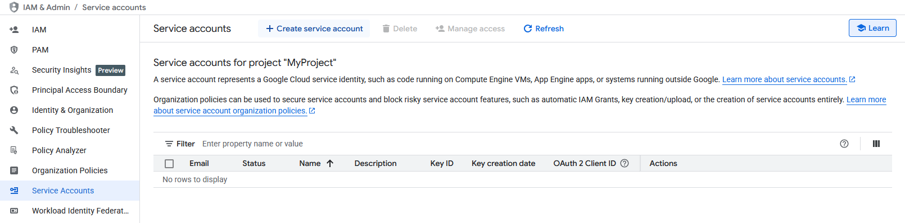

рис.4. Створення сервісного акаунту

- [ ] На першому кроці означте назву, потім натисність `Create and continue`

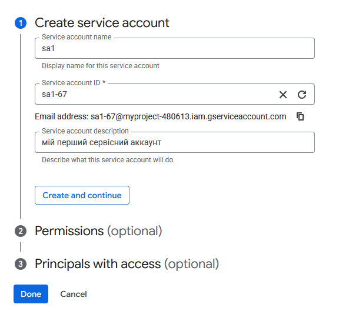

рис.5. 

- [ ] На другому кроці можна поки нічого не вписувати, а просто натиснути `Continue`.  
- [ ] На третьому кроці кроці виберіть `Done`.

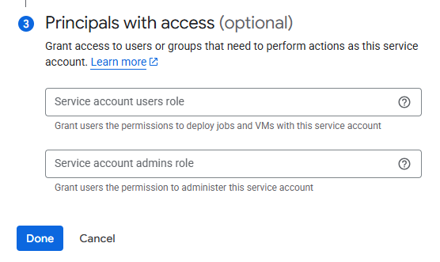

 рис.6.

- [ ] Далі відкриється перелік усіх сервісних аккаунтів. Виберіть новостворений сервісний аккаунт.

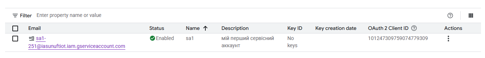

рис.7. 

- [ ] Подивіться налаштування сервісного аккаунту (рис.8).

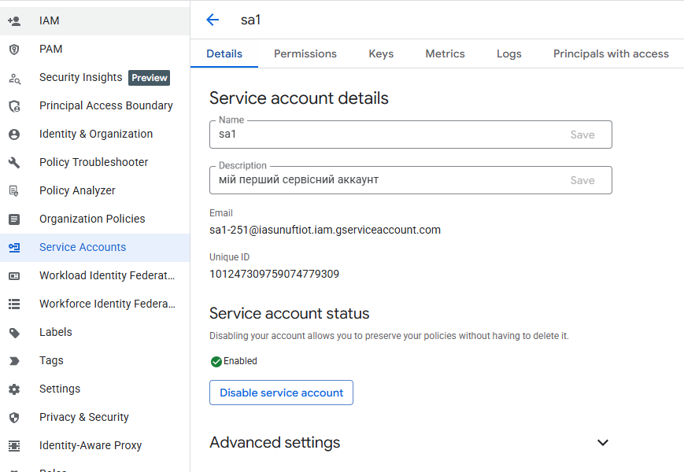

рис.8. 

### 2. Надання доступу до сервісів та таблиць Google Sheet через сервісний аккаунт

#### 2.1 Надання доступу до Google Sheets API

`Google Sheet` - це хмарний застосунок від Google для роботи з електронними таблицями. За функціональністю і принципами роботи він схожий на `Microsoft Excel`. Усі створені таблиці зберігаються на Гугл Диску (`Google Drive`)  У цьому пункті необхідно забезпечити доступ до Google Sheet API для даного проєкту, а також надати доступ до потрібної таблиці сервісному аккаунту.

- [ ] Перейдіть на сторінку бібліотеку сервісів `API & Services -> Library`. 

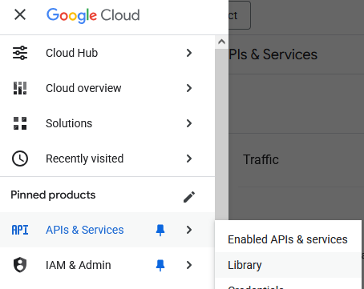

рис.9.

- [ ] У розділі Google Workspace виберіть Google Sheets API
- [ ] Натисніть `Enable` для активації доступу до цього сервісу в межах проєкту.

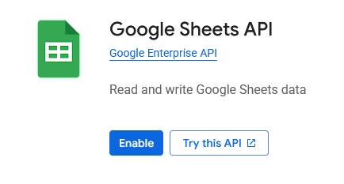

рис.10. Включення активації сервісу

#### 2.2.Створення таблиці `Google Sheet` 

- [ ] Зайдіть на головну сторінку [Google](https://www.google.com/), зайдіть в застосунок `Google Sheet`(`Таблиці`) і створіть нову таблицю.

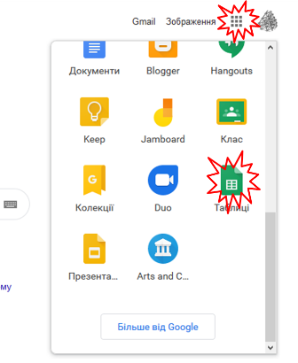

рис.11. Створення таблиці Google Sheet

Альтернативно можна відразу перейти [на сторінку](https://docs.google.com/spreadsheets)  

- [ ] У новому вікні натисніть кнопку "+" (створити) щоб створити нову електронну таблицю

- [ ] Змініть назву документу на якусь більш прийнятну, наприклад RPIData

- [ ] Поділіться документом з сервісним аккаунтом за його іменем, перед цим приберіть опцію `Сповістити`

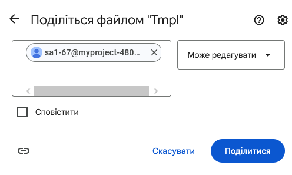

рис.12. Надання прав сервісному аккаунту

### 3. Інтегрування Node-RED з Google Sheet

У даній частині лабораторної роботи необхідно забезпечити запис значень з Node-RED в електронну таблицю, що обслуговується хмарним електронним застосунком `Google Sheet`. 

- [ ] Зупиніть Node-RED, якщо він запущений.

- [ ] Якщо у Вас не активовано опція використання проєктів:

- у папці користувача перейменуйте файл минулого виконання `flow.json` щоб Node-RED запускався з чистого аркушу; як це зробити написано у [Вступ до Node-RED: практичне заняття](https://github.com/asu-in-ua/atpv/blob/main/nodered/sql/lab.md)
- запустіть Node-RED

- [ ] Якщо у Вас активована опція використання проєктів:

- запустіть Node-RED
- створіть новий проєкт

#### 3.1.Встановлення бібліотеки node-red-contrib-google-sheets

- [ ] запустіть Node-RED

- [ ] встановіть бібліотеку `node-red-contrib-google-sheets` 

#### 3.2. Створення фрагменту для наповнення буферу

У даному пункті необхідно створити фрагмент, який буде вміщувати буфер останніх 60-ти значень імітованих змінних `rad ` та `val` а також дати та часу їх зміни. Такий буфер можна організувати різним чином, однак для спрощення були використані властивості масивів в Java Script як черг та стеків. Кожне нове обчислення записується на верх масиву. Таким чином, спочатку "буфер-масив" буде наповнюватися аж до 60-го елементу. Коли елементів стане більше ніж 60 (тобто 61), нижні елементи виймаються, і масив "зсувається" вниз. І так кожного разу при виклику функції. Для збереження даних масиву між викликами використовується контекст потоку. 

Про всяк випадок, зроблена також перевірка на переповнення масиву: коли кількість елементів повинна бути 60, а вона все одно більша - масив обрізається до 60-ти елементів. Така ситуація не повинна відбуватися, але бажано передбачати такі випадки.   

- [ ] Запустіть Node-RED, якщо він не запущений
- [ ] Створіть новий потік з назвою `clouds`.
- [ ] Добавте туди фрагмент, який наведений на рисунку, код функції наведений під рис. 13.  

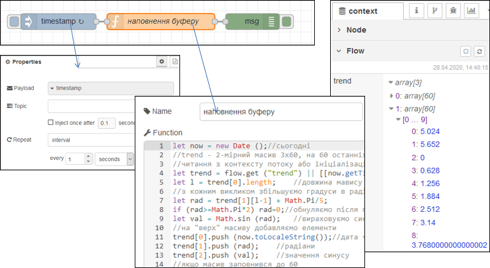

рис.13. Фрагмент програми для запису даних в масив

```javascript
let now = new Date ();//сьогодні
//trend - 2-мірний масив 3x60, на 60 останніх значень 
//читання з контексту потоку або ініціалізація масиву-буферу
let trend = flow.get ("trend") || [[now.toLocaleString()],[0],[0]];
let l = trend[0].length;    //довжина мавису
//з кожним викликом збільшуємо градуси в радіанах
let rad = trend[1][l-1] + Math.PI/5;   
if (rad>=Math.PI*2) rad=0;//обнуляємо після повного кола
let val = Math.sin (rad);   //вираховуємо синус
//на "верх" масиву добавляємо елементи 
trend[0].push (now.toLocaleString());//дата час
trend[1].push (rad);    //радіани
trend[2].push (val);    //значення синусу
//якщо масив заповнився до 60
if (trend[0].length >60){
    trend[0].shift ();//вилучаємо перший (найстаріший) елемент
    trend[1].shift ();
    trend[2].shift ();
    //після цього масиви повинні зменшитися на 1 елемент (60) 
    //і зсунутися вниз
    //у випадку, якщо раптом елементів більше 60
    //наприклад були добавлені випадково стороннім кодом
    //зробити кількість елементів =60
    trend[0].length = 60;//
    trend[1].length = 60;
    trend[2].length = 60; 
}
flow.set ("trend", trend);//записати в контекст потоку
return msg;
```

- [ ] зробіть розгортання потоку

- [ ] проаналізуйте контекст потоку, як він наповнюється з кожною секундою, він повинен мати вигляд як на рис.8.12  (не забудьте натискати кнопку оновлення)

#### 3.4.Створення фрагменту запису в електронну таблицю значень буферу 

- [ ] Користуючись рекомендаціями щодо [роботи з базовими функціями читання та запису Google Sheet](https://pupenasan.github.io/NodeREDGuidUKR/google/googlesheet.html) :

  надайте доступ до Гугл таблиці створеному раніше сервісному аккаунту

- [ ] добавте наступний фрагмент потоку.

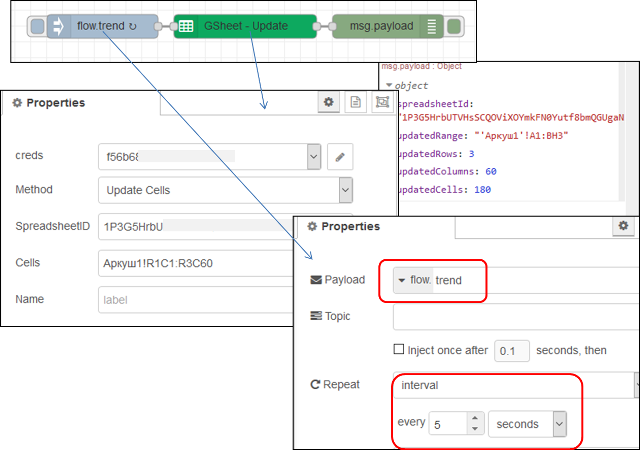

рис.14. Фрагмент запису в електронну таблицю значень буферу

- [ ] зробіть розгортання потоку
- [ ] перейдіть до Гугл таблиці там повинні відображатися дані з буфера і кожні 5 секунд оновлюватися

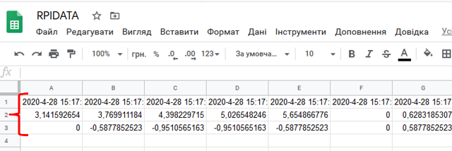

рис.15. Таблиця з записаними даними 

#### 3.5.Створення діаграми

- [ ] Виділіть три рядки з даними і створіть по ним діаграму залежності значень змінних від часу

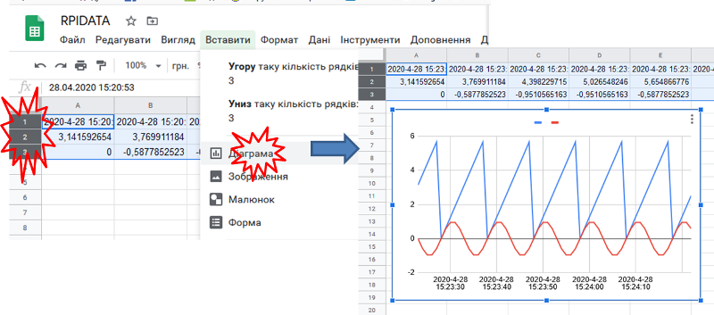

рис.16. Відображення діаграми за записаними в Google Sheet даними 

## Джерела

1. 


## Автори


Практичне заняття розробив  [Олександр Пупена](https://github.com/pupenasan). 

## Feedback

Якщо Ви хочете залишити коментар у Вас є наступні варіанти:

- [Обговорення у WhatsApp](https://chat.whatsapp.com/BRbPAQrE1s7BwCLtNtMoqN)
- [Обговорення в Телеграм](https://t.me/+GA2smCKs5QU1MWMy)
- [Група у Фейсбуці](https://www.facebook.com/groups/asu.in.ua)

Про проект і можливість допомогти проекту написано [тут](https://asu-in-ua.github.io/atpv/)
