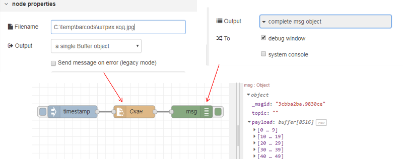
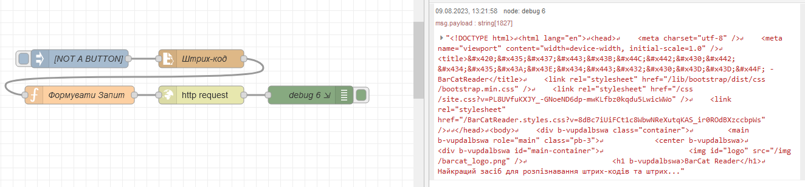
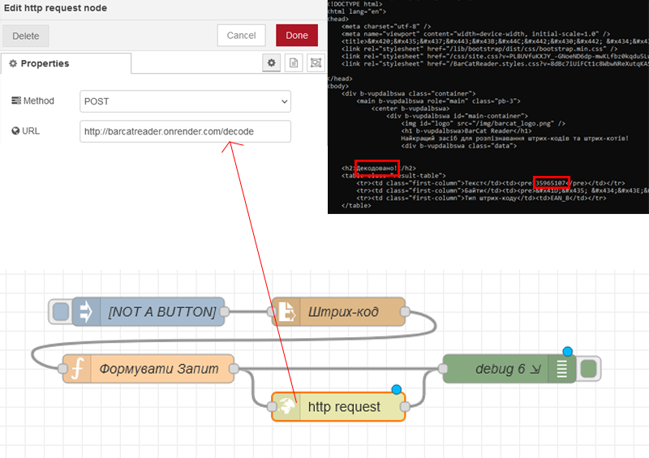
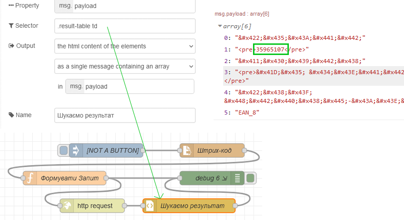
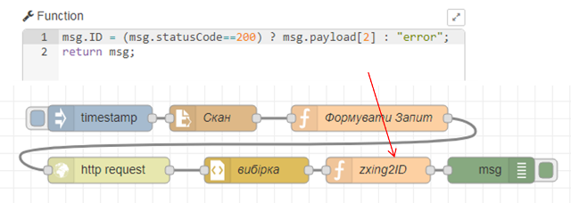
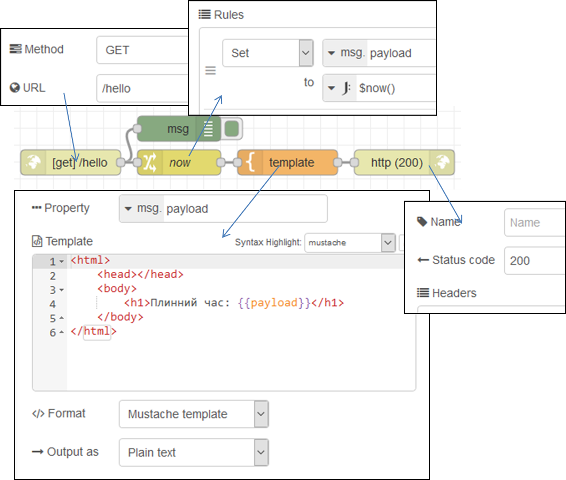

[<- До підрозділу](README.md) 			[Коментувати](#feedback)

# Робота з HTTP в Node-RED: практичне заняття

**Тривалість**: 2акад. години.

**Мета:** навчитися користуватися вузлами HTTTP в Node-RED

**Лабораторна установка**

- Апаратне забезпечення: ПК. 
- Програмне забезпечення: Node-RED.

## Порядок виконання роботи 

Дане практичне заняття передбачає попереднє виконання [Протокол HTTP: практична частина](../../nets/http/lab.md). У цій роботі необхідно розробити програму в Node-RED для визначення штрих-коду по зображенню, використовуючи сервіси <https://barcatreader.onrender.com/> . 

### 1. Підготовчі роботи

- [ ] На диску `C:\` створіть директорію «Temp», якщо вона ще не існує. 
- [ ] Скопіюйте в папку `C:\Temp\barcods` файл з зображенням штрих-коду, що використовувався в попередній частині, наприклад взятий [звідси](https://barcatreader.onrender.com/Samples). 

### 2. Читання файлу

- [ ] Запустіть Node-RED, якщо він не запущений. 

- [ ] Створіть нову вкладку

- [ ] З [довідника](https://pupenasan.github.io/NodeREDGuidUKR/files/) ознайомтеся з вбудованими функціями роботи з файлами. Ці вузли детально розглядаються на інших заняттях. 
- [ ] З розділу `Storage` палітри вузлів вставте вузол `File in`. 
- [ ] Налаштуйте його таким чином, щоб він зчитував дані з файлу з штрих-кодом та виводив його вміст на панель відлагодження (Debug) див.рис.2.14. Зверніть увагу, що виведення в `Debug` треба робити як `complete msg object` а не як `msg.payload`.  

  

рис.2.14. Фрагмент програми в Node-RED для читання файлу

- [ ] Зробіть розгортання потоку, та з використанням панелі відлагодження подивіться що зміст файлу виводиться як масив байт (рис.2.14). 

### 3. Формування запиту

Для формування запиту необхідно сформувати на вході вузла `HTTP request` його заголовки та тіло. З попередньої частини роботи видно, що для отримання штрих-коду по зображенню необхідно сформувати запит з методом POST, який буде багато-частинним, тобто складатися з розділів, що відокремлюються межами. У даному випадку розділ є тільки один, який включає вміст файлу зображення.  

- [ ] Для пришвидшення виконання роботи імпортуйте в потік підготовлений вузол «Формувати запит», скопіюйте код нижче і імпортуйте в потік через меню імпорту. 

```json
[
    {
        "id": "d0f382da.60357",
        "type": "function",
        "z": "89f03cbbbd325148",
        "name": "Формувати Запит",
        "func": "//формування корисного навантаження для POST\n//складається зі статичного тексту з описом розділу\n//та змісту розділу, який є типом image/jpeg що береться з файлу\n//деталі - https://developer.mozilla.org/uk/docs/Web/HTTP/Basics_of_HTTP/MIME_types#multipartform-data \nvar tmp1;//верхня частина - початок розділу\nvar tmp2;//нижня частина - закінчення розділу\ntmp1 = '-----------------------------12818302946532\\r\\n';//межа початку розділу\ntmp1 += 'Content-Disposition: form-data; name=\"file\"; filename=\"1.jpg\"\\r\\n';//заголовок розділу\ntmp1 += 'Content-Type: image/jpeg\\r\\n\\r\\n';//заголовок розділу\ntmp2 = '\\r\\n-----------------------------12818302946532--';//межа кінця розділу\nvar buf1 = Buffer.from(tmp1);//перетворення тексту в бінарний буфер\nvar buf3 = Buffer.from(tmp2);//перетворення тексту в бінарний буфер\nvar ar =[buf1, msg.payload, buf3];//об'єднання буферів та вмісту файлу в один масив\nmsg.payload =  Buffer.concat(ar);//перетворення масиву в один буфер\n\n//формування заголовків запиту\nmsg.headers = {};//об'явили як об'єкт\nmsg.headers[\"host\"] = \"barcatreader.onrender.com\";\nmsg.headers[\"Accept-Encoding\"] = \"identity\";\nmsg.headers[\"accept\"] = \"text/html,application/xhtml+xml,application/xml;q=0.9,*/*;q=0.8\";\nmsg.headers[\"content-type\"]= \"multipart/form-data; boundary=---------------------------12818302946532\";\nvar len = msg.payload.length;//визначаємо довжину тіла запиту\nmsg.headers[\"content-length\"] = len.toString();//перетворюємо в текст \nmsg.headers[\"referer\"] = \"https://barcatreader.onrender.com/decode\";\nmsg.headers[\"connection\"] = \"keep-alive\";\nmsg.headers[\"upgrade-insecure-requests\"] = 1;\nreturn msg;//повідомлення для відправки методом POST",
        "outputs": 1,
        "noerr": 0,
        "initialize": "",
        "finalize": "",
        "libs": [],
        "x": 150,
        "y": 560,
        "wires": [
            [
                "dc4e554a946d0ea7"
            ]
        ]
    }
]
```

- [ ] Уважно ознайомтеся з вмістом функції. 
- [ ] Модифікуйте програму, як це показано на рис.2.15. 

 

 рис.2.15. Формування запиту для декодування скану штрих-коду

- [ ] Зробіть розгортання, активуйте ініціювання повідомлення в `Inject` і подивіться на вміст об’єкту на панелі відлагодження. 
- [ ] Порівняйте результат з заголовками та вмістом запиту POST зпопередньої частини («Знайомство з роботою HTTP»). Що відрізняється? Результат порівняння занотуйте для захисту.

### 4. Відправлення запиту

- [ ] З розділу `network` палітри вузлів вставте вузол `HTTP request`. 
- [ ] Модифікуйте програму, як це показано на рис.2.16. Зверніть увагу, що для кращого тестування бажано вивести як вхідне так і вихідне повідомлення `HTTP request`. 

 

рис.2.16. Відправлення запиту та аналіз відповіді

- [ ] Зробіть розгортання, активуйте Inject, через кілька секунд на панелі відлагодження з’явиться інформація про об’єкт-відповідь. 
- [ ] Порівняйте результат з заголовками та вмістом відповіді POST з попередньої частини («Знайомство з роботою HTTP»).  Результат виконання вважається позитивним, якщо у відповіді буде напис «Decode Succeeded». 
- [ ] Знайдіть числове значення штрих-коду у відповіді.

### 5. Розбирання запиту по частинам

- [ ] Для витягування потрібних елементів з HTML-контенту в Node-RED використовується вузол `HTML`. Ознайомтеся з його роботою з [довідника](https://pupenasan.github.io/NodeREDGuidUKR/parsing/html.html).

- [ ] З розділу `parser` палітри вузлів вставте `HTML`. Модифікуйте програму, як це показано на рис.2.17. Селектор вибирає елемент HTML з class=”result-table” у якого вибирає усі-елементи нащадки з тегом «td».

 

рис.2.17. Модифікований варіант програми 

- [ ] Зробіть розгортання, активуйте `Inject`, через кілька секунд на панелі відлагодження з’явиться інформація про масив вибірки.

- [ ] Добавте вузол-функцію для присвоєння значення `msg.ID` рівним номеру штрих-коду при позитивній відповіді, та `ERROR` при помилці обробки (рис.2.18).  

 

рис.2.18.

- [ ] Зробіть розгортання, активуйте `Inject` та перевірте роботу програми.  

### 6. Робота з `http-in`, `http-response` та `template`

- [ ] Створіть нову вкладку
- [ ] Зробіть фрагмент програми в Node-RED, показаний нижче:



рис.2.19.

- [ ] зверніть увагу, що у вузлі template використовується замінник `{payload}`, що вказує на використання в даному місці властивості Payload
- [ ] зробіть розгортання, на іншій вкладці браузера наберіть наступний шлях: `http://127.0.0.1:1880/hello`  

## Питання до захисту

1. 

 

## Автор


Практичне заняття розробив [Олександр Пупена](https://github.com/pupenasan). 


## Feedback

Якщо Ви хочете залишити коментар у Вас є наступні варіанти:

- [Обговорення у WhatsApp](https://chat.whatsapp.com/BRbPAQrE1s7BwCLtNtMoqN)
- [Обговорення в Телеграм](https://t.me/+GA2smCKs5QU1MWMy)
- [Група у Фейсбуці](https://www.facebook.com/groups/asu.in.ua)

Про проект і можливість допомогти проекту написано [тут](https://asu-in-ua.github.io/atpv/)

