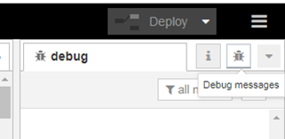
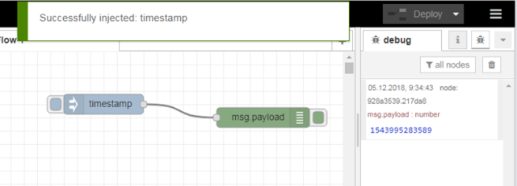
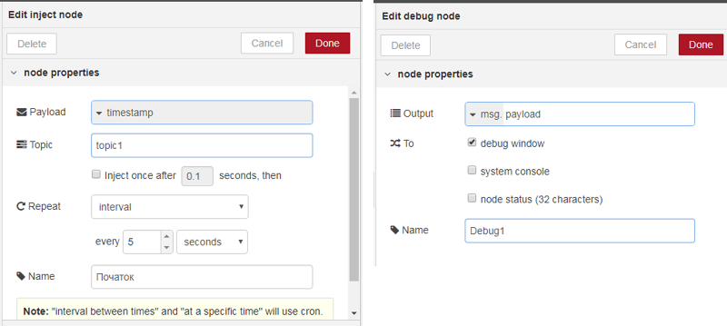
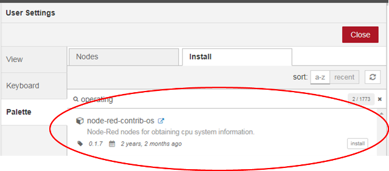
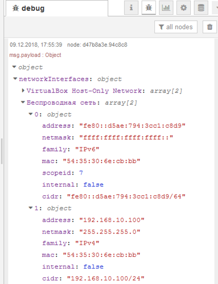

[<- До підрозділу](README.md) 			[Коментувати](#feedback)

# Вступ до Node-RED: практичне заняття

**Тривалість**: 2акад. години.

**Мета:** ознайомлення з можливостями середовища Node-RED.  

**Лабораторна установка**

- Апаратне забезпечення: ПК. 
- Програмне забезпечення: Node-RED.

## Порядок виконання роботи 

Редактор Node-RED функціонує на основі браузера, а програма виглядає як об’єднані в потоки (flow) вузли (node), що вибираються з палітри. Після редагування потоки можуть бути розгорнуті в середовище виконання, яке побудоване на Node.js. Потоки, створені в Node-RED, зберігаються за допомогою JSON, які можна імпортувати та експортувати.

## 1. Інсталяція Node-RED під Windows

Node-RED функціонує на основі **Node.js** - платформа для виконання мережних застосунків, написаних мовою JavaScript, на серверах. Node.js доступна для різних операційних систем, нижче показано як встановити платформу для Windows (Windows 11, Windows 10, Windows 8, Windows 7)

### 1.1. Завантаження Node.JS

- [ ] Завантажте msi-файл Node.JS з сайту <https://nodejs.org>, виберіть LTS версію.

### 1.2. Встановлення Node.JS

- [ ] Запустіть на виконання msi-файл від імені адміністратора і встановіть Node.JS. При виклику діалогових вікон все залишати за замовченням. 

### 1.3. Визначення версії npm

Програмісти, що використовують Node.JS розробили (і розробляють) велику кількість бібліотек, які доступні усім для використання. Ці бібліотеки доступні у вигляді пакунків Node.JS. Для спрощення керування цими пакунками (добавлення, видалення, оновлення і т.п.) використовується менеджер пакунків **npm** ([Node Package Manager](https://uk.wikipedia.org/wiki/Npm)). Для середовища виконання Node.js npm є менеджером пакунків за замовчуванням, і включає в себе клієнт командного рядка (який також називається npm) та онлайн-базу даних публічних та приватних пакунків, яка називається **реєстром npm**. Доступ до реєстру доступний з клієнта, а доступні пакунки можна переглядати та шукати через веб-сайт npm. 

- [ ] Після інсталяції Node.js запустіть командний рядок (CMD), у якому введіть

```bash
node -v
```

повинно вивести версію Node.JS

- [ ] потім введіть

```bash
npm –v
```

повинно вивести версію пакетного менеджера

### 1.4. Інсталяція Node-RED

Node-RED по суті є також комплектом взаємопов'язаних пакунків. Тому його інсталювання проводиться з використанням npm з командою install. 

- [ ] Наберіть в командному рядку 

```bash
npm install -g --unsafe-perm node-red
```

після чого почнеться процедура інсталяції

З іншими деталями встановлення можна ознайомитися [за посиланням ](https://nodered.org/docs/platforms/windows) 

### 1.5. Запуск Node-RED

- [ ] Після інсталяції запустіть Node-RED з командного рядка

```bash
node-red
```

Можуть бути показані повідомлення про пропозицію розблокування брандмауером, з якими треба погодитись. 

Для того, щоб Node-RED виконувався, вікно з командним рядком не можна закривати. Node-RED можна також запускати як службу, однак для даного практичного завдання це робити не потрібно. 

### 1.6. Відкриття редактору

- [ ] Відкрийте браузер, перейдіть до редактору Node-Red, за посиланням <http://127.0.0.1:1880/> 

## 2. Знайомство з Node-RED

Створена програма на Node-RED виконується в **середовищі виконання**. Зрештою ця програма має текстовий вигляд  у форматі JSON (JavaScript Object Notation), але для розробника вона представляється в графічному вигляді.  Для редагування використовується браузер. 

Програма в редакторі Node-RED виглядає як набір закладок, які звуться **потоками** (**Flow**), що виконуються як умовно незалежні підпрограми, які мають свої незалежні змінні (власне сховище). Програма в потоці  це набір **вузлів** (**Node**), які виконуються тільки тоді, коли на їх вхід приходить повідомлення. У свою чергу вузли, як правило, після обробки також формують повідомлення. Для того щоб вузли обмінювалися повідомленнями їх об'єднують інформаційними **дротами** (**wires**). Об'єднані таким чином вузли також називають потоками (Flow).  

Таким чином, коли один вузол формує повідомлення, воно надходить усім іншим вузлам, які з ним пов'язані. Це приводить до їх виклику, у результаті якого вони формують повідомлення, які відправляються іншим вузлам і т.д.  

### 2.1. Ознайомлення з редактором Node-RED.

- [ ] Відкрийте в браузері редактор Node-RED, якщо він ще не відкритий. Ознайомтеся з його основними частинами (рис.1.)

                              

рис.1. Вигляд редактору Node-RED

### 2.2. Розміщення вузлів inject і Debug

Усі доступні типи вузлів відображаються на палітрі вузлів. Їх достатньо просто вибрати і розмістити на робочій області потоку. 

Мабуть найбільш вживані вузли в Node-RED це **inject** (**впорскування**), які ініціюють передачу повідомлень, та **debug** (**налагодження**) - який відображає зміст повідомлення на панелі налагодження. 

- [ ] Виберіть з палітри і розмістіть на робочій області наступні вузли

- `Common`->`inject` 

- `Common`->`Debug`

- [ ] З’єднайте їх між собою. Повинно вийти як на рис.2. Блакитні кружечки показують, що зміна в вузлах ще не відобразилася в середовищі виконання, так як змінена програма не була в ньому розгорнута.  

      

  рис.2. Вигляд програми

### 2.3. Розгортання

При редагуванні потоку, зміни не одразу вступають в дію. Тобто середовище виконання виконує попередню розгорнуту версію програми. Змінені вузли відображаються блакитними кружечками в кутках вузлів (див.рис.2). Щоб повідомити Node-RED, що змінений код варто прийняти і запустити в середовищі виконання, необхідно зробити його **розгортання** (**Deploy**). Розгорнути можна як повністю весь проект так і тільки змінені частини.   

- [ ] В заголовку виберіть пункт `Deploy->Modified Nodes` (див.рис.3), після чого  натисніть Deploy (Розгортання). 

  

  рис.3. Вибір варіанту розгортання

При вдалому розгортанні з’явиться відповідне повідомлення.  А в робочому просторі вузли вже будуть без блакитних кружечків. 

### 2.4. Відображення вікна повідомлень

- [ ] Для перевірки роботи програми, на бічній панелі треба відобразити вікно **Debug messages** (налагоджувальні повідомлення ) шляхом натиснення кнопки з позначенням «жука».  

​    

  рис.4. Показати вікно повідомлень

- [ ] Ліворуч вузла типу Inject з назвою «timestamp» є кнопка, яка приводить до ініціювання розрахунку ланцюжка вузлів, що починаються з нього. Натисніть на цю кнопку.

В результаті з’явиться повідомлення про успішне впорскування (Inject) а на панелі повідомлень з’явиться повідомлення (рис.5). 

​    

  рис.5. Результат виконання програми

- [ ] Натисніть по значенню повідомлення, щоб воно змінило своє представлення.  

На цьому прикладі розглянемо, як виконується програма. 

Як ми уже зазначили, у більшості випадків перерахунок вузлів починається тоді, коли на його вхід подається **повідомлення** (**message**). Повідомлення – це прості об’єкти JavaScript (умовно структурні змінні), що можуть мати будь який набір властивостей. Тобто в даній програмі після перерахунку вузла з іменем `timestamp` буде сформовано об’єкт-повідомлення (**msg**), який буде переданий по дроту вузлу з іменем `msg.payload`. 

На вхід вузла з іменем `timestamp` повідомлення не надходять, бо він є ініціатором розрахунку. Всі вузли палітри що входять в групу **Input** є ініціаторами розрахунку. Ініціація вузлів типу **Inject** відбувається шляхом ручного запуску по кнопці, або через певні інтервали часу, що вказується у налаштуваннях вузлу. Ініціювання повідомлення -- це формування полів **msg** та відправка його іншим вузлам по дротам. 

Повідомлення, надіслане вузлом Inject, має властивості **payload** (корисне навантаження) та **topic** (тема). Ці два поля притаманні більшості змінних повідомлення `msg`. Кожен вузол в полі корисного навантаження вказує певне значення, яке у свою чергу може також бути об'єктом (структурою). Поле теми вказує на назву повідомлення. Така структура повідомлення притаманна протоколу MQTT, що робить Node-RED дуже зручним для використання в застосунках Інтернету речей. Вузли як правило модифікують вхідні повідомлення і відправляють їх на свої виходи. Тому можна сказати, що повідомлення ініціюється вхідними вузлами, і модифікуються у процесі проходження через вузли поки не надійдуть до вихідного вузла.  

За замовченням Inject записує у властивість topic відмітку часу (timestamp – кількість мілісекунд з 1970 року). 

Вузол типу Debug `msg.payload` використовується для відображення повідомлень на бічній панелі Debug. Таким чином, після отримання повідомлення, цей вузол надсилає його зміст на бічній панелі.

### 2.5. Налаштування Inject на періодичне оновлення

- [ ] Змініть налаштування властивостей вузлів, як показано на рис.6: змініть імена вузлів, вкажіть тему (topic) та періодичність оновлення для вузла типу Inject. Вікно налаштування з’являється по подвійному кліку по вузлу.   

  

рис.6. Налаштування вузлів

- [ ] Зробіть розгортання, та проаналізуйте зміст виведених у вікні Debug повідомлень.

### 2.6. Налаштування Inject на текстове повідомлення

- [ ] Змініть вузол «Початок» так, щоб він формував корисне навантаження текстом «Це текстове повідомлення»(рис.7), та проаналізуйте як воно виводиться на вікно Debug.  

   

рис.7. Формування текстового повідомлення

### 2.7. Використання вузлів типу change та delay

- [ ] Змініть вузол «Початок» так, щоб він знову формував корисне навантаження відміткою часу (Timestamp). Розгорніть (deploy) програму та проконтролюйте щоб відмітка часу кожні 5 секунд відображалася у вікні повідомлень 

- [ ] Ознайомтеся з роботою вузлів типу **change** та **delay** в інструкції користувача. 

- [ ] Змініть програму, як показано на рис.8, використовуючи вузли delay (“delay 1s”…”delay 4s”) та change (“set1”…”set5”). Для вузлів delay виставте затримки:

- delay 1s – 1 seconds

- delay 2s – 2 seconds

- delay 3s – 3 seconds

- delay 4s – 4 seconds

- [ ] Для вузлів change виставте правило рівним «set», та змініть властивості «to» на наступні текстові поля:

- set1 – один

- set2 – два

- set3 – три

- set4 – чотири

- set5 – п’ять   

  

рис.8. Використання вузлів типу change та delay 

- [ ] Розгорніть (deploy) програму та проконтролюйте щоб кожної секунди у вікні повідомлень виводилося конкретне повідомлення від «один» до «п’ять». 

### 2.8. Ознайомлення з роботою вузлів типу function

- [ ] Ознайомтеся з роботою вузлів типу function з інструкції користувача

Вузол function може обробляти повідомлення з використанням javascript. Змініть програму так, щоб відмітка часу виводилася в форматі дати та часу. Для цього використовується об’єкт типу `Date` та його метод  `toLocaleString()`. Зробіть розгортання та переведіть вузол “Debug1” в режим приховання повідомлень. 

   

рис.9. Змінена програма з вузлом function

Про синтаксис **javascript** можна дізнатися з модуля [Основи JavaScript](../../js/jsbasic/README.md) (укр. мова) 

Про об’єкт **Date** можна прочитати [тут](http://яваскрипт.укр/Date)   

## 3. Робота з JS об’єктами та обробка системної інформації

Сам по собі (з коробки) Node-RED має невелику кількість вузлів. Але спільнота розробників Node-RED дуже велика, і багато вузлів можна завантажити зі спільного репозиторію. Це можна зробити викликавши менеджер палітри вузлів через пункт `Manage Palette` основного меню (рис.10)


рис.10. Основне меню.

У якості прикладу використаємо палітру `node-red-contrib-os`, яка надає різноманітну інформацію про операційну систему. 

### 3.1. Встановлення модуля `node-red-contrib-os` 

- [ ] Використовуючи основне меню встановіть в Node-RED модуль `node-red-contrib-os` (рис.11)

   

рис.11 Встановлення модуля `node-red-contrib-os`.

### 3.2. Використання вузлу Networkintf 

- [ ] З нововстановленого модуля використайте вузол типу Networkintf для створення фрагменту програми, як на рис.12. 

    

рис.12 Фрагмент програми для виведення інформації по наявним мережним картам 

- [ ] Зробіть розгортання застосунку, ініціюйте формування повідомлення, проаналізуйте вивід. Приклад виведеної інформації показаний на рис.13. Як видно, інформація надається у вигляді JS об’єкту, який включає в себе об’єкт `NetworkInterfaces`, що в свою чергу вміщує кілька мережних інтерфейсів, що є масивами об’єктів, що представляють певний протокол. Зробіть копію екрану зі змістом повідомлення для звіту.

    

 рис.13. Виведення інформації про мережу.

Про об’єкти в JavaScript можна почитати [тут](http://яваскрипт.укр/object)  або [тут](http://learn.javascript.ru/object).  Для перебору усіх властивостей об’єкту можна скористатися конструкцією [for..in](http://learn.javascript.ru/object-for-in ) 

### 3.3. Виведення інформації про мережні карти

- [ ] Використовуючи вузол `NetworkIntf` самостійно створіть фрагмент програми, що буде виводити перелік MAC адрес для мережних карт, що встановлені на Вашому ПК. 
- [ ] Перевірте роботу фрагменту, та проаналізуйте зміст отриманого повідомлення. Зробіть копію екрану зі змістом повідомлення для звіту.

## 4. Експорт потоку

Програму створену в Node-RED можна експортувати з Node-RED та імпортувати в інший проєкт Node-RED. Таким чином можна переносити цілі проєкти Node-RED або їх фрагменти між різними комп'ютерами.    

### 4.1. Експорт фрагменту потоку

- [ ] Відкрийте потік (Flow) створений в лабораторній роботі. За допомогою миші виділіть кілька вузлів, вузли повинні виділитися червоним контуром. Через меню бокової панелі зробіть експорт виділеного в буфер обміну (рис.14).

   

рис.14. Експорт фрагменту потоку Node-RED в буфер обміну.

- [ ] Вставте виділений фрагмент в текстовий документ за допомогою Notepad, а краще [Notepad++](https://notepad-plus-plus.org/) . Проаналізуйте зміст, це фрагмент програми в форматі JSON. 

### 4.2. Експорт всього файлу

- [ ] Завантажте файл експорту всієї програми. Для цього аналогічно попередньому пункту відкрийте вікно експорту, виберіть `All flows` а потім `Download`. 

Завантажиться весь проєкт потоку, який можна буде імпортувати або відкривати.

## 5. Видалення або заміни файлу програми 

Node-RED дозволяє працювати в режимі мультипроєктної розробки. Це розглядається в інших розділах посібника. Якщо ж цей режим неактивовано, необхідно якось видаляти стару програму або підставляти замість неї іншу. Можна звісно виділити усі вузли і видалити їх. Але конфігураційні вузли треба видаляти окремо, що не дуже зручно. Тут розглянемо один з механізмів, як це зробити.

Програма Node-RED знаходиться в папці користувача, наприклад у Winodws це буде наступний шлях 

```
C:\Users\<username>\.node-red
```

де `<username>` - ім'я користувача

### 5.1. Ініціалізація файлу потоків

- [ ] Закрийте вкладку редактору Node-RED в браузері. Зупиніть Node-RED, наприклад закривши вікно з командним рядком, або натиснувши в командному рядку `Ctrl+C`
- [ ] Відкрийте папку розміщення програми Node-RED там мають бути один або два файли:

- `flows.json` - файл програми користувача (може містити також ім'я комп'ютера, наприклад `flows_DESKTOP123.json`)
- `flows_cred.json` (може бути відсутній) - файл з налаштуваннями облікових даних  (може містити також ім'я комп'ютера, наприклад `flows_cred_DESKTOP123.json`)

- [ ] Десь у власній директорії (не обов'язково в межах папки `.node-red`) створіть окрему папку з назвою `flowstartlab`, куди перенесіть файли   `flows.json`  та `flows_cred.json`. 
- [ ] Запустіть Node-RED. Відкрийте редактор в браузері. Редактор повинен запуститися з "чистим аркушом".
- [ ] Розмістіть будь який вузол, зробіть розгортання проєкту, повинні з'явитися обидва файли. 

### 5.2. Запуск потрібного файлу потоків 

- [ ] Закрийте вкладку редактору Node-RED в браузері.  Зупиніть Node-RED.
- [ ] Скопіюйте файли з директорії `flowstartlab` знову в папку `.node-red`
- [ ] Запустіть Node-RED. Відкрийте редактор в браузері.  Node-RED має запуститися з заміненою програмою.

## Питання до захисту

1. Розкажіть що таке Node-RED?
2. На якому рушії працює Node-RED?
3. Розкажіть коротко про основні вузли, які використовувалися в даній лабораторній роботі.
4. Розкажіть про структуру об'єкта `msg`.
5. Розкажіть про призначення вузла `inject`.
6. Розкажіть про призначення вузла `debug`.
7. Розкажіть про призначення вузла `switch`.
8. Розкажіть про призначення вузла `change`.
9. Розкажіть про призначення вузла `delay`.
10. Розкажіть про роботу вузлів `node-red-contrib-os`.
11. Яким чином робиться експорт і імпорт фрагментів програми Node-RED?
12. Як можна запустити Node-RED з "чистого аркушу" не видаляючи вузли вручну?

 

## Автор


Практичне заняття розробив [Олександр Пупена](https://github.com/pupenasan). 


## Feedback

Якщо Ви хочете залишити коментар у Вас є наступні варіанти:

- [Обговорення у WhatsApp](https://chat.whatsapp.com/BRbPAQrE1s7BwCLtNtMoqN)
- [Обговорення в Телеграм](https://t.me/+GA2smCKs5QU1MWMy)
- [Група у Фейсбуці](https://www.facebook.com/groups/asu.in.ua)

Про проект і можливість допомогти проекту написано [тут](https://asu-in-ua.github.io/atpv/)

