[<- До підрозділу](README.md) 			[Коментувати](#feedback)

# Вступ до flowfuse/node-red-dashboard: практичне заняття

**Тривалість**: 1 акад. година.

**Мета:** ознайомлення з палітрою Node-RED Dashboard 2  `flowfuse/node-red-dashboard`

**Лабораторна установка**

- Апаратне забезпечення: ПК. 
- Програмне забезпечення: Node-RED.

## Пререквізити

- [ ] Передбачається, що здобувач вже знайомий з Node-RED і виконував [Вступ до Node-RED: практичне заняття](lab.md)  

## Порядок виконання роботи 

## 1. Підключення та ознайомлення з модулем flowfuse/node-red-dashboard

- [ ] Ознайомтеся з теоретичними матеріалами [Node-RED Dashboard 2.0 ](https://pupenasan.github.io/NodeREDGuidUKR/Dashboard2_0/) 
- [ ] Встановіть в Node-RED палітру `@flowfuse/node-red-dashboard`
- [ ] Зупиніть Node-RED, якщо він запущений. У папці користувача перейменуйте файл минулого виконання `flow.json` щоб Node-RED запускався з чистого аркушу. Як це зробити написано у [Вступ до Node-RED: практичне заняття](lab.md)   
- [ ] Запустіть Node-RED

## 2. Індикатор `gage`

- [ ] Розмістіть вузли `Inject` та `Gage` на сторінці потоку та з'єднайте між собою (рис.1)

У чистому проєкті для `gage` автоматично створяться усі налаштування за замовченням. 

- [ ] Змініть налаштування `Inject` так,  щоб він кожні в 2 секунди формував у `msg.payload` випадкове значення в діапазоні 0-10. Зверніть увагу, що на рис.1 вибране формування Jsonata виразу (`J:expression`)!

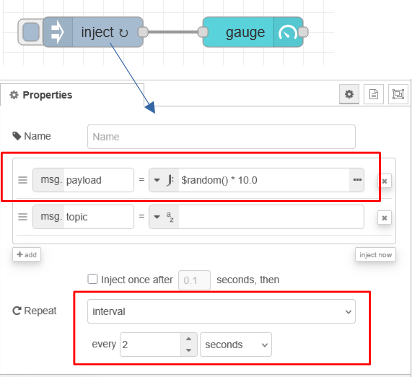

рис.1. Перші налаштування індикатора

- [ ] Зробіть розгортання проєкту.
- [ ] Перейдіть на сторінку dashboard через бічну панель, для цього можна зайти в меню Dashboard 2, і натиснути відповідну кнопку (рис.2)

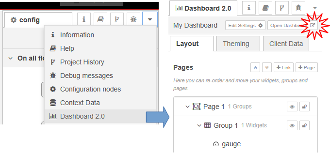

рис.2. Перехід на сторінку dashboard через бічну панель

- [ ] За замовченням індикатор буде відображати значення у неформатованому вигляді і з певними налаштуваннями вигляду. Кожні 2 секунди воно має змінювати значення. 

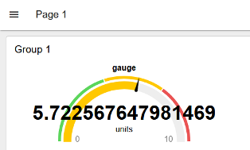

рис.3. Зовнішній вигляд створеного dashboard за заовченням

Як видно формат відображення числового значення має багато чисел після коми, що не зручно для сприйняття. Також варто змінити деякі написи.

- [ ] Ознайомтеся з описом елемента `gauge` за [цим посиланням](https://pupenasan.github.io/NodeREDGuidUKR/Dashboard2_0/gauge.html)
- [ ] Змініть налаштування Gaguge, щоб він:
  - показував заокруглене значення до одного знаку після коми `$round(payload, 1)`
  - мав чотири підсвічувані різним кольором діапазони
  - над ним писалася назва `Speed`
  - одиниці вимірювання були `m/s`

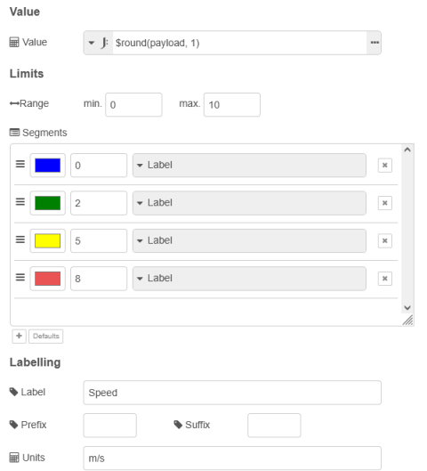

рис.4. Властивості Gage

## 3. Знайомство з макетуванням

- [ ] Ознайомтеся з принципами макетування за [цим посиланням](https://pupenasan.github.io/NodeREDGuidUKR/Dashboard2_0/layouts.html)
- [ ] Ознайомтеся зі змістом бічної панелі налаштування Dasboard 2
- [ ] Змініть кольорову гаму в налаштуваннях теми

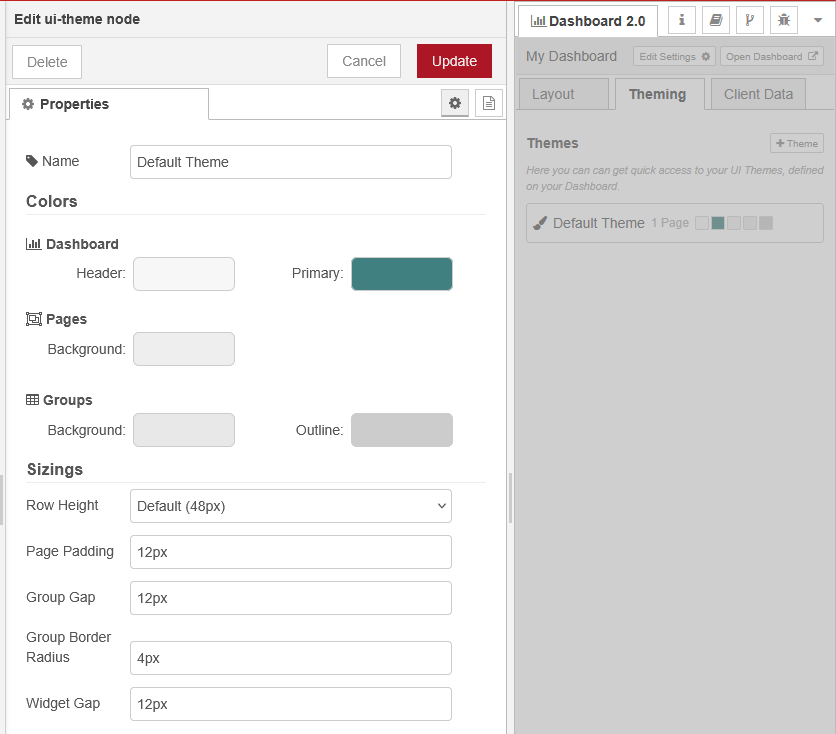

рис.5. Зміна кольорової гами в налаштуваннях теми

- [ ] За допомогою кнопок налаштування на бічній панелі змініть назву сторінки на  `Widgets` і шлях до сторінки `/widgets`  

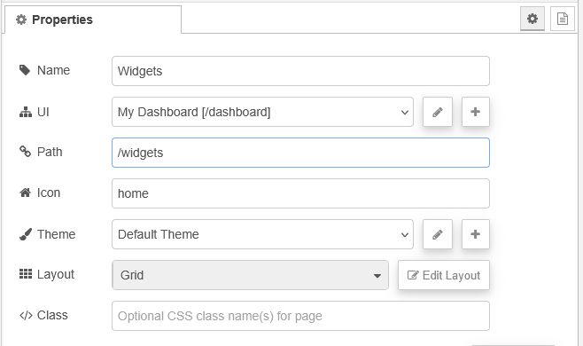

рис.5. Зміни налаштування сторінки

- [ ] Зробіть розгортання та оновіть відображення Dashboard, перевірте що назва, шлях та кольорова гама змінилися
- [ ]  Змініть налаштування групи, після чого перевірте її в роботі:
  - назва - `Indicators`
  - назву не відображати
  - ширина - `2` одиниці 

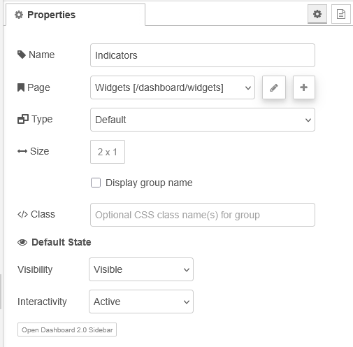

рис.6. Налаштування групи

- [ ] Скопіюйте віджет `Speed` два рази і модифікуйте потік як показано на рис.7, тобто щоб усі три віджети розміщувалися в одній групі `Indicators`  

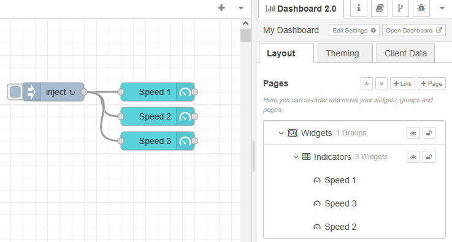

рис.7.

- [ ] Змініть налаштування скопійованих віджетів, щоб у них генерувалися випадкові числа (рис.8)

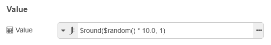

рис.8.

- [ ] Перевірте роботу, має вийти щось на кшталт того, що показано на рис.9

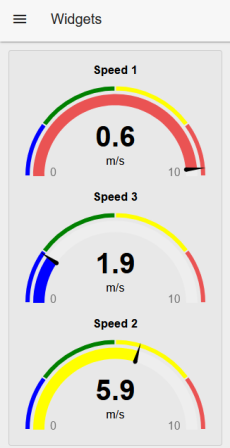

рис.9.

- [ ] За допомогою налаштування розмірів груп та віджетів зробіть щоб віджети помістилися горизонтально в групі в `6` одиниць шириною (рис.10)

 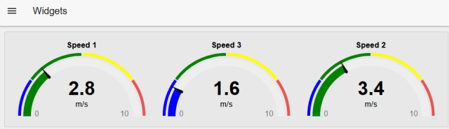

рис.10. 

- [ ] Використовуючи опис `gauge` за [цим посиланням](https://pupenasan.github.io/NodeREDGuidUKR/Dashboard2_0/gauge.html) налаштуйте різні варіанти відображення (рис.11)

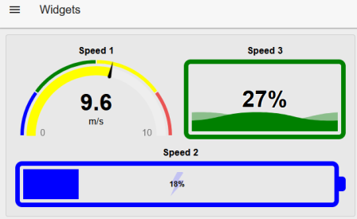

рис.11. 

## 4. Знайомство з віджетами керування

- [ ] Скопіюйте і імпортуйте в сві потік наведений нижче фрагмент

```json
[{"id":"3cd7e2f595994a0b","type":"group","z":"92860c51af556446","name":"change number","style":{"label":true},"nodes":["f028fe45cfd3dbbc","e7e51bfb6d61bbb4","16d6dbdc078c5366","f98aa4068b8125ca","3a5e0ff9354d0019","fc5ceedc18d0171c","3004d4195eed066c","e8e60f0e84b767a0","a9d0125e6509ba43"],"x":734,"y":339,"w":372,"h":242},{"id":"f028fe45cfd3dbbc","type":"ui-number-input","z":"92860c51af556446","g":"3cd7e2f595994a0b","group":"c85ea511bec3c000","name":"","label":"number","order":5,"width":"1","height":"1","topic":"topic","topicType":"msg","min":0,"max":10,"step":1,"tooltip":"","passthru":false,"sendOnBlur":true,"sendOnEnter":true,"className":"","clearable":false,"icon":"","iconPosition":"left","iconInnerPosition":"inside","spinner":"default","x":960,"y":460,"wires":[["3a5e0ff9354d0019"]]},{"id":"e7e51bfb6d61bbb4","type":"ui-button-group","z":"92860c51af556446","g":"3cd7e2f595994a0b","name":"","group":"c85ea511bec3c000","order":1,"width":"2","height":1,"label":"set","className":"","rounded":true,"useThemeColors":true,"passthru":false,"options":[{"label":"","icon":"numeric-0-box","value":"0","valueType":"num","color":"#009933"},{"label":"","icon":"numeric-5-box","value":"5","valueType":"num","color":"#999999"},{"label":"","icon":"numeric-10-box","value":"10","valueType":"str","color":"#ff6666"}],"topic":"topic","topicType":"msg","x":950,"y":500,"wires":[["3a5e0ff9354d0019"]]},{"id":"16d6dbdc078c5366","type":"ui-slider","z":"92860c51af556446","g":"3cd7e2f595994a0b","group":"c85ea511bec3c000","name":"","label":"slider","tooltip":"","order":3,"width":0,"height":0,"passthru":false,"outs":"end","topic":"topic","topicType":"msg","thumbLabel":"true","showTicks":"always","min":0,"max":10,"step":1,"className":"","iconPrepend":"","iconAppend":"","color":"","colorTrack":"","colorThumb":"","showTextField":false,"x":950,"y":420,"wires":[["3a5e0ff9354d0019"]]},{"id":"f98aa4068b8125ca","type":"ui-text","z":"92860c51af556446","g":"3cd7e2f595994a0b","group":"c85ea511bec3c000","order":2,"width":"1","height":"1","name":"","label":"Result","format":"{{msg.payload}}","layout":"col-center","style":false,"font":"","fontSize":16,"color":"#717171","wrapText":false,"className":"","value":"payload","valueType":"msg","x":950,"y":380,"wires":[]},{"id":"3a5e0ff9354d0019","type":"link out","z":"92860c51af556446","g":"3cd7e2f595994a0b","name":"link out 1","mode":"link","links":["fc5ceedc18d0171c"],"x":1065,"y":440,"wires":[]},{"id":"fc5ceedc18d0171c","type":"link in","z":"92860c51af556446","g":"3cd7e2f595994a0b","name":"link in 1","links":["3a5e0ff9354d0019"],"x":785,"y":440,"wires":[["3004d4195eed066c"]]},{"id":"3004d4195eed066c","type":"delay","z":"92860c51af556446","g":"3cd7e2f595994a0b","name":"","pauseType":"rate","timeout":"5","timeoutUnits":"seconds","rate":"5","nbRateUnits":"1","rateUnits":"second","randomFirst":"1","randomLast":"5","randomUnits":"seconds","drop":false,"allowrate":false,"outputs":1,"x":835,"y":440,"wires":[["16d6dbdc078c5366","f98aa4068b8125ca","f028fe45cfd3dbbc"]],"l":false},{"id":"e8e60f0e84b767a0","type":"ui-button","z":"92860c51af556446","g":"3cd7e2f595994a0b","group":"c85ea511bec3c000","name":"","label":"to random","order":4,"width":"1","height":"1","emulateClick":false,"tooltip":"","color":"","bgcolor":"","className":"","icon":"","iconPosition":"left","payload":"0","payloadType":"num","topic":"topic","topicType":"msg","buttonColor":"","textColor":"","iconColor":"","enableClick":true,"enablePointerdown":false,"pointerdownPayload":"","pointerdownPayloadType":"str","enablePointerup":false,"pointerupPayload":"","pointerupPayloadType":"str","x":820,"y":540,"wires":[["a9d0125e6509ba43"]]},{"id":"a9d0125e6509ba43","type":"change","z":"92860c51af556446","g":"3cd7e2f595994a0b","name":"","rules":[{"t":"set","p":"payload","pt":"msg","to":"$round($random() * 10.0, 0)","tot":"jsonata"}],"action":"","property":"","from":"","to":"","reg":false,"x":980,"y":540,"wires":[["3a5e0ff9354d0019"]]},{"id":"c85ea511bec3c000","type":"ui-group","name":"Numbers","page":"5f15e5186f4b574d","width":"3","height":1,"order":2,"showTitle":true,"className":"","visible":"true","disabled":"false","groupType":"default"},{"id":"5f15e5186f4b574d","type":"ui-page","name":"Widgets","ui":"4a39c0fd6e276ff8","path":"/widgets","icon":"home","layout":"grid","theme":"885d92cb91c4397c","breakpoints":[{"name":"Default","px":"0","cols":"3"},{"name":"Tablet","px":"576","cols":"6"},{"name":"Small Desktop","px":"768","cols":"9"},{"name":"Desktop","px":"1024","cols":"12"}],"order":1,"className":"","visible":"true","disabled":"false"},{"id":"4a39c0fd6e276ff8","type":"ui-base","name":"My Dashboard","path":"/dashboard","appIcon":"","includeClientData":true,"acceptsClientConfig":["ui-notification","ui-control"],"showPathInSidebar":false,"headerContent":"page","navigationStyle":"default","titleBarStyle":"default","showReconnectNotification":true,"notificationDisplayTime":1,"showDisconnectNotification":true,"allowInstall":false},{"id":"885d92cb91c4397c","type":"ui-theme","name":"Default Theme","colors":{"surface":"#f7f7f7","primary":"#408080","bgPage":"#eeeeee","groupBg":"#e8e8e8","groupOutline":"#cccccc"},"sizes":{"density":"default","pagePadding":"12px","groupGap":"12px","groupBorderRadius":"4px","widgetGap":"12px"}},{"id":"c9468fa10b95cd82","type":"group","z":"92860c51af556446","name":"Controls","style":{"label":true},"nodes":["bce7ec18d20ebdfa","6f630faebbec0352","45e7c35c95b05dab","b923abdffca7a127","6847a41175abe825","b8a2eb0b384f0c33","b2a6ef33a2bd5de1"],"x":734,"y":79,"w":512,"h":242},{"id":"bce7ec18d20ebdfa","type":"ui-text-input","z":"92860c51af556446","g":"c9468fa10b95cd82","group":"7760f48e1c1c42c6","name":"","label":"text","order":2,"width":"2","height":"1","topic":"topic","topicType":"msg","mode":"text","tooltip":"","delay":300,"passthru":false,"sendOnDelay":true,"sendOnBlur":false,"sendOnEnter":false,"className":"","clearable":false,"sendOnClear":false,"icon":"","iconPosition":"left","iconInnerPosition":"inside","x":850,"y":240,"wires":[["6847a41175abe825"]]},{"id":"6f630faebbec0352","type":"ui-dropdown","z":"92860c51af556446","g":"c9468fa10b95cd82","group":"7760f48e1c1c42c6","name":"","label":"Select Option:","tooltip":"","order":1,"width":"2","height":"1","passthru":false,"multiple":false,"chips":true,"clearable":false,"options":[{"label":"Hello","value":"Hello World!","type":"str"},{"label":"Slava","value":"Slava Ukrayini!","type":"str"}],"payload":"","topic":"topic","topicType":"msg","className":"","typeIsComboBox":true,"msgTrigger":"onChange","x":840,"y":160,"wires":[["6847a41175abe825"]]},{"id":"45e7c35c95b05dab","type":"ui-radio-group","z":"92860c51af556446","g":"c9468fa10b95cd82","group":"7760f48e1c1c42c6","name":"","label":"Select Option:","order":4,"width":"1","height":"3","columns":1,"passthru":false,"options":[{"label":"0","value":"Zero","type":"str"},{"label":"1","value":"One","type":"str"},{"label":"10","value":"Ten","type":"str"}],"payload":"","topic":"topic","topicType":"msg","className":"","x":840,"y":200,"wires":[["6847a41175abe825"]]},{"id":"b923abdffca7a127","type":"ui-switch","z":"92860c51af556446","g":"c9468fa10b95cd82","name":"","label":"On/Off","group":"7760f48e1c1c42c6","order":6,"width":"1","height":"1","passthru":false,"decouple":false,"topic":"topic","topicType":"msg","style":"","className":"","layout":"row-left-swapped","clickableArea":"switch","onvalue":"On","onvalueType":"str","onicon":"toggle-switch","oncolor":"green","offvalue":"Off","offvalueType":"str","officon":"toggle-switch-off","offcolor":"grey","x":850,"y":120,"wires":[["6847a41175abe825"]]},{"id":"6847a41175abe825","type":"ui-audio","z":"92860c51af556446","g":"c9468fa10b95cd82","group":"","ui":"4a39c0fd6e276ff8","name":"","order":0,"width":0,"height":0,"mode":"tts","voice":"","src":"","autoplay":"off","loop":"off","muted":"off","x":1040,"y":180,"wires":[["b8a2eb0b384f0c33"]]},{"id":"b8a2eb0b384f0c33","type":"ui-text","z":"92860c51af556446","g":"c9468fa10b95cd82","group":"7760f48e1c1c42c6","order":5,"width":"2","height":"1","name":"","label":"Value","format":"{{msg.payload}}","layout":"row-left","style":false,"font":"","fontSize":16,"color":"#717171","wrapText":false,"className":"","value":"payload","valueType":"msg","x":1170,"y":180,"wires":[]},{"id":"b2a6ef33a2bd5de1","type":"ui-text-input","z":"92860c51af556446","g":"c9468fa10b95cd82","group":"7760f48e1c1c42c6","name":"","label":"date","order":3,"width":"2","height":"1","topic":"topic","topicType":"msg","mode":"date","tooltip":"","delay":300,"passthru":false,"sendOnDelay":true,"sendOnBlur":false,"sendOnEnter":false,"className":"","clearable":false,"sendOnClear":false,"icon":"","iconPosition":"left","iconInnerPosition":"inside","x":850,"y":280,"wires":[["6847a41175abe825"]]},{"id":"7760f48e1c1c42c6","type":"ui-group","name":"Controls","page":"5f15e5186f4b574d","width":"4","height":1,"order":3,"showTitle":true,"className":"","visible":"true","disabled":"false","groupType":"default"},{"id":"487fe62b72f698b4","type":"global-config","env":[],"modules":{"@flowfuse/node-red-dashboard":"1.30.1"}}]
```

- [ ] Зробіть розгоратнання та перевірте його роботу. Dashboard виглядатиме як на рис.12

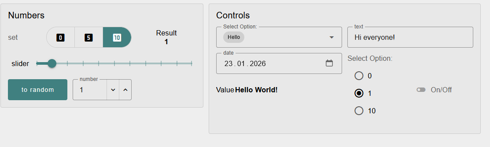

рис.12.

- [ ] Користуючись мееріалами про віджети з [Node-RED Dashboard 2.0 ](https://pupenasan.github.io/NodeREDGuidUKR/Dashboard2_0/)  зробіть наступні дії:
  - змініть діапазони зміни значення в групі Numbers
  - зробіть щоб значення змінювалося після пересування повзунка `slider` а не після його відпускання
  - використовуючи віджет Gauge з типом `Tile` зробть поле відображення значення зі зміною кольору фону (рис.13) 
  - у віджет  `select options` добавте нове значення

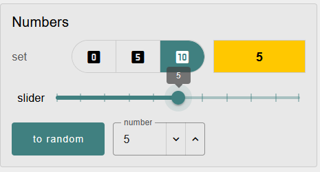

рис.13. 

## 5. Робота з таблицями

- [ ] Створіть нову сторінку Dashboard з іменем `Data ` та `path = /pagedata`,  `icon=table`
- [ ] Скопійюйте та імпортуйте фрагмент потоку

```
[{"id":"92c12c55ad006923","type":"group","z":"92860c51af556446","name":"Table","style":{"label":true},"nodes":["78b43be39f6db8e1","6cdf36ffe9daf59c","7a0a964dbb6f509d"],"x":174,"y":419,"w":432,"h":82},{"id":"78b43be39f6db8e1","type":"ui-table","z":"92860c51af556446","g":"92c12c55ad006923","group":"14bafc691d04765a","name":"","label":"Exapmle table","order":1,"width":0,"height":0,"maxrows":"0","autocols":false,"showSearch":false,"deselect":true,"selectionType":"none","columns":[{"title":"Row","key":"","keyType":"key","type":"row","width":"","align":"start"},{"title":"My Column","key":"columnA","keyType":"key","type":"text","width":"","align":"start"},{"title":"My Other Column","key":"columnB","keyType":"key","type":"text","width":"","align":"start"},{"title":"URL","key":"link","keyType":"key","type":"link","width":"300px","align":"start"},{"title":"Progress","key":"progress","keyType":"key","type":"progress","width":"","align":"start"},{"title":"Trend","key":"array","keyType":"key","type":"sparkline-trend","width":"","align":"start"},{"title":"Bar","key":"array","keyType":"key","type":"sparkline-bar","width":"","align":"start"},{"title":"Tick/Cross","key":"boolean","keyType":"key","type":"tickcross","width":"","align":"start"},{"title":"Spot","key":"color","keyType":"key","type":"color","width":"","align":"center"}],"mobileBreakpoint":"sm","mobileBreakpointType":"defaults","action":"replace","x":500,"y":460,"wires":[[]]},{"id":"6cdf36ffe9daf59c","type":"inject","z":"92860c51af556446","g":"92c12c55ad006923","name":"","props":[{"p":"progress1","v":"$round($random() * 100.0, 0)","vt":"jsonata"},{"p":"progress2","v":"$round($random() * 100.0, 0)","vt":"jsonata"}],"repeat":"2","crontab":"","once":true,"onceDelay":0.1,"topic":"","x":270,"y":460,"wires":[["7a0a964dbb6f509d"]]},{"id":"7a0a964dbb6f509d","type":"template","z":"92860c51af556446","g":"92c12c55ad006923","name":"","field":"payload","fieldType":"msg","format":"handlebars","syntax":"mustache","template":"[\n    {\n        \"columnA\": \"Hello\",\n        \"columnB\": \"World\",\n        \"link\": \"https://news.bbc.co.uk\",\n        \"progress\": {{progress1}},\n        \"color\": \"#FF0000\",\n        \"array\": [\n            6,\n            7,\n            9,\n            2,\n            4\n        ],\n        \"boolean\": true\n    },\n    {\n        \"columnA\": \"Hey\",\n        \"columnB\": \"Globe\",\n        \"link\": \"https://flowfuse.com\",\n        \"progress\": {{progress2}},\n        \"color\": \"#24aa69\",\n        \"array\": [\n            1,\n            3,\n            6,\n            3,\n            5\n        ],\n        \"boolean\": false\n    }\n]","output":"json","x":375,"y":460,"wires":[["78b43be39f6db8e1"]],"l":false},{"id":"14bafc691d04765a","type":"ui-group","name":"DataGroup1","page":"5344524c9e756ec0","width":6,"height":1,"order":1,"showTitle":false,"className":"","visible":"true","disabled":"false","groupType":"default"},{"id":"5344524c9e756ec0","type":"ui-page","name":"Data","ui":"4a39c0fd6e276ff8","path":"/pagedata","icon":"table","layout":"grid","theme":"885d92cb91c4397c","breakpoints":[{"name":"Default","px":"0","cols":"3"},{"name":"Tablet","px":"576","cols":"6"},{"name":"Small Desktop","px":"768","cols":"9"},{"name":"Desktop","px":"1024","cols":"12"}],"order":2,"className":"","visible":"true","disabled":"false"},{"id":"4a39c0fd6e276ff8","type":"ui-base","name":"My Dashboard","path":"/dashboard","appIcon":"","includeClientData":true,"acceptsClientConfig":["ui-notification","ui-control"],"showPathInSidebar":false,"headerContent":"page","navigationStyle":"default","titleBarStyle":"default","showReconnectNotification":true,"notificationDisplayTime":1,"showDisconnectNotification":true,"allowInstall":false},{"id":"885d92cb91c4397c","type":"ui-theme","name":"Default Theme","colors":{"surface":"#f7f7f7","primary":"#408080","bgPage":"#eeeeee","groupBg":"#e8e8e8","groupOutline":"#cccccc"},"sizes":{"density":"default","pagePadding":"12px","groupGap":"12px","groupBorderRadius":"4px","widgetGap":"12px"}},{"id":"670c4531efcc2e40","type":"global-config","env":[],"modules":{"@flowfuse/node-red-dashboard":"1.30.1"}}]
```

- [ ] Зробіть розгортання 
- [ ] У Dashboard відкрийте меню, через яке відкрийте нову сторінку
- [ ] Перевірте роботу таблиці, зовнішній вигляд має бути щось на кшталт як показано на рис.14. При цьому значення поля `Progress` поивнно змінюватися кожні 2 секунди.

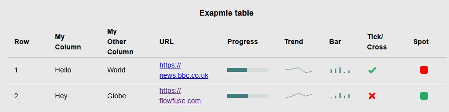

рис.14. 

- [ ] Ознайомтеся з теоретичними відомостями [Таблиця даних `ui-table`](https://pupenasan.github.io/NodeREDGuidUKR/Dashboard2_0/table.html)
- [ ] Модифікуйте потік такими чином щоб значення поля прогрес показувалося в новій колонці `num` у вигляді числа і перевірте роботу

## Питання до захисту

1. Розкажіть про палітру Node-RED Dashboard 2.0 - походження, призначення.
2. Розкажіть про принципи побудови користувацького інтерфейсу на базі Dashboard 2.0.
3. Розкажіть про принципи макетування сторінок Dashboard 2.0.
4. Що таке віджет?
5. Назвіть віджети Dashboard 2.0 які можна використовувати для відображення плинного значення вимірювальної величини.
6. Назвіть віджети Dashboard 2.0 які можна використовувати для зміни значення керуючої величини.
7. Розкажіть про принципи відображення даних у вигляді таблиць.

## Автор


Практичне заняття розробив [Олександр Пупена](https://github.com/pupenasan). 

## Feedback

Якщо Ви хочете залишити коментар у Вас є наступні варіанти:

- [Обговорення у WhatsApp](https://chat.whatsapp.com/BRbPAQrE1s7BwCLtNtMoqN)
- [Обговорення в Телеграм](https://t.me/+GA2smCKs5QU1MWMy)
- [Група у Фейсбуці](https://www.facebook.com/groups/asu.in.ua)

Про проект і можливість допомогти проекту написано [тут](https://asu-in-ua.github.io/atpv/)

