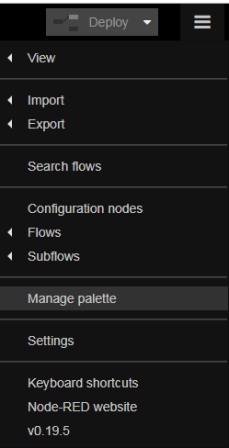
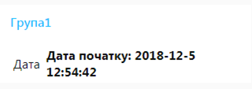
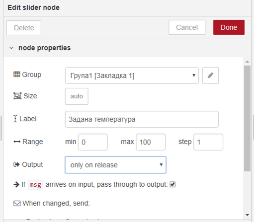
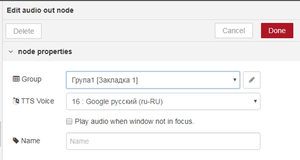

[<- До підрозділу](README.md)

# Підключення та ознайомлення з модулем node-red-dashboard: практичне заняття

**Тривалість**: 1 акад. години.

**Мета:** ознайомлення з можливостями середовища Node-RED.  

**Лабораторна установка**

- Апаратне забезпечення: ПК. 
- Програмне забезпечення: Node-RED.

## Порядок виконання роботи 

## 3. Підключення та ознайомлення з модулем node-red-dashboard

Node-RED дозволяє інсталювати та обновляти палітру вузлів. Це можна робити через менеджер пакунків Node-RED або через Manage Palette (рис.1.10). 

У даному пункті необхідно ознайомитися з можливостями пакунку  `node-red-dashboard` , який дає можливість легко розробляти графічний інтерфейс користувача (GUI) на базі HTML простим розміщенням та налаштування вузлів Node-RED. Тому спочатку його треба інсталювати.

   

рис.1.10. Вибір Manage palette

#### 3.1. Інсталяція node-red-dashboard

- [ ] В налаштуваннях палітри на вкладці Install в поле фільтру введіть `node-red-dashboard` і інсталюйте даний пакет (рис.1.11):

- натисніть кнопку install

- підтвердіть інсталяцію у вікні повідомлення 

- після інсталяції закрийте вікно керування палітрою

   

рис.1.11. Вибір Manage palette

- [ ] Перевірте чи з’явилася в палітрі розділ «Dashboard» 

#### 3.2. Добавлення закладок 

- [ ] Після встановлення у бічній панелі з’явилася нова іконка з зображенням діаграми (рис.12) , яка перемикає на панель конфігурування графічного інтерфейсу користувача. Натисніть по ній. 

   

рис.1.12. 

- [ ] У вкладці Layout добавте дві закладки (tab) та змініть їх назви як це показано на рис.13.  Це будуть закладки у вікні браузеру.  

**Ім’я першої закладки повинно називатися Вашим прізвищем та ім’ям, наприклад «Іваненко Іван».**     

   

рис.1.13. 

#### 3.3. Створення вузлу Dashboard text для виведення дати та часу

- [ ] Модифікуйте програму, створивши вузол типу dashboard-> text і підєднавши його до вузла «ДатаЧас» (див. рис.1.14). Налаштуйте вузол відповідно до рис.1.14 **однак ім’я першої групи повинно називатися Вашим прізвищем «Іваненко». Створіть ще одну групу, яка повинна називатися Вашим ім’ям «наприклад Іван».**      

- [ ] Після усіх налаштувань зробіть розгортання, відкрийте створений Dashboard, шляхом натискання кнопки переходу  (див.рис.1.13.), або ввівши в новій вкладці браузера http://127.0.0.1:1880/ui 

рис.1.14. 

На вкладці повинно з’явитися щось типу такого, як показано на рис.15

    

рис.1.15

#### 3.4. Створення вузлу Dashboard text для виведення числа прописом

- [ ] Аналогічним чином зробіть для відображення числа прописом.

    

рис.1.16

#### 3.5. Використання вузлів Slider, Gauge, Audio out 

- [ ] Добавте до програми фрагмент, як показано на рис.1.17.

   

рис.1.17

Налаштування вузлів показані на рис.1.18-1.21

   

рис.1.18

   

рис.1.19

   

рис.1.20

   

рис.1.21

- [ ] Зробіть розгортання і подивіться результат на вікні Dashboard.  

#### 3.6. Робота з вузлом switch

- [ ] Ознайомтеся з принципами роботи вузла **switch**. Модифікуйте програму відповідно до наведеної на рис.1.22. Вузли налаштуйте відповідно до рис.1.23-1.26. 

   

рис.1.22. Фрагмент модифікованої програми

    

рис.1.23. Налаштування вузла switch 

   

рис.1.24. Налаштування вузла norma

   

рис.1.25. Налаштування вузла Alarm

    

рис.1.26. Налаштування вузла Button

- [ ] Зробіть розгортання проекту, перевірте як працює програма. Для цього на сторінці веб-інтерфейсу змініть значення заданої температури в діапазоні 0-50, а потім >50.

Ця частина програми працює наступним чином. При зміні значення температури, в msg.payload значення поступає на обробку в вузол switch, де на один із 2-х виходів формується повідомлення в залежності від тієї умови, яка спрацювала. 

При виконанні умови 0<msg.payload<50 (is between), повідомлення передається на перший вихід, до якого в свою чергу приєднаний вузол “Norma” (тип function->change). Той задає текстове значення для властивості msg.payload рівним «НОРМА» і формує нову властивість msg.color рівною “GREEN”. Далі msg поступає вузол «button», який використовується для відображення тексту в прямокутнику. Значення тексту задається полі Label, а колір в полі Background. При формуванні динамічних значень для вузлів, використовується формат angular фільтрів, в якому вказується підстановка в подвійних фігурних дужках.

Аналогічна обробка проводиться при спрацюванні у вузлі switch умови msg.payload>50. Повідомлення згенерується на другому виході, який активує перерахунок вузла “Alarm” що буде формувати текст та колір для кнопки.         

## Питання до захисту

1. Розкажіть що таке Node-RED?
2. На якому рушію працює Node-RED?
3. Розкажіть коротко про основні вузли, які використовувалися в даній лабораторній роботі.
4. Розкажіть про призначення вузла "function".
5. Розкажіть про призначення вузлів "dashboard".
6. Розкажіть про структуру об'єкта MSG.
7. Розкажіть про призначення вузла switch.
8. Розкажіть про роботу вузлів "node-red-contrib-os".
9. Яким чином робиться експорт і імпорт фрагментів програми Node-RED?

 

Практичне заняття розробив [Олександр Пупена](https://github.com/pupenasan). 

Якщо Ви хочете залишити коментар у Вас є наступні варіанти:

- [Обговорення у WhatsApp](https://chat.whatsapp.com/BRbPAQrE1s7BwCLtNtMoqN)
- [Обговорення в Телеграм](https://t.me/+GA2smCKs5QU1MWMy)
- [Група у Фейсбуці](https://www.facebook.com/groups/asu.in.ua)

Про проект і можливість допомогти проекту написано [тут](https://asu-in-ua.github.io/atpv/)

