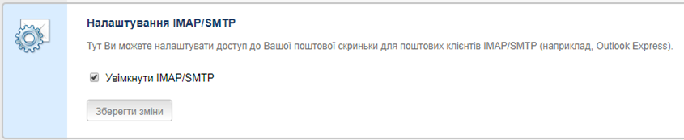
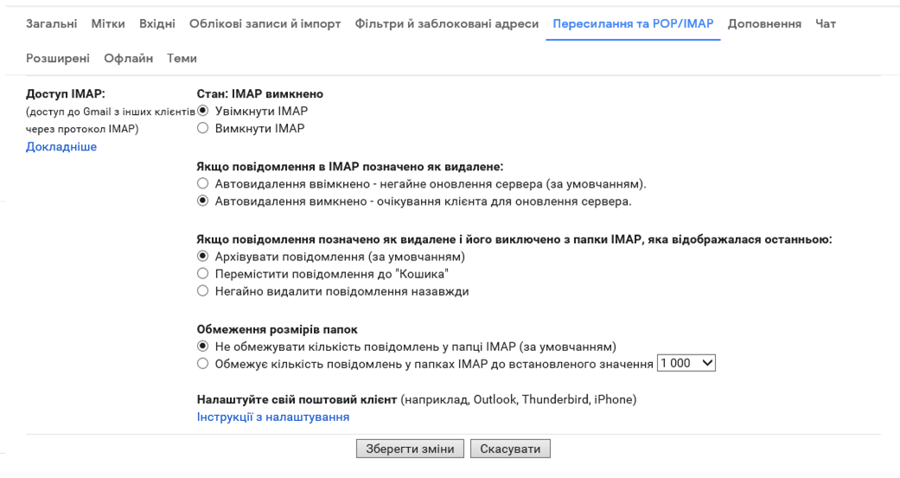
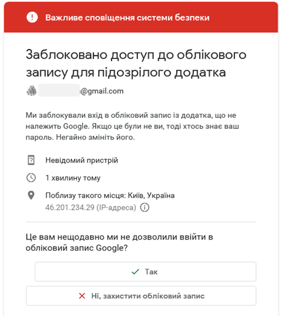
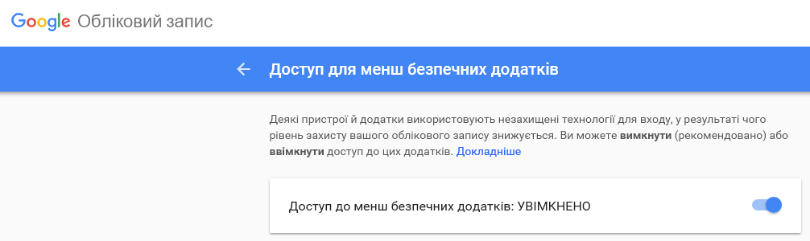
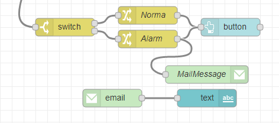
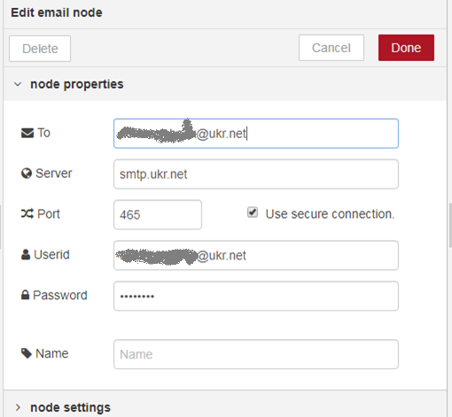
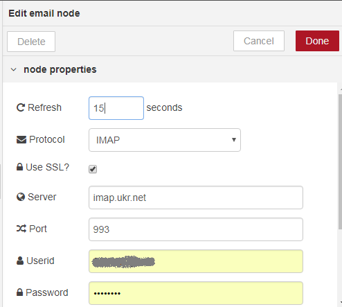
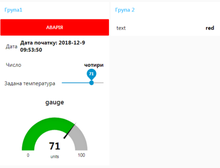

[<- До підрозділу](README.md)

# Робота з поштою в Node-RED: практичне заняття

**Тривалість**: 4 акад. години.

**Мета:** ознайомлення з можливостями середовища Node-RED.  

**Лабораторна установка**

- Апаратне забезпечення: ПК. 
- Програмне забезпечення: Node-RED.

## Порядок виконання роботи 

## 4. Робота з поштою

#### 4.1. Визначення налаштувань поштового серверу

Для роботи з поштою необхідно дізнатися налаштування почтового сервера, який Ви будете використовувати для відправки повідомлень, і на якому є Ваш обліковий запис. **Ми рекомендуємо для тестування створити новий аккаунт** **на одному з поштових серверів.** 

- [ ] Випишіть налаштування:

Для вихідних повідомлень (відправки пошти):

- SMTP Server 
- port

Для вхідних повідомлень (отримання пошти):

- POP3 Server або IMAP Server
- port

Інформацію про налаштування поштових сервісів можна отримати в довідці по цим серверам. Нижче наведений приклад деяких із найбільш вживаних: 

Таблиця.1.1. Приклади налаштувань поштових сервісів.

| Поштовий сервіс | Для відправки  (Сервер вихідних повідомлень  ) | Для отримання  (Сервер вхідних повідомлень)   | Примітка                                                     |
| --------------- | ---------------------------------------------- | --------------------------------------------- | ------------------------------------------------------------ |
| www.ukr.net     | SMTP Server: smtp.ukr.net                      | IMAP Server: imap.ukr.net                     | В налаштуваннях треба увімкнути IMAP/SMTP (рис.1.27)         |
| port            | port: 465 або 2525                             | port: 993                                     |                                                              |
| www.gmail.com   | SMTP Server: smtp.gmail.com                    | IMAP Server: imap.gmail.com  Вимагає SSL: так | В налаштуваннях треба увімкнути IMAP (рис.1.28)  Активувати доступ до додатків  https://myaccount.google.com/lesssecureapps (рис.1.29) |
| port            | port: 465(SSL) або  587(TLS)                   | port: 993                                     |                                                              |

  

рис.1.27. Налаштування ukr.net для активації отримання та відправки пошти.

   

рис.1.28. Налаштування gmail.con для активації отримання та відправки пошти.

Для сервісів gmail навіть після активації дозволу на взаємодію з поштовими клієнтами через IMAP/SMTP, при використанні додатку NodeRED може прийти повідомлення про блокування доступу (рис.1.29). Для активації доступу тимчасово (до закінчення лабораторної роботи) виставте дозвіл доступу до менш безпечних додатків (рис.1.30)

   

рис.1.29. Повідомлення gmail.com про блокування доступу.

 

рис.1.30. Активація доступу до менш безпечних додатків (https://myaccount.google.com/lesssecureapps).

 необхідно також дозволити https://myaccount.google.com/lesssecureapps  

#### 4.2. Модифікування програми для відправки поштових повідомлень 

- [ ] Модифікуйте програму фрагментом показаним на рис.1.31. Налаштування вузів показано на рис.1.32-1.33. У поля user-id та password необхідно вказати користувача та пароль для аккаунта. Інші налаштування беруться з визначених в попередньому пункті. В поле отримувача введіть власну поштову скриньку. 

    

рис.1.31. Модифікований фрагмент програми

    

рис.1.32. Налаштування вузла MailMessage типу Social e-Mail

    

рис.1.33. Налаштування вузла MailMessage типу Social e-Mail-in

- [ ] Зробіть розгортання проекту, виставте значення заданої температури так, щоб згенерувалося повідомлення Alram. На пошту повинно прийти повідомлення, протягом 15 секунд воно повинно відобразитися на веб-сторінці в полі текст (рис.1.34).  

    

рис.1.34. Приклад зовнішнього вигляду UI.

## Питання до захисту

 

Практичне заняття розробив [Олександр Пупена](https://github.com/pupenasan). 

Якщо Ви хочете залишити коментар у Вас є наступні варіанти:

- [Обговорення у WhatsApp](https://chat.whatsapp.com/BRbPAQrE1s7BwCLtNtMoqN)
- [Обговорення в Телеграм](https://t.me/+GA2smCKs5QU1MWMy)
- [Група у Фейсбуці](https://www.facebook.com/groups/asu.in.ua)

Про проект і можливість допомогти проекту написано [тут](https://asu-in-ua.github.io/atpv/)

