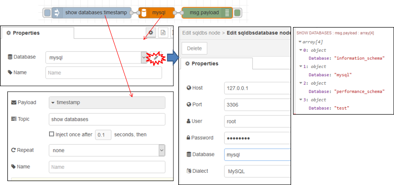
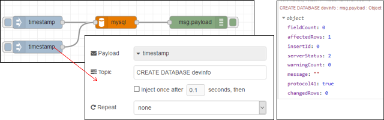
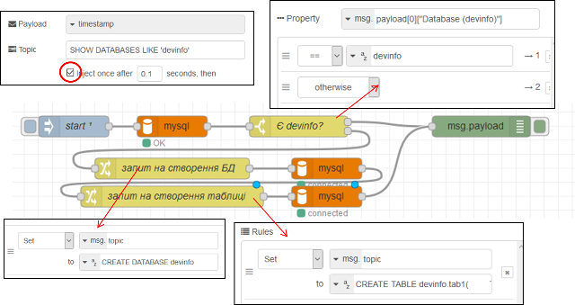
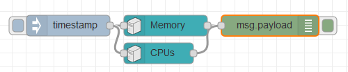
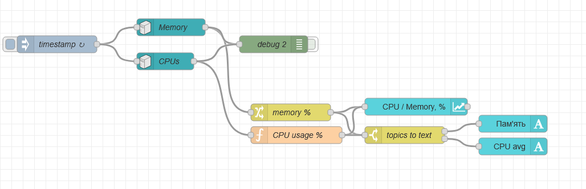
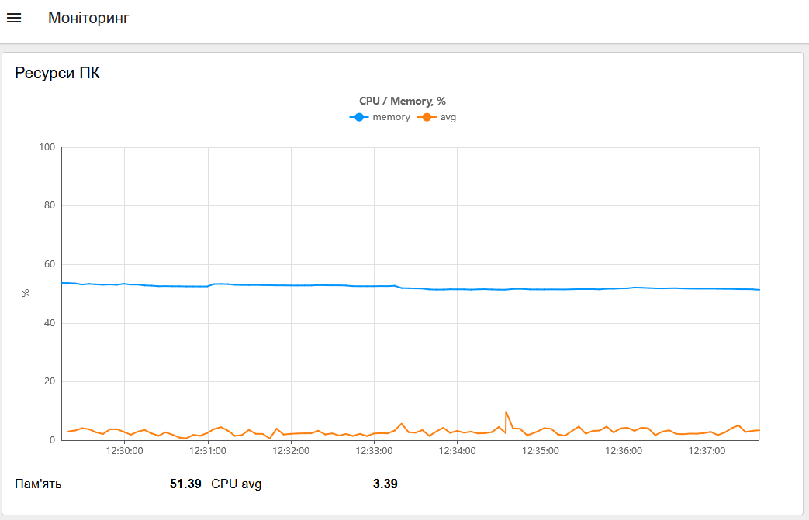
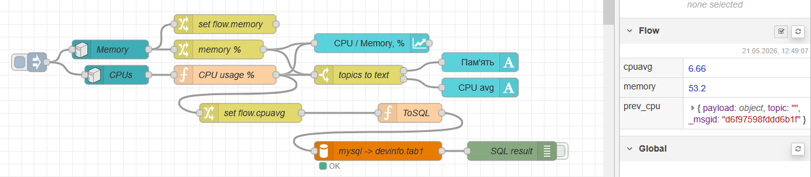
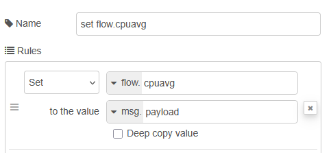
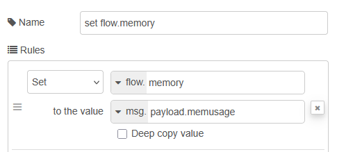

[<- До підрозділу](README.md)		[Коментувати](#feedback)

# Робота з SQL в Node-RED: практична частина

**Тривалість**: 1 год.

**Мета:**  

## Лабораторна установка для проведення лабораторної роботи у віртуальному середовищі.


## Загальна постановка задачі

У цій лабораторній роботі бази даних будуть використовуватися у Node-RED для збереження показників роботи системи - процесорного часу та використання пам'яті.  Будуть використовуватися два підключення:

- до системної бази даних `mysql` 
- до користувацької `devinfo`. 

Перша буде використовуватися для ініціалізації, а саме: при підключенні до системної БД буде перевірятися наявність БД  `devinfo`, якщо її немає - вона буде створюватися;  зрештою необхідність вказівки до системної БД `mysql` зумовлена необхідністю конфігурування підключення принаймні до якоїсь БД, а системна - завжди присутня; 

Після підключення до користувацької БД  `devinfo` перевіряється наявність сконфігурованої таблиці, і якщо її немає - вона також створюється автоматично. 

## Послідовність виконання роботи

## Пререквізити

- [ ] Передбачається що на комп'ютері встановлено Node-RED (див. [Вступ до Node-RED: практичне заняття](../intro/lab.md) та MariaDB (див. [Основи SQL: практична частина](../../sql/sqlbasic/lab.md)) 

### 1. Встановлення бібліотеки Node-RED для роботи з БД

- [ ] Зупиніть Node-RED, якщо він запущений. 
- [ ] Якщо у Вас не активовано опція використання проєктів:
  - у папці користувача перейменуйте файл минулого виконання `flow.json` щоб Node-RED запускався з чистого аркушу; як це зробити написано у [Вступ до Node-RED: практичне заняття](lab.md) 
  - запустіть Node-RED  
- [ ] Якщо у Вас активована опція використання проєктів:
  - запустіть Node-RED 
  - створіть новий проєкт
- [ ] Встановіть бібліотеку `node-red-node-mysql`
- [ ] Ознайомтеся з роботою бібліотеки за посиланням [бібліотеки Node-RED для роботи з БД](https://pupenasan.github.io/NodeREDGuidUKR/dbase/)

- [ ] Перейменуйте потік на `DB` 
- [ ] Створіть фрагмент, який буде отримувати перелік баз даних, в полях користувача та пароля задайте необхідні дані доступу до Вашої БД 



рис.1. Отримання переліку баз даних в Node-RED

- [ ] Зробіть розгортання, зробіть ініціювання формування запиту, повинен бути результат як зображено на рисунку праворуч; проаналізуйте і порівняйте, чи співпадає цей перелік з побаченим за допомогою клієнтської утиліти HeidiSQL.    


### 2. Отримання переліку баз даних, з вказаним шаблоном імені

- [ ] У вузлі `Inject` змініть запит, щоб він повертав відповіді за вказаним шаблоном (оператор `LIKE`) імені `mysql`

```sql
SHOW DATABASES LIKE 'mysql' 
```

- [ ] Подивіться на результат виконання запиту

- [ ] Змініть запит на наступний

```sql
SHOW DATABASES LIKE 'devinfo' 
```

- [ ] Подивіться на результат виконання запиту


### 3. Створення запиту на створення бази даних

- [ ] Модифікуйте програму, як показано на рисунку



рис.2. Створення запиту на створення бази даних

- [ ] Ініціюйте виконання запиту на створення БД

- [ ] Ініціюйте виконання запиту на відображення списку БД з іменем 'devinfo', подивіться чи з'явилася  ця БД в списку

- [ ] Ініціюйте виконання запиту на створення БД повторно; у панелі налагодження повинно з'явитися повідомлення про помилку;


### 4. Створення фрагменту коду, що створює базу даних з необхідними таблицями при старті

- [ ] Використовуючи HeidiSQL видаліть БД  'devinfo'; альтернативно можете створити вузол в Node-RED для виконання видалення;

- [ ] Модифікуйте програму, як наведено нижче; код SQL запиту, який буде формувати таблицю показаний під рисунком



рис.3. Фрагменту коду, що створює базу даних з необхідними таблицями при старті

```sql
CREATE TABLE devinfo.tab1(
	TS TIMESTAMP NOT NULL DEFAULT current_timestamp(),
	cpuavg FLOAT NULL DEFAULT NULL,
    memory FLOAT NULL DEFAULT NULL,  
    PRIMARY KEY (TS)
)
```

Програма працює наступним чином: при старті перевіряється наявність бази даних  'devinfo', якщо її немає формується запит на створення БД, після чого формується запит на створення таблиці в БД.


### 5. Встановлення та ознайомлення з бібліотеки Node-RED отримання статистики з ОС

- [ ] Встановіть бібліотеку Node-RED `node-red-contrib-os` для отримання даних з ОС. 

- [ ] Ознайомтеся з її вузлами та принципами їх роботи з  [опису бібліотеки  Node-RED Operating Systems](https://pupenasan.github.io/NodeREDGuidUKR/systems/os.html)

### 6. Перевірка роботи вузлів `Memory` та `CPUs`

- [ ] За допомогою наведеного нижче фрагменту програми протестуйте роботу вузлів  `Memory` та `CPUs`. Опис вузлів наведений в довіднику [Node-RED](https://pupenasan.github.io/NodeREDGuidUKR/systems/os.html) . Зокрема дізнайтеся:

- скільки часу працює ваш ПК з моменту останнього запуску
- скільки пам'яті було використано в момент ініціювання потоку (`inject` )
- зайдіть в диспетчер задач і порівняйте отримані результати з показаними в диспетчері



рис.4. Фрагмент програми з  `Memory` та `CPUs`.


### 7. Створення фрагменту програми ресурсів

У цьому пункті необхідно зробити програму, яка буде відображати споживання ресурсів.

- [ ] Імпортуйте фрагмент програми наведений нижче

```
[{"id":"db2mon_mem_change_001","type":"change","z":"db2mon_tab_001","name":"memory %","rules":[{"t":"set","p":"payload","pt":"msg","to":"payload.memusage","tot":"msg"},{"t":"set","p":"topic","pt":"msg","to":"memory","tot":"str"}],"action":"","property":"","from":"","to":"","reg":false,"x":550,"y":240,"wires":[["db2mon_chart_001","db2mon_switch_001"]]},{"id":"db2mon_cpu_func_001","type":"function","z":"db2mon_tab_001","name":"CPU usage %","func":"// Отримати попередні значення CPU з контексту flow\nvar prev = flow.get(\"prev_cpu\");\nvar cpus = msg.payload.cpus;\nif (!Array.isArray(cpus)) {\n    return null;\n}\nif (!prev || !prev.payload || !Array.isArray(prev.payload.cpus) || prev.payload.cpus.length !== cpus.length) {\n    flow.set(\"prev_cpu\", msg);\n    return null;\n}\n\nvar cpusp = prev.payload.cpus;\nvar msgs = [];\nvar avg = 0;\n\nfor (let i = 0; i < cpus.length; i++) {\n    var times = cpus[i].times;\n    var prevTimes = cpusp[i].times;\n    var user = times.user - prevTimes.user;\n    var nice = times.nice - prevTimes.nice;\n    var sys = times.sys - prevTimes.sys;\n    var irq = times.irq - prevTimes.irq;\n    var idle = times.idle - prevTimes.idle;\n    var total = user + nice + sys + irq + idle;\n    var usage = total > 0 ? ((total - idle) * 100 / total) : 0;\n    usage = Number(usage.toFixed(2));\n    avg += usage;\n}\n\navg = Number((avg / cpus.length).toFixed(2));\nmsgs.push({ payload: avg, topic: \"avg\" });\n\nflow.set(\"prev_cpu\", msg);\nreturn [msgs];","outputs":1,"timeout":0,"noerr":0,"initialize":"","finalize":"","libs":[],"x":560,"y":280,"wires":[["db2mon_chart_001","db2mon_switch_001"]]},{"id":"db2mon_chart_001","type":"ui-chart","z":"db2mon_tab_001","group":"db2mon_group_001","name":"","label":"CPU / Memory, %","order":1,"chartType":"line","category":"topic","categoryType":"msg","xAxisLabel":"","xAxisProperty":"","xAxisPropertyType":"timestamp","xAxisType":"time","xAxisFormat":"","xAxisFormatType":"{HH}:{mm}:{ss}","xmin":"","xmax":"","yAxisLabel":"%","yAxisProperty":"payload","yAxisPropertyType":"msg","ymin":"0","ymax":"100","bins":10,"action":"append","stackSeries":false,"pointShape":"circle","pointRadius":2,"showLegend":true,"removeOlder":10,"removeOlderUnit":"60","removeOlderPoints":"","colors":["#0095ff","#ff7f0e","#2ca02c","#d62728","#9467bd","#8c564b","#e377c2","#7f7f7f","#bcbd22"],"textColor":["#666666"],"textColorDefault":true,"gridColor":["#e5e5e5"],"gridColorDefault":true,"width":12,"height":8,"className":"","interpolation":"linear","x":770,"y":230,"wires":[[]]},{"id":"db2mon_switch_001","type":"switch","z":"db2mon_tab_001","name":"topics to text","property":"topic","propertyType":"msg","rules":[{"t":"eq","v":"memory","vt":"str"},{"t":"eq","v":"avg","vt":"str"}],"checkall":"true","repair":false,"outputs":2,"x":750,"y":280,"wires":[["db2mon_text_000"],["db2mon_text_001"]]},{"id":"db2mon_text_000","type":"ui-text","z":"db2mon_tab_001","group":"db2mon_group_001","order":2,"width":3,"height":1,"name":"","label":"Пам'ять","format":"{{msg.payload}} %","layout":"row-spread","style":false,"font":"","fontSize":16,"color":"#717171","wrapText":false,"className":"","value":"payload","valueType":"msg","x":940,"y":260,"wires":[]},{"id":"db2mon_text_001","type":"ui-text","z":"db2mon_tab_001","group":"db2mon_group_001","order":3,"width":3,"height":1,"name":"","label":"CPU avg","format":"{{msg.payload}} %","layout":"row-spread","style":false,"font":"","fontSize":16,"color":"#717171","wrapText":false,"className":"","value":"payload","valueType":"msg","x":940,"y":300,"wires":[]},{"id":"db2mon_group_001","type":"ui-group","name":"Ресурси ПК","page":"db2mon_page_001","width":12,"height":1,"order":1,"showTitle":true,"className":"","visible":"true","disabled":"false","groupType":"default"},{"id":"db2mon_page_001","type":"ui-page","name":"Моніторинг","ui":"db2mon_ui_001","path":"/monitoring","icon":"monitor-dashboard","layout":"grid","theme":"872dbfc073834acc","breakpoints":[{"name":"Default","px":"0","cols":"3"},{"name":"Tablet","px":"576","cols":"6"},{"name":"Small Desktop","px":"768","cols":"9"},{"name":"Desktop","px":"1024","cols":"12"}],"order":1,"className":"","visible":"true","disabled":"false"},{"id":"db2mon_ui_001","type":"ui-base","name":"Dashboard","path":"/dashboard","appIcon":"","includeClientData":true,"acceptsClientConfig":["ui-notification","ui-control"],"showPathInSidebar":false,"headerContent":"page","navigationStyle":"default","titleBarStyle":"default","showReconnectNotification":true,"notificationDisplayTime":1,"showDisconnectNotification":true,"allowInstall":false},{"id":"872dbfc073834acc","type":"ui-theme","name":"Theme Name","colors":{"surface":"#ffffff","primary":"#0094ce","bgPage":"#eeeeee","groupBg":"#ffffff","groupOutline":"#cccccc"},"sizes":{"density":"default","pagePadding":"12px","groupGap":"12px","groupBorderRadius":"4px","widgetGap":"12px"}},{"id":"6c98383e80533ddf","type":"global-config","env":[],"modules":{"@flowfuse/node-red-dashboard":"1.30.1"}}]
```

- [ ] З'єднайте імпортовані блоки як показано на рисунку. Оновлення повинно відбуватися кожні 5 секунд. 



рис.5. Фрагмент програми в Node-RED для моніторингу ресурсів ПЛК

- [ ] Зробіть розгортання проекту, має бути вигляд як на рисунку



рис.6.10. Виведення даних на тренди


### 8. Модифікація програми для формування записів в історію

- [ ] Модифікуйте програму відповідно до наведеного нижче фрагменту, зверніть увагу що необхідно буде добавити конфігураційний вузол з БД 'devinfo', який буде посилатися на відповідну базу даних. Нижче також наводиться зміст вузла функції `ToSQL` 







рис.6.11. Формування записів в історію

```js
var mem = flow.get("memory");
var cpuavg = flow.get("cpuavg");
if (mem === undefined || cpuavg === undefined) {
    return null;
}
msg.topic = "INSERT INTO devinfo.tab1(cpuavg, memory) VALUES (?, ?)";
msg.payload = [cpuavg, mem];
return msg;
```

- [ ] Зробіть розгортання та досягніть щоб не було помилок

- [ ] Використовуючи HeidiSQL проконтролюйте, що дані дійсно записуються в БД


### 9. Реалізація запиту вибірки

- [ ] **Використовуючи функції дати/часу MariaDB** в HeidiSQL реалізуйте запит вибірки `SELECT`, який буде показувати дані за останні 5 хвилин.

- [ ] Зробіть копії екранів для звіту. 

- [ ] Зробіть `commit` проекту та `push` в GitHub. 

## Питання до захисту

1. Розкажіть базові принципи організації даних в SQL-серверах.
2. Які можливості HeidiSQL використовувалися в лабораторній роботі?
3. Поясніть роботу запиту `CREATE TABLE`
4. Поясніть роботу запиту `INSERT INTO`
5. Поясніть роботу функції `CURRENT_TIMESTAMP()`
6. Навіщо потрібні індексні поля? Як індексні поля створюються в MariaDB?
7. Розкажіть про налаштування вузлів Node-RED для роботи з MariaDB, які використовувалися в даній лабораторній роботі.
8. Поясніть фрагмент коду, що створює базу даних з необхідними таблицями при старті.
9. Поясніть роботу вузлів `node-red-contrib-os` 
10. Розкажіть фрагмент програми що формує записи в історію 

 

## Джерела

1. 


## Автори


Практичне заняття розробив  [Олександр Пупена](https://github.com/pupenasan). 

## Feedback

Якщо Ви хочете залишити коментар у Вас є наступні варіанти:

- [Обговорення у WhatsApp](https://chat.whatsapp.com/BRbPAQrE1s7BwCLtNtMoqN)
- [Обговорення в Телеграм](https://t.me/+GA2smCKs5QU1MWMy)
- [Група у Фейсбуці](https://www.facebook.com/groups/asu.in.ua)

Про проект і можливість допомогти проекту написано [тут](https://asu-in-ua.github.io/atpv/)
