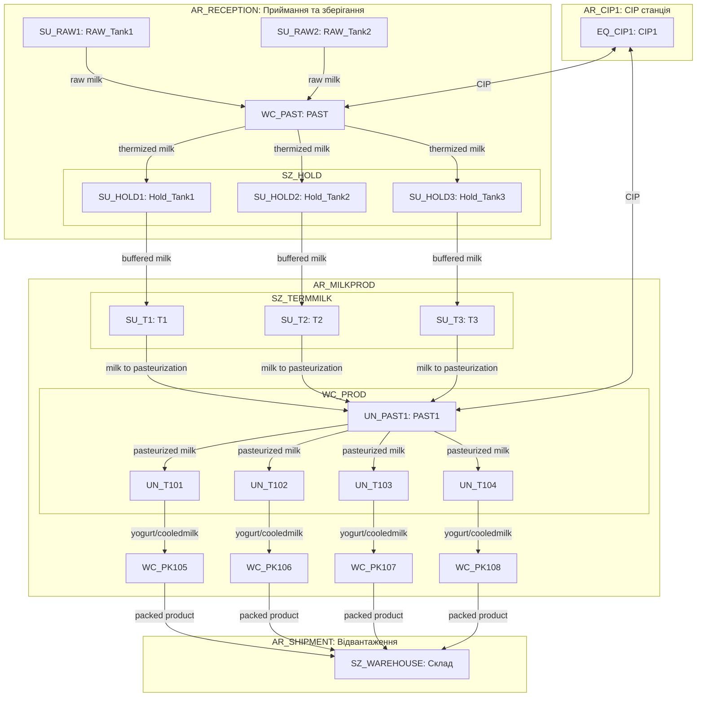
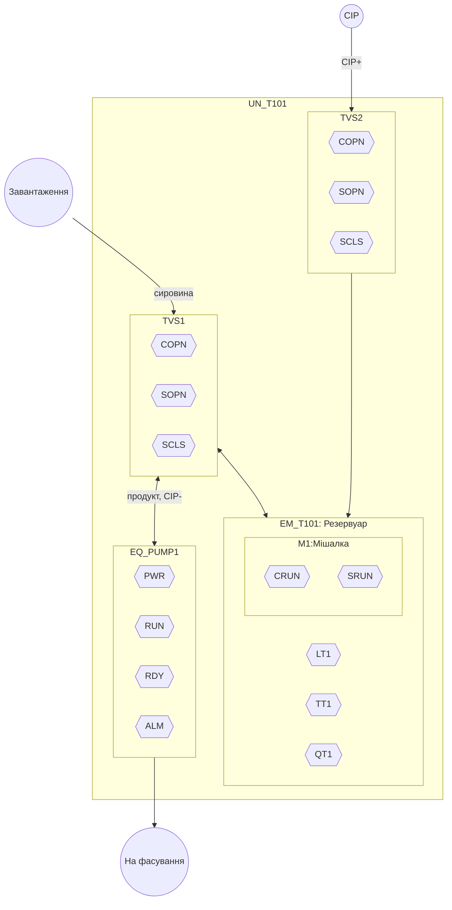
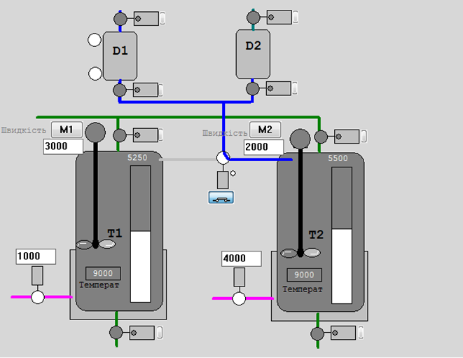
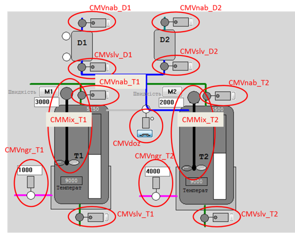
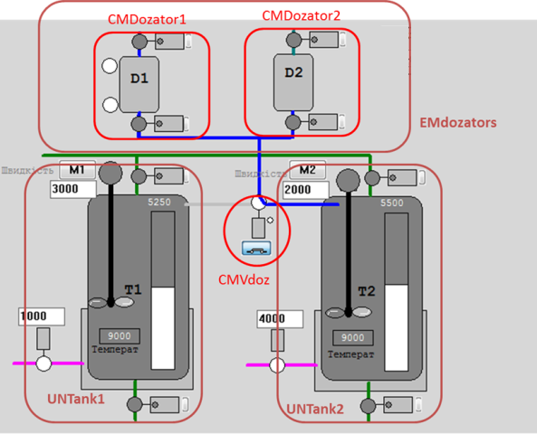

[<- До підрозділу](README.md)		[Коментувати](#feedback)

# Проектування рольової ієрархії обладнання згідно стандартів IEC 62264, IEC 61512 та ISA-106: практична частина

## Основні теоретичні відомості

### Загальні підходи

При розробленні рольової моделі обладнання необхідно провести наступні дії (не повний перелік):

- виділити всі фізичні об'єкти, що мають функціональне значення в технологічному процесі
- ідентифікувати кожен об'єкт, тобто надати йому унікальне в проекті символьне позначення
- визначити об'єкти відповідно до їх ролі в ієрархії керуванні (Control Module, Equipment Module, Unit, Work Center тощо)
- класифікувати обладнання за функціональними класами (дискретні, аналогові, позиційні тощо)
- визначити взаємозв’язки та інтерфейси: які об’єкти взаємодіють, які сигнали/події обмінюються, перелік команд
- означити для кожного класу типовий набір функціональних елементів та автомат станів для них 
- означити режими роботи для кожного функціонального елементу: автоматичний/ручний, аварійний, тестовий/імітація, заблокований, інші
- описати алгоритми керування або регулювання функціональних елементів: ПІД-регулювання, імпульсна логіка, позиційне керування, алгоритми дозування
- означити поширення режимів та станів
- задати візуальне представлення кожного об’єкта: іконка, шаблон для SCADA, логічне групування
- сформувати інформаційну модель кожного об’єкта: ідентифікатор, тип, стан, сигнали, параметри
- описати типові тривоги: порушення переходу станів, тайм-аути, відсутність підтвердження, аварійні умови
- означити дії при тривогах: переходи в безпечний стан, інформування оператора, блокування функцій
- передбачити механізми відновлення після помилок або збоїв
- задокументувати модель у форматі, придатному для повторного використання: шаблони для PLC, SCADA, MES, інтеграція в інженерні інструменти

Такий підхід дозволяє створити масштабовану, уніфіковану архітектуру системи з чітко визначеною поведінкою кожного об’єкта в усіх режимах.

### Декомпозиція відповідно до стандартів інтегрування

**Декомпозиція обладнання** — це процес поділу фізичної або логічної структури технологічного обладнання на окремі керовані елементи, які мають самостійне функціональне значення в системі керування. Вона виконується для того, щоб: означити роль кожного елемента в ієрархії керування; задати автомат станів, режими, алгоритм керування та інтерфейси для кожного з елементів; забезпечити масштабованість, повторне використання і модульність у проєкті. Правильно виконана декомпозиція є основою для уніфікації керування, побудови рецептів, тривожної сигналізації, візуалізації та тестування.

З точки зору ієрархії керування, яка наразі є загальноприйнятою і означеною в стандарті ISA-95/IEC-62264, системи керування на рівні підприємства (L4), виробництва (L3) та технологічного процесу (L1,L2) мають принципово різні цілі, об'єкти та предмети, тому варто проводити декомпозицію з використанням різних критеріїв. Таким чином, при декомпозиції загальну модель варто розглядати в деталізації в трьох рівнях:      

- верхні рівні обладнання (ERP<->MOM): `Enterprise -> Site -> Area`
- середні рівні обладнання (MES/MOM<->АСКТП): `Area -> Work Centers -> Units` 
- нижні рівні обладнання (АСКТП): `Unit -> Equipment Modules` 

Це дає змогу зробити необхідну деталізацію для кожного з рівнів при врахуванні ієрархічних зв'язків на всіх рівнях. 

Для верхніх рівнів ієрархії, а саме `Enterprise -> Site -> Area` критеріями декомпозиції є як правило організаційні, а саме

1. Enterprise (Підприємство). Це найвищий рівень ієрархії, що представляє всю організацію або корпорацію. Декомпозиція на цьому рівні базується на:

- Юридичній структурі: окремі юридичні особи або бізнес-одиниці.

- Географічному розташуванні: різні країни або регіони, де присутня компанія.

- Організаційній структурі: розподіл на стратегічні бізнес-одиниці або дивізіони.

2. Site (Майданчик). Цей рівень відповідає за конкретні фізичні або логічні локації, де відбувається виробництво або інші операції. Критерії декомпозиції включають:

- Фізичне розташування: окремі заводи, фабрики або виробничі комплекси.

- Функціональне призначення: виробничі, складські, дослідницькі або адміністративні майданчики.

- Операційна автономність: рівень самостійності в керування процесами та ресурсами.

3. Area (Цех, відділення). Цей рівень деталізує Site на менші функціональні або фізичні зони. Декомпозиція може базуватися на:

- За типом продукції, що виготовляється, або за наданими послугами 
- Функціональних підрозділах: відділи якості, технічного обслуговування або логістики.
- Управлінських зонах: зони, підпорядковані певним менеджерам або командам.

Ця ієрархічна структура дозволяє ефективно організувати керування ресурсами на рівні підприємства, забезпечити чіткий розподіл відповідальності, краще зосередитися на бізенспроцесах та оптимізувати інформаційні потоки між різними рівнями організації.

Критерії для декомпозиції на середніх рівнях обладнання (MES/MOM<->АСКТП), а саме `Area -> Work Centers -> Units` залежать від типу виробництва: неперервне, порційне, дискретне або зберігання. Ці критерії опираються на стандарти ISA-95, ISA-88, ISA-106 та їх аналоги. Зокрема можна виділити такі критерії:

- **Work Center (Робочий центр)**. 
  - виконання одного або кількох виробничих завдань (операцій, партій, замовлень)
  - наявність власного плану завантаження в MES (диспетчеризація)
  - ресурс, що може бути розпланований як одиниця (наприклад, виробнича лінія, CIP-система, фасувальна установка)
  - має власний набір засобів керування, операційний персонал, операторський інтерфейс
  - виділяється щодо способу виробництва: неперервне, порційне, дискретне, зберігання 
    - для неперервного виробництва відповідає фізично або функціонально ізольованій ділянці неперервного технологічного потоку, що виконує один або кілька цільових підпроцесів.
    - у порційному виробництві часто відповідає одному або групі реакторів, танків
    - в дискретному виробництві — група машин, зібраних за принципом технологічної послідовності
    - в зберіганні — логістичний сегмент: холодильний склад, зона підготовки замовлень, зона зважування

- **Unit (Технологічний вузол)**. 
  - реалізація цілісної рецептури або частини рецептури, яка керується процедурно
  - наявність автономної рецептурної логіки: phases, operations, procedures
  - обов’язкова наявність контролю станів, режимів, тривог
  - може бути прив’язаний до одного замовлення або партії (порція)
  - виконує повністю завершену технологічну функцію (реактор, мішалка, підігрівач, дозатор, CIP Unit)
  - має власну автоматизацію, яка дозволяє протестувати або експлуатувати Unit окремо

Починаючи з робочих центрів, правила декомпозиції, прийняті практики та термінологія суттєво залежать від типу виробництва та використання стандартів.  У таблиці 1. наведене найменування обладнання в різних стандартах.

Таблиця 1. Найменування обладнання в стандартах ISA-88, ISA-95 та ISA-106

| Рівень (згори) | ISA-106    | ISA-95 (загальне/неперервне)  | ISA-88 (2га редакція) |
| -------------- | ---------- | ----------------------------- | --------------------- |
| 7              | Enterprise | Enterprise                    | Enterprise            |
| 6              | Site       | Site                          | Site                  |
| 5              | Plant      | Area                          | Area                  |
| 4              | Plant Area | Work Center / Production Unit | Process Cell          |
| 3              | Unit       | Work Unit / Unit              | Unit                  |
| 2              | Equipment  | -                             | Equipment Module      |
| 1              | Device     | -                             | Control Module        |

З точки зору ISA-88 та IEC-61512 для рівня АСКТП найвищим рівнем обладнання є технологічна комірка, для неперевного виробництва це виробничий вузол (Production Unit). Технологічна комірка (Process cell), що описана в стандарті ISA-88 відповідає робочому центру (Work Center) означеному в IEC 62264 та ISA 95. Технологічна комірка представляє собою логічне угруповання, яке вміщує обладнання, що необхідне для виробництва однієї або декількох партій (напів)продукту. Вона означує діапазон логічного керування одним набором технологічного обладнання в межах цеху. Наявність технологічної комірки дає можливість планувати на основі неї виробництво і розробити стратегію керування усім процесом. Технологічна комірка згідно ISA-88 включає технологічні вузли (units), модулі технологічного обладнання (equipment modules) та модулі керування (control modules), що потрібні для створення однієї або більше партій. Ідея ISA-88 в тому, що для технологічної комірки існує рецепт (recipe), в якому вказується що саме і з використанням якого саме обладнання буде робитися в межах неї. Цей рецепт означується технологами і включає процедуру приготування для партії (напів)продукту (procedure) та додаткові параметри. Процедура технологічної комірки у свою чергу ділиться на менші процедури технологічного вузлу (unit procedure), які можуть ділитися на етапи (phase) таким чином формуючи так звану "технологічну програму" приготування. 

У ISA-106, технологічний вузол (Unit) як і у випадку з ISA-88 носить основне технологічне навантаження, серед критеріїв його виділення вказуються виконання технологічних процесів над продуктом та виконання завдань дещо незалежно відносно іншого суміжного обладнання. Разом з іншими суміжними технологічними вузлами відбувається поступова зміна основних властивостей продукту в потоці відповідно до технології. На відміну від ISA-88, в якому навіть непродуктові робочі центри можна реалізовувати через вузли порційного типу, у ISA-106 є чітке відсилання на використання технологічних вузлів тільки для процесів над продуктом. Якщо це не так, таке обладнання зветься Utility, і у фізичній ієрархії вона займає нижчий рівень, а саме обладнання (Equipment), яке знаходиться безпосередньо під рівнем заводського цеху (Plant Area). Прикладом Utility є обладнання CIP. 

Пристрій (Device) в ISA-106 включає логіку керування, яка не може бути змінною, однак може параметруватися. Останнє принципово відрізняється від аналогічного рівня Control Module фізичної моделі ISA-88.  Проміжним місцем в ієрархії є обладнання (Equipment), яке робить кінцеву сукупність технологічних дій і включає в себе інше обладнання або/та Пристрої. Щоб в даній статті розрізняти загальне поняття "обладнання" від конкретно цього рівня, останній надалі буде писатися з великої літери, як і назви інших рівнів. Це обладнання є першим рівнем з низу, для якого можна використовувати процедури. При цьому усі рівні в даному стандарті можуть бути опущені, за винятком Device (Пристрій), який представляє будь яке обладнання КВПіА (датчики, перетворювачі, виконавчий механізм або інший елемент керування). Принциповим моментом в стандарті є те, що на відміну від ISA-88, об’єкти у фізичній моделі ISA-106 представляють лише фізичні елементи та не включають алгоритми керування, які можуть бути пов’язані з ними, якщо вони не є частиною пристрою. 

Нижні рівні обладнання для дискретного виробництва розглядається в технічному звітів ISA-TR88.00.02 Machine and Unit States: An Implementation Example of ISA-88 (2008), на базі якого розроблено специфікацію PackML. Також така модель обладнання розглядається в документах RAMI4.0. 

Найбільш пророблені з точки зору практик використання на сьогодні є ті, які прийняті в ISA-88/IEC-61512. Згідно них до обладнання рівня Control Module (ISA-88) або Device (ISA-88) можна віднести наступні:

- виконавчі механізми: електромагнітні клапани, моторизовані засувки, пневмоприводи
- вимірювальні прилади: датчики температури, тиску, рівня, витрати, pH, електропровідності
- силові модулі: пускачі, частотні перетворювачі, реле
- контрольні пристрої: сигналізатори рівня, обмежувачі тиску, термостати
- зчитувальні пристрої: індуктивні, ємнісні, оптичні та інші типи датчиків положення
- пристрої індикації та локального управління: кнопки, тумблери, світлодіоди, дисплеї

До обладнання рівня Equipment Module (ISA-88) або Equipment (ISA-88) можна віднести наступні:

- дозуючий вузол з клапаном, витратоміром і логікою контролю об’єму або маси
- вузол нагріву з температурним датчиком, виконавчим елементом і ПІД-регулятором
- мішальний модуль із регульованою швидкістю, датчиком струму або навантаження
- вакуумний модуль з насосом, вакуумметром і логікою підтримки рівня вакууму
- охолоджувальний контур з регулятором температури, змішувальним клапаном і датчиком
- автоматичний вузол завантаження сировини з шнеками, шлюзами, сенсорами рівня
- блок керування окремою фазою CIP або регенерації в фільтраційній установці
- система стабілізації тиску або температури в реакторі як окремий керований функціональний вузол

Таке обладнання виконує автономні функції з чіткою логікою, але ще не керує всім процесом (як Unit), а лише окремою фазою або підзадачею.

До Технологічного вузла (Unit) порційного типу можна віднести:

- змішувальний бак, що виконує цикл наповнення, змішування, нагріву та вивантаження за рецептом
- реактор для періодичного проведення хімічної або біохімічної реакції з контролем фаз
- ємність для пастеризації або термічної обробки з керованим циклом нагріву, витримки, охолодження
- дистилятор порційного типу, що працює за заздалегідь означеною послідовністю операцій
- установка підготовки або обробки сировини з порційною подачею та виконанням технологічних фаз (подрібнення, змішування, контроль вологості)
- вакумапарати цукрового виробництва

Такі вузли керуються за процедурною моделлю (procedure, operation, phase), мають рецепти і управляються як цілісні об’єкти в рамках ISA-88.

До Технологічного вузла (Unit) неперервного типу можна віднести:

- теплообмінник, що забезпечує постійне нагрівання або охолодження потоку продукту
- стрічкова або шнекова транспортерна лінія для безперервного переміщення матеріалу
- млин або подрібнювач, що працює в постійному режимі з безперервною подачею і відбором
- сепаратор або фільтр, який здійснює безперервне розділення фаз або видалення домішок
- пастеризатор трубчастого типу з постійним потоком продукту
- змішувальна установка з динамічним мішанням у трубопроводі
- вібраційне сито або центрифуга для безперервного сортування/осадження
- установка зневоднення або сушіння, яка обробляє матеріал безперервним потоком

Ці вузли функціонують постійно, без рецептурної послідовності фаз, з можливістю стабілізації режимів у реальному часі. Управління ними часто реалізується через регулятори (PID) і автомати станів з мінімальним використанням процедурного контролю.

Критерії декомпозиції обладнання нижнього рівня керування описуються в стандартах ISA-88, ISA-106 і в загальному передбачають такі основні принципи:

1. Наявність єдиного набору операційних станів та режимів — кожен об'єкт обладнання повинен мати чітко означений автомат станів, що відображає його поточний стан і дозволяє уніфіковано управляти ним та підтримувати режими, як-от автоматичний, ручний, аварійний тощо, які є незалежними від процедур керування.
2. Наявність тривог — об'єкт повинен мати набір тривожних станів, які можуть бути інтерпретовані незалежно від вищих рівнів керування.
3. Функціональна завершеність — об’єкт повинен реалізовувати хоча б одну технологічну або керуючу операцію, яка може бути описана окремо від інших елементів системи.
4. Наявність KPI (ключових показників ефективності) — для об’єкта мають бути означені показники якості функціонування, які використовуються для аналітики або оптимізації.
5. Можливість незалежного планування та використання — якщо об’єкт може бути запланований до використання окремо (наприклад, окремий дозатор чи підігрівач), це ознака самостійного елементу в ієрархії.
6. Наявність власного набору змінних (тегів) та інтерфейсів — кожне обладнання повинне мати свій набір змінних у системі автоматизації, які використовуються для керування ним або моніторингу.

### Ідентифікація сутностей

При декомпозиції обладнання за рольовою ознакою, кожна одиниця повинна ідентифікуватися. Пропонується надавати наступні префіксні позначення залежно від ієрархічного рівня:

- `AR_` — *Area* (ділянка, цех, установка);
- `WC_` — *Work Center* (робочий центр);
- `UN_` — *Unit* (технологічна одиниця, основна функціональна підсистема);
- `EQ_` — *Equipment Module* (модуль обладнання, наприклад, бак, теплообмінник, мішалка);
- `SZ_` — *Storage Zone* (зона зберігання, склад);
- `SU_` — *Storage Unit* (одиниця зберігання, бункер, контейнер, палето-місце).
- без префікса, за префікс береться устковання, до якого належить  — *Control Module* або пристрій (локальний елемент керування: клапан, двигун, датчик, привід); див. теги

Таким чином ідентифікатор утворюється шляхом конкатенації префіксу з унікальним скороченим кодом, наприклад:

 `AR_BRW`, `WC_MASH`, `UN_T101`, `EQ_TANK03`, `T101_TV04`, `SU_HOP`.

У межах інформаційної моделі КІСК ці позначення можуть використовуватися як ключі для логічного зв’язування об’єктів з описами функцій, даними конфігурації, тегами SCADA, файлами проєкту, елементами рецептур та іншими ресурсами. При цьому слід забезпечити однозначність ідентифікації та відповідність між рівнями. Структура імен повинна бути сталою і задокументованою в проєкті.

### Артефакти декомпозиції

У результаті декомпозиції означується:

- перелік виділеного обладнання з символьним позначенням та зазначеними рівнем ієрархії 
- означення зв'язків з іншим обладнанням: ієрархічних в рольовій ієрархії, горизонтальних по потоку, блокувальних і т.п.
- визначення можливих входів/виходів з процесом: перелік датчиків, виконавчих механізмів, іншого обладнання, з яким є зв'язки або потенційно можуть з'явитися.   

При графічному поданні для відображення всіх типів зв'язків між обладнанням, ієрархію рекомендується подавати через відображення вкладеності, тоді як інші зв'язки через лінії або стрілки. Наприклад в Mermaid для цього добре підходять схеми `flowchart`, де вкладеність можна показати через `subgraph`, що відображають структурну підлеглість (`area` → `work center` → `unit` → `equipment module`), а стрілками між об’єктами можна вказати на продуктові потоки (наприклад, молоко, йогурт) або енергетичні/допоміжні потоки (наприклад, CIP, холодоагент). 

На рис.1 наведено приклад фрагменту рольової структури підприємства з виробництва молочних продуктів у форматі `Mermaid` до рівня `Unit` включно, де показано як обладнання структуровано за цехами та модулями, а також відображено основні технологічні потоки між ними. У цій моделі: вся структура обладнання розподілена за функціональними ділянками (area), кожен об’єкт має рольовий префікс (`SU_`, `EQ_`, `WC_`, `SZ_` тощо). Стрілки позначають напрямки переміщення продукту між обладнаннями, що дозволяє поєднати фізичну структуру і логіку виробничого процесу в єдиній візуальній формі. Така схема корисна в розрізі проектування на рівні MOM. 

рис.1. Приклад відображення ієрархії обладнання в контексті виробничих потоків від рівня Site до рівня UNIT.

Для рівня АСКТП варто розглядати декомпозицію починаючи від робочого центру. Якщо робочий центр має кілька технологічних вузлів (Unit), то варто робити схеми на кожну з них. На рис.2 показаний приклад такої схеми для танка приготування продукту (`UN_T101`), в якому відображено типову внутрішню структуру обладнання до рівня `Control Module`.

рис.2. Приклад відображення ієрархії обладнання в контексті виробничих потоків від рівня UNIT до CM.

Під схемами варто наводити перелік умовних позначень, наприклад як це показано в таблиці 2 

Таблиця 2. Перелік умовних графічних позначень

| Графічне позначення                                          | Найменування                           | Примітка                                                     |
| ------------------------------------------------------------ | -------------------------------------- | ------------------------------------------------------------ |
|  | обладнання що включає інше обладнання  | включеність через влкадення, позначення в Mermaid `subgraph` |
|  | CM нижнього рівня                      | не має вкладених CM, позначення в Mermaid  `T101_PUMP_PWR{{PWR}}` |
|  | Вхідний / вихідний технологічний потік | Місця підключення до суміжного обладнання                    |
|  | Матеріальний або енергетичний потік    |                                                              |

Таблиця 3. Перелік позначень

| **Позначення**   | **Тип елемента**             | **Опис / Функція**                                |
| ---------------- | ---------------------------- | ------------------------------------------------- |
| `UN_T101`        | Unit                         | Технологічна одиниця (танк приготування продукту) |
| `EM_T101`        | Equipment Module             | Основний резервуар                                |
| `T101_LT1`       | Control Module (Датчик)      | Вимірювання рівня                                 |
| `T101_TT1`       | Control Module (Датчик)      | Вимірювання температури                           |
| `T101_QT1`       | Control Module (Датчик)      | Вимірювання витрати                               |
| `T101_M1`        | Control Module (Мішалка)     | Виконавчий механізм змішування                    |
| `T101_M1_CRUN`   | Control Module (Керування)   | Команда на запуск мішалки                         |
| `T101_M1_SRUN`   | Control Module (Датчик)      | Зворотний сигнал роботи мішалки                   |
| `T101_TVS1`      | Control Module (Клапан)      | Клапан для завантаження / відкачування            |
| `T101_TVS1_COPN` | Control Module (Керування)   | Команда відкрити клапан TVS1                      |
| `T101_TVS1_SOPN` | Control Module (Датчик)      | Датчик — положення “відкрито” для TVS1            |
| `T101_TVS1_SCLS` | Control Module (Датчик)      | Датчик — положення “закрито” для TVS1             |
| `T101_TVS2`      | Control Module (Клапан)      | Клапан подачі CIP-розчину                         |
| `T101_TVS2_COPN` | Вихід сигналу                | Команда відкрити клапан TVS2                      |
| `T101_TVS2_SOPN` | Вхід сигналу                 | Датчик — положення “відкрито” для TVS2            |
| `T101_TVS2_SCLS` | Вхід сигналу                 | Датчик — положення “закрито” для TVS2             |
| `EQ_PUMP1`       | Equipment Module             | Насосний агрегат                                  |
| `T101_PUMP_PWR`  | Вхід сигналу                 | Наявність живлення насоса                         |
| `T101_PUMP_RUN`  | Вхід сигналу                 | Стан: насос обертається                           |
| `T101_PUMP_RDY`  | Вхід сигналу                 | Насос готовий до роботи                           |
| `T101_PUMP_ALM`  | Вхід сигналу                 | Стан аварії насоса                                |
| `IN_PRODUCT`     | Умова/вузол (вхідний потік)  | Завантаження сировини                             |
| `IN_CIP`         | Умова/вузол (вхідний потік)  | Подача CIP-розчину                                |
| `OUT_PRODUCT`    | Умова/вузол (вихідний потік) | Продукт на фасування                              |

### Класифікація обладнання за типами 

Враховуючи можливу велику кількість різноманітного обладнання на об'єкті, варто зробити його класифікацію. Класифікація обладнання в загальному проводиться для виділення однотипного обладнання, що дає можливість зосередити роботи над ними. Особливо це варто зробити для обладнання рівня Equipment Module, або Control Module, які представляють собою об'єднання групи обладнання нижчого рівня. До них відносяться в тому числі виконавчі механізми. Виділення окремих класів виконавчих механізмів можна зробити за наступними принципами:        

- За типом ВМ, та керуванням наприклад:

  - двигуни для керування приводами, з ПЧ або без ПЧ
  - двигунні ВМ типу відкрито/закрито, без нормального положення
  - запірні ВМ з нормальним положенням (нормально відкриті, або нормально закриті)
  - ВМ типу більше/менеш 

- За вимогами до зворотного зв’язку, що впливає на контроль переходів між станами й діагностику помилок, наприклад:

  - із підтвердженням стану (кінцеві вимикачі, датчики положення)

  - без підтвердження (логіка на час або на довіру)

- За наявними входами/виходами з однаковим призначенням
  - стан кнопок, перемикачів режимів за місцем
  - стан готовності/живлення привода
  - стан аварія/блокування приводу

У таблиці 4  показаний фрагмент відомості, в якій наведені класи обладнання, з зазначеними загальними властивостями та переліком обладнання, до яких вони належать. 

Таблиця 4. Відомість класів та екземплярів обладнання

| Рівень | Позначення класу | Найменування              | Характеристики                                               | обладнання класу                         |
| ------ | ---------------- | ------------------------- | ------------------------------------------------------------ | ---------------------------------------- |
| EM     | EM_PRESS         | Прес                      | Механізм для пресування насіння, керує приводами преса, живильника, маслосатнції (послідовність запуску та зупинки) контролює стан преса, загальні тривоги, має кілька режимів роботи | `EM_Press1`, `EM_Press1`, `EM_Press3`,   |
| CM     | DRVPR            | Головний привід для преса | Двигун керується перетворювачем частоти, контроль готовності, має керування по місцю, безпековий захист, контроль перевантаження за струмом | `Press1_M21`, `Press2_M48`, `Press3_M14` |
|        | ...              |                           |                                                              |                                          |

### Приклад декомпозиції на нижньому та середніх рівнях

Розглянемо приклад декомпозиції технологічної установка приготування рідких сумішей, яка складається з наступних елементів (рис.3):

1)танки Т1 та Т2, в яких готовляться продукти за різними рецептами; танки обв’язані наступними засобами КВПіА:

- запірні клапани набору та зливу, кожний з датчиками кінцевого положення "закритий" та "відкритий";

- регулюючий клапан (0-100%) подачі теплоагента у теплообмінний кожух танку (далі по тексту клапан нагрівання);

- датчик рівня (0-100%) в танку;

- датчик температури в танку (0-100°С); 

2)дозатори (мірні ємності) D1 та D2, які забезпечують подачу дози компоненту; дозатори обв’язані наступними засобами КВПіА:

- сигналізатор нижнього і верхнього рівнів;

- запірні клапани набору та зливу, кожний з датчиками кінцевого положення "закритий";

3)3-ходовий клапан перемикання трубопроводу подачі з дозаторів на танки T1 та T2; в нормальному стані положення "на Т1"; має датчики кінцевого положення "Т1" та "Т2".

Рис.3 До прикладу керування установкою приготування

**Control Module**

Почнемо декомпозицію обладнання з нижніх рівнів керування, а саме Control Module (CM). По факту усі засоби контролю та керування є типовими представниками CM, однак в даному випадку зосередимося на композитних CM, серед яких типовими є виконавчі механізми. Наприклад клапан окрім дискретних сигналів (відкрити/закрити) потребує:

- контролю стану за наявними датчиками положення;

- сигналізування при несправності: не відкрився, не закрився, зрушив зі стану без команди;

- функціонування в режимах ручний/автоматичний: при ручному режимі команди керування видаються оператором.

Окрім цього, в залежності від типу ВМ, додатково може знадобитися ведення певної статистичної інформації про кількість включень, кількість тривог за певний час і т.д. Таким його варто виділити в ієрархії обладнання, як окрему сутність, що є композитною, тобто включає в себе інше обладнання. 

З точки зору фізичної моделі, виконавчий механізм – це реальний фізичний пристрій, який знаходиться на найнижчому рівні ієрархії фізичних пристроїв підприємства. В термінах ISA-88, виконавчий механізм підходить до рівня Модуль Керування (Control Module, CM). CM може виконувати тільки базові функції керування (basic control). На рис.4 показаний можливий варіант виділення CM для наведеного об’єкта керування, а в табл. 5 наведений перелік цих об’єктів а також класи обладнання.

Таблиця 5. Перелік CM та параметрів їх роботи

| Назва CM  | Опис                        | Вихідні змінні (на ВМ) | Вхідні змінні (датчики)          | Клас                                    |
| --------- | --------------------------- | ---------------------- | -------------------------------- | --------------------------------------- |
| CMVnab_D1 | Клапан набору D1            | VNabor_D1_M            | VNabor_D1_CLS_M                  | Клапан з дискретним керуванням `cmVLVD` |
| CMVslv_D1 | Клапан зливу D1             | VSliv_D1_M             | VSliv_D1_CLS_M                   | Клапан з дискретним керуванням `cmVLVD` |
| CMVnab_D2 | Клапан набору D2            | VNabor_D2_M            | VNabor_D2_CLS_M                  | Клапан з дискретним керуванням `cmVLVD` |
| CMVslv_D2 | Клапан зливу D2             | VSliv_D2_M             | VSliv_D2_CLS_M                   | Клапан з дискретним керуванням `cmVLVD` |
| CMVnab_T1 | Клапан набору T1            | VNabor_T1_M            | VNabor_T1_OPN_M  VNabor_T1_CLS_M | Клапан з дискретним керуванням `cmVLVD` |
| CMVslv_T1 | Клапан зливу T1             | VSliv_T1_M             | VSliv_T1_OPN_M  VSliv_T1_CLS_M   | Клапан з дискретним керуванням `cmVLVD` |
| CMVnab_T2 | Клапан набору T2            | VNabor_T2_M            | VNabor_T2_OPN_M  VNabor_T2_CLS_M | Клапан з дискретним керуванням `cmVLVD` |
| CMVslv_T2 | Клапан зливу T2             | VSliv_T2_M             | VSliv_T2_OPN_M  VSliv_T2_CLS_M   | Клапан з дискретним керуванням `cmVLVD` |
| CMVdoz    | Клапан перемикання дозатору | VDoz_T1toT2_M          | VDoz_T1_OPN_M  VDoz_T2_OPN_M     | Клапан з дискретним керуванням `cmVLVD` |
| CMVngr_T1 | Клапан нагрівання Т1        | VNagrev_T1_M           | відсутні                         | Регулюючий клапан `cmVLVA`              |
| CMVngr_T2 | Клапан нагрівання Т2        | VNagrev_T2_M           | відсутні                         |                                         |
| CMMix_T1  | Мішалка Т1                  | KM1_M  SC1_SP          | GSM1_M                           | Мішалка `cmMIX`                         |
| CMMix_T2  | Мішалка Т2                  | KM2_M  SC1_SP          | GSM2_M                           |                                         |

                          

Рис.4. Виділення Модулів Керування (CM)

**Work Center та Unit**

Наведену установку можна віднести до рівня Work Center типу Process Cell, яка включає два технологічні вузли порційного типу (Unit). 

Виділення Process Cell зроблено за наступними критеріями.

- Установка реалізує завершений виробничий процес. Встановлення виконує повний цикл перетворення сировини у продукт: подача → змішування → нагрів → вивантаження. Продукт, отриманий на виході, є результатом замкненого технологічного рецепту.
- Має рецептурну (процедурну) логіку керування і складається з одного або кількох Unit. Наявна структура керування у вигляді фази/операції (наповнення, змішування, нагрівання і т.п.) — ознака Unit Procedure, тому кожен танк є Unit, який виконує послідовні дії над порцією продукту.
- Має локальну автономну інфраструктуру керування. Включає мішалки, нагрівачі, клапани, датчики, що інтегровані в єдиний сценарій керування.
  Оператор може керувати установкою як цілим об’єктом.
- Може бути запланована в MES як ресурс Work Center. Приймає замовлення на партію або серію партій. Має відстежувані показники ефективності (наприклад, продуктивність, час партії, якість)
- Має власний набір KPI та зону відповідальності. Для цього об’єкта можуть бути призначені оператори, обслуговуючий персонал, засоби технічного моніторингу. Звітність і контроль охоплюють весь Work Center як одну сутність.

Виділення Unit зроблено за наступними критеріями.

- Реалізують завершену рецептурну функцію (Unit Procedure). Кожен змішувач виконує повний цикл обробки партії: наповнення → змішування → нагрів → вивантаження. Можуть запускатися незалежно один від одного, у тому числі паралельно з окремими параметрами. Враховуючи, що продукт може готуватися одночасно в двох танках, то в цій технологічній комірці може одночасно виконуватися приготування двох партій продукту. 

- Мають структуровану послідовність етапів (Phases). До кожного танку прив’язаний набір типових етапів: наповнення, змішування, тощо, які відповідають структурі ISA-88. Ці етапи мають уніфіковані інтерфейси, умови виконання та переходи станів.

- Мають власний набір керованих ресурсів нижчого рівня. Кожен Unit включає:

  - мішалку з окремим керуванням швидкістю (M1, M2)

  - температурний датчик та нагрівач з регулятором

  - набір клапанів (впускні, зливні)

    Усі ці ресурси можуть контролюватися локально, логікою керування всередині Unit.

- Фізично і логічно відокремлені. Мають окремі трубопроводи, входи, виходи, ізольовані сегменти керування. Можуть працювати паралельно або асинхронно, незалежно від інших Unit.

- Зв’язок із партією (порцією). Кожен танк обробляє окрему партію, що у MES або SCADA відстежується окремо. Ідентифікація продукту, час виконання, операторські події прив’язані до конкретного Unit.

**Інші CM та QM**

Для обох танків використовується одна установка дозування, яка включає в себе два дозатори та клапан перемикання `CMVdoz`. З точки зору процедурного керування установка робить дві дії – дозування певної кількості компоненту A (Дозатор `D1`) та B (Дозатор `D2`). Ці технологічні дії найбільш підходять до функцій етапу (phase). Тому в межах обладнання необхідно створити етапи: `Добавити А` та `Добавити B`, в параметрах яких задавати необхідну кількість доз компоненту. 

Рис.5. Виділення Агрегату (EM) та Апаратів (UN) у технологічній комірці

Тепер необхідно визначитися з тим, до якого рівня обладнання відноситься установка дозування. Оскільки етап – це процедурне керування, він може виконуватися в Апараті (Unit), в Агрегаті (Equipment Module) або в Технологічній Комірці (Process Cell). Установка дозування найкраще підходить до поняття Агрегату (Equipment Module), так як в ній НЕ готовиться продукт і вона є допоміжним обладнанням. Самі дозатори зручно реалізувати у вигляді модулів керування, які будуть брати на себе усю логіку підрахунку кількості доз. Таким чином, до складу Технологічної комірки крім танків входять два модулі керування дозаторами `CMDozator1` та `CMDozator2` , які будуть в складі Агрегату `EMDozators` .     

У моделі обладнання установка дозування не належить жодному танку, оскільки може використовуватися будь яким з них. З цього слідує декілька висновків:

- агрегат «Дозатори» (`EMDozators`) в моделі обладнання належить безпосередньо Технологічній Комірці;

- агрегат «Дозатори» є спільним ресурсом з ексклюзивним користуванням (exclusive used resource), так як може використовуватися будь яким танком, але не одночасно;

- перед користуванням дозаторів рецептам необхідно буде їх йому надати (allocation), щоб під час володіння ресурсом тільки один рецепт користувався ним;

- після надавання дозаторів у використання, клапан `CMVdoz` повинен стати у відповідну позицію; звідси слідує, що даний клапан теж належить технологічній комірці а не танкам.

Загальна модель апаратурних об’єктів показана на рис.6. Для спрощення на рисунку показані не всі об’єкти.  

 

Рис.6. Узагальнена модель апаратурних об’єктів (Equipment Entity Model)

## Завдання для самостійної роботи

1. Відповідно до технологічної схеми, або схеми автоматизації в курсовому проєкті виділіть CM найнижчого рівня та композитні CM. Надайте їм символьні позначення.
2. Створіть в Mermaid схему для одного з CM.
3. Відповідно до опису виробництва зробіть декомпозицію верхніх рівнів Enterprise -> Site -> Area -> Work Center. Надайте їм символьні позначення.
4. Відповідно до технологічної схеми та опису виробництва зробіть декомпозицію рівнів Work Center -> Unit -> EM -> CM. Надайте їм символьні позначення.
5. Створіть в Mermaid схему від Site до рівня UNIT.
6. Класифікуйте обладнання в межах одного робочого центру.  

## Питання для самоконтролю знань

1. Що таке рольова модель обладнання і з якою метою вона створюється?
2. Які основні дії виконуються при розробленні рольової моделі обладнання?
3. Що означає декомпозиція обладнання і чому вона є необхідною?
4. Які рівні ієрархії обладнання означені у стандартах ISA-88/95/106?
5. Які критерії використовуються для декомпозиції рівня Enterprise?
6. За якими ознаками визначають рівень Site?
7. Що таке Area і які підходи до її виділення в ієрархії?
8. Чим відрізняється Work Center від Unit?
9. Назвіть критерії, за якими об’єкт можна класифікувати як Work Center.
10. Які типи виробництва враховуються при декомпозиції Work Center?
11. Які ознаки свідчать про те, що вузол є Unit у порційному виробництві?
12. Наведіть приклади обладнання, які можна віднести до рівня Unit.
13. Що таке Equipment Module і за якими ознаками його виділяють згідно ISA-88?
14. Чим Control Module відрізняється від Equipment Module згідно ISA-88?
15. Як забезпечується уніфіковане візуальне подання об’єктів у SCADA?
16. Що таке композитний Control Module і в яких випадках він використовується?
17. Які функції виконує агрегат дозування у наведеному прикладі?
18. Чому агрегат дозування не належить жодному з танків?
19. Що таке ресурс з ексклюзивним використанням і як він надається Unit?
20. Як виглядає типова ієрархія обладнання в Mermaid-схемі?

 

## Джерела

1. 

## Автори

Практичне заняття розробив  [Олександр Пупена](https://github.com/pupenasan). 

## Feedback

Якщо Ви хочете залишити коментар у Вас є наступні варіанти:

- [Обговорення у WhatsApp](https://chat.whatsapp.com/BRbPAQrE1s7BwCLtNtMoqN)
- [Обговорення в Телеграм](https://t.me/+GA2smCKs5QU1MWMy)
- [Група у Фейсбуці](https://www.facebook.com/groups/asu.in.ua)

Про проект і можливість допомогти проекту написано [тут](https://asu-in-ua.github.io/atpv/)
