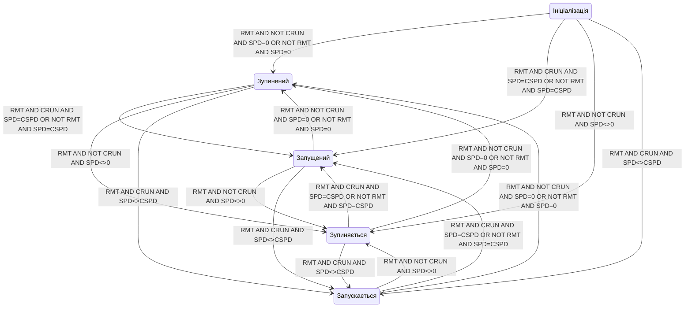

[<- До підрозділу](README.md)		[Коментувати](#feedback)

# Проектування автомату станів для обладнання : практична частина

## Основні теоретичні відомості

### Загальні концепції

Після декомпозиції устатковання та його класифікації необхідно провести проектні діяльності щодо тих сутностей, які представляють його об'єктне представлення та наступну імплементацію в коді. До цих робіт відноситься:     

1. Означення інтерфейсу класів устатковання:
   - означення переліку входів/виходів зв'язку з процесом
   - означення конфігураційних параметрів
   - означення інтерфейсу керування та контролю
2. Означення функціональних елементів устатковання.
   - визначення функціональних елементів, 
   - означення автомату станів функціональних елементів
   - означення режимів роботи функціональних елементів та устатковання вцілому 
   - формування переліку тривог з їх описом та взаємними зв'язками
   - означити поширення режимів і станів в ієрархії
3. Означення процедур устатковання
   - означення автомату станів процедур, режими
   - означення режимів роботи, 
   - означення послідовності виконання

### Означення інтерфейсу класів устатковання 

Означення інтерфейсу класу устатковання варто почати з переліку входів/виходів зв'язку з процесом. Для кожного типу устатковання можна створити окремий лист електронної таблиці, де будуть наводитися усі необхідні дані.

Таблиця 1. Приклад таблиці означення входів/виходів устатковання 

| Позначення класу | Найменування класу | IOName : TYPE | IO Опис                              | Примітка     |
| ---------------- | ------------------ | ------------- | ------------------------------------ | ------------ |
| EM_PRESS         | Прес               | RMT : DI      | Дистанційний                         |              |
|                  |                    | SSA : DI      | Безпековий кінцевик                  |              |
|                  |                    | RDY : DI      | Головний привід Готовність           |              |
|                  |                    | LSTP : DI     | Головний привід Стоп                 |              |
|                  |                    | CRUN : DO     | Головний привід Включення контактора |              |
|                  |                    | SPD : NAI     | дійсне значення швидкості            | Через Modbus |
|                  |                    | CSPD : NAO    | ПЧ завдання на ПЧ                    | Через Modbus |
|                  |                    | SCUR : NAI    | струм                                | Через Modbus |

Означення конфігураційних параметрів передбачає створення переліку та опису тих параметрів, які необхідно задавати зі SCADA/HMI для налаштування роботи устатковання, наприклад: час відкриття/закриття, для контролю спрацювання чи імітації, таймаут спрацювання тривог, час між спрацюваннями датчика швидкості, тощо. 

Означення інтерфейсу керування та контролю передбачає створення переліку команд, які передбачаються для керування устаткованням зі SCADA/HMI та перелік станів. Даний перелік і команди будуть уточненні після означення функціональних елементів устатковання та їх автоматів стану. Також необхідно означити перелік режимів   

### Означення функціональних елементів устатковання 

Означення функціональних елементів - це процес декомпозиції устатковання згідно функціональних ознак. У якості критеріїв, за яким робиться декомпозиція можна виділити наступні:

- наявність одного автомату станів з одним можливим активним станом в один момент часу
- реалізація виключно в межах устатковання однак за взаємодії через інтерфейс устатковання та іншими функціональними елементами
- чітке трактування призначення функціонального елементу 

Типовими функціональними елементами (ФЕ) можуть бути:

- операційний ФЕ, наприклад позиція клапану, або крутіння валу двигуна
- тривожні ФЕ, окремо для кожної тривоги
- комунікаційний ФЕ, взаємодія з комунікаціями   

### Стани та режими устатковання 

**Стан** (**state**) – це загальна властивість, яка вказує на плинне становище якогось об’єкта. Оскільки устатковання включає в себе певні функціональні елементи, то зрештою його стан залежить від станів цих елементів та попереднього стану устатковання. Отже, стан устатковання може оцінюватися з позицій його функціональних елементів, наприклад з точки зору виконуваної операції, наявності тривог, обслуговування (ремонту) чи джерела керування. Тому під «узагальненою сукупністю» розуміється поєднання усіх станів функціональних елементів як єдиного цілого. У залежності від стану устатковання можуть змінюватися як сигнали керування, так і виконувані алгоритми. 

Таким чином, контроль за устаткованням відбувається через відповідні змінні стану, які повинні бути в програмі контролеру, SCADA/HMI, IIoT шлюзі чи іншого інтелектуального засобу. Для дискретних станів функцій це бітові статуси, які приймають значення TRUE/FALSE, або їх комбінація. 

```
бітові статуси = дискретні стани або їх комбінація
```

Сукупність цих станів функціональних об’єктів є об’єднання (конкатенація) цих статусів. У цьому випадку всі стани функціональних об’єктів можна об’єднати в певний упорядкований набір бітів для всього устатковання – слово стану (status word). 

```
слово стану = набір бітових статусів функцій елементів устатковання
```

Використовуючи слово стану інша частина системи може аналізувати устатковання як єдине ціле через бітове представлення. Це дає змогу контролювати як конкретний статус функціонального елементу, звертаючись до нього як до біту, так і як бітову матрицю, використовуючи маску. 

Наприклад, для клапану слово стану може мати вигляд як в таблиці 2. Біти стану можуть взаємно виключати один одного, наприклад біти «ВІДКРИТИЙ» і «ЗАКРИТИЙ», а рівність обидвох бітів 0 – представляти інший стан, наприклад проміжний. Наприклад, якщо біти 5–8 дорівнюють нулю – це вказує на стан «НЕ ВИЗНАЧЕНИЙ». 

Таблиця 2. Приклад слова стану для 2-х позиційного клапану 

| **Біт**   | **Опис**                                           |
| --------- | -------------------------------------------------- |
| 0 ALMOPN  | =1  тривога НЕ ВІДКРИВСЯ                           |
| 1 ALMCLS  | =1  тривога НЕ ЗАКРИВСЯ                            |
| 2 BLCK    | =1 БЛОКОВАНИЙ                                      |
| 3 ALMSHFT | =1 тривога ДОВІЛЬНИЙ ЗСУВ                          |
| 4 ALMSNSR | =1 тривога ПОМИЛКА ДАТЧИКА                         |
| 5 OPNING  | =1 ВІДКРИВАЄТЬСЯ                                   |
| 6 CLSING  | =1 ЗАКРИВАЄТЬСЯ                                    |
| 7 OPNED   | =1 ВІДКРИТИЙ                                       |
| 8 CLSED   | =1 ЗАКРИТИЙ                                        |
| 9 DISP    | =1 РУЧНИЙ  режим (з ПК/ОП), =0  АВТОМАТИЧНИЙ режим |
| 10 MANBX  | =1 МІСЦЕВИЙ  режим                                 |
| 11 ALM    | =1 загальна тривога                                |
| 13 FRC    | =1 хоча би одна зі змінних в  об’єкті форсована    |
| 14 SML    | =1 режим імітації                                  |

Стани стосується не тільки устатковання але і процедур в процедурному керуванні. 

### Автомати станів (State Machines) 

При написанні програми для реалізації об’єкта-устатковання необхідно реалізувати зміну його стану в залежності від станів функціональних елементів та інших об’єктів, що включені в нього. Ці стани необхідно змінювати в залежності від умов. Таку поведінку станів можна описати словесним алгоритмом, на кшталт: 

```
якщо клапан в стані «ЗАКРИТИЙ» і прийшла команда «ВІДКРИТИ», 
 перейти в стан «ВІДКРИВАЄТЬСЯ»
```

Для функції тривожної сигналізації це може виглядати так:

```
якщо клапан в стані «ВІДКРИВАЄТЬСЯ» і не спрацював датчик кінцевого 
 положення і час відкриття більше максимального, то перейти в стан «НЕ ВІДКРИВСЯ»
```

Слід зауважити, що у даному прикладі в алгоритмі керування станами тривожної сигналізації використовуються стани операційної функції. Тобто стани різних функціональних елементів устатковання взаємопов’язані. Це одна з причин, чому функції варто групувати в устатковання. 

Алгоритм, що описує для конкретної функції поведінку переходу між станами називають автоматом станів(state machine). Більш зручним описом автомату станів є графічний – діаграма станів. Вершинами її є стани, а ребрами переходи між станами та відповідні умови. Простий приклад автомату стану операційного функціонального елемента наведений на рис.1. 

 

Рис. 1. Приклад автомату станів для операційного функціонального елементу клапану 

Вище наведений приклад визначення та керування станами але нічого не сказано про дії на реальний об'єкт. У кожному з наведених станів можна робити певні керуючі дії. Наприклад в стані «ВІДКРИВАЄТЬСЯ» вмикати дискретний вихід контролера, що керує клапаном. Крім того, можна вмикати таймер, який буде вказувати на час активності стану, що можна буде використати для керування тривогами. Механізм формування дії на базі станів спрощує керування, так як в певному стані для об'єкта керування нас цікавить значення не усіх датчиків а тільки частини, актуальної для даного стану.   

Використовуючи діаграму операційного функціонального елементу клапану можна описувати алгоритм керування, який в свою чергу може спиратися на інші автомати станів. Інші функціональні елементи цього ж клапану можуть використовувати цей автомат для формування логіки своїх автоматів.

### Режими (Modes) 

Згідно стандарту ISA-88 режим вказує на те, у який спосіб відбувається керування операційними функціями. Зрештою, «режими» це окремо виділені стани, які впливають на особливість виконання (алгоритмів) функцій устатковання, а інколи – і на їх автомати станів.

Для устатковання стандарт ISA-88 рекомендує використовувати два режими: РУЧНИЙ та АВТОМАТИЧНИЙ. У РУЧНОМУ режимі, операційний стан устатковання означується командами з HMI, у АВТОМАТИЧНОМУ – з алгоритму керування. На практиці режимів може бути більше. Наприклад, для згаданого вище клапану, на Рис.2. показана діаграма з додатковими режимами «РУЧНИЙ ПО МІСЦЮ» і «ЗАБЛОКОВАНИЙ». У «РУЧНОМУ ПО МІСЦЮ» режимі, клапан керується байпасним щитком, що знаходиться біля клапану. У «ЗАБЛОКОВАНОМУ» режимі на клапан завжди подається команда «ЗАКРИТИ».

 

 Рис.2. Автомат станів переключення режимів устатковання типу клапана

У даному випадку на автомат станів, що наведений на Рис.2, будуть подаватися команди керування з різних джерел. Але, у ряді випадків автомати станів деяких функцій можуть змінюватися в залежності від режиму устатковання. Наприклад, діаграма на Рис.2 не передбачає контроль команди ВІДКРИТИ та ЗАКРИТИ у режимі «РУЧНИЙ ПО МІСЦЮ», так як ці команди не можуть бути простежені системою. Тому, для цього режиму варто продумати інший автомат.

Вище наведені приклади станів, які є взаємно-виключеними. Наприклад, стани ВІДКРИВАЄТЬСЯ і ЗАКРИВАЄТЬСЯ з Рис.1 ніколи не можуть бути активними одночасно. Для прикладу з 4-ма режимами, все не так однозначно, оскільки наприклад режим РУЧНИЙ (з HMI) і РУЧНИЙ ПО МІСЦЮ (з байпасу) можуть виникнути одночасно. Необхідно чітко розставити пріоритети при керуванню станами в програмі. У цьому випадку, «РУЧНИЙ ПО МІСЦЮ» має пріоритет, оскільки команди з контролеру, нівелюються. .

### Умови переходів та команди 

Як зазначалось вище, автомати станів описуються станами та переходами, для яких задаються умови. Умовами переходу можуть бути як команди алгоритму керування (або HMI), так і вияв системою керування зміни стану устатковання, як правило за допомогою датчиків. Наприклад, на Рис. 3.4 перехід з ВІДКРИТО в ЗАКРИВАЄТЬСЯ відбувається по команді ЗАКРИТИ з системи керування, а з ЗАКРИВАЄТЬСЯ у ЗАКРИТО по стану датчика кінцевого положення. Слід звернути увагу, хоч може це і не очевидно, але датчик кінцевого положення, який є елементом клапану, теж є устаткованням, яке має свої стани. Він може мати стан ВІДМОВА, який може впливати на стани (або навіть режими) устатковання вищого рівня, тобто клапану. 

З точки зору устатковання (віртуального представлення фізичної сутності), будь-яка дія, націлена на нього, або перевірка його внутрішнього стану (команда керування, відслідковування стану) може бути умовою переходу в інший стан. Реалізація автомату станів якраз і передбачає переведення устатковання у потрібний стан. 

Керовані умови переходу формуються командами. Можна виділити кілька джерел команд: з алгоритму керування, засобів HMI, системи верхнього рівня і т.п. У деяких випадках вони можуть відпрацьовуватися за різними алгоритмами, тоді діаграма станів має це відображати. Команди можуть бути реалізовані як бітові (ВІДКРИТИ, ЗАКРИТИ) або у вигляді числового слова команди (command word), де конкретна команда задається числом. Враховуючи, що за один раз устаткованню передається одна команда, як правило достатньо одного слова (числової змінної) для передачі всіх можливих команд керування. Обробник команд може не реагувати на ті команди, які недоступні в даному стані або режимі.  

### Приклад означення автомату станів функціональних елементів

На рис.3. показаний приклад автомату станів. Для механізму типу «Прес» виділено наступні стани:

- Ініціалізація
- Зупинений
- Запущений
- Зупиняється
- Запускається



Рис.3. Приклад автомату станів для операційного функціонального елементу приводу

### Зв'язок режимів та станів функціональних елементів устатковання

Режими і стани, що означені в системі керування для різних об’єктів теж як правило взаємодіють між собою. Так, наприклад, для усієї установки можуть бути означені режими: ручний, автоматичний та налагоджувальний. При цьому зміна режиму в "налагоджувальний" може змінювати пріоритет режимів "ручний/автомат" та "заблоковано/не заблоковано".

В ієрархічних та розподілених системах керування певні сутності (устатковання, процедури) залежать одна від одної. Це передбачає взаємозалежність станів та режимів. У багатьох випадках ця залежність може бути означена і в автоматах станів. Наприклад, переведення установки в ручний режим, може привести до переведення в ручний кожного виконавчого механізму установки. Або стан "пауза" загальної процедури керування всією установкою може привести до такого самого стану всіх етапів.

### Тривоги

Тривоги є функціональними елементами, кожен з яких означується своїм автоматом станів. Для тривог прийняті стандарти, в яких означені автомати станів та поведінка. Тому формування переліку тривог з їх описом та взаємними зв'язками зводиться до типових, зокрема:

- вимоги до автоматів станів тривог;

- перелік та призначення пріоритетів тривог;

- перелік класів тривог з їх означеннями;

- перелік груп тривог;

- вимоги до візуальної індикації (колір, символи тощо) та звукового оповіщення тривог;

- вимоги до функціональних можливостей дисплеїв тривог (зведення, відтермінованих, заблокованих і т. д.);

- вимоги до функціональних можливостей конфігурування тривог, зокрема задавання зон нечутливості, часу затримки тощо;

- вимоги до функціональних можливостей ведення журналу тривог, зокрема перелік обов’язкових полів, можливість записування приміток оператором, глибина журналу;

- вимоги до функціональних можливостей керування життєвим циклом підсистеми тривожної сигналізації.

Приклад означення тривог детально наведений в лекціях.

### Підготовка до імплементації в коді

Практична реалізація передбачає, що програмний код для кожного устатковання буде виділений в якості окремої функції або функціонального блоку. Таким чином, для кожного об’єкта-устатковання передбачається окремий виклик функції та окремий екземпляр даних. 

Екземпляр даних у свою чергу повинен включати змінні стану, команди та конфігураційні дані. Змінні стану включають в себе статусні слова, а також усі властивості устатковання, що показують його теперішній стан. Команди у свою чергу включають слово команди та інші змінні, що керують устаткованням (рис.2). Конфігураційні (параметричні) дані потрібні для налаштування роботи алгоритмів устатковання. 


Рис.2 Представлення Equipment як об'єкта

Для систем керування кожне устатковання може супроводжуватися наступними змінними:

- слово стану – набір статусних та режимних бітів;

- слово команди;

- змінна кроку (як мінімум одна), яка відповідає за стани базового функціонального елементу;

- час кроку (як мінімум один), який зв'язаний з відповідною змінною кроку;

- конфігураційні дані.

Програмна реалізація таких об'єктів передбачає: 

- обробку всіх автоматів станів;

- підрахунок часу кроку по принципу лічильників, що дає змогу відмовитись від використання таймерів і значно спрощує процес розробки програми.

В устаткованні функціональних елементів, що описуються кількістю станів більшою за два, може бути декілька. У цьому випадку, якщо використання бітових статусів є незручним, змінних кроку теж може буде декілька. І відповідно стано-орієнтоване програмування буде передбачати для кожного кроку свою логіку керування. Те саме стосується і часу кроку. Якщо ж таких автоматів станів виявляється багато, можливо варто зробити декомпозицію устатковання на кілька менших.  

## Завдання для самостійної роботи

1. Для одного з класів устатковання, визначених на минулому занятті означте інтерфейс, оформіть його у вигляді таблиці 1.
2. Для одного з класів устатковання, визначених на минулому занятті означте перелік функціональних елементів.
3. Для операційного функціонального елементу вибраного класу означте автомат станів. Оформте його у вигляді таблиці та в Mermaid.
4. Для одного з класів устатковання означте режими. Оформте його у вигляді таблиці та в Mermaid.
5. Для одного з класів устатковання, визначених на минулому занятті означте перелік процедур.
6. Для одного з класів устатковання, визначених на минулому занятті означте перелік тривог.  

## Питання для самоконтролю знань

1. Які проектні дії необхідно виконати після декомпозиції устатковання?
2. Що входить до інтерфейсу класу устатковання?
3. Як формується перелік входів/виходів для класу устатковання?
4. Для чого потрібні конфігураційні параметри?
5. Що таке функціональний елемент устатковання?
6. За якими критеріями виділяють функціональні елементи?
7. Наведіть приклади функціональних елементів устатковання?
8. Як означується стан устатковання з позиції функціональних елементів?
9. Що таке слово стану і як воно формується?
10. Як можна представити стани устатковання у вигляді бітів?
11. Що таке автомат станів (state machine)?
12. Як формуються переходи в автоматі станів?
13. Наведіть приклад умови переходу в автоматі станів устатковання.
14. Що таке взаємозв'язок автоматів станів різних ФЕ одного устатковання?
15. Як можна відображати автомат станів графічно?
16. Що таке стан «не визначений» для двопозиційного об’єкта що реалізує клапан з двома кінцевиками?
17. Яка роль режиму в логіці керування устаткованням?
18. Скільки режимів рекомендує ISA-88? Які це режими?
19. Чим режим відрізняється від стану в контексті ISA-88?
20. Наведіть приклад автомату перемикання режимів для устатковання?
21. Які типові джерела подання команд устаткованню?
22. Що таке слово команди та як воно використовується?
23. Як відрізняється обробка команд у різних режимах?
24. Як взаємодіють стани і режими на різних рівнях ієрархії?
25. Які функціональні можливості повинна забезпечувати система тривог?
26. Як описуються автомати станів для тривог?
27. Які типи тривог і їх атрибути потрібно передбачити?
28. Наведіть приклади переліку змінних, які повинен містити об'єкт устатковання при імплементації в коді?
29. Як модна реалізувати підрахунок часу стану для автоматів станів, навіщо це може знадобитися?


## Джерела

1. 


## Автори


Практичне заняття розробив  [Олександр Пупена](https://github.com/pupenasan). 

## Feedback

Якщо Ви хочете залишити коментар у Вас є наступні варіанти:

- [Обговорення у WhatsApp](https://chat.whatsapp.com/BRbPAQrE1s7BwCLtNtMoqN)
- [Обговорення в Телеграм](https://t.me/+GA2smCKs5QU1MWMy)
- [Група у Фейсбуці](https://www.facebook.com/groups/asu.in.ua)

Про проект і можливість допомогти проекту написано [тут](https://asu-in-ua.github.io/atpv/)