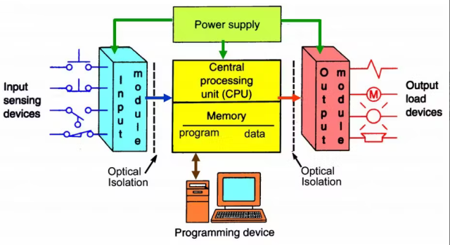

 [Зміст](../contents.md)

# Програмовані контролери (PLC/PAC)

## Загальні теми

- [Основи ПЛК](basic/README.md)

## Розподіл по платформам

- [PLC MachineStruxure M241, M251, M262 та інші](ecostruxuremachineexpert.md)
- [PLC M220, M221 Machine Expert Basic](machineexpertbasic.md)
- [PLC S7-1200, S7-1500 TIA Protal](tia1200.md)
- [PLCNext](plcnext.md)

## Швидкі старти

- [Основи роботи з UNITY PRO: швидкий старт](faststartm340/README.md)
- [Вступ до Control Expert](faststartcontrolexpert/README.md)

## Середовища розроблення ПЛК

Встановлення, загальний вигляд та можливості середовища розроблення.

- [Середовище розроблення проекту ПЛК](ide/README.md)

## Апаратне забезпечення

- [Фізична структура PLC](hardware/README.md)

## Загальне програмування ПЛК

- [Функціонування, операційні режими, задачі ПЛК](operation/README.md)
- [Робота з даними в ПЛК](data/README.md)
- [Програмні сутності POU (Функції, процедури та функціональні блоки)](pou/README.md)
- [Стандартна бібліотека функцій та функціональних блоків](stdlib/README.md)
- [Програмування на мові LD](ld/README.md) 
- [Програмування на мові FBD/CFC](fbd/README.md) 
- [Програмування на мові ST/SCL](st/README.md) 
- [Програмування на мові IL/STL](il/README.md) 
- [Програмування на мові SFC/Grafcet](sfc/README.md) 
- [Налагодження програм користувача та діагностика](debug/README.md)

## Бібліотеки

- [Робота з бібліотеками: імпорт, експорт та інш](libmngm/README.md)

- [Основи регулювання в ПЛК](contcontrol/README.md)
- [Обробка сигналів в контурі регулювання ПЛК](signcontrol/README.md)
- [ПІ та ПІД-регулювання в ПЛК](pidcontrol/README.md)
- [Позиційне регулювання в ПЛК](poscontrol/README.md)
- [Регулювання типу більше/менше в ПЛК (Servo)](servocontrol/README.md)
- [Широтно-імпульсне регулювання в ПЛК (PWM)](pwmcontrol/README.md)

## Підходи до програмування

- [Стано-орієнтований підхід](statebase/README.md)
- [Використання імітаційних моделей при налагодженні програм для ПЛК](simul/README.md)

## Мережний обмін 

- [Обмін по TCP та UDP](tcpudp/README.md)

## Приклади рішень

- [Приклади формування, використання та підрахунок імпульсів](app_cnt/README.md)
- [Приклади роботи з витратомірами та лічильниками](app_flow/README.md)
- [Приклади роботи з датою та часом](app_dt/README.md)
- [Приклади роботи зі структурами, масивами, циклами](app_udt/README.md)
- [Приклади використанням інтерполяції](app_interpol/README.md)

