[<- До підрозділу](README.md)

# Основи ПЛК

## Призначення та властивості ПЛК

Поява промислових мікропроцесорних контролерів пов’язана насамперед з автоматизацією дискретних процесів і необхідністю заміни традиційних систем керування, які будувались на базі релейно-контактних або безконтактних логічних схем керування, що працювали за жорсткою логікою. Про історію появи ПЛК можна почитати у [статті Control Engineering](https://www.controleng.com/articles/inside-the-competition-for-the-first-plc/). Наявність змінної логіки зумовило їхню загальну назву – програмований логічний контролер, який англійською мовою називається Programmable Logic Controller (**PLC**), а у вітчизняній літературі – **ПЛК**. І хоча функціональні можливості сучасних ПЛК давно вже вийшли за рамки вирішення завдань дискретного керування, така назва закріпилася за промисловими мікропроцесорними контролерами всіх типів, стала офіційною і знайшла своє відображення у відповідних стандартах. Сьогодні наряду з цим терміном вживається термін **PAC** (Programmable automation controller) як більш просунутий варіант ПЛК з додатковими вимогами, у цьому посібнику ми не будемо розділяти ці поняття. 

Можна дати таке визначення ПЛК: **програмований логічний контролер –** це спеціалізований мікропроцесорний пристрій, призначений для керування технологічними процесами в умовах промислового середовища в реальному масштабі часу, для програмування яких використовуються спеціалізовані мови програмування, зрозумілі для автоматника. Нині існує міжнародний стандарт IEC 61131, в якому описані вимоги до апаратної та програмної частини ПЛК.

Можна виділити декілька основних властивостей ПЛК:

1. Робота в жорсткому реальному часі. Це вимога, характерна для всіх засобів керування цього рівня.  **Реальний час** — режим роботи автоматизованої системи обробки інформації і керування, при якому враховуються обмеження на часові характеристики функціонування  (tвиконання < tмакс). Жорсткий реальний час — режим роботи системи, при якому порушення часових обмежень рівнозначно відмові системи і веде до неможливості вирішення поставленої задачі. Для ПЛК робота в жорсткому реальному часі передбачає що він буде завжди встигати дізнаватися про стан процесу (об'єкту керування), розраховувати керуючі дії та видавати ці керуючі дії на підключені виконавчі механізми за вказаний у налаштуваннях час. Якщо він цього не зможе зробити, його засоби самодіагностики виявлять це а операційна система зупинить виконання програми та переведе виходи в безпечний стан.    

2. Наявність спеціалізованих мов програмування. По-перше, ці мови максимально наближені до потреб кінцевого користувача і значно спростили програмування, налагодження та модифікацію прикладних програм. По-друге, вони дещо обмежені у можливостях, щоб зменшити ймовірність створення помилок в програмі, що приводить до її зависання або помилок з системою та пам'яттю. Це дало змогу підтримати основну властивість ПЛК – можливість оперативної зміни алгоритму керування програмним шляхом. У третій частині IEC 61131 рекомендовано п’ять мов програмування ПЛК: LD (Ladder Diagramm, на основі релейно-контактних), IL (Instruction List, списку інструкцій), ST (Structured Text, структурованого тексту), FBD )(Function Block Fiagram, функціональних блоків) і SFC ( Sequentional Function Chart, структурованих функціональних схем). Кожна мова програмування має певну спрямованість на функціональне призначення.

3. Використання в промислових умовах експлуатації та надійність. Це ставить досить жорсткі вимоги до надійності ПЛК та захищеності його від впливу різноманітних електромагнітних, вібраційних, кліматичних та інших перешкод. Це досягається за рахунок використання надійної елементної бази, стійких і надійних схемних рішень, спеціальних гальванічних розподільників, резервування, дублювання та інших заходів, а також високого технологічного рівня виробництва ПЛК. Деякі ПЛК можуть розробляти з підвищеним ступенем захисту від навколишнього середовища, що можуть працювати в умовах низьких температур, високої вологості та пилу, тощо. Ця властивість також зв'язана з тривалою роботою ПЛК без зупинок.   

4. Гнучке компонування апаратної частини та швидка заміна компонентів. Блочно-модульний принцип побудови ПЛК (крім моноблочних контролерів) дає можливість за рахунок використання різноманітних модулів входу-виходу оптимізувати технічну структуру ПЛК для керування конкретним об’єктом. Тобто конфігурація ПЛК (перелік модулів, які входять до складу контролера) залежить від конкретного об’єкта управління і алгоритму управління ним. Це не тільки зменшує витрати на впровадження систем автоматизації, а й підвищує ремонтоздатність ПЛК та швидку заміну компонентів.

5. Розвинута самодіагностика та тестування. Наявність широко розвинутої системи самодіагностики та тестування, за допомогою яких можна швидко визначити несправність та усунути її. Це є дуже важливою функцією, оскільки ПЛК - досить складний технічний засіб і визначення причини відмови ПЛК потребує досить високої кваліфікації обслуговуючого персоналу. Тому в разі виникнення технічної несправності ПЛК система діагностики допомагає швидко визначити модуль, у якому виникла несправність. Цей модуль повинен бути швидко замінений технічним персоналом і працездатність системи управління буде поновлена. А несправний модуль повинен бути переданий на ремонт у сервісну службу виробника ПЛК.

6. Зміна апаратної та програмної частини без зупину роботи системи. Одна з властивостей, яка характерна для ПЛК, що розроблені для керування неперервними виробництвами, які не можна зупиняти навіть на нетривалий час - це можливість заміни апаратних частин та програми керування "на льоту", не зупиняючи роботу ПЛК та не вимикаючи його.  

7. Інтегрування з іншими промисловими засобами автоматизації. Для забезпечення роботи ПЛК у складі розподіленої АСУТП передбачена можливість організації обміну інформацією між окремими ПЛК та передачі технологічної інформації в системи  використання промислових мереж.

## Структура мікропроцесорних контролерів

На рис. 1 показано узагальнену структуру програмованого логічного контролера. Центральною частиною ПЛК є мікропроцесорний пристрій (МП, CPU), який керує операціями збору і оброблення даних від зовнішніх пристроїв і вироблення керуючих дій відповідно до розробленої програми користувача.

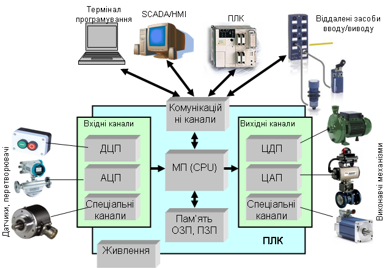

Рис. 1. Фізична структура промислового контролера

Мікропроцесорні модулі сучасних контролерів - це, як правило, мультипроцесорна система, в якій задачі, які повинен виконувати мікропроцесорний модуль, розподіляються між окремими процесорами. Це викликано тим, що ПЛК повинен працювати в режимі реального часу, адекватно реагуючи на зміну стану об’єкта керування.

Частина ресурсів пам’яті контролера використовується для зберігання операційної системи реального часу (ОС РЧ), якою керується мікропроцесорний модуль, а також для зберігання системної інформації про оперативний стан апаратного і програмного забезпечення. Саме ця інформація використовується для функціонування системи самодіагностики і тестування контролера.

Друга частина ресурсів пам’яті використовується для зберігання розробленої **програми користувача,** яка й визначає виконання алгоритму керування об’єктом. Ємність пам’яті, яка використовується для зберігання програми користувача, визначає можливості даного ПЛК для створення прикладного програмного забезпечення.

Функціональні і технічні можливості мікропроцесорного модуля і модулів пам’яті визначають одну з основних характеристик ПЛК – його швидкодію, яка, як правило, вимірюється в швидкості оброблення 1 кілобайта (або кілослова) програми користувача або як час одноразового обслуговування всіх входів-виходів контролера, тобто робочого циклу ПЛК.

У ПЛК використовуються всі види пам’яті – ОЗП (оперативна), ПЗП (постійна) і ППЗП (перепрограмована). Вони можуть або вбудовуватись у процесорний модуль або входити до складу контролера у вигляді окремих модулів або карт пам’яті. Це дає можливість сформувати пам’ять контролера, яка за характеристиками і ємністю найбільш відповідає прикладному завданню керування.

Як уже зазначалося, ПЛК призначений для керування об’єктом автоматизації, для чого він повинен отримувати інформацію від різноманітних датчиків і, згідно із заданим алгоритмом керування, виробляти сигнали для керування виконавчими механізмами. Для реалізації цього завдання до складу ПЛК входять різноманітні канали (часто в складі модулів або блоків), які забезпечують його зв’язок з датчиками і виконавчими механізмами. Основним завданням цих каналів є перетворення фізичних сигналів від датчиків на цифрову форму і навпаки - перетворення цифрової форми управляючих сигналів, вироблених мікропроцесорним модулем, на фізичні сигнали, які можуть керувати виконавчими механізмами.

Як уже зазначалося, ПЛК будується за блоково-модульним принципом (крім моноблочних контролерів) і сам ПЛК є проектно-компонованим виробом. Тобто типи модулів і їхня кількість залежать від об’єкта автоматизації і алгоритму керування ним.

До складу сучасних ПЛК входить велика кількість різноманітних каналів, як правило, в складі модулів (блоків), які умовно можна поділити на декілька основних груп відповідно до існуючих типів датчиків і виконавчих механізмів.

Вхідні модулі:

- **канали (модулі) дискретно-цифрового перетворення (ДЦП),** до яких підключаються датчики з дискретним виходом (сигналізатори рівня, електроконтактні манометри та ін.) та управляючі технічні засоби (кнопки, перемикачі, датчики положення та ін.);

- **канали (модулі) аналогового-цифрового перетворення (АЦП),** до яких підключаються датчики з аналоговим уніфікованим електричним виходом, а також термометри опору і термопари;

- **спеціалізовані канали (модулі),** до яких підключаються специфічні вхідні сигнали, наприклад, модулі для підключення тензометричних датчиків вимірювання ваги; модулі лічильників; модулі безпеки; кодери і енкодери тощо.

Вихідні канали (модулі):

- **канали (модулі) цифро-дискретного перетворення (ЦДП),** до яких підключаються дискретні виконавчі механізми і технічні засоби (магнітні пускачі, сигнальні лампи та ін.), а також електричні виконавчі механізми з постійною швидкістю обертання (типу МЕО, МЕК та ін.);

- **канали (модулі) цифро-аналогового перетворення (ЦАП),** до яких підключаються аналогові виконавчі механізми, для управління якими використовуються уніфіковані електричні сигнали.

- **спеціалізовані канали (модулі),** до яких підключаються специфічні вихідні сигнали, наприклад, модулі для керування кроковими двигунами, модулі безпеки та ін.

Останнім часом особливу увагу розробники приділяють розробленню **комунікаційних модулів,** які забезпечують підключення ПЛК до різноманітних промислових мереж. Комунікаційні канали також використовуються для підключення до ПЛК терміналів програмування. На сьогоднішній день в якості терміналів програмування використовуються комп’ютери зі встановленим спеціальним програмним забезпеченням – ***середовищем програмування ПЛК.***

## Огляд промислових мікропроцесорних контролерів

За конструктивним виконанням всі ПЛК можна поділити на декілька груп. 

Для завдань автоматичного керування з невеликою кількістю входів-виходів випускаються **моноблочні** ПЛК, які також називають **компактними**. Вони являють собою функціонально закінчений технічний засіб, у якому розташовані всі функціональні модулі: мікропроцесор, усі види пам’яті, блок живлення, комунікаційні, вхідні та вихідні канали. Основна перевага таких контролерів – їхня низька ціна. Основний недолік – неможливість розширювати кількість каналів входів-виходів. Для забезпечення можливості вибору оптимальної структури такого типу контролерів випускається серія таких контролерів, які мають різну кількість і співвідношення типів каналів входів виходів. На рис. 2 показано приклад моноблочного контролера.

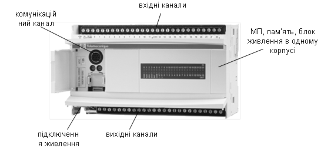

Рис. 2. Приклад ПЛК у моноблочному виконанні

Для систем із середньою кількістю каналів (десятки) можливою альтернативою моноблочним контролерам можуть бути компактні контролери з можливістю нарощення додатковими модулями (рис.3). У такому конструктиві основу ПЛК становить базовий модуль, який функціонально являє собою повністю закінчений контролер, подібно до компактного. Такий контролер вміщує мікропроцесор, усі види пам’яті, блок живлення, комунікаційні, вхідні та вихідні канали. Перевагою цього виконання є можливість його нарощення додатковими модулями. На рис. 3 показано компактний контролер з установленими додатковими модулями входів/виходів та комунікаційними.

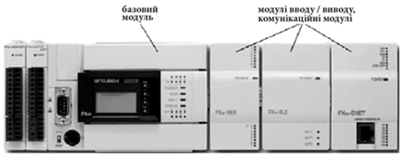

Рис. 3. Приклад компактного ПЛК з можливістю нарощення додатковими модулями

Для систем автоматизації технологічними процесами частіше використовуються **модульні** ПЛК, кількість і типи модулів у яких вибираються залежно від кількості і типів вхідних-вихідних сигналів. Це і є основною перевагою модульних контролерів перед компактними. Такі контролери призначені для побудови систем керування, кількість датчиків та виконавчих механізмів у яких вимірюється десятками та сотнями. Для ПЛК такого типу базовими складовими для забезпечення їхньої працездатності є модуль живлення та процесорний модуль (їх інколи суміщають в єдиному корпусі). Всі інші модулі набираються залежно від поставленого завдання. На рис. 4 показано приклад модульного контролеру.

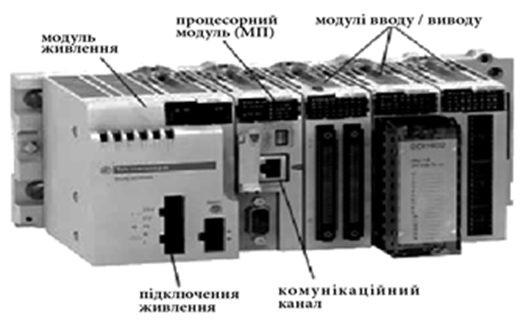

 Рис. 4. Приклад ПЛК модульного типу

До складу модульного ПЛК може входити велика кількість модулів (інколи сотні), з одним процесорним модулем у якості керуючого пристрою. Такий багатоканальний контролер може керувати технологічними процесами навіть всього виробництва. Але недоліком такої системи є те, що в разі виходу з ладу мікропроцесорного модуля втрачається можливість керування всім виробництвом. Більш доцільним є створення розподіленої системи, в якій на кожній технологічній ділянці (відділенні) встановлюється свій окремий ПЛК для керування технологічними процесами цієї частини виробництва. Для координації роботи цих ПЛК їх об’єднують промисловими мережами в єдину інтегровану систему керування. Використання розподіленого принципу керування та модульної структури дає змогу вибрати і конфігурувати контролери, для якого буде мінімізований показник функціональні можливості/вартість ПЛК.

Останнім часом великої популярності набули структури систем управління на базі контролерів з розподіленими (віддаленими) засобами вводу/виводу (рис. 5). У таких системах до промислової мережі ПЛК підключаються віддалені модулі вводу/виводу та інші засоби польового рівня, такі як:

- віддалені модулі вводу/виводу (модулі I/O);

- перетворювачі частоти (ПЧ), які призначені для управління частотою обертів асинхронного двигуна;

- сервоприводи;

- інтелектуальні контактори (магнітні пускачі);

- інтелектуальні датчики та виконавчі механізми. 

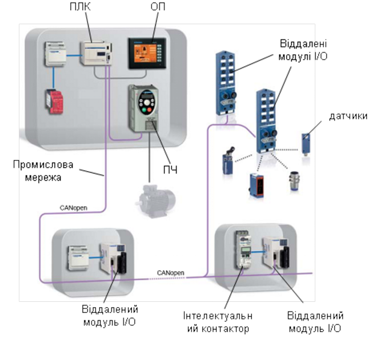

Рис. 5. Структура ПЛК з віддаленими модулями входів-виходів

З точки зору ПЛК, всі засоби польового рівня, які підключені до його промислової мережі, являються його модулями вводу/виводу. На відміну від локальних модулів вводу/виводу модульного ПЛК (тобто які розміщені на його шасі), віддалені модулі I/O можуть знаходитись у місці розташування датчиків, на великій відстані від базового ПЛК, що значно зменшує кількість кабелів і монтаж обладнання. Крім того, застосування стандартних промислових мереж дає можливість використовувати віддалені модулі вводу/виводу та периферії різних виробників. На рис. 5 показано структуру розподіленої системи керування, в якій до ПЛК за допомогою промислової мережі (CANopen) під’єднуються віддалені модулі входів-виходів (I/O), до яких підключаються датчики і виконавчі механізми, перетворювачі частоти (ПЧ) та інтелектуальні контактори. Ці віддалені модулі I/O можуть знаходитись на відстані в декілька сотень метрів від ПЛК, до якого вони підключені.

Окремо варто виділяти структури ПЛК в системах з резервуванням, де зупинка ПЛК може привести до дуже важких наслідків. На рис.6 показаний варіант реалізації такої системи, в якій є два ПЛК: первинний контролер, що працює в режимі керування процесом; резервний контролер, який в режимі "на підхваті", тобто пасивно спостерігає за процесом та за первинним контролером. Для такої схеми обидва контролери обмінюються статусною інформацією та образом процесу через спеціально виділену мережу `М2`, яка має забезпечити таку швидкість передачі, щоб при збої первинного контролеру, резервний на наступний цикл взяв на себе функції керування (гаряче резервування). Ця мережа також може забезпечувати синхронізацію завантажених проектів. Мережа `М3` має іншу функцію - забезпечити обмін даними з засобами вводу/виводу, і вона є спільною для обидвох ПЛК. Мережа `М1`забезпечує зв'язок з верхнім рівнем. Варто зауважити, що всі три наведені мережі мають різне призначення, наразі ми розглянули тільки зв'язок між ПЛК, нижче розглянемо інші звязки.             

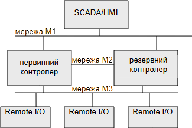

рис.6. Системи з резервуванням ПЛК

## Змінні ПЛК та їхні типи

При використанні ПЛК, алгоритм керування об’єктом реалізується програмним шляхом. Кожна програма має дані і тіло програми, яка на основі цих даних виконує розрахунки або виробляє управляючі дії, визначені програмою. Програма користувача для ПЛК отримує інформацію від фізичних пристроїв – датчиків, а також виробляє фізичні сигнали для керування виконавчими механізмами. Дані, якими оперує програма користувача, це константи та змінні. Останні в процесі виконання програми постійно змінюють свої значення. Змінні, які пов’язані із сигналами від датчиків, прийнято називати ***вхідними змінними*** (Input Variables), вихідних каналів – ***вихідними змінними*** (Output Variables).

Для того щоб програма користувача могла оперувати цими змінними, вони повинні мати адресу або/та ім’я, яке однозначно пов’язане з конкретним фізичним сигналом, який подається на ПЛК або виробляється ним як керуючий сигнал. Ця адреса або ім’я, пов’язане з місцем реального підключення датчиків або виконавчих механізмів до модулів ПЛК. У зв’язку з цим на першому етапі програмування ПЛК з використанням спеціальних графічних і інших редакторів створюється віртуальний образ контролера, який відповідає фізичній конфігурації ПЛК, тобто розміщенню у контролері модулів входів-виходів. При цьому в пам’яті ПЛК створюється область комірок пам’яті, куди буде записуватись інформація про стан фізичних каналів входів-виходів. При цьому будуть генеруватись адреси цих комірок пам’яті, за якими програма користувача буде звертатись до них для оброблення інформації про стан фізичних входів-виходів. 

Існують декілька варіантів адресації каналів входів-виходів. Один з них, так званий «географічний», або «топологічний», показано на рис.7. Такий варіант адресації використовується наприклад в модульних контролерах фірми Schnеider Electric. У основу цієї системи покладено місце розміщення модулів та каналів. Адреса змінної складається з позначень (рис.7).

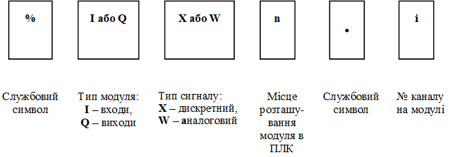

Рис. 7. Принцип адресації вхідних і вихідних змінних ПЛК

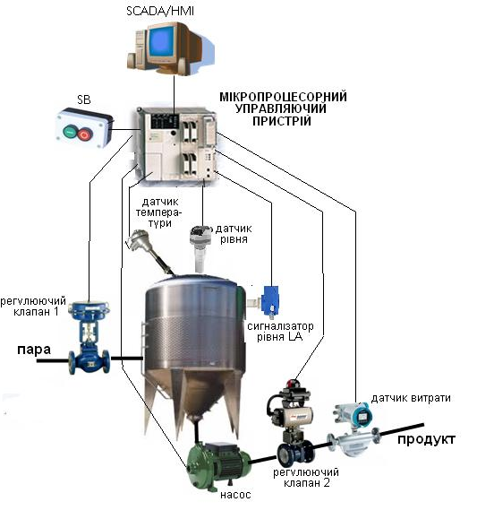

Рис. 8. Приклад системи з ПЛК (позначений як мікропроцеорний управляючий пристрій)

На рис. 9 показано варіант підключення до каналів умовного ПЛК датчиків і виконавчих механізмів для прикладу, наведеного на рис. 8. До складу ПЛК входять:

- модуль живлення, встановлений на спеціальному місці, яке позначено PS; процесорний модуль, який встановлений на місці за номером 00;

- модулі дискретних входів, дискретних виходів, аналогових входів і аналогових виходів, які встановлені відповідно на місцях за номерами 01, 02, 03 і 04.

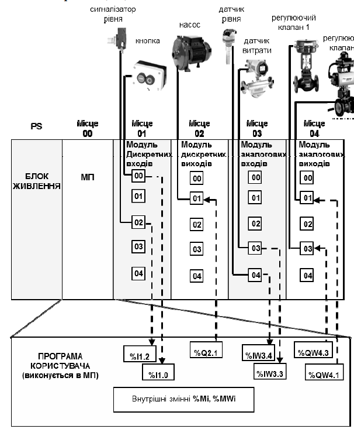

Рис. 9. Схема підключення датчиків і виконавчих механізмів до каналів ПЛК

На кожному модулі для прикладу показано по 5 каналів, кожен із яких також має свій номер.

Нижче наведено детальний опис підключення засобів автоматизації до ПЛК і визначення їх адрес.

1) На рис. 10 показано приклад, де сигнали від кнопочної станції SB і сигналізатора рівня LA відповідно підключаються до каналів 00 (через контакти «0+» та «0-») і 02 (через контакти «2+» та «2-») модуля дискретних входів розташованого на місці 01 у ПЛК. Згідно з розглянутими вище правилами «географічної» адресації, вони мають адреси: *%I1.0* i *%I1.2*. Символ «Х» для дискретних змінних можна не вказувати.

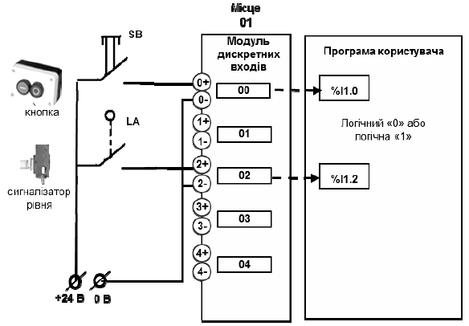

Рис.10. Підключення дискретних вхідних сигналів

Фізично це означає, що якщо буде натиснута кнопка SB або спрацює сигналізатор рівня LA (коли рівень стане більше допустимого значення), на вхід відповідного каналу буде поданий електричний сигнал + 24 В. У цьому випадку вхідна зовнішня змінна з відповідною адресою перейде в стан логічної «1»

2) На рис. 11 показано приклад, де до 1-го каналу модуля дискретних виходів, розташованого на місці 02 у ПЛК, підключене реле KV1, контакти якого включають і відключають насос. Цей дискретний вихід пов'язаний зі змінною, яка, згідно з правилами, має адресу *%Q2.1*.

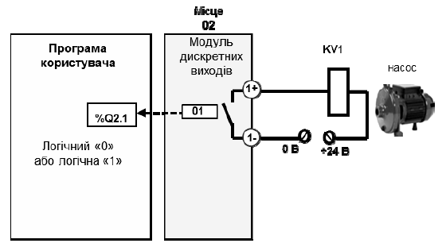

 Рис. 11. Підключення дискретних вихідних сигналів

Фізично це означає, що якщо в процесі виконання програми користувача вихідна змінна *%Q2.1* прийме значення логічної «1», на виході цього каналу замкнеться контакт реле або спрацює транзисторний ключ, через які на обмотку реле KV1 буде подана відповідна напруга, і реле KV1 спрацює й через його контакти буде включений насос.

3)  На рис. 12 показано приклад підключення до модуля аналогових входів ПЛК, розташованого на місці 03 аналогових вхідних сигналів. До каналу 03 підключений датчик витрати, а до каналу 04 – датчик рівня. Відповідно адреси цих сигналів будуть мати вигляд: *%IW3.3* i *%IW3.4*. Необхідно звернути увагу на наступне:

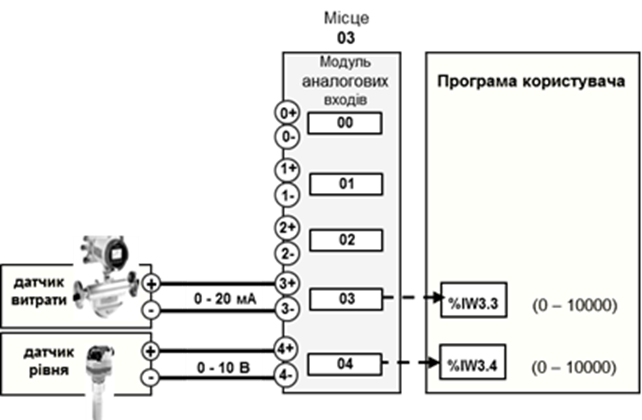

Рис. 12. Підключення аналогових вхідних сигналів

а) у цьому прикладі датчики мають різні уніфіковані електричні сигнали: струмовий 0 – 20 мА і по напрузі – 0 – 10 В. Тобто вибрано такий модуль аналогових входів, у якому можливо настроювати кожний аналоговий канал модуля на вибір того чи іншого уніфікованого електричного сигналу. 

б) кожний датчик має діапазон вимірювання, який вибирається залежно від робочого значення вимірювального параметра. Вибраному діапазону вимірювання відповідає повний діапазон вихідного аналогового уніфікованого сигналу. У модулі аналого-цифрового перетворення ПЛК фізичний сигнал від датчика перетворюється на числове значення. На прикладі показано, що це значення становить від 0 до 10000. Тобто відбувається перетворення:

 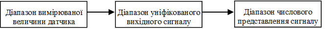

Це необхідно пам’ятати, щоб вміти знаходити співвідношення між значенням вимірюваної величини і числовим значенням представлення цієї величини в ПЛК

У загальному вигляді ці розрахунки можна проводити з використанням такої пропорції:

$$
\frac{Ш_К-Ш_П}{ЧЗ_К-ЧЗ_П}=\frac{Х-Ш_П}{ЧЗ_і-ЧЗ_П}
$$

де $Ш_п$ і $Ш_к$ – відповідно початкове і кінцеве значення вимірюваного діапазону; $ЧЗ_п$ і $ЧЗ_к$ – відповідно початкове і кінцеве значення числового представлення сигналу в ПЛК (рис. 13).

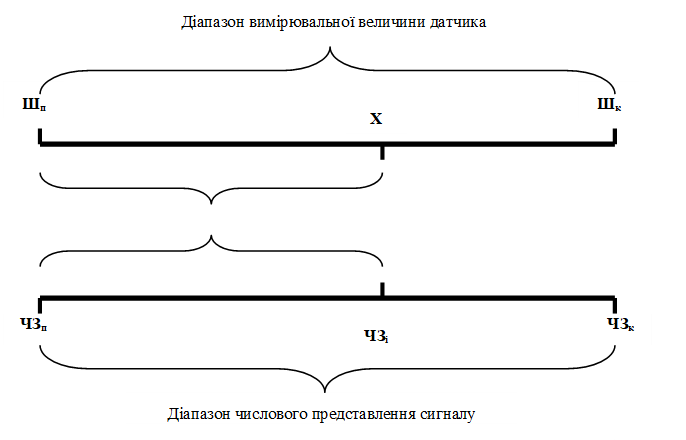

 Рис. 13. Числове представлення аналогового вхідного сигналу

Із наведеного співвідношення, знаючи діапазон вимірювання і числовий діапазон представлення цього діапазону в ПЛК, можна для будь-якої точки діапазону розрахувати його числове значення в ПЛК, і навпаки.

Наприклад, для розглянутого вище діапазону від 0°C  до 120°C числове значення для точки 80°C, для діапазону представлення аналогової змінної в ПЛК діапазоні від 0 до 10000, становитиме:

 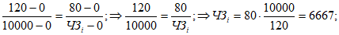

Розрахуємо числове значення для тієї ж точки 80 0С, але для діапазону вимірювання від -30 0С до 120 0С.

4) На 04-му місці ПЛК розташований модуль аналогових виходів, до 01-го каналу якого підключений регулюючий клапан 1, а до каналу 03 – регулюючий клапан 2 (рис. 14.). На регулюючі клапани з модуля ЦАП ПЛК подається реальний фізичний управляючий сигнал 0 – 20 мА (може бути інший уніфікований електричний сигнал). Величина цього сигналу змінюється пропорційно значенню зовнішніх аналогових змінних *%QW4.1* i *%QW4.3*, які розраховуються програмою користувача в діапазоні від 0 до 10000 одиниць.

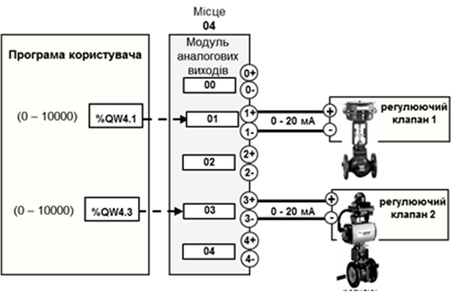 

Рис. 14. Підключення аналогових вихідних сигналів

Програма користувача може зберігати проміжні значення. Так, для підрахунку імпульсів з лічильника-витратоміра необхідно зберігати його плинне значення. Інший приклад, коли оператор з операторської панелі задає задане значення певного параметра. Ці проміжні значення не приходять з вхідних каналів і не використовуються для вихідних. Тому їх записують у ***внутрішні змінні*** (Internal Variables або Memory Variables). Внутрішні змінні не пов’язані ні з входами ні з виходами ПЛК, тому можуть бути використані довільно.

Внутрішні змінні дискретного типу мають адресу *%Мі*, де і – номер змінної. Аналогові внутрішні змінні позначаються *%MWi*, де і – номер аналогової змінної. Максимальна кількість внутрішніх змінних залежить від моделі ПЛК.

До того ж, крім зовнішніх і внутрішніх змінних, у програмі користувача можуть використовуватися змінні, пов’язані з різноманітними функціональними блоками: таймерами, лічильниками, регістрами тощо.

У більшості сучасних ПЛК є можливість присвоювати змінним контролера «технологічні імена», які можуть бути використані в процесі розроблення прикладної програми користувача. 

## Робочий цикл виконання задачі 

У зв’язку з тим, що основним завданням керуючої програми мікропроцесорного контролера є керування виконавчими механізмами залежно від значення сигналів, які характеризують стан об’єкта керування, контролер повинен весь час стежити за станом та значеннями вхідних сигналів і виробляти керуючі дії відповідно до реалізованого алгоритму керування. Програми користувача виконуються в контексті **задач** (**Task**), тобто організованої послідовності дій пов'язаних з обробкою входів та виходів ПЛК та виконання самої програми. У будь якому ПЛК є завжди принаймні одна задача, в якій виконується програма, що розроблена програмістом ПЛК, і вона виконуватися циклічно. Процес роботи цієї циклічної задачі складається в послідовності виконання кількох етапів, що становлять її робочий цикл (рис. 15), який повторюється, поки ця задача виконується. До них належать:

- **опитування входів,** у процесі якого в оперативну пам’ять контролера записується інформація про стан усіх фізичних входів, підключених до ПЛК, тобто на початку робочого циклу формується так званий образ процесу;

- **виконання прикладної програми,** підготовленої користувачем згідно із заданим алгоритмом керування. Програма користувача виконується для комбінації вхідних сигналів, які були отримані на стадії опитування входів. В результаті виконання програми будуть розраховані значення вихідних змінних, які будуть передані на вихідні модулі тільки після закінчення етапу виконання прикладної програми;

- **встановлення виходів,** у процесі якого каналам вихідних модулів встановлюються значення, які отримані в результаті виконання прикладної програми.

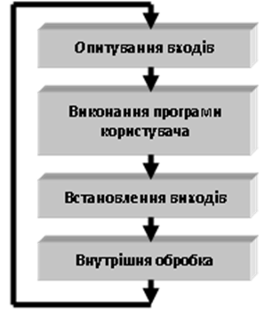

Рис.15. Робочий цикл циклічної задачі ПЛК

Крім того, в процесі кожного робочого циклу виконуються процедури, пов’язані не стільки з обробленням прикладної програми, як із задачами аналізу стану апаратних засобів, самодіагностики, оброблення запитів, які прийшли з пульта ПЛК або по мережі тощо. Тобто відбувається **внутрішня обробка**, яка виконується на системному рівні контролера. Після виконання цього етапу починається новий робочий цикл задачі знову з опитування входів.

Циклічність виконання програми користувача ПЛК є дуже важливою особливістю роботи мікропроцесорного контролера, яка повинна бути врахована при розробленні прикладної програми користувача. Розглянемо декілька можливих варіантів.

1) Програма перебуває на етапі «виконання програми» і в цей момент змінилося значення якогось зі входів. У цьому випадку програма зреагує на цю зміну тільки в наступному робочому циклі.

2) Гіршим є варіант, коли зміна входу буде дуже короткою, тобто, наприклад на етапі виконання програми якийсь дискретний вхід встигне включитись і відключитись. У цьому випадку ця зміна залишиться непоміченою ПЛК.

3) На етапі виконання програми, на її початку, сформується команда «включити дискретний вихід», а наприкінці – «відключити дискретний вихід». У цьому випадку виконається остання команда. Тобто включення виходу не відбудеться.

Для **циклічного** виконання задачі характерне послідовне, одне за одним, виконання усіх етапів що сумарно означує час робочого циклу показаного на  рис.16.

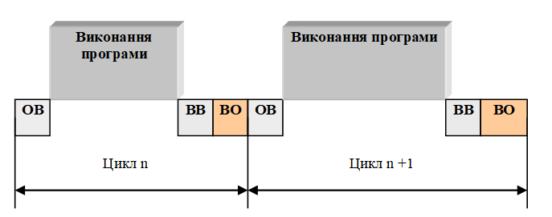

рис.16. Циклічне виконання задачі: ОВ - опитування входів, ВВ - встановлення виходів, ВО - внутрішня обробка

У зв’язку з тим, що в процесі виконання прикладної програми час виконання окремих її етапів може змінюватись, буде змінюватись і тривалість робочого циклу ПЛК. Тому кожен новий цикл виконання задачі буде запускатися з різними інтервалами часу.

За **періодичного** режиму виконання задачі її тривалість задається при її конфігуруванні. У цьому разі при виконанні задачі ПЛК також послідовно виконує всі етапи її оброблення. Проте, якщо останній етап циклу виконався, а заданий час періоду ще не вичерпався, то процесор заповнює час операційного циклу, що залишився, системними чи фоновими задачами доти, поки не закінчиться період, і тільки після цього почнеться новий робочий цикл (рис. 17).

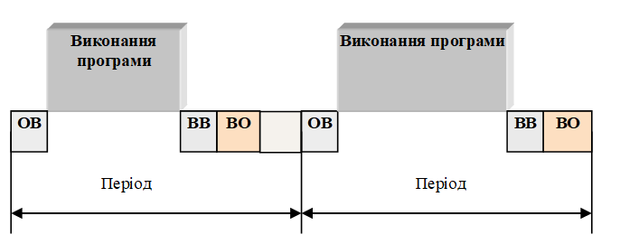 

рис.17. Періодичне виконання задачі 

У більшості контролерів надається можливість розроблення багатозадачної програми користувача, що надає можливість використання одного ПЛК для керування процесом з різними вимогами до реального часу. Крім періодичного і циклічного режиму, задачі можуть бути також подієвими. Про це ви можете почитати в інших розділах посібника.   

## Розроблення програми користувача ПЛК

Розроблення прикладного програмного забезпечення для мікропроцесорної системи керування на базі ПЛК – головний етап проектування такої системи. Перелік етапів, які при цьому виконуються, залежить від вибраної структури системи керування, складності алгоритмів керування в складі системи, вимог до надійності та інших факторів, які повинні бути враховані при проектуванні системи. У загальному вигляді порядок розроблення мікропроцесорної системи автоматизації з використанням промислових логічних контролерів включає в себе декілька етапів:

1) формування переліку функцій та задач ПЛК в складі системи керування; в основу такого рішення може бути покладена розроблена напередодні схема автоматизації для об’єкта, який автоматизується;

2) вибір апаратного забезпечення мікропроцесорного контролера, тобто визначення кількості і типів каналів і модулів входів-виходів, які повинні забезпечити підключення до контролера різноманітних датчиків і виконавчих механізмів;

3) розроблення алгоритмів та програм користувача для їх реалізації, а також його налагодження;

4) налагодження ПЛК на об'єкті

5) експлуатація ПЛК

Послідовність розроблення прикладного програмного забезпечення залежить від правил і процедур програмування, які передбачені в тому програмному середовищі, який використовується для програмування конкретних моделей ПЛК.

Усі функції та задачі які покладені на ПЛК, умовно можна віднести до одного з двох типів: задачі логіко-командного керування і задачі неперервного регулювання. Перші більше направлені на виконання певних посілдовностей дій в залежності від умов, другі - на неперервне виконання функцій регулювання.  Для кожного з цих типів можна вибрати більш зручну для програмування мову. Як вже зазначалося основною особливістю програмованих логічних контролів є наявність спеціалізованих "технологічних" мов програмування, добре зрозумілих спеціалістам у галузі автоматизації, електроніки, електротехніки та технології виробництв. Ці мови розроблялися з урахуванням особливостей різних типів задач та кваліфікації спеціалістів. На сьогоднішній день 5 найбільш популярних мов програмування промислових контролерів закріплені в міжнародному стандарті МЕК 61131-3 (IEC 61131-3); це:

- LD (Ladder Diagram);

- FBD (Function Block Diagram);

- ST (Structured Text);

- SFC (Sequential Function Chart);

- IL (Instruction List);

Мова ***IL*** (Instruction List) - це список інструкцій, подібних до мови Асемблера, які виконуються послідовно. Це мова низького рівня, тому нею користуються в основному програмісти, які залучаються для розроблення програми користувача для ПЛК. На сьогоднішній день мова IL використовується досить рідко. 

Мова ***LD*** (Ladder Diagram) – це графічна мова програмування, яка використовує графічні елементи, подібні до тих, які використовуються в релейно-контактних схемах. Саме тому у вітчизняній практиці цю мова інколи називають мовою релейно-контактних схем (РКС). Ця мова програмування використовувалась у перших ПЛК для заміни фізичних релейно-контактних схем, однак більшість ПЛК надають можливість використовувати її і для інших задач. 

Мова ***FBD*** (Function Block Diagram) – графічна мова програмування, яка дає змогу створювати програми у вигляді взаємопов’язаних функціональних блоків, які виконують стандартні для систем автоматизації функції. Вони нагадують графічну схему, на якій були б показані стандартні фізичні функціональні блоки, які використовуються в системах автоматизації (регулятори, задавачі, таймери, лічильники, суматори, блоки вилучення кореня, різноманітні логічні елементи та ін.) і ланцюги підключення між ними, так, якщо б це були реальні фізичні пристрої. Є також подібна до FBD мова **CFC** (Continuous Function Chart), яка не увійшла до стандарту, має ту саму ідеологічну основу, що і FBD. 

Мова ***ST*** (Structured Text, структурований текст) – це текстова мова, подібна до PASCAL, C, BASIC і т.п. Ця мова програмування найбільш зручна для спеціалістів у сфері автоматизації та програмістів. 

Мова ***SFC*** (Sequential Function Charts) – графічна мова програмування, в якій поведінка системи задається послідовністю кроків, де вказуються необхідні дії, та переходами між кроками, які задаються умовами, при яких ці переходи виконуються. Ця мова програмування найбільш зручна для об’єктів, які мають чітко визначену послідовність дій. У деяких ПЛК є також дуже схожа на неї мова, яка має назву **Grafcet**.

У багатьох ПЛК ці мови програмування мають однакові функціональні можливості. Їх вибір залежить від уподобання розробників програмного забезпечення. У деяких ПЛК дозволяється в одній прикладній програмі, в різних її блоках, використовувати різні мови програмування. Варто зауважити, що можливості мов в різних ПЛК можуть суттєво відрізнятися, тому порівнювати мови між собою за межами конкретної моделі ПЛК немає сенсу.

## Програмування алгоритмів логіко-командного управління

У наступних пунктах розглянемо приклади розроблення програми користувача на різних мовах програмування. При цьому будемо розглядати окремо приклади програмування для реалізації алгоритмів логіко-командного управління і задач автоматичного регулювання. Програму користувача буде розроблятися для керування об’єктом, зображеним на рис.18, з наступним алгоритмом функціонування.

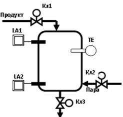

Рис. 18. Функціональна структура об’єкта автоматизації

Після натискування кнопки «Пуск» і за умови, що апарат пустий, відкривається клапан Кл1 і продукт поступає в нього. Коли рівень в апараті досягне верхнього значення (при цьому спрацює сигналізатор верхнього рівня LA1), клапан Кл1 закривається і відкривається клапан Кл2. В апарат поступає пара, і продукт починає розігріватись. Коли температура в апараті досягне заданого значення (про що свідчать показання термометра ТЕ), клапан Кл2 закривається і включається таймер. Коли встановлений час вичерпався, відкривається клапан Кл3 і рідина виливається з апарата. В момент, коли рівень в апараті досягне нижнього значення (при цьому спрацює сигналізатор нижнього рівня LA2), клапан Кл3 закривається, відкривається Кл1 і цикл повторюється.

На рис. 19 зображено алгоритм управління для описаного вище алгоритму функціонування об’єкта управління. Як видно, алгоритм управління для задачі логіко-командного управління являє собою послідовність умов і дій, які повинні виконуватись при виконанні відповідної умови. 

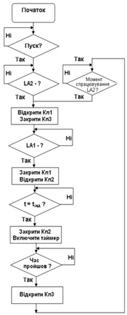

Рис. 19. Алгоритм управління

Так, на початку програми система управління повинна очікувати, поки одночасно не будуть виконані дві умови – апарат буде пустий (тобто спрацьовує датчик нижнього рівня LA2) і не буде натиснута кнопка «Пуск». Як тільки одночасно будуть виконані ці дві умови – буде сформована команда на відкриття клапана Кл1 і закриття клапана Кл3. Після цього система переходить на стадію очікування виконання наступної умови – наповнення апарата продуктом до верхнього рівня і спрацьовування сигналізатора верхнього рівня LA1. При виконанні цієї умови подається команда на закриття клапана Кл1 і відкриття клапана Кл2 подачі пари. Далі система очікує виконання умови досягнення заданої температури. У цей момент закривається клапан Кл2 і включається таймер. Після спрацьовування реле часу відкривається клапан 3 і система переходить у стан очікування виконання умови спрацьовування сигналізатора нижнього рівня LA2. В момент її виконання система повертається на початок нового циклу роботи, тобто клапан Кл3 закривається і відкривається клапан Кл1.

Розглянемо варіант програми користувача для наведеного алгоритму управління з використанням різних технологічних мов програмування.

## Ladder Diagram

Для прикладу, розроблення програми користувача покажемо в середовищі програмування PL7, яке використовується для програмування ряду контролерів фірми Schneider Electric.

Для програмування на технологічній мові LD у використовується спеціальний графічний редактор, у якому за допомогою графічних елементів розробляється програма користувача. Програма складається з окремих сторінок із написаною програмою, які послідовно виконуються одна за одною. Робоча зона редактора умовно ділиться на дві зони: тестування і виконавчу. Зона тестування прилягає до лівої умовної шини живлення і в цій зоні розміщуються елементи, стан і значення яких зумовлює логіку виконання програми користувача. У виконавчій зоні, яка прилягає до правої умовної шини, розміщуються елементи, які призначені для виконання керуючих дій. Робоча зона сторінки має сітку, в клітинках якої розміщуються елементи.  Програмування полягає у виборі графічних елементів, що відповідають тим чи іншим логічним елементам або функціональним блокам, розміщенні їх у робочих зонах сторінок і показі зв’язків між ними у вигляді традиційних електричних ланцюгів (рис. 20). 

 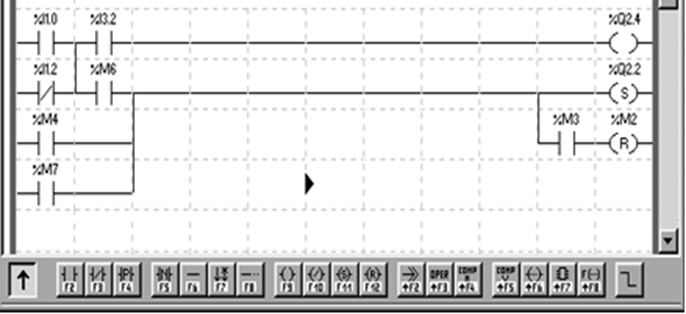

Рис. 20. Фрагмент програми на мові Ladder Diagram

Розробимо програму користувача на мові LD для наведеного алгоритму керування. Першочергово необхідно визначитися з адресами зовнішніх змінних, які пов’язані з датчиками і виконавчими механізмами. У табл. 1 наведено адреси зовнішніх змінних для умовного ПЛК та їх технологічні імена.

*Таблиця 1.* Таблиця змінних

| **Змінна**                                 | **Адреса  змінної** | **Технологічне  ім’я** |
| ------------------------------------------ | ------------------- | ---------------------- |
| Кнопка «Пуск»                              | %I1.0               | Pusk                   |
| Датчик сигналізатора верхнього рівня (LA1) | %I1.1               | LA1                    |
| Датчик сигналізатора нижнього рівня (LA2)  | %I1.2               | LF2                    |
| Датчик температури (TE)                    | %IW3.1              | Temp                   |
| Дискретний клапан 1 (Кл1)                  | %Q2.1               | KL1                    |
| Дискретний клапан 2 (Кл2)                  | %Q2.2               | KL2                    |
| Дискретний клапан 3 (Кл3)                  | %Q2.3               | KL3                    |

На рис. 21 наведена програма на мові LD. 

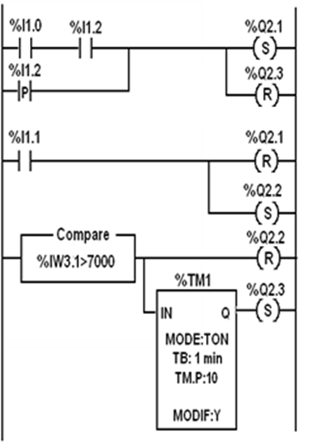

Рис. 21. Програма користувача на мові LD

Програма керування працює так. Якщо апарат порожній (тобто спрацював датчик нижнього рівня LA2, зовнішня змінна %I1.2 переходить у стан логічної «1») і натискається кнопка «Пуск» (зовнішня змінна %I1.0 також переходить у стан логічної «1»), умовно замикається ланцюг, який підключений до зовнішніх виходів %Q2.1 і %Q2.3. При цьому клапан Кл1, підключений до виходу %Q2.1 відкривається і фіксується, оскільки використаний вихід з командою S (включити і зафіксувати), а клапан Кл3, підключений до виходу %Q2.3, закривається і фіксується, оскільки використаний вихід з командою R (включити і зафіксувати). Тобто, якщо навіть кнопка «Пуск» відпуститься, клапан Кл1 буде залишатись у включеному стані.

Коли спрацює датчик верхнього рівня LA1, вхідний сигнал %I1.1 перейде в стан «логічної 1», що призведе до закриття клапана Кл1 (%Q2.1) і відкриття клапана подачі пари Кл2 (%Q2.2). Блок COMPARE виконує порівняння сигналу від датчика температури ТЕ (%IW3.1) і його заданого значення (на схемі показано значення 7000, що відповідає 70% від діапазону шкали). У разі виконання умови, записаної в ньому, відключається і фіксується вихід %Q2.2 (Кл2) і включається таймер %TM1. Після того, як сплине час, заданий у таймері (10 хвилин), його вихід %TM1.Q включить і зафіксує вихід %Q2.3 (Кл3). *У момент* досягнення рівня в апараті нижнього значення подається короткий імпульс, від спрацьовування входу %I1.2 (), який приводить до закриття клапана Кл3 і відкриття клапана Кл1. Цикл роботи розпочнеться знову.

На рис. 22 показано ту ж саму програму, але замість адрес змінних використано їхні технологічні імена.

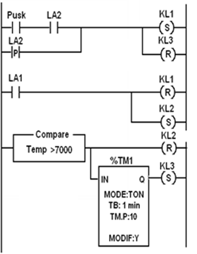

Рис. 22. Програма користувача на мові LD з використанням технологічних імен

Як видно, основною перевагою цієї програми є її наглядність. Наприклад, з програми можна сказати, що якщо натиснута кнопка Pusk і спрацював датчик верхнього рівня LA1, то включається клапан KL1 і відключається KL3. Якщо спрацьовує датчик верхнього рівня LA2, то клапан KL1 закривається і відкривається KL2. Коли значення температури в апараті Temp досягне заданого значення (70% від діапазону, клапан KL2 закриється, а через 10 хвилин спрацьовує таймер, вихід якого включить KL3. В момент досягнення рівня в апараті нижнього значення (верхня ланка на схемі) знов спрацьовує клапан KL1 і відключиться клапан KL3. Розпочнеться новий цикл роботи.

Тобто опис роботи програми з використанням технологічних імен стає зрозумілішим. Крім того, виникає можливість спочатку розробити програму, а потім прив’язати її до конкретного ПЛК, задаючи відповідність адрес зовнішніх змінних і їх технологічних імен.

## Structured Text

Програма на мові структурованого тексту подібна до програм на відомих алгоритмічних мовах, таких як PASCAL, C, BASIC і т.ін., і складається з програмних рядків, написаних із використанням відповідних правил побудови, інструкцій, стандартних процедур, зарезервованих слів і мнемонічних позначень, які визначають алгоритм оброблення змінних різних типів.  Нижче наведена програма управління на технологічній мові Structured Text для розглянутого вище прикладу. 

Програма складається з чотирьох умовних виразів «**IF ... THEN**», які відповідають певному етапу функціонування об’єкта управління.

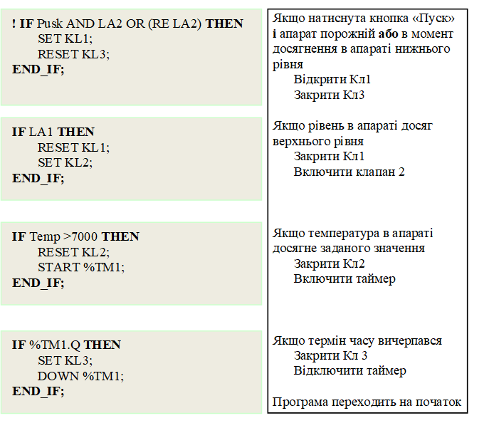

## SFC/Grafcet

Однією з найзручніших мов програмування для вирішення задач логіко-командного управління є мова **SFC** і її модифікації, які широко застосовуються в різних типах програмованих логічних контролерів. Схожа до неї є мова ***Grafcet***, яка дещо простіша у використанні. Основними перевагами цих мов є можливість описувати паралельно-послідовні процеси в наглядній і компактній формі. Це функціональні діаграми за допомогою яких у графічній формі описується виконання алгоритму керування об’єктом у вигляді набору **послідовних кроків**. Кожний крок програми включає фрагмент програми користувача (**дії**), яка виконується протягом часу, в який даний крок є активним. **Перехід** з одного кроку на інший відбувається при виконанні відповідних умов, які також програмуються. Крім послідовного виконання кроків, передбачається їхнє паралельне виконання, за умови об’єднання їх за допомогою логічних виразів ‘‘І‘‘ або ‘‘АБО‘‘.

Якщо уважно подивитись на зображення алгоритму керування задачі логіко-командного управління (наприклад, на рис. 19) то можна помітити, що алгоритм складається з послідовності умов і дій, які виконуються в разі виконання цієї умови. Мови SFC/Grafcet практично повторють алгоритм керуванні, але для його зображення використовуються інші графічні зображення (табл.2). 

*Таблиця 2* Графічні елементи мов SFC/Grafcet

 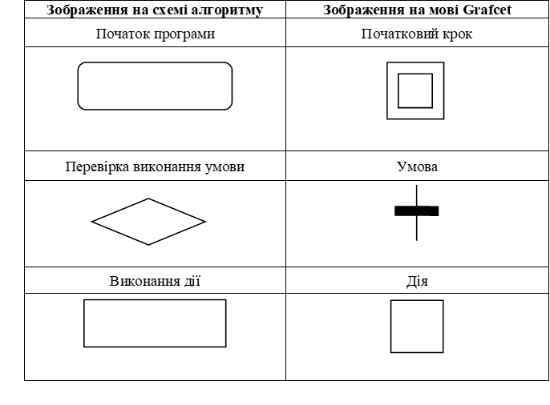

Програмування на мові SFC/Grafcet складається з двох етапів. Спочатку зображується алгоритм керування, а потім означуються дії в кроках та умови в переходах. При цьому для їх запису можна використовувати різні технологічні мови програмування.

Розглянемо приклад реалізації програми користувача, для описаного раніше алгоритму управління, на мові Grafcet (рис. 23).

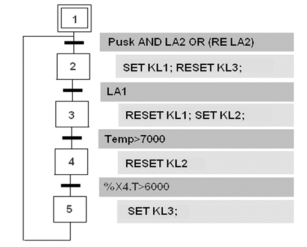

Рис. 23. Програма на мові Grafcet

Програма працює так. При запуску програми стає активним початковий крок 1. Як тільки виконається умова «Pusk AND LA2 OR (RE LA2)», програма перейде до виконання дії, записаної в кроці 1 (SET KL1; RESET KL3;). Після виконання цієї дії програма переходить у стан очікування, поки не виконається умова, записана перед кроком 2. Якщо ця умова виконається, тобто спрацює датчик верхнього рівня LA1, то програма перейде до виконання дій, записаних у другому кроці (RESET KL1; SET KL2;). Програма знову переходить у стан очікування до виконання наступної умови, а саме – досягнення заданої температури (Temp >7000). Після цього стає активним третій крок і виконуються дії, які записані в ньому (RESET KL2; START %TM1;). Після цього повинна бути перевірена умова досягнення заданого часу. На відміну від програм на мовах LD i ST, у програмі на мові Grafcet немає необхідності включати таймер, так на кожному кроці автоматично запускається відлік часу поки крок буде активним. Тому при перевірці цієї умови можна скористатися змінною %XT.4, в якій записується час активності четвертого блока. Коли числове значення в цій змінній стане дорівнювати заданому значенню, умова %XT.4>6000 виконається і стане активним крок 5, виконається дія SET KL3; і програма переходить на перший крок, тобто на початок нового технологічного циклу.

## FBD

Мова ***FBD*** (Function Block Diagram) – графічна мова програмування, яка дає змогу створювати програми у вигляді взаємопов’язаних функціональних блоків, які виконують стандартні для систем автоматизації функції. Вони нагадують графічну схему на якій були б показані стандартні фізичні функціональні блоки, які використовуються в системах автоматизації (регулятори, задавачі, таймери, лічильники, суматори, різноманітні логічні елементи та ін.) і ланцюги підключення між ними, так якщо б це були реальні фізичні пристрої.

На рис.24 показана реалізація розглянутого вище алгоритму управління на мові функціональних блоків, яка використовується в контролері Zelio (Schneider Electric). У програмі використані функціональні блоки, які виконують такі функції: 

- блок AND (логічне «І») на 4 входи;

- блок OR ((логічне «АБО») на 4 входи;

- блок COMPARE (компаратор), який налаштований на порівняння двох входів. Якщо значення сигналу на другому вході стане більше, ніж на третьому, то на виході формується логічна «1»;

- блок TIMER (таймер), який налаштований на заданий час затримки на включення. Тобто якщо на перший вхід (запуск) подається сигнал «1», то таймер запускається і через заданий час на першому виході з’являється логічна «1». Якщо на другий вхід (скидання) подається сигнал «1», то таймер скидається (обнуляється) і його вихід знову стає рівним «0»;

- блоки SET-RESET (включити-відключити), які при подачі лог. «1» на перший вхід (ВКЛ) включає вихід блоку і залишає його в такому стані до тих пір, поки не прийде «1» на другий вхід (ОТКЛ). 

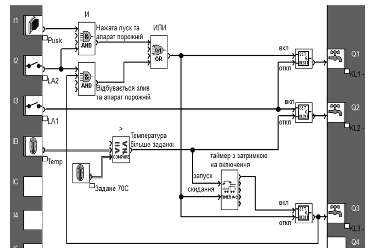

Рис.24. Програма користувача на мові функціональних блоків 

Якщо уважно проаналізувати програми користувача для розглянутого алгоритму управління, які написані на мовах Ladder Diagram i Structured Text, то можна переконатися, що в програмі на мові FBD використовуються функціональні блоки, оператори яких описані в програмах на мовах LD i ST.

У програмі використані такі входи і виходи контролера Zelio, який є моноблочним контролером, у якому адресація зовнішніх змінних є простішою і включає тільки позначення змінної (вхід – І та вихід – Q) і її номер: 

- I1 – дискретний вхід, кнопка «Пуск» (Pusk);

- I2 – дискретний вхід, датчик-сигналізатор нижнього рівня (LA2);

- I3 – дискретний вхід, датчик-сигналізатор верхнього рівня (LA3);

- IB – аналоговий вхід, датчик температури (Temp);

- Q1 – дискретний вихід, клапан набору (KL1);

- Q2 – дискретний вихід, клапан пари (KL2);

- Q3 – дискретний вихід, клапан зливу (KL3).

Програма працює так. Коли буде натиснута кнопка «Пуск» (I1=1) за умови, що апарат порожній, про що свідчить сигнал (I2=1) від сигналізатора нижнього рівня, на виході блока AND формується логічна «1», яка через відповідні виходи блоків SET-RESET: включить клапан набору (Q1=1), виключить клапан зливу (Q3=0) та скине таймер TIMER. Апарат починає заповнюватися продуктом.

Повторне виконання цих команд відбудеться в кінці технологічного циклу, коли рідина буде виливатися з апарата в момент спрацьовування датчика нижнього рівня. Для цього використано другий блок AND. Свідченням того, що команда наповнення апарата буде виконуватися за однією з умов, є те, що вихідні сигнали блоків AND підключені до входів блока OR (ИЛИ), вихід якого й включить клапан набору (Q1=1), виключить клапан зливу (Q3=0) та скине таймер TIMER.

Коли спрацює датчик верхнього рівня (I3=1), відключається клапан набору, тому що приходить «1» на вхід «откл» блока SET-RESET, та включається клапан пари (Q2=1). Відключається клапан пари в той час, коли температура буде більша від заданої, тобто коли значення 2-го входу компаратора COMPARE буде більшим від 3-го. Крім того, вихід компаратора запустить таймер TIMER, який через заданий час виставить «1» на першому виході. Вихід таймера включає клапан зливу (Q3=1). Після спрацювання сигналізатора нижнього рівня клапан зливу закриється, відкриється клапан набору, скинеться таймер і цикл повториться.

Наведена програма ілюструє використання невеликої кількості функціональних блоків, хоча в кожному ПЛК їх значно більше – різноманітних за призначенням і складністю. Крім того, в більшості ПЛК існує можливість створення користувачем своїх власних функціональних блоків.

## Регулювання

У сучасних ПЛК, крім можливості логіко-командного управління, також доступні функції контурів регулювання. Є два підходи до реалізації таких функцій: застосування вбудованих в ПЛК апаратних (системних) регуляторів або використання бібліотечних функцій регулювання. Деякі ПЛК надають обидва способи. І в тому й іншому випадку йдеться про звертання до підпрограми, яка реалізує функцію автоматичного регулятора. При цьому розробнику програми користувача не потрібно розробляти цю підпрограму, оскільки вона знаходиться в пам’яті контролера, а необхідно підключити до неї відповідні вхідні і вихідні змінні, а також ввести значення параметрів регулятора.

Для програмної реалізації контурів керування добре підходить мова FBD або CFC. Розглянемо приклад програми ПЛК для контуру стабілізації температури води на виході теплообмінника (рис. 25).

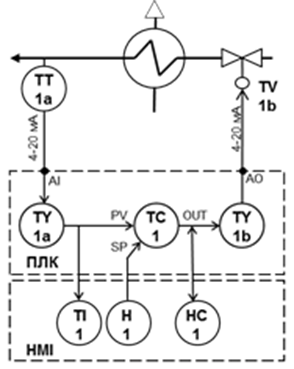

Рис. 25.До постановки завдання

Програма в ПЛК повинна забезпечити стабілізацію температури води на виході теплообмінника шляхом зміни подачі пари регулюючим клапаном з електричним виконавчим механізмом. Регулятор повинен реалізовувати ПІ-закон регулювання.

У системі керування передбачено підключення до ПЛК операторської панелі, за допомогою якої оператор може:

- контролювати температуру на виході теплообмінника (регульована змінна);

- змінювати задане значення (SP –*Set Point*) температури води;

- змінювати параметри налаштування регулятора Kp та Ti;

- мати можливість переходу на ручний режим управління положенням регулюючого клапана.

Система управління включає в себе датчик температури ТТ-1а, регулюючий TV-1b, ПЛК та операторську панель (HMI).

Датчик температури води має вбудований перетворювач 4..20 мА та налаштований на діапазон 0..150**°**С. Електричний аналоговий виконавчий механізм управляється сигналом 4..20 мА. Регулятор повинен реалізовувати ПІ-закон регулювання і налаштовуватися засобами HMI. Завдання регулятору (SP) повинен формувати оператор засобами HMI (H-1). З боку HMI регулятор повинен мати можливість переводу в ручний режим, з можливістю зміни оператором положення клапана (HC-1).

Програму для наведеного контуру показано в складі системи управління на рис. 26. У центрі контуру знаходиться функціональний блок регулятора (TC1 типу PI_B), який реалізує ПІ-закон регулювання. На вхід PV (Process Value) регулятору подається дійсне значення температури, а на вхід SP (Set Point) – задане значення. OUT – вихід на виконавчий механізм з регулятора. Налаштування регулятора Kp та Ti виконується через однойменні вхідні параметри, а управління режимом роботи (ручний / автоматичний режим) – через вхід AUTO.

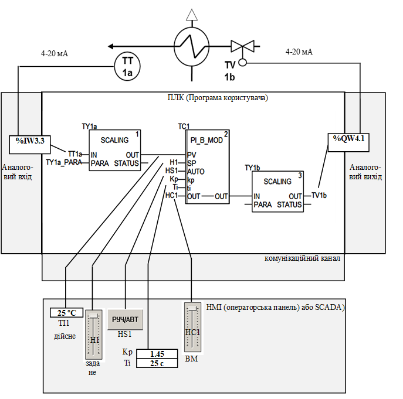

Рис. 26. Приклад контуру регулювання з використанням бібліотечних блоків та мови FBD

Регулятор працює з фізичними величинами, тому значення з датчика 4..20 мА, яке записується у вхідну змінну TT1a (адреса %IW3.3), необхідно перетворити на діапазон *0..150* *°*С, що проводиться в блоці масштабування TY1a (типу SCALING). Налаштування параметрів масштабування (вхідний та вихідний діапазони перетворення) задається через вхід блоку PARA. Тому значення з датчика спочатку записується в TT1a (так визначено конфігурацією), а потім перетворюється (масштабується) блоком TY1a типу SCALING у діапазон значень від 0..150* *°*С. Потім це значення подається на вхід PV (дійсне значення) регулятора TC1. Задане значення регулятору задається змінною H1, яка змінюється з панелі оператора. Також з панелі налаштовуються параметри настроювання регулятора через змінні Kp та Ti. Для управління режимом роботи регулятора (ручний/автоматичний) оператор з панелі перемикає змінну HS1 в логічний «0» (ручний режим) або логічну «1» (автоматичний режим). У ручному режимі вихід OUT регулятора підмінюється сигналом, який змінює оператор з панелі через змінну HC1. Вихід OUT подається на виконавчий механізм через блок масштабування TY1b (SCALING) та вихідну змінну TV1b (адреса %QW4.1).

## Питання для самоконтролю

1. Поясніть, що таке програмований логічний контролер.

2. Назвіть основні риси ПЛК.

3. Укажіть основні структурні елементи ПЛК.

4. З яких етапів складається робочий цикл ПЛК?

5. Яка різниця між циклічним і періодичним режимами виконання робочого циклу ПЛК?

6. Які основні типи каналів (модулів) входять до складу ПЛК?

7. На які групи можна поділити ПЛК за конструктивним виконанням?

8. Наведіть основні характеристики дискретних вхідних каналів (модулів).

9. Наведіть основні характеристики дискретних вихідних каналів (модулів).

10. Наведіть основні характеристики аналогових вхідних каналів (модулів).

11. Наведіть основні характеристики аналогових вихідних каналів (модулів).

12. Наведіть перелік спеціальних каналів (модулів).

13. Вкажіть змінні ПЛК та їхні типи.

14. Наведіть один із принципів адресації вхідних і вихідних модулів.

15. Як перевести фізичне значення підключеного до ПЛК сигналу від датчика в числове значення представлення його в ПЛК?

16. Які мови технологічного програмування ПЛК визначені міжнародним стандартом МЕК 61131-3?

17. Назвіть основні елементи мови Ladder Diagram.

18. Які основні інструкції використовуються в мові Structured Text?

19. Що являє собою мова функціональних блоків FBD?

20. Що являє собою мова SFC або Grafcet?

21. Як програмуються контури систем автоматичного регулювання?

Теоретичне заняття адаптував Олександр Пупена на основі матеріалів з посібника [Автоматизація виробничих процесів. ](https://pupenasan.github.io/avpbook/6.html)
