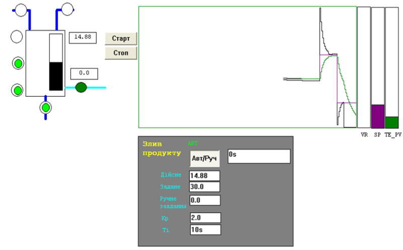

[<- До підрозділу](README.md)		[Коментувати](#feedback)

## Приклади реалізації стабілізаційного регулювання в  UnityPRO/Control Expert

Завдання. 

Створити проект для ПЛК М340, для реалізації програми управління установкою, що описується наступним алгоритмом (див. рис.6.59). Після нажимання кнопки "СТАРТ" відкривається клапан набору першого продукту. Після досягнення середнього рівня клапан 1-го продукту закривається, відкривається клапан набору 2-го продукту. Після спрацювання сигналізатору верхнього рівня закривається клапан набору 2-го продукту, відкривається клапан пари на 100% (діапазон виходу 0-100%). Після досягнення температури 95ºС (діапазон датчику 0-150ºС) включається етап витримки. Витримка повинна тривати 3 хвилини, в цей час регулятор повинен підтримувати температуру на заданому рівні. Задане значення температури визначає оператор. Програму перевірити та налагодити з використанням операторських екранів.

Після закінчення витримки, рідина зливається з апарату. Після відключення сигналізатору нижнього рівня, цикл повторюється у випадку якщо кнопка СТОП не нажата. Якщо СТОП нажата – клапан зливу закривається. У ПЛК поступає сигнал від датчика рівня з діапазоном вимірювання 0-5 м. 

Рішення. 

Робота програми описується алгоритмом, наведеним в главі 5.8 за винятком етапу витримки. Модифікована частина програми показана на рис.6.60, перелік змінних та екземплярів функціональних блоків наведений на рис.6.61 та рис.6.62. 

Змінна що відповідає за управління виконавчим механізмом *VR_par_R* управляється регулятором *TIC1*, який реалізовує ПІ закон управління. Регулятор викликається кожні 100 мс, оскільки його вхід *EN* підключений до блоку *SMPL1*. Ручне управління клапаном *VR_par_R* забезпечується через функцію *SEL* (".16"), який перемикає *VR_par_R*  на значення *VR_par_MAN*. Для безударності переходу замість *SEL* можна використання блок *MS*. 

Регулятор *TIC1* працює в режимі регулювання тільки при (*StepProg=4*), в інших випадках він працює в режимі слідкування, тобто на вихід *TIC1.OUT* буде подаватися значення *TIC1.TR_I.* Таким чином на усіх етапах роботи програми *VR_par_R* буде управлятися значенням з *MUX*, тільки на етапі витримки буде включатися режим регулювання.   

Рис.6.59. Приклад операторського екрану до поставленої задачі

Рис.6.60. Модифікована частина секції програми 

Рис.6.61. Перелік змінних

Рис.6.62. Перелік екземплярів функціональних блоків

## Автори

Теоретичне заняття розробив [Олександр Пупена](https://github.com/pupenasan). 

## Feedback

Якщо Ви хочете залишити коментар у Вас є наступні варіанти:

- [Обговорення у WhatsApp](https://chat.whatsapp.com/BRbPAQrE1s7BwCLtNtMoqN)
- [Обговорення в Телеграм](https://t.me/+GA2smCKs5QU1MWMy)
- [Група у Фейсбуці](https://www.facebook.com/groups/asu.in.ua)

Про проект і можливість допомогти проекту написано [тут](https://asu-in-ua.github.io/atpv/)
