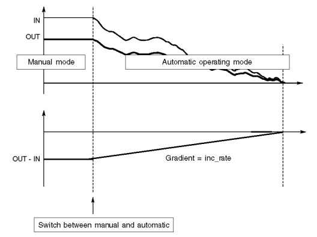
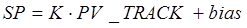

[<- До підрозділу](README.md)

# Реалізація контурів регулювання в  UnityPRO/Control Expert

## Структура контурів регулювання 

У даному розділі розглядаються принципи побудови контурів регулювання з використанням бібліотечних FFB UNITY PRO. Слід нагадати, що крім бібліотечних функцій, у вищих версіях процесорних модулів TSX Premium доступні вбудовані контури регулювання (канали Loop Control), програмне налагоджування яких виконується шляхом конфігурування. Користувач заповнює попередньо сконфігуровані схеми контурів управління вказуючи зв‘язок їх з вхідними і вихідними величинами і вказуючи режими їх роботи. Робота з вбудованими в процесорний модуль контурами регулювання виходить за рамки даного посібника. 

На рис.6.1 показана узагальнена функціональна структура контурів регулювання з використанням ПЛК. 

Бібліотеки UNITY PRO нараховують велику кількість блоків для реалізації наведених на рис.6.1 функцій. Частина з них присутні у бібліотеці для сумісності з проектами, які конвертуються з середовищ CONCEPT та PL7. Це такі сімейства блоків:

- CLC_INT бібліотеки Base Lib (PID_INT, PWM_INT, SERVO_INT);

- CLC бібліотеки Obsolete Lib (PI1, PID1, PIDP1 та інші);

- CLC PRO бібліотеки Obsolete Lib (PI, PID, PID_P, PIP, PPI, PWM та інші).

Сімейства бібліотеки Obsolete Lib  не рекомендується використовувати у новостворюваних проектах UNITY PRO. Процедури сімейства CLC_INT бібліотеки StandardLib реалізовують цілочисельне регулювання аналогічне тому, яке використовувалось в PL7 PRO. Ці блоки розглянуті в главі 6.7.

Більшість з наведених на рис.6.1 функцій реалізуються з використанням елементів FFB бібліотеки "Control Library", яка поставляється разом з UNITY PRO. Використанню FFB з цієї бібліотеки якраз і присвячений даний розділ.   

У центрі контурів регулювання знаходиться регулятор (алгоритми регулювання), який в UNITY PRO може бути реалізований через один із доступних функціональних блоків із сімейства "Controller": PI_B (ПІ-регулятор), PIDFF (ПІД-регулятор), STEP2 (2-позиційний регулятор), STEP3 (з-позиційний регулятор). Окрім самих регуляторів додатково з цього ж сімейства можуть бути використані блоки AUTOTUNE (автонастройка), IMC (коректор моделі), SAMPLETM (диспетчер виклику функціональних блоків). Ряд з цих функціональних блоків розглянуті в главі 6.2. 

Значення регульованої величини, яке поступає з датчиків на програмний регулятор, попередньо повинен бути оброблений. Це зв’язано з тим, що всі реалізації регуляторів сімейства "Controller" оперують зі значеннями типу REAL, а оцифроване значення з аналогових вхідних модулів має тип INT (в діапазоні 0-10000). Крім того вимірювальне значення може бути зашумлене та потребувати додаткової обробки. Для обробки вхідних даних контурів управління можуть бути використані блоки сімейств "Conditioning", "Measurement" та "Mathematics", які розглядаються в главі 6.3.

Контури регулювання повинні мати можливість працювати в ручному режимі, при цьому повинна бути забезпечена безударність переходу. Крім того, для деяких типів виконавчих механізмів необхідне додаткове перетворення сигналу. Для такого типу перетворення вихідного сигналу регуляторів призначені блоки сімейства "Output Processing", які розглянуті в главі 6.4.

Для формування та управління уставками регуляторів можна скористатися FFB сімейства "Setpoint management", які розглянуті в главі 6.5.

На будь якому з етапів перетворення та алгоритмічної обробки даних можуть знадобитися блоки додаткової обробки з сімейства "Conditioning", які розглянуті в главі 6.6. 

## Режим слідкування (Tracking) 

Багато функціональних блоків бібліотеки управління підтримують управління операційним режимом. Доступні такі режими:

- Tracking (режим слідкування);

- Manual/Automatic (ручний/автомат) 

Слідкування дає можливість переводити функціональний блок в стан управління його виходом із зовні (рис.6.2).

 

Управління режимом проводиться сигналом TR_S (TRacking Switch). У нормальному режимі\ (TR_S = 0) значення виходу функціонального блоку OUT визначається закладеним в нього алгоритмом (Function). У режимі слідкування\ (Tracking\, TR_S = 1) вихід OUT дорівнює значенню входу TR_I (TRacking Input).

 Для забезпечення безударності переходу між режимами, внутрішній алгоритм відслідковує значення виходу. Тобто в момент переходу з режиму Tracking в нормальний режим, вихід алгоритму буде дорівнювати входу TR_I. 

Режим Tracking може бути використаний в наступних ситуаціях:

1) ініціалізація функціонального блоку в початковій фазі функціонування, тобто при першому виконанню блоку;

2) режим слідкування функціонального блоку в дубльованому ПЛК (в системах Hot Standby TSX Premium/Quantum), для гарантування безударності запуску резервного контролеру;

3) безпосереднє управління виходом функціонального блоку, тобто коли вихід блоку повинен визначатися зовнішнім алгоритмом.   

## Режими Ручний/Автомат (Manual/Automatic) 

Вибраний режим ручний/автомат визначається значенням входу MAN_AUTO (рис.6.3). У автоматичному режимі (MAN_AUTO=1) вихід функціонального блоку OUT дорівнює виходу внутрішнього алгоритму (Function).

У ручному режимі (MAN_AUTO=1) вихід OUT не залежить від розрахункового значення закладеного алгоритмом, і може бути змінена ззовні (наприклад засобами HMI). 

Для забезпечення безударності переходу між режимами, внутрішній алгоритм відслідковує значення виходу. Тобто, при переході з режиму з Manual в Auto, вихід алгоритму буде дорівнювати останньому значенню виходу.

Якщо функціональний блок підтримує обидва типи операційних режимів Tracking і Manual/Automatic, режим Tracking має вищий пріоритет (рис.6.4). Це значить, що в режимі Tracking вихід OUT буде дорівнювати TR_I незалежно від стану  MAN_AUTO. 

## Періодичність виклику FFB та контроль за помилками

Багато функціональних блоків зав’язані на часових інтервалах між викликами, наприклад для розрахунку інтегральної та диференційної складової в ПІД-регуляторі. У багатьох ПЛК для правильної роботи таких блоків необхідно викликати їх періодично. У UNITY PRO функціональні блоки бібліотеки управління ControlLIB розраховують ці інтервали автоматично, що дає можливість викликати їх без забезпечення періодичності. Тим не менше, в деяких випадках бажано задати періодичність виклику, наприклад:

- оптимізація часу виконання циклів, розподіливши виклик операцій регулювання між різними циклами;

- покращення якості управління в контурах з серводвигунами, для зменшення частоти обробки блоку SERVO;

- мінімізація навантаження на виконавчі механізми (збільшення періодичності виклику – зменшення частоти зміни положення);

Для управління періодичністю виклику функціональних блоків можна використати EFB типу SAMPLETM (див. параграф 6.2.2), вихід якого може управляти входом EN потрібного функціонального блоку управління.

Контроль виконання багатьох FFB бібліотеки проводиться шляхом аналізу вихідного слова STATUS. Призначення перших 8-ми біт цього слова (0..7) однакові для всіх функціональних блоків, призначення інших 8-ми (8..15) залежить від функціонального блоку.

Таблиця 6.1.

|           |                                                              |
| --------- | ------------------------------------------------------------ |
| Bit 0 = 1 | Помилка  при розрахунку значення з плаваючою комою (наприклад отримання квадратного  кореня з від’ємного значення) |
| Bit 1 = 1 | Недозволене  значення було записане у вхідне значення з плаваючою комою із за того, що:  значення не являється з плаваючою комою; значення являється нескінченністю |
| Bit 2 = 1 | Ділення  на 0 при розрахунку з плаваючою комою               |
| Bit 3 = 1 | Переповнення  пам’яті при розрахунку з плаваючою комою       |
| Bit 4 = 1 | Вхідне  значення виходить за діапазон; використовується значення обмежене блоком |
| Bit 5 = 1 | Основний  вихід функціонального блоку досяг нижньої межі     |
| Bit 6 = 1 | Основний  вихід функціонального блоку досяг верхньої межі    |
| Bit 7 = 1 | Верхня  та нижня межі однакові                               |

## Огляд блоків сімейства Controller. 

Нагадаємо, що в UNITY PRO для реалізації алгоритмів регулювання пропонується використовувати бібліотеку *ControlLib*, зокрема блоки сімейств *Controller,* *Output* *Processing,* *Setpoint* *Management*. У таблиці 6.2 наведений перелік функціональних блоків сімейства Controller .

Таблиця 6.2. Функціональні блоки сімейства Controller

| Назва типу EFB | Призначення                                                  |
| -------------- | ------------------------------------------------------------ |
| *SAMPLETM*     | управління періодичністю виклику  відносно початкового циклу |
| *PI_B*         | ПІ-регулятор                                                 |
| *PIDFF*        | ПІД-регулятор                                                |
| *STEP2*        | двохпозиційний регулятор                                     |
| *STEP3*        | трьохпозиційний регулятор                                    |
| *AUTOTUNE*     | блок автонастройки *PI_B* та *PIDFF*                         |
| *IMC*          | коректор моделі                                              |

Ці блоки будуть розглянуті в інших темах посбіника.

## SAMPLETM 

Всі блоки бібліотеки *Control* *Lib*, алгоритм яких передбачає використання часових інтервалів (наприклад для інтегрування або диференціювання), розраховують ці інтервали як різницю між плинним та попереднім часом виклику блоку. Це значить, що їх можна викликати аперіодично. Однак алгоритми регулювання потребують значні часові ресурси, що займає значну частину часу Задачі(*Task*), в якій вони викликаються. З іншого боку, більшість задач регулювання не потребують частої обробки, а отже їх контури можуть оброблятися рідше, ніж кожний цикл. Таким чином для оптимізації роботи програми контролера рекомендується обробляти контури періодично, і зсунутими у часі відносно один одного. 

Так, наприклад, при наявності 10-ти контурів регулювання, можна викликати зв’язані в контурі блоки з періодичністю 100 мс, але зсунуті один відносно одного на один цикл. Тобто через кожні 100 мс, протягом 10 циклів будуть оброблені всі контури. Періодичний виклик зі зсувом по часу можна забезпечити функціональним блоком *SAMPLETM*.

Функціональний блок *SAMPLETM* з періодичністю, яка визначається вхідним параметром *INTERVAL*, на один цикл Задачі виставляє в значення *TRUE* вихід *Q*. Вхідний параметр *DELSCANS* визначає зміщення в циклах запуску внутрішнього таймеру блоку відносно першого циклу контролеру (після холодного старту).

На рис.6.5 показаний приклад використання 2-х екземплярів *SAMPLETM*, виходи *Q* яких з періодичністю однієї секунди будуть виставлятися на один цикл в *TRUE*. Включення цих виходів буде зміщене на один цикл один відносно одного. 

Рис.6.5. Використання 2-х екземплярів SAMPLETM зі зсувом на один цикл відносно           

## Блок ручного управління *MS*

Функціональні блоки регуляторів, в тому числі мають вбудовані засоби переключення їх в ручний режим, з забезпеченням безперебійності. Нижче наведені випадки, для яких може знадобитися використання блоку ручного управління *MS*:

-    для управління аналоговими виходами, які управляються НЕ через алгоритми зі зворотним зв’язком (не за відхиленням);

-    для управління аналоговими виходами, які в ручному і в автоматичному режимах формуються окремими блоками (наприклад при каскадному регулюванні, переключенні між алгоритмами);

-    для управління серводвигунами в ручному режимі без використання регуляторів *PI_B/PIDFF*; 

На рис.6.35 показана функціональна схема блоку *MS*, на рис.6.36 – приклад виклику блоку в FBD.

Вихід *OUT* в автоматичному режимі формується як сума входів *IN* та *outbias*, якщо зміщення активоване (*use_bias=TRUE*). У ручному режимі вихід міняється безпосередньо. У обидвох режимах абсолютне значення *OUT* обмежується по мінімуму і максимуму, а інкрементальне *OUTD* – не обмежується. 

Рис.6.35.Функціональна схема блоку *MS*

Рис.6.36.Приклад виклику блоку *MS*

*Таблиця* *6.27* Параметри блоку *MS*

|            |         | Вхідні  параметри                                            |
| ---------- | ------- | ------------------------------------------------------------ |
| *IN*       | *REAL*  | Значення змінної в  автоматичному режимі                     |
| *FORC*     | *BOOL*  | 1:Режим ручний/автомат визначається входом *MA_FORC*   0: Режим ручний/автомат визначається входом *MAN_AUTO* |
| *MA_FORC*  | *BOOL*  | Режим ручний/автомат  для *FORC* *= 1*  1: Автоматичний режим   0: Ручний режим |
| *MAN_AUTO* | *BOOL*  | Режим  ручний/автмат для *FORC* *= 0*   1:  Автоматичний режим  0: Ручний режим |
| *PARA*     | Para_MS | Параметр                                                     |
| *TR_I*     | *REAL*  | Вхід ініціалізації                                           |
| *TR_S*     | *BOOL*  | Команда на включення  ініціалізації (1: Включити вхід ініціалізації) |
|            |         | Вхідні/вихідні  параметри                                    |
| *OUT*      | *REAL*  | абсолютне значення  виходу                                   |
|            |         | **Вихідні  параметри**                                       |
| *OUTD*     | *REAL*  | інкрементальне значення  виходу: різниця між вихідною величиною в плинному і попередньому циклах  перерахунку *OUTD* |
| *MA_O*     | *BOOL*  | Плинний режим роботи  регулятору (0: Ручний, 1: Автоматичний) |
| *STATUS*   | *WORD*  | Слово статусу                                                |

*Таблиця* *6.28.* Опис структурного типу Para_MS

| *out_min*  | *REAL* | нижня межа для виходу  регулятору                            |
| ---------- | ------ | ------------------------------------------------------------ |
| *out_max*  | *REAL* | верхня межа для виходу  регулятору                           |
| *inc_rate* | *REAL* | Швидкість наростання  значення сигналу при переключенні руч./авт. (одиниць на секунду) |
| *dec_rate* | *REAL* | Швидкість спадання значення сигналу при переключенні руч./авт.  (одиниць на  секунду) |
| *outbias*  | *REAL* | значення зміщення                                            |
| *use_bias* | *BOOL* | 1: Активувати зміщення                                       |
| *bumpless* | *BOOL* | 1: активувати безударність переходу руч/авт                  |

Рис.6.37.Діаграма роботи безударного переходу руч./авт. в *MS*

Для реалізації безударності переходу з ручного в автоматичний режим (*bumpless=TRUE*) використовуються лінійні переходи з обмеженням по швидкості, які настроюються параметрами *inc_rate* та *dec_rate*. Таким чином, в момент переходу в автоматичний режим, різниця між IN та OUT буде зменшуватися відповідно до заданої швидкості (рис.6.37).

Рис.6.38.Діаграма роботи безударного переходу руч./авт. зі зміщенням в *MS*

Якщо активований параметр *outbias* (зміщення) тобто *use_bias=TRUE*, то безударність досягається за рахунок використання нового перерахованого значення зміщення (рис.6.38). 

Безударний перехід є сенс активувати тоді, коли вхід *IN* підключений до регуляторів або інших блоків, в яких не реалізований безударний перехід. Приклад використання блоку *MS* показаний в параграфі 6.8.2.

## Перемикач уставок *SP_SEL*

Функціональний блок призначений для переключення уставки (заданого значення *SP*) для регуляторів *PI_B/PIDFF* або аналогічних (див. рис.6.39). У локальному режимі (*local* *mode*, коли *SP_RSP=FALSE*) уставка змінюється безпосередньо через вхід/вихід *SP*, який повинен бути підключений до однойменного входу регулятору. У дистанційному режимі (*remote* *mode*, коли *SP_RSP=TRUE*) уставка змінюється через вхід *RSP*.

Функціональний блок має наступні властивості:

1)  переключення між уставками в безударному режимі;

2)  операції з уставками проводяться навіть в ручному режимі;

3)  проводиться обмеження уставки по верхній і нижній межі;

При переключенні уставки з локального режиму в дистанційний, безударність забезпечується за рахунок плавної зміни виходу з швидкістю, заданою параметром *rate*. 

Приклад використання *SP_SEL* показаний в параграфі 6.8.2. 

Рис.6.39. Приклад виклику блоку *SP_SEL*

*Таблиця* *6.29*. Параметри блоку *SP_SEL*

|           |             | Вхідні  параметри                                            |
| --------- | ----------- | ------------------------------------------------------------ |
| *RSP*     | *REAL*      | Дистанційна уставка                                          |
| *SP_RSP*  | *BOOL*      | Вибір уставки  1 : Дистанційна уставка   0 : Локальна уставка |
| *PARA*    | Para_SP_SEL | Параметри                                                    |
| *PV*      | *REAL*      | Плинне значення змінної  управління                          |
| *MA_I*    | *BOOL*      | Операційний режим  регулятору, до якого під’єднаний перемикач  1 : Автоматичний режим   0 : Ручний режим |
|           |             | **Вхідні/вихідні  параметри**                                |
| *SP*      | *REAL*      | Уставка регулятору                                           |
|           |             | **Вихідні  параметри**                                       |
| *LSP_MEM* | *REAL*      | Локальна уставка в  пам’яті                                  |
| *STATUS*  | *WORD*      | Слово статусу                                                |

*Таблиця* *6.30* Опис структурного типу Para_SP_SEL

|          |        |                                                              |
| -------- | ------ | ------------------------------------------------------------ |
| *sp_min* | *REAL* | Обмеження по мінімуму  уставки                               |
| *sp_max* | *REAL* | Обмеження по максимуму  уставки                              |
| *bump*   | *BOOL* | У процесі зміни уставки  локальної/дстанційної  1 : вихід *SP* форсується значенням *LSP_MEM*   0: безударний перехід |
| *track*  | *BOOL* | 1 : значення *SP* копіюється зі входу PV (тільки  в локальному режимі) |
| *rate*   | *REAL* | швидкість  збільшення SP протягом зімни локальне/дистанційне в  одиницю/секунду (≥0) |

## Зміна уставки з постійною швидкістю (*RAMP*)

Функціональний блок *RAMP* забезпечує плавну зміну виходу *SP* від попереднього значення до значення входу *RSP* (див. рис.6.40)*.* Швидкість зміни налаштовується двома параметрами з *Para_RAMP*: на збільшення – *inc_rate*, на зменшення - *dec_rate*. Рівність *SP=RSP* сигналізується виходом *DONE*. 

Блок *RAMP* може бути використаний для плавної зміни завдання або виходу регулятору, створеного користувачем. 

Рис.6.40. Приклад виклику блоку RAMP

Рис.6.41. Приклад виклику блоку RAMP

*Таблиця* *6.31*. Параметри блоку *RAMP*

|          |           | Вхідні  параметри             |
| -------- | --------- | ----------------------------- |
| *RSP*    | *REAL*    | Задане значення уставки       |
| *PARA*   | Para_RAMP | Параметри                     |
| *TR_I*   | *REAL*    | Значення ініціалізації        |
| *TR_S*   | *BOOL*    | 1 – включити  ініціалізацію   |
|          |           | **Вихідні  параметри**        |
| *SP*     | *REAL*    | Вихідна уставка               |
| *DONE*   | *BOOL*    | 1: значення досягнуло уставки |
| *STATUS* | *WORD*    | Слово стану                   |

*Таблиця* *6.32*   Опис структурного типу Para_RAMP

| *inc_rate* | *REAL* | Швидкість нарощування в  одиницях/секунду (≥0) |
| ---------- | ------ | ---------------------------------------------- |
| *dec_rate* | *REAL* | Швидкість спаду в  одиницях/секунду(≥0)        |

## Задатчик співвідношення (*RATIO*) 

Функціональний блок *RATIO* забезпечує розрахунок завдання на виході за формулою: 

                   (6.40)

де *PV_TRACK* *–* значення змінної, відносно якої розраховується завдання; *bias* – зміщення. 

Рис.6.42. Приклад виклику блоку *RATIO*

*Таблиця* *6.33* Параметри блоку RATIO

|            |            | Вхідні  параметри                                            |
| ---------- | ---------- | ------------------------------------------------------------ |
| *PV*       | *REAL*     | Значення вимірювальної  величини, що подається на регулятор (тільки для розрахунку *KACT*) |
| *PV_TRACK* | *REAL*     | значення змінної,  відносно якої розраховується завдання     |
| *RK*       | *REAL*     | дистанційний коефіцієнт  співвідношення                      |
| *K_RK*     | *BOOL*     | Вибір джерела для  коефіцієнта:  "1":  коефіцієнт задається дистанційно  входом *RK*   "0": локальний коефіцієнт, задається входом *K* |
| *K*        | *REAL*     | локальний коефіцієнт  співвідношення                         |
| *PARA*     | Para_RATIO | Пареметри                                                    |
|            |            | **Вихідні  параметри**                                       |
| *KACT*     | *REAL*     | Реальний коефіцієнт  співвідношення                          |
| *SP*       | *REAL*     | Розраховане завдання                                         |
| *STATUS*   | *WORD*     | Слово стану                                                  |

*Таблиця* *6.34* Опис структурного типу Para_RATIO

|          |        |                                                |
| -------- | ------ | ---------------------------------------------- |
| *k_min*  | *REAL* | обмеження по мінімуму *K* та *RK*              |
| *k_max*  | *REAL* | обмеження по максимуму *K* та *RK*             |
| *sp_min* | *REAL* | обмеження по мінімуму  для розрахованого *SP*  |
| *sp_max* | *REAL* | обмеження по максимуму  для розрахованого *SP* |
| *bias*   | *REAL* | Зміщення                                       |

Функціональний блок може бути використаний при слідкуючому регулюванні (наприклад регулятор співвідношення) для формування завдання регуляторам *PI_B/PIDFF*.

Крім реалізації лінійної залежності, блок має додаткові можливості (рис.6.43):

-     дистанційну зміну коефіцієнту *K* або *RK*;

-     обмеження по мінімуму та максимуму для *K* або *RK;*

-     обмеження по мінімуму та максимуму для розрахованого *SP*;

-     розрахунок реального коефіцієнта: *KACT=(PV-bias)/PV_TRACK*; 

Рис.6.43. Функціональна схема RATIO

 ## Цілочисельне регулювання (сімейство *CLC_INT*)

Процедури UNITY PRO для цілочисельного регулювання *PID_INT,* *PWM_INT* та *SERVO_INT* аналогічні функціям *PID*, *PWM* та *SERVO*, які використовувалися в PL7 PRO при програмуванні попередніх версій TSX Premium та TSX Micro. Дані процедури як правило використовують тільки для сумісності з конвертованими проектами з PL7, однак використання їх в нових проектах UNITY PRO також дозволяється. Альтернативою процедурам цілочисельного регулювання є більш потужні функціональні блоки бібліотеки управління, які наведені вище. 

Структурна схема можливих варіантів контуру з цілочисельним ПІД-регулятором представлена на рис.6.50.

Рис.6.50. Структурна схема варіантів реалізації контуру з ПІД-регулятором 

До структурної схеми можуть входити три процедури:

-     блок ПІД-регулятора (процедура *PID_INT*);

-     блок широтно-імпульсного перетворення (*PWM_INT*);

-     блок управління реверсивним двигуном (*SERVO_INT*).

При використанні аналогового виконавчого механізму, цілочисельний вихід блока ПІД подається на аналоговий вихід контролера. Якщо використовується електричний виконавчий механізм з постійною швидкістю обертання (наприклад виконавчий механізм типу МЕО) або крокові двигуни, цілочиселний вихід *PID_INT* за допомогою процедур *PWM_INT* або *SERVO_INT* перетворюється у послідовність імпульсів, які подаються на дискретні виходи. Для правильного функціонування процедур *PID_INT,* *PWM_INT* та *SERVO_INT* Задача, в якій вони викликаються повинна виконуватись у періодичному режимі! 

Кожен блок буде розглянуту у відповідній темі посібника.

## Контрольні запитання

1.   Які апаратні засоби є вбудовані в TSX Premium для реалізації контурів регулювання?

2.   З яких основних частин складається прикладна програма ПЛК для реалізації контурів регулювання? Поясніть призначення кожної з цих частин. 

3.   Блоки FFB яких бібліотек використовуються для реалізації контурів регулювання в UNITY PRO? Які з них використовуються тільки для сумісності з проектами PL7 та Concept?

4.   Блоки FFB якої бібліотеки рекомендується для реалізації контурів регулювання в UNITY PRO? Чи обов’язково користуватися для задач регулювання блоками саме цієї бібліотеки?

5.   Поясніть призначення та особливості функціонування режиму слідкування (*Tracking*) FFB-блоків бібліотеки *ControllLIB*. Який пріоритет має цей режим по відношенню до режиму ручний/автомат?

6.   Поясніть призначення та особливості функціонування ручного та автоматичного режимів FFB-блоків бібліотеки *ControllLIB*. Який пріоритет має цей режим по відношенню до режиму слідкування? 

7.   Яким чином контролюється виконання FFB бібліотеки *ControllLIB*? Які типові помилки можуть виникнути при обробці блоку?

8.   Чи обов’язково викликати блоки регуляторів *ControllLIB* строго періодично?

9.   Розкажіть про призначення FFB блоків сімейства *Controller* бібліотеки *ControllLIB*. 

10.   Розкажіть про призначення та функціонування *SAMPLETM*. Чи обов’язкове їх використання тільки з блоками регуляторів?

11.   Використовуючи функціональну схему поясніть основні принципи роботи блоку регулятору *PI_B*.

12.   Яким чином блок *PI_B* переводиться в П- та ПІ-режим регулювання? Поясніть відмінності роботи цих режимів.

13.   Поясніть призначення полів структури *Para_PI_B* .

14.   Використовуючи функціональну схему поясніть основні принципи роботи блоку регулятору *PIDFF*.

15.   Поясніть призначення полів структури *Para_PIDFF* .

16.   Чим відрізняється вихід *OUTD* від *OUT* в регуляторах блоків PI_B та PIDFF? Навіщо кожен з них використовується?

17.   Розкажіть про призначення входу *RCPY*. Як активувати режим використання *RCPY*?

18.   Розкажіть про функціонування блоків *PI_B/PIDFF* в режимі абсолютного розрахунку.

19.   Розкажіть про функціонування блоків *PI_B/PIDFF* в інкрементальному режимі роботи.

20.   Як Ви розумієте термін безударність переходу? Між якими режимами і яким чином реалізована безударність переходу в блоках *PI_B* та *PIDFF*?

21.   Розкажіть про призначення та функціонування *STEP2*.

22.   Розкажіть про призначення та функціонування *STEP3*.

23.   Розкажіть про призначення та функціонування *HYST*.

24.   Розкажіть про призначення та функціонування *INDLIM*.

25.   Розкажіть про призначення та функціонування процедури *LOOKUP_TABLE*.

26.   Розкажіть про призначення та функціонування *DEAD_ZONE*.

27.   Розкажіть про призначення та функціонування *SAH*.

28.   Розкажіть про призначення та функціонування *AVGMV* та *AVGMV_K*. 

29.   Розкажіть про призначення та функціонування *K_SQRT*.

30.   Розкажіть про призначення та функціонування *MFLOV*.

31.   Розкажіть про призначення та функціонування *MULDIV_W* та *SUM_W*.

32.   Розкажіть про призначення та функціонування *SERVO*. 

33.   Яким чином блоки управління серводвигунами можуть визначати положення регулюючого органу?

34.   Як контролюється блоком *SERVO* досягнення регулюючим органом крайніх положень? Як при цьому веде себе блок?

35.   Які особливості обробки серводвигунів в автоматичному та ручному режимах? Розкажіть про призначення входу *SEN*.

36.   Розкажіть про роботу блоку управління серводвигуном в режимі активації *RCPY*? Як при цьому правильно з’єднувати *SERVO* та регулятор? Що необхідно передбачити в програмі в ручному режимі?

37.   Розкажіть про роботу блоку управління серводвигуном в режимі без *RCPY*? Як при цьому правильно з’єднувати *SERVO* та регулятор? Що необхідно передбачити в програмі в ручному режимі?

38.   Навіщо задаються в блоці управління серводвигунами параметри *t_motor* та  *t_mini*?

39.   Розкажіть про призначення та функціонування *PWM1*. 

40.   Розкажіть про призначення та функціонування *MS*. У яких випадках необхідно використовувати цей функціональний блок?

41.   Розкажіть про призначення та функціонування *SP_SEL*. 

42.   Розкажіть про призначення та функціонування *RAMP*. 

43.   Розкажіть про призначення та функціонування *RATIO*. 

44.   Розкажіть про призначення та функціонування *SCALING*. 

45.   Розкажіть про призначення та функціонування *DTIME*. 

46.   Розкажіть про призначення та функціонування *INTEGRATOR*. 

47.   Розкажіть про призначення та функціонування *LAG_FILTER*. 

48.   Розкажіть про призначення та правила використання процедур цілочисельного регулювання. У якому режимі повинна виконуватися задача, в якій ці процедури виконуються?

49.   Розкажіть про призначення та функціонування *PID_INT*. 

50.   Розкажіть про призначення та функціонування *SERVO_INT*. 

51.   Розкажіть про призначення та функціонування *PWM_INT*. 

Теоретичне заняття розробив [Прізвище або нік розробника Імя](https://github.com). 
