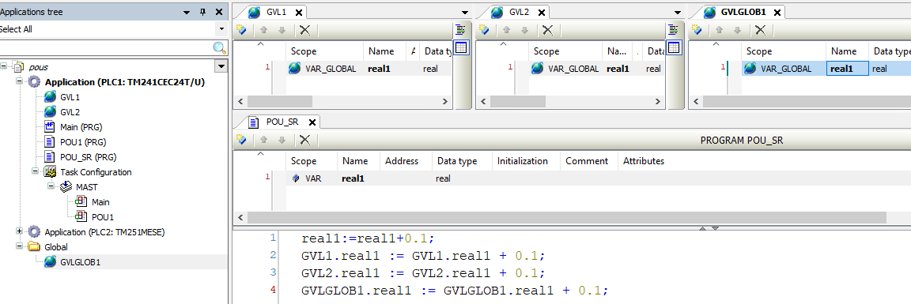
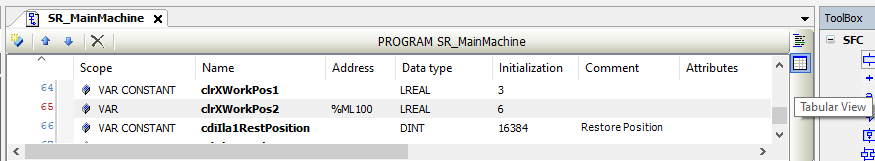
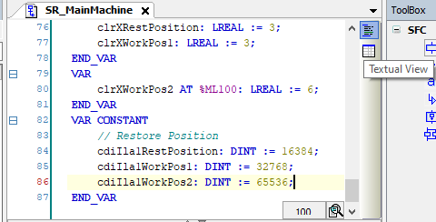
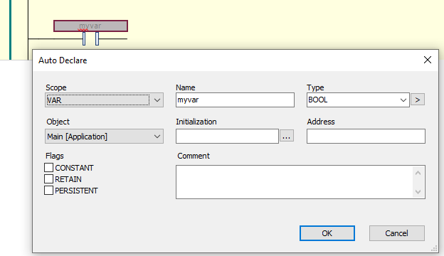
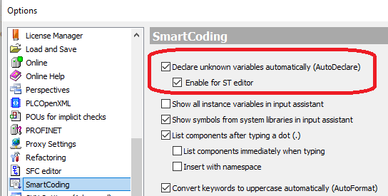
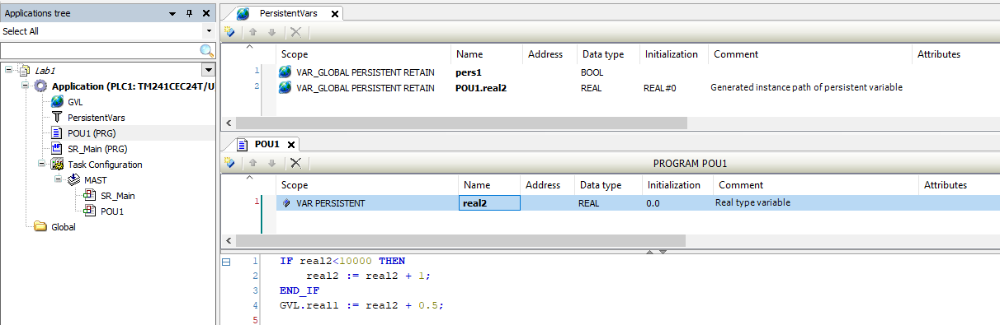
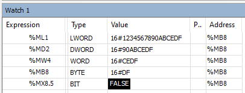

[<- До підрозділу](README.md)		[Коментувати](#feedback)

# Робота з даними в Machine Expert: теоретична частина

У даному розділі розглядаються тільки базові можливості роботи з даними без урахування можливостей об'єктно-орієнтованого програмування таких як, інтерфейси, методи, наслідування тощо.  

## Змінні

### Область видимості змінних

Змінні в Machine Expert використовуються для зберігання даних і обміну інформацією між частинами програми та апаратним рівнем. Вони поділяються на **локальні** та **глобальні** залежно від місця оголошення. Локальні змінні належать конкретному POU і не входять до глобальної області видимості. Доступ до них можливий лише в межах POU або через екземпляр цього POU за допомогою оператора крапки. Глобальні змінні оголошуються в одному з Global Variable Lists (GVL) і можуть бути доступні всьому проєкту або окремому застосунку, звертання до них проводиться через вказівки назви GVL та змінної в її межах. У разі однакових імен локальні змінні мають пріоритет над глобальними.

Для оголошення глобальних змінних використовуються списки глобальних змінних (**GVL**, Global Variable List), яких може бути кілька. Якщо GVL добавлені в застосунок, змінні будуть чинними лише в межах цього застосунку. Якщо GVL розміщено у вузлі Global дерева Applications, список зі змінними буде доступний для всього проєкту, тобто застосунків усіх PLC. Для редагування списку глобальних змінних використовуєтьсяя редактор GVL, який як і інші може мати табличний або текстовий вигляд (див. нижче).

Розглянемо область видимості на прикладі проєкту з двома PLC, що показано на рис.1. У застоcунку PLC1 є два GVL - `GVL1` і `GVL2`, кожен з який має оголошену одну змінну з назвою `real1` типу REAL. Програма `POU_SR` має також оголошену локальну змінну `real1`. Це різні змінні, при зверненні до них у `POU_SR` використовує означення області дії змінної. Так, до локальної змінної `real1` програма звертається просто по імені, тоді як при доступі до змінних GVL вказується спочатку ім'я GVL, а потім через крапку ім'я змінної в GVL.     



рис.1. Область дії GVL

Тепер розберемо GVL на глобальному рівні проєкту. Вузол `Global` у Applications tree містить об’єкти, спільні для всіх застосунків проєкту. У межах цього підрозділу це стосується таких об’єктів, як GVL та DUT. Якщо розмістити тут GVL, відповідний список змінних буде доступний для всіх застосунків проєкту. Під час використання його в конкретному застосунку змінні зі списку стають частиною застосунку того PLC, у якому вони були використані. Наприклад, на рис.1 звернення має вигляд `GVLGLOB1.real1`. 

Використання GVL, глобальних на рівні всього проєкту, дає можливість централізовано описувати спільні типи змінних, константи та інтерфейси даних, які можуть застосовуватися в різних застосунках без дублювання оголошень. Це спрощує супровід проєкту, зменшує ризик неузгодженостей у означеннях змінних та забезпечує єдину термінологію і структуру даних у межах усього проєкту. Водночас такі GVL не створюють спільного простору виконання між застосунками. Кожен застосунок використовує власні екземпляри змінних, а синхронізація або обмін значеннями між PLC, за потреби, мають реалізовуватися явно за допомогою мережних механізмів або спеціалізованих засобів обміну даними.

### Оголошення змінних

Локальні змінні оголошуються у області оголошень (Declaration Editor) програмних елементів POU. На рис.1 видно, що `POU_SR1` розділено на дві області - для оголошення змінних і для коду. Глобальні змінні оголошуються у редакторі GVL, у якого є тільки область оголошень. Те саме стосується редактору персистентних змінних, про які описано нижче.

У всіх редакторах оголошення можна робити як у табличному вигляді так у текстовому. Табличний вигляд простіший для новачків, має певні зручності щодо впорядкування за колонками (як в інших табличних редакторах), вибір опцій зі спадаючого меню, тощо. Однак текстовий вигляд має більше можливостей з точки зору означення змінних, зокрема щодо більш гнучкого задавання значень ініціалізації. Крім того, в текстовому вигляді простіше роботи копіпаст, що часто є важливим критерієм при розробці великих проєктів. Користувач може перемикатися між виглядами за допомогою відповідної кнопки в редакторі (`Tabular View` або `Textual View`), якщо такий вигляд доступний (рис.2). 

 

рис.2. Табличний та текстовий вигляд області оголошення одних і тих самих локальних змінних POU 

При оголошенні у табличному вигляді для змінних задаються поля (див. рис. 2):

- `Scope` - область дії змінної; 
- `Name` - назва змінної; 
- `Address` - прив’язка до конкретної адреси  (опціонально)
- `Data type` - тип даних змінної; 
- `Initialization` - значення ініціалізації змінної  (опціонально);
- `Comment` - коментар (опціонально); 
- `Attributes` - атрибути (опціонально);

Призначення цих полів детально розглянуті нижче в цьому підрозділі, типи даних розглядаються нижче в іншому підрозділі.

У текстовому вигляді синтаксис оголошення змінної має наступний вигляд:

```pascal
<Identifier> {AT <address>} : <data type> {:=<initialization>};
```

Частини у фігурних дужках `{}` є необов’язковими, аналаогічно як і в табличному вигляді. Для коментарю використовується синтаксис ST, тобто  `// однорядковий`  та `(* багаторядковий *)`.   Для текстового вигляду область дії змінних (`Scope`) , що оголошуються, задається обмеженням ключовими словами `VAR` і `END_VAR` , які охоплюють оголошення однієї або кількох змінних.  Наприклад:

```pascal
VAR PERSISTENT
	real2: REAL := 0.0; // Real type variable
END_VAR
VAR
	int1 AT %MW100: INT := 20; // Int var1
	bool1 AT %M0: BOOL := FALSE; // Bool var
END_VAR
```

Ключові слова області дії змінних можуть доповнюватися атрибутами, такими як `RETAIN`, `CONSTANT`, `PERSISTENT` наприклад  `VAR CONSTANT`. Таким чином можна для багатьох змінних в одному блоці задати спільний Scope.

Крім ручного оголошення змінних, редактори програм POU надють функції автоматизованого оголошення (Auto Declare) з переліку опцій розумного кодування (SmartCoding). Це значить, що коли користувач вписує в код назву змінної, якої не існує, редактор автоматично викликає вікно створення змінної, де можна означити усі необхідні властивості змінної (рис.3).  



рис.3. Вікно `Auto Declare` для створення змінної.

За замовченням ця опція увімкнута тільки для графічних редакторів, однак в меню `Tools -> Optinos -> SmartCoding` її можна увімкнути і для текстового редактору ST.



рис.4. Опції SmartCoding, що відповідають за автоматизоване об'явлення змінної 

### Область дії (Scope)

Область дії (Scope), яка також називається Variable Type (не плутати з типом даних змінної), вказує на те, де змінна є видимою та доступною, а також означує правила її використання і життєвий цикл у межах програми, функціонального блока або всього застосунку. Вище було означено, що в загальному усі змінні мають область видимості як глобальні або локальні. Однак локальні змінні мають додаткові налаштування щодо області дії, які означують звідки змінна доступна, як вона може змінюватися і т.п. Тому областей дій набагато більше. 

Область дії VAR_GLOBAL - це область глобальних змінних (global variables), які оголошуються тільки в конкретному глобальному списку змінних (GVL). Тобто тільки в GVL можна використовувати VAR_GLOBAL, в інших частинах проєкту не допускається їх оголошення. І навпаки, в GVL можна використовувати тільки область VAR_GLOBAL, це добре видно в табличному редакторі при виборі Scope (рис.5) 


рис.5. Означення області дії (Scope) в GVL

Для локальних змінних POU, які оголошуються у відповідній частині, варіантів Scope набагато більше (рис.6)  


рис.6. Означення області дії (Scope) в області оголошення змінної POU

Перелік можливих Scope залежить від типу POU, які детально розглядаються в [Програмні сутності POU в в Machine Expert: теоретична частина](../pou/teormachexpert.md). Нижче опишемо їх:

- VAR - це локальні змінні (local variables), які можна оголосити у POU будь якого типу. Поведінка змінних залежить від типу POU. Для функцій ці змінні приховані всередині (інкапсуляція), для програм і функціональних блоків доступні ззовні тільки для читання. Для функцій змінні ініціалізуються при кожному виклику, тоді як для функціональних блоків і ікземплярів вони зберігають свої значення між викликами, і ініціалізуються тільки під час першого виклику або інціалізації всього PLC. Для функцій поведінка VAR аналогічно VAR_TEMP у програмах та функціональних блоках.
- VAR_TEMP - тимчасові змінні (temporary variables), які ініціалізуються під час кожного виклику POU. Оголошення VAR_TEMP можливе лише в POU і функціональних блоках, і доступні тільки в тілі програмного POU або функціонального блока. VAR_TEMP також можна використовувати замість VAR для зменшення обсягу пам’яті, що використовується POU, наприклад усередині функціонального блока, якщо змінна застосовується лише тимчасово. У функціях VAR ведуть себе так само як VAR_TEMP у функціональних блоках та POU.
- VAR_STAT - статичні змінні (static variables) ведуть себе подібно до VAR, за винятком того що вони спільні для всіх екземплярів. Тобто зміна значення в будь якому екземплярі приводить до зміни в усіх інших. Їх можна застосовувати, наприклад, у функціональному блоці як лічильник кількості викликів. Вони доступні у функціональних блоках, методах і функціях.  
- VAR_INPUT - вхідні змінні (input variables) для POU
- VAR_OUTPUT - вихідні змінні (output variables) для POU
- VAR_IN_OUT - вхідні/вихідні змінні (input and output variables) для POU. Для змінних типу VAR_IN_OUT значення переданої змінної змінюється (передавання відбувається за посиланням, Call-by-Reference). Тому вхідним значенням для таких змінних не може бути константа або літерал. З цієї причини навіть змінні VAR_IN_OUT функціонального блока не можуть бути безпосередньо прочитані або змінені ззовні через `<FBinstance>.<InOutVariable>`. 
- VAR_IN_OUT CONSTANT - змінні пересилання (transfer variable), використовується як константний параметр, що передається за посиланням. `CONSTANT` - це додатковий атрибут, який розглянуто нижче. До такого параметра може передаватися змінна або константа (літерал) типу STRING або WSTRING. Параметр є лише для читання. Передавання властивостей не допускається.
- VAR_INST - екземплярні змінні (instance variables), які доступні тільки для методу. Змінна зберігається не у стеку методу, а у стеку екземпляра функціонального блока. Поводиться так само, як інші змінні екземпляра функціонального блока, і не ініціалізується повторно під час виклику методу.
- VAR_EXTERNAL - зовнішні змінні (external variables) глобальні змінні, які імпортуються в POU. Їх оголошують локально а також у глобальному списку змінних (GVL), і ці оголошення мають бути ідентичними. Якщо глобальна змінна не існує, буде виведено повідомлення. Оголошувати змінні як `external` не є обов’язковим. Ці ключові слова надані для забезпечення сумісності зі стандартом IEC 61131-3.

У табличному представлені області об'явлення змінної `scope` є однією з колонок, і для кожної змінної область дії вказується окремо. Для текстового представлення область дії оголошується для однієї або кількох змінних між ключовими словами  `<scope>` (наприклад `VAR_INPUT`) і `END_VAR`,    

VAR_CONFIG

### Атрибути збереження значень

Окрім оголошення області дії для змінної можна додати атрибути (див рис.5 та рис.6), які вказують можливість збереження змінної при вимкненому живленні (реманентність) та можливість її зміни з програми користувача:

- RETAIN - значення змінних зберігаються в енергонезалежній пам'яті; при перезавантаженні застосунку значення скидаються; 
- PERSISTENT - значення змінних зберігаються в енергонезалежній пам'яті навіть після перезавантаження застосунку; Reset origin
- CONSTANT - константи, доступні в програмі користувача тільки в режимі для читання

**Реманентність змінних** — це властивість змінних зберігати своє значення поза межами звичайного циклу виконання програми, зокрема після знеструмлення, перезапуску контролера або перезапуску застосунку, відповідно до заданого рівня збереження (RETAIN або PERSISTENT). Якщо змінна не є реманентною, її значення при старті або рестарті ПЛК ініціалізується вказаним значенням або значенням за замовченням для даного типу.

Поведінка ременентних змінних може відрізнятися для різних ПЛК, тому необхідно уточнити в документації до ПЛК.

**RETAIN** 

Змінні, оголошені як RETAIN в області оголошень POU або в глобальному списку змінних зберігаються в енергонезалежній (реманентній) пам’яті, після штатного або нештатного вимкнення контролера. Після перезапуску програми збережені значення використовуються далі. Змінні RETAIN повторно ініціалізуються в наступних випадках:

- під час виконання онлайн-команди `Reset origin`
- під час виконання онлайн-команди `Reset cold`
- в процесі повного завантаження застосунку в ПЛК

Зауважте, що локальні змінні, оголошені як VAR RETAIN у функціях, НЕ зберігаються в енергонезалежній пам’яті, тобто VAR RETAIN у функціях не має жодного ефекту. Для деяких моделей ПЛК, якщо хоча б одна змінна у функціональному блоці позначена як RETAIN, то екземпляр функціонального блока разом з його змінними зберігається в реманентній пам’яті. 

**PERSISTENT** 

Реманентні RETAIN змінні не зберігають значення при холодному старті і завантаженні застосунку в ПЛК. Якщо дійсно є така необхідність, треба використовувати **персистентні** змінні, тобто ті, які оголошуються з ключовим словом `PERSISTENT`. Ці змінні повторно ініціалізуються лише під час виконання онлайн-команди `Reset origin`. На відміну від RETAIN, змінні зберігають свої значення навіть після завантаження застосунку. Подібно до retain-змінних, персистентні змінні зберігаються в окремій області пам’яті.

Персистентні змінні є досить важливою можливістю, коли необхідно зберігати дані навіть після завантаження нового застосунку. Це можуть бути наприклад налаштування механізмів (типу час запуску, максимальний струм приводу, тощо), чи мотогодини. 

Персистентність змінних у Machine Expert забезпечується не лише атрибутом PERSISTENT, а й їх включенням до спеціального об’єкта `Persistent list` (списку персистентних змінних), прив’язаного до застосунку. Для одного застосунку може бути створено тільки один `Persistent list`. 

Змінна, оголошена з атрибутом PERSISTENT поза списку персистентних змінних, сама по собі не є персистентною і поводиться як retain-змінна. Тим не менше, шлях до цієї змінної відслідковується. Щоб така змінна стала справді персистентною, її шлях екземпляра має бути доданий до `Persistent list`. Це можна зробити вручну, або скористатися командою `Add all instance paths` з контекстним меню редактору списку персистнтних змінних. Лише ті змінні, які присутні в `Persistent list`, зберігають свої значення між перезапусками контролера і завантаженнями застосунку та повторно ініціалізуються виключно командою `Reset origin`. 

На рис.7 показано дві змінні в списку персистентних змінних у верхній частині вікна показано об’єкт `PersistentVars`, у якому означено дві персистентні змінні: одна оголошена безпосередньо в списку, інша створена через шлях екземпляра для змінної, оголошеної з атрибутом `VAR PERSISTENT` у програмі `POU1`. У нижній частині видно локальне оголошення змінної `real2` у програмі `POU1` з атрибутом `VAR PERSISTENT`, для якої система згенерувала відповідний `instance path` і додала його до списку персистентних змінних після відповідної команди. Таким чином, фактична персистентність змінної `real2` забезпечується саме її наявністю в списку `PersistentVars`, а не лише атрибутом `PERSISTENT` у `POU`.



рис.7. Персистентні змінні

Якщо персистентна змінна оголошена безпосередньо в списку `PersistentVars`, звернення до неї здійснюється як до глобальної змінної: `PersistentVars.<ім’я_змінної>`, наприклад `PersistentVars.pers1 := TRUE;`. Якщо ж у `PersistentVars` додано лише шлях екземпляра до змінної, оголошеної в іншому POU, звернення в коді виконується до цієї змінної за її звичайним ім’ям у відповідному контексті.

Під час кожного перезавантаження застосунку список персистентних змінних на контролері перевіряється на відповідність списку в проєкті. Список на контролері ідентифікується застосунком. У разі невідповідностей буде запропоновано повторно ініціалізувати всі персистентні змінні застосунку. Невідповідність може виникати внаслідок перейменування, видалення або інших змін наявних оголошень у списку. Уважно зважуйте будь-які зміни в області оголошень списку персистентних змінних і їхні наслідки щодо повторної ініціалізації. Нові оголошення можна додавати лише в кінець списку. Під час завантаження вони розпізнаються як нові й не вимагатимуть повторної ініціалізації всього списку. Якщо змінити ім’я або тип даних змінної, це розглядається як нове оголошення і призводить до повторної ініціалізації змінної під час наступної онлайн-зміни або завантаження.

Примітки. Не можна використовувати оголошення `AT` у поєднанні з VAR PERSISTENT. Якщо хоча б одна змінна у функціональному блоці позначена як PERSISTENT, то екземпляр функціонального блока разом з його змінними зберігається в реманентній пам’яті, але лише ця одна змінна обробляється як персистентна. Оголошення `VAR PERSISTENT` інтерпретується так само, як `VAR PERSISTENT RETAIN` або `VAR RETAIN PERSISTENT`.

Забезпечення персистентності в PLC здійснюється за такими процедурами:

- визначення циклічних задач, які звертаються до змінної
- копіювання змінної до персистентного глобального списку змінних наприкінці першої циклічної задачі (у кожному циклі)
- копіювання значення персистентної змінної до звичайної змінної під час перезапуску контролера

У випадку, коли персистентна змінна оголошена поза списком PersistentVars (у POU або в іншому GVL) і підключена до Persistent list через шлях екземпляра, пам’ять для неї виділяється двічі: окремо для робочої змінної та для її персистентної копії. Це призводить до додаткових операцій копіювання в кожному циклі і може збільшувати час оброблення, особливо для великих або структурованих значень.

**CONSTANT**

Константи ідентифікуються ключовим словом CONSTANT. Їх можна оголошувати локально (в програмному об’єкті POU) або глобально (у GVL). Доступ до константних змінних у реалізаційній частині POU можливий лише для читання.

Синтаксис

```pascal
<scope> CONSTANT 
	<identifier>:<type> := <initialization>;
END_VAR
```

де `<scope>` може бути   `VAR`,  `VAR_INPUT`,  `VAR_STAT`  або `VAR_GLOBAL`

Під час оголошення константної змінної обов’язково задавати початкове значення. Приклад:

```pascal
VAR CONSTANT
	c_iCon1 : INT := 12; (* 1. Constant *)
END_VAR
```

### Назва змінної

Назва змінної формуються за правилами:

- пробіли та спеціальні символи не допускаються; 
- регістр літер не враховується: `VAR1`, `Var1` і `var1` вважаються однією і тією ж змінною; 
- символ підкреслення враховується: `A_BCD` і `AB_CD` вважаються різними ідентифікаторами; не використовуйте більше одного символу підкреслення поспіль;
- довжина не обмежена;
- не дозволяється використовувати імена ключових слів, наприклад `VAR_GLOBAL`
- допускається багаторазове використання. 

Багаторазове використання одного і того ж імені змінної в застосунку доступне в різних областях видимості. Якщо ідентифікатори на глобальному та локальному рівні співпадають, то пріоритет мають локальні змінні, тобто саме до них буде відбуватися звернення. Якщо необхідно звернути саме до глобального імені, наприклад вказати GVL, треба використовувати шлях до екземпляра, що починається з крапки (`.`).  

У Machine Expert для іменування змінних у застосунках і бібліотеках, наскільки це можливо, рекомендується дотримуватися угорської нотації (Hungarian notation), яка описана у відповідному підрозділі [Підходи до найменування сутностей в програмах PLC](teornaming.md).

### Пам'ять та адреси

Змінні розміщуються в оперативній пам'яті, і користувачу не потрібно заздалегідь вказувати місце розміщення. Однак у ряді випадків виникає потреба означити місце розташування змінної, зазначивши адресу, зокрема:

- означення каналів входів/виходів PLC, з якими буде асоціюватися змінна
- доступу до змінних зі сторони мережі по протоколу Modbus 

У цьому випадку, при означенні змінної треба вказати адресу комірок пам'яті, до якої вона буде прив'язана. Ці комірки не є прямим зміщенням в області оперативної пам'яті, а скоріше умовним вказівником. 

Синтаксис вказівки на комірку пам'яті:

```pascal
%<area><size><number|.number|.number....>
```

При задаванні адреси пам'яті вказується наступна інформація:

- `%` - ідентифікатор адреси згідно IEC 61131-3
- `<area>` - область пам’яті: 
  - `I` — входи (фізичні входи через драйвер входів, датчики);
  - `Q` — виходи (фізичні виходи через драйвер виходів, виконавчі механізми);
  - `M` — область пам’яті;

- `<size>` - формат пам’яті (розмір):
  - `X` — один біт, якщо ;
  - `B` — байт (8 біт);
  - `W` — слово (16 біт);
  - `D` — подвійне слово (32 біти).
  - `L` - 64-бітне слово (тільки для CPU що підтримують), наприклад  `%ML<n>`;  використовується для 64-бітних типів даних (LREAL, LINT). не описана в офіційній документації.

- `<number|.number|.number....>`-  зсув у межах області пам’яті, у вигляді цілого  числа, а у випадку бітової адреси після нього вказується крапка та номер позиції біта.

Приклади:

- `%QX7.5` - вихідний біт 7.5
- `%Q7.5` -  вихідний біт 7.5
- `%IW215` - вхідне слово 215
- `%QB7` - вихідний байт 7
- `%MD48` - 48-ме подвійне слово у внутрішній області пам’яті
- `%ML1`  - перше 64-бітне слово у внутрішній області пам’яті
- `ivar AT %IW0 : WORD;` - приклад оголошення змінної з прив’язкою до адреси

Розмір пам’яті для вхідних, вихідних даних і області пам'яті (оголошення з `AT` `%I`, `%Q` та `%M`) наперед означений внутрішньою архітектурою цільового пристрою, для деяких пристроїв може бути змінений у властивостях об’єкта Application. Пристрої використовують один з двох режимів адресації: по байтам або по словам, наприклад:

- по байтам  `ADR(%IW1) = ADR(%IB1)`
- по словам `ADR(%IW1) = ADR(%IB2)`

Специфіку перекривання адрес варто уточнювати в документації на PLC. Наприклад для PLC M241 та M251 перекривання адрес матиме вигляд, як показано в таблиці 1.

Таблиця 1. Перекривання адрес для M241 та M251 

| Long words <br />(64-bit) | Double Words | Words | Bytes | Bits    | …    | Bits    |
| ------------------------- | ------------ | ----- | ----- | ------- | ---- | ------- |
| %ML0                      | %MD0         | %MW0  | %MB0  | %MX0.7  | …    | %MX0.0  |
|                           |              |       | %MB1  | %MX1.7  | …    | %MX1.0  |
|                           |              | %MW1  | %MB2  | %MX2.7  | …    | %MX2.0  |
|                           |              |       | %MB3  | %MX3.7  | …    | %MX3.0  |
|                           | %MD1         | %MW2  | %MB4  | %MX4.7  | …    | %MX4.0  |
|                           |              |       | %MB5  | %MX5.7  | …    | %MX5.0  |
|                           |              | %MW3  | %MB6  | %MX6.7  | …    | %MX6.0  |
|                           |              |       | %MB7  | %MX7.7  | …    | %MX7.0  |
| %ML1                      | %MD2         | %MW4  | %MB8  | %MX8.7  | …    | %MX8.0  |
|                           |              |       | %MB9  | %MX9.7  | …    | %MX9.0  |
|                           |              | %MW5  | %MB10 | %MX10.7 | …    | %MX10.0 |
|                           |              |       | %MB11 | %MX11.7 | …    | %MX11.0 |
|                           | %MD3         | %MW6  | %MB12 | %MX12.7 | …    | %MX12.0 |
|                           |              |       | %MB13 | %MX13.7 | …    | %MX13.0 |
|                           |              | %MW7  | %MB14 | %MX14.7 | …    | %MX14.0 |
|                           |              |       | %MB15 | %MX15.7 | …    | %MX15.0 |
| …                         | …            | …     | …     | …       | …    | …       |

Перекривання пам'яті та побітову адресацію легко перевірити у режимі налагодження. Для цього можна ввести адреси з різними типами, які перекриваються (рис.8). Зверніть увагу, що поле `Address` вказує на байтове розміщення в області пам'яті.    




рис.8. Відображення адрес що перекриваються в різному форматі BIN та HEX 

## Типи даних та літерали

Machine Expert підтримує всі типи даних, описані стандартом IEC 61131-3. Крім того, підтримуються деякі типи даних, що розширюють стандарт (див. нижче), і можна означити власні користувацькі типи даних.

- булеві
- цілочислові типи
- типи з рухомою комою
- текстові
- дати та часу 
- типи ANY 

### Літерали

**Літерали** — це безпосередньо введені "жорстко закодовані" постійні значення або рядки, які можна вводити безпосередньо в код. Стандарт IEC 61131-3 описує різні літеральні типи відповідно до основних типів даних. У офіційній документації до Machine Expert замість слово "літерал" вживається слово "константа". Надалі ми будемо розділяти ці поняття, так як в цьому посібнику під константою розуміється поіменована незмінна область пам'яті, яка в офіційній документації називається змінною типу "Constant".

Літерали записуються з урахуванням їх типів даних. Ось приклади літералів: `-15`, `-15.5`, `−1.55e+1`, `'text'`, `"w text"`, `t#1m10s`, `DATE#1996-05-06`.

Наступний приклад присвоює змінній `a` значення `-15.5`:

```
a := -15.5;
```

Враховуючи що синтаксис літерів однаковий для типів з різними об'ємами пам'яті, у ряді випадків треба уточнити тип, для чого використовуються типізовані літерали з наступним синатксисом.

```pascal
<Type>#<Literal>
```

Тип слід записувати великими літерами. `<Literal>` задає літерал. Введене значення має відповідати діапазону типу даних, зазначеного в `<Type>`.

Наприклад запис `var1:=DINT#34;` каже що літерал передбачає інтерпретації як `DINT` хоч числове значення поміститься як в SINT так і в USINT. 

Надалі в лекції розглядаються типи разом з літералами, які вживаються для даних типів. 

### Булеві типи

#### BOOL

Змінні типу BOOL можуть мати значення TRUE (1) і FALSE (0). Для них резервується 8 біт пам’яті. 

#### BIT

BIT - це додатковий тип даних, розширення до стандарту IEC 61131-3.  Тип даних BIT можна використовувати лише для окремих змінних у складі структур або у функціональному блоці. Можливі значення — TRUE (1) і FALSE (0). 

Елемент типу BIT споживає 1 біт пам’яті та дозволяє адресувати окремі біти структури за іменем. Елементи BIT, оголошені послідовно, об’єднуються в байти. На відміну від типу BOOL, для якого у будь-якому разі резервується 8 біт, використання пам’яті може бути оптимізоване. Водночас доступ до окремих бітів однозначно потребує більше часу. Тому тип даних BIT доцільно використовувати тоді, коли потрібно зберігати кілька булевих ознак у компактному форматі.

### Цілочислові типи 

Нижче подана таблиця для цілочислових типів даних. 

Таблиця 2. Цілочислові типи даних 

| Тип даних | Нижня межа     | Верхня межа   | Обсяг пам’яті |
| --------- | -------------- | ------------- | ------------- |
| BYTE      | 0              | 255           | 8 біт         |
| WORD      | 0              | 65 535        | 16 біт        |
| DWORD     | 0              | 4 294 967 295 | 32 біти       |
| LWORD     | 0              | 2^64 − 1      | 64 біти       |
| SINT      | −128           | 127           | 8 біт         |
| USINT     | 0              | 255           | 8 біт         |
| INT       | −32 768        | 32 767        | 16 біт        |
| UINT      | 0              | 65 535        | 16 біт        |
| DINT      | −2 147 483 648 | 2 147 483 647 | 32 біти       |
| UDINT     | 0              | 4 294 967 295 | 32 біти       |
| LINT      | −2^63          | 2^63 − 1      | 64 біти       |
| ULINT     | 0              | 2^64 − 1      | 64 біти       |

Числові значення в літералах можуть задаватися у двійковому, вісімковому, десятковому та шістнадцятковому форматах. Цілочисельні значення, які не є десятковими, подаються у вигляді основи системи числення, за якою слідує знак решітки (`#`), перед цілою константою. У числових значеннях дозволяється використовувати символ підкреслення (`_`) для підвищення читабельності.

Приклади літералів для цілих типів:

- `14` - десяткове число
- `2#1001_0011` - двійкове число
- `8#67` - вісімкове число
- `16#A` - шістнадцяткове число

Неявні перетворення з більших типів змінних на менші не дозволяються. Тому змінну типу DINT не можна просто використовувати як змінну типу INT. Для цього слід застосовувати функції перетворення типів.

### Типи з рухомою комою

Типи з рухомою комою представлені REAL і LREAL.

Таб.3. Типи з рухомою комою 

| Тип даних | Нижня межа               | Верхня межа             | Обсяг пам’яті |
| --------- | ------------------------ | ----------------------- | ------------- |
| REAL      | −3.402823e+38            | 3.402823e+38            | 32 біти       |
| LREAL     | −1.7976931348623158e+308 | 1.7976931348623158e+308 | 64 біти       |

Підтримка типу даних LREAL залежить від цільового пристрою. Дивіться у відповідній документації, чи перетворюється 64-бітний тип LREAL під час компіляції на REAL (можливо з втратою інформації), чи зберігається без змін.

Якщо REAL або LREAL перетворюється на SINT, USINT, INT, UINT, DINT, UDINT, LINT або ULINT і значення дійсного числа виходить за межі допустимого діапазону цього цілочисельного типу, результат буде невизначеним і залежатиме від цільової системи. У цьому випадку також можливе виникнення винятку. Щоб отримати код, незалежний від цільової платформи, перевищення діапазону має оброблятися на рівні застосунку. Якщо значення REAL або LREAL знаходиться в межах допустимого діапазону цілочисельного типу, перетворення виконуватиметься однаково на всіх системах.

Літерали REAL і LREAL можуть задаватися у вигляді десяткових дробів і в експоненційному поданні. Як десятковий роздільник слід використовувати крапку відповідно до Міжнародної системи одиниць (SI).

Таб.4. Літерали для типів з рухомою комою

| Літерал     | Пояснення                                                    |
| ----------- | ------------------------------------------------------------ |
| `7.4`       | Не використовуйте `7,4`, оскільки кома призведе до помилки компіляції. |
| `1/3.0`     | Десятковий дріб для `0.33333334`. У разі ділення цілочисельних типів результат залишається цілочисельним, значення округлюється. Наприклад, `1/3` дає результат 0. |
| `1.64e+009` | Не використовуйте `1,64e+009` для експоненційного запису, оскільки кома призведе до помилки компіляції. |

### Текстові (рядкові) типи

Текстові типи представлені STRING та WSTRING. 

Змінна типу даних STRING може містити будь-який рядок символів. Параметр розміру в оголошенні визначає обсяг пам’яті, який буде зарезервовано для змінної. Він задає кількість символів у рядку та може вказуватися в круглих або квадратних дужках. Якщо розмір не задано, використовується типовий розмір 80 символів. Загалом довжина рядка не обмежена. Однак рядкові функції можуть обробляти лише рядки довжиною 1…255 символів. Якщо змінна ініціалізується рядком, який перевищує допустиму довжину для цього типу даних, рядок відповідно обрізається справа наліво.

Обсяг пам’яті, необхідний для змінної типу STRING, становить 1 байт на кожен символ плюс 1 додатковий байт в кінці. Тобто оголошення `STRING[80]` потребує 81 байт пам’яті. 

Рядковий літерал є довільною послідовністю символів. Літерали STRING беруться в одинарні лапки. Приклад оголошення рядка довжиною 35 символів:

```pascal
str : STRING(35) := 'This is a String';
```

Тип даних WSTRING відрізняється від типу STRING (ASCII) тим, що інтерпретується у форматі Unicode та потребує два байти (WORD) на кожен символ і два додаткові байти пам’яті (у випадку STRING — лише по одному байту). Бібліотека `standard64.lib` надає функції для роботи з рядками типу WSTRING. 

Кількість символів у WSTRING залежить від вмісту рядка. Розмір 10 для WSTRING означає, що довжина WSTRING може займати максимум 10 WORD. Для деяких символів Unicode для кодування одного символу може знадобитися кілька WORD, тому кількість символів не обов’язково відповідає довжині WSTRING (у цьому випадку 10). Тип даних потребує один додатковий WORD пам’яті, оскільки рядок завершується нульовим символом 0. Якщо розмір не задано, виділяється 80 WORD плюс один WORD для завершального символу 0. 

Літерали WSTRING беруться у подвійні лапки.  Приклади:

```pascal
wstr : WSTRING := "This is a WString";
wstr10 : WSTRING(10) := "1234567890";
```

Для усіх текстових типів символи кодуються відповідно до набору символів, означеного стандартом ISO/IEC 8859-1. Дозволяється також вводити пробіли та спеціальні символи (спеціальні символи різних мов, наприклад, діакритичні знаки або умлаути).

У рядках комбінація знака долара (`$`), за яким слідують два шістнадцяткові числа, інтерпретується як шістнадцятковий код відповідно до кодування ISO/IEC 8859-1. Цей код відповідає ASCII-коду. Крім того, слід враховувати спеціальні випадки, наведені в таблиці.

Таб.5. Літерали для текстових типів

| Рядок із кодом $  | Інтерпретація                                                |
| ----------------- | ------------------------------------------------------------ |
| `'$<8-bit code>'` | 8-бітний код: двозначне шістнадцяткове число, яке інтерпретується відповідно до ISO/IEC 8859-1. |
| `'$41'`           | A                                                            |
| `'$9A'`           | ©                                                            |
| `'$40'`           | @                                                            |
| `'$0D'`           | Керувальний символ: розрив рядка (відповідає `$R`)           |
| `'$0A'`           | Керувальний символ: новий рядок (відповідає `$L` і `$N`)     |
| `'$L'`, `'$l'`    | Керувальний символ: переведення рядка (відповідає `$0A`)     |
| `'$N'`, `'$n'`    | Керувальний символ: новий рядок (відповідає `$0A`)           |
| `'$P'`, `'$p'`    | Керувальний символ: подача сторінки (form feed)              |
| `'$R'`, `'$r'`    | Керувальний символ: розрив рядка (відповідає `$0D`)          |
| `'$T'`, `'$t'`    | Керувальний символ: табуляція                                |
| `'$$'`            | Символ долара `$`                                            |
| `'$''`            | Одинарна пряма лапка `'`                                     |

### Типи даних дати і часу

Machine Expert надає можливість працювати з різними типами даних дати та часу. Типи TIME, TIME_OF_DAY (скорочено TOD), DATE та DATE_AND_TIME (скорочено DT) внутрішньо обробляються як DWORD, тобто для них виділяється подвійне слово. Типи даних LDATE, LDATE_AND_TIME (LDT) та LTIME_OF_DAY (LTOD) внутрішньо обробляються як LWORD. 

Час у типах TIME і TOD задається в мілісекундах. Відлік часу в TOD починається з 12:00 A.M. Час у типах DATE і DT задається в секундах, починаючи з 1 січня 1970 року о 12:00 A.M.

#### TIME/LTIME 

Типи даних TIME означує час, має розмір 32 біти та роздільну здатність у мілісекундах, як це означено стандартом IEC 61131-3. 

Час можна задати як літерал формату 

```pascal
t#<опис часу>
```

Замість `t#` також можна використовувати такі варіанти: `T#`, `time#`, `TIME#`

Опис часу може містити наступні одиниці часу, які мають використовуватися в наведеній послідовності, але не обов’язково всі:

- `D` або `d`: дні
- `H` або  `h`: години
- `M` або  `m`: хвилини
- `S` або  `s`: секунди
- `MS` або  `ms`: мілісекунди

Таб.6. Приклади коректних констант TIME у присвоєнні мовою ST

| Приклад літералу        | Пояснення                                                    |
| ----------------------- | ------------------------------------------------------------ |
| `TIME1 := T#14ms;`      | –                                                            |
| `TIME1 := T#100s12ms;`  | Найстарша складова може перевищувати свій граничний діапазон |
| `TIME1 := T#12h34m15s;` | –                                                            |

Таб.7. Приклади некоректних констант TIME у присвоєнні мовою ST

| Приклад літералу     | Пояснення                          |
| -------------------- | ---------------------------------- |
| `TIME1 := t#5m68s;`  | Перевищено межу молодшої складової |
| `TIME1 := 15ms;`     | Відсутній префікс `T#`             |
| `TIME1 := t#4ms13d;` | Неправильний порядок складових     |

Додатково, як розширення стандарту, підтримується LTIME, який використовується як часова база для таймерів з високою роздільною здатністю. LTIME має розмір 64 біти та забезпечує роздільну здатність у наносекундах. Синтаксис літералу LTIME:

```pascal
LTIME#<опис часу>
```

Опис часу може містити одиниці часу, що використовуються для літералу типу TIME, а також:

- `us` : мікросекунди
- `ns` : наносекунди

Приклад літералів LTIME:

```pascal
LTIME1 := LTIME#1000d15h23m12s34ms2us44ns;
LTIME1 := LTIME#3445343m3424732874823ns;
```

#### DATE/LDATE 

Ці типи використовуються для зберігання дати. Час у типах DATE зберігається в секундах, починаючи з 1 січня 1970 року о 12:00 A.M.

Значення DATE внутрішньо обробляються як значення типу DWORD і містять часовий інтервал у секундах від `01.01.1970, 00:00`, з верхньою межею `DATE#2106-2-7`.

Синтаксис задання дати літералом:

```pascal
d#<опис дати>
```

Замість `d#` також можна використовувати: `D#`, `date#`, `DATE#`

Опис дати задається у форматі:

```pascal
<ключове слово дати>#<рік>-<місяць>-<день>.
```

Приклади

```pascal
DATE#1996-05-06
d#1972-03-29
```

Значення LDATE внутрішньо обробляються як значення типу LWORD і містять часовий інтервал у секундах від `01.01.1970, 00:00`, з верхньою межею `DATE#2554-7-21`. Використання літералів аналогічне DATE, тільки попереду добавляється `l`. Приклади

```pascal
LDATE#2018-8-8
LD#1996-05-06
```

#### DATE_AND_TIME (DT/LDT)

Ці типи використовуються для зберігання дати та часу.  Значення DATE_AND_TIME внутрішньо обробляються як значення типу DWORD і містять часовий інтервал у секундах від 01.01.1970, 00:00, до 7 лютого 2106 року 06:28:15.

Синтаксис літералу

```pascal
dt#<опис дати і часу>
```

Замість `dt#` також можна використовувати: `DT#`, `date_and_time#`, `DATE_AND_TIME#`

Опис дати і часу задається у форматі

```pascal
<рік-місяць-день-година:хвилина:секунда>
```

Секунди можна задавати як дійсні числа, що дозволяє вказувати дробові частини секунди.

Приклади

```pascal
DATE_AND_TIME#1996-05-06-15:36:30
dt#1972-03-29-00:00:00
```

Використовуйте константу LDATE_AND_TIME (LDT) для задання 64-бітних значень дати і часу. Значення LDATE_AND_TIME внутрішньо обробляються як значення типу LWORD і містять часовий інтервал у секундах від 01.01.1970, 00:00, до 21 липня 2554 року 23:59:59.99999999. Використання літералів аналогічне як DATE_AND_TIME тільки попереду добавляється `l`. Приклад:

```pascal
LDATE_AND_TIME#1996-05-06-15:36:30
ldt#1972-03-29-00:00:00
LDT#2018-08-08-13:33:20.5
```

#### TIME_OF_DAY (TOD/LTOD)

Ці типи використовуються для зберігання часу доби. Значення TIME_OF_DAY внутрішньо обробляються як значення типу DWORD і містять часовий інтервал у мілісекундах від 00:00.

Синтаксис літералу:

```pascal
tod#<опис часу>
```

Замість `tod#` також можна використовувати: `TOD#`, `time_of_day#`, `TIME_OF_DAY#`

Опис часу задається у форматі

```pascal
<година:хвилина:секунда>
```

Секунди можна задавати як дійсні числа, що дозволяє вказувати дробові частини секунди. Приклади

```pascal
TIME_OF_DAY#15:36:30.123
tod#00:00:00
```

Для зберігання часу доби у 64-бітному форматі використовується LTIME_OF_DAY, який внутрішньо обробляються як значення типу LWORD і містять часовий інтервал у наносекундах від 00:00. Використання літералів аналогічне як TIME_OF_DAYS тільки попереду добавляється `l`. Приклад:

```pascal
LTIME_OF_DAY#15:36:30.123456789
ltod#00:00:00
```

#### Типи ANY/`ANY_<type>`

Вхідні параметри функцій (VAR_INPUT) можна означити з узагальненим типом даних IEC (ANY або `ANY_<type>`). У цьому випадкутип даних параметра виклику не є однозначно означеним. До такої функції можуть передаватися змінні різних типів даних. Передане значення та його тип можна отримати всередині функції за допомогою попередньо означеної структури.

Узагальнені типи даних IEC, які дозволяють використовувати елементарні типи даних для вхідних параметрів функцій:

Таб.8. Ієрархія узагальнених типів даних ANY

| ANY  | `ANY_`     | Похідний `ANY_` | Елементарні типи даних                                       |
| ---- | ---------- | --------------- | ------------------------------------------------------------ |
| ANY  | ANY_BIT    | –               | BYTE, WORD, DWORD, LWORD                                     |
| ANY  | ANY_DATE   | –               | DATE_AND_TIME, DATE, TIME_OF_DAY, LDATE_AND_TIME, LDATE, LTIME_OF_DAY |
| ANY  | ANY_NUM    | ANY_REAL        | REAL, LREAL                                                  |
| ANY  | ANY_NUM    | ANY_INT         | USINT, UINT, UDINT, ULINT; SINT, INT, DINT, LINT             |
| ANY  | ANY_STRING | –               | STRING, WSTRING                                              |

### Посилання та вказівники

#### References

Цей тип даних доступний як розширення стандарту IEC 61131-3. 

Посилання зберігає адресу об’єкта (змінної), який розташований в іншому місці пам’яті; у цьому сенсі його поведінка ідентична вказівнику (Pointers). На відміну від вказівника, змінна типу REFERENCE з погляду синтаксису поводиться як об’єкт. Крім того, змінні, оголошені як REFERENCE, мають такі переваги порівняно з POINTER:

- Посилання не потрібно явно розіменовувати (за допомогою `^`) для доступу до вмісту об’єкта, на який воно вказує.
- Під час передавання значень у вхідні параметри функцій, функціональних блоків або методів діє таке правило: якщо вхід оголошено як `REFERENCE TO <тип даних>`, можна передати змінну відповідного `<типу даних>` (`refInput := variable` замість `ptrInput := ADR(variable)`).
- Компілятор перевіряє, що між собою присвоюються посилання одного й того самого типу даних.

Також можна використовувати неявну функцію контролю вказівників. 

Синтаксис об'явлення змінної типу:

```
<ідентифікатор> : REFERENCE TO <тип даних>
```

Приклад оголошення

```pascal
A : REFERENCE TO DUT;
B : DUT;
C : DUT;

A REF= B;   // відповідає A := ADR(B);
A := C;     // відповідає A^ := C;
```

Неможливо оголошувати посилання виду `REFERENCE TO REFERENCE`, `ARRAY OF REFERENCE` або `POINTER TO REFERENCE`.

Для перевірки того, чи вказує посилання на коректне значення, відмінне від 0, можна використовувати оператор `__ISVALIDREF`. Синтаксис

```
<Boolean-змінна> := __ISVALIDREF(<ім’я посилання>);
```

`<ім’я посилання>` — ідентифікатор, оголошений з типом `REFERENCE TO <тип даних>`.

Булева змінна має значення TRUE, якщо посилання вказує на коректне значення. В іншому випадку — FALSE. Оголошення

```pascal
ivar : INT;
ref_int : REFERENCE TO INT;
ref_int0 : REFERENCE TO INT;
testref : BOOL := FALSE;
```

Реалізація

```pascal
ivar := ivar + 1;
ref_int REF= ivar;
ref_int0 REF= 0;

testref := __ISVALIDREF(ref_int);   (* TRUE, оскільки ref_int вказує на ivar, який не дорівнює 0 *)
testref := __ISVALIDREF(ref_int0);  (* FALSE, оскільки ref_int0 встановлено в 0 *)
```

#### Pointers

Як розширення стандарту IEC 61131-3 можна використовувати вказівники.

Вказівники зберігають адреси під час виконання прикладної програми. Вказівник може вказувати на змінну будь-якого типу даних або на екземпляр функціонального блока. Можливість використання неявної функції контролю вказівників описана в розділі CheckPointer function.

Синтаксис оголошення вказівника

```pascal
<ідентифікатор> : POINTER TO <тип даних>;
```

Розіменування вказівника означає отримання значення, яке наразі зберігається за адресою, на яку він вказує. Розіменувати вказівник можна, додавши оператор доступу до вмісту `^` (ASCII caret або circumflex) після ідентифікатора вказівника.  Для присвоєння адреси змінної вказівнику можна використовувати оператор адреси ADR.

Вказівники, що вказують на вхід I/O, потребують доступу на запис. Це призводить під час генерації коду до повідомлення компілятора "`<ім’я вказівника>` не є коректною ціллю присвоєння" .

```pascal
pwInput := ADR(wInput);
```

Щоб уникнути виявлення такої помилки компілятором, скопіюйте значення входу (`wInput`) у змінну, яка має доступ на запис.

```pascal
VAR
	pt : POINTER TO INT;  (* оголошення вказівника pt *)
	var_int1 : INT := 5;  (* оголошення змінних var_int1 і var_int2 *)
	var_int2 : INT;
END_VAR

pt := ADR(var_int1);      (* адреса змінної var_int1 присвоюється вказівнику pt *)
var_int2 := pt^;          (* значення 5 змінної var_int1 присвоюється var_int2 через розіменування вказівника pt *)
```


## Користувацькі типи даних 

### Означення користувацьких типів

Крім стандартних типів даних, у межах проєкту можна означувати спеціальні типи даних. Їх можна означити шляхом створення об’єктів DUT (Data Unit Type) у дереві POUs або Devices tree, а також безпосередньо в області оголошення POU.

Підтримуються такі користувацькі типи даних:

- масиви (arrays)
- структури (structures)
- перелічувані типи (enumerations)
- піддіапазонні типи (subrange types)

### DUT (Data Type Unit)

DUT (Data Type Unit) — це користувацький тип даних, означений у проєкті, який дозволяє описувати власні структури даних (structures), перелічувальні типи (enumeration), псевдоніми типів (Alias) або об’єднання (Union) та використовувати їх як повноцінні типи даних у змінних, інтерфейсах і функціональних блоках.

DUT додається в дереві Applications для конкретного PLC або в Global. Синтаксис оголошення DUT

```
TYPE <identifier> : <оголошення компонентів DUT>
END_TYPE
```

Оголошення компонентів DUT залежить від типу DUT, наприклад, структура або перелічувальний тип.

### Масиви (arrays)

Масив — це сукупність елементів даних одного й того самого типу даних. Підтримуються одно- та багатовимірні масиви фіксованої або змінної довжини. Масиви можна означувати як в області оголошення POU, так і в глобальних списках змінних. Також можна використовувати неявні перевірки меж.

Тип даних ARRAY зі змінною довжиною може оголошуватися лише для змінних VAR_IN_OUT у функціональних блоках, методах і функціях. Для отримання нижньої та верхньої меж масиву використовуйте оператори `LOWER_BOUND(<ім’я масиву>)` і `UPPER_BOUND(<ім’я масиву>)`.

Синтаксис оголошення масиву з означеною довжиною

```pascal
<Ім’я_масиву> : ARRAY [<ll1>..<ul1>, <ll2>..<ul2>, .., <lln>..<uln>] OF <тип елемента>
```

- `ll1`, `ll2` ... `lln` означують нижню межу діапазону
- `ul1`, `ul2` ... `uln` означують верхню межу діапазону.

Значення меж мають бути цілочисельного типу. Приклад оголошення масиву з означеною довжиною

```pascal
Card_game : ARRAY [1..13, 1..4] OF INT;
```

Доступ до елементів здійснюється шляхом вказівки індексу елементу, у відповідній розмірності. Наприклад, у двовимірному масиві :

```pascal
<ім’я масиву>[Index1, Index2]
```

Приклад:

```pascal
Card_game[9,2]
```

Можна оголошувати масив зі змінною довжиною, для цього використовується наступний синтаксис:

```pascal
<Ім’я_масиву> : ARRAY[* ( , * )+ ] OF <тип даних>; // (...)+ : одна або більше додаткових розмірностей
```

Приклад оголошення масиву зі змінною довжиною

```pascal
FUNCTION SUM : INT;   // Одновимірні масиви змінної довжини
                      // можуть передаватися в цю функцію додавання.
VAR_IN_OUT
	A : ARRAY [*] OF INT;
END_VAR
VAR
	i, sum2 : DINT;
END_VAR

sum2 := 0;
FOR i := LOWER_BOUND(A, 1) TO UPPER_BOUND(A, 1) DO   // Означується довжина відповідного масиву.
    sum2 := sum2 + A[i];
END_FOR;
SUM := sum2;
```

Приклад повної ініціалізації масиву

```pascal
arr1 : ARRAY [1..5] OF INT := [1,2,3,4,5];
arr2 : ARRAY [1..2,3..4] OF INT := [1,3(7)];   			(* скорочено для 1,7,7,7 *)
arr3 : ARRAY [1..2,2..3,3..4] OF INT := [2(0),4(4),2,3]; (* скорочено для 0,0,4,4,4,4,2,3 *)
```

Означення структури і масиву структур

```pascal
TYPE STRUCT1
	STRUCT
        p1 : INT;
        p2 : INT;
        p3 : DWORD;
	END_STRUCT
END_TYPE
ARRAY [1..3] OF STRUCT1 :=
    [
     (p1 := 1,  p2 := 10, p3 := 4723),
     (p1 := 2,  p2 := 0,  p3 := 299),
     (p1 := 14, p2 := 5,  p3 := 112)
    ];
```

Приклад часткової ініціалізації масиву

```pascal
arr1 : ARRAY [1..10] OF INT := [1,2];
```

Елементи, для яких значення не задано, ініціалізуються типовим початковим значенням базового типу. У наведеному прикладі елементи `arr1[3]…arr1[10]` ініціалізуються значенням `0`.

### Структури (structures)

Користувацькі структурні типи створюються в проєкті як об’єкти DUT (Data Type Unit). Вони починаються ключовими словами `TYPE` і `STRUCT` та завершуються ключовими словами `END_STRUCT` і `END_TYPE`.

```pascal
TYPE <ім’я_структури>:
STRUCT
    <оголошення змінної 1>
    ...
    <оголошення змінної n>
END_STRUCT
END_TYPE
```

`<ім’я_структури>` є типом даних, який розпізнається в усьому проєкті та може використовуватися так само, як стандартний тип даних.

Допускається вкладеність структур. Єдине обмеження полягає в тому, що змінним не можна присвоювати адреси (оголошення `AT` не дозволяється).

Приклад означення структури з іменем Polygonline:

```pascal
TYPE Polygonline:
STRUCT
    Start  : ARRAY [1..2] OF INT;
    Point1 : ARRAY [1..2] OF INT;
    Point2 : ARRAY [1..2] OF INT;
    Point3 : ARRAY [1..2] OF INT;
    Point4 : ARRAY [1..2] OF INT;
    End    : ARRAY [1..2] OF INT;
END_STRUCT
END_TYPE
```

Приклад ініціалізації структур

```pascal
Poly_1 : Polygonline := (
    Start  := [3,3],
    Point1 := [5,2],
    Point2 := [7,3],
    Point3 := [8,5],
    Point4 := [5,7],
    End    := [3,5]
);
```

Ініціалізація з використанням змінних не допускається. Приклад ініціалізації масиву структур див. вище.

Доступ до компонентів структури здійснюється за таким синтаксисом:

```pascal
<ім’я_структури>.<ім’я_компонента>
```

Для наведеного прикладу структури `Polygonline` доступ до компонента `Start` здійснюється як:

```pascal
Poly_1.Start
```

Тип даних BIT (див. сторінку 491) є спеціальним типом даних, який може означуватися лише в структурах. Він споживає 1 біт пам’яті та дозволяє адресувати окремі біти структури за іменем.

```
TYPE <ім’я_структури>:
STRUCT
    <ім’я_біта1> : BIT;
    <ім’я_біта2> : BIT;
    <ім’я_біта3> : BIT;
    ...
    <ім’я_бітаn> : BIT;
END_STRUCT
END_TYPE
```

Доступ до компонента типу BIT у структурі здійснюється за таким синтаксисом:

```
<ім’я_структури>.<ім’я_біта>
```

ПРИМІТКА: Використання посилань і вказівників для змінних типу BIT не допускається. Крім того, змінні типу BIT не дозволяється використовувати в масивах.

Допускається порівняння операндів типу STRUCT (структура) на рівність, якщо цільова система підтримує структуровані типи даних.

### Перелічувані типи (enumerations)

Перелічуваний тип (enumeration) є користувацьким типом даних, який складається з набору текстових літералів, розділених комами. Ці літерали називаються значеннями переліку (enumeration values). Значення переліку розпізнаються глобально в усіх частинах проєкту, навіть якщо вони оголошені всередині POU. Перелічуваний тип створюється в проєкті як об’єкт DUT. Локальне оголошення переліку можливе лише в межах TYPE.

Синтаксис оголошення перелічуваних типів

```pascal
TYPE <ідентифікатор_переліку> :
(
    <enum_0> | := <значення>,
    <enum_1> | := <значення>,
    ...,
    <enum_n> | := <значення>
)
| <базовий тип даних> | := <типове значення>;
END_TYPE
```

Додатково можуть використовуватися такі елементи:

- ініціалізація окремих значень переліку;
- означення `<базового типу даних>` ;
- задання типового значення для ініціалізації всіх компонентів.

Синтаксис оголошення змінних перелічуваного типу

```pascal
<ідентифікатор_змінної> : <ідентифікатор_переліку> | := <значення ініціалізації>
```

Змінна типу `<ідентифікатор_переліку>` може набувати значень переліку `<enum_..>`.

Приклад перелічуваного типу з явним значенням ініціалізації для компонента та використання 

```pascal
TYPE TRAFFIC_SIGNAL : (red, yellow, green := 10);
(* Початкові значення для кожного кольору: red = 0, yellow = 1,green = 10 *)
END_TYPE
TRAFFIC_SIGNAL1 : TRAFFIC_SIGNAL;
TRAFFIC_SIGNAL1 := 10;   (* значення змінної TRAFFIC_SIGNAL1 — "green" *)
FOR i := red TO green DO
    i := i + 1;
END_FOR;
```

У цьому оголошенні перші два компоненти отримують типові початкові значення: `red = 0`, `yellow = 1`, а третього компонента задано явно: `green = 10`

Приклад перелічуваного типу з означеним типовим значенням

```pascal
TYPE COLOR :(red, yellow, green) := green;
END_TYPE
c1 : COLOR;
c2 : COLOR := yellow;
```

У цьому випадку змінна `c1` ініціалізується значенням `green`. Для змінної `c2` явно задано початкове значення `yellow`.

Можна використовувати ім’я перелічуваного типу як оператор області видимості, щоб однозначно звертатися до літералів переліку. Завдяки цьому однакові імена літералів можуть використовуватися в різних перелічуваних типах. Приклад означення двох переліків з однаковими іменами компонентів

```pascal
TYPE COLORS_1 : (red, blue);
END_TYPE

TYPE COLORS_2 : (green, blue, yellow);
END_TYPE

colorvar1 : COLORS_1;
colorvar2 : COLORS_2;

/* коректно: */
colorvar1 := COLORS_1.blue;
colorvar2 := COLORS_2.blue;

/* некоректно: */
colorvar1 := blue;
colorvar2 := blue;
```

Можна явно задати базовий тип даних для перелічуваного типу. За замовчуванням таким типом є INT. Приклад переліку з явно заданим іншим базовим типом

```pascal
TYPE COLORS_2 : (yellow, blue, green := 16#8000) DINT;
END_TYPE
```

Атрибут `strict` автоматично додається до кожного перелічуваного типу, який створюється в проєкті, у рядку над оголошенням `TYPE`. Це призводить до помилок, що виявляються під час компіляції, у таких випадках:

- арифметичні операції зі змінними перелічуваного типу;
- присвоєння змінній перелічуваного типу константи, яка не відповідає жодному значенню переліку;
- присвоєння змінній перелічуваного типу неконстантного значення, якщо це значення має інший тип даних, ніж перелік.

Атрибут можна явно додати або видалити.

```pascal
{attribute 'strict'}
```

### Піддіапазонні типи (subrange types)

Піддіапазонний тип (Subrange Types) — це користувацький тип даних, діапазон значень якого є лише підмножиною діапазону базового типу даних. Також можна використовувати неявні перевірки меж діапазону. Оголошення можна виконувати як у вигляді об’єкта DUT, так і безпосередньо під час оголошення змінної з піддіапазонним типом. Синтаксис оголошення у вигляді об’єкта DUT:

```pascal
TYPE <name> : <Inttype> (<ug>..<og>) END_TYPE;
```

де
— `<name>` коректний ідентифікатор IEC;
— `<Inttype>` один із цілочислових типів даних;
— `<ug>` літерал, сумісний з базовим типом, що задає нижню межу діапазону. Нижня межа включається до діапазону;
— `<og>` літерал, сумісний з базовим типом, що задає верхню межу діапазону. Верхня межа також включається до діапазону.

Приклад

```pascal
TYPE
    SubInt : INT (-4095..4095);
END_TYPE
```

Можливе безпосереднє оголошення змінної з піддіапазонним типом

```pascal
VAR
    i  : INT (-4095..4095);
    ui : UINT (0..10000);
END_VAR
```

Якщо значення присвоюється змінній піддіапазонного типу (під час оголошення або в реалізації), але не відповідає заданому діапазону (наприклад, `i := 5000` у наведеному вище прикладі), буде згенеровано повідомлення.

Для контролю дотримання меж піддіапазонних типів під час виконання програми до застосунку мають бути додані функції `CheckRangeSigned`, `CheckLRangeSigned` або `CheckRangeUnsigned`, `CheckLRangeUnsigned`.  Призначення цих функцій перевірки — коректна обробка порушень піддіапазону (наприклад, шляхом встановлення ознаки помилки або зміни значення). Функція викликається неявно щоразу, коли виконується присвоєння змінній піддіапазонного типу.

### Об'єднання (Union)

UNION - додатковий тип даних, розширення до стандарту IEC 61131-3. 

Як розширення стандарту IEC 61131-3 у користувацьких типах даних можна оголошувати об’єднання. Компоненти об’єднання мають однакове зміщення. Тому вони займають одну й ту саму область пам’яті. Відповідно, за умови означення об’єднання, як показано в наступному прикладі, присвоєння значення `name.a` також змінює `name.b`.

```pascal
TYPE name: 
	UNION
		a : LREAL;
		b : LINT;
	END_UNION
END_TYPE
```

## Джерела

1. Modicon M241 Logic Controller User Guide, 04/2021, Schneider Electric 
2. EcoStruxure Machine Expert Software User Guide, 09/2021, Schneider Electric

## Автори


Теоретичне заняття розробив [Олександр Пупена](https://github.com/pupenasan). 

## Feedback

Якщо Ви хочете залишити коментар у Вас є наступні варіанти:

- [Обговорення у WhatsApp](https://chat.whatsapp.com/BRbPAQrE1s7BwCLtNtMoqN)
- [Обговорення в Телеграм](https://t.me/+GA2smCKs5QU1MWMy)
- [Група у Фейсбуці](https://www.facebook.com/groups/asu.in.ua)

Про проект і можливість допомогти проекту написано [тут](https://asu-in-ua.github.io/atpv/)
