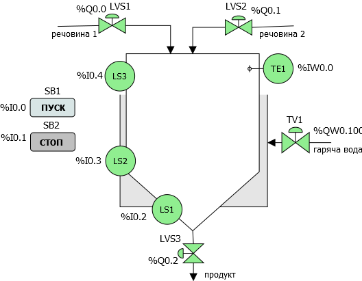
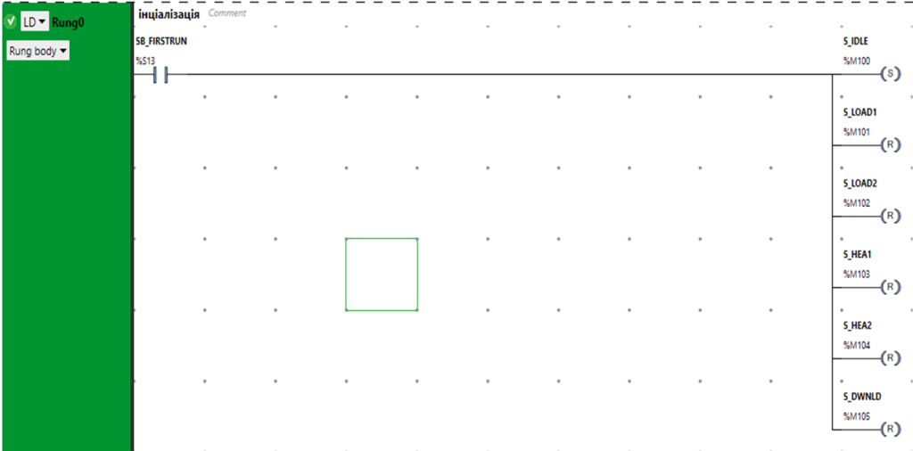
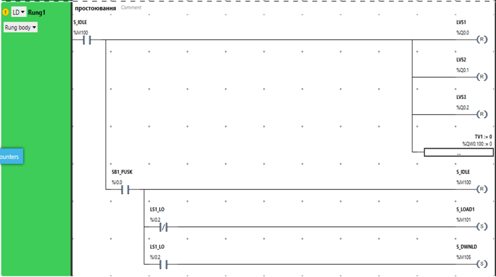
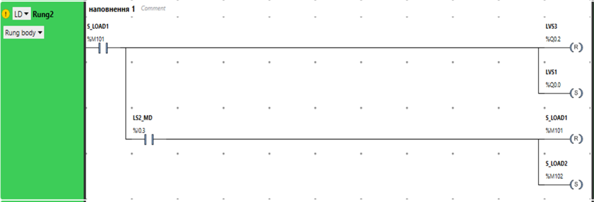
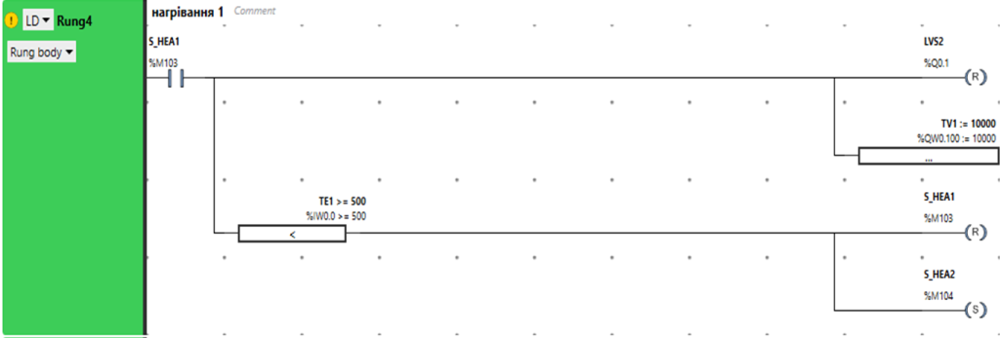
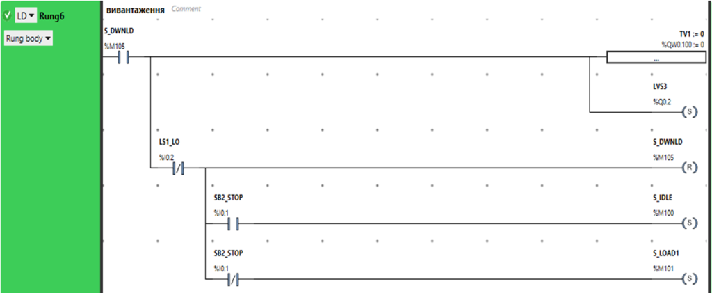

[<- До підрозділу](README.md)

## Програмування та налагодження в ПЛК M221: практична частина

**Мета:** навчитися створювати програми користувача на мові LD.

**Необхідне програмне забезпечення.** EcoStruxure Machine Expert Basic

### Порядок виконання роботи

#### 1. Опис та формалізація завдання.

- Ознайомтеся з постановкою завдання для створення програми користувача. Схема технологічної установки, для якої необхідно розробити програму користувача показана на рис.5. 1

рис.5.1. Спрощена апаратурно-технічна схема установки 

Після натискання кнопки "ПУСК", якщо ємність не порожня, повинен відкритися клапан `LVS3`, і присутня в ємності рідина повинна вивантажитися з неї.  Якщо (коли) ємність буде порожня необхідно закрити клапан `LVS3` і відкрити клапан `LVS1` і почати її наповнювати до спрацювання середнього рівня. Після цього необхідно закрити клапан `LVS1` і відкрити `LVS2` для заповнення ємності до верхнього рівня. Потім клапан `LVS2` треба закрити і відкрити клапан `TV1` повністю. Після досягнення температури 50°С клапан треба залишити відкритим на 50%. Після досягнення значення 55°С клапан `TV1` треба закрити повністю і вивантажити рідину з апарату. Якщо не натиснута кнопка "СТОП" - цикл повинен повторюватися.

#### 2. Аналіз завдання.          

Наведене вище завдання є типовим початковим, і дає можливість поверхово оцінити необхідний алгоритм та підібрати компоненти ПЛК. Але воно має ряд невизначеностей, які необхідно уточнити. 

- Проаналізуйте деякі з невизначеностей завдання: 

1. Що значить закрити або відкрити клапан, яке для клапанів є нормальним положенням? Якщо клапани нормально-закриті, то відкриття для ПЛК буде значити подачу логічної одиниці, у іншому випадку - навпаки, нуля. 
2. Як працюють сигналізатори рівня? Якщо ємність порожня, то сигналізатор нижнього рівня буде замкнутим або розімкнутим? 
3. У якому стані має знаходитися клапан гарячої води на кожному із кроків?
4. Як повинен вести себе  алгоритм в нештатних ситуаціях?
5. Що повинен робити ПЛК, коли він включається (подаєтья на нього живлення) або запускається (включається в RUN)?

Перед розробкою алгоритму та вибору складових ПЛК роблять уточнення завдання. Для початку визначаються з засобами вводу/виводу, які підключаються до ПЛК для вирішення завдання. Потім формалізують завдання через набір задач та функцій, що більш піддається формальній перевірці на виконання. 

#### 3. Самостійне визначення необхідних датчиків та виконавчих механізмів (ВМ).          

При аналізі завдання, ще перед підбором датчиків та ВМ визначаються з кількістю та типом сигналів, які будуть підключатися до ПЛК.  

- Визначте самостійно скільки потрібно дискретних входів та виходів, аналогових входів та виходів. Для цього для кожного передбачуваного датчика та виконавчого механізму з рис.5.1 вкажіть необхідний тип сигналу.

#### 4. Перевірка визначення необхідних датчиків та виконавчих механізмів. 

- У таблиці 5.1 показаний перелік необхідних типів сигналів, та необхідне уточнення після вибору датчика.  Перевірте, чи співпадають значення з цієї таблиці зі значеннями, що вийшли у Вас.   

Таблиця 5.1. Типи сигналів

| Позначення параметру | Тип сигналу для ПЛК | Примітка                                                     |
| -------------------- | ------------------- | ------------------------------------------------------------ |
| Кнопка SB1 "ПУСК"    | DI                  | вмикається людиною, без фіксації                             |
| Кнопка SB2 "СТОП"    | DI                  | вмикається людиною, з фіксацією                              |
| Сигналізатор LS1     | DI                  | необхідно дізнатися про значення "ВКЛ" та "ВІДКЛ"            |
| Сигналізатор LS2     | DI                  | необхідно дізнатися про значення "ВКЛ" та "ВІДКЛ"            |
| Сигналізатор LS3     | DI                  | необхідно дізнатися про значення "ВКЛ" та "ВІДКЛ"            |
| Температура TE1      | AI                  | необхідно дізнатися про діапазон вимірювання та сигналу з датчика |
| Клапан LVS1          | DO                  | необхідно дізнатися про нормальний стан регулюючого органу (РО) |
| Клапан LVS2          | DO                  | необхідно дізнатися про нормальний стан РО                   |
| Клапан LVS3          | DO                  | необхідно дізнатися про нормальний стан РО                   |
| Клапан TV1           | AO                  | необхідно дізнатися про нормальний стан РО                   |

де DI - дискретний вхід, DO - дискретний вихід, AI - аналоговий вхід, AO - аналоговий вихід  

#### 5. Уточнення після вибору датчиків та ВМ. 

Вибір датчиків та виконавчих механізмів виходить за рамки лабораторної роботи і даної дисципліни. Тому тут буде вказано діапазони сигналів, які були вибрані навмання. Також для них вибрані входи та виходи ПЛК М221. 

- Подивіться перелік змінних, які передбачаються для підключених вимірювальних перетворювачів та виконавчих механізмів (таб.5.2).

Таблиця 5.2.Перелік змінних та вимоги до них  

| Позначення параметру | Діапазон  зміни    | Діапазон сигналу на/з ПЛК | Вхід/вихід ПЛК | Примітка                                                     |
| -------------------- | ------------------ | ------------------------- | -------------- | ------------------------------------------------------------ |
| Кнопка SB1  "ПУСК"   | вкл/відкл          | Вкл.=24В, Відкл=0         | %I0.0          | вмикається людиною, без фіксації                             |
| Кнопка SB2 "СТОП"    | вкл/відкл          | Вкл.=24В, Відкл=0         | %I0.1          | вмикається людиною, з фіксацією                              |
| Сигналізатор LS1     | вкл/відкл          | Вкл.=24В, Відкл=0         | %I0.2          | "ВКЛ" коли присутня рідина на даному рівні, коли ємність порожня буде в стані "ВІДКЛ" |
| Сигналізатор LS2     | вкл/відкл          | Вкл.=24В, Відкл=0         | %I0.3          | "ВКЛ" коли присутня рідина на даному рівні, буде "ВКЛ" коли в ємності рідини більше за 50% |
| Сигналізатор LS3     | вкл/відкл          | Вкл.=24В, Відкл=0         | %I0.4          | "ВКЛ" коли присутня рідина на даному рівні, буде "ВКЛ" коли в ємності рідини більше за 95% |
| Температура TE1      | 0 - 100 °С         | 0-10 В                    | %IW0.0         | лінійна шкала                                                |
| Клапан LVS1          | Відкритий/закритий | Відкр=24В, Закр=0В        | %Q0.0          |                                                              |
| Клапан LVS2          | Відкритий/закритий | Відкр=24В, Закр=0В        | %Q0.1          |                                                              |
| Клапан LVS3          | Відкритий/закритий | Відкр=24В, Закр=0В        | %Q0.2          |                                                              |
| Клапан TV1           | 0 - 100 %          | 0 - 10 В                  | %QW0.100       | 0% - повністю закритий, лінійна шкала                        |

- Проаналізуйте рис.5.2, який отриманий з рис.5.1 з підписаними змінними:

рис.5.2. Схема установки з вказівкою входів/виходів

Відповідно до таблиці 5.2 необхідно більше формалізувати завдання, яке зручно буде перетворювати на алгоритм та робити перевірочні тести. Для цього спочатку виділяють задачі та функції (роблять декомпозицію). **Функції** постійно формують виходи за станом входів.  **Задачі** - це функції, які описуються певною послідовністю кроків. Задачі мають початок і кінець, а їх виконання описується послідовністю умов та дій. 

Для даного завдання можна виділити тільки одну задачу, яку можна назвати  "Приготування продукту за визначеним алгоритмом". Якби для даної установки необхідно було ще розробити програму автоматичної мийки, яка описується своїм алгоритмом, варто було б виділити для нього окрему задачу "Мийка установки". Якби установка мала регулятор температури, який працював би умовно незалежно, можна б було виділити окрему функцію "Регулювання температури", для якої давався окремий алгоритм.  Для кожної задачі та функції можна приводити описи алгоритмів їх роботи. Для даної задачі є принаймні два способи формалізації, через послідовнісне виконання або через залежність виходів через входи.  

#### 6. Формалізація задачі через послідовнісне виконання    

- Уважно прочитайте та осмисліть наведений нижче текст.

Задача може формалізуватися алгоритмом, який має початок і завершення і складається з певних кроків. Це називається послідовнісним (sequentional) алгоритмом. Опишемо задачу через кроки. 

**0. Ініціалізація (ПЛК перейшов в RUN)**.

Усі виходи виставити в стан ВІДКЛ (для дискретних) або 0 (для аналогових). Перейти на крок "Простій, очікування пуску задачі".

**1. Простій, очікування пуску задачі.**

Усі виходи виставити в стан ВІДКЛ (для дискретних) або 0 (для аналогових). При спрацюванні кнопки "ПУСК" в залежності від стану  `LS1` :

- при `LS1=0` перейти на крок "Наповнення речовиною 1"
- при `LS1=1` перейти на крок "Вивантаження продукту"

**2. Наповнення речовиною 1.**

`LVS1=1`, усі інші 0. При спрацюванні `LS2` (`LS2=1`) перейти на крок "Наповнення речовиною 2".

**3. Наповнення речовиною 2.**

`LVS2=1`, усі інші 0. При спрацюванні `LS3` (`LS3=1`) перейти на крок "Нагрівання".

**4. Нагрівання 1.**

`TV1=100% (10000)` усі інші 0. При досягненні заданої температури 50°С (`TE1>=500`) перейти до кроку "Нагрівання 2" 

**5. Нагрівання 2.**  

`TV1=50% (5000)` усі інші 0. При досягненні заданої температури 55°С (`TE1>=550`) перейти до кроку "Вивантаження продукту" 

**6. Вивантаження продукту.** 

`LVS3=1`, усі інші 0. При досягненні нижнього рівня (`LS1=0`), в залежності від стану кнопки "СТОП":

- при `SB2=0` перейти до кроку "Наповнення речовиною 1"
- при `SB2=1` перейти до кроку "Простій"    

Наведений вище опис задачі, що формалізований через кроки вже по суті є певним представленням алгоритму і дає можливість створити програму користувача і методику випробувань .  

#### 7. Розробка методики перевірки    

Методика перевірки передбачає опис процедур, які необхідно зробити, щоб перевірити чи відповідає виконання програми заданим в завданні умовам. Перший варіант методики перевірки розробляють ще до написання програми користувача. Методика дає можливість розробнику не тільки перевірити правильність виконання програми користувача, але і зрозуміти усі тонкощі алгоритму.

Враховуючи що у даному випадку система у кожен момент часу перебуває у певному стані, поведінка програми залежить не тільки від входів але і від теперішнього стану. Тому перевірка правильності виконання задачі зводиться до перевірки поведінки виходів ПЛК при зміні стану та входів ПЛК. Це зручно оформити у вигляді таблиці, яка має форму як в таб.5.3. При перевірці послідовно змінюють значення вхідних змінних (SB1, SB2, LS1, LS2, LS3, TE1) і дивляться на те, як змінюються вихідні змінні.  

- Проаналізуйте зміст таблиці 5.3.

Таблиця 5.3. Табличний вигляд методики перевірки роботи задачі приготування продукту. 

| №    | стан/зміна стану  системи   | SB1  | SB2  | LS1  | LS2  | LS3  | TE1   | LVS1 | LVS2 | LVS3 | TV1  | Примітка                    |
| ---- | --------------------------- | ---- | ---- | ---- | ---- | ---- | ----- | ---- | ---- | ---- | ---- | --------------------------- |
| 1    | початковий  (включення ПЛК) | -    | -    | -    | -    | -    | -     | 0    | 0    | 0    | 0    |                             |
| 2    | Предпуск                    | 0    | -    | -    | -    | -    | -     | 0    | 0    | 0    | 0    |                             |
| 3    | Пуск порожнім               | 1    | 0    | 0    | 0    | 0    | -     | 1    | 0    | 0    | 0    |                             |
| 4    | Пуск не порожнім            | 1    | 0    | 1    | 0    | 0    | -     | 0    | 0    | 1    | 0    | Продовжити перевірку з п.14 |
| 5    | Наповн. нижче рівня LS2     | 0    | 0    | 1    | 0    | 0    | -     | 1    | 0    | 0    | 0    |                             |
| 6    | рівень LS2                  |      |      | 1    | 1    | 0    | -     | 0    | 1    | 0    | 0    |                             |
| 7    | Наповн. нижче рівня LS3     | -    | -    | 1    | 1    | 0    | -     | 0    | 1    | 0    | 0    |                             |
| 8    | рівень LS3                  | -    | -    | 1    | 1    | 1    | -     | 0    | 0    | 0    | 100% |                             |
| 9    | Нагрівання 1                | -    | -    | -    | -    | -    | <50°С | 0    | 0    | 0    | 100% |                             |
| 10   | температура 50°С            | -    | -    | -    | -    | -    | 51°С  | 0    | 0    | 0    | 50%  |                             |
| 11   | Нагрівання 2                | -    | -    | -    | -    | -    | <55°С | 0    | 0    | 0    | 50%  |                             |
| 12   | температура 55°С            | -    | -    | -    | -    | -    | 56°С  | 0    | 0    | 0    | 0    |                             |
| 13   | Вивантаження до LS2         | -    | -    | 1    | 1    | 0    | -     | 0    | 0    | 1    | 0    |                             |
| 14   | Вивантаження до LS1         | -    | -    | 1    | 0    | 0    | -     | 0    | 0    | 1    | 0    |                             |
| 15   | Ємність порожня при "СТОП"  | 0    | 1    | 0    | 0    | 0    | -     | 0    | 0    | 0    | 0    | продовжити перевірку з п.2  |
| 16   | Ємність порожня без "СТОП"  | 0    | 0    | 0    | 0    | 0    | -     | 1    | 0    | 0    | 0    | продовжити перевірку з п.5  |

  `-` - вказує незалежність дій від значення вхідних сигналів, бажано перевіряти що стан системи не міняється при зміні цих вхідних сигналів 

#### 7. Конфігурування ПЛК   

- В Machine Expert Basic створіть новий проект .
- замініть модуль CPU на `TM221C16T` 
- у конфігурації ПЛК вставте в CPU картридж `TMC2AQ2V` 

#### 8. Найменування змінних.  

- Дайте символьні імена змінним відповідно до рис.5.2, можете добавляти суфікси з функціональними призначеннями, наприклад `SB1_PUSK` 

#### 9. Розробка програми користувача.    

Програма для даної задачі розроблятиметься з використанням послідовнісного стано-орієнтованого підходу. Для кожного стану виділимо окремі змінні.

Таблиця 5.4. Змінні стану.

| Стан                             | Змінна | Символьна назва | Примітка |
| -------------------------------- | ------ | --------------- | -------- |
| Простій, очікування пуску задачі | %M100  | S_IDLE          |          |
| Наповнення речовиною 1           | %M101  | S_LOAD1         |          |
| Наповнення речовиною 2           | %M102  | S_LOAD2         |          |
| Нагрівання 1                     | %M103  | S_HEA1          |          |
| Нагрівання 2                     | %M104  | S_HEA2          |          |
| Вивантаження продукту            | %M105  | S_DWNLD         |          |

- створіть символьні назви для змінних стану з таблиці 5.4.

- створіть програму користувача відповідно до наведених копій екранів Rung

  **Крок ініціалізації** - використовує системний біт `%S13` (перший цикл), який на першому циклі роботи ПЛК ініціалізує змінні станів кроків та переводить програму в стан "Простоювання" 

рис.5.3. Зміст Rung0

рис.5.4. Зміст Rung1

рис.5.5. Зміст Rung2

рис.5.6. Зміст Rung3

рис.5.7. Зміст Rung4

рис.5.8. Зміст Rung5

рис.5.9. Зміст Rung6

Наведена програма не передбачає блокування можливості зміни виходів а також корків із-зовні (наприклад з панелі оператора). Так, наприклад, можна змінити стан ВМ подачі гарячої води на кроках наповнення. Для того,щоб це унеможливити, можна добавити додаткові дії. 

#### 9. Перевірка роботи програми користувача.    

- Запустіть імітатор ПЛК та запустіть його на виконання.

- перевірте роботу програми згідно методики перевірки, яка наведена в таблиці 5.3  

​      

#### 10. Отримання індивідуального завдання для програми користувача.

- Отримайте індивідуальне завдання від викладача, якщо ще не отримали. Якщо в постановці завдання використовуються часові затримки, замініть їх умовою "оператор натиснув кнопку далі".

#### 11. Формування переліку входів/виходів. 

- Сформуйте таблицю з переліком входів виходів, подібну до 5.2 та оформіть рисунок до завдання, подібно до рис.5.2

#### 12.  Формалізація задачі 

- Формалізуйте задачу через кроки, як це зроблено в п.5.6.     

#### 13. Розробка методики перевірки.

- Розробіть методику перевірки, аналогічно, як це зроблено в п.5.7. 

#### 14. Розробка та перевірка програми користувача.

- Створіть проект, виберіть ПЛК, необхідні модулі.
- Створіть програму на LD.
- Використовуючи методику перевірки, перевірте роботу програми користувача на імітаторі.

Усі наведені  матеріали разом з програмою користувача є звітом для даної роботи.

### Питання до захисту

1. Розкажіть про формування та уточнення завдання на розробку програми користувача для ПЛК.
2. За якими критеріями визначають необхідні входи та виходи ПЛК?
3. Розкажіть про формалізацію задачі через послідовносне виконання.
4. Поясніть методику перевірки з використанням табличного вигляду на прикладі таблиці 5.3.
5. Як призначення змінних стану, які наведені в табл.5.4?
6. Поясніть методику перевірки для Вашого індивідуального завдання.

 

Розробив лабораторну - Олександр Пупена. [АКТСУ НУХТ](http://www.iasu-nuft.pp.ua)
