[<- До підрозділу](README.md)	[PLC MachineStruxure](../ecostruxuremachineexpert.md) 	[CODESYS (загальна)](../codesys.md)	[Коментувати](#feedback)

# Налагодження програм користувача в CODESYS: теоретичні відомості

## Інструмент Trace

### Загальні функції

Trace дозволяє фіксувати зміну значень змінних на контролері протягом певного часу, подібно до цифрового вибіркового осцилографа. Додатково можна задати тригер для керування процесом збору даних. Значення змінних Trace безперервно записуються у буфер PLC заданого розміру. Вони можуть відображатися у вигляді двовимірного графіка як функція часу. Збір даних в PLC продовжується навіть після відключення від контролера. Якщо під час виконання Trace у PLC або на ПК, де він запущений, виконуються ресурсоємні для процесора задачі, можливе пропускання значень змінних у Trace.

Трасування даних на контролері виконується двома способами, в залженості від можливостей ПЛК:

- з IEC-коду, згенерованого об’єктом Trace та завантаженого на контролер дочірнім застосунком Trace;
- всередині компонента `CmpTraceMgr` (також називається Trace Manager).

Трасування даних може суттєво збільшити час циклу IEC-задачі.

Які саме дані фіксуються, визначається налаштуванням у параметрах цільового пристрою (`trace > trace manager`) якщо такі є в даного пристрою. Trace Manager має розширену функціональність. Він дозволяє:

- налаштовувати та трасувати параметри системи керування, наприклад температурну криву процесора або батареї. Докладніше див. налаштування змінних та налаштування запису (тригера);
- зчитувати трасування пристроїв, наприклад трасу струму електропривода. Докладніше див. опис команди `Upload Trace` у довідці;
- трасувати системні змінні інших системних компонентів.

Крім того, доступна додаткова команда `Online List`.

- Якщо Trace використовується у візуалізації, параметри пристрою не можуть бути трасовані або використані як тригер.
- Рівень тригера не може бути заданий IEC-виразом, підтримуються лише літерали та константи.
- Умова запису не може бути задана IEC-виразом типу BOOL, підтримуються лише змінні.
- Якщо властивість трасується або використовується як тригер, вона повинна бути анотована атрибутом monitoring в IEC-оголошенні.

### Створення та налаштування Trace

Trace добавдяється в Application, подібно до інших об'єктів, потім його знайти можна  у дереві Tools.  Можна створити довільну кількість об’єктів Trace. При створенні задається назва та задача, до якої він буде привязаний.

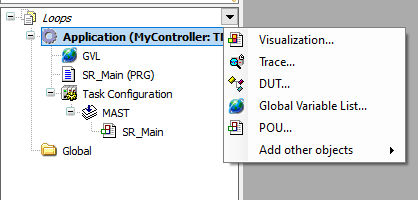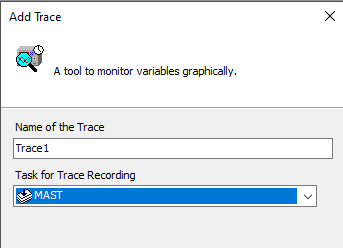

рис.1. Добавлення Trace

Налаштування даних Trace та параметри їх відображення виконуються в розділі `Configuration` подання Trace, а добавлення змінних через `Add Variable`.  

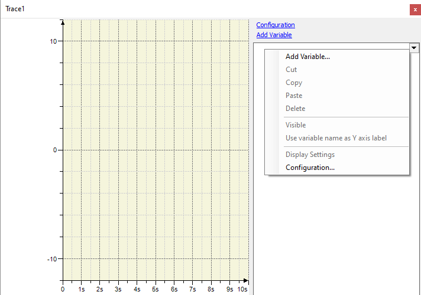

рис.2. Відображення новоствореного Trace

Діалогове вікно `Trace Configuration` має два різні подання дерева зліва:

- `Trace Record tree view` - налаштування запису для трасування; 
- `Presentation (diagrams) tree view` - налаштовання відображення  

Зміст правого вікна залежить від вибраного елемента в дереві.

### Налаштування запису Trace

Запис налаштовується через добавлення змінної та налаштування всього Trace. При добавленні та налаштуванні змінної вказується:

- `Variable` -  ім’я змінної, або властивість, посилання, вміст вказівника або елемент масиву застосунку. Дозволені усі базові типи IEC, крім STRING, WSTRING або ARRAY. Якщо потрібно трасувати параметр пристрою, необхідно вибрати його зі списку `Traceble Parameter` . 
- `Graph color`, `Line type`, `Dot` - колір, тип лінії, спосіб відображення точок кривої трасування цієї змінної.
- `Activate Minimum Warning` - якщо активовано, графік відображається кольором `Warning minimum color`, коли значення змінної стає меншим за `Critical lower limit`.
- `Activate Maximum Warning` - якщо активовано, графік відображається кольором `Warning maximum color`, коли значення змінної перевищує `Critical upper limit`. 

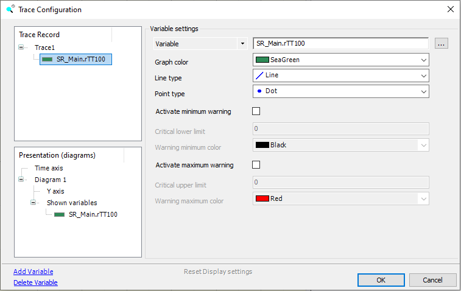

рис.3. Налаштування змінної.

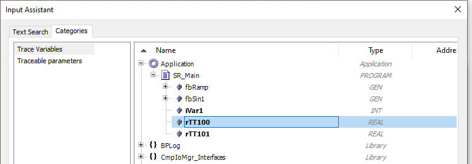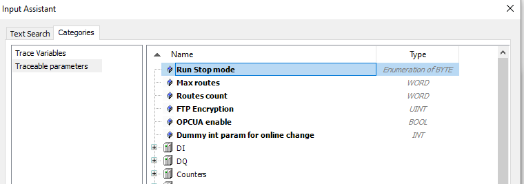

рис.4. Вибір сигнелу змінної для Trace

За допомогою комбінацій клавіш `Shift + клацання` мишею або `Ctrl + клацання` мишею можна вибрати кілька змінних для редагування. У такому разі зміни, виконані в діалоговому вікні `Variable Settings`, застосовуються до всіх вибраних змінних. Того самого можна досягти за допомогою `Shift + стрілка вгору/вниз` або `Ctrl + стрілка вгору/вниз`.

Параметри запису для трасування визначають події та глибину записування. У більшості випадків небажано, щоб трасування та відображення вхідних сигналів починалося у випадкові моменти, наприклад одразу після попереднього вимірювання або після натискання кнопки старту користувачем. Зазвичай потрібно, щоб трасування виконувалося після спрацювання тригера з фіксацією заданої кількості записів після події посттригер. Тому в налаштуваннях можна задати тригер. Однак для налагодження регуляторів, можна використовувати безтригерний постійний запис, у цьому випадку важливо задати як часто це робити, часто не з кожним викликом задачі. 

Для тригерування вхідних сигналів використовуються такі способи:

- налаштування змінної тригера
- налаштування умови запису
- або поєднання обох способів

Якщо потрібно фіксувати та відображати сигнал Trace з іншою часовою базою, слід виконати конфігурацію запису в окремому об’єкті Trace.

При виділенні Trace у вікні `Trace Record` через налаштування задається через `Record Settings`.  

- `Enable Trigger` - активація системи запису по тригеру; якщо систему тригера вимкнено - Trace працює у режимі періодичного запису.
- `Trigger Variable` - ім’я змінної, що слугує тригером,  дозволені усі базові типи IEC, крім STRING, WSTRING або ARRAY. Контролери, що підтримують використання параметрів пристрою як тригерів, надають список при виборі параметра Trigger Variable. 
- `Trigger edge` - подія тригера на фронті (`positive`, `negative` або `both`) булевої змінної або коли значення, визначене параметром `Trigger Level` для аналогової змінної, досягається при зростанні.
- `Post Trigger` - кількість записів на кожну змінну Trace, які фіксуються після спрацювання тригера.
- `Trigger Level` - значення, при якому спрацьовує тригер якщо використовується аналогова змінна з числовим типом, наприклад LREAL або INT. Можна безпосередньо ввести значення, або константу GVL.
- `Task` - задача, в якій буде виконуватися захоплення вхідних сигналів.
- `Record condition` - булева змінна уомви, якщо потрібно запускати запис за умовою
- `Comment` - текст коментаря щодо поточного запису
- `Resolution` - роздільна здатність часової мітки Trace у мс або мкс. Для кожного сигналу зберігаються та передаються до системи програмування пари: значення та часова мітка. Часові мітки відносні та відраховуються від початку трасування.Якщо задача Trace має час циклу 1 мс або менше, варто використовувати роздільну здатність у мкс. 
- `Automatic restart` - установіть цю опцію, якщо потрібно зберігати конфігурацію Trace та останній вміст буферів `RTS Trace` постійно на цільовому пристрої.

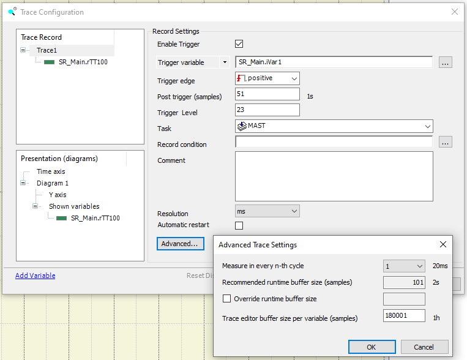

рис.5. Налаштування Trace

За допомогою вікна `Advanced Trace Settings` можна задати розмір буфера, куди записуються значення. Це налаштовується шляхом задання кількості вибірок. 

- `Measure in every n-th cycle` - означує, як часто виконується запис даних, наприклад у кожному циклі, кожному другому циклі тощо. Це частота вибірки. Значення за замовчуванням: 1, тобто один набір даних записується в кожному циклі. 
- `Recommended runtime buffer size (samples)` - максимальна кількість вибірок, яку обчислює середовище та яку runtime-система може зберігати для кожної змінної Trace. Значення обчислюється з часу циклу задачі, параметра `Refresh interval` і значення `Measure in every n-th cycle`. Використовується лише якщо не активовано опцію `Override runtime buffer size`.
- `Override runtime buffer size` - якщо опцію активовано, застосунок не використовує рекомендований розмір буфера. Задається кількість вибірок для кожної змінної Trace, яку записує застосунок, тобто фактичний розмір runtime-буфера. Діапазон: від 10 до значення, встановленого для буфера редактора Trace. Значення за замовчуванням: 100.
- `Trace editor buffer size per variables (samples)` - Обмежує буфер Trace, який надається середоивщем для внутрішнього використання.

Використовуючи параметри конфігурації задачі,  обчислюються відповідні часові інтервали залежно від кількості вибірок. Обчислення можливе лише тоді, коли час циклу задачі може бути визначений. Результат відображається праворуч, поза таблицею, у стандартизованому форматі, наприклад: `1h1m1s1ms`.

### Нааштування відображення

Параметри відображення Trace задається через дерево `Presentation (diagrams) tree view`. 

Через контекстне меню можна створити кілька даграм до одного Trace, а потім назанчити змінні конкретній діаграмі. 

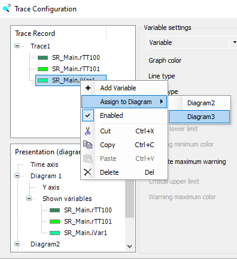

рис.6. Назначення змінної до діаграми.

 У дереві `Presentation (diagrams) tree view` налаштування відображення проводиться через вибір відповідного пункту: 

- `Time axis`  - подання `Display mode` для налаштування відображення часової осі
-  ім’я діаграми - налаштування координатної системи діаграми та попередній перегляд
- `Y axis` -  подання `Display mode` для налаштувати відображення осі.
- змінна - вікно налаштування змінної

Для налаштування осі часу задається (рис.7):

- `Auto` - вісь масштабується автоматично
- `Fixed length` - відображається сегмент сталої довжини.
- `Fixed` - відображається вісь означені параметрами `Minimum` та `Maximum`
- `Length` - при `Fixed length` задання сталої довжини осі, початкове значення адаптується відповідно.
- `Grid` - активація відображення та задання кольору сітки
- `Description` -  текст, який буде відображатися у верхньому лівому куті діаграми
- `Tick marks section` - налаштування поділок осі.
- `Fixed spacing` - якщо вибрано, то поділки відображаються відповідно до параметрів `Distance` (відстань між основними поділками) і `Subdivisions` (кількість підподілок між двома основними поділками).

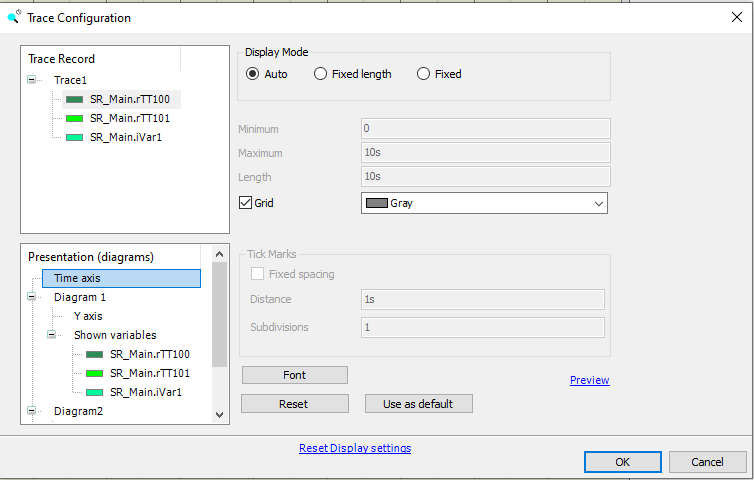

рис.7. Налаштування осі часу

Також в налаштуванні доступні кнопки:

- `Font` - налаштувати шрифт для вибраної осі
- `Reset` - виставити параметри до значень за замовчуванням
- `Use as default` - зберегти поточні параметри як значення за замовчуванням
- `Preview` - переглянути попередній вигляд діаграми, налаштованої в поданні Display mode

Подібні налаштування робляться і для вибраної осі Y (рис.8) 

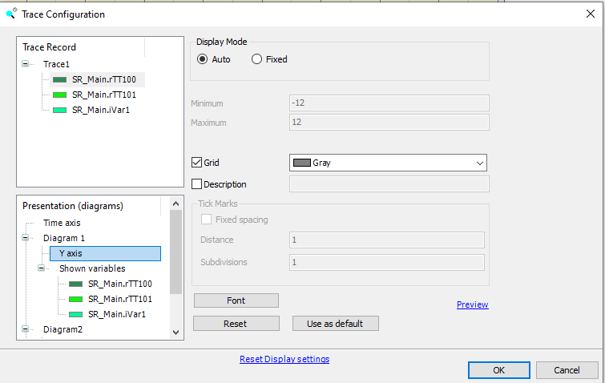

рис.8. Налаштування осі Y діаграми

Для діаграми можна зробити наступні налаштування (рис.9):

- `Backcolor`  - колір фону діаграми 
- `Backcolor on Selection ` - колір фону вибраної діаграми 

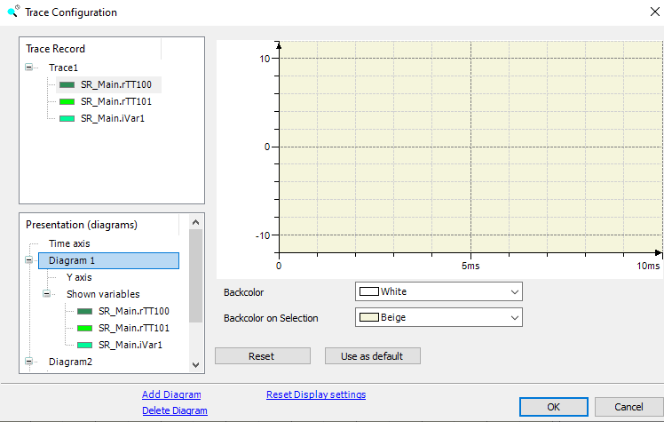

рис.9. Налаштування діаграми

### Режим виконання

Щоб запустити Trace в online-режимі, спочатку необхідно завантажити конфігурацію Trace на контролер за допомогою команди `Download Trace`. 

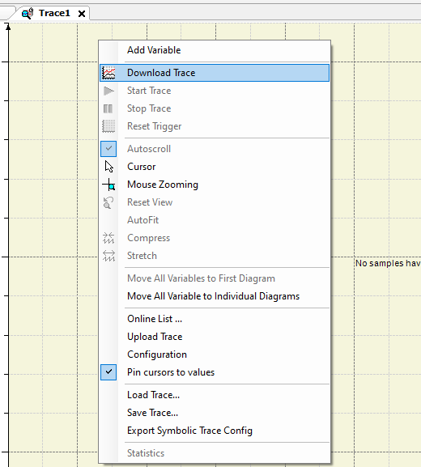

рис.10. Команди контекстного меню Trace

Після цього графіки Trace одразу відображаються відповідно до налаштувань конфігурації Trace (рис.11). У дереві змінних у правій частині діалогового вікна на прикладі з рис.11 вибрано чотири змінні для відображення. За замовчуванням вони показуються з повним шляхом до екземпляра. Щоб приховати шлях до екземпляра, встановіть прапорець `Hide instance paths`. Для відображення цього прапорця натисніть кнопку зі стрілкою у правому верхньому куті області дерева Trace.

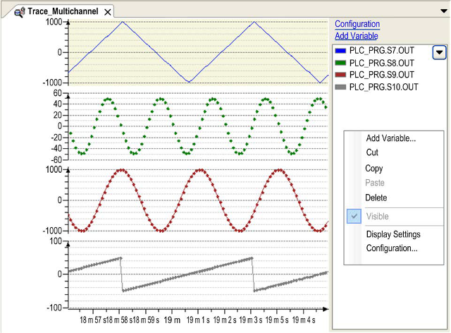

рис.11. Приклад відображення Trace в режимі виконання 

За замовченням trace працює в режимі прокручування (`Autoscroll`), можна зупинити автоматичне прокручування. Можна зупиняти трасування і знову запускати.   

Доступні функції масштабування (`Mouse Zooming`) та курсор, а також команди керування виконанням Trace, що дозволяють стискати або розтягувати графік ( `Compress`, `Stretch`). Відображуваний діапазон значень змінних Trace залежить не лише від конфігурації. Його можна змінювати за допомогою прокручування та масштабування, доступних у меню Trace, на панелі інструментів або через комбінації клавіш.

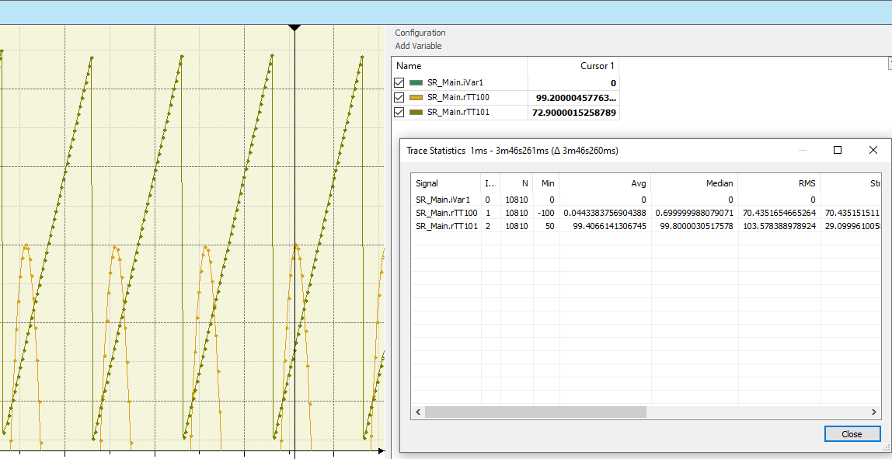

рис.12. Курсор та статистика

Під час виконання login та logout без змін у застосунку трасування продовжує виконуватися без повторного завантаження.

Якщо код застосунку змінено, подальша поведінка залежить від режиму login:

- `Login with online change` або `Login without any change` — трасування продовжує виконуватися.
- `Login with download` — трасування в контролері видаляється, і необхідно виконати нове завантаження.

Діалогові вікна `Trace Configuration` з поданнями `Record Settings` і `Variable Settings` доступні в online-режимі. Багато змін конфігурації можна виконувати під час роботи Trace. Якщо зміна неможлива, наприклад при зміні імені сигналу Trace, трасування зупиняється і потрібно виконати повторне завантаження.

Графіки можна зберегти у зовнішній файл за допомогою `Save Trace`. Цей файл можна згодом повторно завантажити в редактор через команду `Load Trace`. 

### DeviceTrace

У дереві Devices можна добавити DeviceTrace, який напряму отримує доступ до трасувань, що виконуються на контролері. Для доступу до трасувань, збережених у runtime-системі, використовуйте:

- Online List - перегляд Trace що виконуються на пристрої 
- Upload Trace - для вивантаження трасувань з 

Для доступу до трас, збережених на диску, використовуйте:

- Save Trace...
- Load Trace...
- Export symbolic trace config

## Джерела

1. 

## Автори

Теоретичне заняття розробив [Олександр Пупена](https://github.com/pupenasan). 

## Feedback

Якщо Ви хочете залишити коментар у Вас є наступні варіанти:

- [Обговорення у WhatsApp](https://chat.whatsapp.com/BRbPAQrE1s7BwCLtNtMoqN)
- [Обговорення в Телеграм](https://t.me/+GA2smCKs5QU1MWMy)
- [Група у Фейсбуці](https://www.facebook.com/groups/asu.in.ua)

Про проект і можливість допомогти проекту написано [тут](https://asu-in-ua.github.io/atpv/)
