[<- До підрозділу](README.md)		[Коментувати](#feedback)

# Налагодження програм користувача та діагностика у UnityPRO/Control Expert

## 4.1. Операційні режими роботи ПЛК

Працюючий ПЛК може знаходитись в режимах *RUN*, *STOP* та *HALT*. У режимі *виконання* (*RUN*) всі Задачі виконуються згідно послідовності описаної в параграфі 3.3.1. Перехід в *RUN* може проводитись різними способами: 

-     автоматично при холодному старті ПЛК, якщо виставлена опція "*Automatic* *Start* *in* *Run"* в настройках процесорного модулю;

-     подавши *TRUE* на налаштований для цього дискретний вхід, якщо цей вхід виставлений настройкою процесорного модулю "*Run/Stop Input"*; 

-     командою *START* з UNITY PRO, якщо ПЛК находиться в режимі *STOP*;

У режимі *зупинки* (*STOP*) відбувається тільки циклічне опитування всіх входів та внутрішня обробка. Тобто не виконуються програми користувача в Задачах, а виходи ПЛК виставляються в безпечний стан, відповідно до їх конфігурації (див. розділ 2). Нагадаємо, що у всіх режимах (включаючи і *STOP*) операційна система UNITY працює і виконує визначені в ній функції. Перехід в *STOP* може проводитись різними способами:

-     автоматично при холодному старті ПЛК, якщо знята опція "*Automatic* *Start* *in* *Run"* в настройках процесорного модулю;

-     подавши *FALSE* на налаштований для цього дискретний вхід, якщо цей вхід виставлений настройкою процесорного модулю "*Run/Stop Input"*; 

-     командою *STOP* з UNITY PRO, якщо ПЛК находиться в режимі *START*;

-     командою *INIT* з UNITY PRO, якщо ПЛК находиться в режимі *HALT*;

Режим *HALT* *(аварійна зупинка)* аналогічний режиму *STOP*, однак виникає в результаті помилок програм, спрацювання сторожового таймеру або виконання в програмі спеціальної інструкції *HALT*. Для можливості переводу ПЛК з режиму *HALT* в *STOP* необхідно запустити команду ініціалізації *INIT* з UNITY PRO (*PLC->Init*).

Кожна Задача в свою чергу теж може перебувати в режимах *RUN* і *STOP*. Коли ПЛК перебуває в режимі *RUN* Задачі теж автоматично запускаються відповідно до конфігурації. Використовуючи діагностичні вікна UNITY PRO можна зупиняти/запускати виконання окремих Задач. Це може знадобитися для тонкого налагодження програми користувача. Крім того Задачі можуть перебувати в режимі *BKPT* *(BreakPoint)*, в який переводиться Задача при використанні точок переривання. Слід пам’ятати, що:

-     точка переривання призупиняє виконання Задачі, в якій вона використана! 

-     при від’єднанні від ПЛК з включеним режимом *BKPT*, він переходить в режим *STOP*!

При включенні ПЛК відбувається його *холодний старт* (*Cold* *Start*). При холодному старті проходять всі стадії ініціалізації ПЛК:

-     самодіагностика;

-     завантаження виконавчого проекту з карти SD в пам’ять (тільки для М340);

-     конфігурування всіх модулів;

-     деактивація всіх Задач окрім MAST;

-     ініціалізація змінних (крім позначених як *Save*) та обнуління області *%MW* (якщо в конфігурації процесорного модуля стоїть опція "*Initialize %MWi on cold start"*);

-     ініціалізація екземплярів функціональних блоків;

-     ініціалізація системних змінних;

-     запис в *%S0:=TRUE* і в *%SW10.0:= FALSE*; 

Після ініціалізації, в залежності від настройок процесорного модуля ("*Automatic start in Run"* та *"Run/Stop Input"*), ПЛК переходить в режим *STOP* або *RUN*.  У режимі *RUN* на першому циклі виконання Задачі MAST, ПЛК робить наступні дії:

-        в кінці Задачі записує в *%S0:=FALSE,* *%SW10.0:= TRUE,* *%S13:= FALSE*;

-        в кінці Задачі запускає всі інші сконфігуровані в проекті Задачі;

До холодного старту ПЛК приводять наступні події:

1)  повне завантаження виконавчого проекту в ПЛК (*Transfer* *Project* *to* *PLC*); при цьому ПЛК завжди переходить в режим *STOP*;

2)  завантаження виконавчого проекту з SD карти в пам’ять (тільки для М340); завантаження проходить якщо ці проекти відрізняються або при команді з UNITY PRO *PLC->Project backup*;

3)  натискання кнопки *RESET* на модулі живлення процесорного шасі (тільки для M340); 

4)  натискання кнопки *RESET* на процесорному модулі(тільки для TSX Premium);

5)  вставка PCMCIA карти пам’яті (тільки для TSX Premium);

6)  запис в *%S0:=TRUE* в програмі, або з діагностичних вікон UNITY PRO; при цьому перезапускається тільки прикладна програма;

7)  відновлення після збою в живленні, якщо контекст програми відрізняється від збереженого при зникненні живлення.      

У момент зникнення живлення, процесорний модуль встигає перейти в режим *STOP* та записати *контекст прикладної програми* (*application* *context* - стан регістрів процесору та пам’яті). При появі живлення, під час самодіагностики, CPU перевіряє дійсний контекст програми зі збереженим. Якщо контексти різні – проходить холодний старт, якщо співпадають – *теплий рестарт* (*Warm Restart*).

Під час теплого рестарту ПЛК деактивуються усі Задачі, окрім MAST, біт *%S1:=TRUE*, після чого Задача MAST переводиться в режим *RUN*. У кінці першого циклу Задачі MAST активуються усі інші Задачі, а *%S1:=FALSE.* Для TSX Premium до теплого рестарту приводить також натискання кнопки *RESET* на модулі живлення процесорного шасі. Біт *%S1* можна змінювати з прикладної програми або з діагностичних вікон UNITY PRO, що приводить до перезапуску Задачі *MAST*.

Стан ПЛК сигналізується індикаторними лампами на CPU та відображається в UNITY PRO (в режимі онлайн) на панелі статусу (див. рис.4.4) та в діагностичних вікнах.   

 

## 4.2. Робота UNITY PRO в режимі онлайн

### Налаштування зв’язку

UNITY PRO по відношенню до ПЛК може знаходитись в 2-х режимах: 

-     *offline*: в цьому режимі відсутній зв’язок середовища UNITY PRO з ПЛК, всі зміни в проекті відображаються тільки в файлі проекту на ПК; 

-     *online*: в цьому режимі відбувається обмін між UNITY PRO та ПЛК. 

Перехід в режим *online* відбувається через команду в меню *PLC->Connect*. При цьому, UNITY PRO з’єднається з тим ПЛК, адреса якого прописана у вікні налаштування зв’язку UNITY PRO. Вікно налаштування адрес ПЛК та імітатора ПЛК викликається в меню "*PLC->Set Address…"* (рис.4.1).

При необхідності роботи з імітатором ПЛК, перед з’єднанням необхідно вибрати пункт *PLC->Simulation Mode*, а для роботи з фізичним ПЛК – *PLC->Standard Mode*.

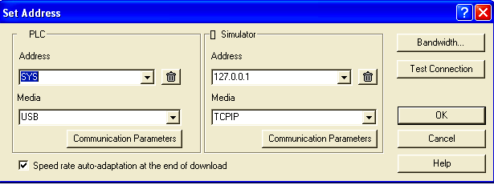

Рис.4.1. Вікно налаштування адреси ПЛК та імітатора

UNITY PRO може з’єднатися з ПЛК використовуючи різні драйвери для зв’язку, які поставляються разом з UNITY PRO. Ряд драйверів встановлюються в систему по замовченню разом з UNITY PRO, інші необхідно встановлювати з дистрибутива самостійно. Налаштування цих драйверів проводиться за допомогою спеціальної утиліти *Drivers* *Management*, яку можна запустити з меню Windows "Пуск":   

*Schneider Electric -> Communication Drivers -> Drivers Management*  

Утиліту *Drivers* *Management* можна також запустити з вікна Set Address (див.рис.4.1):

*вікно* *PLC->Communication Parameters->Driver Settings*

Слід зазначити, що драйвери які використовує UNITY PRO для з’єднання з ПЛК можуть використовувати також інші програми Schneider Electric, наприклад OFS (OPC Factory Server), Vijeo Designer, PL7 PRO, Twido Suite і багато інших.

Вікно утиліти *Drivers* *Management*  показано на рис.4.2. Кожний драйвер налаштовується в окремому вікні, які доступні по вкладкам. У більшості випадків для з’єднання UNITY PRO з ПЛК нічого змінювати в конфігурації драйверів не потрібно. Нижче зупинимося тільки на найбільш популярних настройках, які часто необхідно вказувати для з’єднання UNITY PRO з ПЛК. 

Усі драйвери умовно діляться на дві групи: драйвери MODBUS і драйвери XWAY. Драйвери MODBUS доступні в декількох варіантах: 

-     *Modbus* *Serial* (MODBUS01, MODBUS02…): для зв’язку з ПЛК M340 та Quantum через інтегровані в CPU або комунікаційні модулі послідовні порти RS232/RS485;

-     *TCP/IP*: для зв’язку з усіма типами ПЛК Modicon, через Modbus/TCP як правило через інтегровані в CPU або комунікаційні модулі порти Ethernet;

-     *USB* *(PLC* *USB)*: для зв’язку з ПЛК М340 та деякими потужними Quantum та Premium через інтегрований в CPU інтерфейс USB;

-     *Modbus+:* для зв’язку тільки з ПЛК Quantum. 

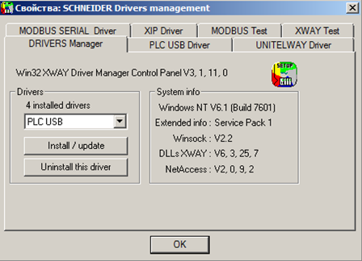

Рис.4.2. Вікно утиліти *Drivers Management* 

Драйвери XWAY використовуються тільки для зв’язку з TSX Premium і теж доступні в декількох варіантах:

-     *UNITELWAY* (UNTLW01): для зв’язку як правило через інтегрований порт TER/AUX, використовуючи один з адаптерів TCX PCX1031, TSX PCX 3031 або TSX C USB 485;

-     *XIP*: для зв’язку через Ethernet (протокол UNITE XWAY на TCP/IP);

-     *ETHWAY*:  для зв’язку через Ethernet (протокол UNITE XWAY на Ethernet);

-     *PCIWAY*: для зв’язку з ПЛК Atrium через PCI-шину ПК; 

-     *FIP*: для зв’язку через FIPWAY/FIPIO; 

Таким чином, в залежності від використовуваного драйверу, необхідно у *Drivers* *Management* налаштувати ті чи інші параметри. Для драйверу *Modbus* *Serial* в необхідно вказати номер COM-порту комп’ютера, та його налаштування (наприклад *Baud* *Rate* - бітова швидкість, *Parity*-паритет, див.рис.4.3.). Для драйверів Modbus TCP/IP та USB нічого налаштовувати не потрібно. 

Для драйверу UNITELWAY необхідно вказати тільки як правило номер COM-порту комп’ютера. Слід зазначити, що кабель-адаптер перетворювач (TCX PCX1031, TSX PCX 3031 або TSX C USB 485) при з’єднані з ПЛК повинен знаходитись в режимах "*2* *TER* *DIRECT*" або "*0* *TER* *MULTI*".

Для драйверу XIP необхідно налаштувати власну XWAY-адресу (Local Host) в форматі "*Network.Station*", та адреси ПЛК, з якими необхідно з’єднуватися (див.рис.4.3). Для кожного ПЛК обов’язково треба задати пару значень: *XWAY* *address:* *Network.Station* та відповідний йому *IP* *address*. Слід зазначити, що номер мережі (*Network*) у ПК і ПЛК повинен співпадати. На рис.4.3 драйвер XIP комп’ютера з UNITY PRO має локальну XWAY-адресу рівною "*9.51*", а ПЛК з назвою "*premium_8"* має XWAY-адресу рівною "*9.9*" з IP-адресою рівною 192.168.009.098.

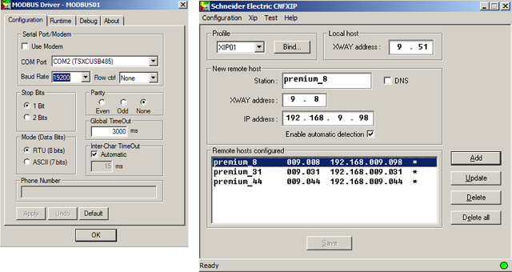

Рис.4.3. Налаштування драйверів зв’язку: Modbus Serial (ліворуч), XIP (праворуч)

Після налаштування драйверу, зв’язок з ПЛК можна перевірити на вкладці "XWAY test" або "MODBUS test".

Для різних драйверів зв’язку у вікні налаштування адреси ПЛК та імітатора задається різний формат адреси (див. рис.4.1). Нижче наведемо найбільш вживані:

Таблиця 4.1. *Приклади адрес ПЛК.*

| Вибраний драйвер        | формат адреси                  | приклад                                                      |
| ----------------------- | ------------------------------ | ------------------------------------------------------------ |
| USB                     | SYS                            | SYS                                                          |
| UNTLW01                 | SYS                            | SYS                                                          |
| MODBUS01                | адреса Slave                   | 1                                                            |
| TCPIP                   | IP-адреса                      | 192.168.9.44                                                 |
| TCPIP   (для Simulator) | IP-адреса ПК з  імітатором ПЛК | 192.168.9.1 – імітатор на іншому ПК  127.0.0.1 –  імітатор на тому ж ПК що і UNITY PRO |
| XIP                     | {Network.Sation}SYS            | {9.8}SYS                                                     |

 

### Можливості UNITY PRO в режимі онлайн

ПЛК дозволяє з’єднуватися з ним в *режимі програмування* (режим роботи *Programming* *Mode*) або в *режимі перегляду* (*Monitoring* *Mode*). Режим з’єднання визначається в опціях середовища *Tools->Options->Connection*. У режимі програмування з ПЛК може з’єднатися тільки один термінал програмування UNITY PRO. У обох режимах доступні можливості перегляду та зміни значення змінних та комірок локалізованої області з використанням анімаційних таблиць та операторських екранів. Значення нелокалізованих змінних доступні тільки у підрежимі *Equal*. Режим *Programming* *Mode* дозволяє також змінювати програму в ПЛК. 

Для створення виконавчого проекту в UNITY PRO проводиться компіляція. Можливі два варіанти компіляції:

-    Build->*Build Changes*: ця команда приводить до компіляції тільки змінених частин проекту;

-    Build->*Rebuild All Project*: ця команда приводить до повної перекомпіляції проекту.  

Результат компіляції висвічується у вікні *Output Window*. Якщо при компіляції є помилки, то в даному вікні з’явиться їх перелік. Зробивши подвійний клік по повідомленню помилки, можна визначити її джерело. Перевірити синтаксичні помилки в проекті можна також командою Build->*Analyze*.   

Виконавчий проект, який являється результатом компіляції, зберігається разом з файлом проекту на диску комп’ютера. У режимі онлайн виконавчий проект можна завантажити в ПЛК командою  *PLC->Transfer Project to PLC*.  Завантаження нового проекту в ПЛК приводить до його зупинки та ініціалізації!

Завантаження проекту в ПЛК можливе тільки у випадку якщо конфігурація апаратного забезпечення процесорного модуля відповідає дійсній (той же CPU, та ж версія OS UNITY).

Середовище UNITY PRO дає можливість зміни частини виконавчого проекту в ПЛК не зупиняючи його роботу. Це дуже важливо, коли необхідно змінити логіку виконання програм на працюючому обладнанні. Для можливості часткової зміни програми в ПЛК необхідно щоб виконавчі проекти в ПЛК і в середовищі UNITY PRO були ідентичними. У режимі онлайн ідентичність проекту сигналізується в панелі статусу зеленим індикатором *EQUAL*, а якщо проекти відрізняються – червоним *DIFFERENT* (рис.4.4). 

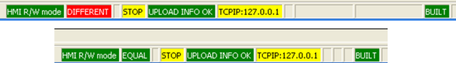

Рис.4.4. Вигляд панелі статусу в режимі *DIFFERENT* (зверху) та *EQUAL* (знизу). 

Таким чином зміни в проекті намагаються проводити в режимі *EQUAL*, шляхом часткової компіляції. Користувач робить всі зміни в проекті (змінює код, добавляє змінну, тощо), потім в режимі *online (тільки EQUAL)* викликає команду *Build Changes*, що приводить до модифікації виконавчого проекту в UNITY PRO та в ПЛК. Для модифікації програми в ПЛК без його зупинки, часткова компіляція проводиться тільки в режимі онлайн! 

Слід розуміти, що виконавчий проект являється скомпільованим кодом, який не можна вивантажити з ПЛК і модифікувати середовищем UNITY PRO! Окрім виконавчого проекту в ПЛК можна завантажити інші проектні дані. Для того щоб мати таку можливість, ці дані теж необхідно завантажити в ПЛК. Проектні дані, які зберігаються в ПЛК разом з виконавчим проектом називають *Upload* *Information*. Слід зазначити, що дані *Upload* *Information* не приймають участь в роботі ПЛК, це по суті сховище даних. Крім вихідних кодів та конфігурації в *Upload* *Information* можна включати (або виключати) коментарі для змінних та анімаційні таблиці. Налаштування проводиться в настройках проекту: 

*Tools->Project* *Settings->General->PLC* *embedded* *data* 

По замовченню опція *Upload* *Information* включена, а *Upload* *Information* *Management* *=* *Automatic*. Це значить, що проектні дані будуть автоматично завантажуватися в ПЛК при кожній зміні виконавчого проекту. Якщо ж проектних даних в ПЛК немає, в панелі статусу в режимі онлайн буде відображатися "*No* *upload* *info*". Вивантажити проектні дані з ПЛК в середовище UNITY PRO в режимі онлайн можна командою *PLC->Transfer Proect from PLC*.  

Для управління роботою ПЛК використовуються команди: PLC->*RUN* (запуск на виконання), PLC->*STOP* (зупинка), PLC->*Init* (ініціалізація ПЛК тільки в режимі *HALT*). 

### Імітатор ПЛК

У середовищі UNITY PRO є можливість використання *імітатора* (*Simulator*) ПЛК, що дозволяє налагодити роботу програми без наявного апаратного забезпечення. Імітатор інсталюється автоматично разом з середовищем UNITY PRO. Він працює як звичайний контролер, використовуючи ресурси комп'ютера та операційної системи. У вікні панелі імітатора можна зробити його гарячий та холодний рестарт, подивитися стан індикаторів процесорного модуля. 

Імітатор UNITY PRO має певні обмеження. Він не забезпечує виконання жорстких умов реального часу, не підтримує ряд функцій (зокрема комунікаційних), і не відтворює апаратні сигнали вводу/виводу та не дає можливість їх змінити/форсувати. Однак, змінювати значення %I та %IW можна програмним шляхом, за допомогою спеціалізованих функцій, які розглянуті в нижче.

Серед значних переваг імітатора UNITY порівняно з подібними програмами інших конкуруючих брендів, є можливість доступу до його даних, з використанням протоколу Modbus/TCP. Це дає не тільки можливість налагодження програми UNITY PRO, а і проекту SCADA, якщо вона підтримує даний протокол. Тобто значну частину програмного забезпечення можна налагодити ще до наявного апаратного забезпечення.    

При необхідності роботи з імітатором ПЛК, перед з’єднанням необхідно вибрати пункт *PLC->Simulation Mode*. При підключенні до імітатору на тому ж ПК де знаходиться UNITY PRO, в полі адреси (див.рис.4.1) вказується "127.0.0.1". Можливе з’єднання з імітатором ПЛК на іншому комп’ютері, для цього вказується його IP-адреса. 

Слід зазначити, що програма-імітатор використовує типовий 502-й TCP-порт Modbus Серверу. Тому даний порт повинен бути відкритим (дозволеним брандмауерами) і не використовуватись іншими прикладними програмами.    

 При команді *PLC->Connect*, якщо імітатор не запущений, він запускається автоматично. Стан імітатору відображається на панелі статусу Windows і видимий в процесах як файл sim.exe. 

Для зміни в імітаторі ПЛК значень дискретних та аналогових вхідних сигналів (%I, %IW) програмним шляхом використовуються відповідно функції *WRITE_INPUT_EBOOL* та *WRITE_INPUT_INT*, які входять до бібліотеки *IO* *Management*. На входи цих функцій подаються необхідні значення, а на виходах вказуються адреси *%I*(для *WRITE_INPUT_EBOOL*) та *%IW* (для *WRITE_INPUT_INT*), або локалізовані змінні, які до цих адрес прив’язані.

На рис.4.5 показаний приклад використання даних функцій. Слід зазначити, що такий спосіб імітації хоч і складніший у використанні, аніж пряма зміна в імітаторі ПЛК, однак дає можливість імітувати об’єкт управління самостійною програмою.

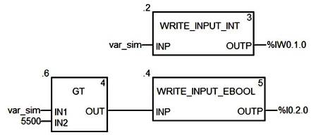

Рис.4.5. Приклад використання WRITE_INPUT_INT та WRITE_INPUT_EBOOL

Функції *WRITE_INPUT_EBOOL* та *WRITE_INPUT_INT* можна також використовувати і для зміни значень входів реального ПЛК. 

## 4.3. Налагодження програми користувача

### Використання анімаційних засобів редакторів 

Компільовані секції програм в режимі *online* по замовченню відображаються в анімаційному вигляді. Включення та виключення анімації проводиться через команди головного меню *Services->Animation*.

У редакторах всіх мов програмування можна задіяти засоби відлагодження *Debug*, які дають можливість визначати точки зупинки виконання програми користувача (*BreakPoint*), та покрокового виконання її секцій. Зверніть увагу, що точка переривання призупиняє виконання Задачі, в якій вона використана! 

Засоби *WatchPoint* дають можливість відображати стан змінних в потрібному місці програми. Слід зазначити, що по замовченню, у всіх засобах відображення показані значення змінних у кінці Задачі MAST. Утиліта *Inspect Window* дає можливість відображення стану потрібних змінних у "зручному" місці секції. 

У анімаційному режимі всі дискретні змінні підсвічуються зеленим в стані лог. "1" та червоним в стані лог. "0". Всі інші типи змінних підсвічуються жовтим кольором. У графічних мовах (LD, FBD, SFC) контакти та з’єднувальні лінії, по яким "проходить сигнал або струм" підсвічуються зеленим, а по яким "не проходить" – червоним. Таким чином, наприклад в LD можна визначити де "обірвався" логічний ланцюжок. 

У секціях графічних мов програмування, показуються числові значення аргументів функцій та функціональних блоків. У текстових мовах (ST, IL) числові значення змінних підсвічуються при наведені мишкою. У анімаційному режимі, в контекстному меню блоків доступні додаткові команди, зокрема на зміну значення змінних. 

Редактор SFC додаткові можливості управління виконанням кроків (див. параграф 3.10.7). Для цього необхідно активувати спеціальну панель управління, при відкритій секції SFC в режимі онлайн: *Services* *->Animation* *Panel->Show* *Animation* *Panel*. Зовнішній вигляд панелі зображений на рис.4.6, а призначення команд вказане в таблиці 4.2. 

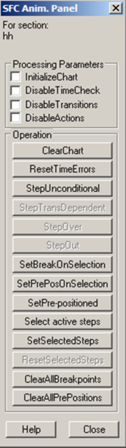

Рис.4.6. Панель управління SFC

Таблиця 4.2. *Команди панелі управління* *SFC.*

|                          | Область  параметрів (Parameters): параметри  виставляються опціями |
| ------------------------ | ------------------------------------------------------------ |
| Initialize Chart         | Для відкритої SFC секції:   - при активації опції - відключаються активні кроки;  - при деактивації опції - активується перший  крок |
| Disable Time Check       | опція виставляється для відключення перевірки часу  виконання кроків |
| Disable Transitions      | опція виставляється для переходу в режим деактивації  переходів (заморозки), при якому маркер в SFC  управляється командами *Step* *Trans* *Dependent,* *Step* *Over* *і* *Step* *Out* |
| Disable Actions          | всі дії деактивуються                                        |
|                          | **Область дій (Operation): команди запускаються кнопками**   |
| Clear Chart              | деактивувати активні кроки                                   |
| Reset Time Errors        | скинути біти контролю помилок *tminErr,* *tmaxErr*           |
| Step Unconditional       | перейти на наступний крок, незалежно від виконання  умови переходу. Команда не спрацьовує,   поки час виконання менше часу затримки для кроку. |
| Step Trans Dependent     | активна в режимі деактивації переходів (заморозки):  якщо спрацьовує умова переходу, перейти на наступний  крок; секцію залишити в режимі заморозки незалежно від результату переходу; |
| Step Over                | активна в режимі деактивації переходів (заморозки):   виконувати секцію в нормальному режимі (не  заморозки) до спрацювання умови переходу, після чого перейти на наступний  крок і знову активувати режим заморозки; |
| Step Out                 | активна в режимі деактивації переходів (заморозки) і  при відкритій макросекції:   виконувати секцію в нормальному режимі (не  заморозки) до виходу з макросекції, після чого знову перейти в режим  заморозки |
| Set Break On Selection   | встановити точки переривання на виділені кроки               |
| Set Pre Pos On Selection | встановити мітки на виділені кроки для забезпечення  переходу командою Set Pre-positioned |
| Set Pre-positioned       | перейти на кроки, які помічені командою Set Pre Pos On Selection |
| Select active steps      | виділити в редакторі активні кроки                           |
| Set Selected Steps       | активувати виділені кроки (передати їм маркер)               |
| Reset Selected Steps     | деактивувати виділені кроки (тільки при активному  мультимаркері) |
| Clear All Breakpoints    | видалити всі точки переривання                               |
| Clear All Pre-Positions  | видалити всі мітки переходу, встановлені командою Set Pre Pos On Selection |

 

### Використання анімаційних таблиць 

Традиційним способом відображення та зміни значень змінних у середовищі програмування ПЛК є табличний. У UNITY PRO такі таблиці називаються *Анімаційними таблицями* (*Animation Tables*). Їх можна створити в контекстному меню розділу *Animation Tables* в *Project Browser*, або в контекстному меню виділеної частини програми через команду *Initialize Animation Tables* (рис.4.7). 

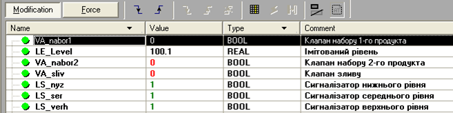

Рис.4.7. Анімаційна таблиця. 

Анімаційні таблиці UNITY PRO дають можливість продивлятися стан потрібних змінних в зручному форматі (10-ковий, 16-ковий, 2-ковий та символьний) та їх модифікувати. Для можливості зміни змінних в анімаційній таблиці, необхідно активувати режим *Modification* (рис.4.7). Зміна формату відображення вибирається через контекстне меню.

Анімаційні таблиці можна зберігати в проекті, а також при необхідності в ПЛК (задається опціями проекту *Upload* *Information*). 

### Використання операторських екранів 

*Операторські екрани* (*Operator Screens*) в UNITY PRO дають можливість відображати та змінювати значення змінних за допомогою анімованих графічних елементів. Функціональність операторських екранів наближена до функціональності графічних операторських панелей, що дає дуже потужний і зручний механізм для налагодження програми (рис.4.8). Однак слід зазначити, що операторські екрани не призначені для використання їх операторами на виробництві, а тільки для програміста або наладчика установки з ПЛК. 

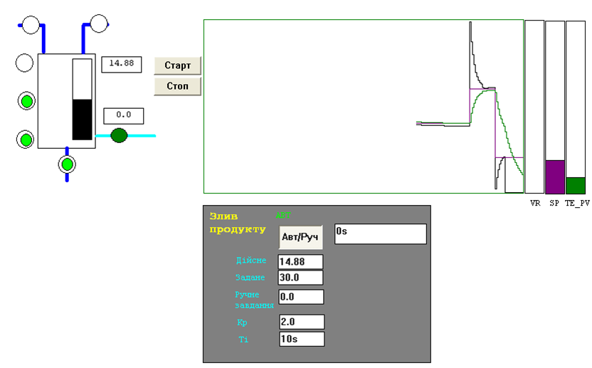

Рис.4.8. Приклад операторського екрану UNITY PRO

Операторські екрани UNITY PRO дозволяють:

-     створювати багато-екранний графічний людино-машинний інтерфейс з можливістю швидкого перемикання між екранами за допомогою кнопок;

-     рисувати векторні графічні елементи у вигляді різних геометричних фігур (круг, еліпс, прямокутник, лінія, крива, полігон) та імпортувати растрову графіку; 

-     відображати текст;

-     показувати значення змінних: 

o  зміною відображення будь якого графічного елементу;

o  у числовому вигляді різного формату (10-ковий, 16-ковий, 2-ковий, символьний);

o  у строковому вигляді;

o  у вигляді стовпчикової діаграми;

o  у вигляді тренду (самописцю);  

-     змінювати значення змінних за допомогою елементів управління (Control):

o  кнопок та перемикачів;

o  повзунків різного зображення;

o  елементів вводу значень змінних з клавіатури.

-     об’єднувати елементи в групи (об’єкти) та збереження їх в бібліотеці UNITY PRO; використовувати існуючі об’єкти з бібліотеки Operator Screen Library.   

Створюються екрани в розділі проекту *Operator Screens* (рис.4.9). Для можливості зміни значень в операторських екранах необхідно викликати команду *Services -> Enable Variable Modification*.

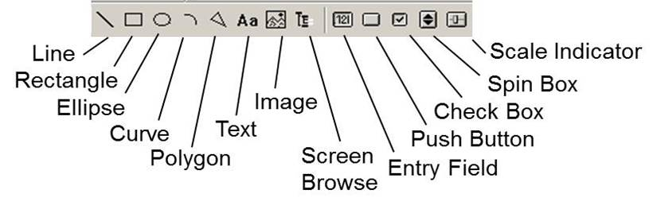

Рис.4.9. Панель графічних елементів операторських екранів UNITY PRO

Всі графічні елементи, які можуть бути розміщені на екранах умовно діляться на 4-ри групи: 

-     *стандартні елементи*: лінія (Line), прямокутник (Rectangle), еліпс (Ellipse), крива (Curve), ломана (Polygone), текст (Text);

-     *зображення* (Image): растрові файли з розширенням BMP або JPG.

-     *елементи управління* (Command): кнопка (Push Button), прапорець (Check Box), поле вводу (Entry Field), лічильник (Spin Box), кнопка переходу між екранами (Screen Browse), повзунок (Scale Indicator); 

-     *згруповані елементи* в один об’єкт. 

Властивості графічних елементів доступні в їх контекстному меню. Тут зупинимося коротко тільки на основних властивостях. Для всіх елементів є доступна вкладка *Animation*, в якій вказується змінна (поле *Variable*), в залежності від якої буде анімуватися (змінювати своє зображення) даний елемент. Для елементів управління доступна також вкладка *Control*, де вказується змінна (поле *Variable*), яку буде змінювати оператор через цей елемент. Інші вкладки і властивості залежать від конкретного елемента. У табл. 4.3 показані основні типи анімацій та команд, які можна зробити за допомогою графічних елементів. 

*Таблиця 4.3*. Анімації та дії, які доступні в елементах операторських екранів

| Анімація або  команда                                       | Елемент для  якого доступна  анімація/команда | Налаштування                                                 |
| ----------------------------------------------------------- | --------------------------------------------- | ------------------------------------------------------------ |
| показати/сховати елемент в залежності від булевої  змінної  | будь який елемент                             | У полі *Animation->Variable* вказується змінна або адреса типу BOOL/EBOOL, а у *Display* *Condition* вибирається опція:   *BIT=0*, якщо елемент повинен бути видимий тільки при 0,    *BIT=1*, якщо елемент повинен бути видимий при 1 |
| показати/сховати елемент в залежності від  числової змінної | будь який елемент                             | У полі *Animation->Variable* вказується змінна або адреса числового  типу, в *Display* *Condition* (умова видимості) вибирається опція з умовою  видимості |
| відобразити числове значення                                | текст (Text)                                  | У полі *Animation->Variable* вказується змінна або адреса числового типу, на вкладці *Animation Type* вибирається опція *Value* та формат  відображення |
| стовпчикова діаграма                                        | Прямокутник (Rectangle)                       | У полі *Animation->Variable* вказується змінна або адреса числового типу, на  вкладці *Animation* *Type* вибирається  опція *Bar* *Chart*, через  кнопку ">" вихід в додаткове вікно налаштування, в якому  вибирається тип діаграми, межі зміни, межі нормального значення, межі та  колір аварійних значень |
| трендова діаграма, самописець                               | Прямокутник (Rectangle)                       | У полі *Animation->Variable* вказується змінна або адреса числового типу, на  вкладці *Animation* *Type* вибирається  опція *TrendDiagram*, через кнопку ">" вихід в додаткове  вікно налаштування, в якому вибираються межі діаграми, колір, періодичність  оновлення, кількість точок на графіку; зробивши фон прямокутника прозорим  можна наложити трендові діаграми один на одного, зробивши ефект декількох  пір’їв на одному графіку |
| змінити значення булевої змінної                            | кнопка (Push Button), прапорець (Check  Box)  | У полі *Control->Variable* вказується  змінна або адреса типу *BOOL/EBOOL*; для *Push Button* можна виставити опцію *With  Latching*, щоб кнопка  працювала з фіксацією |
| записати числову константу в змінну                         | кнопка (Push Button),                         | У полі *Control->Variable* вказується змінна або адреса числового типу, в  полі *Control->Value* вказується  значення константи |
| ввести значення числової змінної                            | поле вводу (Entry Field)                      | У полі *Control->Variable* вказується змінна або адреса числового типу, на цій  же вкладці вказуються межі для значення, що вводиться |
| змінити значення повзунком                                  | повзунок (Scale Indicator)                    | У полі *Control->Variable* вказується змінна або адреса числового типу, на цій  же вкладці вказуються межі для значення та тип повзунка:  горизонтальний/вертикальний |
| збільшити/зменшити значення на 1                            | лічильник (Spin Box)                          | У полі *Control->Variable* вказується змінна або адреса числового типу, на цій  же вкладці вказуються межі для значення та тип повзунка:  горизонтальний/вертикальний |
| перейти на іншу сторінку                                    | кнопка переходу між екранами (Screen Browse)  | У полі *ScreenBrowse->Value* вказується  номер сторінки, куди необхідно перейти |

 

## 4.5. Діагностика роботи ПЛК

### Загальні принципи діагностики роботи ПЛК

Засоби ПЛК та UNITY PRO дають можливість діагностувати роботу ПЛК та технологічного процесу. Огляд засобів UNITY PRO для діагностики технологічного процесу виходить за рамки даного посібника. У даному розділі розглянуті тільки програмні та апаратні засоби для діагностики роботи самого ПЛК.

Діагностика роботи ПЛК – це вияв факту несправності в процесі функціонування ПЛК та ідентифікація причини несправності. Надалі несправність будемо називати *помилкою*. 

У загальному, діагностичні засоби ПЛК та UNITY PRO можна умовно поділити на три групи:

-     апаратні засоби діагностики ПЛК: індикаторні лампи, аварійні реле та кнопки, які знаходяться на модулях ПЛК;

-     діагностичні засоби середовища UNITY PRO: діагностичні вікна середовища в режимі онлайн;

-     програмні засоби діагностики: об’єкти UNITY (змінні, комірки пам’яті) та діагностичні FFB.     

Всі наведені засоби взаємопов’язані і можуть використовуватися як окремо, так і в комплексі.

Усі помилки умовно можна поділити на три групи:

-     не блокуючі помилки:  ті які не приводять до зупинки ПЛК;

-     блокуючі помилки: ті які приводять до аварійної зупинки ПЛК (до режиму HALT);

-     помилки операційної системи: ті які приводять до відмови роботи OS UNITY

*Не блокуючі помилки* зв’язані з неправильною роботою каналів вводу/виводу. Як правило ці помилки не являються небезпечними для всієї системи, тому не приводять до аварійної зупинки ПЛК. Однак, якщо помилка, зв’язана з відмовою, або некоректною роботою каналу повинна привести до зупинки ПЛК, можна скористатися програмною діагностикою (див. параграф 4.5.4) та інструкцією або функцією *HALT*. Помилки каналів вводу/виводу відображаються індикаторами *I/O* на панелях модулів, діагностичних вікнах UNITY PRO та в об’єктах UNITY. 

*Блокуючі помилки* виникають від неправильної роботи програми користувача, тому операційна система блокує роботу програми, переводячи ПЛК в режим *HALT*. Ці помилки можуть бути зв’язані з неправильною організацією циклів і переходів (приводить до спрацювання сторожового таймеру), з помилками SFC, з некоректними результатами розрахунків (при *%S78=1*), або з програмним викликом інструкції або функції *HALT*. У режимі *HALT* на панелі модуля CPU мигає індикаторна лампа *ERR*. Також помилка відображається в діагностичних вікнах UNITY PRO та в об’єктах UNITY. 

*Помилки операційної системи* приводять до відмови роботи ПЛК. У цьому режимі не функціонує (або ненормально функціонує) операційна система OS UNITY. Це може бути пов’язано з апаратними помилками процесорного модулю або шасі. У цій ситуації стан індикаторних ламп може бути різним, окрім індикатору *ERR* на модулі CPU, він буде світитися. Враховуючи, що OS UNITY в цьому режимі не функціонує, з’єднатися з UNITY PRO немає можливості.

### Апаратні засоби діагностики ПЛК

Усі модулі ПЛК Modicon М340 та TSX Premium мають дисплейний блок (панель) для діагностики їх роботи. 

У таблиці 4.4 наведений перелік станів деяких індикаторів на панелі процесорних модулів ПЛК M340 та TSX Premium. 

Таблиця 4.4. *Стан деяких індикаторів панелей процесорних модулів* *M340* *та* *TSX* *Premium.*

| Індикатор          | Світиться                                                    | Мигає                                                        | Не світиться                                            | Примітка               |
| ------------------ | ------------------------------------------------------------ | ------------------------------------------------------------ | ------------------------------------------------------- | ---------------------- |
| RUN (зелений)      | ПЛК в  режимі RUN                                            | ПЛК в  режимі STOP або HALT                                  | ПЛК не  містить виконавчого проекту                     |                        |
| ERR (червоний)     | Виявлена  помилка операційної системи                        | ПЛК не  містить виконавчого проекту або в режимі HALT або  помилка  карти пам’яті (тільки в TSX Premium) | немає  помилок операційної системи                      |                        |
| I/O (червоний)     | помилка  на одному з каналів вводу/виводу ПЛК                | помилка  X BUS (тільки в TSX Premium)                        | немає  помилок зв’язаних з каналами                     |                        |
| CARDERR (червоний) | відсутня SD карта, або має невірний формат,  або містить виконавчий проект, відмінний від завантаженого в пам’ять ПЛК |                                                              | формат  SD карти коректний, виконавчі проекти ідентичні | тільки  в М340         |
| TER (жовтий)       |                                                              | йде  обмін через порт TER/AUX, інтенсивність мигання вказує  на інтенсивність обміну | немає  обміну через порт TER/AUX                        | тільки  в TSX  Premium |
| SER  COM (жовтий)  |                                                              | йде  обмін через послідовний порт                            | немає  обміну через послідовний порт                    | тільки  в М340         |

Кожний дискретний модуль має дисплейний блок, на якому розташовані індикатори стану модуля: *RUN* (зелений), *ERR* i *I/O* (червоний), а також індикатори з позначенням номерів каналів входів-виходів. Кількість цих індикаторів відповідає кількості каналів модуля. Максимальна кількість таких індикаторів – 32. Якщо модуль розрахований на більшу кількість каналів (64), то у нижній частині дисплею розташована кнопка переключення на іншу групу з 32 каналів. При цьому у верхній частині дисплея загорається індикатор "+32". Індикатори каналів висвітлюються при спрацьовуванні відповідного каналу. 

У нормальному стані модуля крім індикаторів стану каналів повинен горіти тільки індикатор *RUN*. Висвітлення індикаторів *ERR* або сигналізує про виявлення системою самодіагностики відмови модуля, а *I/O* – помилку окремих його каналів. 

Як і модулі дискретних входів/виходів, модулі аналогових каналів мають дисплейний блок із розташованими на ньому трьома індикаторними лампами *RUN*, *ERR* i *I/O*, які відображають режим роботи модуля і можливі несправності.

Додаткову інформацію про стан індикаторів модулів M340 та TSX Premium можна отримати у довідниковій системі UNITY PRO.

### Діагностичні засоби середовища UNITY PRO

Середовище UNITY PRO в режимі онлайн надає користувачу можливість подивитися стан ПЛК та провести додаткову діагностику, недоступну з індикаторних панелей. Слід зазначити, що всі діагностичні можливості середовища UNITY PRO базуються на об’єктах UNITY, а отже доступні і програмі користувача в режимі її виконання. Винятком є вияв блокуючих помилок та їх причин, так як в цьому випадку програма користувача не виконується (режим *HALT*). 

Ряд діагностичних засобів вже розглядалися в посібнику, зокрема індикатори панелі статусу. Інші діагностичні засоби (вікна) середовища UNITY PRO можна поділити на дві групи: діагностичні екрани та утиліта *DiagnosticViewer*.    

*Діагностичні екрани* (*diagnostic* *screens*) доступні в розділі проекту *Configuration*. У онлайн режимі вікно конфігурації ПЛК відображає стан всіх модулів ПЛК. На рис.4.31 показаний приклад діагностичних екранів для виявлення помилки. Прокоментуємо послідовність виявлення несправності.

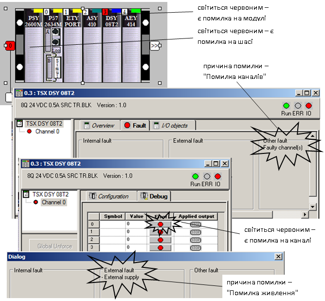

Рис.4.31. Приклад діагностичних екранів для модуля дискретних виходів

У даному прикладі індикатор *I/O* світиться на процесорному модулі та на модулі *TSX* *DSY* *08T2*, який знаходиться на 3-му посадочному місці 0-го шасі. У діагностичному екрані конфігурації видно, що 0-ве шасі світиться червоним, отже на ньому є помилка зв’язана з каналами вводу/виводу. Модуль дискретних виходів теж позначений червоним. Подвійний клік по модулю приведе до виклику діагностичного екрану модулю, в якому крім стану індикаторів на вкладці *Fault* доступна причина помилки. Враховуючи що дана помилка пов’язана з каналами ("*Faulty* *channel(s)*"), відкриваємо діагностичні екрани каналів на вкладці "*Debug*". Клік по каналу відкриє його діагностичний екран, де відобразиться помилка каналу. У даному випадку це помилка живлення виходів. Якби опцію "*Supply* *Monitoring*" відключили при конфігуруванні модуля, тоді б помилка не виникала.

З діагностичного екрану процесорного модуля (вкладка *Animation*) можна отримати інформацію про стан Задач, час виконання останнього циклу і максимальний та мінімальний час виконання Задач, причину останньої зупинки ПЛК а також запустити деякі команди: холодний старт, теплий рестарт, переведення виходів в безпечний стан, активація/деактивація Задач (рис.4.32). Крім того, екран дає можливість налаштувати годинник реального часу ПЛК (вкладка *Real-Time* *Clock*).    

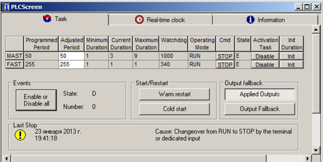

Рис.4.32. Діагностичний екран для процесорного модуля 

 Утиліта UNITY PRO *Diagnostic* *Viewer* призначена для роботи з діагностичним буфером ПЛК. *Діагностичний буфер* ПЛК (*Diagnostics* *Buffer*) призначений для збереження списку повідомлень в пам’яті ПЛК. Його функції аналогічні функціям списку тривог в засобах SCADA/HMI, тому надалі всі повідомлення будемо називати також тривогами. Тривоги в діагностичному буфері можуть потребувати підтвердження (квітування) оператором. Так чином тривоги в діагностичному буфері будуть зберігатися до тих пір поки триває причина їх виникнення і не буде підтвердження оператору. 

Діагностичний буфер може наповнюватися (див. рис 4.33):

-  системними повідомленнями; для цього в настройках проекту необхідно виставити відповідну опцію (*Tools->Project settings->General->PLC Diagnostics->System Diagnostics*);

-  програмними повідомленнями: діагностичними FFB та діагностичними повідомленнями SFC; для активування програмної діагностики необхідно в настройках проекту виставити відповідну опцію (*Tools->Project settings->General->PLC Diagnostics->Application Diagnostics*); 

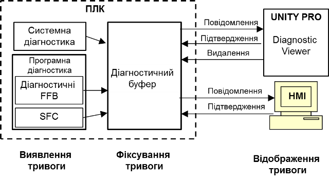

Рис.4.33.Робота з діагностичним буфером

Діагностичний буфер можна переглядати і підтверджувати тривоги вбудованою в UNITY PRO утилітою *Diagnostic* *Viewer* або засобами HMI, такими як операторські екрани XBT Magelis, або Веб сторінки ПЛК. Утиліта *Diagnostic* *Viewer* крім цього дає оператору можливість видалити повідомлення з буферу. Загальний вигляд *Diagnostic* *Viewer* показаний на рис.4.34, викликається він через меню *Tools-> Diagnostic* *Viewer*. Детальну інформацію про роботу та налаштування *Diagnostic* *Viewer* можна отримати з довідникової системи UNITY PRO.

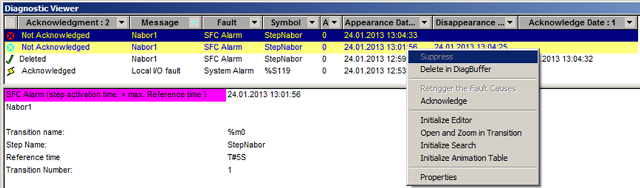

Рис.4.34.Загальний вигляд *Diagnostic Viewer*

 

### Програмні засоби діагностики

OS UNITY дозволяє програмно обробляти помилки ПЛК. Слід нагадати, що програмно можна обробити тільки неблокуючі помилки, так як при інших типах помилок програма користувача не виконується. Для програмної обробки помилок можуть бути використані різні об’єкти UNITY:

-     системні біти і слова - для виявлення факту помилки;

-     дані каналів вводу/виводу (об’єкти вводу/виводу) - для виявлення факту і причини помилки;

-     діагностичні FFB - для роботи з діагностичним буфером.

Системні біти і слова використовуються для діагностики роботи ПЛК в цілому. Перелік деяких системних бітів і слів наведений в параграфі 3.4.5. Об’єкти вводу/виводу (див. параграф 3.4.6) дають можливість виявити номер модулю та каналу, на якому присутня помилка, а також причину помилки.  Діагностичні FFB дозволяють записувати/видаляти в діагностичний буфер помилки зв’язані з тривогами в технологічному процесі. 


Рис.4.35.Фрагмент анімаційної таблиці діагностики каналів 

Для прикладу розглянемо ситуацію, яка показана на рис.4.31. Наявність помилки вводу/виводу на процесорі (горить індикатор I/O) відображається також на системному біті *%S10,* який буде рівним *FALSE*. Системний біт *%S40* дорівнює *FALSE,* що значить наявність помилки I/O на шасі з номером 0. Враховуючи що інших шасі в даному випадку немає, помилки на них теж відсутні, тому біти *%S41-%S47* залишаються в стані *TRUE*. Стан наведених системних бітів для даної ситуації показаний на рис.4.35. 

Для виявлення модулю (-лів) з помилкою вводу/виводу, необхідно перевірити стан комірок *%Ir.m.MOD.ERR*. У даному прикладі у нас є 5 модулів: 1 модуль живлення, 1 процесорний модуль, 3 модуля вводу/виводу. Однак діагностика модуля живлення засобами UNITY PRO не проводиться, а процесорний модуль займає 0-ву і 1-у позицію на шасі. У даному випадку 0-ву позицію умовно займає сам CPU (*P572634M*) а 1-шу - інтегрований комунікаційний порт Ethernet (*ETY* *PORT*). Таким чином, необхідно перевірити 5-ть комірок типу *%Ir.m.MOD.ERR*:  

*%I0.0.MOD.ERR* – для CPU TSX P572634M;

*%I0.1.MOD.ERR* – для комунікаційного порту Ethernet;

*%I0.2.MOD.ERR* – для TSX ASY410;

*%I0.3.MOD.ERR* – для TSX DSY08T2;

*%I0.4.MOD.ERR* – для TSX AEY414;

Слід розуміти, що модуль CPU теж має канали вводу/виводу (0 - порт TER/AUX, 1 – порт PCMCIA) тому його теж треба діагностувати на наявність неблокуючих помилок. Так само і помилки комунікаційного порту Ethernet будуть відображатися в комірці *%I0.1.MOD.ERR*. У даній ситуації помилка знаходиться на модулі TSX DSY08T2 (див.рис.4.31), тому значення комірки *%I0.3.MOD.ERR* буде рівним *TRUE*, а інших - *FALSE.* Крім того, всі комірки *%I0.1.0.ERR…%I0.1.7.ERR*  будуть теж рівними *TRUE,* так як відповідно до рис.4.31 всі канали дають помилку вводу/виводу. Загальна картина значень об’єктів вводу/виводу показана на рис.4.35 в анімаційній таблиці. 

 Для отримання додаткової інформації про причину помилки, використовуються інші об’єкти вводу/виводу. Для цього зручно скористатися *IODDT* на основі вибраного каналу, створення яких розглянуте у параграфі 3.4.6. У даному випадку для каналу модуля TSX DSY08T2 необхідно вибрати тип *T_DIS_OUT_STD*. Перелік та значення полів такої змінної для каналу *%CH0.3.0* з назвою "*DO_0_3_0"* показаний на рис.4.36. Однак ряд полів змінної, тобто ряд об’єктів вводу/виводу, а саме комірки з області *%MW*, не оновлюються автоматично значенням стану з каналу. Для оновлення треба запустити функцію *READ_STS*. Розгляд правил виклику функції виходить за рамки даного посібника. У загальному випадку на мові *ST* цей виклик мав би наступний вигляд: 

```pascal
READ_STS(DO_0_3_0);
```

Після виклику функції, та перевірки повернення результату, змінна *DO_0_3_0* матиме вигляд як на рис.4.36. Поле *EXT_PS_FLT=TRUE*, це значить, що виявлена помилка зв’язана з проблемою живлення каналу. Аналогічну помилку показав діагностичний екран каналу з рис.4.31.  


Рис.4.36.Фрагмент анімаційної таблиці з відображенням стану змінної IODDT 

Програмна обробка помилок може крім виявлення помилки забезпечити певні операції з аварійного захисту, переключення в резерв, зупинки (*HALT*) тощо. Можна також передати діагностичну інформацію на засоби SCADA/HMI використовуючи звичайні змінні або діагностичний буфер.  

У параграфі 4.5.3 наведені принципи роботи з діагностичним буфером. Один із варіантів застосування діагностичного буферу – використання його в якості списку тривог. Тобто в діагностичний буфер можна заносити не тільки системні помилки, а і інші повідомлення, які зв’язані з характером протікання технологічного процесу. Для управління повідомленнями в діагностичному буфері використовуються FFB з бібліотеки *Diagnostics*. Розгляд цієї бібліотеки виходить за рамки даного посібника, для детальнішої інформації звертайтесь до довідникової системи UNITY PRO. 

## Контрольні запитання

1.   У яких режимах може знаходитись працюючий ПЛК?Чим ці режими відрізняються і як відбувається перехід між режимами?

2.   Розкажіть про випадки, в яких відбувається холодний старт. Які стадії проходить ПЛК при холодному старті?

3.   Розкажіть про випадки, в яких відбувається теплий рестарт. Які стадії проходить ПЛК при теплому рестарті?

4.   Розкажіть про режими *offline* та *online*. Чи можливо перейти в *online* режим, якщо виконавчі проекти в ПЛК та в UNITY PRO відрізняються?

5.   Яким чином задається адреса того ПЛК (імітатора ПЛК) з яким необхідно з’єднатися? 

6.   Як вказати в середовищі Unity PRO, з чим саме необхідно провести з’єднання: з імітатором ПЛК чи з реальним ПЛК?

7.   Де настроюються драйвери для з’єднання з ПЛК? Які драйвери протоколів використовують для зв’язку з М340 а які для TSX Premium? 

8.   Які можливості надає UNITY PRO в режимі *онлайн*?

9.   У якому режимі необхідно з’єднатися з ПЛК, щоб мати можливість змінити програму (виконавчий проект)? 

10.   Скільки терміналів Unity PRO можна підключити в режимі програмування? Чи можна підключати декілька терміналів Unity PRO в режимі *Monitoring*?

11.   Розкажіть про режими *EQUAL* та *DIFFERENT*. Чи можна частково змінити програму в ПЛК в режимі *DIFFERENT*?

12.   Чим відрізняються команди *Build Changes* та *Rebuild All*? Коли неможливо зробити часткову компіляцію? До чого приводить завантаження *всього* виконавчого проекту в ПЛК?

13.   Яким чином в UNITY PRO можна перевірити синтаксичні помилки в програмі? 

14.   Які команди доступні для управління операційним режимом ПЛК в режимі *онлайн*?

15.   Які опції проекту необхідно включити, щоб завантажити вихідні проектні дані в ПЛК, з можливістю їх подальшого вивантаження? 

16.   Навіщо потрібен імітатор ПЛК UNITY? Які можливості він дає, та які обмеження має в порівнянні з реальним контролером?

17.   Чи можливо зробити з’єднання з імітатором ПЛК, який завантажений на іншому комп’ютері?

18.   Яким чином можна змінювати вхідні змінні (прив’язані до *%I/%IW*) ПЛК або імітатору програмним шляхом?

19.   Якими засобами можна скористатися для перевірки роботи програми користувача в ПЛК?

20.   У якій частині циклу ПЛК по замовченню відображаються змінні у засобах відображення змінних Unity PRO? Яким чином можна змінити точку (місце) перегляду змінних?

21.   Якими засобами можна скористатися для покрокового виконання програми?

22.   Назвіть основні анімаційні засоби та засоби зміни значень змінних в редакторах програм користувача.

23.   Назвіть основні можливості анімаційних таблиць. Яким чином можна зберегти анімаційні таблиці в проекті?

24.   Назвіть основні можливості операторських екранів. 

25.   Які основні етапи можна виділити при налагодженні програми користувача?

26.   Як на роботу ПЛК впливають різні типи помилок? Наведіть приклади неблокуючих, блокуючих помилок та помилок операційної системи.

27.   Наведіть основні засоби діагностики які присутні в ПЛК M340 та TSX Premium.

28.   Поясніть яким чином по індикаторним панелям модулів ПЛК можна визначити режим його роботи та виявити факт та причину помилок.

29.   Поясніть яким чином, використовуючи діагностичні засоби середовища UNITY PRO можна визначити режим роботи ПЛК та виявити факт та причину помилок.

30.   Розкажіть про принципи роботи з діагностичним буфером ПЛК та про функції вбудованої в UNITY PRO утиліти *Diagnostic* *Viewer*.

31.   Поясніть яким чином, використовуючи програму користувача, можна визначити факт та причину неблокуючих помилок.


## Автори


Теоретичне заняття розробив [Олександр Пупена](https://github.com/pupenasan). 

## Feedback

Якщо Ви хочете залишити коментар у Вас є наступні варіанти:

- [Обговорення у WhatsApp](https://chat.whatsapp.com/BRbPAQrE1s7BwCLtNtMoqN)
- [Обговорення в Телеграм](https://t.me/+GA2smCKs5QU1MWMy)
- [Група у Фейсбуці](https://www.facebook.com/groups/asu.in.ua)

Про проект і можливість допомогти проекту написано [тут](https://asu-in-ua.github.io/atpv/)
