[<- До підрозділу](README.md)		[Коментувати](#feedback)

# Вступ до Control Expert: теоретична частина

## 1. Архітектура EcoStruxure

Хоч даний посібник більшою мірою стосується програмованих контролерів, зокрема Modicon M580 і середовища розробки Control Expert, готові рішення для автоматизації не обмежуються ним. Класичні системи керування технологічними процесами відповідно до структури епохи "Індустрії 3.0" передбачають наявність різноманітних засобів збору та керування, людино-машинного інтерфейсу та збору даних а також інтеграцію з засобами рівня керування виробництвом. За останні 10 років ситуація кардинально змінилася. Тому варто розглянути бачення всієї інфраструктури до якої має відношення промислові контролери та Control Expert а також їх місце в ній. 

Світовий тренд сучасної промисловості (Індустрії 4.0/5.0) висуває на перший план концепцію **Інтернету речей (IoT, Internet of Things)** - інфраструктуру взаємопов’язаних сутностей, людей, систем та інформаційних ресурсів разом із сревісами, які обробляють та реагують на інформацію з фізичного світу та віртуального світу (ISO/IEC 20924:2021). Використання IoT в промисловості отримало назву **Індустріальний Інтернет речей (IIoT)**, що відкриває нові можливості для автоматизації, аналітики й оптимізації ресурсів. Компанія Schneider Electric пропонує практично всі необхідні компоненти для реалізації цього підходу починаючи від давачів і контролерів до систем керування та хмарних платформ. Логічним втіленням цієї стратегії стала концепція EcoStruxure™, що об’єднує апаратне й програмне забезпечення, інструменти сервіси в єдиній відкритій архітектурі.

**EcoStruxure™** від Schneider Electric – це відкрита, безпечна, сумісна архітектура та платформа, яка підтримує IoT і принцип plug-and-play. Вона застосовується для чотирьох ключових сегментів ринку, де Schneider Electric має експертизу та рішення - будівлі (Building), дата-центри (Data Center), промисловість (Industry) та енергетичні мережі (Grid). Для цих сегментів визначено шість доменів:

- **EcoStruxure Building** - керування та створення інтелектуальних будівель; підтримує цифрову інтеграцію систем і аналітику для ефективного керування об’єктами на кшталт лікарень, готелів та офісів.
- **EcoStruxure Power** - керування системами розподілу електроенергії; забезпечує збір і аналіз даних у реальному часі, підтримку предиктивного обслуговування та інструменти для підвищення надійності й продуктивності енергетичної інфраструктури.
- **EcoStruxure IT** - керування центрами обробки даних; включає інструменти проєктування та розміщення серверних шаф, систем живлення й охолодження, а також хмарні рішення класу DCIM(Data Center Infrastructure Management), незалежні від виробника обладнання.
- **EcoStruxure Machine** - рішення для виробників обладнання (OEM) та машинобудування; підтримує моніторинг, керування й обслуговування машин, інтеграцію у виробничі лінії та використання відкритих стандартів комунікації.
- **EcoStruxure Plant** - керування виробничими підприємствами; забезпечує контроль ризиків, моніторинг показників у реальному часі, інтеграцію даних і аналітику для підвищення ефективності, надійності та безпеки виробництва.
- **EcoStruxure Grid** - керування електричними мережами; реалізує концепцію Smart Grid, застосовуючи сенсори, автоматизацію та цифрові технології для оптимізації виробництва, розподілу та споживання енергії, а також інтеграції відновлюваних джерел.

Кожен домен розроблений в концепції каркасу IoT, який означений в стандарті ISO/IEC-30141, що передбачає наявність кількох рівнів (рис.1):

- рівень речей, який в EcoStruxure має назву `Connected Products` (підключені продукти), що передбачає обладнання та процеси, з яких необхідно збирати дані та керувати, та польові пристрої що забезпечують збір та керування   
- рівень IoT пристроїв та шлюзів, який в IIoT називається Edge а в EcoStruxure - Edge Control, що забезпечує збір даних з нижнього рівня, керування в реальному часі та взаємодіє з верхнім рівнем;
- рівень сервісів, який в IIoT називається Platform а в EcoStruxure має назву Analytics & Services
- користувацький рівень, який в IIoT називається рівень застосунків а в EcoStruxure має назву Apps   

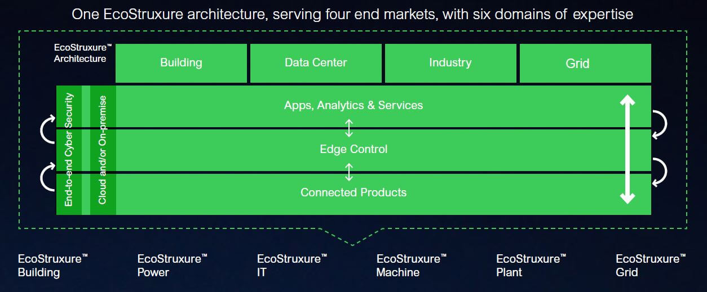

рис.1. Архітектура EcoStruxure ([джерело](https://news.bpx.co.uk/what-is-ecostruxure-from-schneider-electric/))

Серед особливостей рішень EcoStruxure є використання відкритих та стандартних технологій, що спрощує інтегрування не тільки між продуктами  Schneider Electric а і рішеннями від сторонніх виробників. Це дає можливість модернізувати вже існуючі системи та пропонувати рішення з використанням засобів інших компаній.

Програмне та апаратне забезпечення EcoStruxure™ Control Expert є частиною домену EcoStruxure™ Plant, що передбачає використання різноманітних засобів від Schneider Electric на всіх рівнях IIoT (рис.2). У практичному значенні це передбачає наступні переваги:

- пропонуються не просто засоби автоматизації а готові комплекси та рішення; для прикладу постачальник Schneider Electric пропонує не тільки контролер (наприклад Modicon M580) та необхідне ПЗ для програмування (Control Expert) а і SCADA програму (наприклад Plant SCADA), необхідні польові засоби (Porocess Insrtrumentation), засоби збору даних (наприклад Advantys STB), електроприводи (Altivar), комутаційне обладнання (TeSys), засоби локального людино-машинного інтерфейсу (Harmony)? різноманітні застосунки та сервіси верхнього рівня IIoT (наприклад Aveva MES);
- для кожного засобу пропонується способи інтегрування та сумісного використання з іншими засобами домену EcoStruxure™ Plant;
- у випадку модернізації засобів, передбачається їх інтеграція в архітектуру    

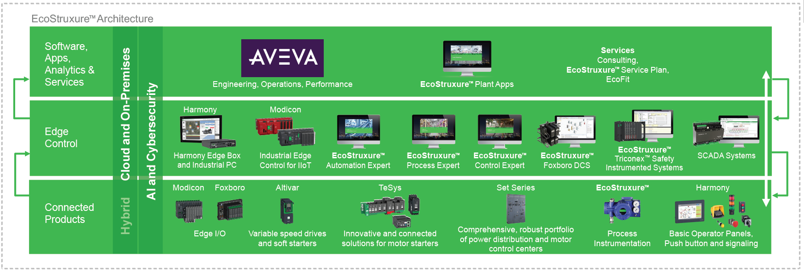

рис.2. Архітектура EcoStruxure™ Plant (джерело: Modicon M580 Catalog)

Однак це не значить, що засоби EcoStruxure™ Plant не можна використовувати в одній системі сумісно з засобами наприклад EcoStruxure™ Machine. Тим не менше, такі рішення є менш привабливі з точки зору швидкості розроблення та впровадження, зручності експлуатації та інших. Так, наприклад, Modicon M251 (з EcoStruxure™ Machine) може використовуватися в автоматизації технологічних процесів, однак має ряд обмежень щодо його використання, наприклад дуже обмежена можливість зміни програми в онлайні, а також не має простої інтеграції з Plant SCADA (автоматизоване створення бази даних змінних) і т.ін.

## 2. Основні поняття

Програмно-технічні засоби, які входять до складу автоматизованих систем керування технологічними процесами (**АСТКП**, рівня Edge Control згідно рис.2) , можна віднести до однієї з груп (рис.3):

- field - технічні засоби польового рівня (давачи, виконавчі механізми, вторинні перетворювачі);
- PLC/PAC - промислові контролери та регулятори;
- DIO/RIO - засоби розподіленої віддаленої периферії (винесені за межі контролерів засоби вводу/виводу);
- засоби SCADA/HMI (комп’ютери з програмним забезпеченням супервізорного керування та збору даних (SCADA), операторські панелі (HMI));
- інструментальні засоби розробки та налагодження виконавчих програм (програматори та спеціалізоване програмне забезпечення для створення, конфігурування та діагностики).

**PLC** (**ПЛК**, Progrmable Logic Controller) - це типова абревіатура, що значить "програмовані контролери". Хоча в абревіатурі існує слово "logic", наразі в розшифровці це слово не використовується, так як сучасні контролери виконують багато функцій керування в тому числі аналогового регулювання, що виходить за рамки звичайної логіки. Абревіатура **PAC** (Progrmable Automation Controller) почала вживатися порівняно недавно, і часто з різним трактуванням. У концепції EcoStruxure™ PAC - це контролер з просунутими функціями та відкритою архітектурою обміну з компонентами. У межах цього посібника ми будемо вважати терміни PLC, PAC та програмовані контролери синонімами, тому будемо писати через косу - PLC/PAC, або просто PLC. 

У той же час M580 мають особливу архітектуру, порівняно з іншими PLC, а саме можливість комунікувати з іншими модулями на шасі через Ethernet. Тобто крім локальної пропрієтарної шини від підтримує зв'язок через Ethernet, що надає можливість різним виробникам розробляти модулі для M580. Тому M580 позначають як **ePAC**, а першою літерою `e` маркують всі модулі що мають можливість зв'язку по задній шині через Ethernet.   

**EcoStruxure Control Expert** (раніше Unity Pro) - це програмна платформа для проєктування, конфігурування, програмування, налагодження та діагностики промислових контролерів Schneider Electric: Modicon M340, M580 і M580 Safety, Momentum (більше не виробляються), Premium (більше не виробляються), Quantum (більше не виробляються).

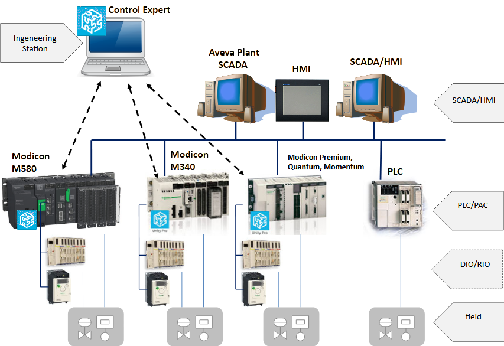


Рис.3.Середовище Control Expert в структурі АСКТП

Control Expert є продовженням розвитку UNITY PRO, який у свою чергу був результатом розвитку та інтегрування двох програмних продуктів: 

- PL7 PRO - середовище програмування контролерів TSX Micro і TSX Premium; 

- Concept - середовище програмування контролерів Modicon Momentum та Modicon Quantum. 

Середовище Control Expert може бути використане тільки для роботи з програмованих контролерів, в яких функціонує операційна система (умовно назвемо Control Expert OS) або більш старіша (умовно UNITY OS). Деякі контролери з прошивкою UNITY OS можуть програмуватися за допомогою UNITY PRO. У цьому контексті можна вважати що Control Expert це новіша версія UNITY PRO. Однак є кілька нововведень які відрізняють ці продукти. Тут зупинимося на одному з найважливіших - проєкти на Control Expert можуть розроблятися в одному з двох програмних середовищ:

- **Control Expert Classic** - програмне середовище для розроблення проєкту для одного промислового контролера. Це можна умовно вважати новою версією UNITY PRO
- **Control Expert** - це програмне середовище що використовується для розроблення проєкту для системи з кількома програмованими контролерами та їх периферії.  Control Expert містить менеджер топологій, за допомогою якого розробляється мережна структура, в яку входять програмовані контролери та інші пристрої.  Проєкт зберігається в репозиторії на сервері Control Expert Server, що дозволяє керувати різними версіями проєкту. Така структура дає можливість працювати над проєктом кільком розробникам одночасно. При редагуванні програмної частини та підсистеми локального вводу/виводу проєкту Control Expert, у фоновому режимі запускається Control Expert Classic, в якому присутні не всі елементи меню.

Розробляти проєкти можна у будь якому з середовищ, однак очевидно що для мультиконтролерних систем з кількома розробниками зручніше використовувати Control Expert. У цьому посібнику ми будемо розглядати тільки топології з одним контролером, тому усі приклади будуть на Control Expert Classic, хоча ми будемо називати скорочено Control Expert. У той же час ці приклади у більшості випадків однаково імплементуються в обидвох середовищах, якщо це не так, про це буде вказано. 

Отже обидва середовища при компілюванні генерують однакові скомпільовані проєкти для тієї самої версії PAC. У той же час варто відмітити, що старі контролери з прошивками відмінними від Unity OS не підтримуються ні у Control Expert ні в Unity PRO. Тобто, наприклад TSX Premium з операційною системою PL7, або Quantum з операційною системою Concept запрограмувати з використанням UNITY PRO неможливо. Винятком можуть бути деякі з цих контролерів, в які попередньо треба завантажити OS UNITY (для цих цілей використовується OS Loader). Тим не менше, Control Expert може імпортувати файли зі старих середовищ - PL7 PRO, Concept, чи Modsoft.   

Слід розділяти поняття "середовище розробки" та "середовище виконання" (рис.4). **Середовище виконання**  – це програмне забезпечення, яке виконується в PLC. Середовище виконання базується на операційній системі, яка вже знаходиться ("прошита") в загружчику PLC, і приймає участь в усіх операціях контролера. Тому навіть якщо PLC не запрограмований, або знаходиться в режимі `Stop` (зупинка), операційна система функціонує, і забезпечує діагностику PLC та діалог з ним через комунікаційні порти вводу/виводу. У режимі `RUN` (робота) середовище виконує програму користувача, яка є частиною виконавчого проекту, і створюється в середовищі Control Expert. Тобто в Control Expert проєкт розробляється, компілюється а виконується він у PLC.  

Під словом "користувач" тут і далі ми будемо вважати людину що працює з середовищем Control Expert, тобто розробника прикладної програми для PLC.

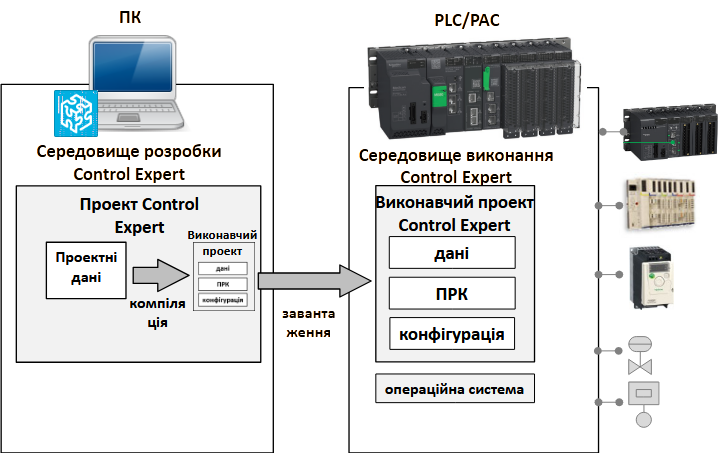

Рис.4. Середовище Control Expert та середовище виконання PLC

Слід також розуміти, що середовище розробки Control Expert не приймає участь в керуванні процесом, тому підключається до системи тільки при необхідності використання однієї з його функцій: 

- конфігурування апаратної частини виконавчого проекту PLC;
- конфігурування апаратної частини розподіленої периферії, які є функціональною частиною PLC (тільки для певних засобів розподіленої периферії Schneider Electric); 
- створення виконавчих програм користувача ;
- завантаження проекту в PLC;
- вивантаження/завантаження проектних даних (Upload Information);
- керування операційним режимом PLC: старт, стоп, ініціалізація;
- налагодження програми в PLC: перегляд та зміна змінних, зміна частини програми в режимі онлайн та ін.;
- діагностика роботи PLC;
- імітація роботи PLC для забезпечення можливості налагодження виконавчого проекту без наявного апаратного забезпечення.

Можливості середовища Control Expert та зовнішній вигляд його інтерфейсу описані в главі 3.1. 

## 3. Функціональна структура PLC

ПЛК забезпечує обробку вхідної інформації з об’єкту керування (вхідних змінних процесу) та формування управляючих дій (вихідних змінних процесу) відповідно до програми користувача, яку створює розробник системи керування (див. рис.5). 

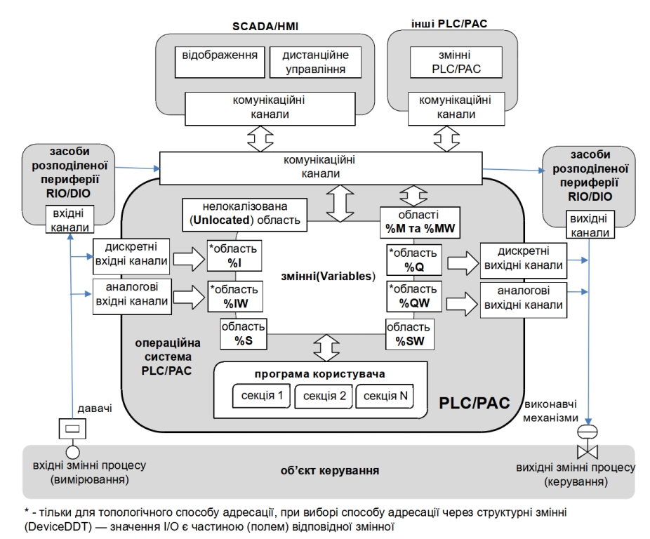

Рис.5.Функціональна структура PLC

Програма користувача оперує змінними  (Variables). Вхідні та вихідні змінні містять значення змінних процесу. Внутрішні змінні використовуються для збереження проміжних результатів обробки інформації або обміну з іншими засобами через комунікаційні канали. Системні змінні  служать для спілкування з операційною системою PLC. Операційна система PLC забезпечує взаємозв’язок всіх складових та порядок їх взаємодії. 

Алгоритм роботи середовища виконання залежить від операційного режиму роботи PLC та настройок виконавчого проекту. 

## 4. Операційні режими роботи PLC

Програма користувача в PLC повинна функціонувати в реальному часі. Враховуючи що стан об’єкту керування (змінні процесу) постійно змінюється, операційна система забезпечує циклічне виконання наступних дій (рис.6):

- опитування вхідних каналів PLC та оновлення вхідних змінних;
- виконання програми користувача, яка в залежності від стану вхідних та внутрішніх змінних, у відповідності з прикладною програмою формує значення вихідних змінних;
- запис значень вихідних змінних у вихідні канали PLC. 

На початку циклу формується так званий образ процесу - це значення всіх вхідних каналів, які відображають стан об’єкту керування в даний момент.

У режимі `RUN` програма користувача, на основі образу процесу та проміжних результатів роботи на попередніх циклах, змінює значення вихідних змінних. Слід зазначити, що в момент зміни вихідних змінних, запис на вихідні канали не проводиться. Це робиться в кінці циклу для всіх вихідних змінних. Додатково операційна система займається внутрішньою обробкою, до якої входять діагностика, робота з комунікаційними каналами, зміна програми при налагодженні, тощо. Слід звернути увагу на те, що циклічність забезпечує сама операційна система, а тривалість циклу становить від кількох мілісекунд до кількох десятків мілісекунд, в залежності від програми користувача. 

У режимі `STOP` контролер не виконує програму користувача і не оновлює виходи. Значення вихідних каналів в цьому режимі залежить від їх конфігурації.  

У програмі користувача, поряд з основною Задачею `MAST` можливо виконання декількох типів Задач (`FAST`,`Event`,`Timer`,`Aux`). Задача (`TASK`) – це окрема частина програми, яка запускається операційною системою по певній події.

Наведений алгоритм справедливий для циклічного режиму виконання основної Задачі `MAST`, при якому наступний цикл її виконання запускається відразу по закінченню її виконання в попередньому циклі. Можливий також періодичний режим виконання Задачі `MAST` при якому Задача запускається по внутрішньому системному таймеру з часом, який вказується для цієї Задачі. 

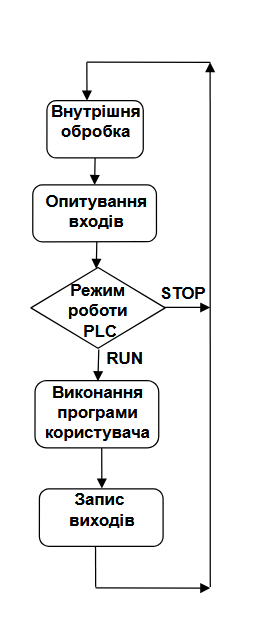

Рис.6. Робочий цикл функціонування ПЛК

Варто зауважити, що описана вище послідовність залежить від реалізації підсистеми вводу/виводу, і показаний в спрощеному вигляді. Детальніше про Задачі можна ознайомитись в главі 3.3. а про їх операційні режими - в главі 4.1.

## 5. Області пам’яті PLC та адресація каналів вводу/виводу

Вище зазначено, що операційна система PLC на початку Задачі автоматично оновлює вхідні змінні, а в кінці – автоматично оновлює виходи значеннями вихідних змінних. У залежності від призначення, дані для змінних можуть бути розміщені в декількох областях (див. рис.3):

-   `%I`, `%IW`  - область даних вхідних каналів при топологічній адресації;

-   `%Q`, `%QW` – область даних вихідних каналів при топологічній адресації;

-   `%M` – область даних для внутрішніх булевих (Boolean) змінних;

-   `%MW` – область даних для внутрішніх числових змінних;

-   `%S` – область даних для системних булевих змінних;

-   `%SW` – область даних для системних числових змінних;

-   `%KW` – область констант. 

-   `Unlocated` - область нелокалізованих даних 

Комірки пам’яті в кожній області адресуються різним чином. У області `%M` та `%MW` кожна комірка має свій номер. Наприклад `%M0` – нульова комірка в області `%M`, `%MW100` – сота комірка в області `%MW`. Ці комірки можуть використовуватись для збереження проміжних результатів.

При **топологічній адресації** входів/виходів у областях `%I` (дискретні входи), `%IW`(аналогові входи), `%Q` (дискретні виходи) та `%QW` (аналогові виходи) кожна комірка відповідає за конкретний канал PLC, тому адресація комірки співпадає з адресою каналу. Тобто при топологічній адресації адреса каналів в PLC повністю залежить від його розміщення в шасі і складається з послідовності `N.M.C`, де: 

`N` - номер шасі;

`M` - номер місця в шасі, в якому розміщений модуль;

`C` - номер каналу в модулі.

Наприклад, комірки з адресами:

-   `%I1.4.6` буде отримувати значення з 6-го дискретного входу, модуля на 4-й позиції в шасі №1;

-   `%IW0.5.0` буде отримувати значення з 0-го аналогового входу, модуля на 5-й позиції в шасі №0;

-   записавши логічну одиницю в комірку `%Q3.1.2`, включиться 2-й дискретний вихід на модулі в 1-му посадочному місці, 3-го шасі;

-   записавши 5000 в комірку `%QW0.1.2`, значення 2-го аналогового виходу модуля, на 1-му посадочному місці, 0-го шасі, виставиться рівним 50% від діапазону вихідного сигналу.  

При цьому значення для аналогових входів та виходів по замовченню масштабуються в діапазоні `0-10000`, при значенні аналогового сигналу `0-100%` від діапазону (наприклад 4-20 мА). 

Для кожного каналу на основі цього типу адресації можна створити структурну змінну, так звану `IODDT`, і звертатися до усіх значень входів виходів, а також додатково діагностичних даних через імена.  Тим не менше, топологічна адресація вважається застарілою і може використовуватися в M580 тільки для локальних модулів вводу/виводу на шасі PLC BUS.  Натомість пропонується альтернативний спосіб - **DeviceDDT адресація**, який використовується для розподіленої системи вводу/виводу (RIO) і може використовуватися для локальної. Ідея його в тому, що для кожного модуля система Control Expert створює структурну змінну (DeviceDDT), назву якої задає розробник. Ця структурна змінна прив'язується до модуля, а не посадкового місця в шасі, і не залежить від його розміщення в шасі. Змінна DeviceDDT містить всі необхідні дані про модуль, канали, і це не тільки значення входів чи виходів, а і інша інформація про модулі та канали (параметрична, діагностична, операційна). Вибір способу адресації DeviceDDT  або IODDT робиться під час вибору і встановленні модуля, якщо це локальна шина.    

У областях `%S` (системні біти) та `%SW` (системні слова) знаходиться інформація про стан контролера. Наприклад, біт `%S0` сигналізує про виконання першого циклу після включення PLC, а значення в слові `%SW49` вказує на поточний день місяця.  

Розробник програми користувача може вказати для змінної адресу комірки пам’яті, де будуть розміщуватись її дані (тобто прив’язати до адреси). Якщо ця комірка буде частиною області входів (при топологічній адресації), то змінна буде вхідною, і отримуватиме вхідне значення автоматично. Якщо для змінної буде вказана комірка з області виходів (при топологічній адресації) – то вона буде вихідною. Якщо записати значення у вихідну змінну, то по завершенню циклу Задачі, воно буде автоматично записано на вихідний канал PLC. Якщо змінну прив’язати до комірки `%M` чи `%MW` – вона буде внутрішньою. 

Означення адреси для змінної вказується в середовищі Control Expert. Всі змінні, які будуть прив’язані до конкретної комірки називаються локалізованими (located) змінними, так як їх розміщення відоме. У програмі користувача дозволяється прямий доступ до комірок пам’яті за адресою, тому значення локалізованої змінної можна змінити шляхом зміни значення в комірці пам’яті, на яку вона посилається.

У Control Expert означення адреси для змінної є необов’язкове. У випадку незаповненої властивості `Address`,  Control Expert при компіляції розмістить цю змінну в області нелокалізованих даних (див. рис.5). Такі змінні називаються нелокалізованими. При цьому адреса комірки, в якій буде розміщення даних, буде невідомою розробнику і може змінюватися при компіляції. Локалізація потрібна тільки у деяких випадках, зокрема - можливості доступу до змінних по мережі Modbus (прив'язка до `%M`,  `%MW`), або прив'язка до системних змінних `%S` та  `%SW`. Для топологічної адресації можна зробити прив'язку до `%I`,  `%IW`, `%Q`, `%QW`, однак це для M580 не має широкого вжитку, враховуючи обмеження.  

Більш детально про роботу з даними можна прочитати в главі 3.4.

## 6. Розробка, компіляція та завантаження проекту

Проект Control Expert Classic – це база даних певного формату, яка вміщує всю конфігураційну інформацію для PLC та деяку інформацію для його розподіленої периферії. Проєкт зберігається на комп’ютері у вигляді одного файлу формату `.STU`. Файли формату `.STU` несумісні в різних версіях (навіть від старшої до молодшої), тому при перенесенні проекту необхідно зберегти його в архівному форматі `.STA` (архівна версія), який сумісний у більшості версій. 

Навігація по проекту проводиться через єдиний провідник проекту (Project Browser (рис.7)). Детальніше про настройки проекту можна прочитати в главі 3.2. 

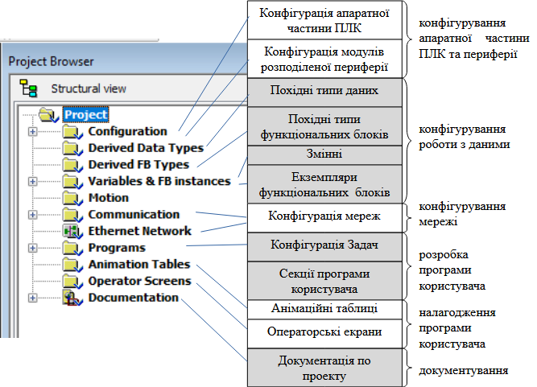

Рис.7.Структура проекту Control Expert та призначення розділів

Нагадаємо, що PLC працює з виконавчим проектом, тобто скомпільованим кодом. Тому для завантаження виконавчого проекту в PLC, спочатку його треба створити. Створюється виконавчий проект шляхом компіляції (`Build-> Rebuild All Project`). Слід зазначити, що виконавчий проект зберігається на диску в середині файлу проєкту Control Expert. Варто зазначити що фактично `*.STU`  та `*.STA` є архівами, у цьому легко переконатися, відкривши його через архіватор.   

Для завантаження виконавчого проекту, спочатку встановлюється з’єднання Control Expert з PLC (команда `PLC->Connect`), тобто перехід в режим онлайн (online), а потім пересилка проекту в PLC (`PLC->Transfer Project to PLC`). З’єднання можна встановити з реальним PLC (`PLC->Standard Mode`) або з імітатором PLC (`PLC->Simulation Mode`). Налаштування адреси PLC/імітатора проводиться у спеціальному вікні, яке викликається в меню `PLC->Set Address`. Після завантаження виконавчого проекту, PLC можна перевести в режим `RUN` (`PLC->RUN`)  

Важливою особливістю цих PLC є можливість зміни виконавчого проекту в режимі онлайн без їх зупинки. Для цього в режимі онлайн, після внесених змін, запускається команда часткової компіляції (`Build->Build Changes`). Після компіляції в PLC автоматично завантажиться вся змінена частина.

Скомпільований виконавчий проєкт можна завантажувати і вивантажувати з PLC з використанням спеціальної утиліти Unity Loader (можна безкоштовно завантажити з сайту Shneider Electric). Це дає можливість зберігати бекапи PLC і у випадку заміни дефектних CPU завантажувати туди проєкт. Однак, варто зауважити, що зі скомпільованого виконавчого проєкту не можна отримати редаговану версію для зміни чи перегляду в Control Expert. Для можливості вивантаження частин вихідного проекту  (команда `Upload Project`), ця частина повинна бути включена в `Upload Information` (настроюється в `PLC->Project Setting->PLC embedded data`). Виключення опції `Upload Information` означає відмова від  завантаження в PLC вихідного коду програми, а отже і вивантаження його звідти. 

Деталі про роботу в онлайн режимі можна почитати в главі 4.2. 

Розробка проекту Control Expert може проводитись в різній послідовності, і має ітераційний характер. Один із можливих варіантів послідовності розробки та налагодження проекту складається з наступних етапів:

1) Конфігурування апаратної частини ПЛК та розподіленої периферії;
2) Створення змінних, екземплярів функціональних блоків, похідних типів даних, похідних функціональних блоків;
3) Створення програми користувача;
4) Налагодження програми користувача на PLC або імітаторі PLC;
5) Прив’язка змінних до вхідних/вихідних каналів PLC, налагодження програми користувача на реальному PLC в складі системи керування;

Повне конфігурування апаратної частини може бути проведене після попереднього налагодження програми, наприклад на 5-му етапі, оскільки Control Expert має вбудований імітатор PLC. На початкових етапах розробки достатньо вибрати модель PLC, яка передбачається в системі.

Для  розробки кожної частини проекту використовується свій редактор, який викликається через відповідний розділ провідника проекту (рис.7).

## 7. Апаратна частина PAC  

PAC M340 та M580 мають сумісну архітектуру системи вводу/виводу, яка називається **X80**. Ця система передбачає архітектуру, в якій один PAC може складатися з кількох об'єднаних шасі (Rack), на які монтуються модулі. Усі модулі живляться через вбудовану в шасі шину від модуля живлення, що монтуються на крайніх лівих посадкових місцях. Шина шасі забезпечує також обмін даними між модулями. Вся систему об'єднаних шасі  має тільки один CPU (за винятком системи з гарчим резервуванням), який є центральним вузлом керування. Конструкція на базі шасі надає можливість замінювати модулі не зупиняючи роботу CPU. M580 має два способи організації зв'язку між шасі - через X-bus та систему RIO. 

**X-bus** - це пропрієтарна шина, яка забезпечує обмін між модулями всередині шасі, і використовується в M340, та застарілих на сьогодні PLC TSX Premium. Об'єднання шасі передбачає використання модулів XBE, які умовно можна вважати "подовжувачами" шин. Загальна довжина усіх кабелів X-Bus не може перевищувати 30 м, а кількість шасі - до 16.

**RIO** - система віддаленого вводу/виводу, яка базується на мережі Ethernet, однак при цьому використовується ті самі модулі та шасі X80. Фактично RIO є адаптацією промислової мережі  Ethernet/IP з метою простої і надійної реалізації розподілених шасі з модулями X80 на базі PAC M580. Максимальна кількість віддалених вузлів (Drop) з шасі значно більша, а відстань між ними визначається правилами Ethernet, наприклад 100 м для мідного кабелю та кілометри для оптоволоконного. Таким чином RIO може забезпечувати сильно територіально-розподілену архітектуру і вважається гнучкішою за X-bus. 

Крім X-BUS та RIO, які передбачають використання складових тільки системи X80 (є також рішення на базі I/O Premium та Quantum), M340 та M580 можуть комунікувати з іншими пристроями з використанням відкритих протоколів Modbus TCP/IP та Ethernet/IP. Ці пристрої можуть бути різного типу (модулі I/O, приводи, інші інтелектуальні засоби) та від різних виробників не тільки від Shneider Electric. Цей тип зв'язку з віддаленою периферією в межах EcoStruxure Plant називається **DIO** (Distributed IO). Варто зауважити що різниця між RIO і DIO в цьому випадку суттєва, і в межах EcoStruxure Plant це різні поняття, хоча в інших системах може вважатися синонімами. 

Конфігурування апаратної частини виконується за кілька етапів. При створенні проекту спочатку означують налаштування захисту частин проєкту. Потім вибирається тип PLC (наприклад M580 чи M340) та тип процесорного модулю. Пізніше, на будь якій стадії створення проекту, можна буде змінити модель процесорного модуля, якщо в проєкті не будуть використані якісь специфічні функції. 

Далі, у розділі проекту `Configuration`, використовуючи графічний редактор апаратної конфігурації. Для M580 доступні три варіанти підключення засобів вводу/виводу:

- через локальну шину PLC bus, на якій розміщують модулі системи X80, що характерно для віх M340 та M580 (рис.8)
- через розподілену периферію RIO, що базується на модулях X80, що доступно для CPU `M580 **40` (рис.9)
- через комунікації DIO, що передбачає використання мережних сервісів, наприклад DTM та функцій явного обміну 

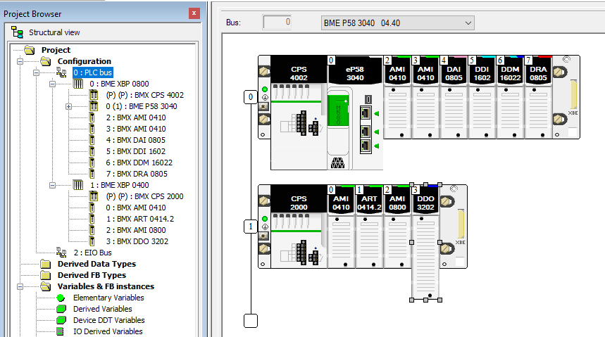

 Рис.8. Редактор апаратної конфігурації PLC bus

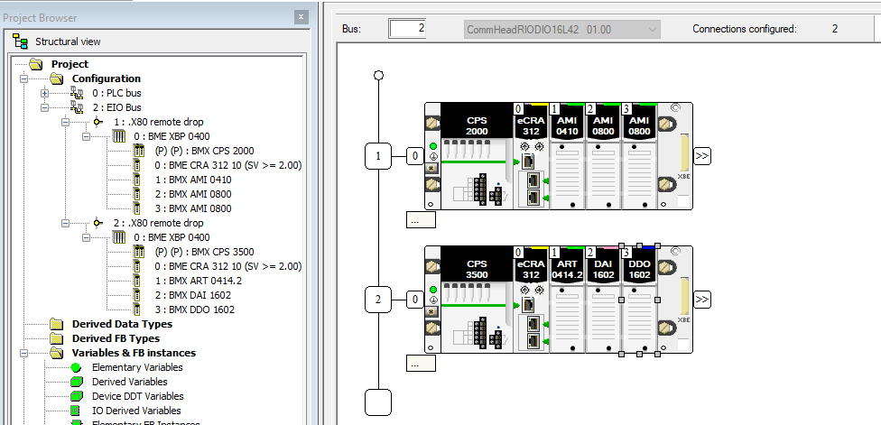

 Рис.9. Редактор апаратної конфігурації RIO

На другому кроці виконується конфігурування окремих модулів і, в залежності від типу модуля, задаються їх параметри. 

Для процесорного модуля задаються ряд функцій: поведінка PLC при його запуску і зупинці, параметри захисту карти пам’яті, виділення локалізованих областей пам’яті, тощо (рис.10).

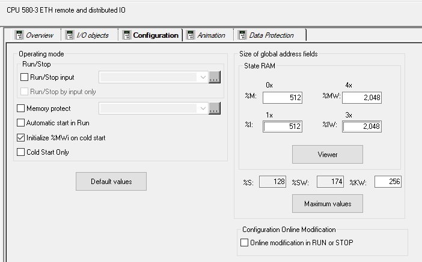

Рис.10. Приклад конфігурації CPU M580

Для M580 навіть на перших кроках створення проєкту важливим є конфігурування мереж для вбудованих в CPU M580 каналів Ethernet. Якщо невірно їх налаштувати можна заблокувати доступ по Ethernet навіть для Control Expert. Окрім параметрів означення IP тут налаштовуються властивості кіберзахисту (рис.11) а також параметри портів та доступних сервісів.   

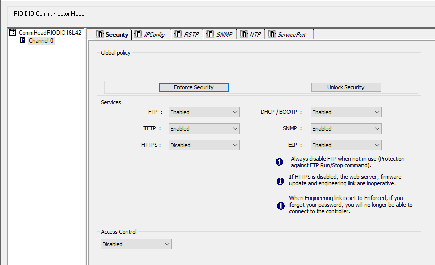

Рис.11. Вікно конфігурування мереж для вбудованих в CPU M580 каналів Ethernet: вкладка `Security`. 

При конфігуруванні модулів входів або виходів означуються властивості окремих каналів, такі як прив’язка до Задач, настройка діапазонів, тощо. Крім того для дискретних входів/виходів можна:

- для модулів дискретних входів можна виставити ступінь фільтрації сигналу, активація діагностики виходу живлення за діапазон, полярність сигналів, тощо;
- для модулів дискретних виходів можна вказати стан каналів при зупинці ПЛК, порядок реактивації захищених виходів, тощо;
- для модулів аналогових входів можна вказати діапазон сигналу, параметри масштабування, фільтрація, тощо;
- для модулів аналогових виходів можна вказати стан виходів при зупинці ПЛК  

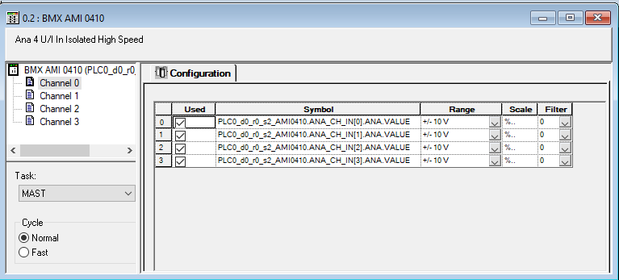

Рис.12.Приклад конфігурації каналів 

У вікні конфігурації шасі доступна функція перегляду споживаної потужності модулів у відповідності з встановленим модулем живлення. Апаратну конфігурацію можна імпортувати/експортувати.  

Детальніше про апаратне забезпечення ПЛК M580 Ви можете прочитати в 2-му розділі даного посібника. 

## 8. Створення змінних та екземплярів функціональних блоків

Розпочати розробку програми користувача можна з визначення змінних в редакторі даних (`Data Editor`) (рис.13). 

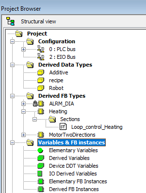

Рис.13.Конфігурування даних

Створення змінних також можливе через контекстне меню або при першому використанні з редакторів мов програмування (LD, FBD, ST, IL, SFC), що створює додаткові зручності при програмуванні. 

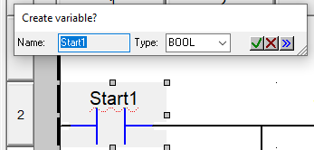

Рис.14. Створення змінної при її використанні без об'явлення 

Для кожної змінної вказується: ім’я змінної (`Name`); тип змінної (`Type`); значення, яке буде приймати змінна при ініціалізації ПЛК (`Value`); адреса комірки пам’яті (`Address`) де буде зберігатись значення змінної; коментар (`Comment`) та інші (15). 

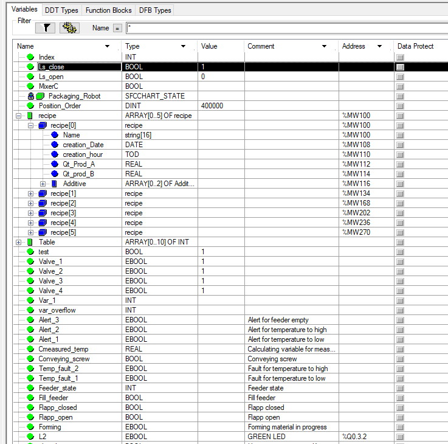

Рис.15. Приклад створених змінних в редакторі даних.

Додаткові властивості змінних доступні через вікно властивостей, яке викликається через контекстне меню змінної.

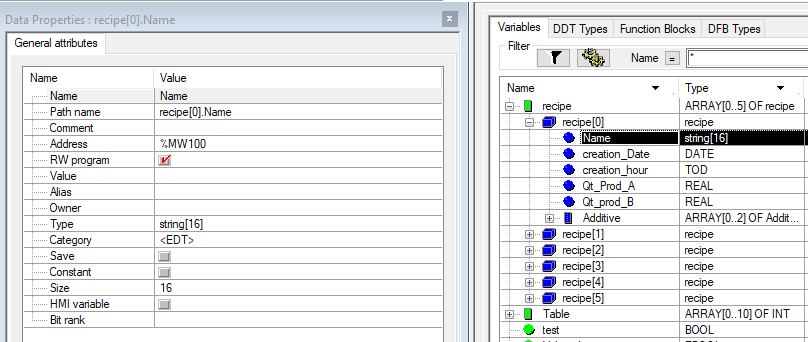

Рис.16. Властивості змінної

Крім елементарних типів даних (наприклад `BOOL`, `INT`, `REAL`), середовище Control Expert підтримує похідні типи даних (Derived Data Types), які створюються на базі структурування елементарних. Похідні типи даних представлені структурними типами та масивами. Крім бібліотечних структурних типів даних, розробник може створити власні типи даних користувача (рис.17) 

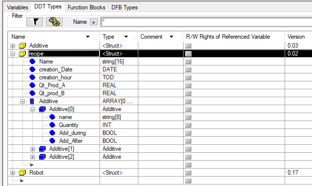

Рис.17. Редактор типів даних означені користувачем (DDT)  

Середовище Control Expert крім наявних функцій та процедур, має функціональні блоки. Функціональний блок (Function Block) можна представити як єдину структурну одиницю, яка складається з програмної процедури (або процедур) і структурованих даних. Структура і програма означується типом функціонального блоку (`Function Block Types`). Таким чином, функціональний блок зберігає проміжні значення у своєму тілі. Тому для кожного функціонального блоку створюється свій екземпляр функціонального блоку (`FB Instance`), які доступні у відповідному розділі Data editor. 

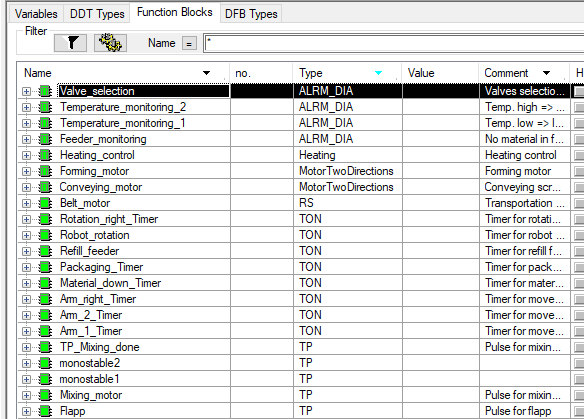

Рис.18. Екзмепляри функціональних блоків  

При використанні функціонального блоку певного типу спочатку створюють екземпляр, с унікальним в межах проекту ім’ям, а потім в програмі користувача викликають екземпляр по імені. З цієї точки зору екземпляр функціонального блоку це особлива змінна, а тип FB – це особливий тип змінної. Механізм використання функціональних блоків дуже схожий на використання об’єктів в об’єктно-орієнтованому програмуванні. Крім бібліотечних елементарних функціональних блоків (`Elementary Function Block`) в Control Expert можна розробити типи функціональних блоків користувача (Derived FB Type), для чого використовується відповідний розділ із `Data Editor` (рис.18)


Рис.18. Редактор типів функціонального блоку, означеного користувачем (DFB)  

Всі змінні та екземпляри функціональних блоків є глобальними, тобто доступними в усіх програмних частинах проекту і на всіх мовах програмування. Для інкапсуляції даних всередині програмних блоків можна використовувати власні DFB або POU.

Більш детально про змінні, функції та функціональні блоки можна прочитати в главах 3.4 - 3.6 даного посібника. 

## 9. Створення програми користувача

Програма користувача може бути однозадачною (тільки MAST) або багатозадачною. Кожна задача містить свої програмні секції, які можуть бути написані на одній з мов IEC 61131-3: IL, LD, ST, FBD чи SFC (SFC тільки для MAST). Секції в межах Задачі виконуються одна за одною, в порядку їх розміщення в підрозділі Sections (на рис.19 спочатку виконується програма в секції `Start_process`, а потім в `Weighing_Material_A`). При створенні секції (контекстне меню `Sections->New Section`), для неї вказується ім’я та вибрана мова програмування.  

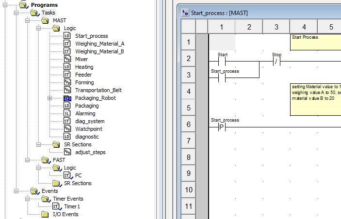

Рис.19. Програма користувача з Задачою `MAST`, `FAST`, `Event Timer`

Налаштування параметрів Задач проводиться через їх контекстне меню (рис.20). 

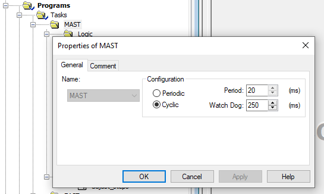

Рис.20. Налаштування Задачі MAST

## 9. Мови програмування

При розробці програми користувача можуть використовуватись п’ять мов програмування, які відповідають стандарту IEC 61131-3: IL, LD, ST, FBD чи SFC. Мова вибирається в залежності від типу завдання, уподобань користувача або від вимог замовника. Більшість застосувань можна реалізувати на будь з яких мов, однак деякі можливості присутні тільки в деяких мовах.

Мова IL (Instruction List) - це список інструкцій, які виконуються послідовно, подібно до мови Асемблера (рис.21). 


Рис.21. Фрагмент програми на мові IL

Мова LD (Ladder Diagram) це графічна мова програмування, яка представляє собою діаграму релейно-контактної логіки (рис.22). Це одна з мов програмування контролерів, які вперше були використані для заміни релейно-контактних схем керування. Детальніше LD розглянута в главі 3.8, а приклад розробки стартового проекту з використанням мови LD наведений в главі 12. 


Рис.22. Фрагмент програми на мові LD

Мова FBD (Function Block Diagram) - графічна мова програмування, яка дозволяє створювати програми у вигляді взаємопов’язаних інформаційними зв’язками функцій, процедур та функціональних блоків (рис.23). Детальніше FBD розглянута в главі 3.7, а приклад розробки стартового проекту з використанням мови FBD наведений в главі 13.


Рис.23. Фрагмент програми на мові FBD

Мова ST (Structured Text, структурований текст) – це текстова мова, яка подібна до PASCAL, C, BASIC і т.п (рис.24). Детальніше ST розглянута в главі 3.9. Приклад використання мови ST наведений в главі 14.


Рис.24. Фрагмент програми на мові ST

Мова SFC (Sequential Function Charts) – графічна мова програмування, в якій поведінка системи задається послідовністю кроків, де вказуються необхідні дії, та переходів між кроками, які задаються умовами (рис.25). Основою для розробки SFC є мережі Петрі – математичний апарат для моделювання поведінки динамічних систем. Детальніше SFC розглянута в главі 3.10. Приклад використання мови SFC наведений в главі 15.


Рис.25. Фрагмент програми на мові SFC

## 11. Налагодження програми користувача

У середовищі Control Expert для перевірки роботи програми користувача доступні засоби відображення та вводу даних, а також засоби налагодження (Debug).

Засоби відображення та вводу даних можна умовно поділити на:

- анімаційні таблиці (Animation Tables);
- операторські екрани (Operator Screens);
- анімаційні засоби редакторів програм користувача в онлайн режимі (Program Animation);

Анімаційні таблиці у табличній формі, а операторські екрани – у графічному вигляді, дозволяють спостерігати та змінювати значення змінних при виконанні програми користувача.  Анімаційні таблиці можна створювати самостійно, шляхом вводу потрібних змінних, або автоматично – шляхом виклику відповідного пункту контекстного меню для виділених змінних або частини коду. Їх можна зберігати в проекті для подальшого використання. Анімаційні таблиці дають можливість представляти дані в різному форматі, а також форсувати значення, змінювати одночасно та інш. Для захисту випадкової зміни, передбачено окремий режим `Modbification` який вмикається явно. На рис.26 показаний приклад таблиць анімацій, зі змінними з різних типів даних а також вигляд контекстного меню. 

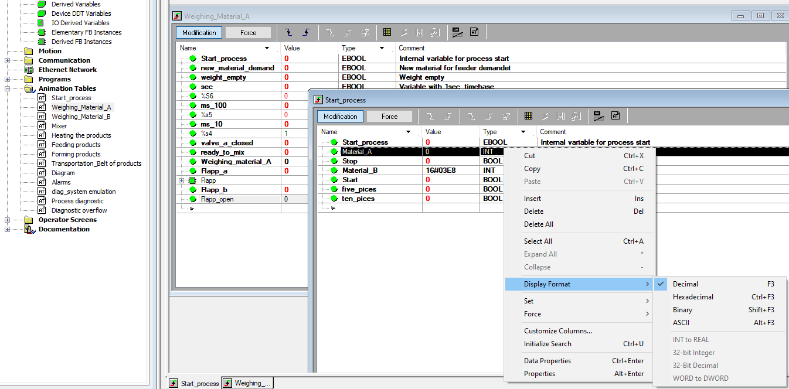

Рис.26. Анімаційні таблиці 

Для створення операторських екранів використовується спеціальний графічний редактор. Операторські екрани мають багато можливостей: відображення значення змінних у вигляді числа, стовпчикової діаграми, самописця (тренду), тощо. Для зміни числової змінної можна використовувати зображення у  вигляді повзунка, а для вводу булевої змінної – кнопку, і т.ін.  Приклад операторського екрану показаний на рис.27. 

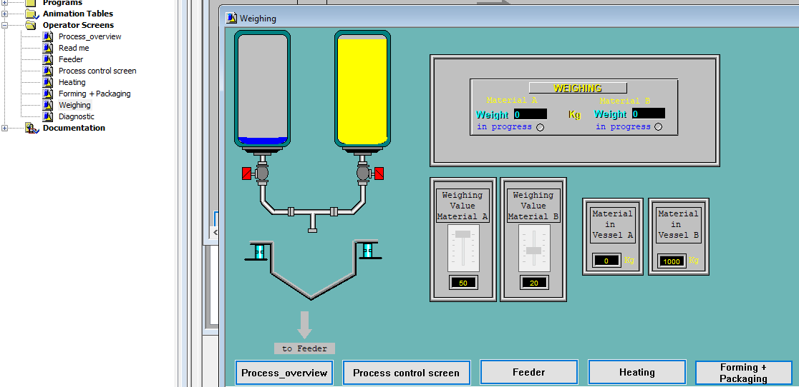

Рис.27. Приклад операторського екрану

За допомогою анімаційних засобів редакторів програм користувача можна у режимі online спостерігати за значенням змінних, проходження сигналу, тощо. За необхідності можна також змінювати значення змінних. На рис.28 показаний приклад редактору FBD в онлайні з увімкненим режимом анімації. Кольором підсвічується стан булевого типу зв'язку (`FALSE` - червоний, `TRUE` - зелений), відображаються значення входів та виходів функціональних елементів. 

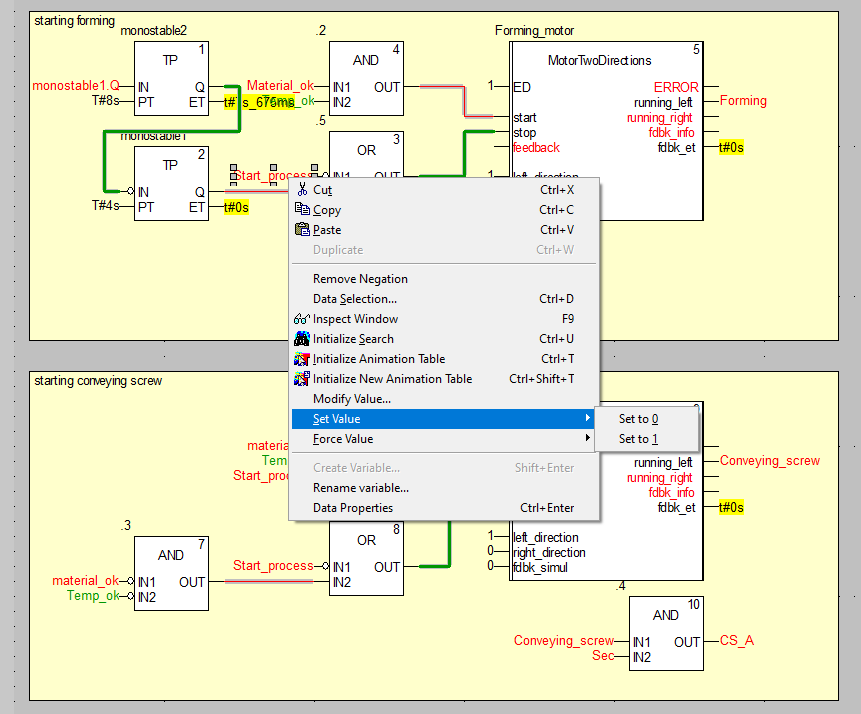

Рис.28. Приклад редактору FBD в онлайні з увімкненим режимом анімації.

Засоби налагодження `Debug` дають можливість вказати точки зупинки виконання програми користувача (`BreakPoint`) та покрокового виконання її секцій. 

Програмний пакет Control Expert має в своєму складі  PLC Simulator, що дозволяє налагодити роботу програми користувача без наявного апаратного забезпечення. PLC Simulator працює як звичайний контролер (за винятком певних обмежень), використовуючи ресурси комп'ютера та операційної системи Windows. Він надає доступ до своїх даних по мережі, використовуючи протокол Modbus/TCP. Це дає можливість використати його не тільки для налагодження програми Control Expert, а і проекту SCADA-програми (якщо вона підтримує Modbus/TCP Client). Сучасні версії PLC Simulator дозволяють запускати їх в кількох екземплярах на одному комп'ютері а також підтримують ряд комунікаційних функцій, що може стати в нагоді при налагодженні мережних комунікацій.    


рис.29. Зовнішній вигляд панелі та меню PLC Simulator.

Детальніше принципи роботи з засобами налагодження висвітлені в главі 4.3. 

Використовуючи спеціальні бібліотечні функції Control Expert можна змінювати значення `%I` та `%IW` програмним шляхом. Це можна використати в програмних імітаторах об’єктів керування. У главі 4.4 даного посібника показані принципи розробки програмних імітаторів для різних об’єктів керування.

## 12. Приклад 1: демонстрація LD та PLC Bus

### Постановка задачі

Розглянемо приклад створення та налагодження проекту Control Expert для керування об’єктом у відповідності з наступним алгоритмом керування (рис.30). 

- При вибраному режимі `Start` напірний бак заповнюється рідиною автоматично: при відключенні сигналізатору рівня `LS1`, включається двигун `М1` насосу; при спрацюванні `LS2` двигун насосу відключається. 
- При вибраному режимі `Stop` двигун насосу включається кнопкою `ManPump` (без фіксації), відключається насос автоматично через 5 с, як кнопка буде відключена. 


Рис.30.До постановки задачі.  

### Етап 1 - створення проекту та апаратної конфігурації

Для вирішення даної задачі можна вибрати PAC M580 з процесорним модулем `BME P58 1020`.  Необхідно також 4 дискретні входи (перемикач `Start/Stop`, сигналізатори рівня `LS1` та `LS2`, кнопка `ManPump`) та 1 дискретний вихід (пускач двигуна насосу `M1`). Для цього можна вибрати модуль дискретних входів/виходів `BMX DDM 16025` і встановити його на наступне (2-ге) після CPU посадкове місце (рис.31). Також для даного проєкту будемо використовувати топологічну адресацію.   

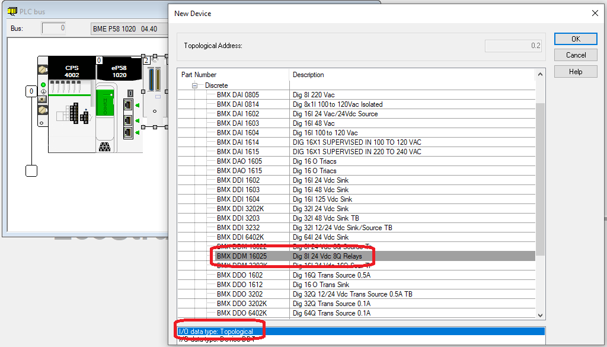

Рис.31. Вибір модуля та типу адресації.  

### Етап 2 - створення змінних I/O

Для сигналізаторів `LS1` та `LS2` та перемикача `Start/Stop` необхідно створити вхідні змінні типу `EBOOL`, а для пускача – вихідну змінну `М1`. Однак для зручності налагодження є сенс спочатку створити їх нелокалізованими, тобто не прив’язаними до адрес входів та виходів. Це дасть змогу змінювати вхідні змінні з таблиці анімації або навіть програмним шляхом. 

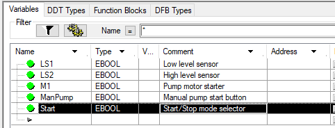

Рис.31. Змінні в редакторі даних.  

### Етап 3a - створення програми користувача на мові LD

Спочатку розглянемо рішення задачі на релейно-контактній схемі (рис.32). Перемикач `SA1` з двома позиціями `Start`/`Stop` використовується для вибору режиму роботи установки. Кнопка `SB2` з написом `ManPump` використовується для ручного включення насосу. Використовуються дві групи нормально-замкнутих контактів реле сигналізаторів рівня `LS1` та `LS2`, які розмикаються при досягнені рідиною певного рівня. Контактор `К1` використовується для запуску двигуна `М1` приводу насосу води, використовуються також додаткові контакти контактора. Для реалізації задачі також потрібне реле часу `KT1` з затримкою на відключення.


Рис.32.Приклад рішення задачі з використанням мови LD.  

При положенні перемикача `SA1` в позиції `Start`, а також замкнутими `LS1` і `LS2` (напірний бак порожній), струм потече через котушку контактора `К1`, яка замкне коло живлення двигуна `М1` приводу насосу (на схемі силове електричне коло для двигуна не показане). Одночасно з ним замкнуться додаткові контакти контактору `К1`, що забезпечить підхват в колі керування двигуном, навіть якщо `LS1` розімкнеться. При досягненні верхнього рівня розімкнуться контакти `LS2`, що приведе до розімкненню електричного кола контактора `К1`, тобто зупинки двигуна насосу. Коли рівень в бачку впаде нижче верхньої межі, `LS2` знову замкнеться, але коло котушки контактору буде розімкнуте: `LS1` розімкнутий, так як рівень вище сигналізатору, додаткові контакти `К1` розімкнуті, так як не спрацювала його котушка. Таким чином,  двигун включиться тільки при повторному замиканні `LS1`, що відбудеться при падінні рівня нижче нижньої межі. При положенні перемикача `SA1` в позиції `Stop`, коло котушки контактора `К1` замикається тільки через контакти реле часу `КТ1`. Контакти реле замикаються відразу, при проходженні через нього струму, тобто після замикання кнопки `SB2` (`ManPump`). Після відпускання кнопки, вона розімкне коло з `КТ1`, а через заданий час розмикаються і контакти цього реле. 

На мові LD програма має вигляд дуже схожий на релейно-контактну схему. Стан нормально розімкнутих контактів `-| |-` та нормально замкнутих контактів `-|/|-` керуються змінними типу `EBOOL`, які можуть приймати значення `TRUE`(логічна 1) або `FALSE` (логічний 0). Тобто, якщо на нормально-розімкнутий контакт `-| |-` діє змінна `ManPump`, то цей контакт замикається при `ManPump=TRUE` і розмикається при `ManPump=FALSE`. А якщо на нормально замкнутий контакт `-|/|-` діє змінна `LS1`, то цей контакт замикається при `LS1=FALSE` і розмикається при `LS1=TRUE`. З’єднані контакти організують коло, яке з’єднує умовну фазу з умовним нулем через виконавчі елементи. У якості виконавчих елементів можуть використовуватися різного роду котушки або блоки (функціональні блоки,  функції та ін.). У наведеній програмі використовується нормально розімкнута котушка `-( )-`, яка діє на змінну `М1`. Якщо через коло котушки проходить умовний струм, то змінна `M1=TRUE`, інакше (якщо струм не проходить) - `M1=FALSE`.

У якості виконавчого елементу в програмі також використовується функціональний блок таймеру `Timer1` типу `TOF` (таймер з затримкою на відключення), для якого попередньо треба створити екземпляр функціонального блоку (рис.33). Вихід таймеру `Timer1.Q` – використовується як нормально розімкнутий контакт в колі котушки `М1`. Таймер налаштований на 5 секунд шляхом задавання на вході `PT=t#5s`, де `t#` вказує на те, що використовується часова константа. 

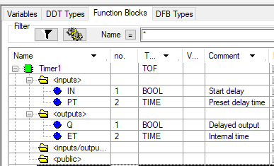

Рис.33. Екземпляр таймеру `TOF` в редакторі даних.  

### Етап 3b – альтернативний варіант програми користувача

Одну і ту ж програму можна реалізувати різними способами. Попереднім способом мабуть зручно виконувати програми тим розробникам, які звикли до створення релейно-контактних схем. Однак можна керуватися іншою логікою, в якій насос керується через використання котушок `-(S)-` і `-(R)-`.  Тоді задача зводиться до визначення двох груп умов для включення та відповідно відключення насосу M1: 

- умови включення (одна з умов): 
  - режим `Start` і  `LS1` - відключений (нижче порога 1); 
  - режим `Stop` і натиснута `ManPump`;
- умови відключення (одна з умов):  
  - режим `Start` і`LS2` - включений (вище порога 2)
  - режим `Stop` і після відпускання `ManPump` прошйло 5 секунд;

Ці умови досить легко перетворити в LD. У нас є всього два виконавчі елементи `-(S)-` і `-(R)-`  які реалізовують включення та відключення `M1`. Для кожної з дій є дві умови по АБО, тому вони реалізовуються через паралельно підключені ділянки кола. У одній із ділянок задіяна затримка. На відміну від попереднього варіанту вирішення ця затримка йде на виконання дії (спрацювання), тому необхідно використати таймер `TON`. Програма матиме вигляд як на рис.34 

На рис.34 показаний варіант програми на LD, яка реалізована через котушки `-(S)-` і `-(R)-` а також таймер з затримкою на включення `TON`. Котушка `-(S)-` має особливість фіксувати свій включений стан. Тобто після проходу струму через коло котушки, прив’язаній до неї змінній присвоюється значення `TRUE`. Якщо після цього в колі котушки не буде "струму", змінна залишиться в `TRUE`. Для того, щоб обнулити змінну, потрібно використовувати котушку `-(R)-`, яка прив’язана до тієї ж змінної. Таким чином, в більшості коректно написаних програм разом з котушкою `-(S)-` з такою ж змінною повинна бути і котушка `-(R)-`. 

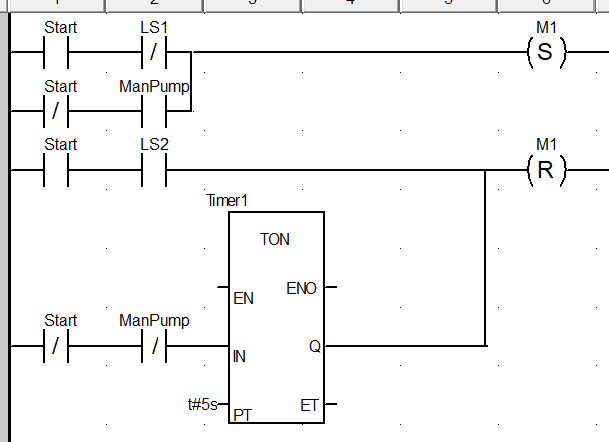

Рис.34. Альтернативний варіант рішення задачі.  

### Етап 4 - налагодження програми користувача

Для перевірки роботи програми треба підготовити тестову таблицю (таблицю істинності), у якій навести послідовність дій та очікувана реакція на них програми користувача.  У таблиці 1 наведена така послідовність, перевіряючи роботу програми, користувач поступово змінює значення давачів і слідкує за реакцією програми. Якщо вона відповідає наведеній в таблиці, то програма працює коректно.  

Таблиця 1.


Для налагодження програми користувача можна скористатися анімаційною таблицею. Змінюючи значення в анімаційній таблиці, можна перевірити коректність роботи програми користувача. Таблицю анімацій можна створити автоматично, заповнюючи її виділеними об'єктами (рис.35)  

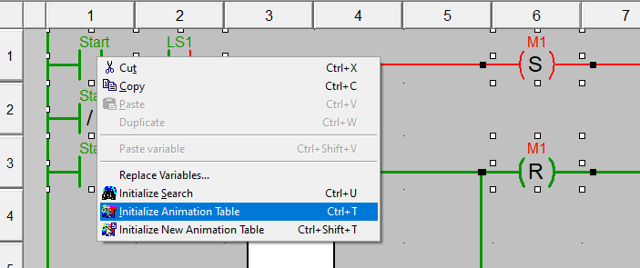

рис.35. Автоматичне заповнення таблиці анімацій виділеними об'єктами 

Для зміни значення змінних потрібно активувати режим `Modification`, після чого можна вводити значення в полі `Value`, булеві значення можна змінювати кнопками на панелі. Змінні, які доступні для зміни виділяються товстим шрифтом. Варто зауважити, що якщо прив'язати змінні до дискретних входів (див. етап 5), змінювати їх з таблиці анімацій можна буде тільки через форсування.  

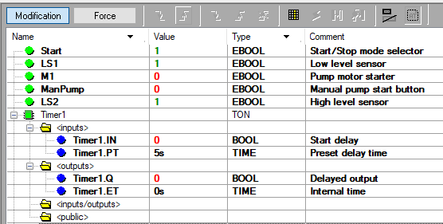

рис.36. Вигляд таблиці анімацій

При налагодженні зручно використовувати режим анімації LD. У онлайн режимі добре видно, які контакти замкнені і причина спрацювання виконавчих елементів (рис.37). Також через контекстне меню можна змінювати значення змінних.

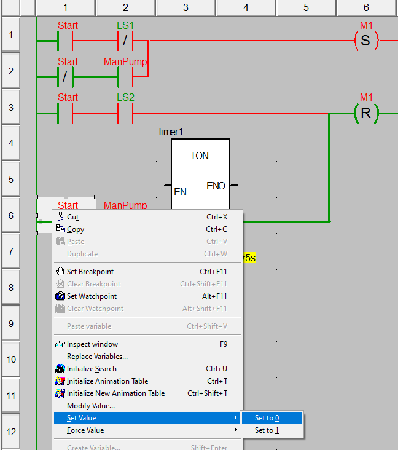

Рис.37. Вікно редактору LD в режимі анімації для налагодження.  

Ще один варіант налагодження - операторський екран (рис.38). Хоч може здатися, що операторські екрани можуть замінити графічний людино-машинний інтерфейс оператора установки, вони не призначені для цього. Операторські екрани Control Expert виключно для налагодження, тому мають досить примітивний функціонал. У цьому випадку для відображення стану датчиків, виконання команд та ручної зміни вхідних змінних датчиків.

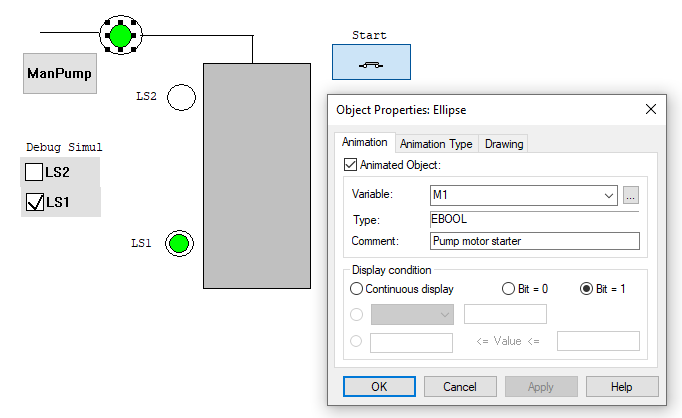

Рис.38. Операторський екран  

### Етап 5 – прив’язка змінних до вхідних/вихідних каналів ПЛК

Вхідні та вихідні змінні необхідно прив’язати до вхідних та вихідних каналів. Вибраний модуль дискретних входів/виходів `BMX DDM 16025` знаходиться на 2-му посадочному місці в 0-му шасі (рис.39). По правилам топологічної адресації каналів, перші 16 каналів (0-15) змішаних дискретних модулів будуть вхідними, а інші – вихідними. Навіть якщо кількість вхідних каналів менше ніж 16-ть, номер першого вихідного каналу буде починатися все одно з 16. 

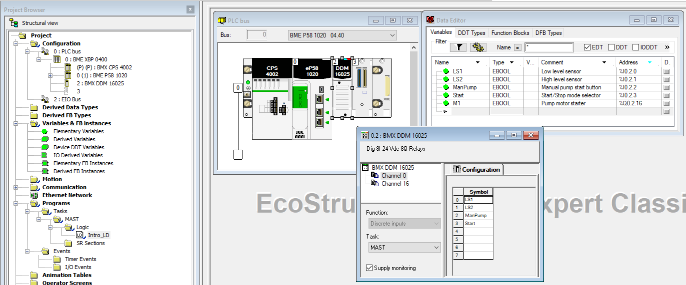

Рис.39. Конфігурація та налаштування вхідних/вихідних змінних в редакторі даних.  

Враховуючи, що програма користувача виконується в Задачі MAST, оновлення вхідних змінних повинно проводитись на початку саме цієї Задачі. По тій же причині оновлення виходів значеннями вихідних змінних повинно проводитись в кінці Задачі MAST. Для цього канали модуля `BMX DDM 16025` в апаратній конфігурації PLC налаштовуються на Задачу MAST.  

Згідно умов безпеки вихідний канал `0.1.16`, який відповідає за пуск насосу, при зупинці PLC повинен бути в значенні `FALSE`. Тому для даного каналу в апаратній конфігурації необхідно виставити режим `Fallback Mode = Fallback` (при зупинці PLC виходи виставити в значення `Fallback Value`), а `Fallback Value = 0` (рис.40).

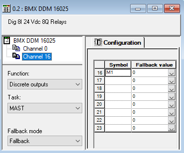

Рис.40. Налаштування дискретних виходів.  

Для контролю за живленням каналів модуля необхідно виставити опцію `Supply Monitoring` (рис.35). При такій конфігурації, вихід значення напруги живлення давачів за діапазон буде сигналізуватися індикаторами модуля (індикатор `I/O`) та спеціальними діагностичними змінними. 

Після зміни конфігурації вона заливається в реальний PLC. Після цього відбувається налагодження на реальній установці, а прив'язані вхідні змінні сигналізаторів положення можна тільки форсувати.

## 13. Приклад 2: демонстрація FBD та RIO

### Постановка задачі

Розглянемо приклад створення та налагодження проекту Control Expert для контуру стабілізації температури (рис.41) охолоджуючої води на виході теплообмінника. Програма в PLC повинна забезпечити функціонування контуру стабілізації температури охолоджуючої води на виході теплообмінника при наступних вимогах:

- система керування включає в себе давач температури `ТТ-1а`, клапан з пневмоприводом `TV-1b`, PAC M580 , операторську панель (HMI);  

- давач температури води має вбудований перетворювач 4-20 мА та налаштований на діапазон `0-150°С`;

- пневмопривод регулюючого клапану має вбудований позиціонер і керується сигналом 4-20 мА;

- регулятор повинен реалізовувати ПІ-закон регулювання, і налаштовуватися засобами HMI;

- завдання регулятору (`SP`) повинен формувати оператор засобами HMI (`H-1`);

- зі сторони HMI регулятор повинен мати можливість переводу в ручний режим, з можливістю зміни оператором положення клапана (`HC-1`)

- шафа засобів вводу/виводу повинна знаходитися безпосередньо біля установки, на відстані близько 50 м від шафи контролера 

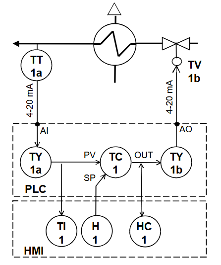

Рис.41.До постановки задачі.  

### Етап 1 - створення проекту та апаратної конфігурації

Для вирішення даної задачі можна вибрати PAC M580 з процесорним модулем `BME P58 2040`, що передбачає можливість підключення через віддалену систему вводу/виводу (RIO). У основному шасі PLC bus достатньо тільки модуля живлення та CPU (рис.42). На шасі віддаленого вузлу I/O (Drop) необхідно модуль живлення та адаптер вузла X80 `eCRA 312`, де необхідно розмістити модулі для підключення польових засобів. Необхідно відповідно один аналоговий вхід (давач температури з перетворювачем) та один аналоговий вихід (для клапану з позиціонером). Для цього можна вибрати змішаний модуль вводву/виводу `BMX AMM 0600` що має 4 аналогових входів та 2 аналогових виходи, які підтримують роботу с сигналами 4-20 мА.

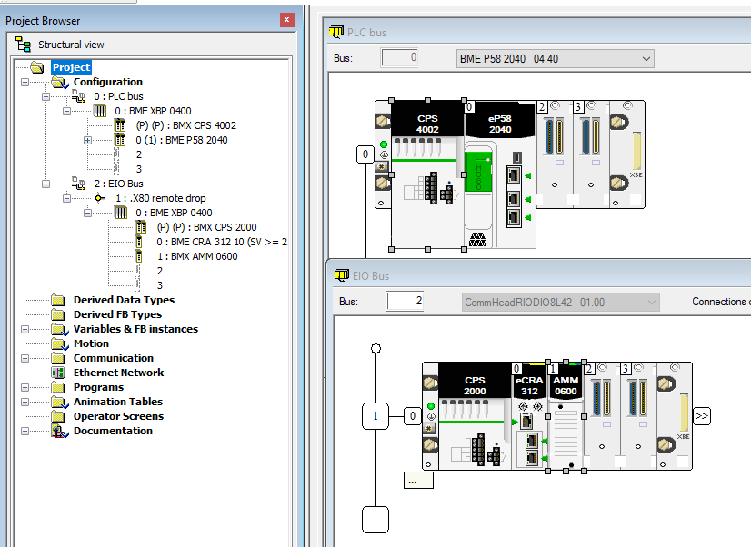

Рис.42.Апаратна конфігурація.  

### Етап 2 - створення змінних 

Вхідні та вихідні аналогові канали для модулів вводу/виводу X80 мають тип `INT` та за замовченням передаються в діапазоні `0-10000`. Це значить, наприклад, що якщо на аналоговому вході `4-20 мА` є сигнал рівним `12 мА`, то значення його в вхідній змінній буде рівним `5000`. Замість використання прямого посилання на аналоговий вхід та вихід, тут пропонується піти іншим шляхом - динамічної прив'язки через переприсвоєння. Ідея в тому, що спочатку необхідно створити внутрішні змінні (будемо умовно називати їх проксі-змінними), в яких очікується "сирі" значення I/O, однак при цьому вони не будуть змінними I/O. Натомість, на початку програми задачі проксі-вхідним змінним буде присвоюватися значення вхідних змінних I/O, а в кінці вихідним змінним буде присвоюватися значення проксі-вихідних змінних. Такий підхід широко вживається при програмуванню PLC не тільки від Shnieder Electric. Він дає можливість швидко змінювати прив'язки до каналів та змінювати проксі-вхідні змінні при налагодженні, "відключивши" частину програми опитування.    

Таким чиному для значень температури та клапану необхідно створити змінні типу INT. У той же час для реалізації ПІ-регулятору буде використовуватися бібліотечний функціональний блок типу `PI_B`, який працює з реальними масштабованими змінними типу `REAL`. Тому необхідно створити 4-ри змінні: `TT1a` (сире значення) та `TT1a_R` (масштабоване) - для давача температури, `TV1b` (сире) та `TV1b_R` (масштабоване) – для клапану. Необхідно також створити змінні: `TC1_SP` – для формування завдання регулятору (тип `REAL`), та `TC1_AUTO` (тип `BOOL`) - для керування режимом регулятору. Для початку усі змінні можна створити нелокалізованими, тобто не прив’язаними до адрес, поки не треба буде підключати SCADA/HMI. Таким чином перелік змінних матиме вигляд як на рис.43 

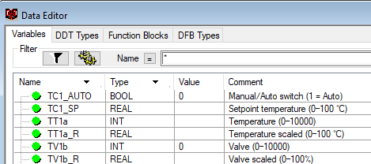

Рис.43. Змінні в редакторі даних.  

Для вирішення задачі варто скористатися бібліотечними функціональними блоками типу `PI_B` (ПІ-регулятор) та `SCALING` (масштабування). Для масштабування вхідного значення температури треба створити екземпляр, наприклад з назвою `TY1a`, для вихідного значення клапану - екземпляр `TY1b`, для ПІ-регулятору температури – екземпляр `TC1` (рис.44).  

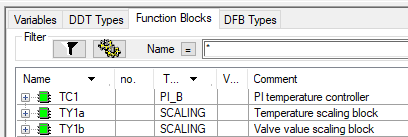

Рис.44. Екземпляри функціональних блоків в редакторі даних.  

Для настройки блоків регулятору та масштабування використовуються входи PARA: для `PI_B` – типу `Para_PI_B`, для `SCALING` – типу `Para_SCALING`. Таким чином необхідно створити ще три змінні (рис.45). Деталі використання даних типів змінних розглянуті в інших розділах посібника.  

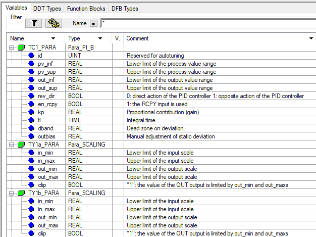

Рис.45. Змінні похідних типів даних (DDT) в редакторі даних.  

### Етап 3 - створення програми користувача на мові FBD

Програму для контуру регулювання можна реалізувати однією мережею в секції FBD (рис.46) яку назвемо `TC1_LOOP`. У центрі контуру знаходиться ПІ-регулятор (`TC1` типу `PI_B`), завдання для якого (`SP`) формується змінною `TC1_SP`, а плинне значення (`PV`) формується виходом блока масштабування температури (`TY1a`). Значення виходу регулятору через блок масштабування `TY1b` подається на клапан `TV1b`. До входу/виходу `OUT` блоку `TC1` прив’язана змінна `TV1b_R`, що дає змогу відслідковувати та керувати виходом регулятору в ручному режимі засобами HMI. Переключення режиму регулятору відбувається через вхід блоку `MAN_AUTO`, до якого прив’язана змінна `TC1_AUTO`. Для настройки ПІ-регулятору, до його входу `PARA` підключається змінна `TC1_PARA`. Масштабування значень температури та клапану, крім блоків типу `SCALING`, в параметрах яких (`PARA`) задаються вхідні та вихідні діапазони, включає також функції перетворення типів значень `INT` в `REAL` та навпаки. 

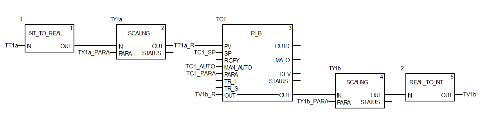

Рис.46. Приклад рішення задачі з використанням мови FBD.  

### Етап 4 - налагодження програми користувача

Налагодження програми користувача можна проводити на імітаторі ПЛК, так як усі програмні елементи підтримуються імітатором. 

Для налагодження варто скористатися таблицею анімації, куди перемістити усі змінні та екземпляри з прогами. Lля цього можна виділити всю програму і через контекстне меню занести їх в таблицю анімації (рис.47)

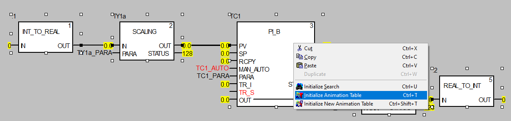

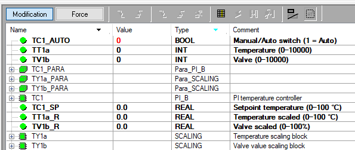

Рис.47. Таблиця анімацій для перевірки та спосіб автоматичного створення

Перевірка роботи даної програми користувача зводиться до перевірки роботи блоків ПІ-регулятору та масштабування. 

Перш за все необхідно налаштувати параметри масштабування (рис.48). Сирі значення мають діапазон `0-10000`, масштабована температура  `0-150°С` , вихід на ВМ `0-100%`. У той же час, для перевірки роботи масштабування треба виставити принаймні межі для виходу регулятору `TC1.PARA.out_inf` та `TC1.PARA.out_sup`.    

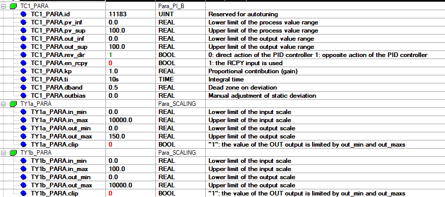

Рис.48. Налаштування параметрів масштабування та регулятору у таблиці анімацій

У ручному режимі ПІ-регулятору (`TC1_AUTO=0`) вихід регулятору (`OUT`) не змінюється, а отже не змінюється і значення змінної `TV1b_R`, так як зв’язок для цього типу параметра функціонального блоку є двостороннім.  Таким чином, в ручному режимі наладчик може змінювати значення виходу регулятору, змінюючи  `TV1b_R`. Після блоків масштабування реальне значення `TV1b_R` в діапазоні `0-100%` повинно перетворитися у відповідне ціло чисельне значення `TV1b` в діапазоні `0-10000`. Змінюючи значення цілочисельної змінної `TT1a` (`0-10000`) можна перевірити правильність роботи блоків масштабування, які повинні перетворити його у відповідне значення `TT1a_R` (`0-150°С`).

У автоматичному режимі (`TC1_AUTO=1`), вихід регулятору `OUT` почне змінювати своє значення відповідно до настройок (задаються в `TC1_PARA`). Враховуючи обернений режим регулятору (`TC1_PARA.rev_dir=1`) при `SP>PV` (переохолодження), вихід `OUT` повинен зменшуватися. 

Аналогічно як і в LD редактор в режимі анімації надає зручні засоби для налагодження (рис. 49). Так само для цієї задачі можна б було використати операторські екрани. 

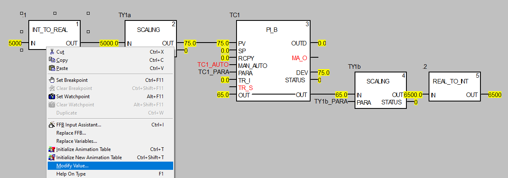

Рис.49. FBD в режимі анімації


### Етап 5 – прив’язка змінних до вхідних/вихідних каналів ПЛК

Вхідні та вихідні змінні необхідно прив’язати до значень вхідних та вихідних каналів. Враховуючи що в проєкті використовується RIO, доступна тільки адресація типу `Device DDT`. У цьому випадку, модуль аналогових входів виходів `AMM 0600` отримує назву, яка задається в налаштуваннях модуля, відповідно до якої створюється змінна відповідного типу. У нашому випадку модуль має назву `A1`, тому буде створена змінна `A1` (рис.50) що містить усі властивості пов'язані з модулем, в тому числі значення аналогових входів та виходів. 

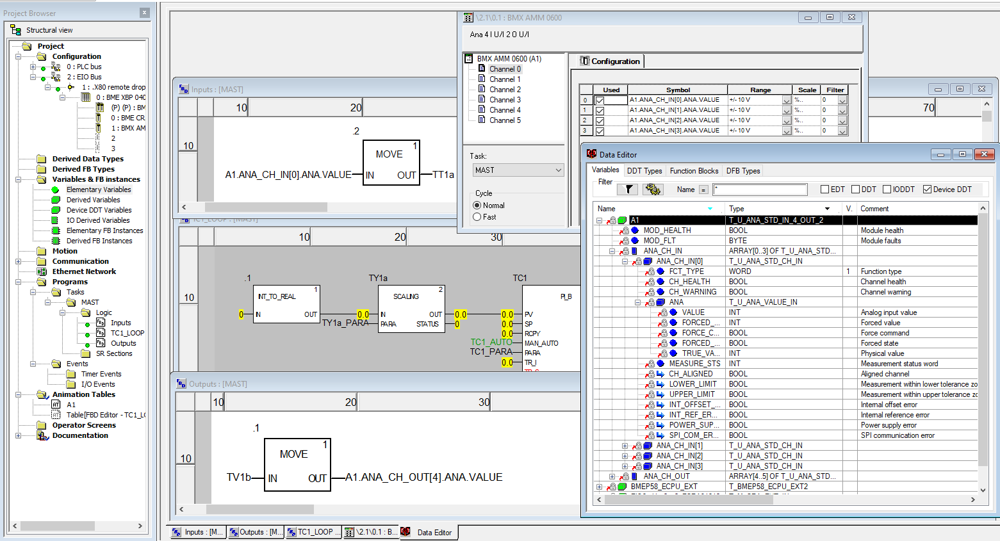

рис.50. Секція `Inputs` та `Outputs`   

Як вже зазначалося прив'язку цих значень можна зробити через переприсвоєння проксі-змінних вхідним та вихідним змінним. Одним із варіантів є добавлення додаткових секцій (рис.50):

- `Inputs` перед секцією `TC1_LOOP`, де змінній `TT1a` присвоїться значення вхідного аналогового каналу 
- `Outupts` після секції `TC1_LOOP`,  де значення вихідного аналогового каналу присвоїться змінній `TV1b`  

Передбачається що секції `Inputs` та  `Outupts` вміщуватимуть переприв'язку усіх змінних I/O, це дасть змогу за необхідності змінювати їх в одному місці, або відключати секції при налагодженні на імітаторах, чи робити імітаційні моделі, які будуть використовуватися для налагодження алгоритму. 

Ряд змінних, які приймають участь в обміні з засобами SCADA/HMI необхідно прив’язати до комірок області пам’яті `%MW`. Варто зауважити, що при роботі через OPC `Schneider-Aut.OFS` це робити не обов'язково, так як рідні драйвера зв'язку можуть доступатися до будь яких об'єктів програми. Масштабовані значення (`TT1a_R`, `TV1b_R`), уставку (`TC1_SP`), режим регулятору (`TC1_AUTO`) та параметри блоків необхідно прив’язувати до комірок області внутрішніх даних `%MW` (рис.51). При цьому змінні `INT` займають одну комірку, `REAL` – дві комірки, `BOOL` – один біт комірки, а для структур DDT (типів `Para_PI_B` та `Para_SCALING`) вказується тільки початкова комірка, інші адреси вираховуються автоматично. Таким чином ці змінні будуть доступні через Modbus, де номер комірки `%MW` буде відповідати зміщенню в регістровій пам'яті Holding Registers.    

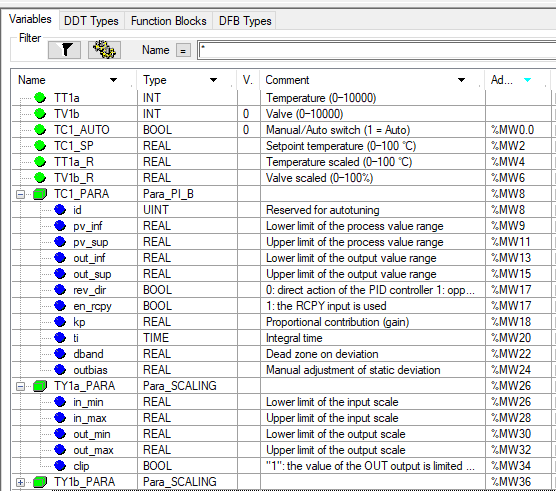

Рис.51. Локалізовані змінні в редакторі даних.

Враховуючи, що програма користувача виконується в Задачі MAST, оновлення вхідних змінних повинно проводитись на початку саме цієї Задачі. Так само оновлення виходів значеннями вихідних змінних повинно проводитись в кінці Задачі MAST. Для цього канали модуля `AMM 0600` в апаратній конфігурації ПЛК налаштовуються на Задачу MAST (рис.52).

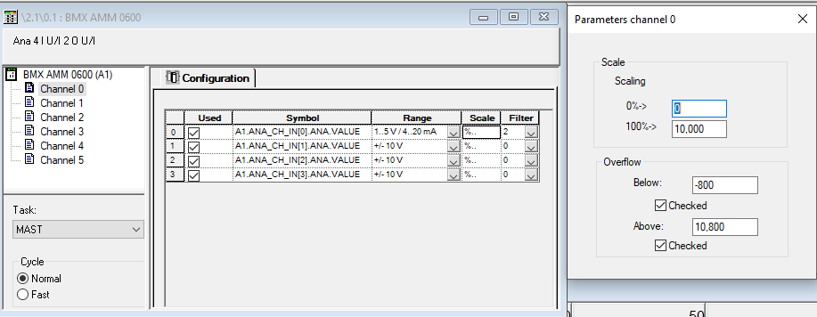

!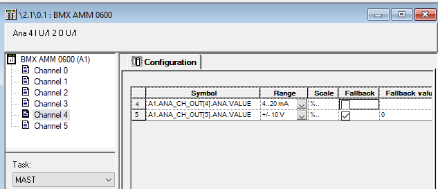

Рис.52. Конфігурація каналів модулів: зверху – вхідних каналів, знизу – вихідних каналів.

Для вхідного аналогового каналу `0` вказується діапазон (`Range=1..5V/4-20mA`) а також ступінь фільтрації (`Filter=2`). Для вихідного аналогового каналу `4` вказується діапазон (`Range=4-20mA`). Режим `Maintain` (опція `Fallback Mode` не виставлена) вказує на те, що при зупинці PLC вихід модуля залишиться без змін (заморозиться). 

Після завантаження програми в реальний PLC, доступні вікна діагностування та форсуванння.

## 13. Приклад 3: демонстрація ST та DIO (READ_VAR)

### Постановка задачі

Необхідно написати фрагмент програми, яка буде по мережі Modbus TCP/IP зчитувати з пристрою розподіленого вводу/виводу значення 8-ми аналогових входів, які представляються у форматі REAL та на основі них формувати масив `AI_DIO1[0..7] of REAL`.

### Етап 1 - створення проекту та апаратної конфігурації

Для вирішення даної задачі можна вибрати PAC M580 з процесорним модулем `BME P58 1020`.  Пристрій підключатиметься до мережі DIO, тому ніяких модулів вводу/виводу для даної задачі не потрібно конфігурувати. 

Надалі задачу будемо виконувати в дві ітерації:

1) створення та перевірка комунікаційного обміну
2) забезпечення формування масиву `AI_DIO1[0..7]` за отриманим даними

### Етап 2/3 (програмування). Ітерація 1

Створення змінних можна робити при створенні програми користувача. Для цієї задачі буде використовуватися комунікаційна функція `READ_VAR`, яка зчитує масив `INT` з вказаного пристрою. Ця функція завжди повертає масив `INT`, тому після зчитування, необхідно буде перетворити цей масив у потрібний формат, у нашому випадку це значення  `REAL`, чим будемо займатися на 2-й ітерації. 

Для можливості виконання цієї функції необхідно в опціях проєкту дозволити динамічні масиви (рис.53)

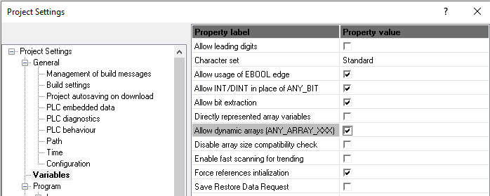

рис.53. Активація опції `Allow dynamic arrays`

Програма користувача на мові ST та змінні матиме вигляд як на рис.54. Функція `ADDM` перетворює текстовий варіант комунікаційної адреси в масив, який потрібен для `READ_VAR`. Масив цілих значень `GEST` використовується для контролю за виконанням функції та результатом. Так, наприклад, 0-й біт 0-го слова буде в 1 у тому випадку, коли попередній виклик ще не було оброблено, тому він використовується як умова для виклику функції. За такої програми наступний запит буде відправлено одразу після повернення результату з попереднього.

Масив `DATA` - це місце, куди повертаються прочитані значення. Він має 16 елементів типу INT, тому що REAL потребує два слова.  Тому `Nb` також вказується як 16.    

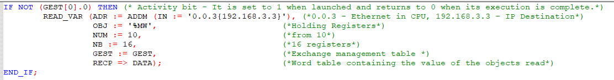

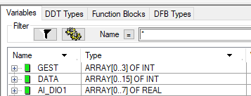

рис.54. Фрагмент програми користувача та змінних для зчитування по мережі

Також одразу створимо масив `AI_DIO1`.

### Етап 4 (Налагодження). Ітерація 1

Сучасний PLC Simulator що входить до комплекту Control Expert надають можливість імітувати деякі комунікаційні функції, у тому числі `READ_VAR`. Однак для перевірки програми на PLC Simulator потрібен також реальний засіб вводу/виводу. Якщо на момент перевірки його немає, можна скористуватися імітатором Modbus Server , наприклад `ModRSim2`, який можна безкоштовно завантажити з інтернету. За такого підходу його можна запустити на тому ж ПК де запускається PLC Simulator але з іншим портом, наприклад 503.   

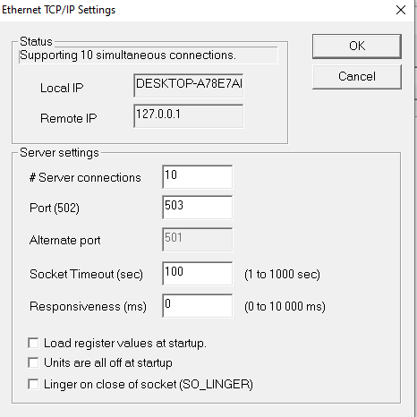

рис.55. Налаштування комунікаційних властивостей `ModRSim2`

У налаштування PLC Simulator можна вказати переадресацію, щоб замість `192.168.3.3` використовувалася локальна адреса та порт `503`. Для цього створюється файл `*.XML`  з відповідними налаштуваннями а його шлях означується в параметрах PLC Simulator `IP Address <-> Port simulation gile` (рис.56)


рис.56. Параметри  PLC Simulator

У нашому випадку файл XML матиме вигляд: 

```xml
<EquiList>
  <PLCAdressSim Address="192.168.3.3" Port="503"></PLCAdressSim>
</EquiList>
```

Після таких налаштувань при новому запуску PLC Simulator він буде робити переадресацію. На даній ітерації треба перевірити що дані надходять саме ті, які є в `ModRSim2`

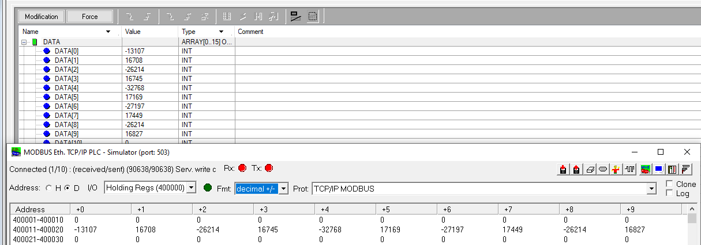

рис.57. Перевірка надходження даних

### Етап 2/3 (програмування). Ітерація 2

Оскільки дані вже надходять необхідно вирішить другу частину задачі - перетворення масиву INT в REAL. Для цього скористаємося інструкцією `FOR`, яка доступна в мові ST (рис.58). Для кожного елементу масиву `AI_DIO1` формується значення, вирахуване з отриманих слів, шляхом їх побітового додавання по OR, зробивши попередньо зсув ліворуч на 16 біт (`SHL`). В залежності від формату збереження даних в джерелі, може прийдеться робити зсув молодшого слова а не старшого. Виконувати операцію перетворення варто робити тільки у випадку відсутності помилок в комунікації.    

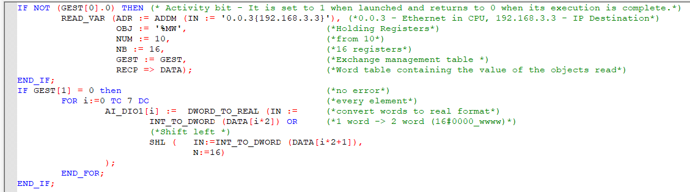

рис.58. Повна програма на ST

### Етап 4 (Налагодження). Ітерація 2

Програма `ModRSim2` дає можливість відображення та зміни в форматі `Float 32`, тому змінюючи значення можна перевірити чи дійсно вони перетворюються правильно в програмі PLC. 

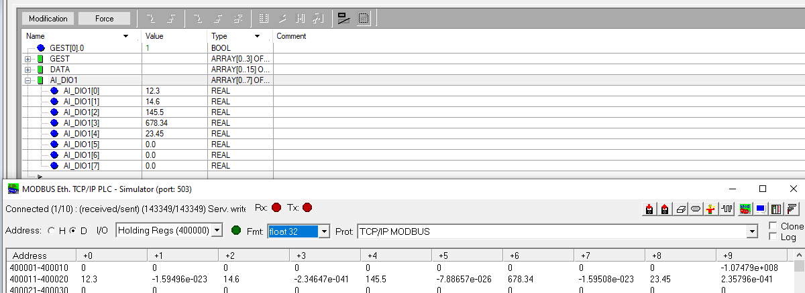

рис.59. Перевірка правильності перетворення даних

## 14. Приклад з використанням мови SFC

Розглянемо приклад програми на мові SFC для вирішення задачі, що описується наступним алгоритмом (рис.60). 

Після натискання кнопки `START`, клапан `kl1` відкривається і апарат заповнюється рідиною до спрацювання `LS2`. Після цього включається мішалка, і відкривається клапан `kl2` для подачі ферментів. Після спрацювання давача `LS3`, клапани та мішалка відключаються, відкривається клапан `kl3`, і продукт зливається з апарату. Коли апарат порожній (`LS1` відключений) клапан `kl3` закривається, і система переходить в початковий стан.


Рис.60.До постановки задачі.  

Опишемо поведінку системи через механізм мережі Петрі (рис.61). Роботу програми можна описати через чотири стадії (кроки): очікування старту (початкова стадія), наповнення рідиною, добавлення ферментів, злив продукту. Під час кожної стадії положення виконавчих механізмів чітко означено: наприклад при наповненні рідиною `kl1` повинен відкритися. Перехід зі стадії на стадію відбувається по певним умовам: наприклад система переходить на стадію  "наповнення рідиною" тільки після стадії "очікування старту" та умови переходу "якщо нажата Start". Таким чином стадії в мережі Петрі є позиціями, а умови – переходами. Коли активується певний крок, він отримує маркер від кроку що деактивується. На рис.61 маркер знаходиться у кроку "Наповнення рідиною". Порівняйте програму керування написану на мові SFC з моделлю системи на базі мережі Петрі. 


Рис.61.Приклад рішення задачі з використанням мереж Петрі та SFC 

## Практикум

Для закріплення матеріалу пройдіть наступні практичні звадання:

- [Практичне завдання 1. Встановлення середовища, створення та запуск проєкту Control Expert Classic](../ide/lab_cotnr_expert.md) 

- Практичне завдання 2. Приклад створення проекту з використанням мови LD

- Практичне завдання 3. Приклад створення проекту з використанням мови FBD
- Практичне завдання 4. Приклад створення проекту з використанням мови ST

## Питання до розділу

1. Поясніть що таке архітектура EcoStruxure? 

2. До якого домену EcoStruxure входять PAC M340/M580 та середовище Control Expert? На що це впливає?

3. Яке призначення середовища Control Expert? Яке місце воно займає в структурі АСКТП?

4. Які програмні продукти передували появі Control Expert? 

5. Які засоби програмуються з використанням Control Expert? Чи можливо використовувати пакет Control Expert для програмування PLC з операційними системами PL7, Concept, Unity?

6. Поясніть відмінність понять "Середовище розробки" та "Середовище виконання".

7. Поясніть структуру середовища виконання Control Expert. 

8. Які основні функції середовища Control Expert?

9. Поясніть що таке DIO та RIO в контексті M580?

10. Поясніть функціональну структуру PLC.

11. Які можливості кіберзахисту M580 і Control Expert Ви можете назвати?

12. Які способи адресації I/O доступні для M580?

13. Поясніть діаграму функціонування PLC в часі.

14. Поясніть що таке Задача? Яка основна Задача виконується в PAC M580? 

15. У яких режимах можуть виконуватися Задачі?

16. Які області даних доступні в PAC M580? Яке їх призначення?

17. Яким чином задається адреса комірок в різних областях даних?

18. Чим відрізняються локалізовані від нелокалізованих змінних?

19. Розкажіть про призначення кожного розділу структури проекту Control Expert.

20. Яким чином створюється виконавчий проект?

21. Яким чином проводиться перехід в режим онлайн?

22. Яким чином завантажується проект в PLC?

23. Яким чином можна змінити виконавчий проект в PLC, не зупиняючи його роботу?

24. При яких умовах можливе вивантаження вихідного проекту з PLC?

25. Яка послідовність створення та налагодження проекту Control Expert?

26. У якому розділі проекту створюється апаратна конфігурація для PLC?

27. Які настройки модулів можна змінити при конфігуруванні?

28. У якому розділі проекту створюються змінні та екземпляри функціональних блоків? 

29. Які основні властивості задаються при створенні змінних?

30. У якому розділі проекту створюється програма користувача?

31. З яких складових складається програма користувача?

32. Які графічні мови програмування IEC 61131 доступні в Control Expert?

33. Які текстові мови програмування IEC 61131 доступні в Control Expert?

34. Які засоби Control Expert доступні для налагодження програми користувача?

35. Яке призначення PLC Simulator?

 

## Джерела

1) https://news.bpx.co.uk/what-is-ecostruxure-from-schneider-electric/

2) https://automatismosmundo.com/en/ecostruxure-the-iot-solution-from-schneider-electric


## Автори


Теоретичне заняття розробив [Олександр Пупена](https://github.com/pupenasan). 

## Feedback

Якщо Ви хочете залишити коментар у Вас є наступні варіанти:

- [Обговорення у WhatsApp](https://chat.whatsapp.com/BRbPAQrE1s7BwCLtNtMoqN)
- [Обговорення в Телеграм](https://t.me/+GA2smCKs5QU1MWMy)
- [Група у Фейсбуці](https://www.facebook.com/groups/asu.in.ua)

Про проект і можливість допомогти проекту написано [тут](https://asu-in-ua.github.io/atpv/)
