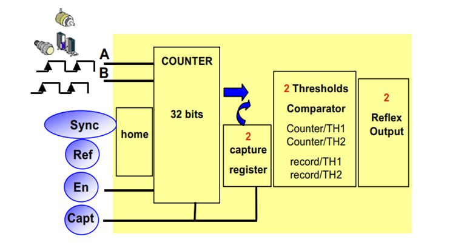

[<- До підрозділу](README.md)			[Коментувати](#feedback)

# Лічильні входи PLC

Ця лекція знаходиться в розробці

## 1. Що таке лічильні входи PLC

Лічильні входи контролера (counter inputs) — це спеціалізовані дискретні входи, призначені для підрахунку імпульсів або подій з високою швидкістю та точністю, незалежно від основного циклу програми контролера. Вони використовуються для вимірювання частоти, швидкості, позиціонування та інших завдань, де потрібен точний облік зовнішніх сигналів. 

## 2. Варіанти виконання лічильних входів.

В компактних контролерах з вбудованими вхідними та вихідними сигналами, як правило наявні від 4 до 8 швидкісних входів для побудови лічильників. Ця опція дозволяє створювати бюджетні реалізації проектів з необхідністю обліку продукції. Для прикладу M241 або S7-1214.
В більш потужних модульних системах у вигляді окремих модулів з швидкісними входами або спеціалізованими лічильними. Для прикладу  BMX EHC 0200 або TM Count 2x24V. Це як правило складний технологічний модуль з окремим процесором призначений більше для задач керування рухом (motion). В цих модулях крім лічильних входів є входи позиціонування та захоплення. Також є дискретні виходи для формування швидких дій ( наприклад порівняння).

рис.1. 

## 3. Основні характеристики лічильних входів

## 4. Основні функції лічильних входів

## 5. Особливості конфігурування та програмування

## Автори

Теоретичне заняття розробив **Олександр Кріль**. 

Враховані коментарі та пропоизиції:

- 

## Feedback

Якщо Ви хочете залишити коментар у Вас є наступні варіанти:

- [Обговорення у WhatsApp](https://chat.whatsapp.com/BRbPAQrE1s7BwCLtNtMoqN)
- [Обговорення в Телеграм](https://t.me/+GA2smCKs5QU1MWMy)
- [Група у Фейсбуці](https://www.facebook.com/groups/asu.in.ua)

Про проект і можливість допомогти проекту написано [тут](https://asu-in-ua.github.io/atpv/)