[<- До підрозділу](README.md)  [Коментувати](#feedback)

# Дискретні входи PLC

## 1. Що таке дискретний вхід PLC

Призначення кола дискретного входу (DI-circuit) полягає в тому, щоб отримати двійковий сигнал, який передає дискретний датчик й надійно інтерпретувати стан цього датчика. На рис.1 показано блок-схеми одного входу типового AC-вхідного модуля дискретних входів. Вхідне електричне коло складається з двох основних частин: силової частини (Power) та логічної частини (Logic). Оптичний ізолятор (Opto-electrical isolation) використовується для електричної ізоляції між частиною від поля та внутрішніми схемами шини PLC (PLC backplane internal circuitry). Вхідний світлодіод (Input status indicator, LED) використовується для діагностування стану каналу. Логічні схеми (Logic circuits) обробляють цифровий сигнал перед передаванням у процесор (low VDC). Внутрішні керувальні схеми PLC зазвичай працюють від 5 В постійного струму або нижче.

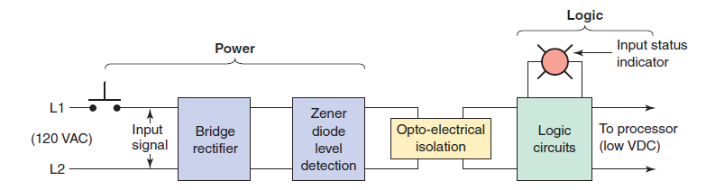

рис.1. Блочна схема дискретного входу змінного струму (AC) (Джерело [Programmable logic controllers / Frank D. Petruzella. — 4th ed.])

Таким чином у силовій частині кола сигнал від кнопки надходить як вхідний сигнал (Input signal) до місткового випрямляча (Bridge rectifier), після чого проходить через секцію виявлення рівня напруги на стабілітроні (Zener diode level detection). Далі сигнал переходить до оптоелектричної ізоляції (Opto-electrical isolation), а потім — у логічну частину (Logic), де обробляється логічними схемами (Logic circuits) та передається до процесора.

Спрощену схему одного входу AC-вхідного модуля дискретних входів показано на рис.2. Роботу електричного кола можна описати так:

- Вхідний фільтр шуму (Filter), утворений конденсатором `C` та резисторами `R1` і `R2`, приглушує хибні сигнали, які виникають через брязкіт контактів або електричні завади.
- Коли кнопка PB (pushbutton) натиснута, 120 В змінного струму подаються на вхід місткового випрямляча (Bridge rectifier).
- Після випрямлення утворюється низьковольтна напруга постійного струму, яку подають на світлодіод оптичного ізолятора (Optical isolator).
- У вузлі визначення порога (Threshold detector) стабілітрон $Z_D$ задає мінімальний рівень вхідної напруги, за якого схема реагує.
- Коли світло від світлодіода потрапляє на фототранзистор усередині оптичного ізолятора (Optical isolator), він переходить у стан провідності, і стан кнопки PB передається у цифрову логічну схему (Digital logic circuit) та далі — у процесор.
- Оптичний ізолятор (Optical isolator) виконує дві функції: розділяє вхідну високовольтну AC-частину від логічної низьковольтної частини та захищає процесор від кидків напруги. Крім того, така ізоляція зменшує вплив електричного шуму, типового для промислових умов.
- Для діагностики роботи входу світлодіодний індикатор стану (LED input status indicator) світиться тоді, коли кнопка PB натиснута. Індикатор може бути підключений як зі сторони високої напруги, так і зі сторони логіки.
- Вхідні модулі типу AC/DC можуть працювати як з AC-, так і з DC-сигналами, оскільки полярність входу для них не має значення.
- Вхідні модулі PLC можуть мати або повністю ізольовані входи без спільних з’єднань, або групи входів з однією спільною клемою (Common).

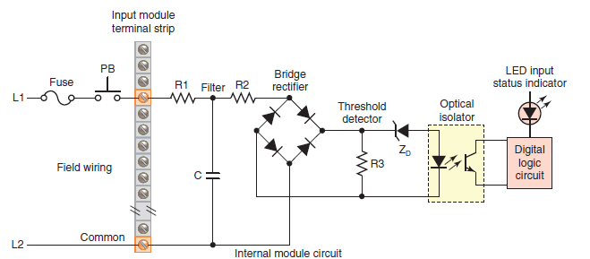

рис.2. Спрощена діаграма одного дискретного входу AC (Джерело [Programmable logic controllers / Frank D. Petruzella. — 4th ed.])

Дискретні вхідні модулі виконують у системі керування PLC чотири основні функції:

- Визначають момент отримання сигналу від польового пристрою (field device).
- Перетворюють вхідний сигнал у відповідний рівень напруги для конкретного PLC.
- Ізолюють PLC від коливань напруги або струму у вхідному сигналі.
- Передають у процесор сигнал, який указує, від якого датчика надійшов вхідний сигнал.

Дискретні вхідні канали PLC та модулів відрізняються за:

- типом і рівнем електричних сигналів, та порогів спрацювання
- швидкості обробки сигналу
- наявності додаткових функцій
- способом підключення 

Огляд дискретних каналів та датчиків за рівнем електричних сигналів, та порогів спрацювання розглядається нижче. 

Швидкі входи передбачають їх додаткову апаратну обробку, яка часто включає підрахунок імпульсів та виклик подієвої задачі за їх спрацювання. Такі входи також називають лічильними, вони розглядаються в іншій темі посібника.    

## 2. Означення дискретних порогів для електричних сигналів

Дискретні вхідні канали PLC відрізняються за рівнем напруги або струму, типом електричного сигналу та способом його формування. Це означує, з якими датчиками вони сумісні, які пороги значень ON/OFF (ВКЛ/ОТКЛ) мають, яким є споживаний струм та як PLC інтерпретує стан входу. 

У стандарті IEC 61131-2 передбачено кілька типів дискретних вхідних сигналів, але найбільш формалізованим і докладно описаним є 24 VDC, разом з тим не обмежується лише ним. У стандарті згадуються й інші рівні напруги, зокрема AC-входи (наприклад, 120 VAC або 230 VAC) та "нестандартні" DC-входи, які можуть працювати на інших значеннях. Виробник повинен сам забезпечити коректність роботи цих інтерфейсів і задекларувати їхні характеристики у технічній документації. Для нестандартних рівнів напруги IEC містить лише загальне розрахункове рівняння, за яким виробник має проектувати такі входи.

Однак окрім IEC 61131-2, можуть використовуватися і інші стандарти. Це може привести до необхідності використання спеціалізованих модулів для PLC або додаткового перетворення. 

### Спрацювання за рівнем напруги постійного струму (DC)

Дискретні DC-входи використовуються найчастіше в сучасних PLC і є базовим стандартом для більшості промислових датчиків. Вони забезпечують стабільну роботу, сумісність із транзисторними датчиками та низьку чутливість до шуму.

- **24 VDC**. Найбільш вживаним є сигнал 24 VDC. Причини того, що саме цей тип сигналів став домінуючим рівнем у промисловій автоматизації, цілком практичні. Передусім така напруга вважається безпечною для людини: вона достатньо низька, щоб у разі випадкового доторкання ризик ураження був мінімальним, але водночас достатньо висока для надійного живлення датчиків і модулів PLC. Крім того, 24-вольтова логіка добре переносить електричні завади і може працювати на значних довжинах кабельних трас без помилкових спрацювань, що є критично важливим у промисловому середовищі з великою кількістю джерел електромагнітного шуму. Ще однією причиною є широке використання транзисторних датчиків з виходами типу PNP і NPN, для яких 24 VDC стала природною напругою живлення. Цей рівень дозволяє формувати чіткі логічні стани, підтримувати достатній робочий струм і при цьому забезпечувати низьке тепловиділення. Нарешті, саме 24 VDC історично закріпився як стандарт у європейській промисловості, а пізніше був гармонізований міжнародними нормами. Це створило ситуацію, коли більшість виробників датчиків і контролерів орієнтуються саме на 24-вольтову логіку, що ще більше посилює її домінування. Саме для цього рівня стандарт визначає три класи входів — Type 1, Type 2 та Type 3, для яких встановлені граничні значення напруги, струмів, часові параметри та вимоги до сумісності з датчиками. Для 24-вольтових входів стандарт задає чіткі пороги станів LOW/HIGH і визначає, який рівень струму повинен забезпечувати датчик у кожному стані.
- **48VDC**. У стандартній промисловій автоматизації цей рівень використовуються рідко, однак певні галузі все ще застосовують їх у спеціалізованих системах. Зокрема у телекомунікаційному обладнанні (де 48 В є галузевим стандартом живлення), деяких системах безперебійного живлення, старих або специфічних машинах, де історично використовували 48-вольтові котушки реле чи датчиків. Сигнал має гарну стійкість до шуму та може передаватися на значні відстані. Підвищена енергія дуги робить рівень менш безпечним для ручної роботи, порівняно з 24 VDC.

- **12 VDC**. Рівень 12 VDC у промисловій автоматизації застосовується рідко. Його можна зустріти переважно у спеціалізованому обладнанні, у системах з автомобільною електронікою або в компактних датчиках, які розраховані саме на 12-вольтове живлення. Такий рівень погано сумісний зі стандартними модулями PLC, оскільки більшість промислових входів проєктуються під 24 VDC. Крім того, сигнали на 12 VDC мають нижчу стійкість до електричних завад і сильніше залежать від падіння напруги на довгих кабельних лініях. Саме тому 12-вольтові дискретні входи використовуються лише там, де система вже має власне 12 V живлення або де це продиктовано особливостями обладнання.

- **5 VDC.** Рівень 5 VDC застосовується у дискретних входах тоді, коли потрібна дуже висока швидкість обробки сигналів. До таких джерел належать енкодери, імпульсні датчики та високошвидкісні лічильники, які можуть генерувати десятки або навіть сотні тисяч імпульсів за секунду. У цьому діапазоні найчастіше використовується логіка TTL з рівнями 0/5 В, яка забезпечує мінімальні затримки й точне формування фронтів сигналу. Однак такі входи значно чутливіші до електричного шуму, ємності кабелю та його довжини, тому вимагають якісного екранування та мінімізації трас. Стандартні дискретні входи PLC на 24 V не здатні коректно працювати з такою частотою, тому для швидкісних сигналів застосовують спеціальні модулі типу HSC або HSI, призначені саме для TTL-рівнів.

### Спрацювання за рівнем напруги змінного струму (AC)

Дискретні входи змінного струму застосовуються в тих випадках, коли датчики, перемикачі або інші пристрої працюють безпосередньо від мережевої напруги. На відміну від DC-входів, такі модулі містять внутрішні схеми випрямлення, порогового визначення та оптоізоляції, які забезпечують правильне розпізнавання станів незалежно від фази та полярності. Типовою побудовою такого входу є мостовий випрямляч у поєднанні зі стабілітроном, як це показано на рис. 2.

- **120 VAC** (США, Канада). Рівень 120 VAC широко застосовується в Північній Америці, особливо в старіших або специфічних промислових установках. Такі входи часто використовують для кінцевих вимикачів, релейних контактів або ручних перемикачів, які безпосередньо підключаються до мережі. Водночас вони мають підвищений рівень електричних завад і більшу потенційну енергетичну небезпеку, тому потребують ретельної гальванічної ізоляції та захисних елементів у конструкції PLC-модуля.

- **230 VAC** (Європа). У європейських системах також зустрічаються дискретні входи, розраховані на 230 VAC, які дозволяють підключати мережеві пристрої без проміжного живлення. Такі входи потребують високої електричної міцності ізоляції та захисту від перенапруг, оскільки працюють з напругою значно вищою, ніж у DC-системах. Через підвищені вимоги безпеки та перехід промисловості до низьковольтних стандартів 230-вольтові дискретні входи використовуються дедалі рідше й майже не зустрічаються в нових PLC-проєктах.

### Врахування полярності: Sinking та Sourcing

У промислових датчиках і дискретних входах PLC широко використовуються поняття **sourcing** (джерело) і **sinking** (стік), які описують напрямок протікання струму в сигнальному колі. З фізичної точки зору ці поняття можуть застосовуватися і в колах змінного струму, і в колах постійного струму, оскільки йдеться лише про напрямок протікання струму відносно навантаження. Однак у системах з AC-сигналами напрямок струму змінюється кожен півперіод, тому концепція "джерело/стік" втрачає практичну цінність: у таких колах немає фіксованого плюса чи мінуса, а отже відсутня стала полярність, на якій базується транзисторна логіка. Саме тому у промисловій автоматизації терміни sourcing і sinking застосовуються переважно до датчиків і входів/виходів постійного струму, де є однозначно визначені +24 V та 0 V. 

У режимі sourcing пристрій діє як джерело струму, тобто видає на свій вихід потенціал `+`. Наприклад, контакт у стані увімкнення, або датчик PNP виходом,  передає на вхід PLC рівень +24 В, а PLC сприймає це як логічну одиницю. Таким чином, sourcing завжди пов’язаний із "подаванням" плюса у коло.

У режимі sinking пристрій, навпаки, працює як приймач струму. Він з’єднує вихід із нульовим потенціалом, тобто з 0 В. Прикладом такого пристрою є NPN-датчик, який у стані увімкнення притягує сигнальну лінію до загальної шини, і PLC реєструє це як логічний стан "1". Так само може сухий контакт замикати коло на сигнальну землю (GND). У термінах електротехніки sinking відповідає функції стоку струму, тобто підключенню навантаження до низького потенціалу.

Для коректної взаємодії необхідно, щоб вихід датчика та вхід PLC були протилежних типів: вихід sourcing повинен підключатися до входу sinking, а вихід sinking — до входу sourcing. 

Таким чином входи sinking для PLC очікують `+` на каналі і мають як правило загальний `-`  для групи каналів, а входи sourcing для PLC навпаки очікують `-` на каналі і мають як правило загальний `+`  для групи каналів. Приклади підключення sink та source показані на рис.3. Підключення датчиків наближення також показано на рис.6 та рис.7. 

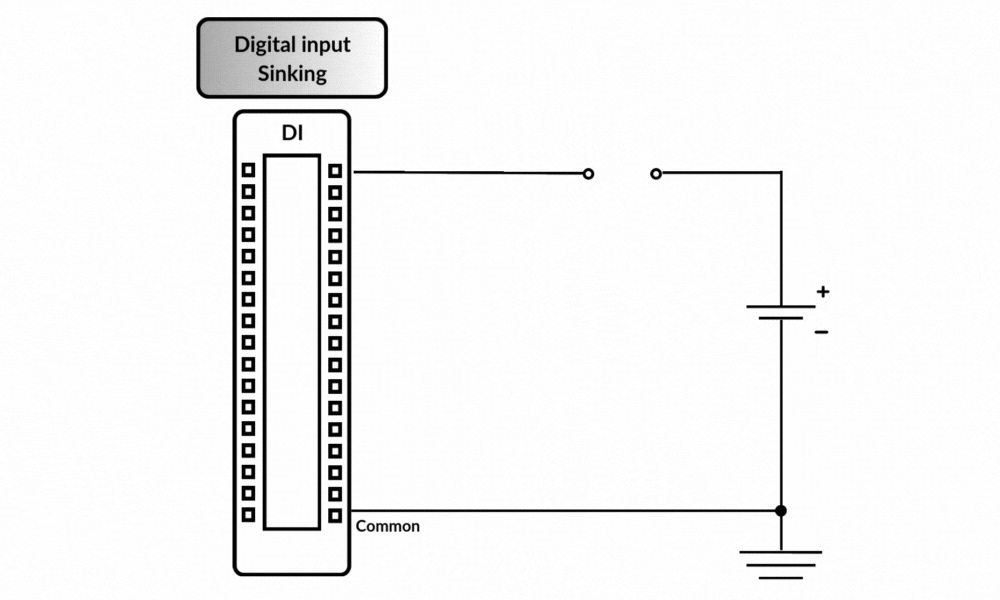

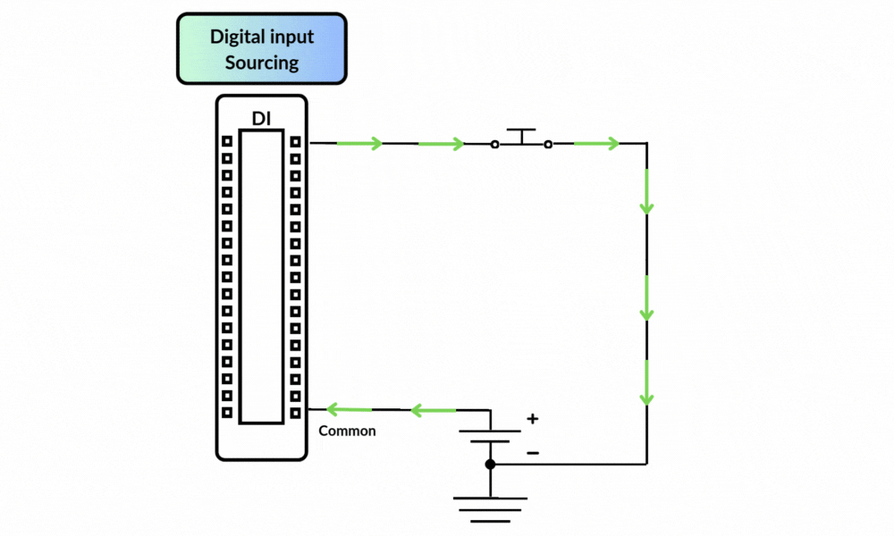

рис.3. Підключення контакту до дискретного входу sinking (зверху)  і sourcing (знизу) (анімацію взято [звідси](https://controlbyte.tech/blog/sinking-vs-sourcing-understanding-plc-input-and-output-sensors/))

### Спрацювання за рівнем струму

Вище були описані найбільш поширені випадки дискретних сигналів, які базуються на визначення порогу за рівнем напруги. Однак в промисловості також зустрічаються дискретні сигнали що кодуються рівнем струму, що протікає через коло, а не напруги. У цьому випадку напруга сама по собі не несе інформаційної складової, а виступає лише як джерело живлення для лінії. Вхідний модуль або проміжний підсилювач контролює струм у колі та порівнює його з двома встановленими порогами. Якщо струм нижчий за нижній поріг, вхід реєструє стан логічного “0”, а якщо перевищує верхній поріг — стан “1”. Ключовим є те, що перехід між логічними станами відбувається не за принципом «є напруга / немає напруги», а в залежності від того, скільки міліампер протікає в двопровідній лінії. Такий підхід дає змогу працювати зі слабкострумовими колами, забезпечувати самодіагностику обривів або коротких замикань та підтримувати стабільний рівень сигналу на великих відстанях.

Використання струму як носія логічного стану має свою практичну мотивацію. Струмова петля є значно менш чутливою до індукованих наведень, паразитних напруг або падіння напруги на довгих кабелях, ніж традиційні дискретні сигнали, що формуються зміною напруги. Коли лінія навантажена стабільним джерелом живлення, а вхідний пристрій аналізує саме струм, електричні завади практично не впливають на спрацювання. Це дозволяє використовувати слабкі сигнали на дистанціях у десятки або навіть сотні метрів, не втрачаючи достовірності. Крім того, контроль струму забезпечує вбудований захист: обрив лінії, коротке замикання або пошкодження кабелю призводять до різкого зміщення струму за межі дозволеної області, що дає змогу надійно визначити аварійний стан.

Окремим прикладом систем, що працюють на основі струмових порогів, є датчики за стандартом NAMUR. Їх опис наведено нижче.

## 3. Типи дискретних датчиків та їх підключення

У промислових системах автоматизації дискретні датчики можуть мати різну конструкцію та різні принципи формування сигналу. Вони можуть бути як механічними, так і електронними, а також мати різні схеми підключення — 2-провідні, 3-провідні або 4-провідні. Тип датчика безпосередньо впливає на вибір входу PLC, рівні сигналів і вимоги до електричної сумісності. Нижче наведено основні типи дискретних датчиків, які використовуються в промислових застосуваннях.

### Сухі контакти (dry contact)

Сухий контакт — це механічний перемикач, який не має власного джерела напруги й не генерує струму. Він лише замикає або розмикає електричне коло, дозволяючи PLC визначити стан входу. Приклади: кнопки, контакти реле, кінцевики, мікровимикачі, аварійні вимикачі. Характерні властивості:

- не потребують окремого живлення;
- у стані OFF струм в колі що замикається відсутній повністю;
- чутливі до механічного дребезгу;
- можуть використовуватися на значних довжинах кабелів.

Це найпростіший і найнадійніший тип дискретних сигналів, історично перший у PLC. Контакт просто замикає електричне коло, тому рівень напруги дискретних сигналів може бути будь-яким у межах, допустимих для входу PLC. Механічний контакт не формує власної напруги й не задає логічного рівня — він лише з’єднує або роз’єднує провідники. Саме модуль PLC визначає, що таке «логічний 0» і «логічна 1» на цьому вході, виходячи зі свого внутрішнього джерела живлення та порогів напруги.

Через це сухі контакти можуть використовуватися з дуже різними рівнями сигналів: від низьковольтних цифрових кіл 120/230 VAC (якщо це дозволено типом входу). Така універсальність робить їх сумісними з найпростішими входами PLC, особливо з тими, що відповідають класу Type 1 за IEC 61131-2. На практиці саме сухий контакт задає лише стан "розімкнено/замкнено", а все інше, тобто рівень напруги, пороги спрацювання та формування логічних рівнів бере на себе модуль входів PLC.

### Електронні 2-провідні датчики (за напругою)

Датчики цього типу не тільки передають сигнал але і живляться по тій же парі проводів. Вихідний стан датчика формується електронною схемою всередині датчика. Через конструктивні особливості в стані OFF присутній струм витоку, який зумовлений живленням електроніки. Прикладами таких датчиків є: індуктивні, ємнісні та оптичні 2-провідні датчики, деякі фотоелектричні датчики. Особливості:

- простий монтаж;
- наявність OFF-струму;
- сильніше реагують на довжину кабелю та падіння напруги.

Оскільки через датчик навіть у стані OFF протікає струм витоку, необхідний для живлення внутрішньої електроніки, входи PLC, до яких підключаються такі датчики, повинні бути спеціально сумісними з низькими OFF-струмами (для цього призначені входи, які у стандарті IEC 61131-2 класифікуються як Type 2 або Type 3; див. нижче).

Переваги у таких датичків і підлкючення:

- простий монтаж, 
- менше проводів. 

Недоліки: 

- наявність струму витоку при OFF, 
- ризик хибних “ON”, бо електроніка живиться через той самий провід, що й OUT, тому з'являється струм витоку, який може збивати з толку PLC.
- обмеження щодо сумісності з входами PLC
- обмеження довжини кабелю, бо падіння напруги впливає на живлення датчика

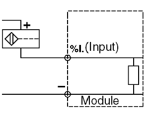

рис.4 Приклад 2-х провідного підключення  індуктивного датчика наближення до входу типу sink (+ на вході DI PLC) 

рис.5 Приклад 2-х провідного підключення  індуктивного датчика наближення до входу типу source (- на вході DI PLC) 

### Електронні 3-провідні датчики (за напругою)

Це найпоширеніший тип сучасних промислових датчиків. Датчик має окремо живлення (+V), загальну клему (0V) і вихідний сигнал (OUT). Вихід працює як транзисторний ключ PNP або NPN і не має струму витоку у стані OFF. Прикладами є індуктивні PNP/NPN, ємнісні PNP/NPN, фотоелектричні PNP/NPN, датчики положення та оптичні бар’єри. Особливості:

- чіткий ON/OFF без проміжних станів;
- мінімальна чутливість до шуму;
- сумісність із більшістю дискретних входів;
- стабільна робота на довгих кабелях;
- відсутність OFF-струму.

Так датчики підключаються через окремі дроти для:

- живлення (+V),
- загального контакту (0V),
- вихідного сигналу (OUT).

3-провідні датчики можуть підключатися до PLC як у режимі sourcing (PNP), так і sinking (NPN), залежно від того, який тип входів має модуль. Зверніть увагу що sourcing для датчика (PNP) вимагає sinking для дискретного входу та навпаки (рис.6 та рис.7).

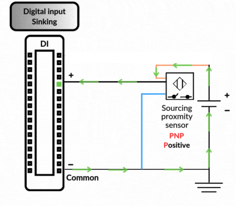

рис.6 Приклад 3-х провідного підключення індуктивного датчика наближення до входу типу sink (+ на вході DI PLC) (рисунок взято [звідси](https://controlbyte.tech/blog/sinking-vs-sourcing-understanding-plc-input-and-output-sensors/))

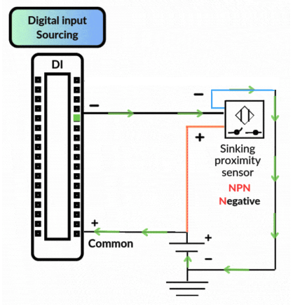

рис.7 Приклад 3-х провідного підключення  індуктивного датчика наближення до входу типу source (- на вході DI PLC) (рисунок взято [звідси](https://controlbyte.tech/blog/sinking-vs-sourcing-understanding-plc-input-and-output-sensors/))

До недоліків таких датчиків можна віднести наявність додаткового третього проводу.

### Електронні 4-провідні датчики (за напругою)

4-провідні датчики мають окремий вихідний каскад, часто з двома виходами (PNP і NPN) або з окремими каналами NO/NC. Живлення подається окремими двома проводами, а вихід не залежить від живильного кола. Прикладами є: фотоелектричні бар’єри з виходами NO і NC, датчики з вибором PNP/NPN виходу,  деякі спеціальні датчики з розділеними каналами Особливості:

- найбільша гнучкість у сумісності;
- низькі втрати напруги;
- можливість вибору режиму роботи;
- потребують більше проводів і клем.

4-провідні датчики (часто фотоелектричні або високоточні сенсори) мають окремі дроти для живлення і для вихідного каскаду. Це означає, що вихідний сигнал фізично розділений з живильною частиною. 4-провідні датчики найменш вибагливі до типу входу PLC, але потребують більше місця на клемах і трохи складніші у монтажі.

### Датчики NAMUR (за струмом)

Як вже зазначалося вище, є дискретні датчики, які кодують сигнал не за рівнем напруги а за струмом. До них відносяться датчики наближення NAMUR, які широко використовується в промисловому керуванні, особливо у випадках коли необхідно обмежувати силу струму в контурі. Особливо це актуально для усунення можливості виникнення електричних дуг, що є неприпустимим у вибухонебезпечних середовищах. Також використання струму робить цей тип підключення надійним та завадостійким.   

Датчики NAMUR та їхні інтерфейси (дискретний вхід або підсилювачі) повинні відповідати стандарту NAMUR (EN 60947-5-6:2000 або IEC 60947-5-6). Скорочення NAMUR походить від німецького терміна "Normenarbeitsgemeinschaft für Meß- und Regelungstechnik in der Chemischen Industrie", що означає "Асоціація зі стандартизації вимірювальної та керувальної техніки в хімічній промисловості". Модулі дискретних входів NAMUR в PLC, до яких підключаються ці датчики, по суті вимірюють малорівневий вхідний струм та відповідають стандарту NAMUR. 

На рис. 8 наведено спрощену модель датчика NAMUR. Датчик підключається по 2-х провідній схемі, та працює при номінальній робочій напрузі 8.2 В.  Замикання контакту датчика приводить до зміни (зменшення) загального опору кола, і відповідно зміни (збільшення) малорівневого струму (кілька мА), яку має виявити дискретний вхід NAMUR. Типові значення порогових струмів становлять менше 1.2 мА для стану OFF і більше 2.1 мА для стану ON.

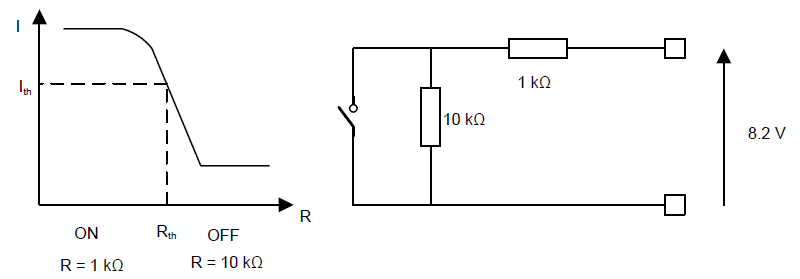

Рис.8. Модель датчика NAMUR

Як вже зазначалося стандарт NAMUR означує допустимі робочі області датчика NAMUR, які наведені на рис. 9. Поверх характеристики струм(I) - напруга (V) накладені різні рівні опору датчика. Відповідно в залежності від опору лінії, та напруги живлення визначається стан ON та OFF. Варто звернути увагу, що нульовий струм в петлі значить обрив лінії зв'язку.

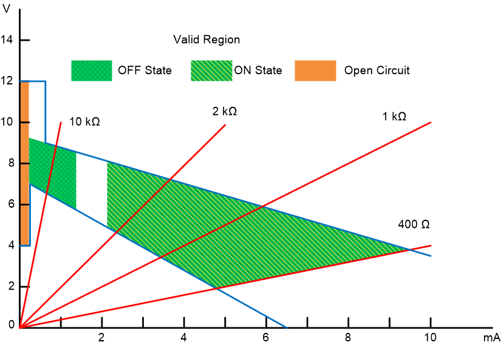

Рис.9. Допустимі робочі області датчика NAMUR

Дискретний вхід типу NAMUR виконує роль бар’єра та підсилювача для датчика NAMUR. Він подає на датчик обмежену потужність (обмежену напругу та обмежений струм) і здатний інтерпретувати малорівневий вихідний сигнал датчика для визначення його стану. На рис.10 наведена спрощена електрична схема дискретного входу NAMUR. Стабільні 8.2 В формуються з польового живлення 24 В, при цьому у разі короткого замикання на живлення струм обмежується. Аналогові компаратори, що живляться від 24 В, перетворюють зворотний струм у напругу та фільтрують його для виявлення стану. Ізоляція виходів масиву компараторів від шини PLC захищає вихідні лінії у разі імпульсних перенапруг чи інших шкідливих впливів. На додаток до забепзечення струм-напругових характеристик відповідно стандарту, для сучасних вхідних модулів необхідними є діагностичні функції.

Таким чином модуль входу NAMUR має реалізовувати наступні функції:

-  Забезпечувати регульовану вихідну напругу 8.2 В без навантаження з вихідним опором 1 кΩ.
-  Обмежувати струм у разі короткого замикання навантаження до значення нижче 10 мА.
-  Виявляти стан OFF (нижче 1.2 мА вхідного струму) та ON (понад 2.1 мА).
-  Виявляти несправність датчика: стан короткого замикання (поблизу струмового обмеження) та обриву (поблизу нульового струму).
-  Виявляти помилку короткого замикання на лінію живлення (пряму та зворотну).
-  Захищати від неправильного підключення (коротке замикання на польове живлення, пряму та зворотну полярність).
-  Захищати від імпульсних перенапруг.

Багато цих функцій (виявлення та захист) пов’язані з надійністю. 

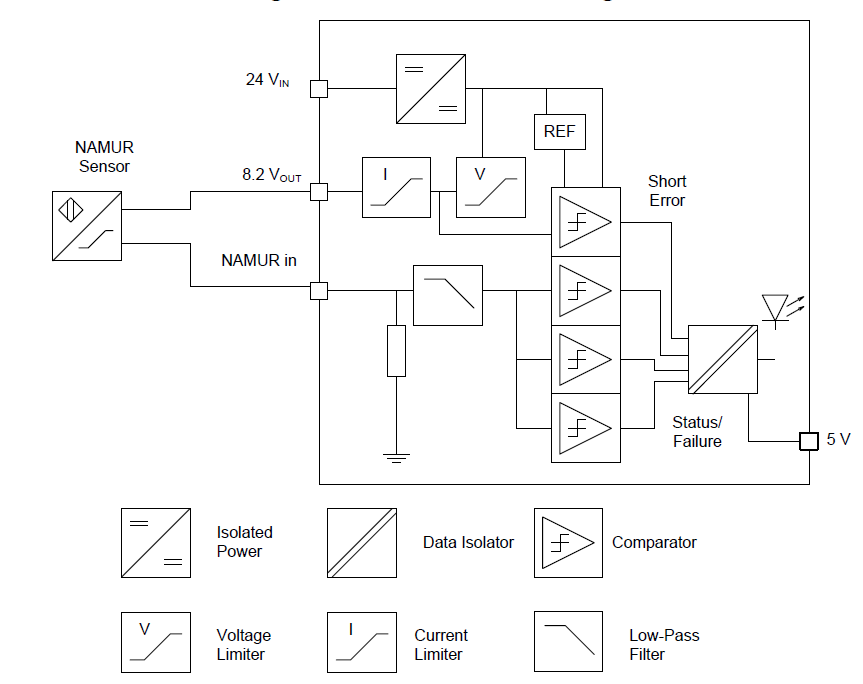

Рис.10. Принципова електрична схема дискретного входу NAMUR модуля TIDA-010044 (Texas Instruments)

## 4. Типи дискретних вхідних сигналів згідно IEC 61131-2

Вибір типу дискретного входу залежить від електричних характеристик датчиків і має велике значення для сумісності з ними. Стандарт IEC 61131-2 означує три типи дискретних входів DC зі стоком струму (sinking).

- Тип 1: Механічні комутаційні контакти (2-провідне підключення) та напівпровідникові датчики (лише 3-провідне підключення). Дискретні входи Типу 1 перетворюють сигнали з електромеханічних комутаційних пристроїв (реле, кнопки тощо), які мають два стани, у двійковий сигнал. Однак такі входи не можуть використовуватися з 2-провідними напівпровідниковими перемикачами (датчиками, індуктивними сенсорами тощо). 

- Тип 2: Напівпровідникові датчики (2-провідне підключення). Дискретні входи Типу 2 перетворюють сигнали з напівпровідникових перемикачів із двома можливими станами у двійковий сигнал. Входи Типу 2 мають підвищене енергоспоживання і краще підходять для модулів із невеликою кількістю каналів. Вони можуть використовуватися з 2-провідними датчиками наближення.

- Тип 3: Напівпровідникові датчики (2-провідне або 3-провідне підключення) зі зниженим енергоспоживанням. Подібно до входів Типу 2, входи Типу 3 перетворюють сигнали з двома можливими станами від напівпровідникових перемикачів (у тому числі 2-провідних датчиків наближення) у двійковий сигнал. Зростання вимог до систем керування у промисловості викликало потребу у збільшенні щільності каналів дискретних входів. Означення Типу 3 у стандарті було введено саме для цього: воно дозволяє оптимізувати використання простору в шафі керування та уникнути необхідності в нульовому сигнальному струмі. Входи Типу 3:

  - мають менше електричне споживання, ніж Тип 2 (навіть за високих напруг)

  - добре підходять для компактних модулів з великою кількістю каналів

  - виділяють мало тепла, що дозволяє збільшувати щільність каналів

  - забезпечують нульовий струм сигналу (zero-signal current) для датчиків

  - можуть використовуватися замість входів Типу 2 та Типу 1

  - сумісні з пристроями за IEC 60947-5-2 (з меншим струмом у стані OFF)

Граничні значення напруги та струму для дискретного входу 24 V DC

| Характеристика          | Type 1    | Type 1    | Type 2    | Type 2    | Type 3    | Type 3    |
| ----------------------- | --------- | --------- | --------- | --------- | --------- | --------- |
| Стан                    | OFF (0)   | ON (1)    | OFF (0)   | ON (1)    | OFF (0)   | ON (1)    |
| Voltage limits $V_{IN}$ | –3 … 15 V | 15 … 30 V | –3 … 11 V | 11 … 30 V | –3 … 11 V | 11 … 30 V |
| Current limits $I_{IN}$ | 15 mA     | 2 … 15 mA | 30 mA     | 6 … 30 mA | 15 mA     | 2 … 15 mA |

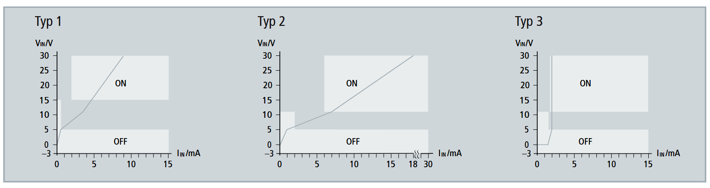

рис.11. Діаграма визначення стану за струмом та напругою

## 5. Надана виробником інформація про дискретні входи

Згідно стандарту IEC 61131-2 виробник має надати таку інформацію про дискретні вхідні канали та модулі:

- вольт-амперну характеристику на всьому робочому діапазоні, включно з допусками або еквівалентними даними;

- час затримки дискретного входу під час переходів 0→1 та 1→0;

- наявність або відсутність спільних точок між каналами;

- вплив неправильної комутації клеми входу;

- значення ізоляційних напруг між каналом і іншими колами (включно із заземленням), а також між самими каналами за нормальних умов роботи;

- тип входу (Type 1, Type 2 або Type 3);

- місце контролю та двійковий стан світлового індикатора;

- наслідки вилучення або вставлення модуля під напругою;

- необхідне додаткове зовнішнє навантаження при взаємному підключенні входів та виходів, якщо таке потрібне;

- пояснення способу обробки сигналу (наприклад, статична чи динамічна обробка, використання переривань тощо);

- рекомендовану довжину кабелів та шнурів залежно від типу кабелю і вимог електромагнітної сумісності;

- схему та позначення клем;

- типові приклади зовнішніх підключень.

Розглянемо на прикладі описі дискретного модуля (рис.12) Modicon BMX DDI 3232.

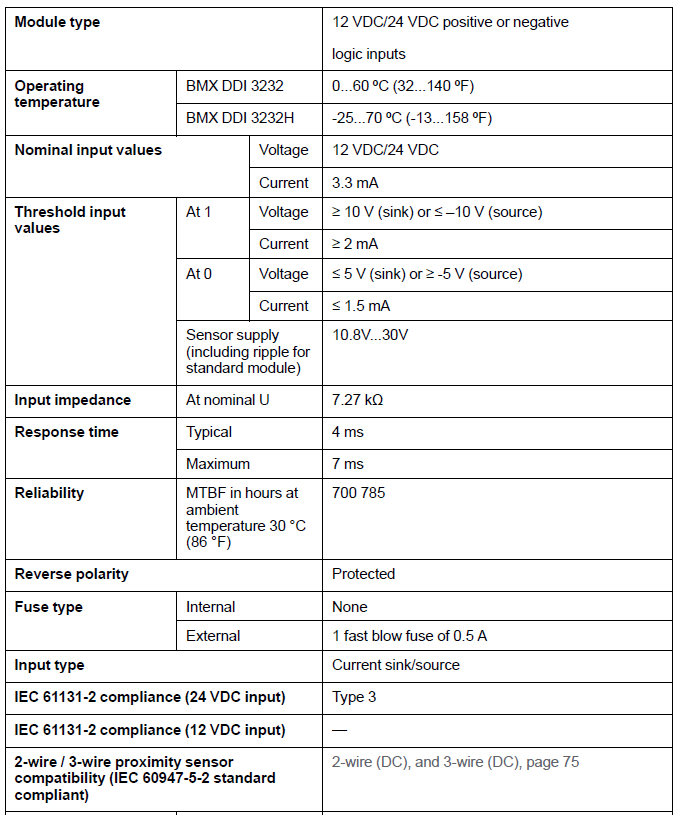

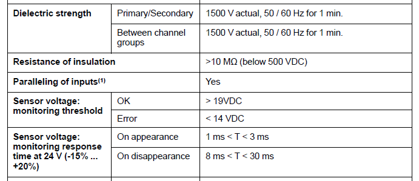

рис.12. Приклад таблиці характеристики дискретного вхідного модулю Modicon BMX DDI 3232 (Система X80 Schneder Electric) 

З таблиці рис.12 можна дізнатися наступну інформацію:

- Модуль BMX DDI 3232 є 32-канальним модулем цифрових входів для сигналів 12 VDC або 24 VDC, що підтримує як sink так і source підключення. У термінах Schneider Electric дискретні входи типу sink вважаються позитивною логікою, тоді як source - негативною логікою. 

- Робочі температури: 
  - Модель DDI 3232: від 0 до 60 °C 
  - Модель DDI 3232H: від −25 до 70 °C. Розширений діапазон версії H дозволяє застосовувати модуль у холодних приміщеннях та на відкритих виробничих майданчиках.
- Робочі рівні напруги: 12 VDC або 24 VDC.
- Номінальний споживаний струм входу: приблизно 3.3 mA. Низький струм навантаження свідчить про високий внутрішній опір і низькі втрати на входах.
- Порогові рівні входів (відповідають вимогам IEC Type 3)
  - Стан 1: напруга ≥ 10 V (sink) або ≤ −10 V (source), струм ≥ 2 mA.
  - Стан 0: напруга ≤ 5 V (sink) або ≥ −5 V (source), струм ≤ 1.5 mA.

- Живлення датчиків: 10.8…30 VDC.
- Вхідний опір: 7.27 kΩ 

- Час реакції (перехід між станами): типовий - 4 ms, максимальний - 7 ms.

- Надійність (MTBF - середній час між відмовами): 700 785 годин при 30 °C (> 79 років) безвідмовної роботи в розрахунковому режимі.
- Є захист від неправильної полярності. Вхідні кола захищені від помилкового підключення полярності, що запобігає пошкодженню при типових помилках монтажу.
- Запобіжники
  - Внутрішні (всередині модуля): відсутні.
  - Зовнішні (рекомендовані для встановлення): рекомендується встановлювати швидкодіючий запобіжник 0.5 А на лінію живлення. Це вимога виробника для підвищення надійності всієї системи.

- Тип входу: Current sink/source. Це універсальна схема, що дозволяє підключати датчики з різною полярністю.
- Входи 24 VDC відповідають IEC Type 3. Для 12 VDC специфікація IEC Type не означується.

- Сумісний із двопровідними та трипровідними датчиками постійного струму відповідно до IEC 60947-5-2.

- Пробивна напруга. ЦІ значення забезпечують рівень гальванічної розв’язки між каналами та між шиною живлення та шиною процесора.
  - Між первинною і вторинною частиною: 1500 V AC, 50/60 Hz, 1 хвилина.
  - Між групами каналів: 1500 V AC, 50/60 Hz, 1 хвилина.
- Опір ізоляції > 10 MΩ при тесті напругою до 500 VDC. Параметр вказує на якість ізоляції та захист від витоків.

- Підтримується паралельне з’єднання входів. Цю характеристику використовують для паралельного підключення кількох входів до одного й того самого модуля або до різних модулів для резервування входів.

- Пороги напруги - вбудована функція діагностики живлення датчиків, що дозволяє виявити обрив або просідання живлення.:
  - Стан `OK`: напруга вище 19 VDC.
  - Стан `Error`: напруга нижча 14 VDC.

- Час реакції діагностики, що гарантує коректну роботу фільтрації, запобігаючи помилковим спрацьовуванням.
  - Поява напруги: від 1 до 3 ms.
  - Зникнення напруги: від 8 до 30 ms. 

## 6. Приклади описів електричних схем підключення 

Розглянемо кілька схем підключення окремих дискретних каналів та модулів, для кращого розуміння.

### Приклад дискретних каналів VDC

На рис.13 показано спрощену структуру дискретного входу модуля. Як видно, канал підключений по схемі приймання струму (sinking). Датчик подає позитивну напругу на вхід, а сам модуль забезпечує шлях струму до свого нульового потенціалу всередині. Струм проходить через захисний діод, що захищає від зворотної полярності, і через елемент обмеження перенапруги (стабілітрон), який спрацьовує при імпульсних або підвищених напругах на проводі датчика. Далі струм проходить через оптоелектронний елемент, який забезпечує гальванічну розв’язку між зовнішнім колом датчика та внутрішньою логікою модуля. Завдяки такому розділенню електричні перешкоди, стрибки потенціалу або помилки підключення зовнішнього кола не передаються безпосередньо на електроніку модуля. Оптрон також покращує стійкість до завад і дозволяє входу працювати стабільно навіть на довгих лініях датчиків. Далі сигнал надходить на електронний формувач, який порівнює його з порогами і визначає стан входу як логічний 0 або 1. Навантажувальний резистор задає необхідний струм для коректної роботи порогового елемента.

На вході передбачається зовнішній запобіжник, через який подається живлення датчика. Запобіжник захищає коло живлення датчика та сам модуль у разі короткого замикання або пошкодження кабелю. 

Окремий внутрішній блок виконує моніторинг напруги живлення датчика, саме для цього `+` живлення підключається не тільки до входу датчика, але і до клеми `+` контролю живлення. Таким чином блок моніторингу контролює, чи достатня напруга на виході живлення для датчиків, і дозволяє виявити обрив, просідання або зникнення живлення ще до того, як це вплине на сам сигнал входу. Результатом роботи всіх цих елементів є стабільний і захищений логічний сигнал, який надходить у CPU як стан входу `%I(0..n)`.

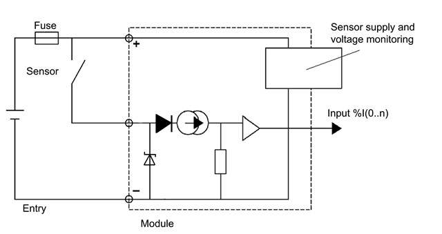

 рис.13. Принципова електрична схема контуру дискретного входу.

На рис.14 показаний приклад схеми підключення дискретного вхідного модулю, де видно клеми та відповідні їм канали. Схеми 10 та 11 дають повне представлення про роботу та підключення каналів модуля. З нього також видно що запобіжник ставиться для групи каналів а в документації зазначають його номінал.   

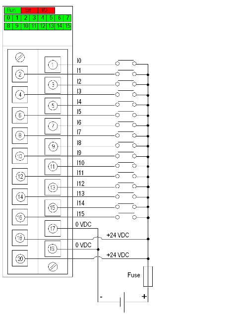

рис.14. Приклад схеми підключення до модуля.

### Приклад дискретних каналів VAC

На рис.15 зображено дискретний вхід типу напруги змінного струму. Сигнал з процесу подається через резистивно-ємнісний ланцюжок (RC), який обмежує струм і фільтрує високочастотні перешкоди. Далі сигнал потрапляє на захисний вузол, що складається з діода та стабілітрона. Цей вузол формує двонаправлене обмеження напруги: він пропускає корисну AC-синусоїду, але відсікає піки обох полярностей, які могли б пошкодити вхідну електроніку. Після обмеження сигнал надходить на оптрон, де перетворюється на безпечний логічний рівень, відокремлений від мережевої частини гальванічною розв’язкою. Оптрон передає інформацію формувачу сигналу, який визначає стан входу та передає його CPU. Така структура забезпечує стійку роботу входу при змінній напрузі та захист від мережевих імпульсів і перенапруг. Аналогічно попередній схемі ведеться контроль напруги живлення.

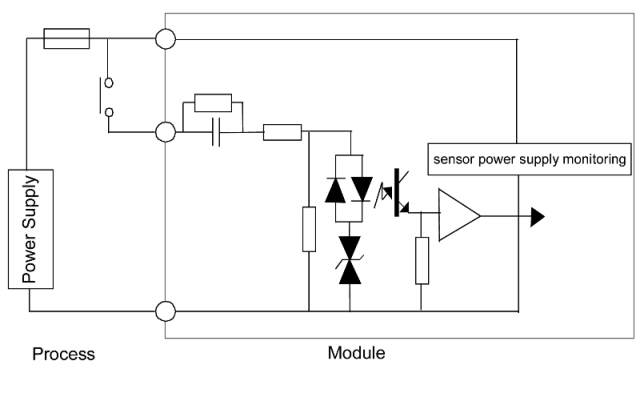

рис.15.

Така схема дає можливість підключати датчики як через джерела змінного струму (рис.16) так і постійного за полярності sink або source.  

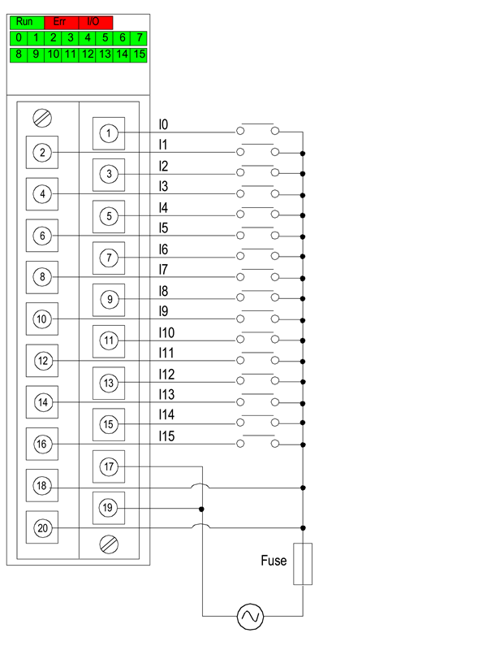

рис.16

### Приклад каналів NAMUR

На рис.17 зображено схему підключення до модуля з каналами типу NAMUR, а на рис.18 приклад підключення різного типу датчиків за схемою NAMUR до 0-го каналу.   

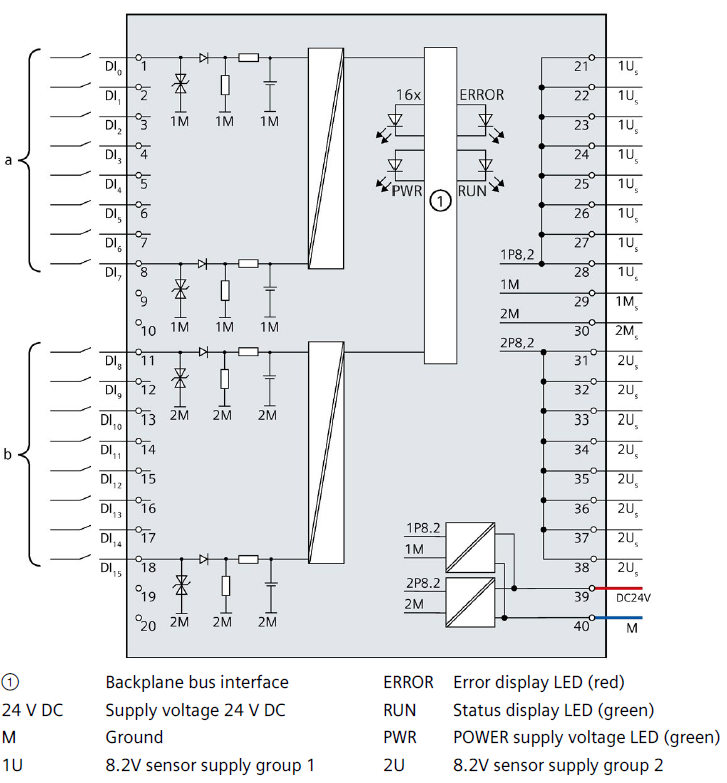

рис.17. Підключення до модуля з каналаит NAMUR

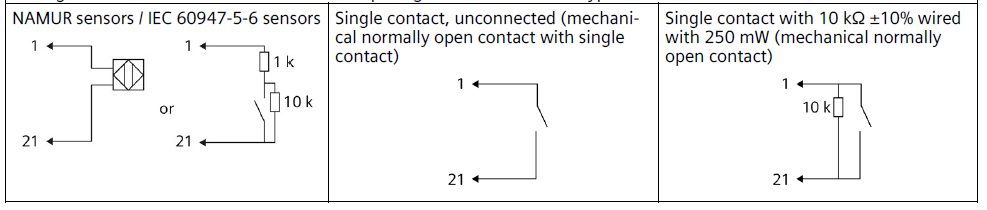

рис.18. Можливі варіанти підключення датчиків за схемою NAMUR 

## 7. Додаткове оброблення вхідних сигналів 

Стандартна функція дискретного входу - визначення стану за порогом спрацювання електричного сигналу. Однак в реальних схемах треба враховувати додаткові особливості реального світу що приводять до неправильної інтерпретації фізичного сигналу. Зупинимося на деяких найбільш вживаних кейсів 

### Хибне спрацювання 

Польові датчики або електричне коло можуть давати ефекти, які на рівні PLC проявляться як флуктуації, що приведуть до хибного спрацювання або навпаки не будуть виявлені в програмі PLC. Причинами можуть бути:  

- дрижання контактів кнопок, кінцевих вимикачів, поплавків, реле, що зумовлено механічними перемиканнями
- котушки, соленоїди, контактори, індуктивні навантаження кидають великі імпульси, які можуть навести напругу на проводці датчика і відповідно на дискретному вході 
- в перехідних режимах сам процес може видавати короткотривалі імпульси - наприклад зміна стану кінцевого вимикача заслінки  

Все це приводить до хибного спрацювання (ON) або відключення (OFF), або здебільше і одного і іншого. 

Для боротьби з цим ефектом використовують дискретні фільтри. Вони працюють за принципом затримки: якщо сигнал перемикається з одного стану в інший за менший ніж вказано у фільтрі проміжок часу, його не варто враховувати як істинний (рис.19). 

рис.19. Принцип роботи фільтра антидрижання

Функція фільтра може бути частиною апаратної обробки каналу і конфігуруватися відповідними засобами програмування PLC (приклад на рис.19). Такий фільтр має можливість робити фільтрацію з малими уставками і обробляється незалежно від логіки програми користувача.       

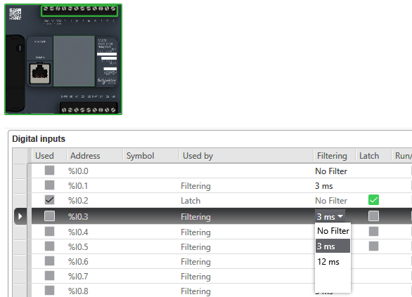

рис.19. Приклад конфігурації вхідних каналів: фільтри та канали з фіксацією.

Однак в деяких випадках фільтри повинні налаштовуватися і змінюватися під час експлуатації, що потребує зміни конфігурації PLC, що не завжди можливо і не зручно. Якщо час фільтрації досить великий (наприклад сотні мілісекунд або більше), фільтр можна реалізувати програмним шляхом, а його уставку вивести на людино-машинний інтерфейс. 

Для зменшення впливу завад можуть також використовуватися інтегрувальні фільтри. Встановлення значення фільтра дозволяє логічному контролеру ігнорувати деякі раптові зміни рівнів на вході, спричинені шумами. Наведена на рис.20 часова діаграма ілюструє дію інтегрувального фільтра для значення 4 мс.

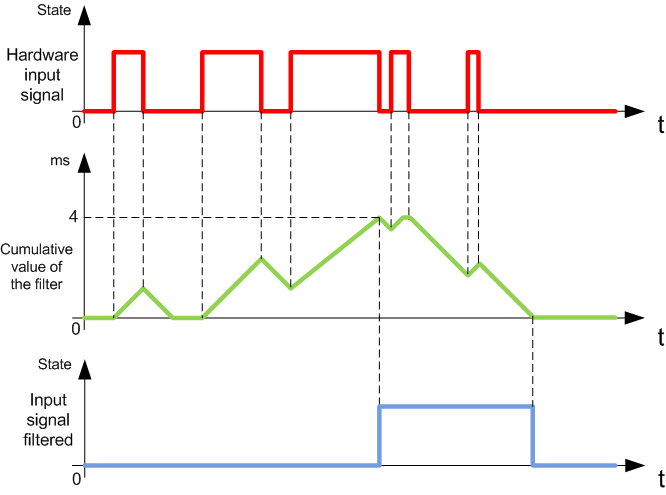

рис.20. Принцип роботи інтегрувального фільтра

### Відловлення коротких спрацювань 

У противагу дрижанню може знадобитися зворотна задача - відловлення короткого імпульсу. Справа в тому, що опитування входів ПЛК як правило відбувається на початку циклічної або періодичної задачі. І в періоди між цими опитуваннями сигнал може з'явитися і зникнути (рис.21). Якщо ці імпульси важливо виявити і обробити, деякі канали модуля можуть надавати функцію фіксації (latching). Приклад такого налаштування показано на рис.19.   

рис.21. Поява коротких імпульсів між сканами.

## 8. Проєктування системи дискретних входів

потребує пророблення

• як розрахувати навантаження на модуль
 • як групувати входи
 • як планувати живлення датчиків
 • коли ставити окремі стабілізатори
 • коли використовувати реле замість прямого підключення
 • коли потрібна гальванічна ізоляція
 • маркування клем та кабелів
 • вибір правильного перетину кабелю

## 9. Рекомендації щодо підключення

- про запобіжники і УЗІПи (якщо йдемо зовні шафи керування особливо важливо, з досвіду рівні завад бувають такі, що зрозуміти що на вході важко - тому застосовувати ще один рівень розв'язки (механічні, солідстейт реле з великим гістерезисом), 
- пам'ятати, що входи на ПЛК часто гальванічно не розв'язані один відносно одного. Якщо вже застосовані для розв'язки реле - тільки спеціальні герметичні брати механічні - був випадок, коли контакти так окислились, що вхід просто не спрацьовував. 
- 

## 10. Налагодження та діагностика

потребує пророблення

• як перевірити датчик мультиметром
 • як перевірити вхід PLC
 • як визначити, чи є вхід «плаваючим»
 • як перевірити індикатори модуля
 • як шукати обрив
 • як шукати коротке замикання
 • як тестувати логіку входів у Control Expert, TIA Portal або RSLogix

## 11. Типові помилки та як їх уникати

потребує пророблення

## Джерела

1. Programmable logic controllers / Frank D. Petruzella. — 4th ed.

2. https://www.ti.com/lit/ug/tiduel4/tiduel4.pdf

   

## Автори

Теоретичне заняття розробив [Олександр Пупена](https://github.com/pupenasan). 

Враховані коментарі та пропоизиції:

- Артур Коробов
- Олександр Кріль
- Владислав Коськовецький

## Feedback

Якщо Ви хочете залишити коментар у Вас є наступні варіанти:

- [Обговорення у WhatsApp](https://chat.whatsapp.com/BRbPAQrE1s7BwCLtNtMoqN)
- [Обговорення в Телеграм](https://t.me/+GA2smCKs5QU1MWMy)
- [Група у Фейсбуці](https://www.facebook.com/groups/asu.in.ua)

Про проект і можливість допомогти проекту написано [тут](https://asu-in-ua.github.io/atpv/)
