[<- До підрозділу](README.md)		[Коментувати](#feedback)

# Конфігурування локальної та розподіленої системи I/O M241 в Machine Expert 

**Тривалість**: 2 год 

**Мета:** Навчитися встановлювати та запускати EcoStruxure Machine Expert  та імітатор PLC.

## Лабораторна установка.

**Необхідне апаратне забезпечення.** Для проведення лабораторних робіт необхідно мати комп’ютер з наступною мінімальною апаратною конфігурацією:

- CPU Intel/AMD 2 ГГц / RAM 16 ГБ / Диск 20 ГБ (вільних)  

**Необхідне програмне забезпечення.** 

1. EcoStruxure Machine Expert 

**Загальна постановка задачі**. 

Цілі роботи: 

1) 

## Послідовність виконання роботи

- [ ] Ознайомтеся з теорією [Апаратне забезпечення контролерів Modicon M241](teorm241.md)

### 1. Конфігурування каналів локального вводу/виводу

У цьому пункті необхідно сконфігурувати локальні входи/виходи на самому блоці CPU. 

- [ ] Запустіть Machine Expert

- [ ] Створіть новий проєкт на основі `Default Project` з наступними налаштуваннями:
  - тип контролера `TM241CE24T/U` (за замовченням)
  - назва контролера `PLC1`
  - мова основної секції `SR_main ` - `ST`
  - назва проєкту `Labm241hard`

- [ ] У апаратній архітектурі (Devices Tree) відкрийте налаштування дискретних входів, виставте наступні налаштування (зверніть увагу що рядки добавляються або змінюється назва в залежності від значення в інших рядках):
  -  на одному із входів змініть значення фільтрації
  - на одному із входів відмовтеся від фільтрації
  - на одному із входів виберіть режим фіксації коротких імпульсів
  - на одному із входів виберіть режим запуску задачі по спадаючому фронту
  - на одному із входів виберіть режим запуску задачі по обом фронтам

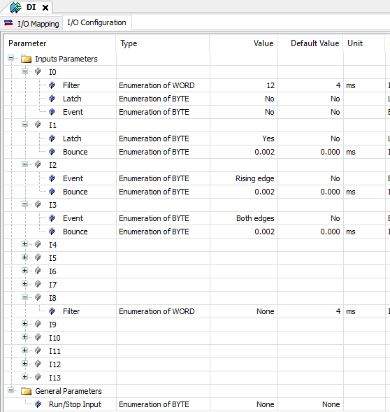

рис.1. Налаштування конфігурації входів

- [ ] Сконфігуруйте виходи так, щоб:
  - реактивація виходів після короткого замикання відбувалася вручну (з програми)
  - вихід Q5 спрацьовував при роботі PLC і відключався, коли він переходить в Стоп  
- [ ] У програмній конфігурації в GVL означте змінну `sw1`

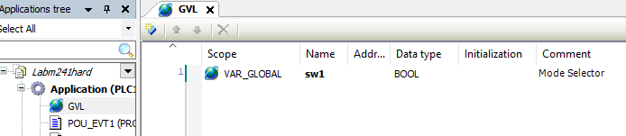

рис.2.

- [ ] Зробіть відображення змінних на входи, як показано на рис. 3

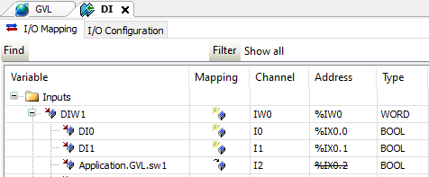

рис.3. 

Зверніть увагу, що можна залишати імена змінних що відповідають за I/O за замовченням, можна змінювати на глобальні, можна звертатися до них за адресою IEC типу `%IW` , можна прив'язкувати до GVL.  

- [ ] Створіть `POU_EVT1` та `POU_EVT2` типу POU з мовою `ST`
- [ ] Створіть задачі `EVT1` та `EVT2` типу `External` з різними пріоритетами. Кожна задача викликається входом з функцією `Event` . Прив'яжіть `POU_EVT1` та `POU_EVT2` відповідно до задач `EVT1` та `EVT2`. 

рис.4.

Зверніть увагу, що POU мають виконуватися тільки в контексті задач.  Задачі типу `External`  викликаються за подією на вказаному вході. Тому `POU_EVT1` наприклад буде оброблятися тільки при спрацюванню переднього фронту на каналі `I2`.

### 2. Робота з емулятором

- [ ] Переключіться в режим емуляції ПЛК
- [ ] Зробіть побудову (Build), виправте помилки, якщо такі мають місце
- [ ] З'єднайтеся з емулятором ПЛК і завантажте туди проєкт
- [ ] Запустіть проєкт на виконання
- [ ] Змініть значення перших трьох входів, подивіться на стан `DIW1`, поясніть чому він має таке значення 

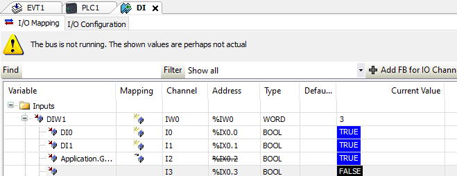

рис.5.

Змінювати значення вхідних змінних в емуляторів можна звичайним записом. Однак при зв'язку з реальним ПЛК треба користуватися форсуванням входів/виходів. 

- [ ] Відкрийте вікно Watch `View->Watch->Watch1`
- [ ] Добавте у вікно Watch змінні `%IW0`, `%IX0.0`, `%IX0.1` , `%IX0.1`
- [ ] Через контекстне меню зробіть відображення `%IW0` у вигляді `Binary`
- [ ] Подивіться на значення змінних, і зверніть увагу на  `%IX0.1`, чому воно має таке значення?

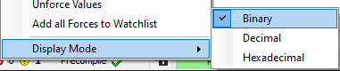

рис.6. 

- [ ] Відключіться від емулятора 

### 3. Конфігурування локального розширення вводу/виводу

У цьому пункті необхідно збільшити кількість каналів за рахунок опційних картриджів та модулів TM3.

- [ ] Використовуючи контекстне меню для `Cartridge` або через кнопку `+` викличте вікно добавлення опції

  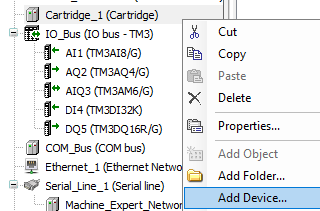

рис.7.

- [ ] Добавте картридж, що має 2 аналогових входи.

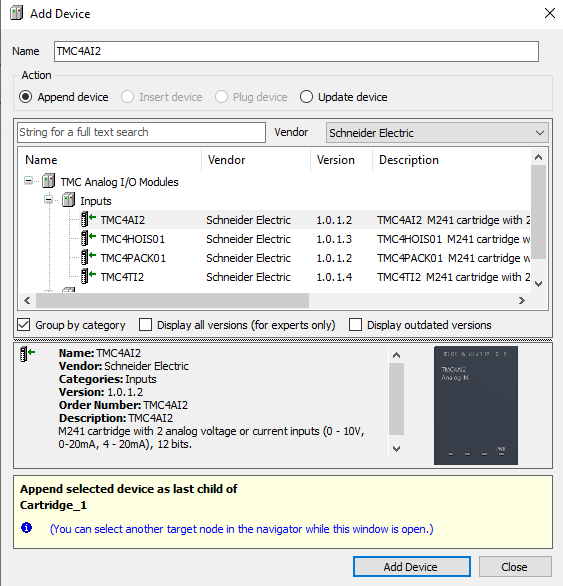

рис.8.

- [ ] Відкрийте налаштування картриджа, сконфігуруйте параметри обробки каналів

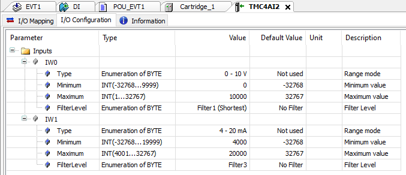

рис.9.

Для аналогових каналів задається діапазон сигналу для каналів, рівень фільтрації, та діапазон масштабування. Зверніть увагу, що тип змінної що відповідає за канал - INT, а значення масштабування за замовченням змінюється в залежності від вибраного типу аналогового входу. 

- [ ] Змініть налаштування I/O Mapping

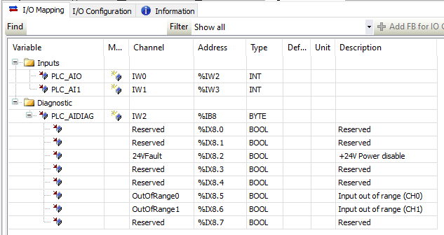

рис.10.

- [ ] Використовуючи контекстне меню для `IO_BUS` або через кнопку `+` викличте вікно добавлення модулів  

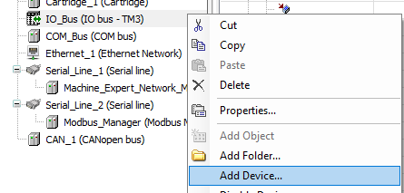

рис.11.

Зверніть увагу, що все що стсосується апаратної конфігурації добавляється як  `Device`, хоч не завжди це є дійсно пристрій. Так, наприклад при налаштуванні мереж, може добавлятися сервіс. Способів добавлення Device може бути кілька, тут розглядається тільки один із них. 

- [ ] Добавте модулі TM3:
  - Один аналоговий вхідний  
  - Один аналоговий вихідний
  - Один аналоговий змішаний
  - Один дискретний вхідний
  - Один дискретний вихідний

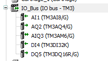

рис.12.

Крім `TM3` у переліку доступні модулі старого зразку - `TM2`, це зроблено для апаратної сумісності з старою платформою (Twido), при модернізації.  

- [ ] Змініть налаштування усіх аналогових вхідних та вихідних модулів на діапазони 0-10V або 4-20 mA
- [ ] Змініть налаштування дискретних виходів щоб вони були в режимі `Fallback Mode` 
- [ ] Зробіть побудову (Build), виправте помилки, якщо такі мають місце

### 4. Конфігурування віддаленого розширення вводу/виводу

M241 підтримує добавлення додаткових модулів через пару модулів `TM3XTRA1` та `TM3REC1`. Детальніше про це читайте в  [Апаратне забезпечення контролерів Modicon M241](teorm241.md)

- [ ] У `IO_BUS` вставте модуль для розширення локального блоку PLC `TM3XTRA1` з розділу  `TM3 Expert I/O Module`  

  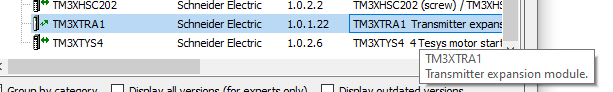

рис.13.

- [ ] Автоматично в межах даного модуля добавиться ще один. Перейменуйте обидва модулі, на зрозумілу для Вас назву, наприклад `TOREMOTE` і `IM`
- [ ] Добавте кілька модулів у віддалену частину, один з яких для температурних входів

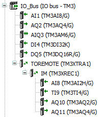

рис.14.

- [ ] Налаштуйте канали модулю температурних входів на роботу з датчиками типу PT100

Зверніть увагу, що масштабування для темепературних датчиків відбувається за іншим принципом.

- [ ] Зробіть побудову (Build), виправте помилки, якщо такі мають місце

### 5. Конфігурування розподіленого вводу/виводу на Modbus Serial

Комунікаційні порти M241 можуть працювати в різних режимах. Це задається відповідним сервісом, який добавляється як пристрій до комунікаційного порта. Доступність того чи іншого сервісу залежить не тільки від інтерфейсу, який реалізує порт, але і від номера порту. 

У цій лабораторній роботі для портів використовуються сервіси мендежерів, які забезпечують обмін з розподіленим вводом/виводом. Інші сервіси розглядаються у інших теоретичних та практичних заняттях. Враховуючи, що за замовченням для `Serial_Line_2` виставлений не той сервіс, який потрібно, його необхідно видалити, а потім добавити сервіс `Modbus IOScanner` .    

- [ ] Видаліть `Modbus_Manger` з `Serial_Line_2` 

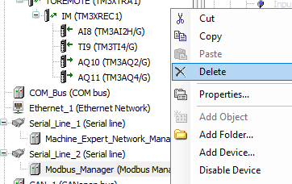

рис.15. 

- [ ] До  `Serial_Line_2` через Add Device добавте  `Modbus IOScanner` 

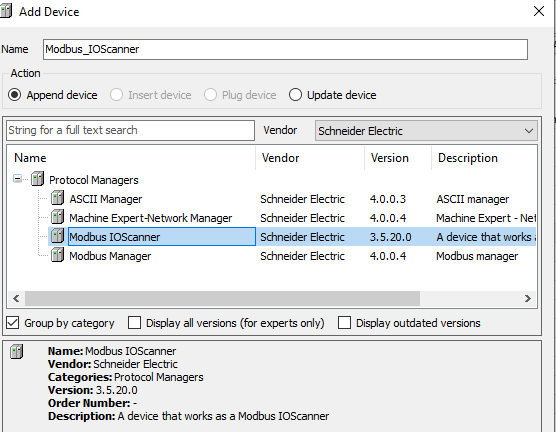

рис.16.

Сервіс `Modbus IOScanner` - це протокольний менеджер, який опитує пристрої по Modbus RTU без явного опитування з прикладної програми. Тобто він конфігурується, і працює під керівництвом операційної системи, а програма працює з отриманим і записуваними змінними Modbus Slave через відображення їх на змінні ПЛК. Для застосунку в ПЛК це просто змінні I/O. При конфігуруванні сервісу треба вказати загальні налаштування мережі, добавити потрібні пристрої як Modbus Slave і зконфігурувати їх для читання/запису.     

- [ ] Сконфігуруйте мережні параметри для   `Modbus IOScanner` 

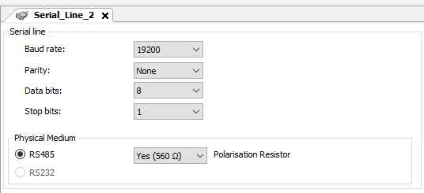

рис.17. 

- [ ] Добавте в межах  `Modbus IOScanner`  два Device типу `TM3BCSL`

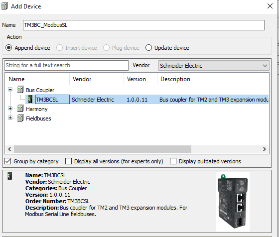

рис.18.

Серед доступних пристроїв вже "з коробки" доступний модуль сполучення шини (Bus Coupler) системи вводу/виводу TM3. Це значить, що їх конфігурування буде подібною до конфігурування локального розширення модулями TM3.    

- [ ] Для одного  `TM3BCSL` надайте адресу Slave рівною `1` а для іншого -  `2` 

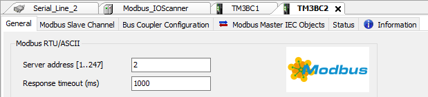

рис.19.

Модуль сполучення шини доступний для 3-х типів мереж (Modbus RTU, Ethernet і CanOpen), як про це описано в лекції  [Апаратне забезпечення контролерів Modicon M241](teorm241.md). Для кожного з типів він виступає як відповідний до протоколу пристрій. У Modbus RTU необхідно задати унікальну адресу Slave, та параметр таймаута для задання максимального часу очікування відповіді. 

- [ ] Додайте до островів модулі та змініть їх назву відповідно до вказаного в рис.20.  

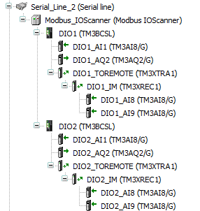

рис.20

- [ ] Зробіть побудову (Build), виправте помилки, якщо такі мають місце

### 6. Добавлення і налаштування комунікаційних модулів

Блок CPU M241 має багато вбудованих комунікаційних портів, які можуть використовуватися для різного призначення. Крім цього є можливість добавити ще комунікаційні модулі TM4. У цьому пункті необхідно зробити мінімальну конфігурацію для їх роботи. Окремо мережні можливості розглядаються в інших частинах посібника. 

- [ ] Для вбудованого Ethernet налаштуйте наступні параметри

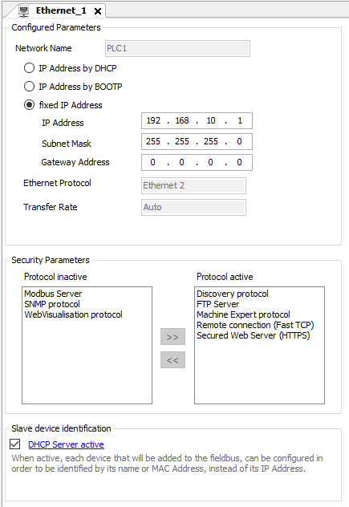

рис.21.

Зверніть увагу, що з точки зору безпеки, розробник може активувати або деактивувати певні протоколи, доступні на даному комунікаційному каналі. 

- [ ] Добавте розділ  `COM_Bus` один комунікаційний модуль Ethernet (`TM4ES4`) і один Profibus Slave (`TM4PDPS1`) 

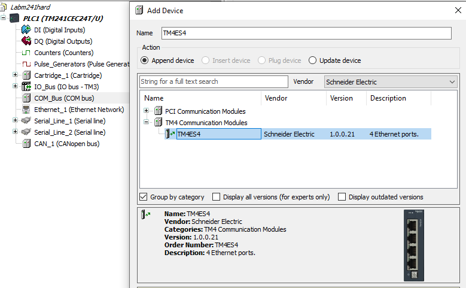

рис.22.

- [ ] Для Ethernet на базі `TM4ES4` налаштуйте наступні параметри 

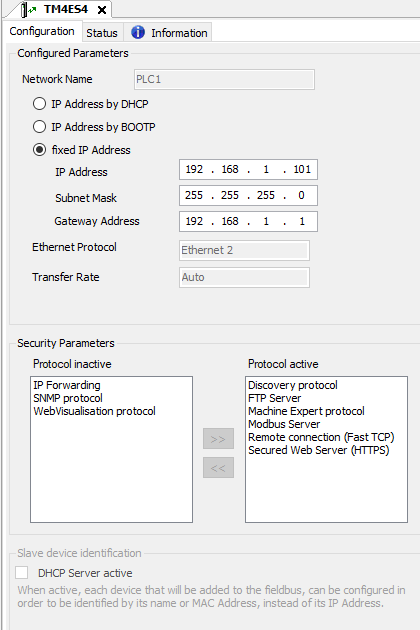

рис.23.

- [ ] Налаштуйте Profibus DP як показано на рис.24. 

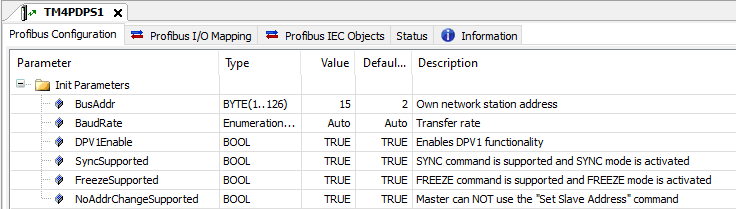

рис.24.

- [ ] Зробіть побудову (Build), виправте помилки, якщо такі мають місце

### 7. Конфігурування розподіленого вводу/виводу на Ethernet

У пункті 5 створювалася конфігурація розподіленого вводу/виводу на базі Modbus RTU. Аналогічним чином можна добавити острови TM3 через мережу Ethernet Modbus/TCP або  EtherNetIP а також CanOpen. 

- [ ] Добавте до вбудованого  (`Ethernet_1`) сервіс `Industrial Ethernet Manager`

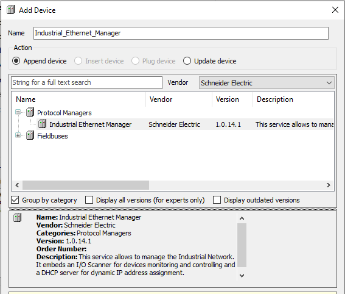

рис.25.

- [ ] Добавте до `Industrial Ethernet Manager` Bus Coupler `TM3BCEIP` з розділу `EtherNetIP` і перейменуйте його на `DIO3`

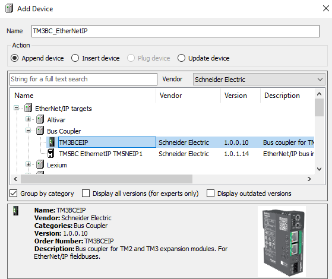

рис.26.

Зверніть увагу що кількість доступних для добавлення пристроїв значно збільшилася. У цей список можна добавляти пристрої інших виробників через технологію FDT/DTM.  

- [ ] Змініть налаштування `DIO3`

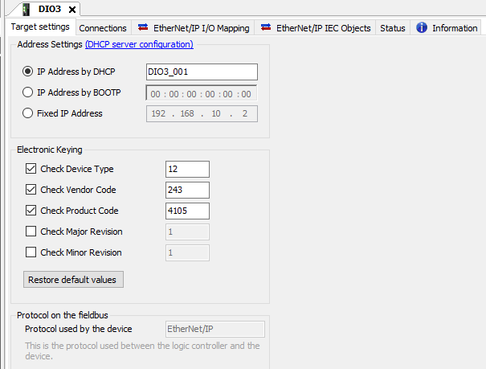

рис.27.

- [ ] Зробіть конфігурацію острова аналогічну як `DIO2`
- [ ] Зробіть побудову (Build), виправте помилки, якщо такі мають місце
- [ ] Збережіть проєкт.

## Автори

Практичне заняття розробив  [Олександр Пупена](https://github.com/pupenasan). 

## Feedback

Якщо Ви хочете залишити коментар у Вас є наступні варіанти:

- [Обговорення у WhatsApp](https://chat.whatsapp.com/BRbPAQrE1s7BwCLtNtMoqN)
- [Обговорення в Телеграм](https://t.me/+GA2smCKs5QU1MWMy)
- [Група у Фейсбуці](https://www.facebook.com/groups/asu.in.ua)

Про проект і можливість допомогти проекту написано [тут](https://asu-in-ua.github.io/atpv/) 