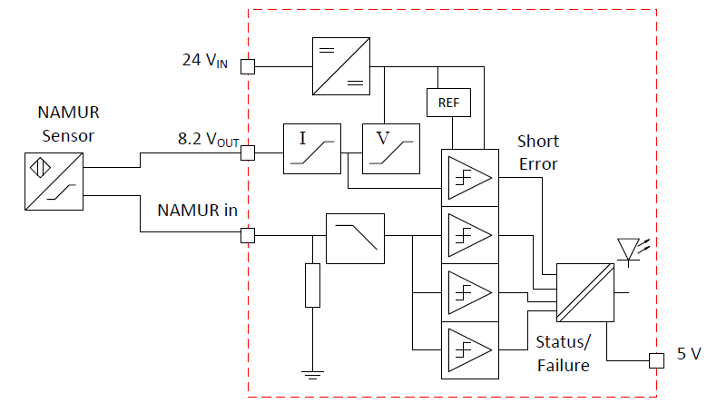
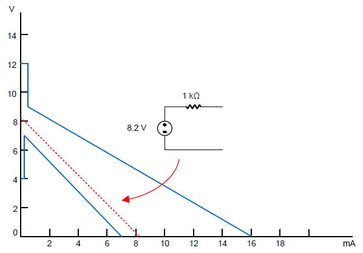

[<- До підрозділу](README.md)

# Цифровий вхід PLC NAMUR із захистом від несправностей та діагностикою: еталонний проєкт

Частковий переклад https://www.ti.com/lit/ug/tiduel4/tiduel4.pdf

## Опис

Датчик наближення NAMUR широко використовується в промисловому керуванні, коли датчик має виконувати спеціальну вимогу щодо максимальної енергії. Це, у свою чергу, визначає спеціальні вимоги до цифрового входу PLC, який призначений для з’єднання з таким датчиком, з погляду точності та надійності. Цей еталонний проєкт є повноцінним фронт-ендом цифрового входу, сумісним із датчиками NAMUR. У проєкті продемонстровано досягнення надійності через надлишковість, захист від несправностей та розширені діагностичні можливості у компактній апаратній реалізації.

Характеристики
 • Поріг 1.6 мА, гістерезис 0.4 мА
 • 0.2 мА при обриві кола, поріг короткого замикання 6 мА
 • 8.2 В напруга холостого ходу, 8.2 мА струм короткого замикання
 • Розширена діагностика
 • Захист від несправностей
 • Ізоляція живлення та даних
 • Надлишкові компоненти для підвищеної надійності

## 1 Опис системи

Датчик наближення NAMUR широко використовується в промисловому керуванні, коли датчик має виконувати спеціальну вимогу щодо максимальної енергії. Це, у свою чергу, визначає спеціальні вимоги до дискретного входу PLC, який призначений для з’єднання з таким датчиком, з погляду точності та надійності.

Датчики NAMUR та їхні інтерфейси (дискретний вхід або підсилювачі) повинні відповідати стандарту NAMUR (EN 60947-5-6:2000 або IEC 60947-5-6).

Скорочення NAMUR походить від німецького терміна "Normenarbeitsgemeinschaft für Meß- und Regelungstechnik in der Chemischen Industrie", що означає "Асоціація зі стандартизації вимірювальної та керувальної техніки в хімічній промисловості".

TIDA-010044 є еталонним проєктом модуля дискретного входу PLC NAMUR, який демонструє типові вимоги до характеристик і показує, як підвищити надійність модуля шляхом додавання діагностики та засобів захисту.

### 1.1 Основні технічні характеристики системи

Технічні характеристики системи TIDA-010044 у таблиці 1 представляють типовий набір параметрів, необхідних для модуля дискретного входу PLC NAMUR. Поверх цього додаються розширені діагностичні можливості, потрібні для забезпечення високої надійності модуля.

Таблиця 1. Основні технічні характеристики

| ПАРАМЕТР                                     | ХАРАКТЕРИСТИКА                                               |
| -------------------------------------------- | ------------------------------------------------------------ |
| Кількість входів                             | 1                                                            |
| Тип входу                                    | Сумісний із NAMUR                                            |
| Струм у стані ON                             | 2.1 мА                                                       |
| Струм у стані OFF                            | 1.2 мА                                                       |
| Гістерезис                                   | 0.4 мА                                                       |
| Вихідний опір                                | 1 кΩ                                                         |
| Максимальна вхідна напруга                   | 24 В, –24 В                                                  |
| Струм короткого замикання                    | 8.2 мА                                                       |
| Поріг короткого замикання                    | 6 мА                                                         |
| Поріг обриву проводу                         | 0.4 мА                                                       |
| Поріг короткого замикання на живлення+       | 8.5 В                                                        |
| Поріг короткого замикання на живлення–       | –6 В                                                         |
| Поріг несправності ізольованого джерела 12 В | 7 В                                                          |
| Діапазон живлення 24 В                       | 18 В до 36 В                                                 |
| Робочий температурний діапазон               | –40 °C до 80 °C                                              |
| Діагностичні функції                         | Несправність датчика: обрив проводу та коротке замикання. Коротке замикання на живлення: пряме або зворотне коротке замикання на джерело живлення. Несправність ізольованого джерела живлення. |

## 2 Огляд системи

Стандарт NAMUR (EN 60947-5-6:2000) визначає характеристики датчиків наближення та їхніх інтерфейсів і дискретних входів. Ці датчики працюють як дуже малострумовий перемикач, що представляє двійкові стани ON і OFF. TIDA-010044 є еталонним проєктом модуля дискретного входу PLC NAMUR, який демонструє одну просту реалізацію такого модуля. На рисунку 1 показано блок-схему цього еталонного проєкту.

### 2.1 Блок-схема

Зверніться до розділу 2.4.3 для детального пояснення різних частин блок-схеми.

### 2.2 Конструктивні міркування

Модулі дискретних входів NAMUR по суті є модулями дискретних входів PLC, які вимірюють малорівневий вхідний струм і відповідають стандарту NAMUR, як описано в розділі 2.4.2. На додаток до виконання струм-напругових характеристик стандарту, діагностичні функції є необхідними для сучасних вхідних модулів. Несправності датчика, включаючи обрив та коротке замикання, виявляються шляхом контролю струму датчика, що перевищує визначені межі.

Помилки короткого замикання на лінію живлення виявляються, щоб запобігти пошкодженню модуля через неправильне підключення. Також контролюється ізольоване джерело живлення, щоб запобігти неправильним показам у разі його відмови.

Важливо мати високонадійний модуль, який виконує стандарт NAMUR навіть у разі відмови одного компонента. Це може вимагати вибору компонентів, що виходять з ладу певним чином — у коротке чи в обрив — або додавання надлишкових пристроїв. Промисловий температурний діапазон є обов’язковим для всіх компонентів, щоб забезпечити визначений робочий температурний діапазон.

### 2.3 Вибрані компоненти

#### 2.3.1 TVS3301

Пристрій TVS3301 відводить до 27 А імпульсного струму IEC 61000-4-5 для захисту систем від високопотужних імпульсних впливів або розрядів блискавки. Пристрій витримує типову промислову вимогу до ліній сигналів щодо ЕМС — 1-кВ напругу холостого ходу IEC 61000-4-5, з’єднану через опір 42 Ом.

TVS3301 використовує механізм зворотного зв’язку для забезпечення точного, плаского обмеження під час аварійного стану, утримуючи напругу в системі нижче, ніж у випадку традиційних діодів TVS. Точне регулювання напруги дозволяє конструкторам упевнено обирати компоненти з нижчим допустимим рівнем напруги, знижуючи вартість і складність системи без втрати надійності.

TVS3301 має робочий діапазон ±33 В, що дозволяє використовувати його в системах, які потребують захисту від переполюсування.
 Крім того, TVS3301 доступний у компактному корпусі SON, розробленому для застосувань з обмеженим простором, що забезпечує значне зменшення розміру в порівнянні зі стандартними корпусами SMA та SMB. Низький струм витоку й низька ємність пристрою забезпечують мінімальний вплив на захищувану лінію.

Для гарантування надійного захисту протягом усього терміну служби виробу TI тестує TVS3301 на 5000 повторних імпульсів при 125°C без зміни характеристик.

TVS3301 є частиною сімейства Flat-Clamp пристроїв захисту від імпульсних перенапруг. Для докладнішої інформації зверніться до white paper “Flat-Clamp Surge Protection Technology for Efficient System Protection”.

#### 2.3.2 LM2901AV

Пристрої серії LM2901xx містять чотири незалежні компаратори напруги, розроблені для роботи від одного джерела живлення в широкому діапазоні напруг. Робота від двох джерел живлення також можлива, якщо різниця між ними становить від 2 В до 36 В, а VCC при цьому щонайменше на 1.5 В більше за вхідну напругу загального режиму.
 Споживання струму не залежить від напруги живлення. Виходи можуть з’єднуватися з іншими виходами відкритого колектора для реалізації логічної функції AND через дротове об'єднання.
 Пристрій LM2901AV характеризований для роботи в діапазоні температур від –40°C до 125°C.

##### 2.3.3 TL431LI

Пристрій TL431LI є трививідним регульованим шунтовим стабілізатором із заданою термостабільністю в автомобільному, комерційному та військовому температурних діапазонах. Вихідна напруга може бути встановлена на будь-яке значення від Vref (приблизно 2.495 В) до 36 В за допомогою двох зовнішніх резисторів.

Ці пристрої мають типову вихідну імпеданс 0.3 Ом. Активна вихідна схема забезпечує дуже різку характеристику включення, що робить їх чудовою заміною для стабілітронів у багатьох застосуваннях, таких як локальне стабілізування, регульовані блоки живлення та імпульсні джерела живлення.
 Цей пристрій є повністю сумісним аналогом промислового стандарту TL431, але має оптимізовані параметри Iref та IIdev. Менші значення Iref і IIdev дозволяють конструкторам досягти більшої точності системи й зменшити струм витоку.

Пристрій TL431LI пропонується у двох класах, з початковими допусками (при 25°C) 0.5% і 1% для класів B і A відповідно. Низький температурний дрейф вихідної напруги забезпечує хорошу стабільність у всьому діапазоні температур.
 Пристрій TL431LIAQ характеризований для роботи від –40°C до 125°C.

#### 2.3.4 LM25019

LM25019 — це 48-вольтовий, 100-мА синхронний понижувальний регулятор із інтегрованими MOSFETами верхнього та нижнього плеча. Схема керування з постійним часом увімкнення (COT), застосована в LM25019, не потребує компенсації петлі, забезпечує відмінну реакцію на перехідні процеси та дозволяє реалізувати дуже великі коефіцієнти пониження напруги.

Час увімкнення змінюється обернено пропорційно до вхідної напруги, забезпечуючи майже сталу частоту в роботі по всьому діапазону вхідних напруг.
 Високовольтний пусковий стабілізатор забезпечує живлення для внутрішньої роботи мікросхеми та інтегрованих драйверів затворів.

Схема обмеження пікового струму захищає від перевантажень. Схема блокування при зниженні напруги (UVLO) дозволяє незалежно налаштовувати поріг і гістерезис заниженої напруги. Інші функції захисту включають теплове вимкнення та блокування через недостатню напругу живлення.

#### 2.3.5 TLV76050

 TLV760 — це інтегрований лінійний стабілізатор напруги, що забезпечує роботу від джерела з напругою до 30 В.
 TLV760 має максимальну напругу насичення 1.2 В при повному навантаженні 100 мА по всьому робочому температурному діапазону. Стандартний корпус для TLV760 — це 3-вивідний SOT-23.
 TLV760 доступний у варіантах 3.3 В, 5 В, 12 В і 15 В. Корпус SOT-23 у серії TLV760 дозволяє використовувати пристрій у застосуваннях з обмеженим простором.
 TLV760 призначений для живлення дискретних і аналогових схем у застосуваннях, які піддаються впливу імпульсних перенапруг і стрибків до 30 В — наприклад, побутових приладів та систем автоматизації. Пристрій має надійний внутрішній тепловий захист, який оберігає його від потенційних пошкоджень у випадках короткого замикання на землю, підвищення температури довкілля, великого навантаження або подій із високою напругою насичення.

#### 2.3.6 ISO7340

 Пристрої родини ISO734x забезпечують гальванічну ізоляцію до 3000 VRMS протягом 1 хвилини згідно з UL 1577 та 4242 VPK згідно з VDE V 0884-10. Ці пристрої мають чотири ізольовані канали, що складаються з буферів логічного входу та виходу, розділених ізоляційним бар’єром із діоксиду кремнію (SiO2). Пристрій ISO7340x має чотири канали у прямому напрямку. У разі втрати живлення або сигналу на вході вихід за замовчуванням дорівнює 0.
 У поєднанні з ізольованими джерелами живлення ці пристрої запобігають проникненню шумових струмів у шину даних або інші кола, що може потрапити на локальну землю та порушити або пошкодити чутливі схеми.
 Пристрій ISO734x має інтегрований фільтр шуму для роботи в суворому промисловому середовищі, де на виводах пристрою можуть з’являтися короткі імпульси шуму. ISO734x має пороги входу TTL та працює від джерела живлення 3 В до 5.5 В.
 Завдяки інноваційній схемотехніці та методам компонування електромагнітна сумісність пристроїв сімейства ISO734x значно покращена, що забезпечує відповідність вимогам ESD, EFT, імпульсних перенапруг і нормам щодо випромінювання на рівні системи.

### 2.4 Теоретичні основи проєктування системи

У наступних розділах пояснюється послідовність розробки еталонного проєкту дискретного входу NAMUR. Починаючи з датчика NAMUR і стандарту, визначаються необхідні функції дискретного входу.

#### 2.4.1 Датчик NAMUR

Польове джерело живлення зазвичай живить дискретні перемикачі та датчики наближення для промислових систем керування. Ймовірність виникнення електричних дуг на контактах перемикача або можливість накопичення ємнісної енергії в датчиках робить такі типи перемикачів непридатними для вибухонебезпечних зон із горючими середовищами.

Датчик із виходом NAMUR — це тип датчика, який намагається обійти цю проблему, представляючи стани перемикача (ON і OFF) двома рівнями опору. Датчик працює при номінальній робочій напрузі 8.2 В.

На рисунку 2 наведено просту модель датчика NAMUR.

Рисунок 2. Модель датчика NAMUR

Ця зміна опору приводить до зміни малорівневого струму (кілька мА), яку модуль входу NAMUR має виявити. Типові значення порогових струмів становлять менше 1.2 мА для стану OFF і більше 2.1 мА для стану ON.

#### 2.4.2 Стандарт NAMUR

Стандарт NAMUR (EN 60947-5-6:2000) визначає характеристики датчиків наближення та їхніх інтерфейсів і дискретних входів. Ці датчики працюють як дуже малострумові перемикачі, як описано в попередньому розділі. Стандарт NAMUR (EN 60947-5-6:2000) визначає допустимі робочі області датчика NAMUR, як показано на рисунку 3. Поверх I-V характеристики накладені різні рівні імпедансу датчика. Допустима робоча область стану ON простягається до навантажувальної лінії, що відповідає опору в стані ON (наприклад, до 1 кΩ у типовому випадку).

Рисунок 3. Допустимі робочі області датчика NAMUR

Рисунок 4 показує маску допустимої робочої області для інтерфейсу датчика NAMUR (підсилювача сигналу або дискретного входу). Будь-яка робоча характеристика, що повністю знаходиться всередині цієї маски, повинна відповідати стандарту NAMUR.

Однією з коректних моделей дискретного входу на діаграмі є еквівалент Теєвеніна — джерело 8.2 В послідовно з опором 1 кΩ. Ця модель має пунктирну навантажувальну лінію, що простягається від 8.2 В на вертикальній осі до 8.2 мА на горизонтальній осі.

TIDA-010044 розроблена так, щоб бути еквівалентною цій моделі.

Рисунок 4. Допустима робоча область дискретного входу NAMUR

#### 2.4.3 Дискретний вхід NAMUR

Модуль входу NAMUR є спеціальним модулем дискретного входу PLC, який виконує роль бар’єра та підсилювача для датчика NAMUR. Він подає на датчик обмежену потужність (обмежену напругу та обмежений струм) і здатний інтерпретувати малорівневий вихідний сигнал датчика для визначення його стану.

На рисунку 1 наведена спрощена блок-схема дискретного входу NAMUR. Стабільні 8.2 В формуються з польового живлення 24 В, при цьому у разі короткого замикання на живлення струм обмежується. Аналогові компаратори, що живляться від 24 В, перетворюють зворотний струм у напругу та фільтрують його для виявлення стану. Ізоляція виходів масиву компараторів від бекплейна захищає вихідні лінії у разі імпульсних перенапруг чи інших шкідливих впливів.

Модуль входу NAMUR має реалізовувати такі функції:

-  Забезпечувати регульовану вихідну напругу 8.2 В без навантаження з вихідним опором 1 кΩ.
-  Обмежувати струм у разі короткого замикання навантаження до значення нижче 10 мА.
-  Виявляти стан OFF (нижче 1.2 мА вхідного струму) та ON (понад 2.1 мА).
-  Виявляти несправність датчика: стан короткого замикання (поблизу струмового обмеження) та обриву (поблизу нульового струму).
-  Виявляти помилку короткого замикання на лінію живлення (пряму та зворотну).
-  Захищати від неправильного підключення (коротке замикання на польове живлення, пряму та зворотну полярність).
-  Захищати від імпульсних перенапруг.

 Багато цих функцій (виявлення та захист) пов’язані з надійністю. У розділі 2.4.4 детально пояснюється, як саме ці функції реалізовано.

