[<- До підрозділу](README.md)		[Коментувати](#feedback)

# Апаратне забезпечення контролерів Modicon M241

## 1. Загальний огляд архітектури M241

### Призначення та типові застосування Modicon M241

Modicon M241 призначений для керування машинами та автономними машинними вузлами, де домінує дискретна логіка, керування рухом і жорсткі часові вимоги. Це PLC машинного класу, орієнтований не на процесну автоматизацію, а на безпосередню інтеграцію з механікою. Основне призначення M241:

- керування послідовностями роботи механізмів;
- обробка сигналів датчиків і формування керуючих команд для виконавчих пристроїв;
- генерація імпульсів, PWM і керування швидкісними подіями без окремих motion-контролерів;
- інтеграція приводів, HMI та периферії через промислові інтерфейси.

Типові області застосування:

- пакувальні машини та лінії;
- транспортери, сортувальні та подаючі механізми;
- дозуючі та фасувальні установки;
- машини з кроковими або сервоприводами початкового та середнього рівня;
- автономні машинні модулі у складі більших систем.

На рис.1 показана схема рішення Machine Automation від Schneider Electric, на якому показано вертикальну та горизонтальну сегментацію платформи — від програмного забезпечення до контролерів, I/O та safety.

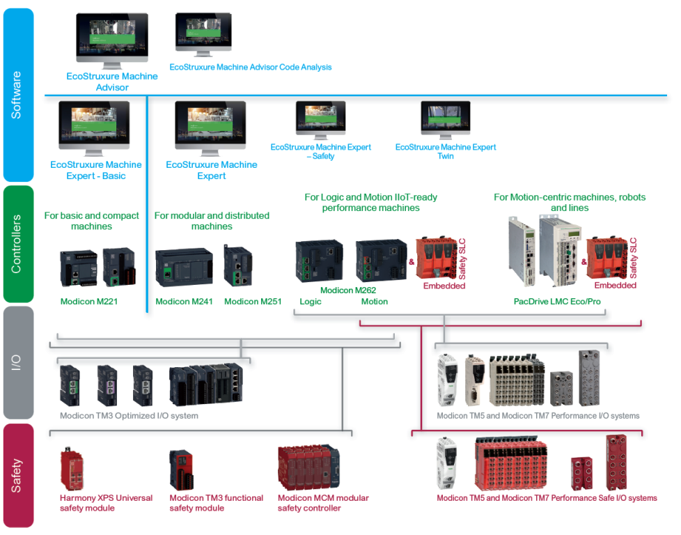

рис.1.

Платформа EcoStruxure Machine підтримує побудову машин різного класу складності — від компактних автономних рішень до високопродуктивних машин і ліній на базі PacDrive. При цьому зберігається єдина інженерна логіка та послідовність апаратних і програмних підходів. У цьому контексті Modicon M241 належить до класу логічних контролерів для модульних і розподілених машин, займаючи проміжне положення між компактними PLC та продуктивними motion-платформами.

Modicon M241 підтримує локальні модулі розширення серії TM3. Системи TM5 і TM7 не підтримуються цим контролером і застосовуються з продуктивнішими платформами Machine Automation.

### Апаратна структура контролера

#### Блок CPU

Modicon M241 має компактний форм-фактор, у якому в одному корпусі об’єднані центральний процесор, джерело живлення, вбудовані входи та виходи, а також базові комунікаційні інтерфейси. Така побудова орієнтована на машинну автоматику і дозволяє безпосередньо інтегрувати контролер у шафу керування або безпосередньо в машину без додаткових базових модулів.

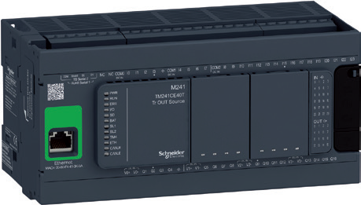

рис.2. Контролер M241 без розширень

#### Розширення

Розширення функціональності здійснюється модульно. Для локального розширення (Local IO) використовуються модулі системи TM3, які підключаються безпосередньо до контролера по внутрішній шині праворуч. Такий підхід дозволяє нарощувати кількість входів і виходів, додавати спеціалізовані функції або реалізовувати окремі safety-рішення без зміни базової архітектури контролера (рис.3). Окрім модулів серії TM3, підтримуються старі модулі TM2. Комунікаційні модулі TM4 підключаються ліворуч від блока контролера. Максимальна конфігурація локальних I/O: 7 модулів розширення Modicon TM3, підключених до блока контролера Modicon M241.

Система розширення Modicon TM3 є спільною для лінійок логічних контролерів Modicon M221, M241 і M251, а також для контролера Modicon M262 Logic/Motion. Це означає, що модель контролера може бути замінена на старшу без необхідності зміни модулів розширення.

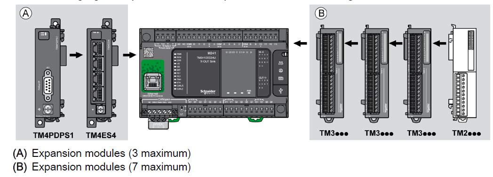

рис.3. Підключення модулів розширення

Можливості логічних контролерів M241 можуть бути розширені за допомогою модулів розширення Modicon TM3 (рис.3):

- модулі дискретних входів і виходів, які дозволяють створювати конфігурації з кількістю до 488 дискретних входів і виходів. Ці модулі мають ті самі типи підключень, що й самі контролери;
- модулі аналогових входів і виходів, які дозволяють створювати конфігурації з кількістю до 112 аналогових входів і виходів (додатково ще 4 аналогові канали можуть бути додані за допомогою картриджів). Вони призначені, зокрема, для приймання сигналів датчиків положення, температури та швидкості, а також можуть використовуватися для керування перетворювачами частоти або будь-якими іншими пристроями з струмовим чи напруговим входом;
- експертні модулі для керування пускачами двигунів TeSys, які спрощують монтаж кола керування завдяки використанню з’єднань на базі кабелів RJ45;
- модулі функціональної безпеки, які спрощують підключення та можуть конфігуруватися в середовищі EcoStruxure Machine Expert.

Крім локального розширення, доступні два варіанти розширення:

- віддаленими I/O (Remote IO), підключення до основного блока через модулі розширення передавача та приймача, з'єднаних кабелем    
- розподіленими I/O (Distributed I/O), підключення через модуль сполучення шини по мережі Ethernet або послідовної шини 

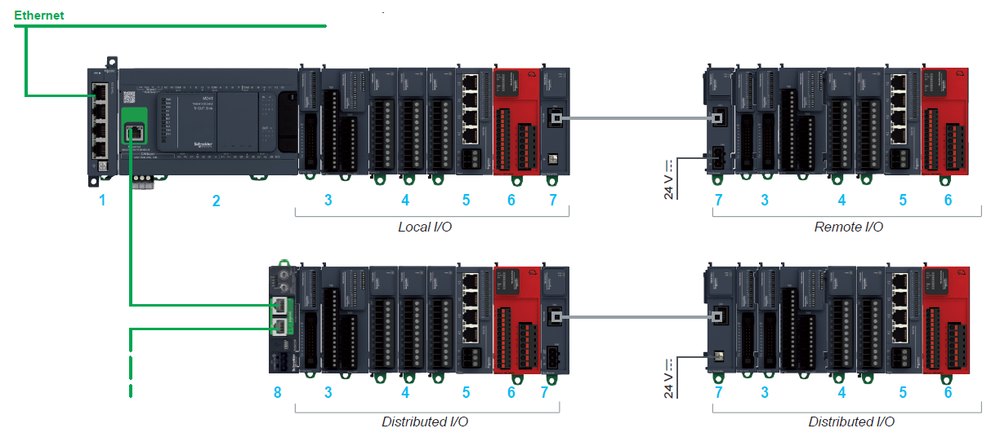

рис.4. Загальна архітектура M241: 1 - Модуль Ethernet-комутатора TM4ES4; 2 - Логічний контролер Modicon TM241CE; 3 - Модулі дисркетних входів і виходів; 4 - Модулі аналогових входів і виходів; 5 - Експертний модуль для керування пускачами двигунів TeSys; 6 - Модулі функціональної безпеки; 7 - Модулі розширення шини (передавач і приймач) та кабель розширення шини; 8 - Модуль сполучення шини TM3BC; 

#### Віддалені I/O

Розширення віддаленими I/O забезпечується за допомогою пари спеціальних модулів, які з'єднуються між собою спеціальним кабелем Cat 5E типу F/UT довжиною до 5 м (рис.5):

- модуля розширення передавача даних TM3XTRA1 - для підключення до крайнього правого модуля TM3 блоку контролера 
- модуля розширення приймача даних TM3XREC1 - як першого модуля в блоці розширення модулів  

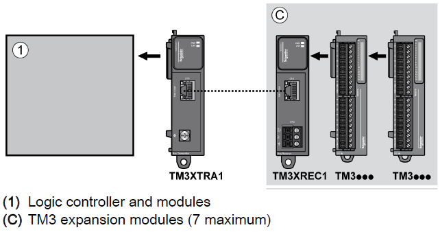

рис.5. Спосіб підключення модулів TM3

Максимальна конфігурація з використанням віддалених I/O: 14 модулів розширення Modicon TM3 (7 локальних модулів + 7 віддалених модулів). Таким чином модулі розширення шини можуть використовуватися для збільшення кількості модулів розширення з 7 до 14 або віддаленого розміщення модулів розширення Modicon TM3 на відстані до 5 м.

#### Розподілені I/O

За допомогою вбудованих в M241 мереж система передбачає можливість використання розподілених I/O. На рис.4 показаний принцип побудови системи розподілених I/O на базі Ethernet. До мережі вбудованого комунікаційного порта M241 підключаються модулі сполучення шини (Bus coupler) системи модулів розширення TM3. Ці модулі по суті є інтерфейсними модулями для підключення модулів розширення I/O, які підключаються аналогічно як блока CPU (праворуч). Крім локальних модулів розширення модулі сполучення шини підтримують підключення віддалених модулів, організовуючи таким чином острів з модулів в кількості до 16.  

Для створення розподілених I/O-островів у мережі Ethernet використовуються модулі сполучення шини Modicon TM3BC: на Ethernet, Modbus over Serial Line або CanOpen.

Таблиця 1. Модулі сполучення шини TM3 (Bus Couplers) 

| Позначення | Порти                                             | Тип обміну               | Тип роз’єму |
| ---------- | ------------------------------------------------- | ------------------------ | ----------- |
| TM3BCEIP   | 2 ізольовані комутовані Ethernet-порти            | EtherNet/IP, Modbus TCP  | RJ45        |
| TM3BCSL    | 2 ізольовані порти RS-485 (послідовне з’єднання)  | Послідовна лінія, Modbus | RJ45        |
| TM3BCCO    | 2 ізольовані порти CANopen (послідовне з’єднання) | CANopen                  | RJ45        |

Модулі сполучення шини виконані таким чином, щоб максимально швидко вводити в дію та замінювати при несправності. Приклад конфігурації показаний на рис.6. У мережі Ethernet один контролер Modicon M241 може обслуговувати до 16 розподілених I/O-островів на базі TM3BC, кожен з яких підтримує до 14 модулів TM3.

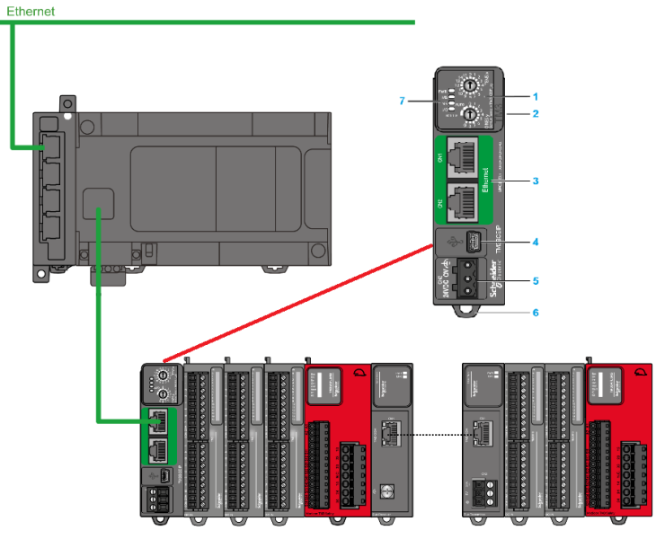

рис.6. Розподілені I/O на базі Ethernet: 1- Поворотні перемикачі для вказівки адреси, 2 - Роз’єм розширення для модулів TM2/TM3, 3 - Два ізольовані комутовані Ethernet-порти, 4 - Порт конфігурації USB mini-B, 5 - Живлення 24 В постійного струму, 6 - Фіксатор для кріплення на 35-мм DIN-рейку (top hat section rail), 7 - Світлодіодні індикатори стану

#### Опції розширення

Modicon M241 підтримує низку опцій, які дозволяють адаптувати контролер до вимог конкретної машини без зміни базової апаратної архітектури (рис.5). Однією з таких опцій є промислова карта пам’яті SD TMASD1 ємністю 256 МБ. Вона використовується для резервного копіювання та перенесення прикладних програм, реєстрації технологічних даних, а також для оновлення вбудованого програмного забезпечення. Наявність карти пам’яті не є обов’язковою для роботи контролера, але суттєво спрощує сервісне обслуговування і підтримку машин.

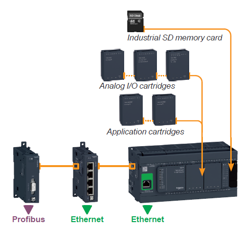

рис.7. Опції та підключення комунікаційних модулів

Додаткове розширення можливостей M241 реалізується за допомогою картриджів, які встановлюються безпосередньо на передню панель контролера без збільшення його габаритів. Залежно від моделі контролера може бути встановлено до двох картриджів. Картриджі введення і виведення дозволяють додати 2 аналогові входи (TMC4AI2), 2 аналогові виходи (TMC4AQ2) або 2 температурні канали (TMC4TI2) без використання зовнішніх модулів розширення. 

Окрему групу становлять прикладні картриджі, орієнтовані на конкретні типи машин. Картридж для підіймальних механізмів (TMC4HOIS01) забезпечує спеціалізовані 2 аналогові входи для роботи з тензодатчиками, а картридж для пакувальних машин (TMC4PACK01) — 2 аналогоів входи для задач керування температурою. Використання таких картриджів надає прямий доступ до відповідних прикладних функціональних блоків у середовищі Machine Expert і зменшує обсяг інженерної роботи при розробленні застосунку.

### Комунікаційні можливості

Логічні контролери M241 мають до п’яти вбудованих комунікаційних портів в залежності від моделі:

- порт програмування (USB mini-B) на кожному контролері;
- дві послідовні лінії: `SL1` (RJ45) і `SL2` (гвинтовий клемний блок), 
- один Ethernet-порт (`RJ45`) або Ethernet-порт (RJ45) разом із портом CANopen, залежно від моделі контролера.

**Порт програмування** з роз’ємом USB mini-B вбудований у кожен контролер M241 і призначений для зв’язку з ПК, на якому встановлено середовище EcoStruxure Machine Expert, з метою програмування, налагодження та технічного обслуговування. Крім того, цей порт дозволяє завантажувати прикладну програму або оновлювати вбудоване програмне забезпечення навіть у випадку, коли контролер не живиться від зовнішнього джерела.

Кожен контролер M241 має дві вбудовані **послідовні лінії зв’язку** (serial line). 

- Послідовна лінія `SL1` може бути налаштована як RS-232 або RS-485. Крім того, на роз’ємі RJ45 доступна напруга 5 В / 200 мА, що дозволяє живити панелі HMI Harmony STO або STU, Bluetooth-адаптер зв’язку TCSWAAC13FB або інші пристрої.

- Послідовна лінія `SL2` налаштована як RS-485.

Обидві лінії підтримують два найбільш поширені протоколи:

- Modbus ASCII/RTU у режимі Master або Slave;
- обмін символьними рядками (ASCII).

Контролери TM241CE мають вбудований **Ethernet-порт** RJ45 (10/100 Мбіт/с, MDI/MDIX) з підтримкою Modbus TCP Client/Server, EtherNet/IP Adapter/Originator, I/O Scanner (EtherNet/IP і  Modbus TCP), UDP, TCP, SQL Client, SNMP Client/Server V1 і V2, OPC UA Server, SNTP Client, DNS Client та протоколів EcoStruxure Machine. Також кожен контролер M241 має вбудований web-сервер і FTP Client/Server. Окрім адреси за замовчуванням, сформованої на основі MAC-адреси, IP-адреса контролера може бути призначена через DHCP- або BOOTP-сервер. Ethernet-порт також підтримує ті самі функції завантаження, оновлення і налагодження, що й порт програмування USB mini-B, за умови подавання живлення на контролер.

У всіх контролерах можливе підключення Ethernet-каналу за допомогою модуля TM4ES4 (див. рис.3), оптимізованого для підключення до мереж типу «Machine» або «Factory» (4 роз’єми RJ45). Для моделей TM241CE це буде друге підключення  Ethernet. На рис.8 показані приклади використання Ethernet.

Контролери TM241CEC24 мають вбудований порт **CANopen** для роботи в режимі CANopen-master. Архітектури на базі CANopen використовуються для розміщення модулів I/O якомога ближче до датчиків і виконавчих механізмів, що зменшує витрати на кабельне підключення і час монтажу, а також для обміну даними з такими пристроями, як перетворювачі частоти, сервоприводи тощо. Конфігуратор CANopen інтегрований у середовище EcoStruxure Machine Expert і може використовуватися для імпорту стандартних файлів опису пристроїв у форматі EDS.

На CANopen-порті логічних контролерів TM241CEC24 доступний протокол **SAE J1939** . Протокол SAE J1939 переважно застосовується у сфері комерційного транспорту для обміну даними між різними електронними блоками керування, встановленими в одному транспортному засобі, такими як двигун, трансмісія, гальмівна система, ретардер, панель приладів тощо. На рис.5 показані приклади використання CANopen. 

TM241 можуть бути **Profibus DP slave** використовуючи модулі TM4PDPS1. 

Комунікаційні модулі Modicon TM4 монтуються шляхом з’єднання з лівого боку контролера, при цьому для передавання даних і живлення використовується роз’єм розширення шини (рис.8). До логічних контролерів M241 може бути додано до трьох комунікаційних модулів з лівого боку.

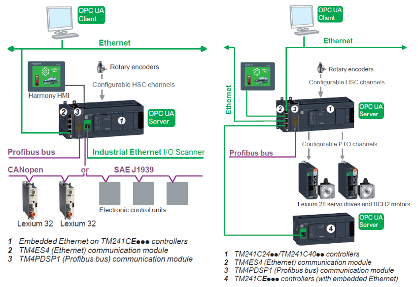

рис.8. Приклади комунікаційних архітектур M241

## 2. Центральний блок з CPU

### Зовнішній вигляд

Логічні контролери M241 випускаються у двох форм-факторах: з 24 входами/виходами і з 40 входами/виходами. На рис.7 показаний зовнішній вигляд CPU з 40 виходами.  

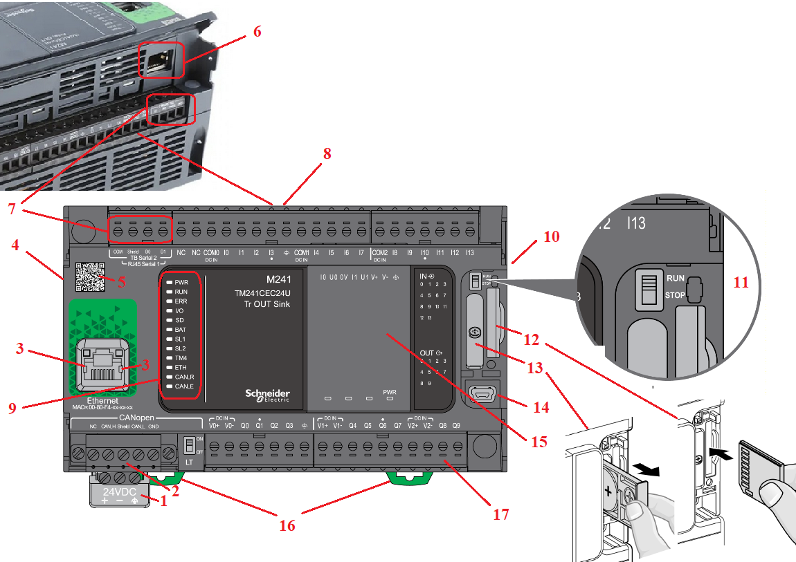

рис.9. Конструкція M241.

Конструкція CPU включає такі елементи (рис.6) 

1. Знімний гвинтовий клемний блок з трьома клемами для підключення живлення 24 В пост. струму або 100–240 В змінного струму (залежно від моделі).
2. Для контролерів TM241CEC24: роз’єм для підключення до машинної шини CANopen та SAE J1939 (гвинтовий клемний блок).
3. Для контролерів TM241CE: роз’єм RJ45 для підключення до мережі Ethernet з LED-індикаторами обміну даними та швидкості.
4. Роз’єм шини TM4: комунікаційна шина для підключення комунікаційних модулів TM4ppp.
5. QR-код для доступу до технічної документації контролера.
6. Порт послідовної лінії SL1 (RS-232 або RS-485): роз’єм RJ45.
7. Порт послідовної лінії SL2 (RS-485): гвинтовий клемний блок.
8. Підключення логічних входів 24 В пост. струму: знімні гвинтові клемні блоки (1).
9. Блок світлодіодної індикації, що відображає:
   - стан контролера та його компонентів (батарея, промислова SD-карта пам’яті);
   - стан вбудованих комунікаційних портів (CAN, послідовні лінії, Ethernet);
   - стан вбудованих входів і виходів.
10. Роз’єм шини TM3 для підключення модуля розширення Modicon TM3.

Під знімною кришкою розташовані елементи 11–15:

11) Перемикач Run/Stop.

12) Слот для промислової карти пам’яті SD.

13) Слот для резервної батареї.

14) Роз’єм USB mini-B для підключення програмувального термінала.

15) Слот(и) для картриджів введення/виведення або прикладних картриджів:

- один слот у TM241Cp24;
- два слоти у TM241Cp40.

16) Фіксатор для кріплення на 5-міліметрову симетричну DIN-рейку.

17) Підключення релейних або транзисторних логічних виходів через знімні гвинтові клемні блоки (1).

(1) Знімні клемні блоки з гвинтовими затискачами. Клемні блоки постачаються разом із контролером.

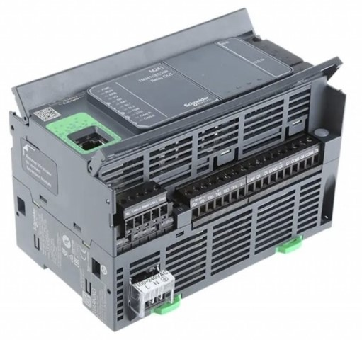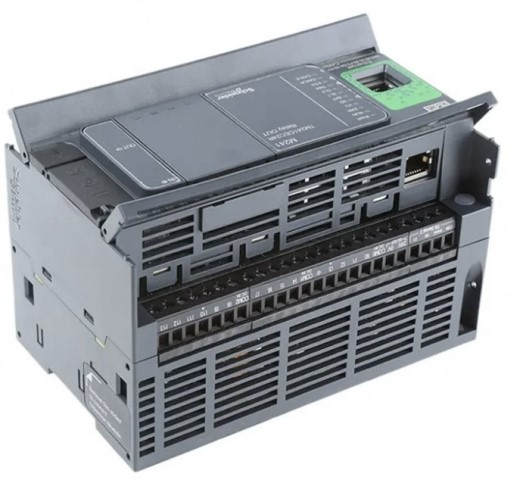

рис.10. M241: вид знизу та згори

### Моделі M241

Modicon M241 випускається у кількох модифікаціях, які відрізняються між собою складом вбудованих інтерфейсів, кількістю входів і виходів та типом живлення. Базова відмінність між моделями полягає у кількості вбудованих входів і виходів (рис.11). 

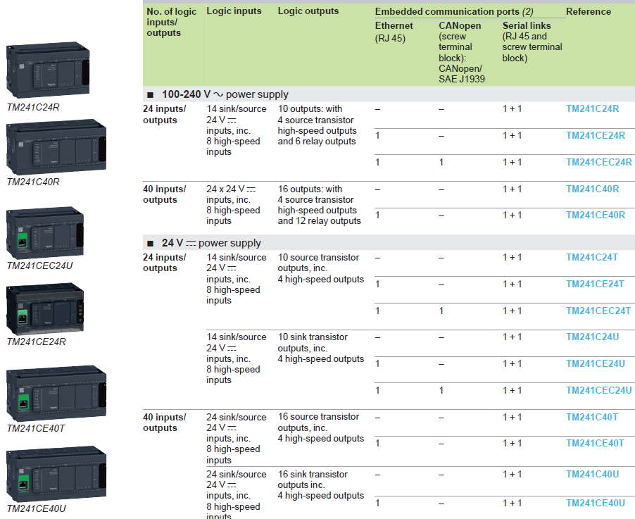

рис.11. Моделі M241

Доступні контролери з 24 I/O та 40 I/O. Моделі з 40 I/O мають більшу кількість дискретних входів і виходів, але зберігають той самий принцип розширення через TM3 і ті самі комунікаційні можливості.

Друга важлива відмінність стосується типу живлення. Контролери можуть працювати від 24 В постійного струму або від мережі 100–240 В змінного струму. Це дозволяє обирати модель залежно від електричної архітектури машини без зміни логіки керування.

Третя група відмінностей пов’язана з вбудованими комунікаціями. Залежно від моделі контролер може мати лише послідовні лінії та USB, вбудований Ethernet-порт або Ethernet разом із вбудованим портом CANopen. Саме наявність Ethernet і CANopen визначає, чи може контролер без додаткових модулів працювати в мережевих або розподілених архітектурах.

Окремо виділяються моделі з CANopen, які орієнтовані на керування приводами та розподіленими I/O на машинному рівні. Для таких моделей також доступний протокол SAE J1939.

### Керування станом програми користувача

Логічний контролер M241 може керуватися ззовні такими способами:

- апаратним перемикачем Run/Stop (рис.9);
- командою Run/Stop через спеціально призначений дискретний вхід, який означується у програмній конфігурації (див. ничже)
- командою з програмного середовища EcoStruxure Machine Expert.

## 3. Особливі функції входів та виходів 

### Функції входів

M241 має вбудовані дискретні входи, які можуть використовуватися у звичайному режимі, але підтримують особливі функції:

- фільтри (залежно від функції, асоційованої з входом);
- усі входи можуть використовуватися для функції Run/Stop;
- 8 швидкісних входів, які можуть працювати в режимі швидкісного лічильника HSC, в режимі фіксації стану або використовуватися для відлову подій (за фронтом), що дозволяє прив’язувати їх до задачі

Інтегрувальний фільтр (**Integrator Filter**) призначений для зменшення впливу завад. Встановлення значення фільтра дозволяє логічному контролеру ігнорувати окремі короткочасні зміни рівня входу, спричинені шумами. На часовій діаграмі з рис.12 показано дію інтегрувального фільтра для значення 4 мс. Значення, вибране для параметра часу фільтра, означує сумарний час у мілісекундах, який має минути, перш ніж вхід може перейти в стан 1.

рис. 12. Принцип роботи інтегрувального фільтра

Антидребезговий фільтр (**Bounce Filter**) призначений для зменшення ефекту дребезгу на входах. Встановлення значення антидребезгового фільтра дозволяє контролеру ігнорувати окремі короткочасні зміни рівня входу, спричинені електричними завадами. Антидребезговий фільтр доступний лише для швидкісних входів, при використанні фіксації стану або подій або коли увімкнено HSC. На часовій діаграмі рис.13 показано дію антидребезгового фільтра.

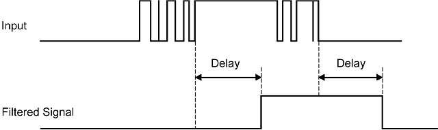

рис.13. Принцип роботи антидребезгового фільтру

Фіксація короткочасних імпульсів (**Latching**) — це функція, яка може бути призначена швидкісним входам логічного контролера M241. Вона використовується для запам’ятовування (фіксації) імпульсів, тривалість яких менша за час циклу виконання програми контролера. Коли тривалість імпульсу є меншою за один цикл сканування, контролер фіксує цей імпульс, а його стан оновлюється під час наступного циклу. Механізм фіксації розпізнає лише фронти наростання. На часовій діаграмі рис.14 показано ефект фіксації імпульсів.

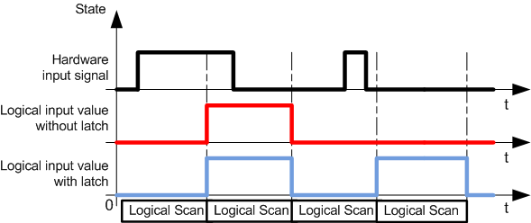

рис.14. Принцип фіксації короткочасних імпульсів

Подія (**Event**) - функція входу, що налаштовує його для роботи в режимі події фронтів, за яких викликається зовнішня задача (External Task).

Функція **Run/Stop** використовується для запуску або зупинки прикладної програми за допомогою входу. Окрім вбудованого перемикача Run/Stop, дозволяється налаштувати один (і лише один) вхід як додаткову команду Run/Stop.

Про деталі роботи додаткових функцій описано в лекції [Експертні функції контролерів Modicon M241](teorm241expertfn.md)

### Функції виходів 

Логічний контролер M241 оснащений як звичайними, так і швидкісними транзисторними виходами (PTO / PWM / FreqGen). Для транзисторних виходів можуть бути налаштовані такі функції:

- вихід Alarm;
- HSC (рефлекторні функції за порогом швидкісного лічильника);
- PTO;
- PWM;
- FreqGen.

Про деталі роботи додаткових функцій описано в лекції [Експертні функції контролерів Modicon M241](teorm241expertfn.md)

## Автори

Теретичне заняття розробив  [Олександр Пупена](https://github.com/pupenasan). 

## Feedback

Якщо Ви хочете залишити коментар у Вас є наступні варіанти:

- [Обговорення у WhatsApp](https://chat.whatsapp.com/BRbPAQrE1s7BwCLtNtMoqN)
- [Обговорення в Телеграм](https://t.me/+GA2smCKs5QU1MWMy)
- [Група у Фейсбуці](https://www.facebook.com/groups/asu.in.ua)

Про проект і можливість допомогти проекту написано [тут](https://asu-in-ua.github.io/atpv/) 