[<- До підрозділу](README.md)		[Коментувати](#feedback)

# Встановлення середовища, створення та запуск проєкту Control Expert Classic 

**Тривалість**: 2 год 

**Мета:** Навчитися встановлювати та запускати Control Expert Classic та імітатор PLC.

## Лабораторна установка.

**Необхідне апаратне забезпечення.** Для проведення лабораторних робіт необхідно мати комп’ютер з наступною мінімальною апаратною конфігурацією:

- CPU Intel/AMD 2 ГГц / RAM 16 ГБ / Диск 20 ГБ (вільних)  

**Необхідне програмне забезпечення.** 

1. Дистрибутив Control Expert V16.2
2. Передбачається використання віртуальної машини з Virtual Box (https://www.virtualbox.org).

2) Інтернет-браузер та доступ до Інтернет. 

**Загальна постановка задачі**. 

Цілі роботи: 

1) Підготовити віртуальне робоче місце для проведення різних лабораторних робіт з використанням Control Expert.
1) Створити новий проєкт в Control Expert Classic для PAC M580 з мінімальною конфігурацію.
1) Скомпілювати проєкт та завантажити його в PLC Simulator 

## Послідовність виконання роботи

### 1. Встановлення віртуальної машини Virtual Box та перевірка віртуалізації

**Даний пункт не є обов'язковим для виконання, якщо Ви плануєте встановлювати  Control Expert V16.2 на рідну хостову ОС, або якщо у Вас вже є встановлена сучасна OS Windows**  

- [ ] Встановіть Virtual Box та віртуальну машину з OC Windows 10, як це описано за [цим посиланням](https://asu-in-ua.github.io/atpv/vm/vbox/labwin10.html)

### 2. Встановлення Control Expert

Відеозапис встановлення можна подивитися на каналі YouTube [за посиланням](https://youtu.be/bHdi-KfJgqk)

- [ ] Завантажте образ EcoStruxure Control Expert. На момент написання практичного завдання його можна завантажити за цими посиланнями:
- [З сайту SE, потребує безкоштовної реєстрації](https://www.se.com/au/en/download/document/EcoStruxureControlExpert_V162/)
- [Локальний репозиторій Шнейдер Електрік Україна](https://schneiderelectric.sharepoint.com/:f:/s/IndustryproductsUkrainePublic/ElOQfk3cNmxBmlRHFA582AMBeKHxgFjf3zrBttz7kHd1tA)  - `Documents > General > Plant Automation > Software PAC > EcoStruxure Control Expert (Unity Pro) > Програмне забезпечення > Програмне забезпечення Control Expert`
- [ ] Відкрийте образ або вставте його в віртуальний привід віртуальної машини.
- [ ] Встановіть Microsoft .NET 3.5, якщо його ще не встановлено, його можна завантажити з [сайту Microsoft](https://www.microsoft.com/en-us/download/details.aspx?id=21)
- [ ] Встановіть EcoStruxure Control Expert, залишайте усі налаштування за замовченням.

### 3. Створення проєкту з M580 в Control Expert Classic

Відеозапис створення проєкту з M580 та першого запуску на  симуляторі можна подивитися на каналі YouTube [за посиланням](https://youtu.be/xh5O392nYJ0)

**Дана процедура передбачає прості кроки для швидкого створення та запуску проєкту і передбачає відключення певних опцій, які впливають на кібербезпеку. У цьому прикладі це зроблено свідомо для спрощення проведення практичного завдання.**  

- [ ] Запустіть Control Expert Classic (не Control Expert!).
- [ ] Якщо у Вас немає ліцензії, Ви можете запустити середовище в режимі Trial, тобто активувати Trial ліцензію на 30 днів. Цього має бути достатньо для ознайомлення з середовищем. Для активації запуску з Trail ліцензією без запуску License Manager у діалоговому вікні (рис.1) треба вибрати `No`.

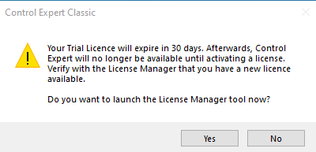

рис.1. Вікно попередження щодо ліцензії Trial.

- [ ] Створіть новий проєкт використовуючи меню `File->New`. 

  З'явиться вікно вибору PLC (рис.2). У цьому вікні можна обрати модель PLC та налаштування шасі (ці налаштування можна змінити і після створення). Якщо потрібно вказати PLC з іншою (страішою) версію операційної системи, треба активувати опцію `Show all versions`.  

- [ ] У вікні вибору PLC вкажіть `Modicon M580 BME P58 3040` з найновішою версією (на рис.2. це 4.40).

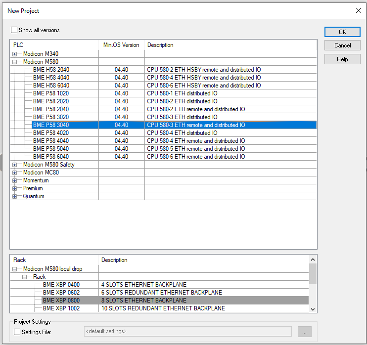

рис.2. Вікно вибору моделі PLC.

- [ ] У вікні що з'явиться (рис.3) запропонують ввести пароль для застосунку, який дає можливість захистити частини проєкту для читання або запису. У цьому завданні виберіть опцію відмови від паролю `I don't want ...` та натисніть `Ok`

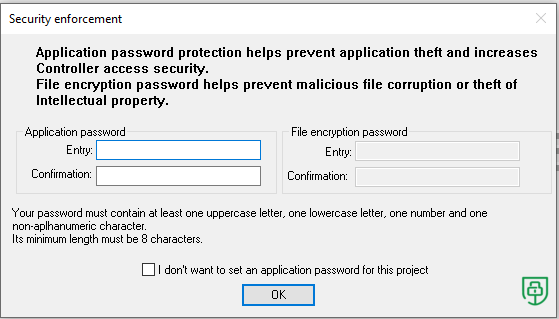

рис.3. Вікно створення паролю.

- [ ] Подивіться на зміст проєкту через структурний вигляд вікна `Project Browser` (рис.4). Спробуйте зрозуміти призначення кожного з розділів проєкту. 

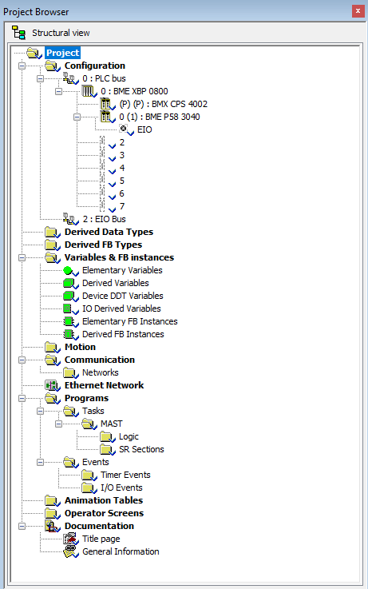

рис.4. Project Browser

### 4. Зміна налаштувань безпеки

**Дана процедура відключає усі можливі функції безпеки. У цьому прикладі це зроблено свідомо для спрощення проведення практичного завдання.**  

- [ ] У `Project Browser` у розділ `Configuration` натисніть по значку `EIO` (рис.5)   

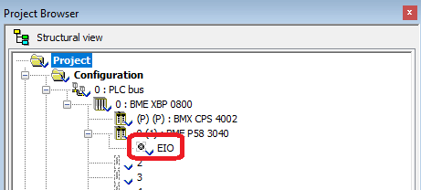

рис.5. Вибір конфігурування мережі.

Відкриється вікно налаштування вбудованих комунікаційних каналів CPU M580 (рис.6). Тут є багато вкладок, на яких налаштовуються властивості комунікацій в залежності від їх активності. За замовченням практично усі комунікаційні сервіси деактивовано, це диктується політикою безпеки, при якій за замовченням все забороняється, а потім виставляються тільки ті сервіси, які потрібні згідно проєкту. Для швидкої активації усіх сервісів (все дозволено) на вкладці `Security` можна натиснути кнопку `Unlock Security`, для деактивації (максимальний захист) -  `Enforce Security`. **Зверніть увагу, що якщо залишити максимальний захист (за замовченням) без додаткових змін в налаштуваннях, то при завантаженні проєкту в M580, комунікації будуть доступні тільки через USB порт, так як усі інші комунікаційні сервіси будуть деактивовані.**

- [ ] Подивіться зміст усіх вкладок вікна налаштування `EIO` після чого поверніться до вкладки `Security`. 

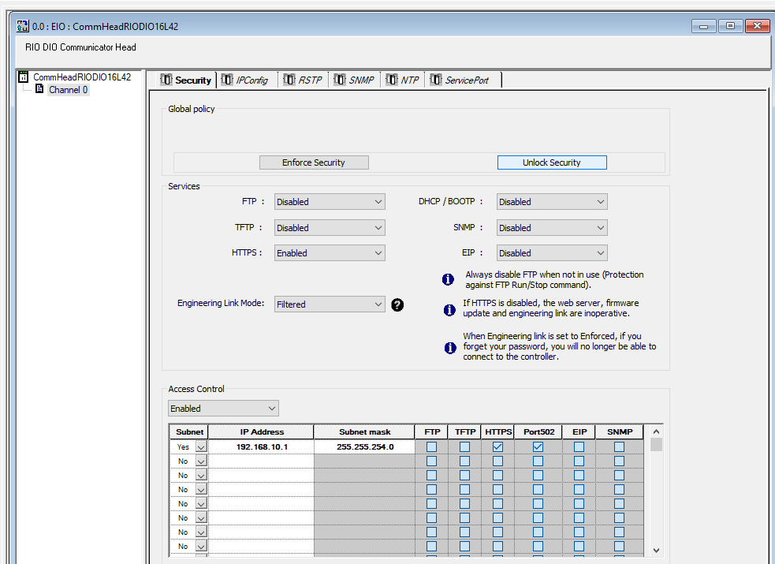

рис.6. Вікно налаштування вбудованих комунікаційних каналів CPU M580 з деактивованими сервісами (за замовченням).

- [ ] У вікні налаштування `EIO` натисніть кнопку `Unlock Security`. Відключіть наступні сервіси: `SNMP` та `HTTPS`. Наповненння вкладки прийме вигляд як на рис. 1.7	

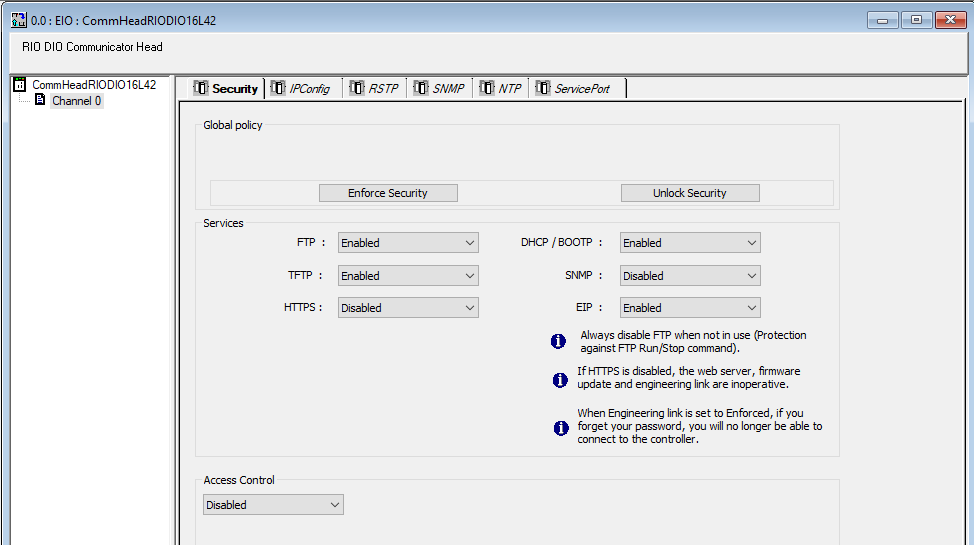

рис. 1.7. Налаштування `Security` для практичного завдання.

- [ ] Для валідації (прийняти для проєкту) налаштування виберіть в меню `Edit -> Validate`.

- [ ] Проаналізуйте проєкт щодо перевірки на наявність помилки через меню `Build -> Analyze Project`. 

Помилки відображаються у відповідній вкладці (рис.8). Наразі там повинні з'явитися помилки пов'язані з необхідністю виставлення паролів на завантаження прошивки (`Firmware`) та захисту сховища даних `Data Storage`.  `Control Expert` дає можливість перейти на місце виникнення помилки в проєкті, натиснувши по відповідному повідомленню. 

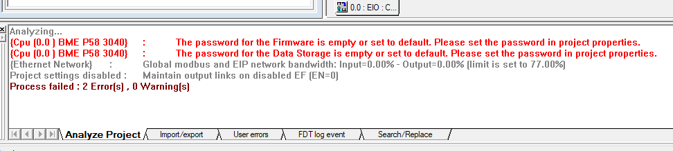

рис.8. Вікно з помилками після аналізу проєкту. 

- [ ] Натисніть по повідомленню помилки у вікні помилок. Відкриється вікно властивостей прєкту (рис.9.) на вкладці `Project & Controller Protection`. 

Для довідки: вікно властивостей проєкту можна відкрити через контекстне меню (рис.10) 

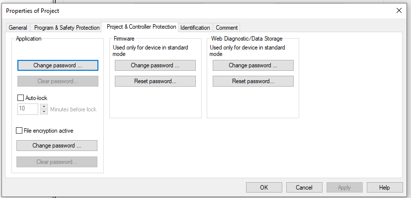

рис.9. Вікно властивостей проєкту.

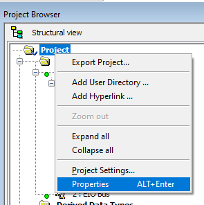

рис.10. Вихід у вікно властивостей проєкту через контекстне меню проєкту.

- [ ] Натисніть кнопку `Change Password` у розділі `Firmware` (див.рис.9). У полі `Old password` введіть пароль за замовченням, який вказаний у цьому ж вікні. У полях `New Password` вкажіть новий пароль, який має не менші ніж 8 символів, принаймні одну велику та малу літеру, цифру та спеціальний смвол.

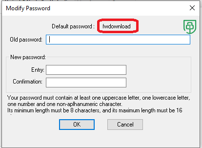

рис.11. Зміна паролю для `Firmware`

- [ ] Аналогічно змініть пароль для `Web Diagnostic/Data Storage `(рис.12)

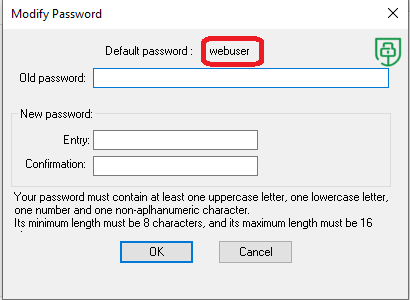

рис.12. Зміна паролю для `Web Diagnostic/Data Storage`

- [ ] Проаналізуйте проєкт щодо перевірки на наявність помилки через меню `Build -> Analyze Project`. Тепер список помилок повинен бути порожній.

### 5. Створення секції

- [ ] Через контекстне меню `Logic` із `Project Browser` створіть нову програмну секцію (рис.13)

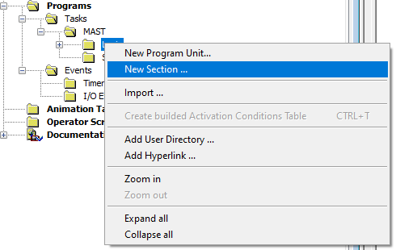

рис.13. Створення нової секції

- [ ] У полі `Name` введіть назву секції (рис.14), пізніше її можна буде змінити за необхідності. У полі `Language` виберіть мову програмування секції -`LD`, цю властивість для секції змінити після створення неможна. Після цього натисніть `Ok` 

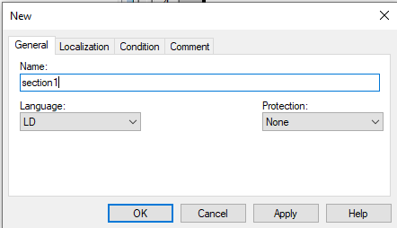

рис.14. Налаштування властивостей секції.

- [ ] Відкриється графічний редактор `LD`  де необхідно створити програму користувача, що зображена на рис. 1.18. Розмістіть контакти та котушки, вибираючи їх з меню (рис.15), або через панель швидкого доступу (рис.16) 

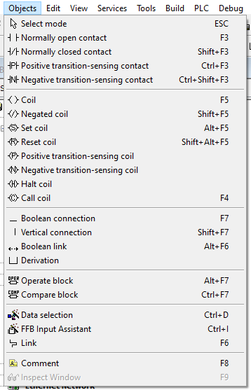

рис.15. Палітра об'єктів через меню. 

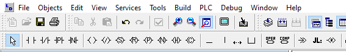

рис.16. Палітра об'єктів через панель швидкого доступу.

- [ ] Для контакту та котушки задайте змінні з назвами відповідно `bool1` та `bool2`. Якщо вказати назву неіснуючої змінної, редактор запропонує створити її (рис.17), натисніть "галочку" щоб погодитися з варіантому.  

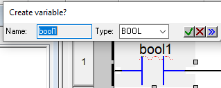

рис.17. Вікно з пропозицією щодо створення змінної.

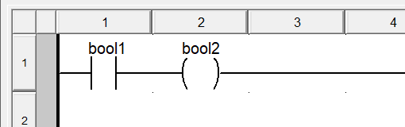

рис.18. Вигляд програми користувача.

- [ ] Перевірте створені змінні, натиснувши `Elementary variables` в `Project Browser`

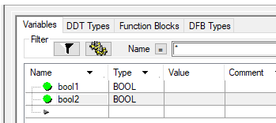

рис.19. Список змінних у вікні `Variables`

- [ ] Перевірте чи є помилки в проєкті, викликавши команду меню `PLC->Analyze`. Якщо помилок немає, переходьте до наступного пункту. Якщо є, перевірте уважно виконання усіх дій.

### 6. Компілювання та запуск PLC Simulator

Для завантаження проєкту в PLC, необхідно зробити його компілювання (`Build`). У даному завданні замість реального контролера використовується PLC Simulator. Він дає можливість перевірити логіку виконання програми користувача, однак має деякі обмеження та відмінності порівняно з реальним PLC. Компільований проєкт під Simulator відрізняється від компільованого проєкту для реального PLC. 

- [ ] Виберіть режим компілювання та підключення (рис.19) на `Simulation Mode`

рис.19. Вибір режим компілювання та підключення.

- [ ] Зробіть компілювання проєкту (рис.20) `Rebuild All Project`.

Перший раз робиться повне коміплювання. Після змін в проєкті, можна також використовувати часткове компілювання змін (`Build Changes`). Це дає можливість у режимі онлайн з PLC або Simulator, заливати зміни під час компілювання без повного завантаження проєкту та зупинки PLC. 

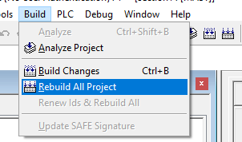

рис.20. Команди меню для компілювання проєкту.

- [ ] У вікні помилок подивіться що немає помилок `Rebuild`. 
- [ ] Через команду меню `PLC->Connect` зробіть підключення до Simulator (рис.21). 

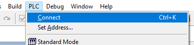

рис.21. Команда підключення до PLC

- [ ] Оскільки PLC Simulator до цього не запускався, перший раз запуск приводить до попередження щодо обмеження доступу до PLC Simulator (рис.22). У попередженні написано варіанти захисту доступу до PLC Simulator через порт 502: через пароль, або без обмежень. Натисніть `Ok`. 

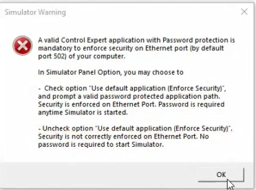

рис.22. Вікно попередження щодо обмеження доступу до PLC Simulator

- [ ] У даному прикладі ми не будемо вживати обмеження доступу до PLC Simulator. Тому в наступному вікні панелі опцій (рис.23) деактивуйте опцію `Use default application to start simulator (enforce security)`. Натисніть `Ok`.

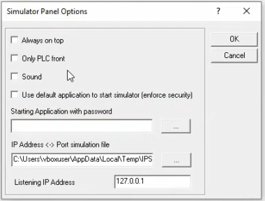

рис.23. Панель опцій PLC Simualtor

Після цього запуститься PLC Simualtor, індикатор якого з'явиться у панелі Tray (рис.24). Статус `?` показує що програма відсутня у PLC Simualtor, що аналогічно `NO CONF` на панелі статусу Control Expert Classic (рис.25).  

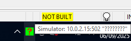

рис.24. Індикатор на панелі Tray після запуску PLC Simualtor

- [ ] Натисніть ще раз PLC->Connect. Подивіться на індикатори на панелі статусу (рис.25)

- Індикатор `HMI R/W mode` вказує що онлайн режим дає можливість змінювати проєкт в PLC. 

- Індикатор `Different` на панелі статусу показує що скомпільовані проєкти відрізняються в PLC Simualtor (немає нічого) та Control Expert (скомпільована  версія). 
- Індикатор `NO CONF` вказує що PLC Simulator немає ніякого проєкту.  
- Індикатор `NO UPLOAD INFO` вказує що в PLC Simualtor немає нічого, що можна вивантажити з нього (вихідного коду). 
- Індикатор `TCPIP:127.0.0.1` вказує IP адресу PLC Simualtor, а жовтий колір нагадує нам що це не ральний PLC, а Simualtor.   

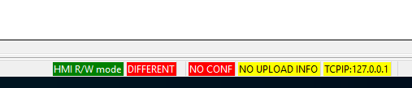

рис.25. Панель статусу в режимі онлайн без залитого проєкту в PLC

- [ ] Викличте команду меню `PLC -> Transfer Project to PLC` (рис.26)

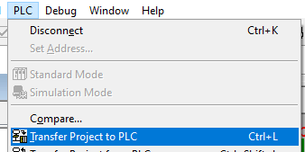

рис.26. Команда завантаження проєкту в PLC

- [ ] З'явиться вікно, в якому вкзано який проєкт в Control Expert (PC) та який наразі в PLC (рис.27). Виставте опцію `PLC Run after Transfer` щоб не забути запустити програму в PLC після повного завантаження. 

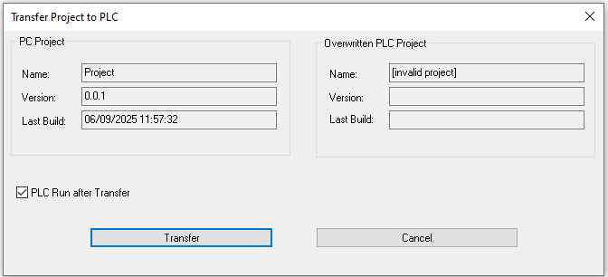

рис.27. Вікно завантаження проєкту в PLC

- [ ] Після завантаження з'явиться вікно підтвердження запуску програми в PLC (рис.28). Натисніть `Ok`.

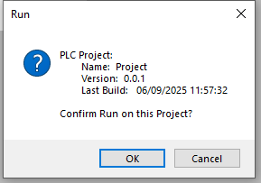

рис.28. Вікно підтвердження запуску

- [ ] Після запуску програми, використовуючи контекстне меню PLC Simulator (рис.29) відкрийте `Simulation Panel...`

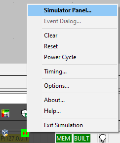

рис.29. Контекстне меню індикатору PLC Simulator

- [ ] Подивіться на зовнішній вигляд панелі Simulation (рис.30). Знайдіть індикатору який на Вашу думку показує стан програми користувача в PLC. 

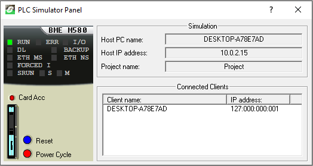

рис.30. Панель PLC Simulator

- [ ] Подивіться на панель статусу. Порівняйте значення статусу з рис.25. Спробуйте самостійно визначити  значення кожного індикатору.

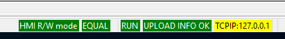

рис.31. Панель статусу в режимі онлайн після завантаження проєкту

### 7. Перевірка роботи програми 

У режимі онлайн, редактор секцій за замовченням відображатиме стан змінних та гшрафічних елементів. Цей режим відображення називається  `Animation` і може деактивуватися за необхідністю відповідною командою меню або панелі швидкого доступу (рис.32).

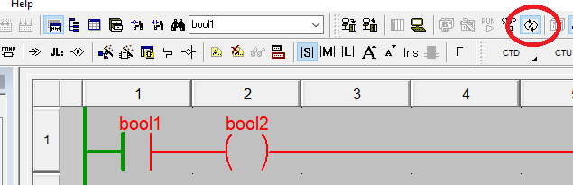

рис.32. Редактор програми LD в режимі онлайн та включеній опції `Animation` 

У даному випадку для мови LD, зелений колір елементу або з'єднання показує "наявну напругу" на них, а червоний - її відсутність. Для булевих змінних зелений колір вказує на значення  `TRUE` , тоді як червоний - на стан `FALSE`. Як видно з рис.32 контакт "не пропускає умовний струм далі", тому що змінна дорівнює `bool1` , яка керує цим контактом має значення логічного нуля (`FALSE`). Тому на котушці немає "різниці потенціалів" і вона не спрацьовує, а отже `bool2` залишається в `FALSE`. 

Редактор в режимі онлайн також має вбудовані засоби налагодження, які дають можливість змінювати значення змінних, хоча для цього є стандартні інструменти такі як `Animation Table` та `Operator Screen`. 

- [ ] Використовуючи контекстне меню контакту змініть значення змінної прив'язаної до нього `bool1` у `TRUE` (`Set to 1`). 

рис.33. Зміна значень змінних через контекстне меню редактору

- [ ] Подивіться на стан анімації елементів реадктору LD. Подумайте чому саме так вони відображаються.

- [ ] Використовуючи команду меню `File -> Save as...` збережіть проєкт на диск та закрийте редактор Control Expert Classic.

## Автори

Практичне заняття розробив  [Олександр Пупена](https://github.com/pupenasan). 

## Feedback

Якщо Ви хочете залишити коментар у Вас є наступні варіанти:

- [Обговорення у WhatsApp](https://chat.whatsapp.com/BRbPAQrE1s7BwCLtNtMoqN)
- [Обговорення в Телеграм](https://t.me/+GA2smCKs5QU1MWMy)
- [Група у Фейсбуці](https://www.facebook.com/groups/asu.in.ua)

Про проект і можливість допомогти проекту написано [тут](https://asu-in-ua.github.io/atpv/)