[<- До підрозділу](README.md)	[PLC MachineStruxure](../ecostruxuremachineexpert.md)	[Коментувати](#feedback)

# Встановлення середовища, створення та запуск проєкту EcoStruxure Machine Expert 

**Тривалість**: 2 год 

**Мета:** Навчитися встановлювати та запускати EcoStruxure Machine Expert  та імітатор PLC.

## Лабораторна установка.

**Необхідне апаратне забезпечення.** Для проведення лабораторних робіт необхідно мати комп’ютер з наступною мінімальною апаратною конфігурацією:

- CPU Intel/AMD 2 ГГц / RAM 16 ГБ / Диск 20 ГБ (вільних)  

**Необхідне програмне забезпечення.** 

1. Дистрибутив Schneider Electric Software Installer (завантажується під час встановлення)
2. Передбачається використання віртуальної машини з Virtual Box (https://www.virtualbox.org).

2) Інтернет-браузер та доступ до Інтернет. 

**Загальна постановка задачі**. 

Цілі роботи: 

1) Підготовити віртуальне робоче місце для проведення різних лабораторних робіт з використанням EcoStruxure Machine Expert .
1) Створити новий проєкт в EcoStruxure Machine Expert  для M241 з мінімальною конфігурацію.
1) Скомпілювати проєкт та завантажити його в Simulator PLC 

## Послідовність виконання роботи

### 1. Встановлення віртуальної машини Virtual Box та перевірка віртуалізації

**Даний пункт не є обов'язковим для виконання, якщо Ви плануєте встановлювати EcoStruxure Machine Expert на рідну хостову ОС, або якщо у Вас вже є встановлена сучасна OS Windows**  

- [ ] Встановіть Virtual Box та віртуальну машину з OC Windows 10, як це описано за [цим посиланням](https://asu-in-ua.github.io/atpv/vm/vbox/labwin10.html)

Надалі не буде згадуватися віртуальна машина, усі пункти виконуються саме там де планується використовувати EcoStruxure Machine Expert 

### 2. Встановлення Schneider Electric Software Installer 

Schneider Electric Software Installer є централізованим інструментом для керування встановленням, оновленням і обслуговування інженерного ПЗ Schneider Electric. Він забезпечує коректну інсталяцію складних програмних продуктів разом з усіма необхідними залежностями, драйверами, бібліотеками та ліцензійними компонентами, які не встановлюються окремими інсталяторами. У межах цієї лабораторної роботи Software Installer використовується як єдиний підтримуваний спосіб встановлення EcoStruxure Machine Expert. Саме через нього виконується вибір версії ПЗ, завантаження або підключення до локального інсталяційного пакета, а також контроль сумісності компонентів. Це дозволяє відтворювати однакове середовище розробки на різних робочих станціях і уникати типових помилок, пов’язаних з ручною або некоректною інсталяцією.

- [ ] Завантажте  Schneider Electric Software Installer. На момент написання практичного завдання його можна завантажити за цими посиланнями:
- [З сайту SE, потребує безкоштовної реєстрації](https://www.se.com/us/en/download/document/ESEMACS10_INSTALLER)
- [Локальний репозиторій Шнейдер Електрік Україна](https://schneiderelectric.sharepoint.com/:f:/s/IndustryproductsUkrainePublic/ElOQfk3cNmxBmlRHFA582AMBeKHxgFjf3zrBttz7kHd1tA)  - `Documents > General > Machine Automation > Програмне забезпечення Machine > EcoStruxure Machine Expert`
- [ ] Запустіть процес інсталяції. Залишайте усі опції інсталяції за замовченням. 
- [ ] Після інсталяції Schneider Electric Software Installer запуститься автоматично, переходьте до наступного пункту

### 3. Встановлення EcoStruxure Machine Expert 

- [ ] Виберіть `Install new software` 

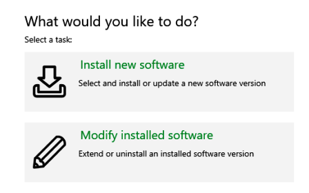

рис.1. 

- [ ] За замовченням Вам запропонують поставити останню версію Machine Expert, на момент розроблення лабораторної роботи це 2.3.0, натисніть `Next` 

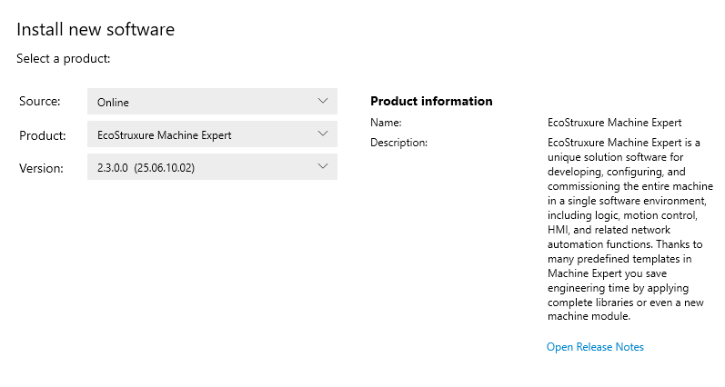

рис.2.

- [ ] На наступному кроці налаштування інсталяції (рис.3) необхідно вибрати опцію `Program machine controllers (Modicon)` і натисніть `Next`.

Це мінімально достатній набір компонентів для роботи з EcoStruxure Machine Expert у межах даної лабораторної роботи.  Ця опція забезпечує встановлення базового середовища для програмування контролерів Modicon. Усі інші компоненти на цьому етапі можна не встановлювати, оскільки їх за потреби можна додати пізніше через повторний запуск Schneider Electric Software Installer без повного перевстановлення ПЗ.

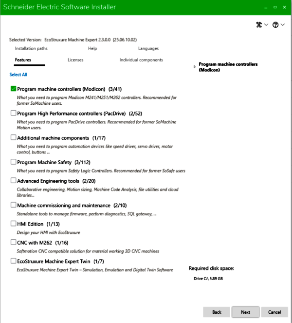

рис.3.

- [ ] У наступному вікні погодьтеся з ліцензійними умовами і натисніть `Start installation`
- [ ] Дочекайтеся коли буде завершена інсталяція, це може зайняти кілька десятків хвилин. Ви маєте отримати повідомлення про успішне встановлення.
- [ ] Далі натисніть `Next` і в наступному вікні - `Finish`


### Примітка щодо ліцензування

EcoStruxure Machine Expert не вимагає наявності ліцензії під час першого запуску. Середовище дозволяє створювати, відкривати та редагувати проєкти, виконувати конфігурацію апаратури і працювати в офлайн-режимі без активації ліцензії. Перевірка ліцензії виконується не при старті ПЗ, а лише в момент виконання дій, які її потребують.

Ліцензія стає необхідною під час переходу до онлайн-роботи, зокрема при підключенні до реального PLC, завантаженні програми в контролер, використанні режимів онлайн-моніторингу та налагодження, а також при роботі з опційними компонентами (Safety, Motion, CNC, Twin тощо). У цей момент система або повідомляє про відсутність ліцензії, або пропонує перейти до License Manager.

Для ознайомлення та навчальних цілей передбачена trial-ліцензія. Вона активується окремо через License Manager і має часові обмеження (типово 21–30 днів залежно від версії та компонентів). Trial-ліцензія не вмикається автоматично і зазвичай є одноразовою для конкретного робочого середовища.

Важливою особливістю є робота з імітатором PLC (simulation). Підключення до вбудованого імітатора, запуск симуляції та тестування логіки без фізичного контролера, як правило, не потребують повної комерційної ліцензії і можуть виконуватися без активованої ліцензії або в межах trial. Це дозволяє використовувати EcoStruxure Machine Expert у навчальних лабораторних роботах без доступу до реального обладнання. Перехід від імітатора до реального PLC розглядається як онлайн-робота і вже потребує відповідної ліцензії.


**Надалі для спрощення сприйняття матеріалу, замість повної назви ПЗ `EcoStruxure Machine Expert` вживатимемо скорочену - `Machine Expert`**


### 4. Запуск Machine Expert і знайомлення з середовищем

У цьому пункті на прикладі готового проєкту необхідно познайомитися з основними вікнами середовища Machine Expert. 

- [ ] Запустіть Machine Expert. Перший запуск буде досить тривалий (кілька хвилин), тому дочекайтеся коли середовище запуститься.
- [ ] У вікні, яке з'явиться (рис.4) залиште вибраними знайдені DTM та натисніть `Import selected DTMS...` 

Це вікно з’являється під час першого запуску EcoStruxure Machine Expert і призначене для імпорту DTM (Device Type Manager), виявлених у системі. DTM використовуються для коректної роботи з пристроями та комунікаційними протоколами (наприклад, Modbus, Modbus TCP, приводи Altivar) у межах інженерного середовища. У рамках лабораторної роботи рекомендується залишити вибраними знайдені DTM та виконати їх імпорт, оскільки це стандартна одноразова процедура початкового налаштування середовища. Вона не впливає на логіку програми, але забезпечує готовність середовища до подальшої конфігурації пристроїв і мережевих з’єднань.

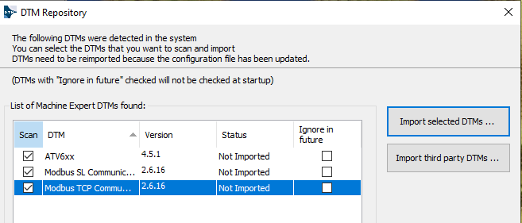

рис.4.

Після імпорту середовище готове до роботи.

Надалі варто ознайомитися з прикладом проєкту. Приклади та демонстраційні проєкти Machine Expert постачаються разом із середовищем і доступні через інтерфейс створення нового проєкту. Вони не призначені для відкриття безпосередньо з файлової системи, а використовуються як шаблони або зразки при створенні власних проєктів. Такий підхід забезпечує незалежність прикладів від версії ПЗ та структури каталогів на робочій станції.

- [ ] Зайдіть в меню `File -> New Project`. 
- [ ] Відкриється вікно вибору варіанту створення проєкту (рис.5):
  -  Виберіть варіант `From Example`  
  - Виберіть проєкт з Altivar Назвіть проєкт `Example1`

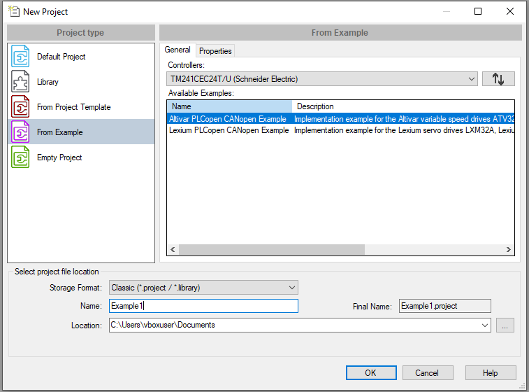

рис.5. 

- [ ] Дочекайтеся коли майстер створить новий проєкт по прикладу. Подивіться на загальний вигляд середовища Machine Expert (рис.6)

Середовище розроблення має досить класичне подання, у лівій частині якого розташовані деревоподібні подання проєкту (tree views), які поділяються на `Devices tree`, `Applications tree` та `Tools tree`. Вони забезпечують навігацію по апаратній структурі, програмній логіці та сервісних інструментах відповідно. Після вибору елемента в одному з деревоподібних подань його вміст відкривається у центральній частині робочої області, яка в документації  Machine Expert називається editor (редактор). Тип відкритого редактора залежить від вибраного об’єкта і може змінюватися без переходу між вікнами.

- [ ] Проаналізуйте зміст `Devices tree` (апаратна структура)

Ця закладка (рис.6) відображає апаратну структуру проєкту. Тут показано контролер (CPU), його вбудовані ресурси, входи та виходи, мережі та шини зв’язку. Апаратна структура  використовується для опису фізичної конфігурації системи керування та взаємодії з обладнанням. 

- [ ] Натисніть по `MyController` щоб відкрився редактор, подивіться на його зміст. Поступово перемикайтеся між різними вкладками редактору, спробуйте отримати якусь інформацію інтуїтивно, зокрема що це за CPU.   

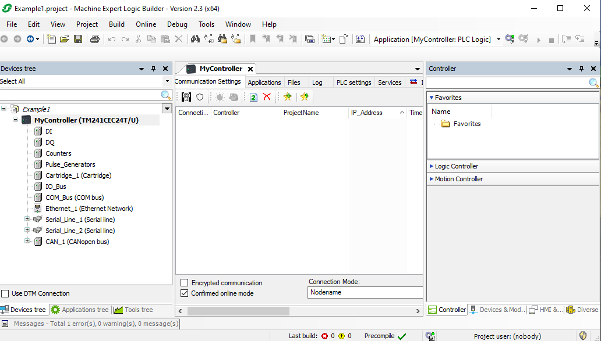

рис.6.

- [ ] Проаналізуйте зміст `Applications tree` (програмна структура).

У цій закладці (рис.7) представлена логічна структура програмної частини. Тут знаходяться застосунки, задачі, програми, функціональні блоки, змінні та бібліотеки. Саме Applications tree є основним робочим простором для створення та редагування логіки керування.

- [ ] Поступово відкрийте в редакторі `MAST`, `SR_Machine`, `GVL` та подивіться на їх зміст.  

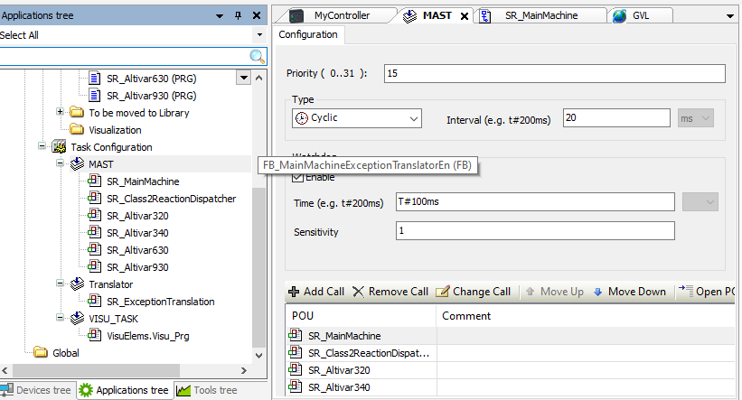

рис.7. 

- [ ] Проаналізуйте зміст `Tools tree` (сервісна структура)

Ця закладка містить допоміжні та сервісні інструменти середовища (рис.8). Вона використовується для налаштування, аналізу, діагностики та обслуговування проєкту і не призначена безпосередньо для написання коду.

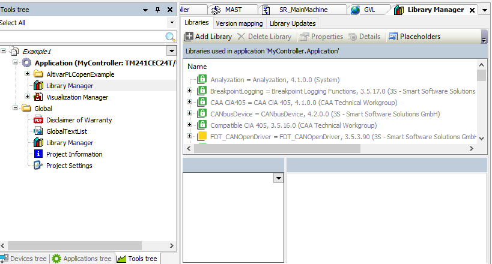

рис.8. 

Праворуч вгорі розташовані вкладки `Properties` (панель властивостей) і `Toolbox` (панель інструментів). Вміст цих вкладок є контекстним і залежить від того, який елемент проєкту вибраний у дереві або у вікні редактору. Через панель властивостей виконуються параметричні налаштування вибраного об’єкта, тоді як панель інструментів використовується для додавання елементів у поточний редактор. 

- [ ] Виділіть один з кроків у вікні редактору відкритої `Sr_MainMachine` і проналізуйте вміст вкладки `Properties` (панель властивостей)

Ця вкладка відображає властивості вибраного елемента (рис.9). Її вміст змінюється залежно від того, що саме виділено: стан SFC, програму, задачу, пристрій або інший об’єкт. Через панель властивостей виконуються всі параметричні налаштування, які не редагуються безпосередньо в коді або графічному редакторі. 

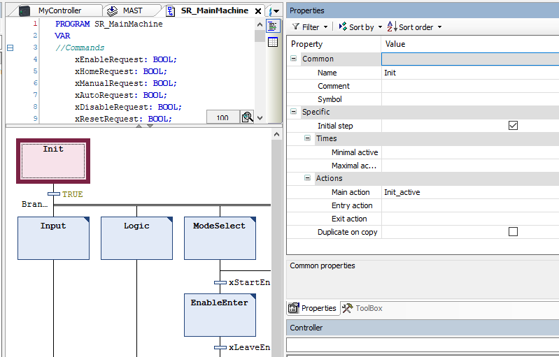

рис.9.

- [ ] При відкритій `Sr_MainMachine` і проналізуйте вміст вкладки `Toolbox` (панель інструментів)

Ця вкладка використовується для додавання нових елементів у поточний редактор (рис.10). Її вміст також контекстний: для SFC тут будуть доступні кроки, переходи та дії, для інших типів редакторів — відповідні їм елементи. Toolbox не відображає структуру проєкту, а слугує джерелом об’єктів, які можна вставляти в editor.


рис.10.

У правій нижній частині робочої області розташована панель каталогів, яка містить чотири закладки. Вони використовуються для вибору та додавання об’єктів у проєкт і працюють разом з `Devices tree` та `editor`. Панель з вкладками `Controller`, `Devices & Modules`, `HMI & iPC` та `Diverse` можна розглядати як бібліотеку апаратних компонентів Machine Expert. 

- [ ] Передивіться вміст закладки  `Controller`

Ця закладка (рис.11) містить каталог контролерів, згрупованих за типами та призначенням. Вона використовується для вибору або заміни контролера в проєкті та є початковою точкою формування апаратної конфігурації.

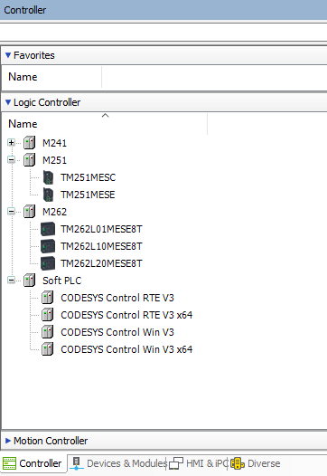

рис.11.

- [ ] Передивіться вміст закладки `Devices & Modules`

У цій закладці (рис.12) зібрані апаратні модулі та пристрої, які можуть бути додані до контролера. Вона використовується для розширення апаратної структури, додавання модулів вводу/виводу та інших компонентів.


Закладка `HMI & iPC` призначена для вибору HMI-пристроїв та промислових ПК, які можуть бути частиною проєкту. Вона застосовується у випадках, коли система керування включає операторський інтерфейс або обчислювальні вузли.

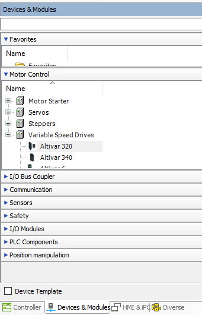

рис.12.

- [ ] Передивіться вміст закладки `Diverse`

У цій закладці (рис.13) зібрані допоміжні та універсальні об’єкти, які не належать безпосередньо до контролерів або модулів. Вона використовується для додавання загальних компонентів у структуру проєкту.

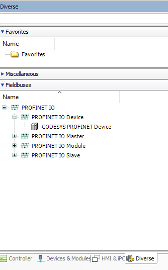

рис.13.

- [ ] Закрийте проєкт `File -> Close Project`

### 5. Створення проєкту за замовченням

У цьому пункті необхідно створити проєкт самостійно

- [ ] Створіть новий проєкт з наступними налаштуваннями (рис.14):
  - як `Default Project`
  - тип контролера `TM241CE24T/U` (за замовченням)
  - назва контролера `PLC1`
  - мова основної секції `SR_main ` - `Ladder (LD2)`
  - назва проєкту `Lab1`

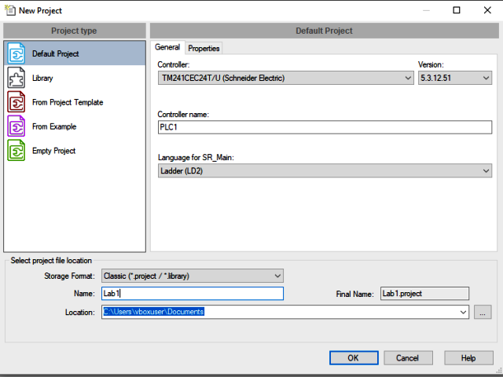

рис.14. 

- [ ] Подивіться на апаратну структуру проєкту. Зверніть увагу на назву контролера та його складові.
- [ ]  Відкрийте програмну структуру проєкту (рис.15). Зверніть увагу, що при вказаних налаштуваннях, Machine Expert зробив наступне: 
  - створив застосунок з іменем `Application` 
  - створив глобальний список змінних `GVL`, 
  - створив основну програму `SR_Main` 
  - створив конфігурацію задач, в яку добавив основну задачу `MAST`
  - добавив виклик програми  `SR_Main`  в задачі `MAST` 

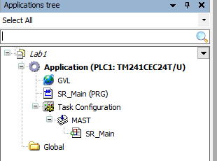

рис.15. 

- [ ] Відкрийте в редакторі задачу `MAST`. Проаналізуйте налаштування задачі. 

За замовченням конфігурація задачі MAST (рис.16) має тип `Cyclic` і виконується з заданим інтервалом часу 20 мс. Також увімкнено сторожовий таймер, який контролює максимальний допустимий час виконання програми  (100 мс) та використовується для виявлення зависань або перевищення часу циклу. У межах задачі обробляється один POU - `SR_Main`. Пріоритет задачі виставлений 15, враховуючи що більше задач немає, це наразі не має ніякого значення.

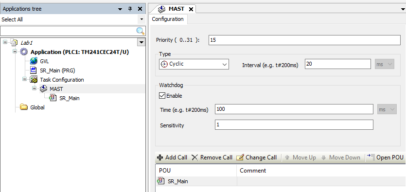

рис.16. 

### 6. Створення програми на LD

- [ ] Відкрийте в редакторі `SR_Main`. Зверніть подивіться на вміст редактору.

Вікно редактора LD складається з двох частин (рис.17).У верхній частині вікна редактора розташована область оголошення змінних, яка наразі порожня. У цій області задаються імена змінних, їх типи даних, область видимості, початкові значення та коментарі. Змінні, оголошені тут, мають локальну область видимості та доступні лише в межах даної програми. Саме тут формується інтерфейс програми та означуються змінні, що використовуються в логіці керування. Для змінних, які мають бути доступні з різних програм або елементів проєкту, використовується окремий список глобальних змінних GVL, розташований у програмній структурі проєкту. Область оголошення змінних може відображатися у табличному або текстовому вигляді залежно від вибраного режиму перегляду.

У нижній частині вікна редактора розташована область редагування коду програми мовою LD. Саме тут формується логіка програми у вигляді мереж, що використовують змінні, оголошені у верхній частині вікна редактора.

- [ ] Переведіть область оголошення змінних в табличний вигляд (`Tabular View`) 

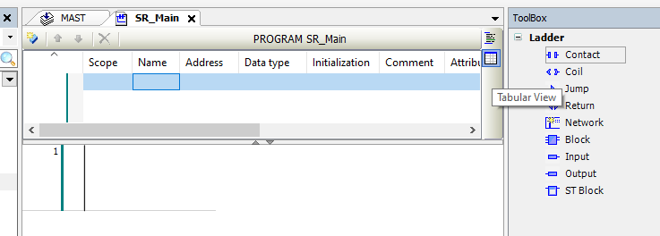

рис.17.

- [ ] Створіть дві змінні, як показано на рис.18.
- [ ] Використовуючи Toolbox створіть програму, як показано на рис.18 

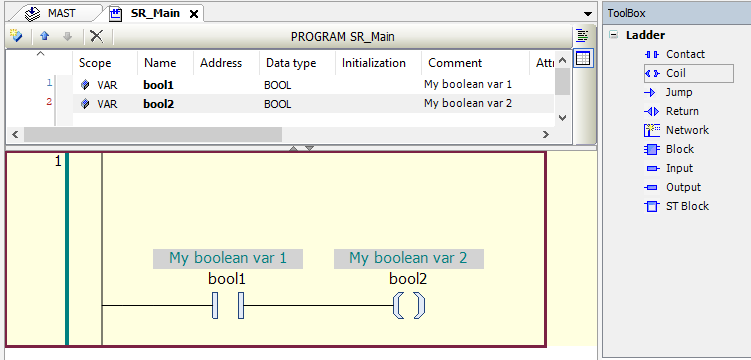

рис.18. Вигляд програми користувача.

### 7. Побудова проєкту та запуск в режимі емуляції ПЛК

Для завантаження проєкту в PLC, необхідно зробити генерування завантажуваного коду (`Generate Code`). У даному завданні замість реального контролера використовується емулятор ПЛК (Simulation). Він дає можливість перевірити логіку виконання програми користувача, однак має деякі обмеження та відмінності порівняно з реальним PLC.  

- [ ] Збережіть проєкт на диску. **Увага, не називайте файл кирилицею і не розміщуйте його в шляху, де зустрічається кирилиця!** 

- [ ] Зробіть побудову проєкту (рис.19) `Generate Code` і дочекайтеся поки пройде побудова.

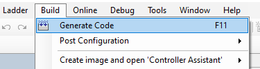

рис.19.

- [ ] Після побудови відкрийте вікно повідомлень і подивіться на вміст (рис.20) 

У верхній частині панелі відображається зведена інформація про результат побудови: кількість помилок, попереджень і інформаційних повідомлень. У даному випадку побудова завершилася без помилок, але з одним попередженням, що означає коректну генерацію коду з рекомендаціями, які не блокують подальшу роботу. 

Нижче наведено послідовність етапів побудови проєкту: аналіз коду, генерація програмного коду, ініціалізація глобальних змінних та формування пам’яті контролера. Повідомлення про використання пам’яті носять інформаційний характер і дозволяють оцінити, як програма займає різні області пам’яті пристрою.

Завершальне повідомлення вказує, що проєкт успішно зібраний і готовий до завантаження в контролер. На цьому етапі не потрібно усувати попередження, оскільки воно не впливає на виконання лабораторної роботи і наведене з діагностичною метою.

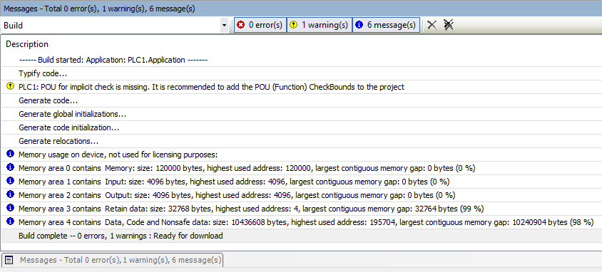

рис.20.

- [ ] Виставте режим імітації ПЛК. `Online -> Simulation`

Ця команда переводить Machine Expert у режим роботи з емулятором PLC. У цьому режимі програма виконується не на реальному контролері, а у програмному середовищі, яке відтворює поведінку контролера на комп’ютері. Під час емуляції використовується та сама програмна структура, задачі та логіка виконання, що й для реального PLC, але без обміну з фізичним обладнанням. Це дозволяє перевіряти логіку програми, спостерігати за змінами змінних та тестувати алгоритми без підключення до контролера і без ризику для обладнання.

- [ ] Перейдіть в режим  `Online -> Login`

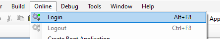

рис.21.

Команда Online → Login встановлює онлайн-з’єднання між середовищем Machine Expert та цільовим середовищем виконання програми. Залежно від обраного режиму це може бути реальний PLC або режим емуляції. 

- [ ] При підключенні до емулятора з'явиться вікно попередження щодо підключення (рис.22)  

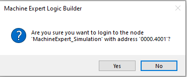

рис.22. 

Після виконання Login середовище переходить у онлайн-режим, у якому відображається поточний стан програми, задач і змінних. У цьому режимі стає можливим спостереження за виконанням логіки, перегляд значень змінних у реальному часі та виконання налагоджувальних дій. Команда Login не змінює програму сама по собі. Вона лише встановлює зв’язок з середовищем виконання, а завантаження або синхронізація програми виконуються окремо відповідними командами.

- [ ] Наступне попередження запропонує завантажити побудований код в порожній емулятор PLC (hbc/23). Натисніть `Yes`

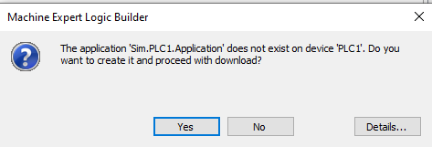

рис.23. 

- [ ] Після завантаження коду в емулятор PLC, проаналізуйте стан панелі статусу.

Панель статусу використовується як швидкий індикатор стану системи і дозволяє без відкриття додаткових вікон оцінити, чи готовий проєкт до виконання, у якому режимі він працює та чи є проблеми з побудовою або синхронізацією програми. 

Нижня частина вікна є панеллю статусу Machine Expert і використовується для оперативного відображення поточного стану проєкту, середовища виконання та зв’язку з контролером або режимом емуляції. Зліва відображається інформація про користувача пристрою (Device User) та результат останньої побудови проєкту. Індикація `Last build` показує кількість помилок і попереджень, зафіксованих під час останнього Build, а статус `Precompile` підтверджує, що попередня генерація коду виконана успішно.

У центральній частині панелі статусу відображається стан виконання програми. Напис `STOP` означає, що програма наразі не виконується. Позначення `SIMULATION` вказує, що середовище працює в режимі емуляції, а не з реальним PLC. Це дозволяє однозначно відрізнити навчальний або тестовий режим від роботи з фізичним контролером. Зверніть увагу на кольори фону цих написів, які свідомо привертають увагу.

Праворуч відображається стан програми та проєкту. Повідомлення `Program loaded` означає, що програма завантажена в середовище виконання, а `Program unchanged` підтверджує відсутність розбіжностей між поточною версією проєкту та тією, що виконується. Додатково показується інформація про користувача проєкту, що важливо при роботі з багатокористувацькими або мережевими конфігураціями.

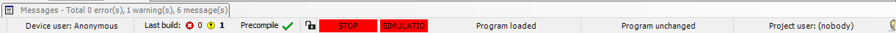

рис.24. 

- [ ] Запустіть програму на виконання `Debug` ->`Start` і підвтердіть запуск

- [ ] Проаналізуйте що змінилося в панелі статусу

### 8. Перевірка роботи програми з використанням області змінних

У режимі підключення до PLC в область змінних вікна редактора надається можливість спостерігати поточні значення змінних у реальному часі, а також, за потреби, примусово змінювати їх значення для налагодження програми. Це дозволяє контролювати роботу логіки під час виконання задач, перевіряти умови спрацювання та аналізувати поведінку програми без внесення змін у код. У полі `Value` відображається поточне фактичне значення змінної, яке використовується програмою під час виконання на PLC або в режимі емуляції. Це значення оновлюється в реальному часі відповідно до роботи програми та стану задач. У полі `Prepared Value` задається підготовлене значення, яке ще не застосоване до змінної. Воно використовується для попереднього введення нового значення, яке буде записане в змінну лише після підтвердження відповідною дією (записом). Такий підхід дозволяє безпечно змінювати значення змінних під час налагодження, уникаючи випадкових або миттєвих змін у процесі виконання програми.

- [ ] Натиснувши по полю  `Prepared Value`  для змінної `bool1` встановіть підготовлене значення в `TRUE` (рис.25) 

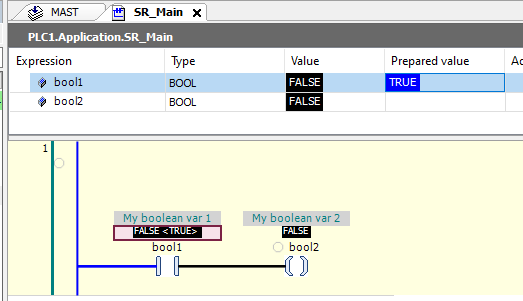

рис.25. 

- [ ] Використовуючи меню `Debug` -> `Write Values` запишіть підготовлені значення в емулятор PLC. Підтвердіть намір записати у вікні що з'явиться.
- [ ] Має змінитися значення обидвох змінних відповідно до програми користувача

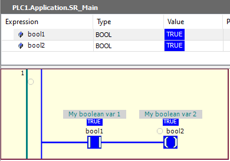

рис.26. 

- [ ] Перейдіть в дерево апаратної структури. Відкрийте у вікні редактору `PLC1`, проаналізуйте зміст вкладки `Communication Settings` (рис.27) 


рис.27.

- [ ] Вийдіть з режиму онлайн `Online` -> `Logout`

### 9. Створення POU на ST та прив'язка до задачі

- [ ] Перейдіть у вікно програмної структури і створіть новий POU з назвою `POU1` типу `Program` на мові `ST`

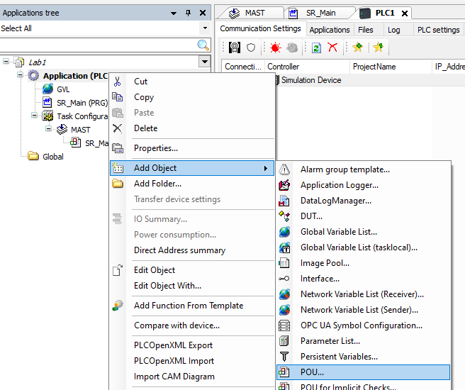 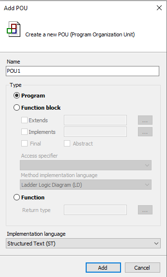

рис.28.

- [ ] У області коду введіть наступний фрагмент програми

```pascal
IF real1<10000 THEN 
	real1 := real1 + 1;
END_IF
```

Враховуючи що змінної `real1` не існує, редактор коду буде підсвічувати помилку/

- [ ] Натисніть по змінній `real1` . Використовуючи помічника створіть змінну `real1` типу `REAL` (рис.29)

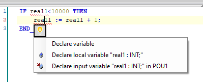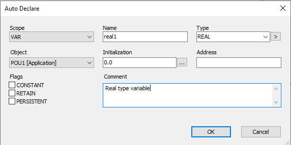

рис.29. 

Після натискання `Ok` змінна з'явиться у  області змінних POU, а помилка має зникнути.

- [ ] Відкрийте GVL. Добавте туди змінну `real1` типу `REAL` (рис.30). 

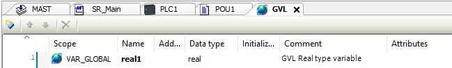

рис.30

- [ ] Модифікуйте програму POU1 добавивши один рядок коду (рис.31)

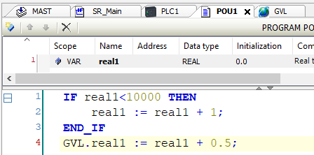

рис.31.

POU та змінні створені, але програма не викликається в жодній задачі. Тому необхідно виклик POU вставити в задачу `MAST`

- [ ] Відкрийте у вікні редактору задачу `MAST` і за допомогою кнопки  `Add Call` добавте `POU1` до переліку POU що викликаються в межах задачі

Після цього програмна структура має мати вигляд як на рис.32

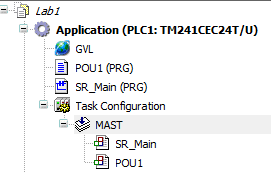

рис.32. 

- [ ] Збережіть проєкт

### 10. Перевірка роботи програми користувача з використанням Watchlist

- [ ] Зробіть побудову коду `Build` -> `Generate Code`
- [ ] Перевірте чи немає помилок побудови
- [ ] Якщо помилок немає зробіть Login

В результаті підключення до емулятора PLC що вже містить застосунок, Machine Expert запропонує зробити певні зміни, щоб забезпечити узгодженість побудованого коду в PLC та середовищі розробки (рис.33). 

- [ ] Виставте режим `Login with online change` , опцію `Update boot application` та натисніть `Ok`. 

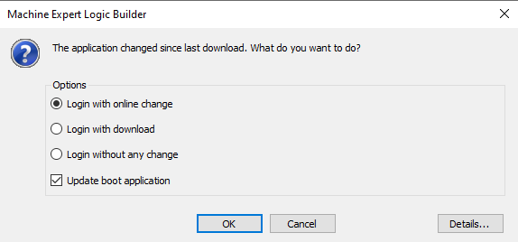

рис.33.

На рис.33 показано вікно, що з’являється під час виконання команди Login, якщо Machine Expert виявляє, що програмна структура проєкту була змінена з моменту останнього завантаження в PLC або середовище емуляції. Воно використовується для вибору способу синхронізації проєкту з середовищем виконання. Це вікно дозволяє усвідомлено вибрати спосіб підключення та уникнути неконтрольованих змін у виконуваній програмі. Є кілька можливих варіантів:

- Варіант `Login with online change` означає, що зміни будуть застосовані без повного перезапуску програми. Цей режим використовується для неструктурних змін і дозволяє продовжити виконання програми з мінімальним втручанням у роботу задач.

- Варіант `Login with download` виконує повне завантаження програми в середовище виконання. У цьому випадку програма зупиняється і запускається знову з новою версією коду. Цей спосіб є універсальним і застосовується тоді, коли онлайн-зміни неможливі або небажані.

- Варіант `Login without any change` встановлює онлайн-з’єднання без синхронізації програми. Він використовується лише для спостереження за станом змінних або аналізу виконання без внесення змін у програму.

Опція `Update boot application` означує, чи буде оновлена завантажувальна версія програми на PLC. Якщо опцію увімкнено, саме ця версія програми запускатиметься автоматично після перезапуску контролера.

- [ ] Відкрийnе `POU1` в редакторі. Зверніть увагу, що редактор знаходиться в режимі анімації.
- [ ] У контекстному меню змінної `real1` виберіть пункт  `Add to Watchlist` (рис.34)

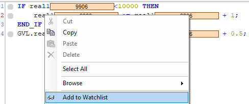

рис.34. 

- [ ] Повторіть те саме для змінної `GVL.real1`
- [ ] Зверніть увагу на вікно `Watch1`

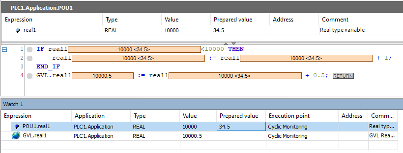

рис.35. 

Watch list — це вікно налагодження в Machine Expert, яке використовується для спостереження за вибраними змінними під час виконання програми в режимі підключення до PLC або в режимі емуляції. У watch list користувач вручну додає змінні або вирази, значення яких потрібно контролювати. На відміну від області змінних у вікні редактора, watch list не прив’язаний до конкретної програми і може одночасно відображати змінні з різних програм та глобального списку змінних GVL. 

На наведеному вікні (рис.35) показано, що watch list відображає поточні значення змінних у полі `Value`, а також дозволяє задавати підготовлені значення у полі `Prepared value`. Це дає змогу змінювати значення змінних під час виконання програми без редагування коду. Додатково watch list показує контекст виконання, зокрема застосунок, тип даних, точку виконання та адресу змінної. Завдяки цьому можна одночасно аналізувати поведінку локальних змінних програми та глобальних змінних GVL і відстежувати їх зміну в реальному часі. 

- [ ] Використовуючи вікно WatchList змініть значення `POU1.real1` в `34.5`
- [ ] Збережіть проєкт

### 11. Підготовка та відправлення звіту

- [ ] На Google диску створіть папку з назвою `MyLabs`, а в ній створіть папку `LabIntro`. Посилання на папку `MyLabs` необхідно переслати викладачу для звітності.
- [ ] У межах папки розмістіть файл проєкту.
- [ ] У межах папки створіть Google документ з копіями екрану та іншими матеріалами, якщо такі потребуються.  

## Автори


Практичне заняття розробив  [Олександр Пупена](https://github.com/pupenasan). 

## Feedback

Якщо Ви хочете залишити коментар у Вас є наступні варіанти:

- [Обговорення у WhatsApp](https://chat.whatsapp.com/BRbPAQrE1s7BwCLtNtMoqN)
- [Обговорення в Телеграм](https://t.me/+GA2smCKs5QU1MWMy)
- [Група у Фейсбуці](https://www.facebook.com/groups/asu.in.ua)

Про проект і можливість допомогти проекту написано [тут](https://asu-in-ua.github.io/atpv/) 