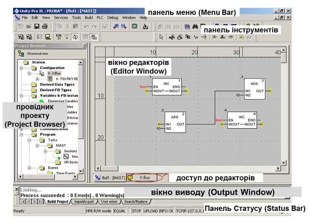
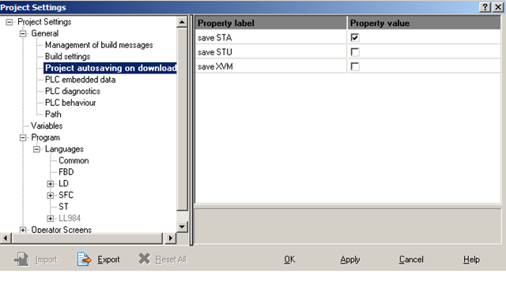

[<- До підрозділу](README.md)

# Середовище розроблення проекту у UnityPRO

## Середовище UNITY PRO

На сьогоднішній день для конфігурування, програмування, налагодження та діагностики промислових контролерів Modicon Quantum, Premium, Atrium та M340 використовується програмне забезпечення UNITY PRO та Control Expert. 

Середовище розробки UNITY PRO разом з середовищем виконання UNITY дає користувачу такі можливості:

1. Створення виконавчого проекту для контролерів Modicon, а саме:

-    використання мультизадачного режиму середовища виконання: одна MAST, одна FAST, декілька EVT, одна AUX (тільки для QUANTUM та PREMIUM);

-    використання 5-ти мов програмування згідно стандарту IEC 61131-3: LD, ST, IL, FBD, SFC;

-    поділу програми користувача на секції (Section), кожна з яких може бути написана на різних мовах програмування IEC 61131-3;

-    використання підпрограм (SR);

-    функціональне структурування проекту користувача;

-    доступу до великої бібліотеки функцій та функціональних блоків (FFB);

-    використання поряд з локалізованими (located, прив’язаними до конкретної комірки пам’яті) нелокалізованих даних (unlocated, не прив’язаних до конкретної комірки пам’яті); 

-    використання змінних похідного типу (DDT): масивів і структур;

-    створення похідних типів змінних користувача (DDT); 

-    створення похідних функціональних блоків користувача (DFB).

2. Управління ПЛК, а саме:

-  завантаження виконавчого проекту в ПЛК;

-  вивантаження/завантаження проектних даних (Upload Information);

-  управління операційним режимом ПЛК: старт, стоп, ініціалізація.

3. Налагодження програми користувача, а саме: 

-    використання програмного імітатора контролера (simulator) з підтримкою більшості функцій UNITY та можливості доступу до нього з інших програмно-технічних засобів по протоколу Modbus/TCP; 

-    анімації змінних безпосередньо в редакторах за допомогою зміни кольору, відображення числових та текстових значень;

-    управління та контролю змінних за допомогою таблиць анімацій (Animation Table) та операторських екранів (Operator Screens);

-    перегляду стану кроків мови SFC;

-    покрокового виконання програми з використанням точок переривання (Break Point) та спостереження (Watch point);

-    можливості зміни програми користувача в режимі виконання контролером програми управління. 

4. Експлуатації та обслуговування, а саме:

-    спостереження за виконанням програми управління за допомогою створення та використання графічних сторінок (Operator Screens) з анімацією технологічного процесу (подібно засобам HMI);

-    використання вбудованих діагностичних засобів для контролю за станом апаратних засобів контролера;  

-    використання вбудованого вікна тривог Alarm Viewer для перегляду стану діагностичного буферу контролера.

5. Автоматичного створення документації по проекту.

6. Імпорту та експорту частин проекту в форматі .XML для можливості його використання в інших програмних засобах.  

Загальний вигляд середовища UNITY PRO показаний на рис.3.1.  

Рис.3.1.Загальний вигляд середовища UNITY PRO (з відкритим проектом).

Практично всі команди доступні через панель інструментів, яка налаштовується аналогічно як у більшості інструментальних програмних засобів. Деякі опції середовища UNITY PRO налаштовується через команду меню "Tools->Options".

Панель статусу (Status Bar) використовується для відображення статусної інформації відносно ПЛК (див. главу 4.2). Вікно виводу (Output Window) використовується для виводу середовищем UNITY PRO різного типу повідомлень (Build, Import/Export, Errors…).  

## Проект UNITY PRO

Конфігурація та програма ПЛК, а також настройки розподіленої периферії зберігається в проекті UNITY PRO. Проект зберігається на комп’ютері у вигляді одного файлу формату *.STU (Unity Pro File). 

Файли формату .STU несумісні в різних версіях (навіть від старшої до молодшої), тому при перенесенні проекту необхідно зберегти його в архівному форматі *.STA (Unity Pro Archived Application File), який сумісний для більшості версій. Зберегти файл архіву можна через команду меню File->Save Archive. 

Проект можна імпортувати в файл XML формату з розширенням *.XEF\. Цей тип файлу в основному використовується для імпорту змінних в проекти програм SCADA/HMI. Команда експорту викликається в "File-> Export Project" 

У середовищі UNITY PRO можна також відкрити проекти у форматах: PL7 (.FEF, .DFB, .DAT) та Concept (.ASC). При цьому UNITY PRO автоматично конвертує файл в проект формату .STU.

Крім конфігураційних даних та програми користувача проект включає:

-     виконавчий проект для ПЛК, який створюється після його компіляції;

-     анімаційні таблиці;

-     операторські екрани.

Навігація по проекту виконується через провідник проекту (Project Browser, див.рис.3.1), який показується/ховається через команду Tools->Project Browser. По замовченню провідник проекту відкривається у режимі структурного перегляду (меню View->Structural View), однак можна відобразити проект у функціональному вигляді (меню View->Functional View), в якому секції, анімаційні таблиці і екрани можна групувати по функціональній приналежності. Тим не менше, незалежно від функціонального призначення, їх фізичне розміщення буде відповідати структурному вигляду. Крім елементів UNITY PRO у провіднику проекту можна створювати власні папки (меню Edit->Add user directory) і добавляти гіперпосилання (меню Edit->Add Hyperlink).  

Проект містить багато настройок, які налаштовуються користувачем в залежності від потреб. Настройки проекту доступні через команду меню "Tools->Project Settings". Наприклад, на рис.3.2 показано вікно настройки опцій автоматичного створення файлів .STA, .STU, .XVM. 

Через контекстне меню проекту (Application Browser->Project) доступні властивості проекту (Properties). Крім назви проекту, у вікні властивостей можна налаштувати та переглянути параметри ідентифікації проекту (версія проекту, версія UNITY PRO в якому проект був створений, дата компіляції), змінити паролі та активувати/деактивувати захист проекту (вкладка Protection). При активації захисту проекту (задається паролем), всі захищені програмні секції в залежності від їх налаштувань будуть доступні тільки для читання, або взагалі не будуть доступні для перегляду.     

 

Рис.3.2.Вікно налаштування проекту UNITY PRO

Теоретичне заняття розробив [Прізвище або нік розробника Імя](https://github.com). 
