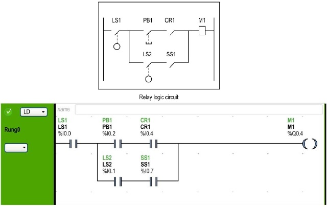
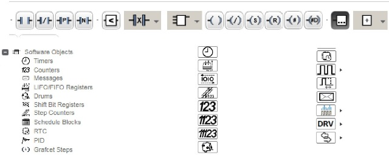
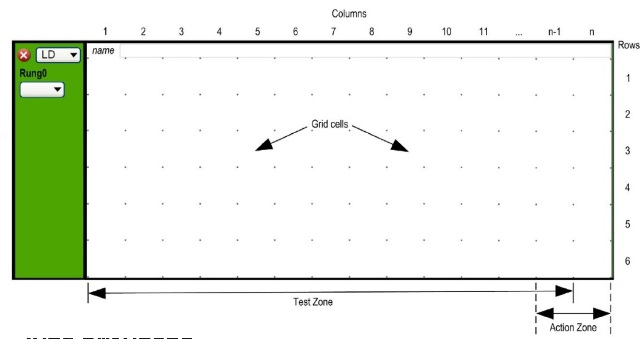
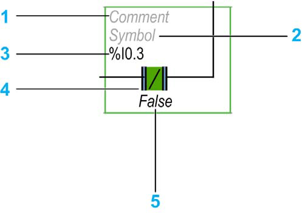
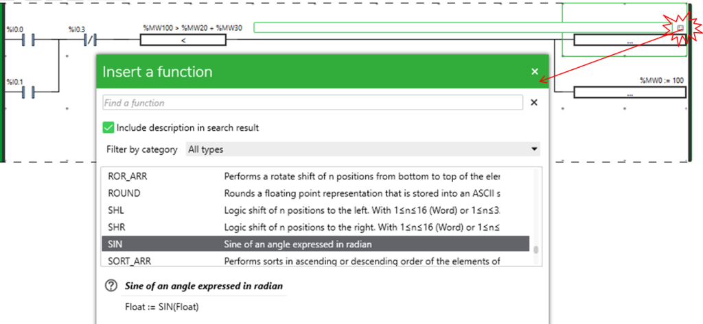

[<- До підрозділу](README.md)

# Мова Ladder Diagram

Мова LD була першою мовою програмування ПЛК і по суті стала вирішальною при їх популярності на ринку.

## Основи LD

Мова **Ladder Diagram (LD)** , дослівно "щаблева діаграма", подібна до релейно–контактних схем (РКС).  Булеві змінні, які вміщують значення дискретних входів чи внутрішніх комірок паняті показані як контакти. Ці контакти умовно замикаються або розмикаються при зміні значенні цих змінних. Набір з контактів починається з лівої живлячої шини (умовна "фаза") і завершуються котушками або іншими діючими елементами, як пов'язані з правою шиною ("землею") таким чином формуючи умовний електричний **ланцюг**. Якщо ланцюг замикається, через котушки проходить умовний "струм", який приводить до зміни значень змінних, які зв'язані з цими котушками. Таким чином змінні діють на контакти (замикають або розмикають), а котушки діють на змінні (включать/октлючають).      

Нижче показані аналогічні схеми в РКС та LD. 



Слід розуміти, що аналогія фізичного РКС та програми на LD є умовною. На LD пишуться програми які виконуються згору-донизу, зліва-направо.    

Програма, написана на LD, складається з ланцюжків, що звуться ***Rung*** (щаблина). Кожен rung є ланцюжком з'єднаних графічних елементів, які розташовуються між двома вертикальними потенціалами. Кожен Rung контролером виконуються послідовно, він не може вміщувати більше одного ланцюжка.


Графічні елементи обмежуються не тільки контактами і котушками, вони можуть представляти різні функції ПЛК, зокрема для:

- логічної обробки дискретних входів (через контакти) та виходів (через котушки); наприклад реагування на кнопки, датчики, керування реле, сигнальними лампами, тощо;
- використання програмних функцій та функціональних блоків контролера (таймери, лічильники тощо);
- проведення математичних, логічних та інших операцій (додавання, поділ, AND, XOR тощо);
- перевірку виконання умови з числовими значеннями (A<B, A=B, зміщення, обертання та ін.);
- керування виконання програмою (умовний перехід за міткою, виклик підпрограми);
- керування оперативною пам'яттю (робота з проміжними змінними); 
- роботи з системою ПЛК;




Елементи в Rung розміщуються в комірках, які організовані в сітку довжиною до 255 рядків по 11 ... 30 стовпчиків. Сітка умовно ділиться на 2 зони: зона перевірки і зона виконання.




**Зона перевірки** - містить умовні елементи, які при спрацюванні "замикають контакти", "пропускаючи струм". Ця зона простягається від лівої шини до передостанньої колонки. У зоні перевірки можна містити контакти, функціональні блоки та блоки порівняння. Елементи можна поєднувати послідовно, паралельно або послідовно-паралельно. 

**Зона виконання** - містить елементи дії, які виконуються тоді, коли через ланцюг "потече струм", зумовлений зоною перевірки.  Зона виконання розміщується у крайній правій позиції rung/ У цій зоні розміщуються котушки та  операційні блоки.

## Дискретні (булеві) операції 

LD створений для заміни релейно-контактних схем, які працюють з булевими операціями через контакти і котушки.

### Контакти

Контакти - це елементи, які замикають або розмикають ланцюг під дією дискретних змінних, які до них прив'язані. Тому для контактів вказують змінні, які на них діють.    

| Зображення контакту     | Призначення                                                  |
| ----------------------- | ------------------------------------------------------------ |
|  | Нормально розімкнутий контакт (НР). Коли змінна =1, контакт замикається. |
|  | Нормально замкнутий контакт (НЗ). Коли змінна =1, контакт розмикається. |
|   | Контакт визначення переднього фронту. Коли змінна переходить з 0 в 1, контакт замикається на один цикл ПЛК. Весь інший час контакт залишається розімкнутим. |
|   | Контакт визначення заднього фронту. Коли змінна переходить з 1 в 0, контакт замикається на один цикл ПЛК. Весь інший час контакт залишається розімкнутим. |

### Котушки (Coils) 

Котушки - це елементи, які приводяться в дію при "проходженні через них струму". Під проходженням струму тут розуміється замкнення ланцюга шляхом замикання "умовних контактів". Котушкам назначають дискретні змінні, якими вони керують.  Котушки можуть бути розміщені тільки в зоні дій і займають одну комірку. 

| Зображення коиушки     | Призначення                                                  |
| ---------------------- | ------------------------------------------------------------ |
|  | Пряма котушка. При проходженні струму назначеній змінній буде присвоєно 1, у іншому випадку - 0. |
|  | Інверсна котушка. При проходженні струму назначеній змінній буде присвоєно 0, у іншому випадку - 1. |
|  | Котушка встановлення ("з защіпкою"). Працює тільки на встановлення назначеної змінної в 1. У іншому випадку не виконує ніяких дій. |
|  | Котушка скидання. Працює тільки на скидання назначеної змінної в 0. У іншому випадку не виконує ніяких дій. |

### Назначення змінних контактам та котушкам 

При вставки елементу в комірку, відображається додаткова інформація про об'єкт, який буде асоційовано з цим елементом: 



| Позначення | призначення          | Опис                                                         |
| ---------- | -------------------- | ------------------------------------------------------------ |
| 1          | Коментар користувача | Містить користувацький коментар                              |
| 2          | Символ               | Містить ім'я символу з яким асоціюється даний об'єкт         |
| 3          | Адреса               | Містить адресу з яким асоціюється даний об'єкт               |
| 4          | Графічний елемент    | Відображення графічного елементу                             |
| 5          | Плинне значення      | У режимі онлайн (підключення до ПЛК і програма у виконанні), відображає плинне значення. |

### Приклади роботи контактів і котушок 

На наступному рисунку показаний приклад роботи НР контакту з прямою котушкою, а в таблиці залежність вихідної змінної, яка назначена котушці від вхідної, яка назначена контакту. Для представлення в таблиці вважається що перевірка почалася на першому циклі ПЛК. 

   

| Цикл | %I0.0 | %Q0.0 | Примітка                                                    |
| ---- | ----- | ----- | ----------------------------------------------------------- |
| 1    | 0     | 0     | ініціалізація ПЛК                                           |
| 2    | 1     | 1     | Значення `1`в змінній `%I0.1` - це умова замикання контакту |
| 3    | 0     | 0     |                                                             |

Наступний приклад з НЗ контактом.


| Цикл | %I0.1 | %Q0.1 | Примітка                                                     |
| ---- | ----- | ----- | ------------------------------------------------------------ |
| 1    | 0     | 1     | ініціалізація ПЛК                                            |
| 2    | 1     | 0     | Значення `1`в змінній `%I0.1` - це умова розмикання контакту |
| 3    | 0     | 1     |                                                              |

Наступний приклад з інверсною котушкою.


| Цикл | %I0.2 | %Q0.2 | Примітка                                                     |
| ---- | ----- | ----- | ------------------------------------------------------------ |
| 1    | 0     | 1     | ініціалізація ПЛК                                            |
| 2    | 1     | 0     | При замкнення контакту `%I0.2` йде "струм", який діє на котушку, яка записує `0` в `%Q0.2` |
| 3    | 0     | 1     | котушка повертається нормальний стан і  `1` в `%Q0.2`        |

На наступному прикладі використовуються котушки встановлення та скидання, які діють на ту саму вихідну змінну але за різних умов. У даному прикладі вважається, що в програмі немає більше котушок, які впливають на `%Q0.3`, окрім тих, що показані на рисунку. Слід пригадати, що на реальний дискретний вихід ПЛК йде саме останнє значення, тобто те, яке було в кінці задачі. 


| Цикл | %I0.3 | %I0.4 | %Q0.3 | Примітка                                                     |
| ---- | ----- | ----- | ----- | ------------------------------------------------------------ |
| 1    | 0     | 0     | 0     | ініціалізація ПЛК                                            |
| 2    | 1     | 0     | 1     | встановлюється в  `1`                                        |
| 3    | 0     | 0     | 1     | `%Q0.3` залишається в `1`, бо на нього немає ніякої дії      |
| 4    | 0     | 1     | 0     | скидається в  `0`                                            |
| 5    | 0     | 0     | 0     |                                                              |
| 6    | 1     | 1     | 0     | спочатку в `Rung 3` встановлюється в  `1`, потім в `Rung4` скидається в `0` ; оскільки `Rung4` йде останнім (нижче по програмі) саме це значення `%Q0.3` буде відправлено на дискретний вихід `0.3` ПЛК |

Примітка. %Q0.3 показаний в кінці циклу.

## Послідовне та паралельне з'єднання елементів

Логіка LD будується на понятті умовних струмів, які протікають через замкнутий ланцюг з лівої шини живлення до правої шини "нуля". Тобто, якщо ланцюг розімкнутий хоча б в одній точці, умовний струм не потече, а отже котушки (та інші елементи керування) не спрацюють і повернуться у свій нормальний стан.  Тому якщо необхідно побудувати умову, в якій приймають участь кілька змінних, контакти з'єднують послідовно, паралельно або комбінуючи послідовні та паралельні з'єднання.   

### Послідовне з'єднання елементів

З точки зору булевої логіки, послідовне з'єднання контактів це реалізація функції логічного `ТА` (`AND`). Тобто в даному випадку буде виконуватися наступна дія

```
%Q0.0 := %I0.0 AND NOT %I0.1
```


| Цикл | %I0.0 | %I0.1 | %Q0.0 | Примітка          |
| ---- | ----- | ----- | ----- | ----------------- |
| 1    | 0     | 0     | 0     | ініціалізація ПЛК |
| 2    | 1     | 0     | 1     | "струм тече"      |
| 3    | 0     | 1     | 0     |                   |
| 4    | 1     | 1     | 0     |                   |

### Паралельне з'єднання елементів

З точки зору булевої логіки, паралельне з'єднання контактів це реалізація функції логічного `АБО` (`OR`). Тобто в даному випадку буде виконуватися наступна дія

```
%Q0.0 := %I0.0 OR %I0.1
```


| Цикл | %I0.0 | %I0.1 | %Q0.0 | Примітка                             |
| ---- | ----- | ----- | ----- | ------------------------------------ |
| 1    | 0     | 0     | 0     | ініціалізація ПЛК                    |
| 2    | 1     | 0     | 1     | "струм тече" через контакт з `%I0.0` |
| 3    | 0     | 1     | 1     | "струм тече" через контакт з `%I0.1` |
| 4    | 1     | 1     | 0     | "струм тече" через обидва контакти   |

### Приклад послідовно-паралельних з'єднань. 

Комбінуючи послідовне та паралельне з'єднання контактів можна будувати складні логічні операції. У наведеному нижче прикладі буде виконуватися наступна дія:

```
%Q0.0 := (%I0.0 OR %I0.1) AND NOT %I0.3
```


| Цикл | %I0.0 | %I0.1 | %I0.2 | %Q0.0 | Примітка          |
| ---- | ----- | ----- | ----- | ----- | ----------------- |
| 1    | 0     | 0     | 0     | 0     | ініціалізація ПЛК |
| 2    | 0     | 0     | 1     | 0     |                   |
| 3    | 0     | 1     | 0     | 1     |                   |
| 4    | 0     | 1     | 1     | 0     |                   |
| 5    | 1     | 0     | 0     | 1     |                   |
| 6    | 1     | 0     | 1     | 0     |                   |
| 7    | 1     | 1     | 0     | 1     |                   |
| 8    | 1     | 1     | 1     | 0     |                   |

### Виконання кількох дій

Якщо необхідно за однієї умови робити кілька дій, котушки або інші елементи керування об'єднують паралельно. 


## Операції з числовими даними

Для роботи з дискретними змінними використовуються котушки і контакти. При необхідності перевірки значень аналогових (числових) змінних використовуються компаратори. При необхідності  зміни значень числових змінних, виклик функцій чи виконання обчислювальних операцій, використовуються операційні блоки.  

### Блок порівняння 

Блоки порівняння (Comparison Block, компаратори) - це умовні контакти які замикаються під дією умови, яка записується як вираз порівняння IL (Instruction List). Умова завжди дає булевий результат (0 або 1). Вважається, що якщо умова справджується, контакт замикається. Блоки порівняння розміщуються в тестовій зоні сітки, як і контакти, але займають кілька комірок, а не одну. У якості умови не можна використовувати вирази з булевими змінними.  

| Graphic Element        | Name            | Function                                                     |
| ---------------------- | --------------- | ------------------------------------------------------------ |
|  | Блок порівняння | Використовуйте графічний символ блоку порівняння, щоб вставити порівняльний вираз у вигляді IL у LD. Вираз порівняння порівнює 2 операнди; вихід встановлюється в 1, коли результат є істиною, і в 0 - у іншому випадку. |

Блоки порівняння можна сприймати як НР контакти, для яких задається умова у вигляді виразу, а не булевої змінної. Блоки так само як і контакти можна об'єднувати послідовно, або/та паралельно. У наступному прикладі блок порівняння "пропустить через себе струм", якщо справдиться умова:

```
%MW100 > %MW20 + %MW30
```

  

### Операційні блоки  

Операційні блоки виконують інструкції на мові IL, наприклад присвоювання арифметичній операції або виклик функції. Операційний блок може бути розміщено в зоні дії і займає 2 колонки на 2 рядки.

| Graphic Element        | Name             | Operator                        |
| ---------------------- | ---------------- | ------------------------------- |
|  | Операційний блок | будь-які доступні інструкції IL |

При необхідності вставлення функції можна скористатися помічником.



## Функціональні блоки

Функціональні блоки дають можливість використовувати вбудовані програмні та апаратні функції, які реалізовані через окремі програмні елементи. Про функціональні блоки детально описано в [наступній лекції](4_fb.md).  

| Graphic Element        | Name                                 | Function                                                     |
| ---------------------- | ------------------------------------ | ------------------------------------------------------------ |
|  | Timers, counters, registers, та інші | Кожен з функціональних блоків використовує входи та виходи, що дозволяють посилатися на інші графічні елементи. ПРИМІТКА: Виходи функціональних блоків не можуть бути з'єднані один з одним (вертикальні об'єднання). |

## Контакти XOR 

Контакти `XOR` виконують взаємовиключне `АБО` між назначеним контактом та результатом ліворуч від нього.

| Graphic Element        | Name             | Operator              |
| ---------------------- | ---------------- | --------------------- |
|  | XOR instructions | XOR, XORN, XORR, XORF |

Наприклад XOR "формує після себе струм" якщо назначена йому змінна протилежна результату ліворуч.


## Інші елементи Ladder 

Інші елементи Ladder згруповані в меню . 

| Graphic Element        | Name                                | Function                                                     |
| ---------------------- | ----------------------------------- | ------------------------------------------------------------ |
|  | Rising edge                         | Оцінює передній фронт виразу ліворуч від нього. Якщо ланцюг ліворуч замкнувся - на один цикл "пропускає струм" праворуч. |
|  | Falling edge                        | Оцінює задній фронт виразу ліворуч від нього. Якщо ланцюг ліворуч розімкнувся - на один цикл "генерує струм" праворуч. |
|  | Logical NOT                         | Передає праворуч інвертоване значення.  Якщо ліворуч ланцюг розімкнутий, "генерує струм", якщо замкнутий - розмикає ланцюг. |
|  | OPEN                                | На початку rung.  У межах rung: створює розрив в ланцюгу Ladder  rung  незалежно від результатів останньої логічної операції. |
|  | SHORT                               | На початку rung. У межах rung: Дозволяє замкнути ланцюг rung незалежно від результатів останньої логічної операції. |
|  | Stop program                        | Означує кінець програми.                                     |
|  | Conditional stop program            | Означує кінець програми, який залежить від спрацювання умови в зоні перевірки. |
|  | Jump or subroutine call             | Переходить за вказаною міткою в Rung.                        |
|  | Conditional jump or subroutine call | Переходить за вказаною міткою в Rung за умови спрацювання.   |
|  | Conditional elements                | Див лекцію по ST.                                            |
|  | Loop elements                       | Див лекцію по ST.                                            |

Інструкції OPEN та SHORT забезпечують зручний метод для налагодження та усунення несправностей програм Ladder. Ці спеціальні інструкції змінюють логіку rung , закорочуючи або розмикаючи його.

Елементи END/JUMP дозволяють переміщуватись по програмі користувача.

Також в LD використовуються спеціальні контакти для мови Grafcet.  


Розробив лекцію - Олександр Пупена. [АКТСУ НУХТ](http://www.iasu-nuft.pp.ua)
