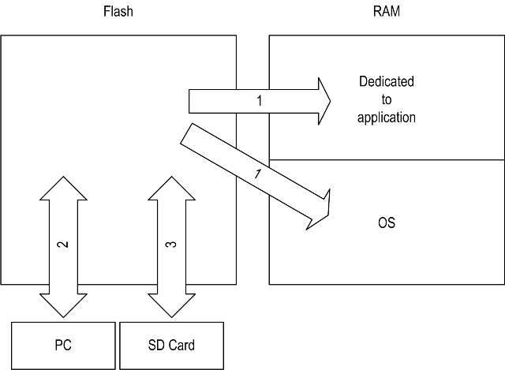
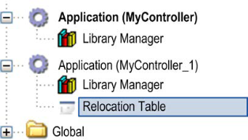
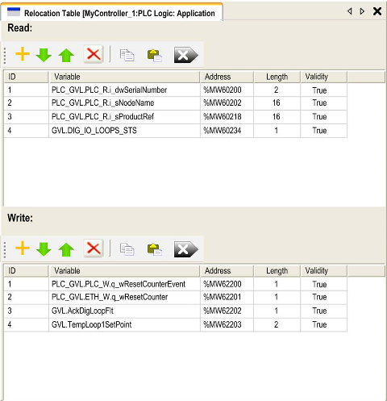

[<- До підрозділу](README.md)	[PLC MachineStruxure](../ecostruxuremachineexpert.md)	[Коментувати](#feedback)

# Організація пам'яті в M241: теоретична частина

## 1. Організація пам'яті в M241

Пам’ять контролера M241 складається з двох типів фізичної пам’яті:

- Енергонезалежна пам’ять (non-volatile memory) містить файли (застосунок, файли конфігурації тощо).
- Оперативна пам’ять (RAM) використовується для виконання застосунку.

Передавання файлів у пам’яті.

рис.1. 

Таблиця 1.

| Позиція | Стан контролера                | Подія передавання файлів                                     | З’єднання                           | Опис                                                         |
| ------- | ------------------------------ | ------------------------------------------------------------ | ----------------------------------- | ------------------------------------------------------------ |
| 1       | —                              | Ініціюється автоматично при вмиканні живлення та перезавантаженні | Внутрішнє                           | Файли передаються з енергонезалежної пам’яті до RAM. Вміст RAM перезаписується. |
| 2       | Усі стани, крім INVALID_OS (1) | Ініціюється користувачем                                     | Ethernet або USB-порт програмування | Файли можуть передаватися через: Web-сервер; FTP-сервер; Controller Assistant; EcoStruxure Machine Expert |
| 3       | Усі стани                      | Ініціюється автоматично скриптом (передавання даних) або під час циклу живлення (клонування) при вставленій SD-карті | SD-карта                            | Завантаження/вивантаження за допомогою SD-карти. Якщо контролер перебуває в стані INVALID_OS, єдина доступна пам’ять — це SD-карта і лише для оновлення прошивки. |

Модифікація файлів в енергонезалежній пам’яті не впливає на виконуваний застосунок. Будь-які зміни у файлах енергонезалежної пам’яті враховуються під час наступного перезавантаження.

### Організація пам’яті RAM

Обсяг RAM становить 64 Мбайт.

RAM складається з двох областей: пам’ять операційної системи (OS) та пам’ять, що виділена для застосунку.  Пам’ять, що виділена для застосунку у свою чергу сладається з двох областей:

- системна область, розміром 192 Кбайт, яка включає
  - Адреси системної області, доступні для відображення: %MW0…%MW59999
  - Системні та діагностичні змінні (%MW60000…%MW60199). Доступ лише через запити Modbus. Тільки читання.
  - Динамічна область пам’яті: таблиця релокації (читання) (%MW60200…%MW61999). Доступ лише через запити Modbus. Тільки читання.
  - Системні та діагностичні змінні (%MW62000…%MW62199). Доступ лише через запити Modbus. Читання або запис.
  - Динамічна область пам’яті: таблиця релокації (запис) (%MW62200…%MW63999). Доступ лише через запити Modbus. Читання або запис.
  - %MW64000…%MW65535 — Зарезервовано
  - Дані Retain і Persistent (64 Кбайт)
-  область користувача (8 Мбайт): Символи, Змінні, Застосунок, Бібліотеки

У цій таблиці описано адресацію пам’яті для таких розмірів адрес: Double Word (%MD), Word (%MW), Byte (%MB) та Bit (%MX).

Таблиця 2. Перекривання адрес для M241 

| Long words  (64-bit) | Double Words | Words | Bytes | Bits    | …    | Bits    |
| ------------------------- | ------------ | ----- | ----- | ------- | ---- | ------- |
| %ML0                      | %MD0         | %MW0  | %MB0  | %MX0.7  | …    | %MX0.0  |
|                           |              |       | %MB1  | %MX1.7  | …    | %MX1.0  |
|                           |              | %MW1  | %MB2  | %MX2.7  | …    | %MX2.0  |
|                           |              |       | %MB3  | %MX3.7  | …    | %MX3.0  |
|                           | %MD1         | %MW2  | %MB4  | %MX4.7  | …    | %MX4.0  |
|                           |              |       | %MB5  | %MX5.7  | …    | %MX5.0  |
|                           |              | %MW3  | %MB6  | %MX6.7  | …    | %MX6.0  |
|                           |              |       | %MB7  | %MX7.7  | …    | %MX7.0  |
| %ML1                      | %MD2         | %MW4  | %MB8  | %MX8.7  | …    | %MX8.0  |
|                           |              |       | %MB9  | %MX9.7  | …    | %MX9.0  |
|                           |              | %MW5  | %MB10 | %MX10.7 | …    | %MX10.0 |
|                           |              |       | %MB11 | %MX11.7 | …    | %MX11.0 |
|                           | %MD3         | %MW6  | %MB12 | %MX12.7 | …    | %MX12.0 |
|                           |              |       | %MB13 | %MX13.7 | …    | %MX13.0 |
|                           |              | %MW7  | %MB14 | %MX14.7 | …    | %MX14.0 |
|                           |              |       | %MB15 | %MX15.7 | …    | %MX15.0 |
| …                         | …            | …     | …     | …       | …    | …       |

### Організація енергонезалежної пам’яті

Енергонезалежна пам’ять містить файлову систему, що використовується контролером.

Контролер Modicon M241 Logic Controller підтримує такі типи файлів:

| Тип                                             | Опис                                                         |
| ----------------------------------------------- | ------------------------------------------------------------ |
| Завантажувальний застосунок (Boot application)  | Файл зберігається в енергонезалежній пам’яті та містить скомпільований бінарний код виконуваного застосунку. Під час кожного перезавантаження контролера виконуваний застосунок витягується із завантажувального застосунку та копіюється в RAM.  Створення завантажувального застосунку є опціональним у Machine Expert і означується властивостями застосунку. За замовчуванням boot application створюється під час завантаження. Під час завантаження застосунку з Machine Expert у контролер до RAM передається лише бінарний виконуваний файл. |
| Джерельний файл застосунку (Application source) | Джерельний файл, який може бути завантажений з енергонезалежної пам’яті на ПК, якщо він відсутній на ПК.  Machine Expert не підтримує вивантаження виконуваного застосунку або boot application на ПК для модифікації. Зміни програми виконуються лише у джерельному файлі застосунку. Під час завантаження застосунку можна зберегти джерельний файл в енергонезалежній пам’яті. |
| Післяконфігурація (Post configuration)          | Файл, що містить параметри Ethernet, послідовних ліній та міжмережевого екрана. Параметри, зазначені у файлі, заміщують параметри виконуваного застосунку під час кожного перезавантаження. |
| Журналювання даних (Data logging)               | Файли, у яких контролер реєструє події відповідно до налаштувань застосунку. |
| HTML-сторінка (HTML page)                       | HTML-сторінки, що відображаються вебсервером для сайту, вбудованого в контролер. |
| Операційна система (Operating System, OS)       | Прошивка контролера, яка може бути записана в енергонезалежну пам’ять. Файл прошивки застосовується під час наступного перезавантаження контролера. |
| Змінна Retain                                   | Реманентні змінні.                                           |
| Змінна Retain-Persistent                        | Реманентні змінні з постійним збереженням.                   |

Boot application — це файл у енергонезалежній пам’яті, який містить скомпільований виконуваний код застосунку. Під час кожного перезапуску контролера цей код копіюється з boot application у RAM і запускається.

### Організація файлів в енергонезалежній пам’яті

| Диск/каталог    | Файл                       | Вміст                                                        | Тип даних для завантаження/вивантаження | Примітка                                        |
| --------------- | -------------------------- | ------------------------------------------------------------ | --------------------------------------- | ----------------------------------------------- |
| `/sys/OS`       | `M241M251FW1v_XX.YY`       | Прошивка ядра 1                                              | Firmware                                | XX.YY — версія прошивки                         |
| `/sys/OS`       | `M241M251FW2v_XX.YY`       | Прошивка ядра 2                                              | Firmware                                | XX.YY — версія прошивки                         |
| `/sys/OS`       | `Version.ini`              | Контрольний файл версії прошивки                             | –                                       |                                                 |
| `/sys/Web`      | `Index.htm`                | HTML-сторінки, що обслуговуються вебсервером (вбудований сайт контролера) | Website                                 |                                                 |
| `/sys/Web`      | `Conf.htm`                 | Конфігураційна HTML-сторінка                                 | –                                       |                                                 |
| `/usr/App`      | `Application.app`          | Завантажувальний застосунок (Boot application)               | Application                             |                                                 |
| `/usr/App`      | `Application.crc`          | Контрольна сума застосунку                                   | –                                       |                                                 |
| `/usr/App`      | `Application.map`          | Файл відображення застосунку                                 | –                                       |                                                 |
| `/usr/App`      | `Archive.prj`              | Джерельний файл застосунку                                   | –                                       | якщо наявний                                    |
| `/usr/App`      | `settings.conf`            | Конфігурація OPC UA                                          | Configuration                           | якщо налаштовано OPC UA                         |
| `/usr/App`      | `OpcUaSymbolConf.map`      | Конфігурація символів OPC UA                                 | Configuration                           | якщо налаштовано OPC UA                         |
| `/usr/Cfg`      | `Machine.cfg`              | Файл післяконфігурації                                       | Configuration                           | якщо наявний                                    |
| `/usr/Cfg`      | `CodesysLateConf.cfg`      | Назва застосунку для запуску; таблиця маршрутизації (основна/підмережа) | Configuration                           | якщо наявний                                    |
| `/usr/Log`      | `UserDefinedLogName_1.log` | Файли журналювання даних, створені функціями Data Logging    | Log file                                |                                                 |
| `/usr/Log`      | `UserDefinedLogName_n.log` | Файли журналювання даних                                     | –                                       |                                                 |
| `/usr/Rcp`      | –                          | Основний каталог для рецептів                                | –                                       |                                                 |
| `/usr/Syslog`   | `crashC1.txt`              | Запис виявлених системних помилок                            | Log file                                | якщо наявний                                    |
| `/usr/Syslog`   | `crashC2.txt`              | Запис виявлених системних помилок                            | Log file                                | якщо наявний                                    |
| `/usr/Syslog`   | `crashBoot.txt`            | Запис помилок під час запуску                                | Log file                                | якщо наявний                                    |
| `/usr/Syslog`   | `PlcLog.txt`               | Журнал системних подій (доступний також у вкладці Log в Machine Expert) | –                                       | якщо наявний                                    |
| `/usr/Syslog`   | `FwLog.txt`                | Журнал подій прошивки                                        | –                                       |                                                 |
| `/usr/Fdr/FDRS` | `Device1.prm`              | Параметричні файли клієнта FDR                               | FDR                                     | лише для TM241CE, каталог Fdr/FDRS є прихованим |
| `/data`         | –                          | Дані Retain і Persistent                                     | –                                       |                                                 |
| `/sd0`          | –                          | SD-карта (знімний носій)                                     | –                                       |                                                 |
| `/sd0`          |                            | Користувацькі файли                                          | –                                       |                                                 |

Коли система, програма або певна дія користувача створює файли визначених типів, контролер M241 перевіряє розширення файлу та автоматично переміщує його до відповідної папки в енергонезалежній пам’яті.

У наведеній нижче таблиці перелічено типи файлів, які переміщуються таким чином, а також цільові каталоги в енергонезалежній пам’яті.

| Розширення файлів                         | Каталог в енергонезалежній пам’яті |
| ----------------------------------------- | ---------------------------------- |
| `*.app, *.ap, *.err, *.crc, *.frc, *.prj` | `/usr/App`                         |
| `*.cfg, *.cf_`                            | `/usr/Cfg`                         |
| `*.log`                                   | `/usr/Log`                         |
| `*.rcp, *.rsi`                            | `/usr/Rcp`                         |

#### Резервне копіювання файлів журналювання даних

Файли журналювання даних можуть збільшуватися до розмірів, що перевищують доступний обсяг файлової системи. Тому слід передбачити механізм періодичного архівування журналів на SD-карту.

Можна розділити журналювання на кілька файлів, наприклад LogMonth1, LogMonth2, і за допомогою команди ExecuteScript (див. Modicon M241 Logic Controller, System Functions and Variables, PLCSystem Library Guide) скопіювати перший файл на SD-карту. Після цього його можна видалити з внутрішньої файлової системи, поки другий файл продовжує накопичувати дані.

Якщо дозволити файлу журналювання безконтрольно зростати і перевищити допустимий розмір, можливе втрачання даних.

#### Таблиця релокації

Таблиця релокації дозволяє організувати дані для оптимізації обміну між контролером та іншим обладнанням шляхом групування розрізнених даних у суцільну таблицю розміщених регістрів, доступну через Modbus.

Таблиця релокації розглядається як окремий об’єкт. До контролера може бути доданий лише один об’єкт таблиці релокації.

Опис таблиці релокації
У наведеній нижче таблиці описано структуру таблиці релокації:

| Регістр     | Опис                                                     |
| ----------- | -------------------------------------------------------- |
| 60200…61999 | Динамічна область пам’яті: таблиця релокації для читання |
| 62200…63999 | Динамічна область пам’яті: таблиця релокації для запису  |

Для отримання додаткової інформації зверніться до документа Modicon M241 Logic Controller PLCSystem – Library Guide.

Додавання таблиці релокації

У наведеній нижче таблиці описано порядок додавання таблиці релокації до вашого проєкту:

| Крок | Дія                                                          |
| ---- | ------------------------------------------------------------ |
| 1    | У вкладці Applications tree виберіть вузол Application.      |
| 2    | Натисніть праву кнопку миші.                                 |
| 3    | Виберіть Objects > Relocation Table…Результат: відобразиться вікно Add Relocation Table. |
| 4    | Натисніть Add.Результат: створюється та ініціалізується нова таблиця релокації.Примітка: оскільки таблиця релокації є унікальною для контролера, її ім’я Relocation Table і воно не може бути змінене. |

рис.2.

На цьому рисунку показано редактор таблиці релокації:

рис.3.

## Джерела

1. Modicon M241 Logic Controller User Guide, 04/2021, Schneider Electric 
2. EcoStruxure Machine Expert Software User Guide, 09/2021, Schneider Electric

## Автори

Теоретичне заняття розробив [Олександр Пупена](https://github.com/pupenasan). 

## Feedback

Якщо Ви хочете залишити коментар у Вас є наступні варіанти:

- [Обговорення у WhatsApp](https://chat.whatsapp.com/BRbPAQrE1s7BwCLtNtMoqN)
- [Обговорення в Телеграм](https://t.me/+GA2smCKs5QU1MWMy)
- [Група у Фейсбуці](https://www.facebook.com/groups/asu.in.ua)

Про проект і можливість допомогти проекту написано [тут](https://asu-in-ua.github.io/atpv/)
