[<- До підрозділу](README.md)	[PLC MachineStruxure](../ecostruxuremachineexpert.md)	[Коментувати](#feedback)

# Функціонування, операційні режими, задачі ПЛК в Machine Expert : теоретична частина 

У даній лекції розглядаються тільки функції, підтримувані M241. 

## Функціонування PLC з однією задачою

Коли створюється проєкт для M241 за замовченням, його програмна структура має вигляд як на рис.1. 

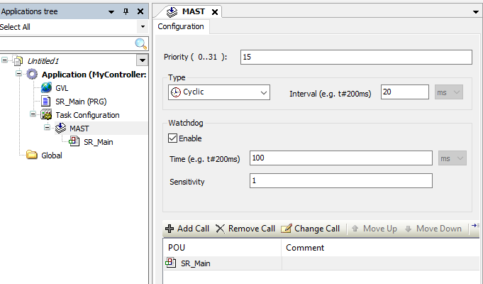

рис.1. Програмна структура проєкту за замовченням 

Як видно з рис.1 у розділі `Task Configuration` є одна задача MAST, до якої прив'язаний один POU з іменем `SR_Main`. Сама задача налаштована як циклічна (`Cyclic`), з інтервалом 20 мс. Також зазначений час сторожового таймеру (`Watchdog`) рівний 100 мс, з чутливістю (`Sensivity`) рівною 1. У задачі є пріоритет (`Prority`) рівний 15. У цьому пункті розберемо як працює контролер з однією задачею, взявши за основу ці налаштування.    

На рис.2 показано типовий цикл виконання прикладної програми в контролері Modicon M241 в режимі виконання, в якому функціонує тільки одна задача - MAST. 

- Поки жодна із задач (наразі вона одна) не виконується, операційна система ПЛК займається системною обробкою, діагностикою, комунікаціями з іншими підсистемами, тощо. 
- Коли виникає умова виконання задачі MAST,  процесор починає цикл (прохід) задачі. MAST задача є циклічною, тому умовою запуску є настання нового періоду, наприклад наступні 20 мс після попереднього старту, як це задано в параметрах за замовченням.    
- На початку задачі контролер зчитує стани всіх локальних і розподілених входів, які прив'язані до неї, та формує внутрішній образ входів, з яким надалі працюють POU як з вхідними змінними.
- Після цього послідовно виконуються програмні організаційні блоки (POU), які прив'язані до даної задачі, у означеному в ній порядку. При створенні нового проєкту за замовченням, створюється тільки `SR_Main`, однак для універсальності на рис.2 показані ще два POU, хоча `SR_Main` можна перейменувати, ім'я POU не має значення (але задачу `MAST` не можна переіменовувати). POU можуть викликати у свою чергу інші POU, аж поки уся означена програмою послідовність не буде виконана. Програми в POU на основі вхідних змінних та логіки змінюють вихідні змінні, які формують образ виходу процесу.    
- Після завершення користувацької логіки задачі MAST значення з образу виходів копіюються на фізичні вихідні канали, які прив'язані до задачі MAST. 
- Весь час, який залишається до спрацювання умови запуску наступного прогону MAST, тобто проходження часу від попереднього запуску до зазначеного періоду 20 мс, контролер займається внутрішньою обробкою. 

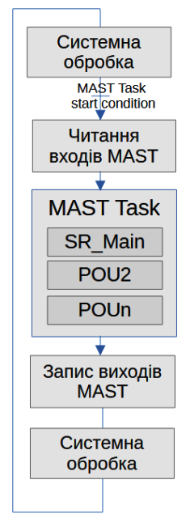

рис.2. Спрощена діаграма функціонування ПЛК в однозадачному режимі

У випадку, якщо час задачі MAST буде виконуватися більше ніж 20 мс контролер перейде в аварійний зупин - HALT.  

Це дуже спрощена картина, яка дає тільки початкові представлення роботи PLC. Так, наприклад, в реальному контролері Modicon M241 виконання системних сервісів не зводиться до окремих послідовних етапів, а частково відбувається асинхронно, паралельно з виконанням задачі. Однак загальне представлення цей рисунок дає.  

У реальних проєктах кількість задач як правило більше ніж одна. Це зумовлено як необхідністю миттєвої обробки програми за певною подією, або виділення деяких задач, які мають частіше обробляти входи та оновлювати виходи для швидшої обробки процесів. Ці задачі мають різний пріоритет, за рахунок чого, умова запуску більш пріоритетної задачі, витісняє попередньо виконувану задачу (ставить її на очікування) і виконує подібну послідовність (читання входів, виконання програми, запис виходів) після чого повертає керування задачі, яка була перервана. У такому застосунку, який має кілька задач, дуже важливо щоб загальне завантаження не перевищило можливості процесора, інакше одна з задач перевищить сторожовий таймер або спрацює системний таймер. Про це і про інші особливості розглядається в інших частинах цієї лекції.

**Не можна видаляти або змінювати ім’я задачі MAST, інакше Machine Expert виявить помилку під час спроби зібрати застосунок, його не можна буде записати в контролер.**

## Задачі

### Загальні властивості задач

Задачі означуються як ресурси в програмній архітектурі (Applications tree) у вузлі  `Task Configuration` відповідного застосунку. На рис.1 показана тільки одна задача, однак кількість їх може бути більшою. 

Задача може викликати одну або кілька програм POU, яка доступна в самому застосунку або у вузлі Global. Детальніше про це описано в [Програмні сутності POU в в Machine Expert](../pou/teormachexpert.md).  В онлайн-режимі редактор Task Configuration надає вікно моніторингу, яке відображає інформацію про цикли, часи циклів та стан задач. Вікно моніторингу також дозволяє виконувати динамічний аналіз POU, що керуються задачею. Воно надає інформацію про часи циклів, кількість викликів функціональних блоків та невикористані рядки коду.

Для кожної із задач означують тип (`Type`) який по суті означує, умову при якій запускається новий цикл (прогін) задачі. Вище ми розглянули приклад циклічної задачі `MAST`, умова якої є настання наступного періоду виклику задачі. Для M241 доступні і інші типи задач, які зведені в таблицю 1.

Таблиця 1. Типи задач та їх особливості в M241.

| Назва          | Призначення                                                  | Максимальна кількість |
| -------------- | ------------------------------------------------------------ | --------------------- |
| Cyclic         | Циклічна задача, фіксована періодичність запуску             | 5                     |
| Freewheeling   | Задача вільного виконання, запускається після завершення попереднього прогону | 1                     |
| Event          | Запускається при передньому фронті (момент зміни з 0 в 1) зміни вказаної булевої змінної | 8                     |
| External event | Запускається при спрацюванні апаратної події (зміна дискретного входу, досягнення уставки лічильного входу, тощо) | 16                    |
| Всі задачі     |                                                              | 19                    |

При створенні нової задачі задається тип задачі (`Type`), та інші налаштування. Деякі з налаштувань характерні для всіх задач, а деякі стосуються тільки певного типу задачі. Спільні для всіх задач наступні налаштування (див. рис.3).

- `Priority` -  налаштування пріоритету кожної задачі числом від `0` до `31` (`0` – найвищий пріоритет, `31` – найнижчий), задача з вищим пріоритетом перериває задачу з нижчим пріоритетом (див. нижче ). 
- `Watchdog` та `Sensitivity` - налаштування сторожового таймеру (детальніше описано нижче)
- `POUs` - cписок POU, якими керує задача, визначається у вікні конфігурації задачі. Можна створити будь-яку кількість POU. Застосунок з кількома невеликими POU, на відміну від одного великого POU, може покращити час оновлення змінних в онлайн-режимі.

### Задача Cyclic 

Циклічні задачі (Cyclic) викликаються з фіксованим часом циклу, який користувач вказує параметром `Interval` (рис.3). 

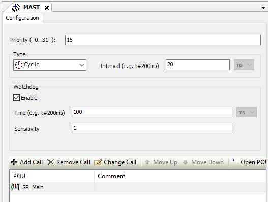

рис.3. Налаштування задачі типу Cyclic 

Послідовність виконання кроків циклічної задачі продемонстрована вище на прикладі задачі `MAST`, тут розглянемо її вже без прив'язки до однозадачного виконання. Кожна задача типу Cyclic виконується таким чином (рис.4):

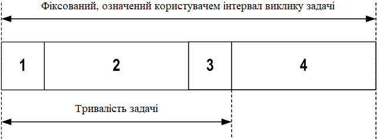

рис.4. Послідовність обробки

1. Читання входів: фізичні стани входів записуються у вхідні змінні пам’яті `%I`, а також виконуються інші системні операції.
2. Обробка задачі: виконується користувацький код (POU тощо), означений у задачі. Вихідні змінні пам’яті `%Q` оновлюються відповідно до інструкцій прикладної програми, але на цьому етапі ще не записуються у фізичні виходи.
3. Запис виходів: вихідні змінні пам’яті `%Q` модифікуються з урахуванням примусового задання виходів, яке було означене. Водночас фактичний запис у фізичні виходи залежить від типу виходу та використаних інструкцій.
4. Залишковий час інтервалу: прошивка контролера виконує системну обробку та інші задачі з нижчим пріоритетом.

Якщо для циклічної задачі задано занадто малий період `Interval`, вона повторюватиметься одразу після запису виходів без виконання інших задач з нижчим пріоритетом або будь-якої системної обробки. Це вплине на виконання всіх задач і призведе до перевищення меж системного сторожового таймеру, з генерацією відповідного винятку і переходу в аварійний зупин.

Якщо час циклу задачі встановлено менше ніж 3 мс, під час пусконалагодження слід спочатку контролювати фактичну тривалість задачі через екран Task Monitoring, щоб переконатися, що вона стабільно менша за налаштований час циклу. Якщо фактична тривалість більша, цикл задачі може не дотримуватися, що призведе до тайм-ауту сторожового таймеру циклу задачі та переходу контролера у стан HALT. Для часткового уникнення цієї ситуації, коли час циклу задачі встановлено менше ніж 3 мс, вводяться реальні обмеження +1 мс у випадку, якщо в окремому циклі обчислений час циклу незначно перевищує заданий.

Отримувати та задавати інтервал циклічної задачі з прикладної програми можна за допомогою функцій `GetCurrentTaskCycle` та `SetCurrentTaskCycle`.

### Задача Freewheeling

Задача типу Freewheeling (вільного виконання) не має фіксованої тривалості. У режимі Freewheeling кожен прохід задачі починається після завершення попереднього проходу та після короткого періоду системної обробки (30% від загальної тривалості виконання задачі Freewheeling). 

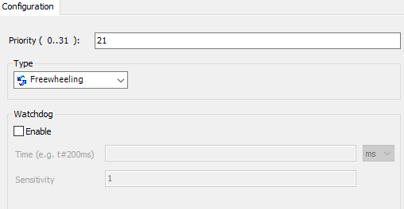

рис.5. Конфігурування задачі типу Freewheeling

У Modicon M241 може бути означена тільки одна задача типу Freewheeling, яка виконується у вільний процесорний час після виконання всіх інших задач.  

Якщо період системної обробки зменшується до менш ніж 15% протягом більше ніж 3 секунд через переривання іншими задачами, фіксується системна помилка. 

У багатозадачному застосунку за наявності задач із високим пріоритетом і значною тривалістю виконання доцільно уникати використання задачі Freewheeling. Це може призвести до спрацювання сторожового таймеру задачі. Також не слід призначати CANopen до задачі Freewheeling, це варто прив’язувати до циклічної задачі.

### Задача Event

Задача цього типу є подієвою і ініціюється програмною змінною, яка задається в полі `Event` (рис.6). Вона запускається по передньому фронту булевої змінної, пов’язаної з подією запуску. 

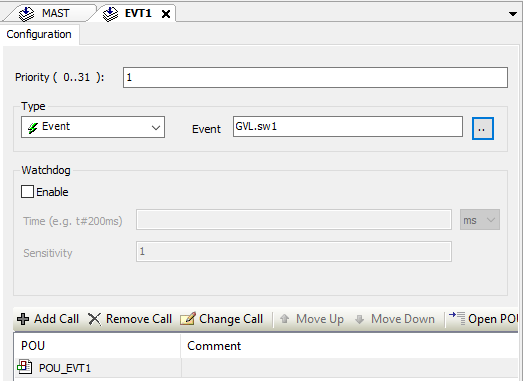

рис.6. Конфігурування задачі типу Event

Якщо подієва задача запускається з надмірною частотою, контролер переходить у стан HALT (Exception). Максимальна частота подій становить 6 подій за мілісекунду. Якщо подієва задача запускається з вищою частотою, у журналі застосунку фіксується повідомлення `ISR Count Exceeded`.

### Задача External Event

Задача цього типу є також подієвою, але ініціюється виявленням апаратної події або події, пов’язаної з апаратною функцією. На рис.7 показаний приклад конфігурування задачі, що налаштовується на запуск при передньому фронті дискретного входу `I2`

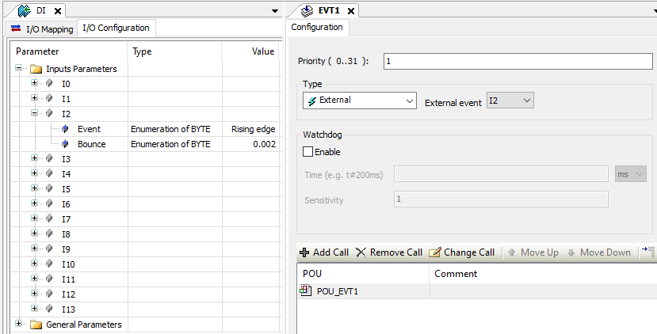

рис.7. Конфігурування подієвої задачі.

Максимальна частота подій становить 6 подій за мілісекунду. Якщо задача External Event запускається з більшою частотою, контролер переходить у стан HALT (Exception), а на сторінці журналу застосунку фіксується повідомлення `ISR Count Exceeded`.

### Пріоритети задач

Як вже зазначалося, для кожної задачі можна налаштувати пріоритет у діапазоні від `0` до `31` (`0` – найвищий пріоритет, `31` – найнижчий). Кожна задача повинна мати унікальний пріоритет, інакше проєкт не побудується. Рекомендується використовувати наступні пріоритети задач

- пріоритети 0–24: для задач керування з високими вимогами до доступності;
- пріоритети 25–31: для фонових задач з низькими вимогами до доступності.

Коли починається цикл виконання задачі, вона може перервати будь-яку задачу з нижчим пріоритетом (витіснення задач). Перервана задача відновлює виконання після завершення циклу задачі з вищим пріоритетом.

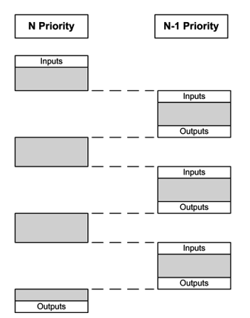

рис.8. Пріоритетність задач

Варто врахувати, що якщо один і той самий вхід використовується в різних задачах, образ входів може змінюватися під час циклу виконання задачі з нижчим пріоритетом. Щоб підвищити ймовірність коректної роботи виходів у багатозадачному режимі, під час збирання проєкту формується повідомлення про помилку, якщо виходи в одному й тому самому байті використовуються в різних задачах.

### Сторожові таймери

Для контролера Modicon M241 реалізовано два типи сторожових таймерів (watchdog):

- системні сторожові таймери, які означуються та керуються прошивкою контролера, не налаштовуються користувачем;
- сторожові таймери задач, які можна означити для кожної задачі. 

Для логічного контролера Modicon M241 означено три системні сторожові таймери, які налаштовані виробником і не означуються користувачем. Ці сторожові таймери керуються прошивкою контролера і тому також називаються апаратними. Якщо один із них перевищує свої порогові умови, фіксується помилка. Порогові умови для трьох системних сторожових таймерів такі:

- якщо всі задачі сумарно використовують більше ніж 85% ресурсів процесора протягом понад 3 секунд, фіксується системна помилка, і контролер переходить у стан HALT;
- якщо сумарний час виконання задач із пріоритетами від 0 до 24 досягає 100% ресурсів процесора протягом понад 1 секунди, фіксується помилка застосунку, і контролер автоматично перезавантажується у стан EMPTY;
- якщо задача з найнижчим пріоритетом у системі не виконується протягом інтервалу 10 секунд, фіксується системна помилка, і контролер автоматично перезавантажується у стан EMPTY.

Сторожові таймери задач інколи також називаються **програмними сторожовими таймерами** або **таймерами керування**. Сторожові таймери активуються для задач за необхідності. Коли сторожовий таймер для однієї з задач досягає своєї порогової умови, то фіксується помилка застосунку. Однак контролер не відразу переходить у стан HALT, поки кількість таких спрацювань буде меншою вказаного значення або поки загальна тривалість задачі буде менше значення `Time * Sensitivity`. Тому під час означення сторожового таймеру в задачі задаються два параметри:

- `Time` – час тайм-ауту до спрацювання сторожового таймеру;  якщо задача виконується довше, контролер зафіксує виняток;
- `Sensitivity` – кількість спрацювань сторожового таймера до того, як контролер зупинить виконання програми і перейде у стан HALT.

Для кожної задачі можна налаштувати контроль часу виконання (сторожовий таймер). Типові налаштування сторожового таймера залежать від конкретної моделі контролера.

### Опитування груп каналів I/O  

Варто нагадати, що задача є не просто частиною програми, а також включає опитування входів та запис виходів. Не врахування цього важливого моменту може привести до неправильної роботи контролера. Початок задачі супроводжується опитуванням входів а заверешення - записом виходів образу процесу. Однак що це значить в реальних застосунках, і де вказуються ці входи і виходи? Саме тут є важливі деталі, які часто приховуються в документації, але можуть значно впливати на успішність рішення, особливо в чутливих до часу застосунках, якими є завдання для машинної автоматики.  Спробуємо розібратися.   

У M241 можна вибрати окремі задачі для опитування різних груп каналів I/O, хоча за замовченням вони типово прив'язані до задачі MAST. У налаштуваннях PLC (PLC settings) можна вибирати задачу для опитування системної шини, тобто локальних каналів I/O, вказавши `Bus cycle task`, щоб означити задачу для цього обміну.  

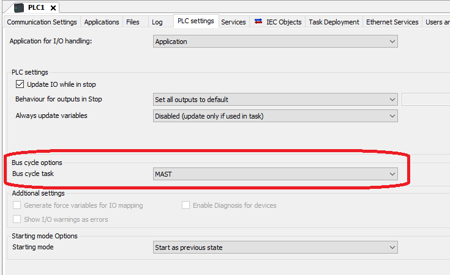

рис.9. Означення задачі для системної шини.

При обміні з локальним та віддаленими модулями розширення TM2/TM3 та розподіленими I/O (див [Апаратне забезпечення контролерів Modicon M241](../hardware/teorm241.md)) під час кроків опитування входів та запису виходів обмін йде не безпосередньо з каналами модулів, а з віртуальними образами входів/виходів. Після запису образу, обмін відбувається вже по внутрішній шині. Для TM2/TM3 та CANopen це відбувається на окремій стадії фізичного обміну (рис.10)


рис.10. Особливості обміну з периферією.

Для обміну даними з локальними та віддаленими модулями TM3/TM2 можна означити окрему задачу (рис.11), але при цьому не можна використовувати задачі типу Event.


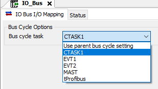

рис.11. Означення задачі для IO Bus.

Опитування модулів по CANopen також можна задати окрему задачу (рис.12)

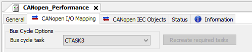

рис.12. Означення задачі для CANopen.

Для розподіленого вводу/виводу також можна задати окремі задачі для кожної з шин (рис.13, рис.14). Однак варто зауважити, що обмін по мережі та означена задача є розсинхронізовані, так як опитування модулів по I/O Scanning та означена задача взаємодії образу та комунікаційного модуля мають різні часові інтервали і не зв'язані між собою, що є типовим випадком для більшості систем розподіленого вводу/виводу. При чому періодичність опитування для кожного пристрою в мережі може відрізнятися один від одного.    

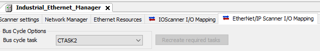

рис.13.  Означення задачі для Ethernet Manager

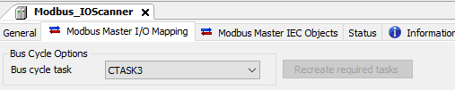

рис.14.   Означення задачі для Modbus IO Scanner

Обмін віртуальним образом I/O задачі однаково стосується як комунікаційних модулів для розподіленого вводу/виводу, так і інших типів комунікацій, зокрема Profibus DP Slave (рис.15.)

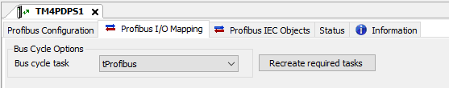

рис.15. Задача для обміну з модулем Profibus DP Slave

На рис.16 показано приклад мапи прив'язки образу змінних вводу/виводу до конкретних задач, який генерується при кожній компіляції.

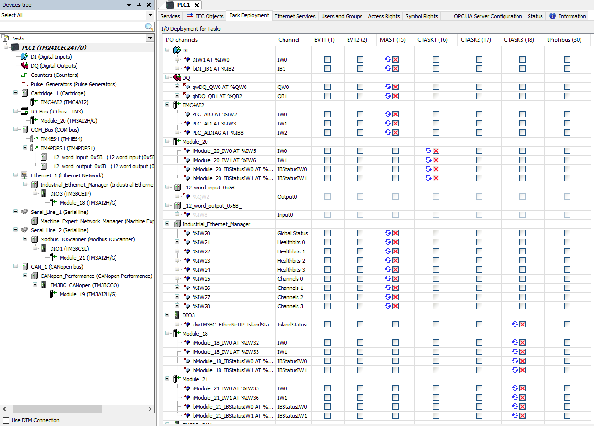

рис.16. Приклад мапи прив'язки образу змінних вводу/виводу до конкретних задач

## Стани та поведінка контролера

### Стани контролера

В залежності від ситуації, увімкнений контролер може знаходитися в різних станах, що впливає на його поведінку щодо виконання програми користувача, керування входами виходами, комунікації та іншого. У таб. 2 наведено стани контролера та індикаторних ламп, за якими можна визначити ці стани.

Таблиця 2. Стани контролера 

| Стан контролера                          | Опис                                                         | RUN (зелений)              | ERR (червоний)      | I/O (червоний) |
| ---------------------------------------- | ------------------------------------------------------------ | -------------------------- | ------------------- | -------------- |
| BOOTING                                  | Контролер виконує завантаження прошивки ОС та проводить власне внутрішнє тестування. Після цього перевіряє контрольну суму прошивки та користувацьких застосунків | OFF                        | OFF/ON              | OFF/ON         |
| INVALID_OS                               | У енергонезалежній пам’яті відсутній коректний файл прошивки. Контролер не виконує застосунок. | OFF                        | регулярне миготіння | OFF            |
| EMPTY                                    | У контролері відсутній застосунок, тому виконання неможливе. | OFF                        | одиничне миготіння  | OFF            |
| EMPTY після виявлення системної помилки  | Стан еквівалентний EMPTY, але застосунок присутній і навмисно не завантажується. Перезавантаження (цикл живлення) або нове завантаження застосунку відновлює коректний стан. | OFF                        | швидке миготіння    | OFF            |
| RUNNING                                  | Контролер виконує коректний застосунок.                      | ON                         | OFF                 | OFF            |
| RUNNING з breakpoint                     | Стан аналогічний RUNNING з такими винятками: <br />- виконання частини програми, що обробляє задачі, не відновлюється до зняття точки переривання (breakpoint); <br />- індикація світлодіодів відрізняється. | одиничне миготіння         | OFF                 | OFF            |
| RUNNING із виявленою зовнішньою помилкою | Контролер виконує коректний застосунок, але виявлено помилку конфігурації, TM3, SD-карти або іншу помилку I/O. Коли світлодіод I/O увімкнений, деталі помилки доступні в `PLC_R.i_wSystemFault_1` та `PLC_R.i_wSystemFault_2`. Будь-яка з помилок, зафіксованих цими змінними, призводить до ввімкнення I/O LED. | ON                         | OFF                 | ON             |
| STOPPED                                  | Контролер має коректний застосунок, але він зупинений.       | регулярне миготіння        | OFF                 | OFF            |
| STOPPED із виявленою зовнішньою помилкою | Контролер має коректний застосунок, але виявлено помилку конфігурації, TM3, SD-карти або іншу помилку I/O. | регулярне миготіння        | OFF                 | ON             |
| HALT                                     | Контролер припиняє виконання застосунку через виявлення помилки застосунку. | регулярне миготіння        | ON                  | –              |
| Boot-застосунок не збережено             | У пам’яті контролера є застосунок, який відрізняється від застосунку в енергонезалежній пам’яті. Під час наступного циклу живлення застосунок буде замінено версією з енергонезалежної пам’яті. | ON або регулярне миготіння | одиничне миготіння  | OFF            |

Часовa діаграма на рис.17 показує різницю між швидким миготінням (fast flash), регулярним миготінням (regular flash) та одиночним миготінням (single flash):

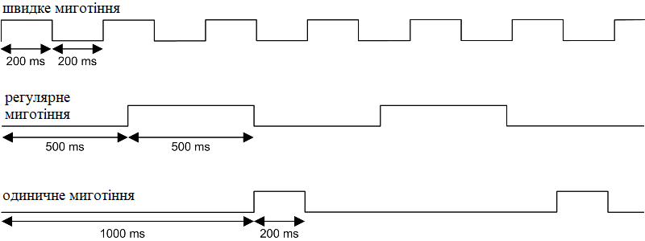

рис.17. Різні варіанти миготіння

У загальному всі стани контролера можна звести до операційних та неопераційних. Операційні стани — це стабільні стани роботи після завершення ініціалізації, у яких визначається поведінка задач і можливість виконання прикладної програми (STOPPED, RUNNING, HALT). Неопераційні стани охоплюють етапи запуску, перевірки та переходів, що передують входженню контролера в робочий режим або супроводжують його зміну. На рис.18 показана спрощена діаграма станів контролера M241, а на рис.19 - повна.

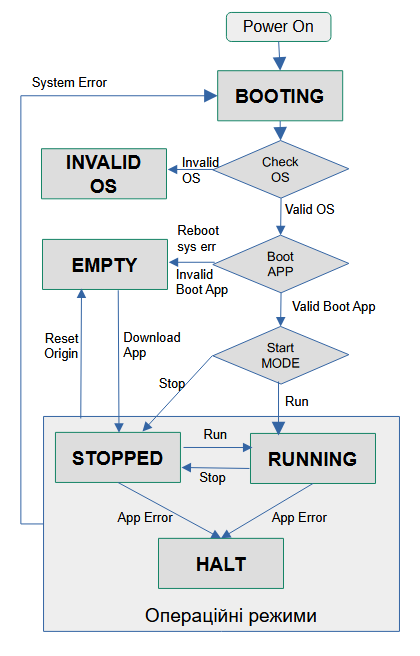

рис.18. Спрощена діаграма станів контролера M241

### Значення виходів PLC в різних станах контролера

Значення виходів контролера залежить від стану контролера, режимів роботи виходів та їх налаштувань а також комунікацій, через які ці виходи встановлюються (для віддалених I/O). 

У режимі RUNNING виходами керує прикладна програма, за винятком випадку, коли є помилка шини розширення I/O, і CPU не може записати потрібне значення виходу. Якщо є така помилка, стан виходу визначається налаштуваннями. 

У стані STOPPED стан виходів задається налаштуваннями поведінки (рис.19):

- `Keep current values`: виходи зберігають свій стан якщо виставлена опція `Update I/O while in stop` і залежить від команд, отриманих через сконфігуровані польові шини. 

- `Set all outputs to default` : виходи встановлюються у значення за замовченням

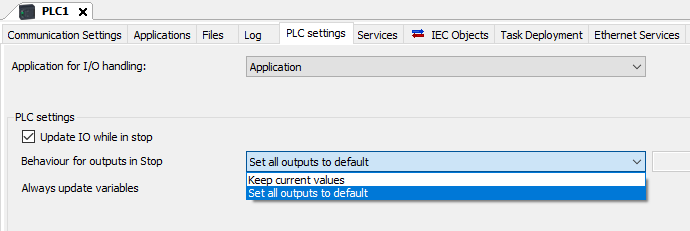

рис.19. Конфігурування станів виходів при зупинці PLC

У стані HALT виходи виходи встановлюються у значення за замовченням.

Виходи PTO, PWM, FreqGen (генератор частоти) та рефлексні виходи HSC у станах STOPPED та HALT завжди встановлюються в 0.

У станах BOOTING, EMPTY (після циклу живлення без boot-застосунку або після виявлення системної помилки) та INVALID_OS, до виходів встановлюються апаратні значення ініціалізації. У стані ініціалізації виходи набувають таких значень:

- аналоговий вихід: Z (високий імпеданс);
- швидкий транзисторний вихід: Z (високий імпеданс);
- звичайний транзисторний вихід: 0 В DC;
- релейний вихід: розімкнений.

Наприкінці завантаження застосунку або після виконання скидання `Reset Warm` чи `Reset Cold` діють програмні значення ініціалізації – початкові значення образів виходів (`%I`, `%Q` або змінних, відображених на `%I` чи `%Q`). За замовчуванням вони дорівнюють 0, однак можна відобразити I/O у GVL і задати для виходів значення, відмінні від 0.

Контролер дозволяє форсувати виходи, тобто примусово встановлювати стан вибраних виходів у задане значення з метою тестування системи, пусконалагодження та обслуговування. Формування виходів можливе лише в онлайн режимі з Machine Expert. Для цього використовується команда `Force values` у меню `Debug`. Форсування має пріоритет над іншими командами (окрім `write immediate`) незалежно від виконуваного програмування задач. При переході в офлайн, Machine Expert запропонує зберегти ці форсування, яке триватиме до завантаження нового застосунку або виконання однієї з команд `Reset`. Якщо виставлений параметр `Update I/O while in stop` формовані значення виходів зберігаються навіть у стані STOPPED.

Вихід, який планується форсувати, повинен належати задачі, що наразі виконується контролером, для зупинених задач виходи не форсуються, поки цю задачу хоча б раз не виконати. Не можна форсувати виходи PTO, PWM, FreqGen та рефлексні виходи HSC

### Стан STOPPED

**Можливо обєднати з попереднім пунктом.**

Для стану STOPPED справедливі такі твердження:

- вхід, сконфігурований як Run/Stop, залишається працездатним;
- вихід, сконфігурований як Alarm output, залишається працездатним і переходить у значення 0;
- служби зв’язку Ethernet, Serial (Modbus, ASCII тощо) та USB залишаються активними, а команди, передані через ці служби, можуть і надалі впливати на застосунок, стан контролера та змінні пам’яті;
- усі виходи спочатку набувають свого налаштованого типового стану (Keep current values або Set all outputs to default) або стану, визначеного примусовим заданням виходів, якщо воно використовується. Для виходів, задіяних у функції PTO, типове значення ігнорується, щоб не згенерувати зайвий імпульс. Подальший стан виходів залежить від значення параметра Update IO while in stop та від команд, отриманих від віддалених пристроїв.

**Поведінка задач і I/O коли вибрано опцію `Update IO While In Stop`**

Якщо параметр Update IO while in stop увімкнено, справедливе таке:

- операція Read Inputs продовжується у звичайному режимі. Фізичні входи зчитуються і записуються у вхідні змінні пам’яті %I;
- операція Task Processing не виконується;
- операція Write Outputs продовжується. Вихідні змінні пам’яті %Q оновлюються відповідно до конфігурації `Keep current values` або `Set all outputs to default` з урахуванням форсування виходів (якщо воно використовується), після чого записуються у фізичні виходи.

Експертні функції припиняють роботу. Наприклад, лічильник буде зупинений.

– якщо вибрано конфігурацію `Keep current values`: PTO, PWM, FreqGen (генератор частоти) та рефлексні виходи HSC встановлюються в 0.

– якщо вибрано конфігурацію `Set all outputs to default`: виходи PTO встановлюються в 0, виходи PWM, FreqGen (генератор частоти) та рефлексні виходи HSC встановлюються у сконфігуровані типові значення.

**Поведінка CAN, коли `Update IO while in stop` увімкнено**

Для шин CAN у разі ввімкненого параметра `Update IO while in stop` справедливе таке:

- шина CAN залишається працездатною. Пристрої на шині CAN і надалі сприймають наявність функціонального CAN Master;
- обмін TPDO та RPDO продовжується;
- опційні SDO, якщо вони сконфігуровані, продовжують обмін;
- функції Heartbeat та Node Guarding, якщо вони сконфігуровані, продовжують роботу;
- якщо поле Behaviour for outputs in Stop встановлено в Keep current values, TPDO продовжують передаватися з останніми значеннями;
- якщо поле Behaviour for outputs in Stop встановлено в Set all outputs to default, останні значення оновлюються до типових і подальші TPDO передаються з цими типовими значеннями.

**Поведінка задач і I/O, коли `Update IO while in stop` вимкнено**

Коли параметр Update IO while in stop вимкнено, контролер встановлює I/O у стан Keep current values або Set all outputs to default (з урахуванням примусового задання виходів, якщо воно використовується). Після цього справедливе таке:

- операція Read Inputs припиняється. Вхідні змінні пам’яті %I фіксуються на останніх значеннях;
- операція Task Processing не виконується;
- операція Write Outputs припиняється. Вихідні змінні пам’яті %Q можуть оновлюватися через з’єднання Ethernet, Serial та USB. Однак фізичні виходи не змінюються і зберігають стан, визначений параметрами конфігурації.

Примітка: експертні функції припиняють роботу. Наприклад, лічильник буде зупинений.

– якщо вибрано конфігурацію Keep current values: PTO, PWM, FreqGen (генератор частоти) та рефлексні виходи HSC встановлюються в 0.

– якщо вибрано конфігурацію Set all outputs to default: виходи PTO встановлюються в 0; виходи PWM, FreqGen (генератор частоти) та рефлексні виходи HSC встановлюються у сконфігуровані типові значення.

**Поведінка CAN, коли `Update IO while in stop` вимкнено**

Для шин CAN у разі вимкненого параметра `Update IO while in stop` справедливе таке:

- CAN Master припиняє обмін даними. Пристрої на шині CAN переходять у свої сконфігуровані аварійні (fallback) стани;
- обмін TPDO та RPDO припиняється;
- обмін опційними SDO, якщо вони були сконфігуровані, припиняється;
- функції Heartbeat та Node Guarding, якщо вони були сконфігуровані, зупиняються;
- поточні або типові значення, залежно від конфігурації, записуються у TPDO і передаються один раз перед зупинкою CAN Master.

### Команди

#### Run

Команда RUN ініціює перехід контролера у стан RUNNING зі станів BOOTING або STOPPED.

Ця команда може подаватися кількома способами:

- за переднього фронту на вході `Run/Stop` (якщо сконфігурований) і за умови, що перемикач Run/Stop перебуває у положенні RUN. 
- команда `Start` з онлайн-меню Machine Expert;
- команда `RUN` з Web Server;
- внутрішній виклик з прикладної програми або зовнішній виклик через Modbus-запит із використанням системних змінних `PLC_W.q_wPLCControl` та `PLC_W.q_uiOpenPLCControl` бібліотеки M241 PLCSystem;
- вхід у систему з опцією `online change`: онлайн-зміна (часткове завантаження), ініційована, коли контролер перебуває у стані RUNNING, у разі успіху повертає контролер у стан RUNNING;
- команда Multiple Download: переводить контролери у стан RUNNING, якщо вибрано опцію `Start all applications after download or online change`, незалежно від того, чи перебували цільові контролери до цього у стані RUNNING, STOPPED або EMPTY;
- за певних умов контролер автоматично перезапускається у стан RUNNING.

#### Stop

Команда Stop ініціює перехід контролера у стан STOPPED зі станів BOOTING, EMPTY або RUNNING.

Ця команда може подаватися кількома способами:

- значення 0 на вході `Run/Stop` (якщо сконфігурований) 
- команда  `Stop` з онлайн-меню Machine Expert;
- команда `STOP` з Web Server;
- внутрішній виклик з прикладної програми або зовнішній виклик через Modbus-запит із використанням системних змінних `PLC_W.q_wPLCControl` та `PLC_W.q_uiOpenPLCControl` бібліотеки M241 PLCSystem;
- вхід у систему з опцією `online change`: онлайн-зміна (часткове завантаження), ініційована, коли контролер перебуває у стані STOPPED, у разі успіху повертає контролер у стан STOPPED;
- команда `Download`: неявно переводить контролер у стан STOPPED;
- команда `Multiple Download`: переводить контролери у стан STOPPED, якщо опція `Start all applications after download or online change` не вибрана, незалежно від того, чи перебували цільові контролери у стані RUNNING, STOPPED або EMPTY;
- REBOOT через скрипт: скрипт файлової передачі на SD-карті може виконати команду REBOOT як завершальну. Контролер перезавантажується у стан STOPPED, якщо інші умови послідовності завантаження це дозволяють. 
- за певних умов контролер автоматично перезапускається у стан STOPPED.

#### Reset Warm

Команда Reset Warm скидає до типових значень всі змінні, окрім реманетних змінних,  і переводить контролер у стан STOPPED зі станів RUNNING, STOPPED або HALT.

Ця команда може подаватися кількома способами:

- команда `Reset warm` з онлайн-меню Machine Expert;
- внутрішній виклик з прикладної програми або зовнішній виклик через Modbus-запит із використанням системних змінних `PLC_W.q_wPLCControl` та `PLC_W.q_uiOpenPLCControl` бібліотеки M241 PLCSystem.

При запуску команди Reset Warm відбуваються наступні дії:

1. зупиняється прикладна програма ;
2. скасовується формування виходів ;
3. скидаються діагностичні індикації помилок ;
4. зберігаються значення retain-змінних ;
5. зберігаються значення retain-persistent змінних ;
6. нерозміщені та неретентні змінні скидаються до значень ініціалізації;
7. зберігаються значення перших 1000 регістрів %MW;
8. скидаються до 0 значення регістрів %MW1000…%MW59999 ;
9. зупиняється обмін по промислових мережах і після завершення скидання запускається знову;
10. входи скидаються до значень ініціалізації. Виходи скидаються до програмних значень ініціалізації або до типових значень, якщо програмні значення ініціалізації не визначені;
11. зчитується файл Post Configuration, стор. 161.

Детальніше про змінні див. [Робота з даними в Machine Expert](../data/teorm241.md)

#### Reset Cold

Команда  Reset Cold скидає всі змінні до значень ініціалізації, окрім retain-persistent змінних, і переводить контролер у стан STOPPED. Початкові стани: RUNNING, STOPPED або HALT.

Ця команда може подаватися кількома способами:

- команда `Reset cold` з онлайн-меню Machine Expert; 
- внутрішній виклик з прикладної програми або зовнішній виклик через Modbus-запит із використанням системних змінних `PLC_W.q_wPLCControl` та `PLC_W.q_uiOpenPLCControl` бібліотеки M241 PLCSystem.

При запуску команди Reset Cold  відбуваються наступні дії: 

1. зупиняється прикладна програма ;
2. скасовується формування виходів ;
3. скидаються діагностичні індикації помилок ;
4. значення retain-змінних скидаються до значень ініціалізації;
5. значення retain-persistent змінних зберігаються;
6. нерозміщені та нереманентні змінні скидаються до значень ініціалізації;
7. значення перших 1000 регістрів %MW зберігаються;
8. значення регістрів %MW1000…%MW59999 скидаються до 0;
9. зупиняється обмін по промислових мережах і після завершення скидання запускається знову;
10. входи скидаються до значень ініціалізації, виходи скидаються до програмних значень ініціалізації або до типових значень, якщо програмні значення ініціалізації не означені;
11. зчитується файл `Post Configuration`.

#### Reset Origin

Команда Reset Origin скидає всі змінні, включно з реманентними, до значень ініціалізації. Видаляє всі файли користувача на контролері, зокрема права користувачів і сертифікати. Перезавантажує контролер і переводить його у стан EMPTY. Початкові стани: RUNNING, STOPPED або HALT.

Команда Reset Origin доступна з онлайн-меню Machine Expert.

При запуску команди Reset Origin відбуваються наступні дії:

1. зупиняється прикладна програма ;
2. скасовується примусове задання виходів ;
3. видаляються файли web-візуалізації ;
4. файли користувача (Boot-застосунок, журнали даних, `Post Configuration`, права користувачів і сертифікати) видаляються;
5. діагностичні індикації помилок скидаються;
6. значення retain-змінних скидаються;
7. значення retain-persistent змінних скидаються;
8. нерозміщені та неретентні змінні скидаються;
9. значення перших 1000 регістрів %MW скидаються до 0;
10. значення регістрів %MW1000…%MW59999 скидаються до 0;
11. обмін по польових шинах зупиняється;
12. вбудовані Expert I/O скидаються до раніше сконфігурованих користувачем типових значень;
13. інші входи скидаються до значень ініціалізації, інші виходи скидаються до апаратних значень ініціалізації;
14. контролер перезавантажується.

По суті, команда Reset Origin приводить до відновлення програмної частини контролера до заводських налаштувань, із видаленням прикладної програми, очищенням збережених даних та поверненням параметрів конфігурації до значень за замовчуванням.

#### Reset Origin Device

Команда Reset Origin Device скидає всі змінні, включно з реманентними, до значень ініціалізації. Якщо вибрано PLC Logic, переводить контролер у стан EMPTY. Початкові стани: RUNNING, STOPPED або HALT.

Команда  Reset Origin Device доступна з контекстного онлайн-меню `My controller`. У результаті відкривається діалогове вікно для вибору елементів, які потрібно видалити (рис.20):

- `User Management`: скидаються до типових значень користувачі та групи ;
- `PLC Logic`: відбуваються дії, описані в Reset Origin
- `Certificates`: сертифікати, що використовуються Web Server і FTP Server, скидаються;

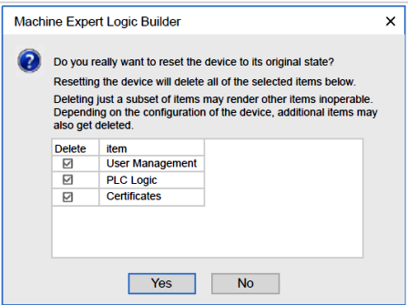

рис.20. Варіанти вибору 

#### Reboot

Команда Reboot ініціює перезавантаження контролера з будь-якого стану.

Ця команда може подаватися через скрипт REBOOT, або в результаті збою живлення. Подія перезавантаження детально показна на повній діаграмі станів контролера M241, що показана на рис.22 і описана в документації. Тут розглянемо укрупнено. 

При запуску команди Reboot відбуваються наступні дії:

1) Контролер переходить у один із станів, в залежності від ряду умов (послідовність перевірки згори донизу)

- INVALID_OS: якщо відсутня коректна прошивка;
- EMPTY: якщо відсутній boot-застосунок або boot-застосунок некоректний або перезавантаження було спричинене певними системними помилками;
- STOPPED або RUNNING в залежності від: джерело команди, відповідне налаштування Starting Mode, попереднього стану контролера до перезавантаження, значення і налаштування Run/Stop, факт зміни boot-застосунок, коректність реманентних змінних 

2) Примусове задання виходів зберігається, якщо boot-застосунок успішно завантажено. В іншому разі примусове задання скасовується.

3) Діагностичні індикації помилок скидаються.

4) Значення retain-змінних відновлюються, якщо збережений контекст є коректним.

5) Значення retain-persistent змінних відновлюються, якщо збережений контекст є коректним.

6) Нерозміщені та нереманентні змінні скидаються до значень ініціалізації.

7) Значення перших 1000 регістрів %MW відновлюються, якщо збережений контекст є коректним.

8) Значення регістрів %MW1000…%MW59999 скидаються до 0.

9) Обмін по промислових мережах зупиняється та перезапускається після успішного завантаження boot-застосунку.

10) Входи скидаються до значень ініціалізації. Виходи спочатку скидаються до апаратних значень ініціалізації, а потім до програмних значень ініціалізації або до типових значень, якщо програмні значення ініціалізації не визначені.

11) Зчитується файл `Post Configuration`

12) Файлова система контролера ініціалізується, а її ресурси (сокети, дескриптори файлів тощо) вивільняються.

Файлова система, що використовується контролером, потребує періодичного відновлення шляхом циклу живлення. Якщо не виконується регулярне технічне обслуговування машини або використовується джерело безперебійного живлення (UPS), необхідно примусово виконувати цикл живлення контролера (знеструмлення та повторне подання живлення) щонайменше один раз на рік.

Перевірка контексту (`Check context test` з рис.21) вважає контекст коректним, якщо застосунок і реманентні змінні відповідають тим, що означені в boot-застосунку. Якщо вхід Run/Stop живиться від того самого джерела, що й контролер, втрата живлення на цьому вході фіксується негайно, і контролер поводиться так, ніби була отримана команда STOP. Тому, якщо контролер і вхід Run/Stop живляться від одного джерела, контролер зазвичай перезавантажується у стан STOPPED після переривання живлення, коли Starting Mode встановлено в `Start as previous state`.

Якщо виконати `online change` прикладної програми, коли контролер перебуває у стані RUNNING або STOPPED, але вручну не оновити boot-застосунок, під час наступного перезавантаження контролер виявить розбіжність контексту, реманентні змінні будуть скинуті відповідно до `Reset Cold`, а контролер перейде у стан STOPPED.

#### Завантаження застосунку

Команда завантажує виконуваний файл застосунку в оперативну пам’ять (RAM). За потреби створює Boot-застосунок в енергонезалежній пам’яті. Завантаження можна робити в станах : RUNNING, STOPPED, HALT та EMPTY.

Завантажувати застосунок можна кількома способами:

- з Machine Expert за допомогою команди Download або Multiple Download.
- через FTP, завантажуючи файл Boot-застосунку в енергонезалежну пам’ять; оновлений файл застосовується під час наступного перезавантаження контролера.
- через SD-карту, записавши туди файл Boot-застосунку; оновлений файл застосовується під час наступного перезавантаження. 

При виклику команди Download з Machine Expert відбуваються наступні дії:

1. Поточний застосунок зупиняється і після цього видаляється.
2. Якщо новий застосунок є коректним, він завантажується, і контролер переходить у стан STOPPED.
3. Форсування виходів скасовується.
4. Діагностичні індикації помилок скидаються.
5. Значення retain-змінних скидаються до значень ініціалізації.
6. Значення наявних retain-persistent змінних зберігаються.
7. Нерозміщені та нереманенті змінні скидаються до значень ініціалізації.
8. Значення перших 1000 регістрів %MW зберігаються.
9. Значення регістрів %MW1000…%MW59999 скидаються до 0.
10. Обмін по промислових мережах зупиняється, після чого після завершення завантаження запускається сконфігурована мережа нового застосунку.
11. Вбудовані Expert I/O скидаються до попередньо сконфігурованих користувачем типових значень і після завершення завантаження встановлюються в нові користувацькі типові значення.
12. Входи скидаються до значень ініціалізації. Виходи після завершення завантаження спочатку скидаються до апаратних значень ініціалізації, а потім до програмних значень ініціалізації або до типових значень, якщо програмні значення ініціалізації не визначені.
13. Зчитується файл Post Configuration.

При завантаженні через FTP або SD-карту жодних змін до наступного перезавантаження  не відбувається. Під час наступного перезавантаження ефекти відповідають перезавантаженню з некоректним контекстом (див. рис.22). 

 Machine Expert має функцію, яка дозволяє виконати повне завантаження застосунку на кілька цільових контролерів у вашій мережі або польовій шині. Однією з опцій за замовчуванням при виборі команди Multiple Download… є параметр `Start all applications after download or online change`, який перезапускає всі цільові контролери у стані RUNNING за умови, що їхні входи `Run/Stop` подають команду RUNNING, незалежно від їхнього попереднього стану перед початком множинного завантаження. Зніміть цю опцію, якщо не бажаєте, щоб усі вибрані контролери запускалися у стані RUNNING. Крім того, перед використанням функції Multiple Download перевірте зміни до прикладної програми у віртуальному або невиробничому середовищі та переконайтеся, що цільові контролери і підключене обладнання переходять у очікувані стани в режимі RUNNING.

Під час множинного завантаження, на відміну від звичайного завантаження, Machine Expert не пропонує опцію створення Boot application. Ви можете вручну створити Boot application у будь-який момент, обравши Create boot application в меню Online для кожного цільового контролера.

#### Зміна програми в онлайн

Онлайн-зміна (часткове завантаження), ініційована під час перебування контролера у стані RUNNING, у разі успіху повертає контролер у стан RUNNING за умови, що вхід `Run/Stop` налаштований і встановлений у `Run` або перемикач `Run/Stop` встановлений у положення `Run`. Перед використанням опції `Login with online change` перевірте зміни до прикладної програми у віртуальному або невиробничому середовищі та переконайтеся, що контролер і підключене обладнання переходять у очікувані стани в режимі RUNNING.

Онлайн-зміни програми не записуються автоматично до Boot application і будуть перезаписані наявною Boot application під час наступного перезапуску. Якщо потрібно, щоб зміни зберігалися після перезавантаження, необхідно вручну оновити Boot application, обравши Create boot application в online-меню (для цього контролер має перебувати у стані STOPPED **????**).


рис.21.

#### Повна діаграма станів контролера M241

На рис.22 надана повна діаграма станів контролера M241, взята з офіційної документації. Цю частину варто сприймати для довідки. 


рис.22. Повна діаграма станів контролера M241 з офіційної документації.

До рис.22 йдуть наступні примітки (Note):

1) Цикл живлення (переривання живлення з подальшим увімкненням) видаляє всі налаштування форсування виходів. 
2) Виходи набувають своїх апаратних ініціалізаційних значень.
3) У деяких випадках, коли виявляється системна помилка, контролер автоматично перезавантажується у стан EMPTY, так, ніби в енергонезалежній пам’яті відсутній Boot-застосунок. Водночас Boot-застосунок з енергонезалежної пам’яті не видаляється. У цьому випадку світлодіод ERR (червоний) регулярно блимає.
4) Після перевірки коректності Boot-застосунку відбуваються такі події:
   - застосунок завантажується в RAM;
   - застосовуються налаштування файлу Post Configuration,
   - Під час завантаження Boot-застосунку виконується перевірка контексту (Check context test) для підтвердження коректності ретентних змінних. Якщо перевірка контексту є некоректною, Boot-застосунок буде завантажено, але контролер перейде у стан STOPPED,

5) 
   - a) Режим запуску (Starting Mode) задається на вкладці PLC settings редактора Controller Device Editor, 
   - b) У разі переривання живлення контролер продовжує перебувати у стані RUNNING щонайменше 4 мс перед вимкненням. Якщо вхід Run/Stop живиться від того самого джерела, що й контролер, втрата живлення на цьому вході фіксується негайно, і контролер поводиться так, ніби була отримана команда STOP. Тому, якщо контролер і вхід Run/Stop живляться від одного джерела, контролер зазвичай перезавантажується у стан STOPPED після переривання живлення, коли параметр Starting Mode встановлений у Start as previous state.
6) Під час успішного завантаження прикладної програми відбуваються такі події:
   - застосунок безпосередньо завантажується в RAM;
   - за замовчуванням Boot-застосунок створюється і зберігається в енергонезалежній пам’яті.
7) Типова поведінка після завантаження прикладної програми полягає в тому, що контролер переходить у стан STOPPED незалежно від налаштування входу Run/Stop, положення перемикача Run/Stop або попереднього стану контролера до завантаження.
   Водночас існують дві особливості, які слід враховувати: Online Change та Multiple Download, які описані нижче
8) Платформа Machine Expert надає багато потужних можливостей для керування виконанням задач і станами виходів, коли контролер перебуває у станах STOPPED або HALT. 
9) Для виходу зі стану HALT необхідно виконати одну з команд скидання (`Reset Warm`, `Reset Cold`, `Reset Origin`), завантажити застосунок або виконати цикл живлення. У разі невідновлюваної події (апаратний watchdog або внутрішня помилка) цикл живлення є обов’язковим.
10) Стан RUNNING має дві виняткові умови:
    - RUNNING with External Error: ця виняткова умова індикується світлодіодом I/O, який світиться постійним червоним світлом. Вийти з цього стану можна шляхом усунення зовнішньої помилки (ймовірно, шляхом зміни конфігурації застосунку). Команди контролера не потрібні, однак у деяких випадках може знадобитися цикл живлення контролера. 
    - RUNNING with Breakpoint: ця виняткова умова індикується світлодіодом RUN, який відображає одиночний зелений спалах. 
11) Boot-застосунок може відрізнятися від завантаженого застосунку. Це можливо, коли boot-застосунок був завантажений через SD-карту, FTP або файлову передачу, або коли було виконано онлайн-зміну без створення boot-застосунку.

## Виявлення, типи та керування помилками

**Даний пункт можливо варто перенести в розділ діагностики!**

Контролер виявляє та керує трьома типами помилок:

- зовнішні помилки;
- помилки застосунку;
- системні помилки.

У наведеній нижче таблиці описано типи помилок, які можуть бути виявлені:

| Тип виявленої помилки                  | Опис                                                         | Результуючий стан контролера                                 |
| -------------------------------------- | ------------------------------------------------------------ | ------------------------------------------------------------ |
| Зовнішня помилка (External Error)      | Зовнішні помилки виявляються системою у станах RUNNING або STOPPED і не змінюють поточний стан контролера. Зовнішня помилка виявляється у таких випадках: <br />• під’єднаний пристрій повідомляє контролеру про помилку; <br />• контролер виявляє помилку у зовнішньому пристрої, наприклад, коли пристрій обмінюється даними, але некоректно сконфігурований для роботи з контролером; <br />• контролер виявляє помилку на виході; <br />• контролер виявляє переривання зв’язку з пристроєм; <br />• контролер сконфігурований на модуль розширення, який відсутній або не виявлений і не був оголошений як опційний модуль; <br />• boot-застосунок в енергонезалежній пам’яті відрізняється від застосунку в RAM. | RUNNING with External Error Detected <br />або <br />STOPPED with External Error Detected |
| Помилка застосунку (Application Error) | Помилка застосунку виявляється у разі некоректного програмування або при перевищенні порогового значення задачного watchdog. | HALT                                                         |
| Системна помилка (System Error)        | Системна помилка виявляється, коли контролер переходить у стан, який не може бути оброблений під час виконання. У більшості випадків такі стани зумовлені помилками прошивки або апаратного забезпечення, однак у деяких випадках некоректне програмування також може призвести до системної помилки, наприклад, під час спроби запису в область пам’яті, зарезервовану під час виконання, або при спрацюванні системного watchdog. Примітка: деякі системні помилки можуть бути оброблені під час виконання і тому трактуються як помилки застосунку. | BOOTING → EMPTY                                              |

## Реманентні змінні

Реманентні змінні можуть або повторно ініціалізуватися, або зберігати свої значення у разі знеструмлення, перезавантаження, скидання та завантаження прикладної програми. Існує кілька типів реманентних змінних: оголошені окремо як retain або persistent. Детальніше про реманентні змінні див. [Робота з даними в Machine Expert](../data/teorm241.md)

У наведеній нижче таблиці описано поведінку ретентних змінних у кожному випадку:

| Дія                                                          | VAR  | VAR RETAIN | PERSISTENT | Примітки                                                     |
| ------------------------------------------------------------ | ---- | ---------- | ---------- | ------------------------------------------------------------ |
| Онлайн-зміна прикладної програми                             | X    | X          | X          |                                                              |
| Онлайн-зміна з модифікацією boot-застосунку                  | –    | X          | X          | Значення змінних retain зберігаються, якщо онлайн-зміна модифікує лише кодову частину boot-застосунку (наприклад, `a := a + 1;` → `a := a + 2;`). В усіх інших випадках retain-змінні повторно ініціалізуються. |
| Stop                                                         | X    | X          | X          |                                                              |
| Цикл живлення                                                | –    | X          | X          |                                                              |
| Reset warm                                                   | –    | X          | X          |                                                              |
| Reset cold                                                   | –    | –          | X          |                                                              |
| Reset origin                                                 | –    | –          | –          |                                                              |
| Reset origin device                                          | –    | –          | –          |                                                              |
| Завантаження прикладної програми через EcoStruxure Machine Expert | –    | –          | X          | Якщо завантажений застосунок містить ті самі persistent змінні, що й наявний застосунок, існуючі змінні зберігають свої значення. |
| Завантаження прикладної програми з використанням SD-карти    | –    | –          | –          | Якщо завантажений застосунок містить ті самі persistent змінні, що й наявний застосунок, існуючі змінні зберігають свої значення. |

Позначення:
(X) значення зберігається.
(–) значення повторно ініціалізується.

Перші 1000 регістрів %MW автоматично є persistent, якщо з ними не пов’язана жодна змінна. Їхні значення зберігаються після перезавантаження / Reset warm / Reset cold. Решта регістрів %MW керуються як VAR.
Наприклад, якщо у програмі є:

```pascal
VAR myVariable AT %MW0 : WORD; END_VAR
```

то %MW0 поводиться так само, як `myVariable` (не є retain і не є persistent).

Детальніше про реманентні змінні див. [Робота з даними в Machine Expert](../data/teorm241.md)

## Джерела

1. Modicon M241 Logic Controller User Guide, 04/2021, Schneider Electric 
2. EcoStruxure Machine Expert Software User Guide, 09/2021, Schneider Electric

## Відео

- [Лек.2.1. Функціонування, операційні режими, задачі ПЛК в Machine Expert](https://youtu.be/JHxIUqAX_dk)

## Автори


Теоретичне заняття розробив [Олександр Пупена](https://github.com/pupenasan). 

## Feedback

Якщо Ви хочете залишити коментар у Вас є наступні варіанти:

- [Обговорення у WhatsApp](https://chat.whatsapp.com/BRbPAQrE1s7BwCLtNtMoqN)
- [Обговорення в Телеграм](https://t.me/+GA2smCKs5QU1MWMy)
- [Група у Фейсбуці](https://www.facebook.com/groups/asu.in.ua)

Про проект і можливість допомогти проекту написано [тут](https://asu-in-ua.github.io/atpv/)
