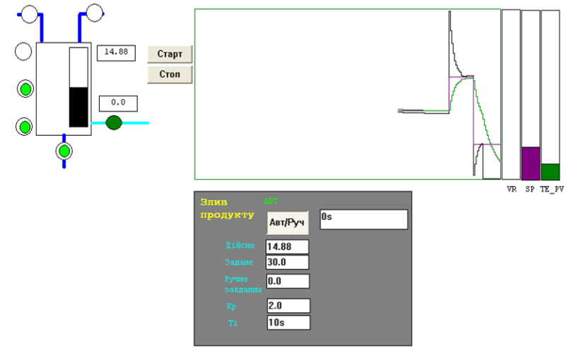
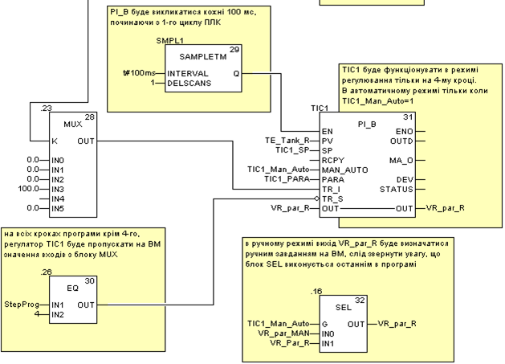
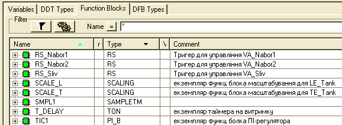
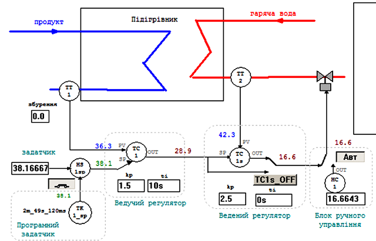
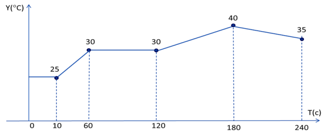
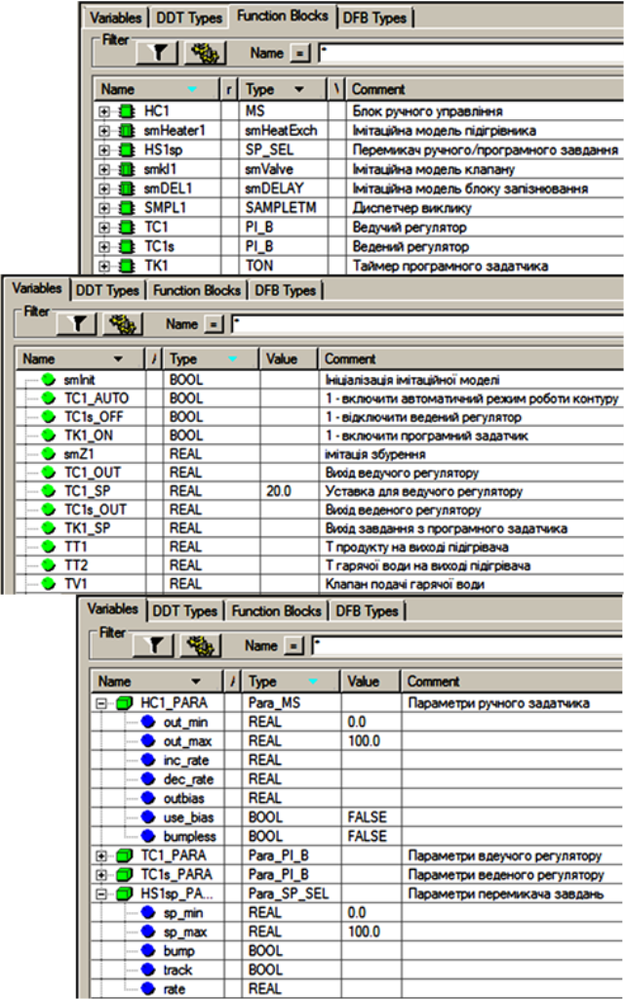
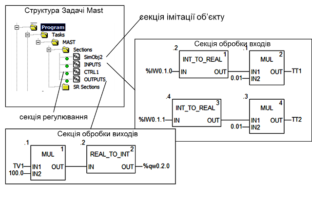
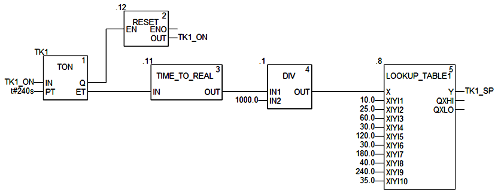
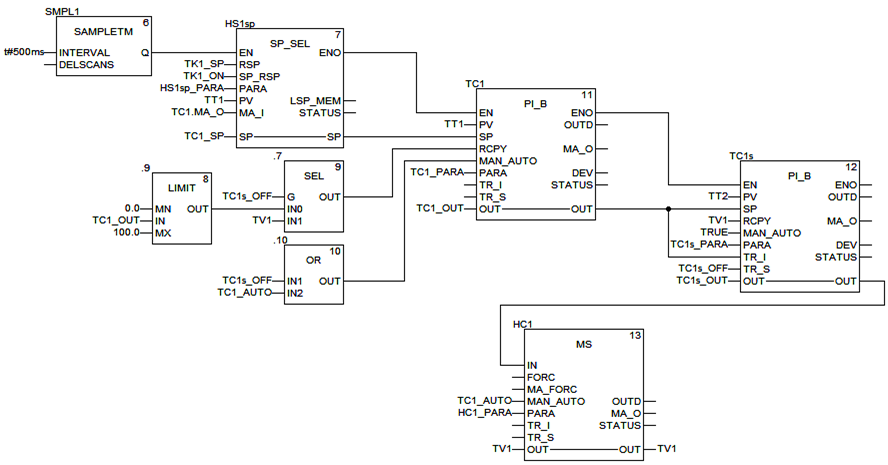

[<- До підрозділу](README.md)		[Коментувати](#feedback)

# Приклади реалізації ПІ та ПІД-регулювання в UnityPRO/Control Expert

## Стабілізаційне регулювання 

Завдання. 

Створити проект для ПЛК М340, для реалізації програми управління установкою, що описується наступним алгоритмом (див. рис.6.59). Після нажимання кнопки "СТАРТ" відкривається клапан набору першого продукту. Після досягнення середнього рівня клапан 1-го продукту закривається, відкривається клапан набору 2-го продукту. Після спрацювання сигналізатору верхнього рівня закривається клапан набору 2-го продукту, відкривається клапан пари на 100% (діапазон виходу 0-100%). Після досягнення температури 95ºС (діапазон датчику 0-150ºС) включається етап витримки. Витримка повинна тривати 3 хвилини, в цей час регулятор повинен підтримувати температуру на заданому рівні. Задане значення температури визначає оператор. Програму перевірити та налагодити з використанням операторських екранів.

Після закінчення витримки, рідина зливається з апарату. Після відключення сигналізатору нижнього рівня, цикл повторюється у випадку якщо кнопка СТОП не нажата. Якщо СТОП нажата – клапан зливу закривається. У ПЛК поступає сигнал від датчика рівня з діапазоном вимірювання 0-5 м. 

Рішення. 

Робота програми описується алгоритмом, наведеним в главі 5.8 за винятком етапу витримки. Модифікована частина програми показана на рис.6.60, перелік змінних та екземплярів функціональних блоків наведений на рис.6.61 та рис.6.62. 

Змінна що відповідає за управління виконавчим механізмом *VR_par_R* управляється регулятором *TIC1*, який реалізовує ПІ закон управління. Регулятор викликається кожні 100 мс, оскільки його вхід *EN* підключений до блоку *SMPL1*. Ручне управління клапаном *VR_par_R* забезпечується через функцію *SEL* (".16"), який перемикає *VR_par_R*  на значення *VR_par_MAN*. Для безударності переходу замість *SEL* можна використання блок *MS*. 

Регулятор *TIC1* працює в режимі регулювання тільки при (*StepProg=4*), в інших випадках він працює в режимі слідкування, тобто на вихід *TIC1.OUT* буде подаватися значення *TIC1.TR_I.* Таким чином на усіх етапах роботи програми *VR_par_R* буде управлятися значенням з *MUX*, тільки на етапі витримки буде включатися режим регулювання.   

Рис.6.59. Приклад операторського екрану до поставленої задачі

Рис.6.60. Модифікована частина секції програми 

Рис.6.61. Перелік змінних

Рис.6.62. Перелік екземплярів функціональних блоків

## Каскадне регулювання

Завдання. 

Необхідно створити проект в UNITY PRO для реалізації поставленої задачі (рис.6.63) з використанням FFB бібліотеки *ControlLIB*. 

Рис.6.63. Операторський екран для контролю та управління процесом нагрівання

Технологічна установка являє собою теплообмінник для підігріву рідкого продукту (рис.6.63) за допомогою гарячої води. Температура продукту на виході вимірюється датчиком температури *TT1* (0-100 °C, вхід ПЛК *%IW0.1.2*) який вмонтований на трубопроводі на відстані кількох метрів від підігрівника, а регулюється витратою гарячої води регулюючим клапаном *TV1* на виході підігрівника (0-100% ХРО, вихід *%QW0.2.0*). Додатково вимірюється також температура води в трубопроводі безпосередньо на виході підігрівника за допомогою датчика *ТТ2* (0-100 °C, вхід ПЛК *%IW0.1.1*). Інерційність об’єкту по каналу *ТТ2* менша ніж по *ТТ1*. 

Система управління повинна забезпечити регулювання температури *ТТ1* з підтримкою наступних функцій:

1)  стабілізація температури на виході підігрівника на заданому оператором або програмним задатчиком значені, з використанням каскадного регулятору, де:

a.   ведучий регулятор (ПІ режим) стабілізує температуру *ТТ1*;

b.   ведений регулятор (П режим) служить для швидкої реакції контуру регулювання на зміну малоінерційного *ТТ2*;

2)  можливість настройки коефіцієнтів *Kp* та *Ti* з операторського екрану;

3)  можливість ручного управління виконавчим механізмом *TV1* з операторського екрану при переключенні в ручний режим з забезпеченням безударності переходу ;

4)  можливість формування завдання програмним задатчиком в залежності від часу по залежності показаній на діаграмі рис. 6.64.

Рис.6.64. Залежність завдання температури від часу

5)  можливість переключення з ручного завдання на програмне управління та навпаки в будь який момент часу з забезпеченням безударності переходу; 

6)  можливість виключення веденого регулятору з каскаду (з забезпеченням безударності переходу), тобто переводу контуру в режим прямого ПІ-регулювання по температурі *ТТ1*;

7)  при ручному управлінні виконавчим механізмом ведучий регулятор повинен фіксувати своє вихідне значення в останньому положенні.

Рішення. 

Загальні принципи роботи контуру. Функціональна схема контуру регулювання температури продукту показана на операторському екрані (рис.6.63). 

Контур включає:

-           канали вимірювання (*ТТ1, ТТ2*);

-           канал формування завдання, який складається з ручного задатчика, програмного задатчика *TK1_sp* (формування програмного управління по часу), перемикача ручного/програмного завдання *HS1sp* (включена кнопка – запуск програмного задатчика) ;

-           ведучого регулятору *TC1* (ПІ закон), який на основі сформованого завдання (вхід *SP*) та вимірювального значення (*TT1* на вхід *PV*), формує сигнал управління (вихід *OUT*), який подається на ведений регулятор *ТС1s*; для регулятору налаштовуються *Kp* та *Ti*; 

-           веденого регулятору *TC1s* (П закон), який на основі сформованого завдання (*TC1.OUT* на вхід *SP*) та вимірювального значення (*TT2* на вхід *PV*), формує сигнал управління (вихід *OUT*), який подається на виконавчий механізм *TV1* через перемикач *TC1s_OFF*; перемикач *TC1s_OFF* дозволяє переключити *TV1* на вихід ведучого регулятору *TC1.OUT*, тим самим відключивши ведений регулятор з контуру управління; для регулятору налаштовується *Kp* а також *Ti*, ненульове значення якого дозволяє перевести регулятор в ПІ-режим;

-           блок ручного управління *HC1*, який дає можливість переключитися в режим ручного управління виконавчим механізмом *TV1* з операторського екрану; кнопка "АВТ" для переключення режиму (нажата - автоматичний режим); 

-           канал управління (*TV1*);

Перелік змінних та екземплярів функціональних блоків наведений на рис.6.65.

Рис.6.65. Змінні проекту

Загальні принципи роботи програми. Для реалізації даної задачі використовуються 4-ри секції (рис.6.66): секція "*INPUTS*" – для обробки вхідних каналів вимірювання (датчики температури); секція "*OUTPUTS*" – для обробки вихідного каналу правління; секція "*CTRL1*" – для реалізації контуру регулювання. Секція "*Simulation*" призначена тільки для імітації об’єкта при налагодженні програми і є необов’язковою.

У секції "*INPUTS*" оцифровані значення аналогових входів масштабуються шляхом множення на коефіцієнт (діапазон *0-10000* в 0-100°C). У секції "*OTPUTS*" аналогічним чином проводиться масштабування для значення виконавчого механізму *TV1*, тільки в зворотному напрямку (діапазон 0-100%ХРО в 0-10000).

Рис.6.66. Структура задачі MAST

Реалізація програмного задатчика. Для реалізації програмного задатчика використана процедура *LOOKUP_TABLE1*, яка реалізовує кусочно-лінійну інтерполяцію за заданими вузловими точками. Вузлові точки задаються парами значень *XiYi*, перше з яких – час в секундах, друга – задане значення температури в цій точці. Таким чином на вході *X* процедура буде отримувати значення часу роботи програмного задатчика в форматі *REAL*, в залежності від якого на виході *Y* буде формуватися задане значення (уставка для регулятору) *TK1_SP*.   

Рис.6.67. Реалізація програмного задатчика

Для формування часу роботи задатчика використовується таймер *TK1*, який стартує по команді запуску задатчика *TK1_ON*, та налаштований на повний час його роботи (240с). Спрацювання виходу *TK1.Q*, тобто по закінченню роботи програмного задатчика, приводить до скидання команди *TK1_ON*. У зв’язку з тим, що вихід таймеру *TK1.ET* видає значення типу *TIME*, воно перетворюється в тип *REAL*, а отримані мілісекунди шляхом ділення на 1000 переводяться в секунди. 

Загальні принципи реалізації контуру регулювання. Фрагмент програми реалізації контуру регулювання показана на рис.6.68. Слід зазначити, що старші версії UNITY PRO (<6.0) не підтримують можливість безпосереднього з’єднання в FBD виходів типу *INOUT* та *IN* (або *OUT*). 

Рис.6.68. Фрагмент секції з реалізацією контуру регулювання (для UNITY PRO ≥6.0) 

Використовуючи *SMPL1* та входи *EN* функціональних блоків, блоки *HS1sp*(перемикача завдань), *TC1*(ведучий регулятор) та *TC1s*(ведений регулятор) викликаються періодично з часом 500 мс, послідовно один за одним. Це дає змогу зменшити навантаження на ресурси ПЛК та виконавчих механізмів в автоматичному режимі. Однак для ручного режиму необхідна швидка реакція системи на дії оператору, тому блок ручного завдання викликається з кожним циклом (вхід *EN* не задіяний). 

Реалізація каналу формування завдання. Вихід блоку *HS1sp.SP* через змінну *TC1_SP* формує завдання для блоку *TC1*, вихід якого в свою чергу формує завдання *TC1s*. Таким чином формується каскадне регулювання. 

Блок перемикання завдання *HS1sp.SP* на вході RSP (дистанційне завдання) отримує значення в змінній *TK1_SP* з програмного задатчика. При активації оператором програмного управління (*TK1_ON=TRUE*), через вхід *SP_RSP* блок *HS1sp* переключається в дистанційний режим, при якому *HS1sp.SP=* *HS1sp.TK1_SP*. Це ж значення копіюється в змінну *TC1_SP*, так як вона прив’язана до входу/виходу *SP*. У локальному режимі (*TK1_ON=FALSE*) оператор може змінювати уставку безпосередньо змінюючи *TIC1*.     

Реалізація каскадного регулятору. Ведучий регулятор *TC1* реалізований через функціональний блок типу *PI_B*. Його задача забезпечити значення температури *TT1* на рівні заданому *TC1_SP*.

Ведений регулятор *TC1s* теж реалізований через функціональний блок типу *PI_B*, однак по замовченню він працює в П-режимі, так як інтегральна складова відключена (*Ti=0*). Його задача швидко зреагувати на зміну менш інерційної змінної процесу *TT2*. Таким чином велику частину збурень швидко компенсує ведений регулятор, а ведучий регулятор забезпечить точність регулювання.  

Враховуючи вимоги до функцій контуру регулювання, ведучий регулятор повинен мати можливість працювати в каскаді з веденим регулятором (*TC1s*), або самостійно без нього. У каскадному режимі вихід регулятору підключається до *TC1s.SP* через змінну *TC1_OUT*, тим самим формуючи завдання веденому регулятору. Виведення з каскаду веденого регулятору проводиться шляхом переключення *TC1s* в режим слідкування (*Tracking*), подавши на його вхід *TR_s* змінну *TC1s_OFF* (*TC1s.TR_s=TC1s_OFF*). Тобто в режимі слідкування на вихід *TC1s.OUT* буде подаватися значення *TC1s.TR_I=TC1_OUT.* 

Враховуючи вимоги до безударності переходів, та різні режими роботи контуру регулювання, обидва регулятори *TC1* та *TC1s* працюють в режимі використання входу *RCPY* (*en_rcpy=TRUE*). Це значить, що нове значення виходу *OUT* регулятори будуть розраховувати на базі значення входу *RCPY*. Для веденого регулятору *TC1s* на вхід *RCPY* завжди подається значення, яке йде на виконавчий механізм *TV1*. Тобто, якщо ведений регулятор виведений з каскаду, він все одно буде формувати нове значення виходу внутрішнього регулятору на базі плинного *TV1*, що забезпечить безударний перехід при повторному вводі його в каскад. Для ведучого регулятору значення *RCPY* залежить від того, чи включений в контур управління ведений регулятор *TC1s*. Якщо ведений регулятор виведений із каскаду, то *RCPY=TV1*, так як *TC1* безпосередньо управляє виконавчим механізмом, отже нове розраховане значення базується на значенні *TV1*. Якщо ведений регулятор в складі контуру, то *RCPY=LIMIT(TC1_OUT).* Функція обмеження використовується тому, що в режимі (*en_rcpy=TRUE*) обмеження на вихід блоку *PI_B* не діють. 

Реалізація ручного управління. Ручне управління контуру реалізоване через блок ручного управління *HC1* та відповідних режимів роботи регуляторів *TC1* та *TC1s*. Значення виходу *HC1.OUT* зв’язане зі змінною *TV1*. У автоматичному режимі роботи контуру (*TC1_AUTO=TRUE*) вихід *HC1.OUT=TC1s_OUT*. У ручному режимі вихід *HC1.OUT* може бути змінений оператором. При цьому, враховуючи що значення *TV1* повторюється на входах *RCPY* блоків регулювання забезпечується безударний перехід. 

Ведений регулятор завжди знаходиться в автоматичному режимі, так як для ручного режиму передбачений блок *HC1*. Ведучий регулятор, якщо він знаходиться в режимі каскаду з веденим, в ручному режимі повинен фіксувати своє вихідне значення в останньому положенні. Це забезпечується шляхом переключення його в ручний режим. Таким чином ведучий регулятор працює в автоматичному режимі, коли працює в автоматичному режимі весь контур, або коли ведений регулятор виведений з каскаду.

## Автори

Теоретичне заняття розробив [Олександр Пупена](https://github.com/pupenasan). 

## Feedback

Якщо Ви хочете залишити коментар у Вас є наступні варіанти:

- [Обговорення у WhatsApp](https://chat.whatsapp.com/BRbPAQrE1s7BwCLtNtMoqN)
- [Обговорення в Телеграм](https://t.me/+GA2smCKs5QU1MWMy)
- [Група у Фейсбуці](https://www.facebook.com/groups/asu.in.ua)

Про проект і можливість допомогти проекту написано [тут](https://asu-in-ua.github.io/atpv/)
