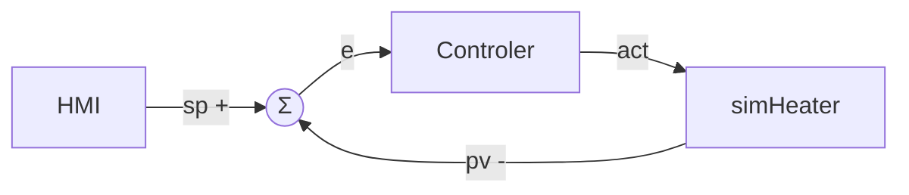
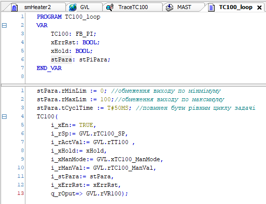
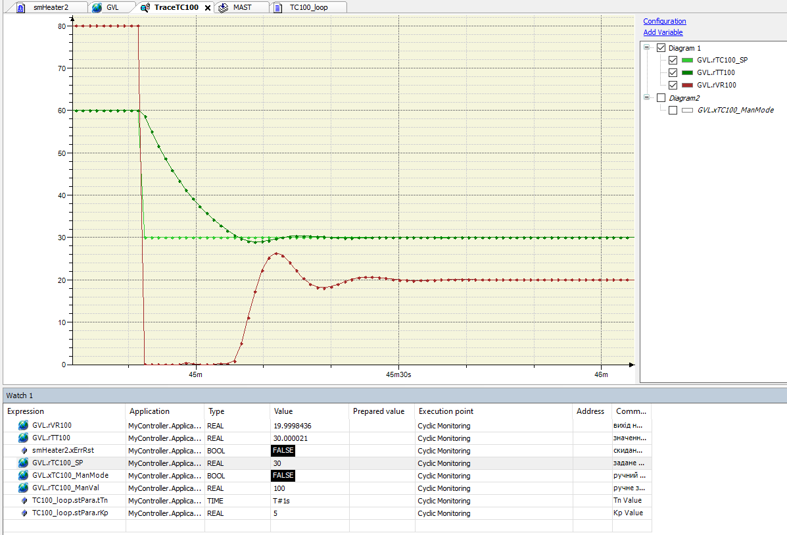

[<- До підрозділу](README.md)	[PLC MachineStruxure](../ecostruxuremachineexpert.md)	[Коментувати](#feedback)

# Основи ПІ регулювання з використанням Toolbox в Machine Expert : практична частина 

**Тривалість**: 1 год 

**Мета:** Навчитися використовувати блок FB_PI з бібліотеки Toolbox для реалізації простих контурів керування з пропорційно-інтегральним алгоритмом .

## Лабораторна установка.

**Необхідне апаратне забезпечення.** Для проведення лабораторних робіт необхідно мати комп’ютер з наступною мінімальною апаратною конфігурацією:

- CPU Intel/AMD 2 ГГц / RAM 16 ГБ / Диск 20 ГБ (вільних)  

**Необхідне програмне забезпечення.** 

1. EcoStruxure Machine Expert

**Загальна постановка задачі**. 

У даній роботі необхідно реалізувати простий контур регулювання з використанням FB_PI з бібліотеки Toolbox. Для цього в якості об'єкта керування використовується імітаційна модель теплообмінника, яка описана в [Імітаційна модель об'єкта в Machine Expert з використанням Filter_PT1: практична частина](../signcontrol/labmachexpert.md), і використовується в контурі регулювання замість реального об'єкту (`simHeater` на рис.1)  



рис.1. Приклад використання PT1 як імітаційної моделі процесу: `simHeater` - імітаційна модель теплообмінника, `Controller` - функціональний блок регулятора 

Цілі роботи: 

1) Створити імітаційну модель для перевірки роботи регулятору.
1) Створити та перевірити роботу POU для регулювання.  

## Послідовність виконання роботи

- [ ] Ознайомтеся з описом `FB_PI` в [ПІ та ПІД-регулювання в Toolbox в Machine Expert: теоретичні відомості](teormachexpert.md)

### 1. Розроблення імітаційної моделі

- [ ] Виконайте усі пункти з роботи [Імітаційна модель об'єкта в Machine Expert з використанням Filter_PT1: практична частина](../signcontrol/labmachexpert.md), або завантажте проєкт з лабораторної роботи, якщо Ви його вже зробили. 
- [ ] Перевірте працездатність імітаційних моделей.

### 2. Створення POU для регулювання 

- [ ] Добавте в GVL змінні:

```pascal
	rTC100_SP: REAL; //задане значення
	xTC100_ManMode: BOOL; //ручний режим регулятора
	rTC100_ManVal: REAL;//ручне завдання для регулятора
```

- [ ] Створіть POU з назвою `TC100_loop` типу Program на мові ST або CFC, прив'яжіть до задачі MAST 



рис.2.

- [ ] Скомпілюйте проєкт, завантажте в емулятор ПЛК.
- [ ] Створіть Trace, налаштуйте його на кілька 5 хвилин відображення, та накопичення даних через кожну секунду.
- [ ] За допомогою Trace та Watch, зробіть послідовно наступні дії, фіксуйте копіюванням екрану усі результати:
  - задайте коректні значення `Kp` та `Tn`
  - якщо регулятор видає помилку - скиньте помилку
  - перевірте роботу регулятору в ручному режимі
  - переключіть в автоматичний режим, подивіться на безударність переходу
  - змініть уставку поступово на 50% від діапазону, 20%, 70%, дочекайтеся завершення перехідних процесів
  - змінюючи налаштування  `Kp` та `Tn`, спробуйте зробити якість перехідного процесу краще 



рис.3.

- [ ] Збережіть проєкт.

### 3. Підготовка та відправлення звіту

-  На Google диску створіть папку з назвою `MyLabs`, якщо вона ще не створена, а в ній створіть папку `LabPI`. Посилання на папку `MyLabs` необхідно переслати викладачу для звітності.
-  У межах папки `LabPI` розмістіть файл проєкту.
-  У межах папки `LabPI` створіть Google документ з копіями екрану та іншими матеріалами, якщо такі потребуються.

## Автори


Практичне заняття розробив  [Олександр Пупена](https://github.com/pupenasan). 

## Feedback

Якщо Ви хочете залишити коментар у Вас є наступні варіанти:

- [Обговорення у WhatsApp](https://chat.whatsapp.com/BRbPAQrE1s7BwCLtNtMoqN)
- [Обговорення в Телеграм](https://t.me/+GA2smCKs5QU1MWMy)
- [Група у Фейсбуці](https://www.facebook.com/groups/asu.in.ua)

Про проект і можливість допомогти проекту написано [тут](https://asu-in-ua.github.io/atpv/) 