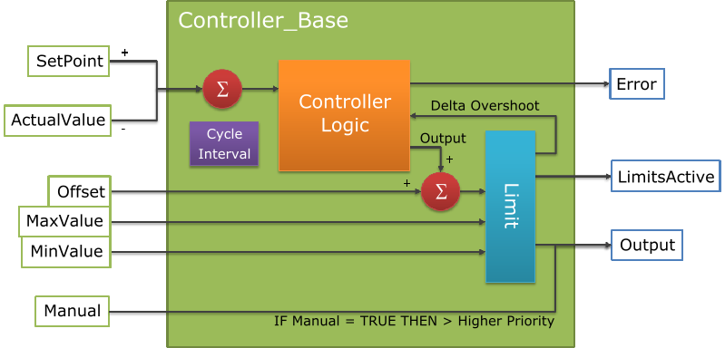
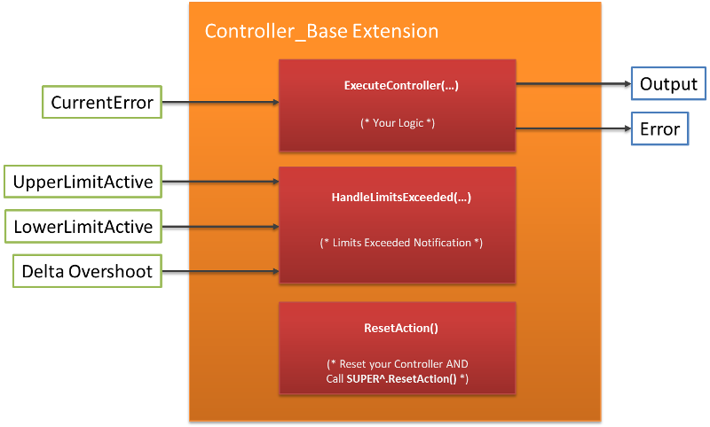
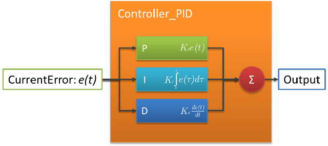

[<- До підрозділу](README.md)	[PLC MachineStruxure](../ecostruxuremachineexpert.md) 	[CODESYS (загальна)](../codesys.md)	[Коментувати](#feedback)

# ПІ та ПІД-регулювання в ControlLoopLibrary в CODESYS: теоретичні відомості

## Controller_Base

Представляє базовий функціональний блок регулятора. Він розширює `LConC` із `Common Behaviour Model` і містить спільні методи та властивості для будь-якого регулятора. Структуру базового регулятора наведено на рис. 1.

рис.1. 

Базовий регулятор забезпечує базову функціональність, зокрема додавання зсуву, обмеження виходу та обробку ручного режиму.
Крім того, він надає значення інтервалу циклу задачі, у межах якої працює. 

Індивідуально розроблені регулятори повинні розширювати цей базовий функціональний блок. Для створення власного регулятора необхідно розширити цей блок. Після цього відповідні функції базового блоку можуть бути переозначені для отримання індивідуальної поведінки регулятора. Детальніше див. рис.2. Він описує компонент `ControllerLogic` із наведеного вище рисунка більш детально. Індивідуально розроблені регулятори повинні викликати `SUPER^()`; під час виклику свого функціонального блока. Обмеження виконується базовим функціональним блоком регулятора. Функція `HandleLimitsExceeded(...)` є лише повідомленням про перевищення меж. Бібліотека надає засоби, що спрощують створення індивідуальних регуляторів. До них належать методи апроксимації інтегральної та диференціальної складових.

| Scope  | Name          | Type             | Коментар                                                     | Inherited from |
| ------ | ------------- | ---------------- | ------------------------------------------------------------ | -------------- |
| Input  | xEnable       | BOOL             | TRUE: активує визначену операцію; FALSE: перериває/скидає операцію | LConC          |
| Output | xBusy         | BOOL             | TRUE: операція виконується                                   | LConC          |
| Output | xError        | BOOL             | TRUE: досягнуто стану помилки                                | LConC          |
| Input  | lrActualValue | LREAL            | Представляє виміряне фактичне значення                       | —              |
| Input  | lrSetPoint    | LREAL            | Представляє бажане задане значення                           | —              |
| Input  | xManual       | BOOL             | TRUE: активує ручне задання lrOutput; FALSE: lrOutput обчислюється регулятором | —              |
| Input  | lrManualValue | LREAL            | Значення, яке передається в lrOutput, якщо xManual = TRUE    | —              |
| Input  | lrOffset      | LREAL            | Зсув, що додається до lrOutput (не впливає, якщо xManual = TRUE) | —              |
| Input  | lrMinValue    | LREAL            | Нижня межа lrOutput (без обмеження: встановити lrMinValue = lrMaxValue = 0) | —              |
| Input  | lrMaxValue    | LREAL            | Верхня межа lrOutput (без обмеження: встановити lrMinValue = lrMaxValue = 0) | —              |
| Output | lrOutput      | LREAL            | Керуючий вплив регулятора (завжди між lrMinValue та lrMaxValue) | —              |
| Output | xLimitsActive | BOOL             | TRUE: обчислене lrOutput перевищило межі; FALSE: lrOutput в межах | —              |
| Output | eErrorID      | Controller_Error | Поточна помилка                                              | —              |

## Controller_PID

PID-регулятор використовує значення розузгодження `e(t)`, яке безперервно обчислюється функціональним блоком `Controller_Base`.
Воно представляє різницю між заданим значенням (`setpoint`) та виміряною технологічною змінною.

PID-регулятор формує коригуючий вплив на основі пропорційної, інтегральної та диференціальної складових (зазвичай позначаються `P`, `I` та `D` відповідно), від яких і походить назва регулятора.

- `P` враховує поточні значення розузгодження. Наприклад, якщо розузгодження велике і додатне, керуючий вплив також буде великим і додатним.

- `I` враховує минулі значення розузгодження. Наприклад, якщо поточний вихід недостатньо сильний, інтеграл розузгодження накопичуватиметься з часом, і регулятор відповідатиме сильнішим впливом.

- `D` враховує можливі майбутні тенденції розузгодження на основі його поточної швидкості зміни.

Оскільки PID-регулятор спирається лише на фактично виміряну технологічну змінну, а не на знання про внутрішню модель процесу, він має широке застосування. Налаштовуючи три параметри моделі, PID-регулятор можна адаптувати до конкретних вимог процесу. Реакцію регулятора можна описати з точки зору його чутливості до розузгодження, ступеня перерегулювання та рівня коливань системи.

Використання алгоритму PID не гарантує оптимального керування системою або навіть її стійкості.

рис.1. 

| Scope  | Name              | Type             | Коментар                                                     | Успадковано від |
| ------ | ----------------- | ---------------- | ------------------------------------------------------------ | --------------- |
| Input  | xEnable           | BOOL             | TRUE: активує визначену операцію; FALSE: перериває/скидає операцію | LConC           |
| Output | xBusy             | BOOL             | TRUE: операція виконується                                   | LConC           |
| Output | xError            | BOOL             | TRUE: досягнуто стану помилки                                | LConC           |
| Input  | lrActualValue     | LREAL            | Представляє виміряне фактичне значення                       | Controller_Base |
| Input  | lrSetPoint        | LREAL            | Представляє бажане задане значення                           | Controller_Base |
| Input  | xManual           | BOOL             | TRUE: активує ручне задання lrOutput; FALSE: lrOutput обчислюється регулятором | Controller_Base |
| Input  | lrManualValue     | LREAL            | Значення, яке передається в lrOutput, якщо xManual = TRUE    | Controller_Base |
| Input  | lrOffset          | LREAL            | Зсув, що додається до lrOutput (не впливає, якщо xManual = TRUE) | Controller_Base |
| Input  | lrMinValue        | LREAL            | Нижня межа lrOutput (без обмеження: встановити lrMinValue = lrMaxValue = 0) | Controller_Base |
| Input  | lrMaxValue        | LREAL            | Верхня межа lrOutput (без обмеження: встановити lrMinValue = lrMaxValue = 0) | Controller_Base |
| Output | lrOutput          | LREAL            | Керуючий вплив регулятора (завжди між lrMinValue та lrMaxValue) | Controller_Base |
| Output | xLimitsActive     | BOOL             | TRUE: lrOutput вийшов за межі; FALSE: lrOutput в межах       | Controller_Base |
| Output | eErrorID          | Controller_Error | Поточна помилка                                              | Controller_Base |
| Input  | itfIntegrator     | Integrator       | Бажана апроксимація інтегратора                              | —               |
| Input  | itfDifferentiator | Differentiator   | Бажана апроксимація диференціатора                           | —               |
| Input  | lrKP              | LREAL            | Параметр пропорційної складової                              | —               |
| Input  | lrKI              | LREAL            | Параметр інтегральної складової                              | —               |
| Input  | lrKD              | LREAL            | Параметр диференціальної складової                           | —               |

## Джерела

1. https://product-help.schneider-electric.com/Machine%20Expert/V2.2/en/ControlLoopLibrary.pdf

## Автори

Теоретичне заняття розробив [Олександр Пупена](https://github.com/pupenasan). 

## Feedback

Якщо Ви хочете залишити коментар у Вас є наступні варіанти:

- [Обговорення у WhatsApp](https://chat.whatsapp.com/BRbPAQrE1s7BwCLtNtMoqN)
- [Обговорення в Телеграм](https://t.me/+GA2smCKs5QU1MWMy)
- [Група у Фейсбуці](https://www.facebook.com/groups/asu.in.ua)

Про проект і можливість допомогти проекту написано [тут](https://asu-in-ua.github.io/atpv/)
