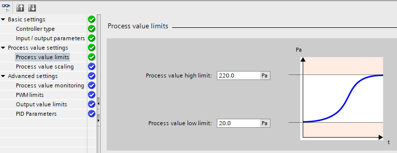
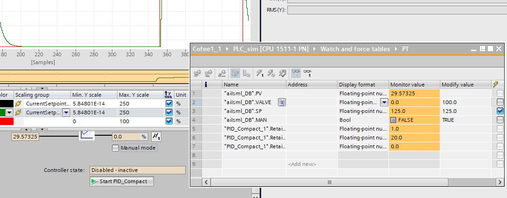
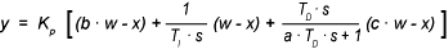

[<- До підрозділу](README.md)

# PID регулятор з PID_Compact V2: швидкий старт

Даний посібник дає стиснуту інформацію щодо структури, запуску і перевірки роботи регулятору PID_Compact V2  з вбудованої бібліотеки регулювання S7 1200/1500.  

## Структура контуру регулювання 

Для перевірки роботи регулятору треба створити та налаштувати контур регулювання, який складається з наступних елементів (рис.1):

- Функціональний блок `PID_Compact` в якості регулятору (в англ. регулятор це Controller)
- Функціональний блок `PT1` - змодельовані технологічні процеси (імітаційна модель) в якості керованої система (Controoled system) 
- за бажанням операторська панель (HMI) або SCADA  


рис.1. Структура контуру регулювання 

## Підготовка імітаційного об'єкта

Дослідження роботи регулятору варто робити разом з об'єктом. Оскільки передбачається, що дослідження проводиться на імітаторі ПЛК, то об'єкт регулювання має також імітуватися. Найбільш простим способом імітувати об'єкт - використати аперіодичну ланку 1-го порядку. У цьому прикладі використаємо для цього вбудований функціональний блок `Filter_PT1`  


рис.2. `Filter_PT1`  у бібліотеці TIA Portal

`Filter_PT1`  є пропорційним елементом передачі із затримкою першого порядку, який можна використовувати для різних цілей, зокрема: 

- для фільтрації сигналу з метою послаблення високочастотних шумів; 
- згладжування крокових змін сигналу, наприклад зміни уставки або вихідного значення регулятора; 
- моделювання технологічної змінної, що якраз використаємо нижче.

Для  `Filter_PT1`  можна вказати наступні параметри:

- Пропорційне посилення вхідного сигналу `Gain`, який є множником, тому при рівності `1.0` сигнал на виході після завершення перехідного процесу буде дорівнювати сигналу на вході, коли `<1.0` - буде послаблюватися, `>1` - підсилюватися 
- Постійна часу затримки `Lag` - задає  

На наступному рисунку показано ступінчату характеристику: реакцію виходу ($Output(t)$) блоку `Filter_PT1` на ступінчату зміну сигналу на вході ($\Delta Input$).


 рис.3. Реакція виходу  блоку `Filter_PT1` на ступінчату зміну сигналу. 

Наступна формула показує передаточну функцію аналогового елемента що моделюється аперіодичною ланкою першого порядку, де `s` дорівнює оператору Лапласа:

 

Взагалі є певні відмінності між ланкою першого порядку в неперервному часі та дискретним `Filter_PT1`, який виконується в програмі ПЛК. Але чим менший і постійніший час циклу, тим менша помилка невідповідності між властивостями цих елементів. Для нашого випадку це не принципово, а формулу вище наведено для повноти картини.   

Блок `Filter_PT1` має викликатися періодично, тому необхідно створити функціональний блок та викликати його в періодичному OB. 

- [ ] Cтворіть функціональний блок  `aiIsml` екземпляр якого `aiIsml_DB` викличте в `OB30`.  

```c
"aiIsml_DB"();
```

Надалі будемо вважати що імітується перепад тиску на вентиляторі, оберти якого будемо змінювати. 

- [ ] У інтерфейсі ФБ `aiIsml`  створіть наступні статичні змінні (рис.4). 


рис.4. Інтерфейс функціонального блоку `aiIsml_DB`  

Інтерфейс `aiIsml` включає: `LAG1` - це екземпляр  `Filter_PT1`, `#VALVE` - змінна що йде на виконавчий механізм, `#PV` - імітована змінна, інші змінні будуть використовуватися пізніше.  У програмі`"FirstScan"` - змінна яка встановлюється на один цикл при старті ПЛК (`%M1.0`).

- [ ] У ФБ `aiIsml` створіть програму, яка наведена нижче. 

```c
#LAG1.Gain := 2.5;
#LAG1.Lag := 5;
#LAG1(Input:= #VALVE,
      Reset := "FirstScan",
      Output => #PV);
```

Налагодження цієї частини програми передбачає зміну вхідної змінної об'єкту та перегляду зміни вихідної змінної. Якщо імітується робота операторської панелі, то значення змінної можна вивести на тренд. 

- [ ] Завантажте програму в імітатор ПЛК. Створіть Watch таблицю, внесіть туди  `PV` та `Valve` (рис.5). Змініть значення `Valve`  на 100%. Після часу ` #LAG1.Lag` вихідне значення буде `#PV:=#Valve*#LAG1.Gain`.  


рис.5. Таблиця Watch

## Створення та базові налаштування PID_Compact

Регулятор PID_Compact в TIA Portal створюється та конфігурується у розділі `Technology objects`. Щоб перевірити його роботу в імітаторі ПЛК, треба конфігурувати проект з S7 1500, так як імітатор S7 1200 не підтримує роботу даних функціональних блоків (мені дивна така поведінка, але це факт). 

- [ ] Створіть технологічний блок типу PID_Compact.   


рис.6. Створення екземпляру PID_Compact

Як видно з рис.6, даний функціональний блок має окремі посилання на налаштування (`Configuration`) і введення в дію та налагодження (`Commissioning`). Конфігурування доступне також через вікно інспектора редактора програмування. 

Виклик екземпляра `PID_Compact` повинен відбуватися тільки в OB циклічного переривання. У нашому випадку для цього створено `OB30` де вже викликається функціональний блок імітатора об'єкта. 

- [ ] Перетягніть технологічний об'єкт в OB30, перейдіть в налаштування через вбудований інспектор (курсор на імені -> вкладка Configuration, рис.7).     


рис.7. Виклик екземпляра PID_Compact

У вікні конфігурації (через налаштування або через вікно інспектора) налаштовуються параметри регулятору, зокрема: фізична величина, логіка керування, поведінка при запуску після скидання, уставку, значення процесу та вихідне значення. Задане значення (Setpoint), значення процесу (Input) та вихідне значення (Output) можна налаштувати тільки у вікні інспектора редактора програмування. Для цього можна вибрати джерело для кожного значення:

- Instance DB (екземплярний блок даних): використовується значення, збережене в екземплярі DB, яке оновлюється програмою користувача або через HMI.
- Instruction (Інструкція): використовується значення, пов’язане з інструкцією, яке записується в екземплярний DB кожного разу, коли викликається інструкція.


рис.8. Вибір джерела 

- [ ] Вкажіть входи як інструкції, вибравши режим масштабованих значень (не `_PER`). Поступовим заповненням вікна інспектора Ви отримаєте наступний код: 

```c
"aiIsml_DB"();
"PID_Compact_1"(Setpoint:="aiIsml_DB".SP, Input:="aiIsml_DB".PV, Output=>"aiIsml_DB".VALVE);
```


рис.9. Налаштування для прикладу

- [ ] У групі властивостей `Controoler type` змініть тип на `Pressure`. При старті CPU регулятор запуститься в ручному режимі (див. описи режимів нижче). У `process value limits` виставте межі вимірювальної величини для регулювання, наприклад від `20 Pa` до `220 Pa`. Також введіть обмеження на вихід регулятора `Output value high limit` рівним `90%`. 





рис.10. Інші налаштування для прикладу

- [ ] Налаштування `Reaction on Error` залиште без змін, про них буде написано в розділі "Режими роботи".

- [ ] Відкрийте вікно конфігурації, подивіться додаткові налаштування. Перейдіть на закладку з усіма параметрами функціонального блоку, познайомтеся зі змістом вкладки.


рис.11. Перегляд параметрів

- [ ] Ознайомтеся зі змістом екземплярного DB, через пункт `Open DB Editor` контекстного меню PID Cpmpact.

## Перше введення в дію PID_Compact

- [ ] Після створення базових налаштувань компілюйте та завантажте проект в імітатор ПЛК. 

Після цього можна налаштувати регулятор через вікно введення в дію `Commissioning`, яке викликається через відповідний пункт технологічного об'єкту  (рис.12). 

- [ ] Відкрийте вікно введення в дію. У цьому вікні включіть перегляд `Monitor All` та включіть самописець з дискретністю 1 с. 


рис.12. Запуск через вікно введення в дію

Для початку перевіримо роботу регулятора в ручному режимі (саме в такому він запустився). 

- [ ] Виставте значення виходу на `80%` і натисніть `Sends manual mode to the CPU`.  


рис.13. Зміна значення виходу в ручному режимі

- [ ] Перегляньте на самописці криву розгону (рис.14). Використовуючи кнопки керування самописцем, відмасштабуйте графік. 


рис.14. Крива розгону отримана в ручному режимі. 

- [ ] Змініть значення на `0%` і дочекйтеся усталеного режиму. Натиснувши `Stop`, та знову `Run` можна перезапустити самописець.

- [ ] Для запуску регулятора необхідно зніміть опцію `Manual Mode` і запустіть регулятор кнопкою `Strt PID_Compact` (рис.15). Змініть завдання SP у `Watch Table` рівним `125`.  

 

рис.15. Запуск автоматичного режиму.

- [ ] Дочекайтеся, коли регулятор досягне свого значення, це буде десь через хвилину.  


 рис.16. Перехідний процес контуру регулювання з параметрами регулятора за замовченням 

## Параметри ПІД-регулятора

Параметри `PID_Compact` відображаються у вікні конфігурації «PID Parameters». 

- [ ] Перегляньте значення параметрів регулятору, які наразі є за замовченням (рис.17). 


рис.17. Вікно параметрів PID зі значеннями за замовчуванням

Передбачається що ці параметри будуть адаптовані до керованої системи під час авто-налаштування регулятора.  Але їх можна вводити вручну за необхідності. Для PID_Compact V2 параметри знаходяться у структурі `Retain.CtrlParams`, змінювати їх можна в онлайн, але бажано в режимі "Inactive", щоб запобігти помилок розрахунку регулятора. Якщо необхідно змінити параметри PID в онлайн в режимі в "Automatic mode" або "Manual mode" , необхідно це робити наступним чином: змінити параметри PID у структурі `CtrlParamsBackUp` і застосувати ці зміни за допомогою `LoadBackUp = TRUE` до структури `Retain.CtrlParams`. Онлайн-зміни параметрів PID в "Automatic mode" можуть призвести до стрибків вихідного значення.

Алгоритм PID працює за таким рівнянням:

 

| величина | призначення                                                  |
| -------- | ------------------------------------------------------------ |
| y        | Вихідне значення алгоритму ПІД  (Output)                     |
| x        | Плинне (дійсне) значення процесу (Input)                     |
| w        | Задане значення (Setpoint)                                   |
| Kp       | Коефіцієнт пропорційності. PID_Compact не працює з негативними значеннями `Kp`, натомість напрям регулювання змінюється через `Invert Control Logic` |
| TI       | Стала часу інтегрування (с). Якщо TI = 0.0, то складова відключається, а інтегральна складова обнуляється. |
| TD       | Стала часу диференціювання (с). Якщо TD = 0.0, то складова відключається. |
| b        | Вага уставки пропорційної складової. Приймає значення від 0.0 до 1.0 і призначена дія послаблення ефекту зміни заданого значення. При 1.0  - звичайний ефект, при 0.0 - пропорційна складова не реагує на зміну заданого значення (але інші складові реагують). Пропорційна складова завжди реагує на зміну плинного значення процесу. |
| a        | Коефіцієнт запізнення похідної (derivative delay T1 = a × TD). При 0.0 - диференційна складова діє лише протягом одного циклу, і тому майже не ефективна. При 0.5 корисне на практиці для керованих систем з однією домінуючою постійною часу. При  > 1.0 зі збільшенням коефіцієнту довше затримує ефект диференційної складової. |
| c        | Вага уставки диференційної складової. Приймає значення від 0.0 до 1.0 і призначена дія послаблення ефекту зміни заданого значення. При 1.0  - звичайний ефект, при 0.0 - диференційна складова не реагує на зміну заданого значення (але інші складові реагують). Диференційна складова завжди реагує на зміну плинного значення процесу. |
| s        | Оператор Лапласа                                             |

Схема роботи алгоритму наведена на рис.18.

 

рис.18. Схема `PID Compact`

Час дискретизації алгоритму ПІД (`Sampling time of PID algorithm sampling time`) - вказує на період з яким розраховується вихідне значення. Керованій системі потрібен певний час, щоб відреагувати на зміни вихідного значення, тому не рекомендується обчислювати вихідне значення в кожному циклі виклику регулятору (наприклад в OB30). Він розраховується під час налаштування та округлюється до кратного значення часу циклу. Усі інші частини PID_Compact обробляються при кожному виклику. 

При використанні `Output_PWM` час дискретизації алгоритму PID використовується як період часу широтно-імпульсної модуляції. Точність вихідного сигналу визначається відношенням часу дискретизації алгоритму ПІД до часу циклу ОВ. Тому рекомендовано, щоб тривалість циклу в цьому випадку становила максимум одну десяту часу вибірки алгоритму ПІД.

Усі параметри PID зберігаються при вимкненому живленні (retentive). Якщо параметри PID змінюються вручну, необхідно повністю завантажити `PID_Compact`.

## Режими роботи регулятору `PID Compact`

Окрім класичних ручного та автоматичного режиму `PID Compact` має ще кілька режимів (станів), які відображаються у вихідній змінній `State`. Перехід з режиму в режим можливий за переднім фронтом входу `ModeActivate`, а сам режим задається у параметрі in-out `Mode`. При старті ПЛК `PID_Compact` запускається в тому робочому режимі, який зберігається в параметрі `Mode`. Щоб залишити PID_Compact у неактивному режимі при старті, необхідно установити `RunModeByStartup = FALSE`. Розглянемо перелік режимів.

0 - **Inactive** (неактивний) . У цьому режимі роботи вихідне значення завжди дорівнює 0.0, незалежно від ПІД та без урахування `Config.OutputUpperLimit` і `Config.OutputLowerLimit`. Широтно-імпульсна модуляція також вимкнена.

1 - **Pretuning** (попереднє налаштування). У цьому режимі шукаються наближені значення коефіцієнтів регулятора (див. нижче). 

2 - **Fine tuning** (точне налаштування). У цьому режимі шукаються найкращі згідно алгоритму пошуку значення коефіцієнтів регулятора (див. нижче).

3 - **Automatic mode** (автоматичний). У цьому режимі `PID_Compact` коригує керовану систему відповідно до заданих параметрів і роботи ПІД. Регулятор переходить в автоматичний режим, якщо виконується одна з наступних вимог:

- Попереднє налаштування успішно завершено
- Точне налаштування успішно завершено
- In-out параметр `Mode`  змінено на значення `3`,  і по передньому фронту на `ModeActivate`.

Перемикання з автоматичного режиму на ручний відбувається безперебійно тільки у випадку, якщо воно виконується на сторінці введення в експлуатацію. В автоматичному режимі враховується тег `ActivateRecoverMode`.

4 - **Manual mode** (ручний). У цьому режимі вихідне значення задається вручну через `ManualValue`. Рекомендується змінювати цей режим роботи лише за допомогою `Mode` та `ModeActivate`, але його можна активувати за допомогою `ManualEnable = TRUE`.  Перемикання з ручного режиму на автоматичний здійснюється безударно. Ручний режим доступний навіть при роботі регулятора з помилкою.

5 - **Substitute output value with error  monitoring** (заміна виходів з моніторингом помилки). Цей режим роботи активується автоматично, коли виникає помилка регулювання. У цьому режимі алгоритм керування вимкнено так само як і в неактивному. Але натомість на вихід буде подаватися значення-замінник, яке залежить від булевого параметра `SetSubstituteOutput`:

- якщо `SetSubstituteOutput = FALSE`, то на виході буде останнє дійсне вихідне значення
- якщо `SetSubstituteOutput = TRUE`, то на виході буде значення `SubstituteOutput` 

Вручну цей режим активувати неможливо. Цей режим активується за наступних умов:

- Активний автоматичний режим (3)
- Параметр `ActivateRecoverMode = TRUE`
- Сталася одна або кілька помилок, у яких діє `ActivateRecoverMode`.

Як тільки помилки зникають, PID_Compact повертається в автоматичний режим. Якщо перші дві умови не виконуються, але виникає помилка, то регулятор переходить в неактивний режим,  

## Автоматичне налаштування регулятору

`PID_Compact` передбачає можливість автоматичного налаштування параметрів регулятора. Знаходження найкращих параметрів ПІД регулятора проводиться в два етапи: попереднього та точного налаштування.

### Попереднє налаштування

Попереднє налаштування (Pretuning) визначає реакцію процесу на стрибкоподібну зміну вихідного значення та шукає точку перегину. Параметри PID розраховуються з максимальної швидкості наростання та часу запізнення керованої системи.  Варто зауважити, що чим стабільніше при цьому значення процесу, тим легше обчислити параметри ПІД і тим точнішим буде результат. Тому треба уникати або зменшувати вплив шумів на значенні  процесу.  Для запуску попереднього налаштування повинні бути задоволені наступні вимоги: 

- Вхід `ManualEnable = FALSE`

- Вхід `Reset = FALSE`

- PID_Compact знаходиться в одному з наступних режимів (значення `State`): "Inactive" (0), "Manual mode" (4), або "Automatic mode" (3)

- Задане значення та значення процесу знаходяться в межах налаштованих меж (див. конфігурацію "Process value monitoring").

- Різниця між заданим значенням і значенням процесу перевищує 30% різниці між верхньою межею значення процесу та нижньою межею значення процесу.

  ```
  |Setpoint - Input| > 0.3 * |Config.InputUpperLimit - Config.InputLowerLimit| 
  ```

- Різниця між заданим значенням і значенням процесу становить > 50% заданого значення.

  ```
  |Setpoint - Input| > 0.5 * |Setpoint|
  ```

Отже в нашій задачі для початку необхідно забезпечити умови виконання для запуску попереднього налаштування. Спочатку визначимо діапазон вимірювальної величини 

```
|Config.InputUpperLimit - Config.InputLowerLimit| = 220 - 20 = 200 Pa
```

Якщо припустити що `Setpoint = 125 Pa`, то має забезпечуватися умова 

```
|Setpoint - Input| > 0.3 * 200 => |125 Pa - Input| > 60 Pa => Input < 65 Pa  
```

А також друга умова:

```
|125 Pa - Input| > 0.5 * 125 Pa => Input < 62.5 Pa 
```

Отже необхідно забезпечити щоб плинне значення перед запуском попереднього налаштування було: Input < 62.5 Pa. 

- [ ] Задайте в ручному режимі на вихід `20%`. Після завершення перехідного процесу `Input = 50.0`. Протягом всього часу в полі `Tuning Status Error` буде світитися помилка виходу значення за діапазон (рис.19). Після досягнення необхідного значення, кнопка підтвердження `ErrorAck` скине помилку, що вкаже на можливість запуску автоналаштування (`Tuning has not been started yet.`). 


рис.19. Встановлення необхідного значення для запуску попереднього налаштування регулятору. 

- [ ] Натисніть `Tuning mode` для запуску налаштування.


рис.20. Кнопка запуску налаштування


рис.21. Прогрес автоналаштування

- [ ] Дочекайтеся завершення автоналаштування, у полі статусу відображатиметься `System tuned`, а регулятор перейде в автоматичний режим. Якщо попереднє налаштування не вдалось, перемикання режиму роботи залежить від `ActivateRecoverMode`.


рис.22. Параметри регулятору після попереднього автоналаштування

Перед повторним обчисленням параметрів PID створюється резервна копія, і їх можна повторно активувати за допомогою `LoadBackUp`.

### Точне налаштування

Точне налаштування створює постійне обмежене коливання значення процесу. Параметри ПІД перераховуються на основі амплітуди та частоти цього коливання. Параметри ПІД-регулювання від точного налаштування зазвичай мають кращі характеристики основного керування та збурень, ніж параметри ПІД-регулювання від попереднього налаштування. Ви отримуєте найкращі параметри ПІД, коли виконуєте спочатку попереднє а потім точне налаштування. PID_Compact автоматично намагається генерувати коливання, що перевищує шум значення процесу. Стабільність значення процесу лише мінімально впливає на точне налаштування.

Уставка закріплена в `CurrentSetpoint`. Налаштування скасовується, коли:

- Setpoint > CurrentSetpoint + CancelTuningLevel
 або
- Setpoint < CurrentSetpoint - CancelTuningLevel

Перед повторним обчисленням параметрів PID створюється резервна копія, і їх можна повторно активувати за допомогою LoadBackUp.

Запуск точного налаштування можна зробити з автоматичного режиму. Якщо він запускається з ручного або неактивного режиму регулятору, тоді буде спочатку проведене попереднє налаштування, після чого запуститься точне. 

- [ ] У `Tuning Mode` виберіть точне налаштування, та натисніть кнопку `Start`. По завершенню у полі статусу відобразиться `System tuned.`


рис.23. Параметри регулятору після точного автоналаштування

- [ ] Для завантаження параметрів в проект, натисніть кнопку `Upload PID Parameters`, після чого дійсні значення стануть значеннями за замовченнями. Далі зміни в проекті завантажте в ПЛК.


рис.24. Вивантаження налаштованих параметрів в проект 

- [ ] Для перевірки роботи регулятору, змініть значення завдання до 60 Pa. Перехідний процес триватиме близько 10 секунд


 рис.25. Перехідний процес після точного налаштування регулятора.  

## Керування режимом руч/авт ззовні

- [ ] Для можливості керування регулятором зовнішніми засобами HMI, змініть програму до наступного вигляду:

```c
"aiIsml_DB"();
"PID_Compact_1"(Setpoint:="aiIsml_DB".SP,
                Input:="aiIsml_DB".PV,
                ManualEnable:="aiIsml_DB".MAN, //ручний режим
                ManualValue:="aiIsml_DB".VALVE, //ручне значення = вихід на ВМ
                Output=>"aiIsml_DB".VALVE);
```

- [ ] Перевірте чи можна за допомогою змінних ручного завдання та переключення режимів впливати роботу регуляторів.

Практичне заняття розробив [Олександр Пупена](https://github.com/pupenasan). 


Якщо Ви хочете залишити коментар у Вас є наступні варіанти:

- [Обговорення у WhatsApp](https://chat.whatsapp.com/BRbPAQrE1s7BwCLtNtMoqN)
- [Обговорення в Телеграм](https://t.me/+GA2smCKs5QU1MWMy)
- [Група у Фейсбуці](https://www.facebook.com/groups/asu.in.ua)

Про "народний посібник АТПВ" написано [тут](https://asu-in-ua.github.io/atpv/)
