[<- До підрозділу](README.md)	[PLC MachineStruxure](../ecostruxuremachineexpert.md)  [Коментувати](#feedback)

# ПІ та ПІД-регулювання в Toolbox в Machine Expert: теоретичні відомості

## FB_P: Контур керування з пропорційним алгоритмом

На рисунку показано схему контактів функціонального блока `FB_P`.

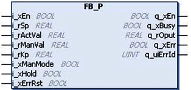

Функціональний блок `FB_P` призначений для реалізації контуру керування з пропорційним алгоритмом. Цей функціональний блок формує пропорційну реакцію, тобто вихід дорівнює добутку похибки регулювання на коефіцієнт підсилення.

У автоматичному режимі вихід здається передавальною функціє.

G(s) = Kp

де, 

- `Kp` - Пропорційний коефіцієнт підсилення

- `q_rOput` - G(s) × похибка процесу

У ручному режимі вихід функціонального блока `q_rOput` встановлюється рівним `i_rManVal`.

На рисунку показано функціональну схему функціонального блока `FB_P`.

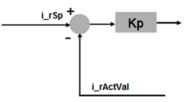

На рисунку показано часову діаграму функціонального блока `FB_P`.

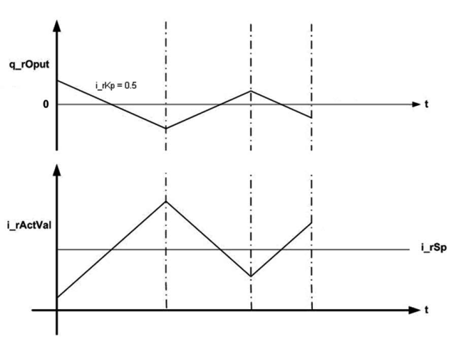

Некоректний параметр на входах функціонального блока призводить до виявлення помилки та формування відповідного ідентифікатора помилки. Під час стану виявленої помилки вихідні значення встановлюються в нуль. Помилку можна скинути лише по фронту наростання входу `i_xErrRst`. Вихід `q_xBusy` має значення TRUE, коли функціональний блок увімкнений і відсутня виявлена помилка.

| Вхід       | Тип даних | Опис                                                         |
| ---------- | --------- | ------------------------------------------------------------ |
| i_xEn      | BOOL      | TRUE: вмикає функціональний блокFALSE: функціональний блок вимкнений |
| i_rSp      | REAL      | Значення уставки процесуДіапазон: ±3.4e+38                   |
| i_rActVal  | REAL      | Поточне значення процесуДіапазон: ±3.4e+38                   |
| i_rManVal  | REAL      | Вхідне значення для ручного режимуДіапазон: ±3.4e+38(Необов’язковий вхід) |
| i_rKp      | REAL      | Пропорційний коефіцієнт підсиленняДіапазон: 0…3.4e+38        |
| i_xManMode | BOOL      | TRUE: функціональний блок у ручному режиміFALSE: функціональний блок в автоматичному режимі(Необов’язковий вхід) |
| i_xHold    | BOOL      | TRUE: утримує внутрішній стан і вихід функціонального блока на поточному значенніFALSE: вимкнено(Необов’язковий вхід) |
| i_xErrRst  | BOOL      | Скидання виявленої помилки (по фронту наростання)(Необов’язковий вхід) |

| Вихід     | Тип даних | Опис                                                         |
| --------- | --------- | ------------------------------------------------------------ |
| q_xEn     | BOOL      | TRUE: функціональний блок увімкненийFALSE: вимкнений         |
| q_xBusy   | BOOL      | TRUE: функціональний блок активний і відсутня виявлена помилкаFALSE: функціональний блок вимкнений або виявлена помилка |
| q_rOput   | REAL      | Вихід функціонального блокаДіапазон: ±3.4e+38                |
| q_xErr    | BOOL      | Сигнал виявленої помилки                                     |
| q_uiErrId | UINT      | Номер виявленої помилки, якщо встановлено q_xErr:0: помилки не виявлено1: некоректні значення параметра (якщо i_rKp < 0)2: внутрішня виявлена помилка (функціональний блок у невідомому стані) |

`q_uiErrId` - Це унікальне ціле значення вказує на конкретну виявлену помилку.

| ID виявленої помилки | Опис                                                         |
| -------------------- | ------------------------------------------------------------ |
| 0                    | Помилки не виявлено                                          |
| 1                    | Некоректні значення параметра (i_rKp < 0)                    |
| 2                    | Внутрішня виявлена помилка (функціональний блок у невідомому стані) |

## FB_PI: Контур керування з пропорційно-інтегральним алгоритмом

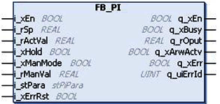

Функціональний блок `FB_PI` є стандартним PI-регулятором з ручним налаштуванням, функцією утримання (`hold`) та захистом від накопичення інтегральної складової (`anti reset wind-up`). PI-регулятор формує керувальний вплив на основі похибки процесу (`похибка процесу = уставка – поточне значення`). За допомогою налаштувань параметрів функціонального блока можна відрегулювати вихід для зменшення похибки процесу.

Пропорційна та інтегральна складові процесу обчислюються безперервно на основі поточного значення, уставки та вхідних параметрів. Функціональний блок також обмежує керувальний вихід відповідно до встановлених меж. 

Функціональний блок має викоикатися періодично, період виклику задається в параметрі `tCyclTime` структурного вхідного параметру `i_stPara`. Якщо задача, в якій викликається FB_PI, призначена як циклічна, то значення tCyclTime має бути однаковим із часом циклу задачі.

Наведене нижче рівняння є передавальною функцією функціонального блока `FB_PI`:
$$
G(s) = K_p \left( 1 + \frac{1}{s T_n} \right)
$$
де:

`Kp` = пропорційний коефіцієнт підсилення
`sTn` = інтегральна стала часу

На рисунку показано функціональну схему функціонального блока `FB_PI`.

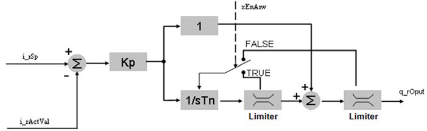

Цей функціональний блок використовується для керування замкненими контурами з неперервними вхідними та вихідними змінними.

Некоректний параметр на входах функціонального блока призводить до виявлення помилки та формування відповідного ідентифікатора помилки. Під час стану виявленої помилки вихідне значення встановлюється в нуль. Помилку можна скинути лише по фронту наростання входу `i_xErrRst`. Вихід `q_xBusy` має значення `TRUE`, коли функціональний блок увімкнений і відсутня виявлена помилка.

| Вхід       | Тип даних       | Опис                                                         |
| ---------- | --------------- | ------------------------------------------------------------ |
| i_xEn      | BOOL            | TRUE: вмикає функціональний блок FALSE: вимикає функціональний блок |
| i_rSp      | REAL            | Значення уставки Діапазон: ±3.4e+38                          |
| i_rActVal  | REAL            | Поточне значення Діапазон: ±3.4e+38                          |
| i_rManVal  | REAL            | Значення для ручного режиму Діапазон: ±3.4e+38 (Необов’язковий вхід) |
| i_xManMode | BOOL            | Ручний режим (Необов’язковий вхід)                           |
| i_xHold    | BOOL            | Утримання (hold) (Необов’язковий вхід)                       |
| i_xErrRst  | BOOL            | Скидання виявленої помилки (по фронту наростання)(Необов’язковий вхід) |
| i_stPara   | STRUCT stPiPara | Структура параметрів(Див. опис stPiPara, стор. 47)           |

| Вихід      | Тип даних | Опис                                                         |
| ---------- | --------- | ------------------------------------------------------------ |
| q_xEn      | BOOL      | TRUE: функціональний блок увімкнений                         |
| q_xBusy    | BOOL      | TRUE: функціональний блок активний і відсутня виявлена помилка FALSE: функціональний блок вимкнений або виявлена помилка |
| q_rOput    | REAL      | Обчислений PI-вихід Діапазон: ±3.4e+38                       |
| q_xArwActv | BOOL      | TRUE: вихід обмежений, активовано захист від накопичення інтегральної складової (anti reset wind-up) |
| q_xErr     | BOOL      | Сигнал виявленої помилки                                     |
| q_uiErrId  | UINT      | Ідентифікатор виявленої помилкиДіапазон: 0…5                 |

`q_uiErrId` - Це унікальне ціле значення вказує на конкретну виявлену помилку.

| ID виявленої помилки | Опис                                                         |
| -------------------- | ------------------------------------------------------------ |
| 0                    | Помилки не виявлено                                          |
| 1                    | Некоректний час циклу задачі = 0                             |
| 2                    | Некоректний параметр i_rOputMaxLim ≤ i_rOputMinLim           |
| 3                    | Некоректний параметр i_rKp < 0                               |
| 4                    | Некоректний параметр tTn = 0                                 |
| 5                    | Внутрішня виявлена помилка (функціональний блок у невідомому стані) |

### Парамерти регулятору `stPiPara`

| Елемент структури | Тип даних | Опис                                                         |
| ----------------- | --------- | ------------------------------------------------------------ |
| tCyclTime         | TIME      | Інтервал часу між двома послідовними виконаннями функціонального блока. Якщо задача призначена як циклічна, то це значення дорівнює часу циклу відповідної циклічної задачі. Діапазон: 10 мс…60 с |
| xEnArw            | BOOL      | Увімкнення захисту від накопичення інтегральної складової (anti reset wind-up) (див. опис нижче) |
| tTn               | TIME      | Час інтегральної дії Діапазон: 1…1e32 мс                     |
| rKp               | REAL      | Значення пропорційного коефіцієнта підсилення Діапазон: ±3.4e+38 |
| rMaxLim           | REAL      | Максимальне обмеження виходу Діапазон: ±3.4e+38              |
| rMinLim           | REAL      | Мінімальне обмеження виходу Діапазон: ±3.4e+38               |

### Ручний та автоматичний режим

Вхід `i_xManMode` визначає ручний режим роботи функціонального блока `FB_PI`. Якщо функціональний блок увімкнений і ручний режим встановлено в TRUE, тоді функціональний блок встановлює ручне значення (`i_rManVal`) як PI-вихід і зупиняє виконання PI-алгоритму, як показано на структурній схемі блока в ручному режимі.

Якщо увімкнено автоматичний режим, PI-алгоритм виконується безперервно.

На рисунку показано часову діаграму роботи функціонального блока в ручному режимі.

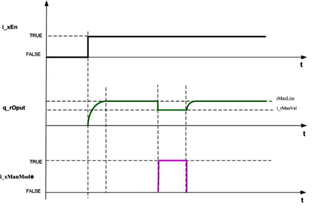

### Режим утримання (Hold)

Вхід `i_xHold` утримує PI-вихід на поточному рівні. Якщо цей вхід має значення TRUE, тоді PI-вихід зберігається на останньому значенні, а внутрішні обчислення PI-алгоритму зупиняються, як показано на структурній схемі функціонального блока в режимі `hold`.

Якщо цей вхід має значення FALSE, PI-алгоритм виконується циклічно. Нове значення PI-виходу обчислюється на основі попереднього значення.

Часова діаграма роботи функціонального блока в режимі hold:

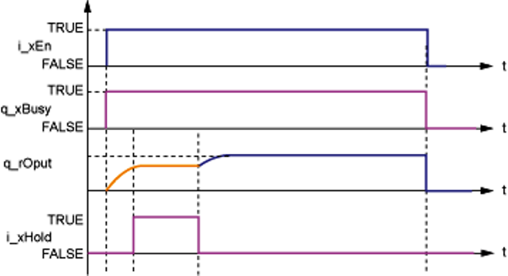

### Антинакопичення інтегратора (ARW).

`xEnArw` вмикає режим anti reset wind-up (ARW). Якщо значення FALSE, інтегральна складова утримується, коли весь керувальний вихід досягає обмеження. Якщо значення TRUE, функціональний блок утримує інтегральну складову лише тоді, коли саме інтегральна частина досягає обмеження. У цьому випадку вихід дорівнює сумі граничного значення та пропорційної складової, якщо інтегральна частина досягає межі, як показано на структурній схемі блока в режимі `Enable ARW`.

На рисунку показано роботу функціонального блока в режимі Enable ARW.

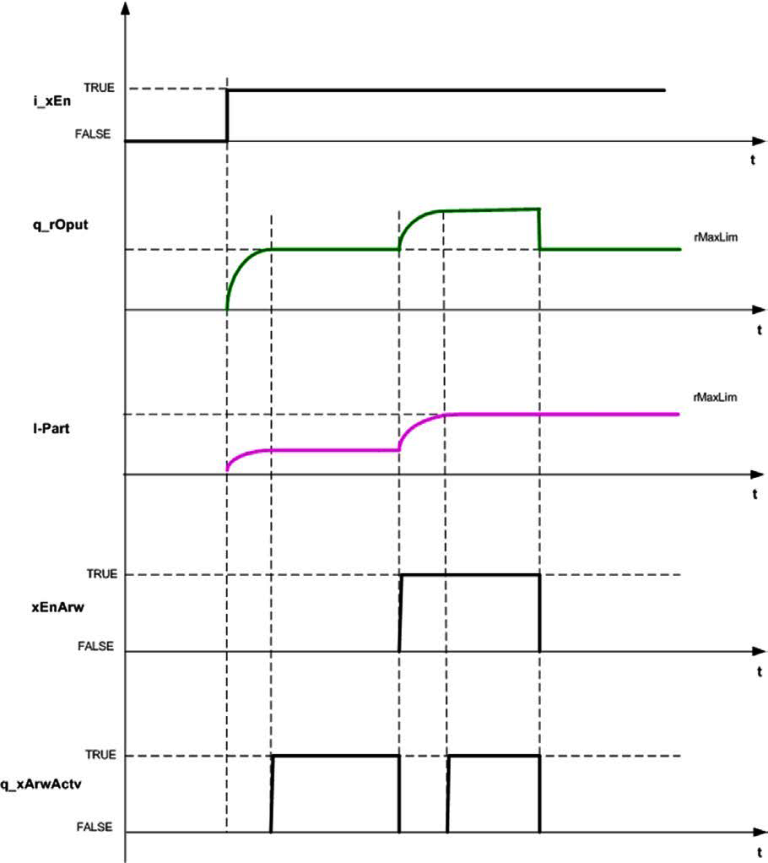

## FB_PID: Контур керування з ПІД-алгоритмом із ручним режимом

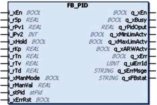

Функціональний блок `FB_PID` є стандартним PID-регулятором із ручним налаштуванням, функцією утримання (hold), безударним переходом (`bumpless transfer`) та часом демпфування для диференціальної складової. Цей функціональний блок має подібні до FB_PI можливості та налаштування, а також забезпечує такі можливості:

- Різні режими роботи: P, PI, PD та PID.
- Ручний режим для керування виходом PID ручним завданням.
- Захист від накопичення інтегральної складової (`anti reset wind-up`), щоб уникнути насичення або «розгону» інтегральної частини. Якщо керувальна змінна досягає межі виконавчого механізму, похибка процесу продовжує інтегруватися, і формується дуже велика інтегральна складова — це явище називається `windup`.
- Час демпфування (`Td`) для зменшення перерегулювання, спричиненого диференціальною складовою.
- Безударний перехід активується під час зміни режиму з ручного на автоматичний. Він запобігає різкій зміні PID-виходу при зміні режиму.
- Формування стану виявленої помилки для індикації помилок функціональним блоком.
- Використання внутрішнього та зовнішнього вікон в інтегральних обчисленнях. 
  - Якщо абсолютне значення похибки процесу менше за внутрішнє вікно, інтегральна складова масштабується з коефіцієнтом [`ABS(err) / Inner Window`]. Це зменшує перерегулювання PID-виходу.
  - Якщо абсолютне значення похибки процесу більше за внутрішнє вікно, але менше за зовнішнє, інтегральні обчислення виконуються у звичайному режимі.
  - Якщо абсолютне значення похибки процесу перевищує зовнішнє вікно, активується захист від накопичення інтегральної складової, і інтегральний вихід утримує останнє значення.

Наведене нижче рівняння показує вихід PID-регулятора:
$$
y(t) = K_p \left( e(t) + \frac{1}{T_n} \int e(t)\,dt + \frac{T_v}{1 + T_d}\,\frac{de(t)}{dt} \right)
$$

- y(t) = вихід PID-регулятора
- Kp = пропорційний коефіцієнт підсилення
- Tn = інтегральна стала часу
- Tv = диференціальна стала часу
- Td = час фільтрації диференціальної складової
- e(t) = похибка процесу між уставкою та значенням зворотного зв’язку

На рисунку показано структурну схему функціонального блока FB_PID.

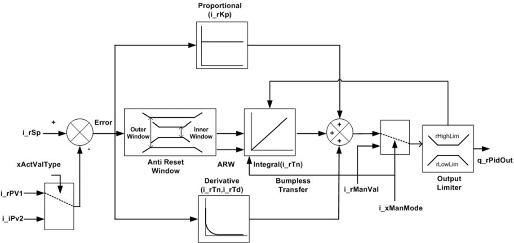

| Вхід       | Тип даних     | Опис                                                         |
| ---------- | ------------- | ------------------------------------------------------------ |
| i_xEn      | BOOL          | TRUE: вмикає функціональний блок FB_PID FALSE: вимикає функціональний блок FB_PID, вихід PID встановлюється в нуль, стан виявленої помилки (`q_xErr`) очищується, а ідентифікатор помилки (`q_uiErrId`) встановлюється в 0. |
| i_rSp      | REAL          | Уставка Діапазон: ±3.4e+38                                   |
| i_rPv1     | REAL          | Значення зворотного зв’язку від процесу Діапазон: ±3.4e+38   |
| i_iPv2     | INT           | Значення зворотного зв’язку від процесу Діапазон: -32768…32767 |
| i_xHold    | BOOL          | TRUE: утримує вихід PID на поточному рівні та зупиняє обчислення PID. Дивися опис FB_PI FALSE: нормальна робота в режимі PID (Необов’язковий вхід) |
| i_rKp      | REAL          | Пропорційний коефіцієнт підсилення для PID Діапазон: 0…3.4e+38 |
| i_rTn      | REAL          | Час інтегральної дії для PID Діапазон: 0…60000 мс            |
| i_rTv      | REAL          | Час диференціальної дії для PID Діапазон: 0…60000 мс         |
| i_rTd      | REAL          | Час демпфування диференціальної складової Діапазон: `60000 > i_rTd > i_stPid.rTargCyclTime` |
| i_xManMode | BOOL          | TRUE: ручний режим FALSE: автоматичний режим (заводське налаштування) (Необов’язковий вхід) відповідно до режиму безударного переходу, вихід PID починається з `i_rManVal`, після чого запускається виконання PID-алгоритму (див. опис FB_PI). |
| i_rManVal  | REAL          | Ручне значення виходу PID, якщо `i_xManMode = TRUE` Діапазон: ±3.4e+38 (Необов’язковий вхід) |
| i_stPid    | STRUCT st_Pid | Структура параметрів                                         |
| i_xErrRst  | BOOL          | TRUE: скидання виявленої помилки (Необов’язковий вхід) Скидання помилки по фронту наростання |

| Вихід         | Тип даних | Опис                                                         |
| ------------- | --------- | ------------------------------------------------------------ |
| q_xEn         | BOOL      | TRUE: функціональний блок увімкнений FALSE: функціональний блок вимкнений |
| q_xBusy       | BOOL      | TRUE: PID активний і внутрішня помилка відсутня FALSE: PID неактивний або виявлена помилка |
| q_rPidOput    | REAL      | Вихід PID-регулятора Діапазон: `i_stPid.rLowLim`…`i_stPid.rHighLim` |
| q_xMinLimActv | BOOL      | TRUE: вихід PID менший або дорівнює `i_stPid.rLowLim` (мінімальна межа) FALSE: вихід PID більший за `i_stPid.rLowLim` |
| q_xMaxLimActv | BOOL      | TRUE: вихід PID більший або дорівнює `i_stPid.rHighLim` (максимальна межа) FALSE: вихід PID менший за `i_stPid.rHighLim` |
| q_xARWActv    | BOOL      | TRUE: активовано захист від накопичення інтегральної складової (anti reset wind-up) FALSE: захист не активний |
| q_xErr        | BOOL      | TRUE: функціональний блок виявив помилку FALSE: помилки не виявлено |
| q_uiErrId     | UINT      | Ідентифікатор виявленої помилки, якщо встановлено `q_xErr` Діапазон: 0, 100, 103, 104, 105, 106, 107 |
| q_sErrMsg     | STRING    | Повідомлення про виявлену помилку                            |
| q_sFBstat     | STRING    | Стан функціонального блока                                   |

### Параметри регулятору `stPid`

| Елемент структури | Тип даних | Опис                                                         |
| ----------------- | --------- | ------------------------------------------------------------ |
| xActValType       | BOOL      | TRUE: `i_rPv1` є значенням процесу FALSE: `i_iPv2` є значенням процесу |
| rDbnd             | REAL      | Значення зони нечутливості для внутрішнього обчислення похибки процесу Діапазон: 0.0…100.0(Необов’язковий параметр) |
| rTargCyclTime     | REAL      | Цільовий час циклу Діапазон: `60000.0 > rTargCyclTime > 0.0` Одиниця вимірювання: мс |
| rLowLim           | REAL      | Нижня межа виходу PID Діапазон: ±3.4e+38                     |
| rHighLim          | REAL      | Верхня межа виходу PID Діапазон: ±3.4e+38                    |
| rInnerWndo        | REAL      | Внутрішнє вікно для зменшення інтегральної складової Діапазон: 0.0…3.4e+38 |
| rOuterWndo        | REAL      | Зовнішнє вікно для вимкнення інтегральної складової Діапазон: 0.0…3.4e+38 |

Примітка: `xActValType`, `rLowLim`, `rHighLim`, `rInnerWndo`, `rOuterWndo` приймають новий стан або зміну значення по фронту наростання `i_xEn`.

### Режими роботи відносно помилки 

Значення `q_uiErrId` & `q_sErrMsge`

| ID виявленої помилки | Опис                              |
| -------------------- | --------------------------------- |
| 0                    | Помилки не виявлено               |
| 1                    | Внутрішня виявлена помилка        |
| 20                   | Некоректний час циклу             |
| 114                  | Некоректний параметр обмеження    |
| 115                  | Некоректна межа зони нечутливості |
| 200                  | Некоректний параметр PID          |
| 201                  | Некоректний параметр Td           |
| 202                  | Некоректні параметри вікна        |

На рисунку показано діаграму нормальної роботи функціонального блока FB_PID.

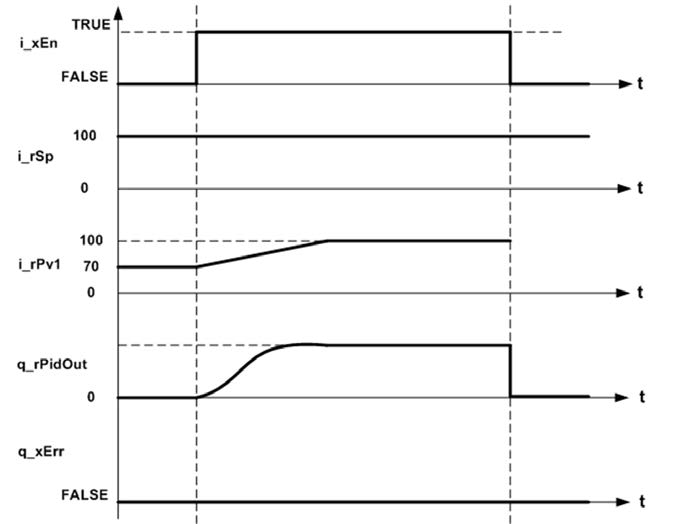

На рисунку показано структурну схему функціонального блока FB_PID у стані виявленої помилки.

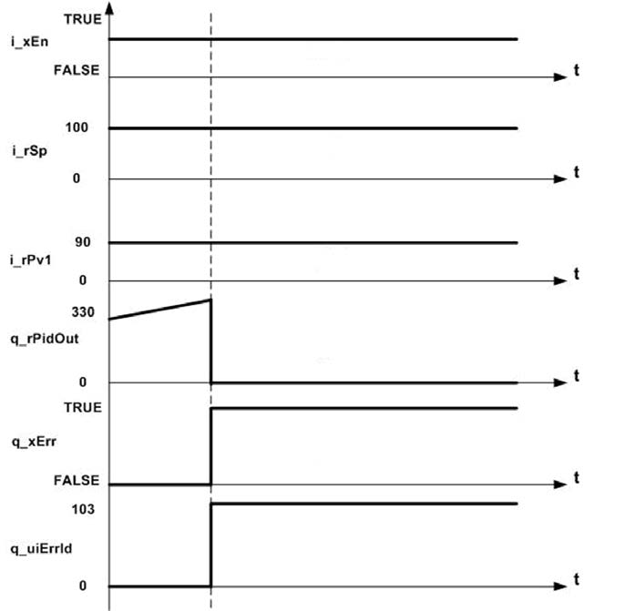

`q_sFBstat`

- `FB Active`: функціональний блок активний і працює без виявлених помилок.
- `FB Detected error`: функціональний блок активний і виявлено помилку.
- `FB Disabled`: функціональний блок вимкнений.

### Приклад

На рисунку показано екземпляр функціонального блока FB_PID.

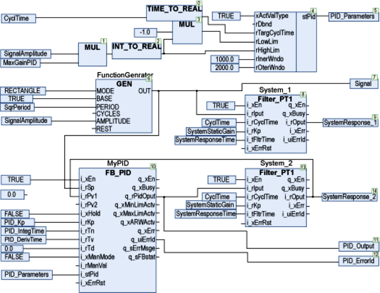

- Квадратний сигнал формується за допомогою блока `GEN`, ключові параметри — `SqrPeriod` та `SignalAmplitude`.
- Об’єкт керування — простий фільтр першого порядку, ключові параметри — `SystemResponseTime` та `SystemStaticGain`.
- Виконується трасування в розімкненому контурі (`SystemResponse_1`) та в замкненому контурі з використанням функціонального блока FB_PID.

Дані цього прикладу:

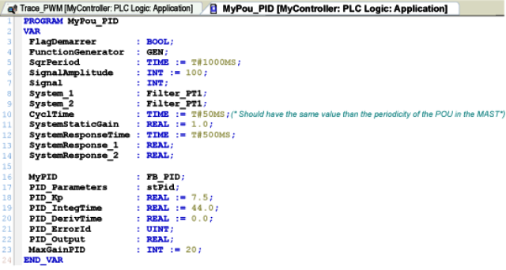

За попередніх налаштувань уставка, відгук у розімкненому контурі та відгук у замкненому контурі мають вигляд:

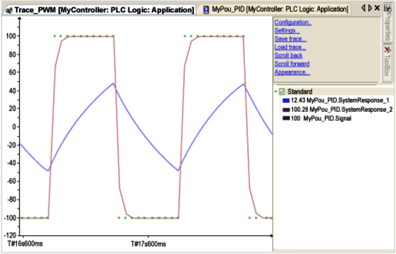

Вхід `i_tCyclTime` фільтрів першого порядку `System_1` і `System_2` (`dataCyclTime`) повинен мати точно таке саме значення, як і період виконання POU у задачі MAST, у цьому випадку 50 мілісекунд.

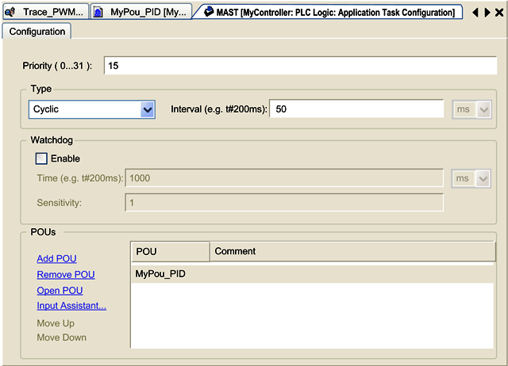

Коли режим GEN змінюється з RECTANGLE на SINUS за тих самих інших параметрів, синусоїдальний відгук має вигляд:

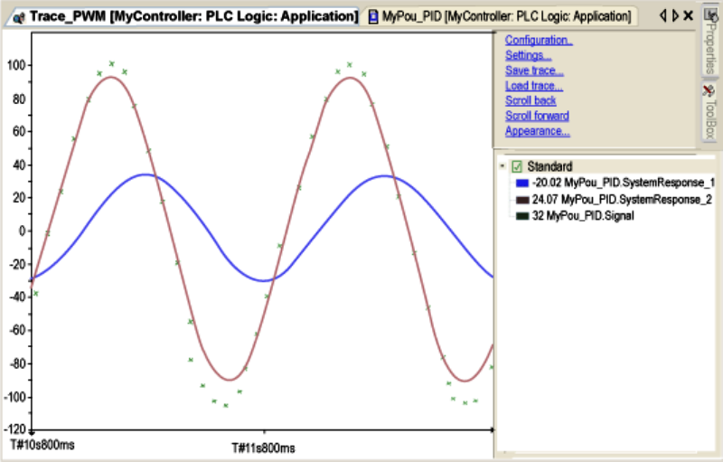

На рисунку показано візуалізацію функціонального блока FB_PID.

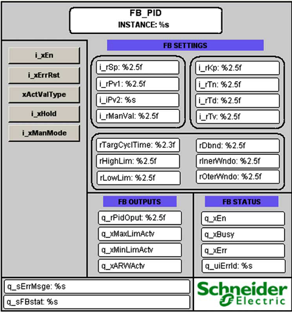

## FB_PI_PID: Каскадний контур керування PI–PID

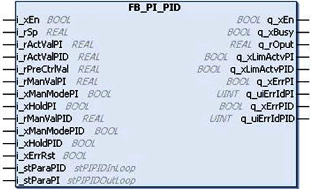

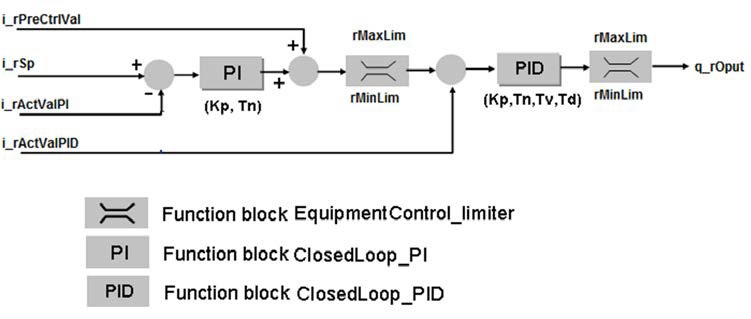

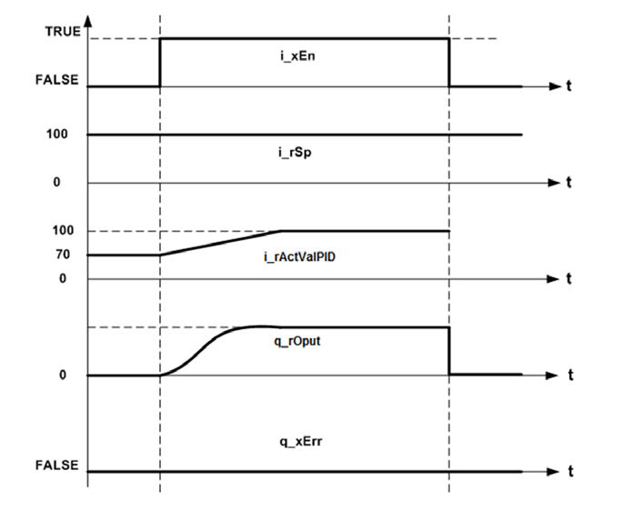

## Джерела

1. [EcoStruxure Machine Expert - Toolbox, Library Guide ](https://www.se.com/us/en/download/document/EIO0000000096/)

## Автори

Теоретичне заняття розробив [Олександр Пупена](https://github.com/pupenasan). 

## Feedback

Якщо Ви хочете залишити коментар у Вас є наступні варіанти:

- [Обговорення у WhatsApp](https://chat.whatsapp.com/BRbPAQrE1s7BwCLtNtMoqN)
- [Обговорення в Телеграм](https://t.me/+GA2smCKs5QU1MWMy)
- [Група у Фейсбуці](https://www.facebook.com/groups/asu.in.ua)

Про проект і можливість допомогти проекту написано [тут](https://asu-in-ua.github.io/atpv/)
