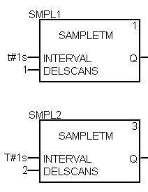
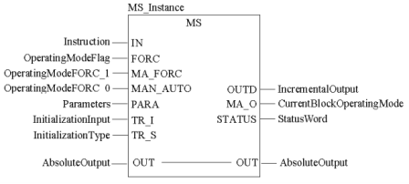

[<- До підрозділу](README.md)	[PLC M340, M580 Control Expert/Unity Pro](../controlexpert.md)		[Коментувати](#feedback)

# ПІ та ПІД-регулювання в ПЛК  в UnityPRO/Control Expert

## Структура контурів регулювання 

На рис.6.1 показана узагальнена функціональна структура контурів регулювання з використанням ПЛК. 

 Нагадаємо, що в UNITY PRO для реалізації алгоритмів регулювання пропонується використовувати бібліотеку *ControlLib*, зокрема блоки сімейств *Controller,* *Output* *Processing,* *Setpoint* *Management*. У таблиці 6.2 наведений перелік функціональних блоків сімейства Controller .

Таблиця 6.2. Функціональні блоки сімейства Controller

| Назва типу EFB | Призначення                                                  |
| -------------- | ------------------------------------------------------------ |
| *SAMPLETM*     | управління періодичністю виклику  відносно початкового циклу |
| *PI_B*         | ПІ-регулятор                                                 |
| *PIDFF*        | ПІД-регулятор                                                |
| *STEP2*        | двохпозиційний регулятор                                     |
| *STEP3*        | трьохпозиційний регулятор                                    |
| *AUTOTUNE*     | блок автонастройки *PI_B* та *PIDFF*                         |
| *IMC*          | коректор моделі                                              |

## SAMPLETM 

Всі блоки бібліотеки *Control* *Lib*, алгоритм яких передбачає використання часових інтервалів (наприклад для інтегрування або диференціювання), розраховують ці інтервали як різницю між плинним та попереднім часом виклику блоку. Це значить, що їх можна викликати аперіодично. Однак алгоритми регулювання потребують значні часові ресурси, що займає значну частину часу Задачі(*Task*), в якій вони викликаються. З іншого боку, більшість задач регулювання не потребують частої обробки, а отже їх контури можуть оброблятися рідше, ніж кожний цикл. Таким чином для оптимізації роботи програми контролера рекомендується обробляти контури періодично, і зсунутими у часі відносно один одного. 

Так, наприклад, при наявності 10-ти контурів регулювання, можна викликати зв’язані в контурі блоки з періодичністю 100 мс, але зсунуті один відносно одного на один цикл. Тобто через кожні 100 мс, протягом 10 циклів будуть оброблені всі контури. Періодичний виклик зі зсувом по часу можна забезпечити функціональним блоком *SAMPLETM*.

Функціональний блок *SAMPLETM* з періодичністю, яка визначається вхідним параметром *INTERVAL*, на один цикл Задачі виставляє в значення *TRUE* вихід *Q*. Вхідний параметр *DELSCANS* визначає зміщення в циклах запуску внутрішнього таймеру блоку відносно першого циклу контролеру (після холодного старту).

На рис.6.5 показаний приклад використання 2-х екземплярів *SAMPLETM*, виходи *Q* яких з періодичністю однієї секунди будуть виставлятися на один цикл в *TRUE*. Включення цих виходів буде зміщене на один цикл один відносно одного. 

Рис.6.5. Використання 2-х екземплярів SAMPLETM зі зсувом на один цикл відносно      

## ПІ регулятор PI_B 

Функціональний блок *PI_B* реалізовує ПІ алгоритм регулювання (6.1). 

             (6.1)

Функціональна схема ПІ-регулятора зображена на рис.6.6. Параметри *PI_B* наведені в таблиці табл.6.3. Як видно з рис.6.6, в алгоритмі спочатку розраховується розузгодження (*DEV=PV-SP*), яке пройшовши через блок нечутливості (з зоною *dband*), використовується для розрахунку інтегральної складової (налаштовується *ti*) та пропорційної складової (налаштовується *kp*). Задане значення *SP* обмежується по мінімуму (*pv_inf*) та по максимуму (*pv_sup*). Якщо необхідно управляти ВМ в зворотному напрямку (команда *rev_dir=TRUE*), розраховане значення інвертується (змінює знак).

Рис.6.6. Функціональна схема ПІ-регулятора PI_B

У автоматичному режимі (*MAN_AUTO=TRUE*) розраховане значення, пройшовши через блоки *Tracking* та *Limiter* подається на вихід *OUT*. В ручному режимі (*MAN_AUTO=TRUE*) вихід *PI_B* регулюється ззовні функціонального блока. 

Режим *Tracking* (слідкування) використовується для прямого регулювання *OUT* зовнішнім алгоритмом (див. параграф 6.1.2). У нормальному режимі *TR_S* повинен бути *FALSE*, тобто *Tracking* вимкнений. 

Параметрами *out_inf* та *out_sup* налаштовуються обмеження відповідно по мінімуму та максимуму вихідної величини (при *en_rcpy=TRUE* обмеження не діють).          

Функціональний блок *PI_B* може працювати в режим ПІ та П регулятора. Виставивши параметр *ti=0s*, блок *PI_B* переключається в режим П-регулювання. У режимі ПІ регулювання блок розраховує вихід *OUT* по інкрементальному розрахунку, а в П режимі регулювання – по абсолютному. Режими абсолютного та інкрементального розрахунку розглянуті в параграфі 6.2.5 

 У П режимі регулювання (режим абсолютного розрахунку) вихідне значення розраховується за формулою:

                          (6.2)

Параметр *outbias* потрібен для того, щоб в П режимі регулятора задати зміщення початкової точки (при нульовому розузгодженні). Тобто, в залежності від знака розузгодження, вихід на виконавчий механізм буде зміщуватися в меншу або більшу сторону відносно *outbias*. Значення цього параметру як правило близький до *50%*.  

Всі команди, плинні, задані та вихідні значення доступні як параметри функціонального блоку. Налаштування алгоритму проводиться через структурний параметр *PARA* типу *Para_PI_B*, поля якого описані в таб.6.4.   

На рис.6.7 показаний приклад використання функціонального блоку *PI_B* для регулювання температури в контурі з умовною назвою TIC1. Для періодичного виклику ПІ-регулятору використовується функціональний блок типу *SAMPLETM*. Настройка регулятора проводиться через структурну змінну *TIC1_PARA*, яка попередньо створюється на базі типу *Para_PI_B*. 

Приклади програми з *PI_B* наведені також в главі 6.8.   

*Таблиця* *6.3* Параметри функціонального блока *PI_B*.

|            |                                                              | Вхідні параметри                                             |
| ---------- | ------------------------------------------------------------ | ------------------------------------------------------------ |
| *PV*       | *REAL*                                                       | значення  вимірювальної величини (плинне значення)           |
| *SP*       | *REAL*                                                       | задане  значення (уставка)                                   |
| *RCPY*     | *REAL*                                                       | копія  значення регульованого виходу як база для інкрементального розрахунку  (наприклад стан виконавчого механізму) |
| *MAN_AUTO* | *BOOL*                                                       | Режим  роботи ПІ-регулятора:  1 :  Автоматичний режим  0 :  Ручний режим |
| *PARA*     | *[Para_PI_B](mk:@MSITStore:C:Program FilesSchneider ElectricUnity ProPunithelp1033clclib.chm::/clclib_D-SG-0011247.htm#D-SG-0011247.24)* | Параметри  регулятора (див. таб.6.4)                         |
| *TR_I*     | *REAL*                                                       | Вхід слідкування/ініціалізації (*Tracking)*                  |
| *TR_S*     | *BOOL*                                                       | Команда  на включення режиму слідкування/ініціалізації (1: Включити вхід *TR_I*) |
|            |                                                              | **Вхідні/вихідні параметри**                                 |
| *OUT*      | *REAL*                                                       | абсолютне  значення виходу регулятору (в ручному режимі може змінюватися з зовні PI_B) |
|            |                                                              | **Вихідні параметри**                                        |
| *OUTD*     | *REAL*                                                       | інкрементальне  значення виходу регулятору (див. праграф 6.2.5) |
| *MA_O*     | *BOOL*                                                       | Поточний  режим виконання регулятора  1: Автоматичний режим  0: інший режим (ручний або режим слідкування) |
| *DEV*      | *REAL*                                                       | Значення  розузгодження (*PV* *- SP*)                        |
| *STATUS*   | *WORD*                                                       | Слово  статусу (використовується для контролю за помилками виконання *PI_B*) |

*Таблиця* *6.4.*  Опис структурного типу *Para_PI_B*  .

| *id*      | *UINT* | Використовується для  алгоритму автопідстройки (*AUTOTUNING*) |
| --------- | ------ | ------------------------------------------------------------ |
| *pv_inf*  | *REAL* | обмеження по мінімуму  вхідної величини завдання             |
| *pv_sup*  | *REAL* | обмеження по максимуму  вхідної величини завдання            |
| *out_inf* | *REAL* | обмеження по мінімуму  вихідної величини блоку               |
| *out_sup* | *REAL* | обмеження по максимуму  вихідної величини блоку              |
| *rev_dir* | *BOOL* | 0: пряма робота регулятору (*SP-PV*)  1: зворотна робота регулятору (*PV-SP*) |
| *en_rcpy* | *BOOL* | 1: використати вхід *RCPY*                                   |
| *kp*      | *REAL* | Коефіцієнт  пропорційності                                   |
| *ti*      | *TIME* | Час інтегрування                                             |
| *dband*   | *REAL* | Зона нечутливості                                            |
| *outbias* | *REAL* | зміщення виходу  регулятора в П-режимі функціонування (при *ti=0s*) |

Рис.6.7. Приклад використання функціонального блоку *PI_B*: зверху – фрагмент програми, знизу – опис змінних в редакторі Data Editor

## ПІД регулятор PIDFF 

Функціональний блок *PIDFF* реалізовує ПІД алгоритм регулювання та має ряд додаткових функції. Функціональна схема регулятора наведена на рис.6.8. Параметри *PID_FF* наведені в таблиці табл.6.5, приклад виклику на рис.6.10. Нижче наведемо особливості регулятора.  

Рис.6.8 Функціональна схема ПІД-регулятора PIDFF

Функціональний блок *PID_FF* реалізовує ПІД алгоритм регулювання з двома типами структури: *змішаною структурою (mix_par* *=* *FALSE*) та *паралельною структурою (mix_par* *=* *TRUE)*. Формула для розрахунку виходу регулятору зі змішаною (mixed) структурою наведена в (6.3). 

                  (6.3)

Розрахунок виходу регулятора з паралельною (*parallel*) структурою наведений в (6.4) . 

                (6.4)

У формулах (6.3) та (6.4)  - коефіцієнт пропорційності, ti - час інтегрування, td - час диференціювання,  kd - коефіцієнт диференціювання, dev = (PV-SP) - розузгодження,  - коефіцієнт масштабування, який розраховується за формулою

                     (6.5)

Формули (6.3) та (6.4) справедливі тільки для певних режимів роботи *PIDFF*.

У змішаній структурі *(mix_par* *=* *FALSE*) коефіцієнти підсилення *K* інтегральної та диференційної складової (рис.6.8) будуть рівними коефіцієнту пропорційності *K=kp*. У паралельній структурі *(mix_par* *=* *TRUE*)  коефіцієнти підсилення розраховуються за формулою 

                   (6.6).

При включеній інтегральній складовій ti>0, вхід для пропорційної складової розраховується за формулою:

​                       (6.7)

де ovs_att - ваговий коефіцієнт (від 0 до 1), який призначений для запобігання перерегулювання при зміні завдання. 

При ovs_att=0, розузгодження для пропорційної складової рахується за класичними формулами (6.3) або (6.4). При ovs_att=1 зміна завдання ніяк не впливає на розрахунок пропорційної складової, оскільки на вхід її подається тільки виміряне значення. Тобто в цьому режимі розузгодження використовується тільки в інтегральній та диференційній (при *pv_dev=TRUE*) складових. Значення в діапазоні 0-1 вказує наскільки пропорційна складова регулятору буде чутливою до зміни завдання.     

Регулятор має диференційну складову (*Derivate* *action*) яка може працювати як по розузгодженню (при *pv_dev*=*TRUE*) так і по плинному значенню (при *pv_dev*=*FALSE*). Аналогічно до попередньої настройки, режим роботи *pv_dev*=FALSE, виключає реакцію диференційної складової на зміну завдання. Слід також звернути увагу, що інтегральна складова в формулах (6.3) та (6.4) включає додатковий фільтр 1-го порядку, який налаштовується параметром *kd*.  

На відміну від *PI_B*, блоки нечутливості для *dev* та *DEV_WGH* окрім зони нечутливості (*dband*) мають настройку *gain_kp*, яка вказує на коефіцієнт підсилення(послаблення) розузгодження, коли його значення знаходиться в цій зоні. При *gain_kp=0* блок нечутливості працює аналогічно як в *PI_B*. Статичні характеристики блоку при інших значеннях *gain_kp* показані на рис.6.9.

Ланка упередження (*Feed Forward*) дає можливість включити в контур управління сигнал упередження по збуренню, тим самим покращити динамічні характеристики процесу регулювання. Сигнал упередження масштабується відповідно до формули:

         (6.8)

Формули 6.3 та 6.4 наведені в спрощеному вигляді для розуміння суті роботи ПІД регулятора. Функціональний блок *PIDFF* може працювати в режим ПІД/ПІ або П/ПД регулятора, що впливає на особливості розрахунків. У параграфі 6.2.5 розглянуті дійсні розрахункові формули, які використовуються в залежності від настройок *PIDFF*. Крім визначених в главі 6.1 режимів *Manual/Automatic* та *Tracking*, *PIDFF* може працювати в таких режимах:

-     режим абсолютного розрахунку (П/ПД-регулювання);

-     інкрементальний алгоритм ПІД-регулювання та І-регулювання;

Ці режими розглянуті в параграфі 6.2.5.

Приклад виклику екземпляру *PIDFF* показаний на рис.6.10. 

Рис.6.9 Настройка зони нечутливості

Рис.6.10. Приклад виклику екземпляру "*PIDFF_Instance*" типу *PIDFF* в секції на мові FBD

*Таблиця* *6.5* Параметри функціонального блока *PIDFF*.

|            |              | Вхідні  параметри                                            |
| ---------- | ------------ | ------------------------------------------------------------ |
| *PV*       | *REAL*       | значення вимірювальної  величини (плинне значення)           |
| *SP*       | *REAL*       | задане значення  (уставка)                                   |
| *FF*       | *REAL*       | сигнал упередження                                           |
| *RCPY*     | *REAL*       | копія значення  регульованого виходу як база для інкрементального розрахунку (наприклад стан  виконавчого механізму) |
| *MAN_AUTO* | *BOOL*       | Режим роботи  регулятора:  1 : Автоматичний режим  0 : Ручний режим |
| *PARA*     | Para_PIDFF   | Параметри регулятора  (див. таб.6.6)                         |
| *TR_I*     | *REAL*       | Вхід слідкування/ініціалізації                               |
| *TR_S*     | *BOOL*       | Команда на включення  режиму слідкування/ініціалізації (1: Включити вхід *TR_I*) |
|            |              | **Вхідні/вихідні  параметри**                                |
| *OUT*      | *REAL*       | абсолютне значення  виходу регулятору                        |
|            |              | **Вихідні  параметри**                                       |
| *OUTD*     | *REAL*       | інкрементальне значення  виходу регулятору (див. праграф 6.2.5) |
| *MA_O*     | *BOOL*       | Поточний режим  виконання регулятора  1: Автоматичний режим  0: інший режим (ручний або режим слідкування) |
| *INFO*     | *Info_PIDFF* | інформація про стан  роботи *PIDFF* (див. таб.6.7)           |
| *STATUS*   | *WORD*       | Слово статусу  (використовується для контролю за помилками виконання *PIDFF*) |

*Таблиця* 6.6. Опис структурного типу *Para_PIDFF*.

| *id*       | *UINT* | Використовується для  алгоритму автопідстройки (*AUTOTUNING*) |
| ---------- | ------ | ------------------------------------------------------------ |
| *pv_inf*   | *REAL* | обмеження по мінімуму  вхідної величини завдання             |
| *pv_sup*   | *REAL* | обмеження по максимуму  вхідної величини завдання            |
| *out_inf*  | *REAL* | обмеження по мінімуму  вихідної величини блоку               |
| *out_sup*  | *REAL* | обмеження по максимуму  вихідної величини блоку              |
| *rev_dir*  | *BOOL* | 0: пряма робота регулятору (*SP-PV*)  1: зворотна робота регулятору (*PV-SP*) |
| *mix_par*  | *BOOL* | 1: регулятор з паралельною структурою   0: регулятор зі змішаною структурою |
| *aw_type*  | *BOOL* | 1: активація безударного режиму антинасичення                |
| *en_rcpy*  | *BOOL* | 1: використати вхід *RCPY*                                   |
| *kp*       | *REAL* | Коефіцієнт пропорційності                                    |
| *ti*       | *TIME* | Час інтегрування                                             |
| *td*       | *TIME* | Час диференціювання                                          |
| *kd*       | *REAL* | Коефіцієнт фільтрації  диференційної складової               |
| *pv_dev*   | *BOOL* | Режим розрахунку  диференційної складової:   1: по розузгодженню (*dev*)   0: по плинному значенню  (*PV*) |
| *bump*     | *BOOL* | 1: відсутність  безударності при переході в автоматичний режим  0: активація  безударності переходу в автоматичний режим |
| *dband*    | *REAL* | Зона нечутливості                                            |
| *gain_kp*  | *REAL* | коефіцієнт  підсилення(послаблення) розузгодження в зоні нечутливості |
| *ovs_att*  | *REAL* | значення вагового коефіцієнта  (від 0 до 1), що призначений для запобігання перерегулювання при зміні  завдання |
| *outbias*  | *REAL* | зміщення виходу  регулятора в П/ПД-режимі функціонування (при *ti=0s*) |
| *out_min*  | *REAL* | нижня межа для виходу  регулятору                            |
| *out_max*  | *REAL* | верхня межа для виходу регулятору                            |
| *outrate*  | *REAL* | обмеження по швидкості  зміни на виході одиниць/сек (≥0)     |
| *ff_inf*   | *REAL* | нижня межа значення *FF*                                     |
| *ff_sup*   | *REAL* | верхня межа значення *FF*                                    |
| *otff_inf* | *REAL* | нижня межа значення *out_ff*                                 |
| *otff_sup* | *REAL* | верхня межа значення *out_ff*                                |

*Таблиця* 6.7. Опис структурного типу Info_PIDFF  .

| *dev*    | REAL | розузгодження (*PV-SP*) |
| -------- | ---- | ----------------------- |
| *out_ff* | REAL | значення упередження    |

 

## Режими абсолютного та інкрементального розрахунку роботи *PI_B*/*PIDFF* 

Виставивши параметр *ti=0s*, в структурі *PIDFF* та *PI_B* відключається інтегральна складова. У цьому випадку регулятор працює в режимі П або ПД (тільки *PIDFF*) регулятора, тобто *абсолютного розрахунку*. У цьому режимі вихід *PIDFF* розраховується за формулою:

              (6.9)
                      (6.10)
                       (6.11)

де Pout - вихід пропорційної складової, Dout - вихід диференційної складової регулятора (тільки для *PIDFF*), які розраховуються по (6.10) та (6.11); OUTold - значення виходу на попередньому виклику блоку;OUTD - інкрементальне значення виходу, тобто різниця значень виходу між викликами; limiter - обмежувач виходу (див. рис.6.8); out_ff - сигнал упередження (тільки для *PIDFF*), що розраховується за (6.6). 

Значення Pout в (6.9) для *PI_B* та *PIDFF* розраховується за формулою:

                     (6.12)

Значення Dout в (6.9) для *PIDFF* розраховується за формулою:

    (6.13)

де всі змінні з індексом *old* – це значення, що розраховані на попередньому виклику кроку; *dt* – час між викликами блоку; при *pv_dev*=*FALSE* - в (6.13) замість значення *dev* використовується плинне значення вимірювальної величини *PV*; особливості розрахунку *K* дані в параграфі 6.2.4.

У формулах (6.12) і (6.13) sense - визначає знак (див. *Reverse Direct* на рис.6.8): 

- при rev_dir=TRUE, sense = +1,

- при rev_dir=FALSE, sense =-1

При *ti>0s*, блоки *PI_B* та *PIDFF* працюють в режимі інкрементального розрахунку. Враховуючи наявність інтегральної складової, вихід OUT цих блоків розраховується як сума його значення на попередньому виклику та приросту на плинному кроці OUTD. Для *PIDFF* можливі два варіанти роботи алгоритмів:

- нормальний інкрементальний алгоритм (*aw_type =* *FALSE*);

- безударний інкрементальний алгоритм з антинасиченням (*aw_type =* *TRUE*); 

У режимі використання *нормального інкрементального алгоритму* (*ti>0s,* *aw_type =* *FALSE*) виходи розраховуються за формулами: 

            (6.14)
         (6.15)
                      (6.16)

де  - прирости пропорційної, інтегральної та диференційної складової регулятора, які розраховуються за формулами (6.17)-(6.19); OUTold - значення виходу на попередньому виклику;  RCPY - копія значення регульованого виходу (дійсний стан виконавчого механізму); - приріст упереджувального сигналу, який розраховується за формулою (6.20). У режимі *І-*регулятору, тобто при *kp=0*, приріст пропорційної та диференційної складової в (6.14) не враховуються. Для блоку *PI_B* складові  та дорівнюють нулю.

       (6.17)
                   (6.18)
                  (6.19)
              (6.20)

де всі змінні з індексом *old* – це значення, що розраховані на попередньому виклику кроку; *dt* – час між викликами блоку; ti - час інтегрування; Dout - вихід пропорційної складової, який розраховується за формулою (6.13); outff - сигнал упередження, що розраховується за формулою (6.8).

Антинасичення в такому алгоритмі досягається за рахунок використання інкрементальної форми та заборони інтегрування (6.16). Тобто "накопичення" інтеграла по своїй суті зберігається в самій змінній *OUT*, а заборона інтегрування - це обмеження величинами *out_min* та *out_max*. Крім того, така форма дає можливість безударного переходу з режиму ручний в автомат і навпаки, так як *OUT* використовується також як ручний вихід. Однак в такому режимі роботи короткочасні раптові зміни розузгодження (за рахунок, наприклад, диференційної складової) можуть привести до покидання зони насичення, тоді як вихід "класичного" ПІД регулятору продовжував би знаходитись в ній. Це може негативно відобразитися на процесі регулювання, тому альтернативою може бути використання безударного інкрементального алгоритму з антинасиченням, в якому може працювати блок *PIDFF*. 

У режимі використання *безударного інкрементального алгоритму з антинасиченням* (*ti>0s,* *aw_type =* *TRUE*),  розрахунок виходу блоку *PIDFF* ведеться за формулами:

          (6.21)
                     (6.22)
                       (6.23)

де всі змінні з індексом *old* – це значення, що розраховані на попередньому виклику алгоритму; - прирости пропорційної, інтегральної та диференційної складових регулятора, які розраховуються за формулами (6.17)-(6.19); - приріст сигналу упередження, який розраховується за формулою (6.20); - коригуюче значення, яке розраховується за формулою:

     (6.24)

У цьому режимі, вихід регулятора зберігається в змінній OUTc без обмеження по мінімуму та максимуму, що не обмежує інтегральну складову. Антинасичення досягається ослабленням інтегральної складової шляхом подачі коригуючого сигналу .     

## Блок ручного управління *MS*

Функціональні блоки регуляторів, в тому числі *PI_B/PIDFF*, мають вбудовані засоби переключення їх в ручний режим, з забезпеченням безперебійності. Нижче наведені випадки, для яких може знадобитися використання блоку ручного управління *MS*:

-    для управління аналоговими виходами, які управляються НЕ через алгоритми зі зворотним зв’язком (не за відхиленням);

-    для управління аналоговими виходами, які в ручному і в автоматичному режимах формуються окремими блоками (наприклад при каскадному регулюванні, переключенні між алгоритмами);

-    для управління серводвигунами в ручному режимі без використання регуляторів *PI_B/PIDFF*; 

На рис.6.35 показана функціональна схема блоку *MS*, на рис.6.36 – приклад виклику блоку в FBD.

Вихід *OUT* в автоматичному режимі формується як сума входів *IN* та *outbias*, якщо зміщення активоване (*use_bias=TRUE*). У ручному режимі вихід міняється безпосередньо. У обидвох режимах абсолютне значення *OUT* обмежується по мінімуму і максимуму, а інкрементальне *OUTD* – не обмежується. 

Рис.6.35.Функціональна схема блоку *MS*

Рис.6.36.Приклад виклику блоку *MS*

*Таблиця* *6.27* Параметри блоку *MS*

|            |         | Вхідні  параметри                                            |
| ---------- | ------- | ------------------------------------------------------------ |
| *IN*       | *REAL*  | Значення змінної в  автоматичному режимі                     |
| *FORC*     | *BOOL*  | 1:Режим ручний/автомат визначається входом *MA_FORC*   0: Режим ручний/автомат визначається входом *MAN_AUTO* |
| *MA_FORC*  | *BOOL*  | Режим ручний/автомат  для *FORC* *= 1*  1: Автоматичний режим   0: Ручний режим |
| *MAN_AUTO* | *BOOL*  | Режим  ручний/автмат для *FORC* *= 0*   1:  Автоматичний режим  0: Ручний режим |
| *PARA*     | Para_MS | Параметр                                                     |
| *TR_I*     | *REAL*  | Вхід ініціалізації                                           |
| *TR_S*     | *BOOL*  | Команда на включення  ініціалізації (1: Включити вхід ініціалізації) |
|            |         | Вхідні/вихідні  параметри                                    |
| *OUT*      | *REAL*  | абсолютне значення  виходу                                   |
|            |         | **Вихідні  параметри**                                       |
| *OUTD*     | *REAL*  | інкрементальне значення  виходу: різниця між вихідною величиною в плинному і попередньому циклах  перерахунку *OUTD* |
| *MA_O*     | *BOOL*  | Плинний режим роботи  регулятору (0: Ручний, 1: Автоматичний) |
| *STATUS*   | *WORD*  | Слово статусу                                                |

*Таблиця* *6.28.* Опис структурного типу [Para_MS](mk:@MSITStore:C:Program FilesSchneider ElectricUnityProPunithelp1033clclib.chm::/clclib_D-SG-0011328.htm#D-SG-0011328.22)

| *out_min*  | *REAL* | нижня межа для виходу  регулятору                            |
| ---------- | ------ | ------------------------------------------------------------ |
| *out_max*  | *REAL* | верхня межа для виходу  регулятору                           |
| *inc_rate* | *REAL* | Швидкість наростання  значення сигналу при переключенні руч./авт. (одиниць на секунду) |
| *dec_rate* | *REAL* | Швидкість спадання значення сигналу при переключенні руч./авт.  (одиниць на  секунду) |
| *outbias*  | *REAL* | значення зміщення                                            |
| *use_bias* | *BOOL* | 1: Активувати зміщення                                       |
| *bumpless* | *BOOL* | 1: активувати безударність переходу руч/авт                  |

Рис.6.37.Діаграма роботи безударного переходу руч./авт. в *MS*

Для реалізації безударності переходу з ручного в автоматичний режим (*bumpless=TRUE*) використовуються лінійні переходи з обмеженням по швидкості, які настроюються параметрами *inc_rate* та *dec_rate*. Таким чином, в момент переходу в автоматичний режим, різниця між IN та OUT буде зменшуватися відповідно до заданої швидкості (рис.6.37).

Рис.6.38.Діаграма роботи безударного переходу руч./авт. зі зміщенням в *MS*

Якщо активований параметр *outbias* (зміщення) тобто *use_bias=TRUE*, то безударність досягається за рахунок використання нового перерахованого значення зміщення (рис.6.38). 

Безударний перехід є сенс активувати тоді, коли вхід *IN* підключений до регуляторів або інших блоків, в яких не реалізований безударний перехід. Приклад використання блоку *MS* показаний в параграфі 6.8.2.

## Перемикач уставок *SP_SEL*

Функціональний блок призначений для переключення уставки (заданого значення *SP*) для регуляторів *PI_B/PIDFF* або аналогічних (див. рис.6.39). У локальному режимі (*local* *mode*, коли *SP_RSP=FALSE*) уставка змінюється безпосередньо через вхід/вихід *SP*, який повинен бути підключений до однойменного входу регулятору. У дистанційному режимі (*remote* *mode*, коли *SP_RSP=TRUE*) уставка змінюється через вхід *RSP*.

Функціональний блок має наступні властивості:

1)  переключення між уставками в безударному режимі;

2)  операції з уставками проводяться навіть в ручному режимі;

3)  проводиться обмеження уставки по верхній і нижній межі;

При переключенні уставки з локального режиму в дистанційний, безударність забезпечується за рахунок плавної зміни виходу з швидкістю, заданою параметром *rate*. 

Приклад використання *SP_SEL* показаний в параграфі 6.8.2. 

Рис.6.39. Приклад виклику блоку *SP_SEL*

*Таблиця* *6.29*. Параметри блоку *SP_SEL*

|           |             | Вхідні  параметри                                            |
| --------- | ----------- | ------------------------------------------------------------ |
| *RSP*     | *REAL*      | Дистанційна уставка                                          |
| *SP_RSP*  | *BOOL*      | Вибір уставки  1 : Дистанційна уставка   0 : Локальна уставка |
| *PARA*    | Para_SP_SEL | Параметри                                                    |
| *PV*      | *REAL*      | Плинне значення змінної  управління                          |
| *MA_I*    | *BOOL*      | Операційний режим  регулятору, до якого під’єднаний перемикач  1 : Автоматичний режим   0 : Ручний режим |
|           |             | **Вхідні/вихідні  параметри**                                |
| *SP*      | *REAL*      | Уставка регулятору                                           |
|           |             | **Вихідні  параметри**                                       |
| *LSP_MEM* | *REAL*      | Локальна уставка в  пам’яті                                  |
| *STATUS*  | *WORD*      | Слово статусу                                                |

*Таблиця* *6.30* Опис структурного типу Para_SP_SEL

|          |        |                                                              |
| -------- | ------ | ------------------------------------------------------------ |
| *sp_min* | *REAL* | Обмеження по мінімуму  уставки                               |
| *sp_max* | *REAL* | Обмеження по максимуму  уставки                              |
| *bump*   | *BOOL* | У процесі зміни уставки  локальної/дстанційної  1 : вихід *SP* форсується значенням *LSP_MEM*   0: безударний перехід |
| *track*  | *BOOL* | 1 : значення *SP* копіюється зі входу PV (тільки  в локальному режимі) |
| *rate*   | *REAL* | швидкість  збільшення SP протягом зімни локальне/дистанційне в  одиницю/секунду (≥0) |

## Зміна уставки з постійною швидкістю (*RAMP*)

Функціональний блок *RAMP* забезпечує плавну зміну виходу *SP* від попереднього значення до значення входу *RSP* (див. рис.6.40)*.* Швидкість зміни налаштовується двома параметрами з *Para_RAMP*: на збільшення – *inc_rate*, на зменшення - *dec_rate*. Рівність *SP=RSP* сигналізується виходом *DONE*. 

Блок *RAMP* може бути використаний для плавної зміни завдання або виходу регулятору, створеного користувачем. 

Рис.6.40. Приклад виклику блоку RAMP

Рис.6.41. Приклад виклику блоку RAMP

*Таблиця* *6.31*. Параметри блоку *RAMP*

|          |           | Вхідні  параметри             |
| -------- | --------- | ----------------------------- |
| *RSP*    | *REAL*    | Задане значення уставки       |
| *PARA*   | Para_RAMP | Параметри                     |
| *TR_I*   | *REAL*    | Значення ініціалізації        |
| *TR_S*   | *BOOL*    | 1 – включити  ініціалізацію   |
|          |           | **Вихідні  параметри**        |
| *SP*     | *REAL*    | Вихідна уставка               |
| *DONE*   | *BOOL*    | 1: значення досягнуло уставки |
| *STATUS* | *WORD*    | Слово стану                   |

*Таблиця* *6.32*   Опис структурного типу Para_RAMP

| *inc_rate* | *REAL* | Швидкість нарощування в  одиницях/секунду (≥0) |
| ---------- | ------ | ---------------------------------------------- |
| *dec_rate* | *REAL* | Швидкість спаду в  одиницях/секунду(≥0)        |

## Задатчик співвідношення (*RATIO*) 

Функціональний блок *RATIO* забезпечує розрахунок завдання на виході за формулою: 

                   (6.40)

де *PV_TRACK* *–* значення змінної, відносно якої розраховується завдання; *bias* – зміщення. 

Рис.6.42. Приклад виклику блоку *RATIO*

*Таблиця* *6.33* Параметри блоку RATIO

|            |            | Вхідні  параметри                                            |
| ---------- | ---------- | ------------------------------------------------------------ |
| *PV*       | *REAL*     | Значення вимірювальної  величини, що подається на регулятор (тільки для розрахунку *KACT*) |
| *PV_TRACK* | *REAL*     | значення змінної,  відносно якої розраховується завдання     |
| *RK*       | *REAL*     | дистанційний коефіцієнт  співвідношення                      |
| *K_RK*     | *BOOL*     | Вибір джерела для  коефіцієнта:  "1":  коефіцієнт задається дистанційно  входом *RK*   "0": локальний коефіцієнт, задається входом *K* |
| *K*        | *REAL*     | локальний коефіцієнт  співвідношення                         |
| *PARA*     | Para_RATIO | Пареметри                                                    |
|            |            | **Вихідні  параметри**                                       |
| *KACT*     | *REAL*     | Реальний коефіцієнт  співвідношення                          |
| *SP*       | *REAL*     | Розраховане завдання                                         |
| *STATUS*   | *WORD*     | Слово стану                                                  |

*Таблиця* *6.34* Опис структурного типу Para_RATIO

|          |        |                                                |
| -------- | ------ | ---------------------------------------------- |
| *k_min*  | *REAL* | обмеження по мінімуму *K* та *RK*              |
| *k_max*  | *REAL* | обмеження по максимуму *K* та *RK*             |
| *sp_min* | *REAL* | обмеження по мінімуму  для розрахованого *SP*  |
| *sp_max* | *REAL* | обмеження по максимуму  для розрахованого *SP* |
| *bias*   | *REAL* | Зміщення                                       |

Функціональний блок може бути використаний при слідкуючому регулюванні (наприклад регулятор співвідношення) для формування завдання регуляторам *PI_B/PIDFF*.

Крім реалізації лінійної залежності, блок має додаткові можливості (рис.6.43):

-     дистанційну зміну коефіцієнту *K* або *RK*;

-     обмеження по мінімуму та максимуму для *K* або *RK;*

-     обмеження по мінімуму та максимуму для розрахованого *SP*;

-     розрахунок реального коефіцієнта: *KACT=(PV-bias)/PV_TRACK*; 

Рис.6.43. Функціональна схема RATIO

 ## 6.7. Цілочисельне регулювання (сімейство *CLC_INT*)

Процедури UNITY PRO для цілочисельного регулювання *PID_INT,* *PWM_INT* та *SERVO_INT* аналогічні функціям *PID*, *PWM* та *SERVO*, які використовувалися в PL7 PRO при програмуванні попередніх версій TSX Premium та TSX Micro. Дані процедури як правило використовують тільки для сумісності з конвертованими проектами з PL7, однак використання їх в нових проектах UNITY PRO також дозволяється. Альтернативою процедурам цілочисельного регулювання є більш потужні функціональні блоки бібліотеки управління, які наведені вище. 

Структурна схема можливих варіантів контуру з цілочисельним ПІД-регулятором представлена на рис.6.50.

Рис.6.50. Структурна схема варіантів реалізації контуру з ПІД-регулятором 

До структурної схеми можуть входити три процедури:

-     блок ПІД-регулятора (процедура *PID_INT*);

-     блок широтно-імпульсного перетворення (*PWM_INT*);

-     блок управління реверсивним двигуном (*SERVO_INT*).

При використанні аналогового виконавчого механізму, цілочисельний вихід блока ПІД подається на аналоговий вихід контролера. Якщо використовується електричний виконавчий механізм з постійною швидкістю обертання (наприклад виконавчий механізм типу МЕО) або крокові двигуни, цілочиселний вихід *PID_INT* за допомогою процедур *PWM_INT* або *SERVO_INT* перетворюється у послідовність імпульсів, які подаються на дискретні виходи. Для правильного функціонування процедур *PID_INT,* *PWM_INT* та *SERVO_INT* Задача, в якій вони викликаються повинна виконуватись у періодичному режимі! 

Процедура *PID_INT* призначена для реалізації цілочисленьного ПІД-регулятора. Внутрішня структура процедури показана на рис.6.51, приклад виклику в програмі на мові FBD на рис.6.52, параметри PARA в таблиці 6.38. Слід звернути увагу на те, що цілочисельне регулювання базується на цілочисельній арифметиці, отже всі вхідні та вихідні значення являються типами *INT*, *BOOL* та *DINT*. Для кращого розуміння можна представити що регулювання відбувається у відсоткових діапазонах, де 0% - це 0, а 100% - це 10000. 

Задане значення *SP* (*Setpoint*), яке подається на вхід регулятора, попередньо обмежується в діапазоні 0-10000 (0-100%).  У середині процедури розраховується розузгодження *ε=SP-PV*, де *PV* (*Process* *value*) – вимірювальна величина. Розузгодження поступає на блок *PID*, де безпосередньо реалізований сам алгоритм ПІД-регулятора. 

Настройки регулятора проводиться через параметри: *КP* – коефіцієнт пропорційності, *ТI* – постійна часу інтегрування, *TD* – постійна часу диференціювання. Диференційна складова може працювати в режимі диференціювання, розузгодження або вимірювальної величини. Вибір режиму проводиться параметром *PV_DEV*. 

Вихід регулятора обмежується значеннями *OUT_MIN* та *OUT_MAX*, які теж є параметрами настройки регулятора. Після обмежувача виходу (*Limiter*) в автоматичному режимі (*AUTO=1*), це значення поступає на вихід *OUTР*. У ручному режимі роботи регулятора (*AUTO=0*), значення виходу береться зі входу *OUT_MAN* (ручне завдання). 

Для безударності переходу з автоматичного у ручний режим, в ручному режимі вихід блоку *PID* (див. рис.6.51) повторює значення *OUT_MAN*. Включення/виключення безударного режиму проводиться через параметр *NO_BUMP*.

Рис.6.51. Внутрішня структура процедури PID_INT

Розрахунок виходу блоку *PID* залежить від настройок *KP,* *TI,* *TD* та режиму *PV_DEV*. Якщо *TI>0* та *TD>0*, вихід розраховується за формулами:

    (6.45)

при цьому в залежності від вибраного режиму диференціювання:

        (6.46)

Індекс "*i-1*" в формулі (6.45) означає, що береться значення з попереднього виклику процедури. Коефіцієнти в процедурі *PID_INT* є цілочисельними значеннями, тому задаються наступним чином: 

-    *KP* в 0.01, тобто якщо необхідно задати коефіцієнт пропорційності 1.56, тоді *KP=156*;

-    *TI* в 0.1 с, тобто якщо необхідно задати 100 с, то *TI* *=1000*;

-    *TD* в 0.1 с, тобто якщо необхідно задати 120 с, то *TD* *=1200*;

За допомогою параметра *TS* задається періодичність обробки процедури *PID_INT* в 0.01 с. Тобто ПІД регулятор може бути викликаний один раз на декілька циклів, що може заощадити часові ресурси процесора. Слід зазначити, що дійсна періодичність обробки буде кратною періоду Задачі. 

Якщо *TI=0* та *TD=0*, регулятор працює в П-режимі, тобто без інтегральної та диференційної складової. Можливий також варіант, коли *TI=0*, а *TD>0*, тобто регулятор працює в режимі ПД. Розрахунок виходу регулятору в П-режимі буде проводитись по формулі:

                   (6.47)

 Значення 5000 береться з розрахунку, що нормальне положення виконавчого механізму є 50% від діапазону. 

Використання даної процедури в контролерах TSX Micro, передбачало можливість настройки регуляторів в операторських панелях CCX-17. Тому для них в *PID_INT* були виділені спеціальні настройки. Враховуючи, дуже малу ймовірність використання знятих з виробництва CCX-17 з новими ПЛК Modicon, ці настройки коментувати не будемо.

На рис.6.52 показаний програмний інтерфейс процедури. Входи *TAG* (назва контуру) та *UNIT*(одиниці вимірювання) типу *STRING* використовуються для сумісності з старими панелями CCX-17 і можуть бути не задіяні. 

Рис.6.52. Приклад виклику процедури PID_INT в FBD

З усіх змінних та параметрів процедури в інтерфейс явно виведені тільки *PV* (вимірювальна величина), *AUTO* (перемикач руч/авт) та *OUT*(вихід регулятору). Всі інші параметри задаються через масив *PARA* типу *INT*, який завжди має довжину 43 елементи. У прикладі рис.6.52 фактичним параметром *PARA* є змінна-масив *PARA_AR*, об’явлений як *ARRAY[0..42]* *of* *INT*. Крім параметрів регулятора, масив використовується для збереження проміжних результатів розрахунку, наприклад значення *OUTi-1* з (3.3).   

*Таблиця 6.38* Таблиця параметрів (*PARA*) процедури *PID_INT*

| Елемент масиву         | Позначення  | Призначення                                             |
| ---------------------- | ----------- | ------------------------------------------------------- |
| *PARA[0]*              | *SP*        | Значення завдання  (0-10000)                            |
| *PARA[1]*              | *OUT_MAN*   | Значення вихідної  величини у ручному режимі (0-10000)  |
| *PARA[2]*              | *KP*        | Коеф. пропорційності (в  0.1 долях) (-10000<*KP*<10000) |
| *PARA[3]*              | *TI*        | Пост.часу інт. (в 0.1 c) (0-20000)                      |
| *PARA[4]*              | *TD*        | Пост.часу диф. (в 0.1  c)  (0-20000)                    |
| *PARA[5]*              | *TS*        | Дискретність обробки (  в 0.01 c) (1-32000)             |
| *PARA[6]*              | *OUT_MAX*   | Обмеження виходу по  максимуму (0-10000)                |
| *PARA[7]*              | *OUT_MIN*   | Обмеження виходу по  мінімуму (0-10000)                 |
| *PARA[8].0*            | *PV_DEV*    | вибір режиму  диференціювання: *0-PV, 1-* *SP-PV*       |
| *PARA[8].4*            | *NO_BUMP*   | ВКЛ/ВИКЛ режиму  безударності: 0-ВИКЛ, 1-ВКЛ            |
| *PARA[8].8*            | *DEVAL_MMI* | заборона використання  ММІ                              |
| *PARA[9]-*  *PARA[16]* | _MMI*       | параметри тільки для  операторських панелей CCX-17      |
| *PARA[18]-* *PARA[42]* |             | дані для збереження  проміжних результатів              |

## Контрольні запитання

1.   Які апаратні засоби є вбудовані в TSX Premium для реалізації контурів регулювання?

2.   З яких основних частин складається прикладна програма ПЛК для реалізації контурів регулювання? Поясніть призначення кожної з цих частин. 

3.   Блоки FFB яких бібліотек використовуються для реалізації контурів регулювання в UNITY PRO? Які з них використовуються тільки для сумісності з проектами PL7 та Concept?

4.   Блоки FFB якої бібліотеки рекомендується для реалізації контурів регулювання в UNITY PRO? Чи обов’язково користуватися для задач регулювання блоками саме цієї бібліотеки?

5.   Поясніть призначення та особливості функціонування режиму слідкування (*Tracking*) FFB-блоків бібліотеки *ControllLIB*. Який пріоритет має цей режим по відношенню до режиму ручний/автомат?

6.   Поясніть призначення та особливості функціонування ручного та автоматичного режимів FFB-блоків бібліотеки *ControllLIB*. Який пріоритет має цей режим по відношенню до режиму слідкування? 

7.   Яким чином контролюється виконання FFB бібліотеки *ControllLIB*? Які типові помилки можуть виникнути при обробці блоку?

8.   Чи обов’язково викликати блоки регуляторів *ControllLIB* строго періодично?

9.   Розкажіть про призначення FFB блоків сімейства *Controller* бібліотеки *ControllLIB*. 

10.   Розкажіть про призначення та функціонування *SAMPLETM*. Чи обов’язкове їх використання тільки з блоками регуляторів?

11.   Використовуючи функціональну схему поясніть основні принципи роботи блоку регулятору *PI_B*.

12.   Яким чином блок *PI_B* переводиться в П- та ПІ-режим регулювання? Поясніть відмінності роботи цих режимів.

13.   Поясніть призначення полів структури *Para_PI_B* .

14.   Використовуючи функціональну схему поясніть основні принципи роботи блоку регулятору *PIDFF*.

15.   Поясніть призначення полів структури *Para_PIDFF* .

16.   Чим відрізняється вихід *OUTD* від *OUT* в регуляторах блоків PI_B та PIDFF? Навіщо кожен з них використовується?

17.   Розкажіть про призначення входу *RCPY*. Як активувати режим використання *RCPY*?

18.   Розкажіть про функціонування блоків *PI_B/PIDFF* в режимі абсолютного розрахунку.

19.   Розкажіть про функціонування блоків *PI_B/PIDFF* в інкрементальному режимі роботи.

20.   Як Ви розумієте термін безударність переходу? Між якими режимами і яким чином реалізована безударність переходу в блоках *PI_B* та *PIDFF*?

21.   Розкажіть про призначення та функціонування *STEP2*.

22.   Розкажіть про призначення та функціонування *STEP3*.

23.   Розкажіть про призначення та функціонування *HYST*.

24.   Розкажіть про призначення та функціонування *INDLIM*.

25.   Розкажіть про призначення та функціонування процедури *LOOKUP_TABLE*.

26.   Розкажіть про призначення та функціонування *DEAD_ZONE*.

27.   Розкажіть про призначення та функціонування *SAH*.

28.   Розкажіть про призначення та функціонування *AVGMV* та *AVGMV_K*. 

29.   Розкажіть про призначення та функціонування *K_SQRT*.

30.   Розкажіть про призначення та функціонування *MFLOV*.

31.   Розкажіть про призначення та функціонування *MULDIV_W* та *SUM_W*.

32.   Розкажіть про призначення та функціонування *SERVO*. 

33.   Яким чином блоки управління серводвигунами можуть визначати положення регулюючого органу?

34.   Як контролюється блоком *SERVO* досягнення регулюючим органом крайніх положень? Як при цьому веде себе блок?

35.   Які особливості обробки серводвигунів в автоматичному та ручному режимах? Розкажіть про призначення входу *SEN*.

36.   Розкажіть про роботу блоку управління серводвигуном в режимі активації *RCPY*? Як при цьому правильно з’єднувати *SERVO* та регулятор? Що необхідно передбачити в програмі в ручному режимі?

37.   Розкажіть про роботу блоку управління серводвигуном в режимі без *RCPY*? Як при цьому правильно з’єднувати *SERVO* та регулятор? Що необхідно передбачити в програмі в ручному режимі?

38.   Навіщо задаються в блоці управління серводвигунами параметри *t_motor* та  *t_mini*?

39.   Розкажіть про призначення та функціонування *PWM1*. 

40.   Розкажіть про призначення та функціонування *MS*. У яких випадках необхідно використовувати цей функціональний блок?

41.   Розкажіть про призначення та функціонування *SP_SEL*. 

42.   Розкажіть про призначення та функціонування *RAMP*. 

43.   Розкажіть про призначення та функціонування *RATIO*. 

44.   Розкажіть про призначення та функціонування *SCALING*. 

45.   Розкажіть про призначення та функціонування *DTIME*. 

46.   Розкажіть про призначення та функціонування *INTEGRATOR*. 

47.   Розкажіть про призначення та функціонування *LAG_FILTER*. 

48.   Розкажіть про призначення та правила використання процедур цілочисельного регулювання. У якому режимі повинна виконуватися задача, в якій ці процедури виконуються?

49.   Розкажіть про призначення та функціонування *PID_INT*. 

50.   Розкажіть про призначення та функціонування *SERVO_INT*. 

51.   Розкажіть про призначення та функціонування *PWM_INT*. 

## Автори

Теоретичне заняття розробив [Олександр Пупена](https://github.com/pupenasan). 

## Feedback

Якщо Ви хочете залишити коментар у Вас є наступні варіанти:

- [Обговорення у WhatsApp](https://chat.whatsapp.com/BRbPAQrE1s7BwCLtNtMoqN)
- [Обговорення в Телеграм](https://t.me/+GA2smCKs5QU1MWMy)
- [Група у Фейсбуці](https://www.facebook.com/groups/asu.in.ua)

Про проект і можливість допомогти проекту написано [тут](https://asu-in-ua.github.io/atpv/)
