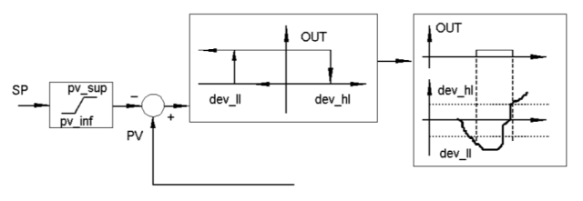
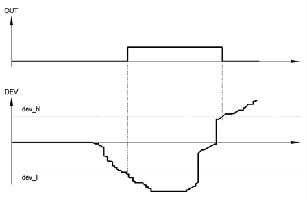
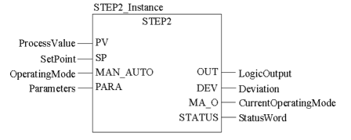
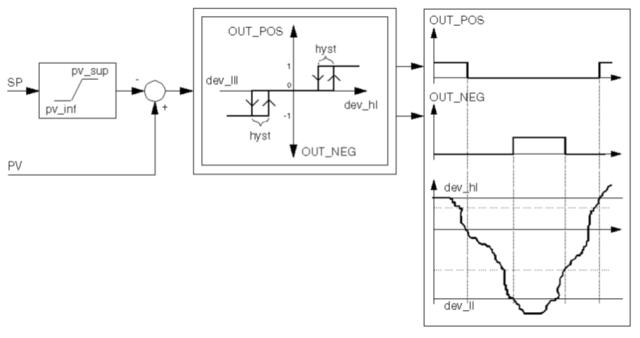
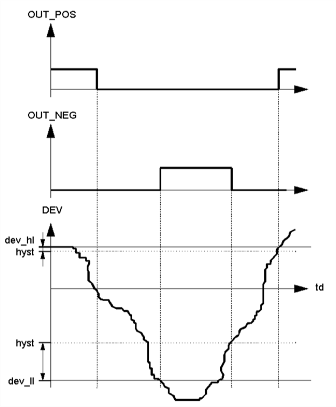
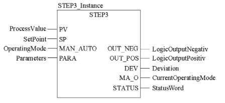

[<- До підрозділу](README.md)

# Реалізація Позиційне регулювання в ПЛК  в UnityPRO/Control Expert

На рис.6.1 показана узагальнена функціональна структура контурів регулювання з використанням ПЛК. 

Нагадаємо, що в UNITY PRO для реалізації алгоритмів регулювання пропонується використовувати бібліотеку *ControlLib*, зокрема блоки сімейств *Controller,* *Output* *Processing,* *Setpoint* *Management*. У таблиці 6.2 наведений перелік функціональних блоків сімейства Controller .

Таблиця 6.2. Функціональні блоки сімейства Controller

| Назва типу EFB | Призначення                                                  |
| -------------- | ------------------------------------------------------------ |
| *SAMPLETM*     | управління періодичністю виклику  відносно початкового циклу |
| *PI_B*         | ПІ-регулятор                                                 |
| *PIDFF*        | ПІД-регулятор                                                |
| *STEP2*        | двохпозиційний регулятор                                     |
| *STEP3*        | трьохпозиційний регулятор                                    |
| *AUTOTUNE*     | блок автонастройки *PI_B* та *PIDFF*                         |
| *IMC*          | коректор моделі                                              |

## SAMPLETM 

Всі блоки бібліотеки *Control* *Lib*, алгоритм яких передбачає використання часових інтервалів (наприклад для інтегрування або диференціювання), розраховують ці інтервали як різницю між плинним та попереднім часом виклику блоку. Це значить, що їх можна викликати аперіодично. Однак алгоритми регулювання потребують значні часові ресурси, що займає значну частину часу Задачі(*Task*), в якій вони викликаються. З іншого боку, більшість задач регулювання не потребують частої обробки, а отже їх контури можуть оброблятися рідше, ніж кожний цикл. Таким чином для оптимізації роботи програми контролера рекомендується обробляти контури періодично, і зсунутими у часі відносно один одного. 

Так, наприклад, при наявності 10-ти контурів регулювання, можна викликати зв’язані в контурі блоки з періодичністю 100 мс, але зсунуті один відносно одного на один цикл. Тобто через кожні 100 мс, протягом 10 циклів будуть оброблені всі контури. Періодичний виклик зі зсувом по часу можна забезпечити функціональним блоком *SAMPLETM*.

Функціональний блок *SAMPLETM* з періодичністю, яка визначається вхідним параметром *INTERVAL*, на один цикл Задачі виставляє в значення *TRUE* вихід *Q*. Вхідний параметр *DELSCANS* визначає зміщення в циклах запуску внутрішнього таймеру блоку відносно першого циклу контролеру (після холодного старту).

На рис.6.5 показаний приклад використання 2-х екземплярів *SAMPLETM*, виходи *Q* яких з періодичністю однієї секунди будуть виставлятися на один цикл в *TRUE*. Включення цих виходів буде зміщене на один цикл один відносно одного. 

Рис.6.5. Використання 2-х екземплярів SAMPLETM зі зсувом на один цикл відносно      

## Двохпозиційний регулятор *STEP2* 

Функціональний блок *STEP2* реалізує 2-х позиційний закон регулювання з заданими порогами відхилення. Функціональна схема регулятору показана на рис.6.11, графік залежності виходу від входів – на рис.6.12, приклад виклику - на рис.6.13. 

Рис.6.11 Функціональна схема 2-х позиційного регулятора STEP2

Рис.6.12 Графік залежності виходу *OUT* від розузгодження *DEV* 

Рис.6.13 Приклад використання функціонального блоку *STEP**2*

*Таблиця* *6.8*  Параметри функціонального блока *STEP2.*

|            |            | Вхідні  параметри                                            |
| ---------- | ---------- | ------------------------------------------------------------ |
| *PV*       | *REAL*     | значення вимірювальної  величини (плинне значення)           |
| *SP*       | *REAL*     | задане значення  (уставка)                                   |
| *MAN_AUTO* | *BOOL*     | Режим роботи  регулятора:  1 : Автоматичний режим  0 : Режим зупинки |
| *PARA*     | Para_STEP2 | Параметри регулятора  (див. таб.6.9)                         |
|            |            | **Вихідні  параметри**                                       |
| *OUT*      | *BOOL*     | значення виходу  регулятору                                  |
| *MA_O*     | *BOOL*     | Поточний режим  виконання регулятора  1: Автоматичний режим  0: Режим зупинки |
| *DEV*      | *REAL*     | Значення розузгодження (*PV* *- SP*)                         |
| *STATUS*   | *WORD*     | Слово статусу                                                |

Таблиця 6.9.  Опис структурного типу *Para_STEP2* *.*

| *dev_ll* | *REAL* | нижній поріг відхилення  від заданої величини *(≥0*)  |
| -------- | ------ | ----------------------------------------------------- |
| *dev_hl* | *REAL* | верхній поріг  відхилення від заданої величини *(≤0*) |
| *pv_inf* | *REAL* | обмеження по мінімуму  вхідної величини завдання      |
| *pv_sup* | *REAL* | обмеження по максимуму  вхідної величини завдання     |

## Трьохпозиційний регулятор *STEP3* 

Функціональний блок *STEP3* реалізує 3-х позиційний закон регулювання з заданими порогами відхилення та гістерезисом. Функціональна структура регулятору показана на рис.6.14, графік залежності виходу від входів – на рис.6.15, приклад виклику - на рис.6.16. 

 

Рис.6.14 Функціональна схема 3-х позиційного регулятора *STEP**3*

 

Рис.6.15. Графік залежності виходів *OUT_POS* і *OUT_NEG* від розузгодження *DEV* 

Рис.6.16 Приклад використання функціонального блоку *STEP3*

*Таблиця* *6.10* Параметри функціонального блока *STEP3*.

|            |              | Вхідні  параметри                                            |
| ---------- | ------------ | ------------------------------------------------------------ |
| *PV*       | *REAL*       | значення вимірювальної  величини (плинне значення)           |
| *SP*       | *REAL*       | задане значення  (уставка)                                   |
| *MAN_AUTO* | *BOOL*       | Режим роботи  регулятора:  1 : Автоматичний режим  0 : Режим зупинки |
| *PARA*     | *PARA_STEP3* | Параметри регулятора  (див. таб.6.11)                        |
|            |              | **Вихідні  параметри**                                       |
| *OUT_NEG*  | *BOOL*       | значення виходу  регулятору для від’ємного розузгодження     |
| *OUT_POS*  | *BOOL*       | значення виходу  регулятору для додатного розузгодження      |
| *MA_O*     | *BOOL*       | Поточний режим  виконання регулятора  1: Автоматичний режим  0: Режим зупинки |
| *DEV*      | *REAL*       | Значення розузгодження (*PV* *- SP*)                         |
| *STATUS*   | *WORD*       | Слово статусу                                                |

*Таблиця* 6.11. Опис структурного типу *Para_STEP3* .

| *dev_ll* | *REAL* | нижній поріг відхилення  від заданої величини (≥0)  |
| -------- | ------ | --------------------------------------------------- |
| *dev_hl* | *REAL* | верхній поріг  відхилення від заданої величини (≤0) |
| *hys*    | *REAL* | гістерезис                                          |
| *pv_inf* | *REAL* | обмеження по мінімуму  вхідної величини завдання    |
| *pv_sup* | *REAL* | обмеження по максимуму  вхідної величини завдання   |

## Контрольні запитання

1.   Які апаратні засоби є вбудовані в TSX Premium для реалізації контурів регулювання?

2.   З яких основних частин складається прикладна програма ПЛК для реалізації контурів регулювання? Поясніть призначення кожної з цих частин. 

3.   Блоки FFB яких бібліотек використовуються для реалізації контурів регулювання в UNITY PRO? Які з них використовуються тільки для сумісності з проектами PL7 та Concept?

4.   Блоки FFB якої бібліотеки рекомендується для реалізації контурів регулювання в UNITY PRO? Чи обов’язково користуватися для задач регулювання блоками саме цієї бібліотеки?

5.   Поясніть призначення та особливості функціонування режиму слідкування (*Tracking*) FFB-блоків бібліотеки *ControllLIB*. Який пріоритет має цей режим по відношенню до режиму ручний/автомат?

6.   Поясніть призначення та особливості функціонування ручного та автоматичного режимів FFB-блоків бібліотеки *ControllLIB*. Який пріоритет має цей режим по відношенню до режиму слідкування? 

7.   Яким чином контролюється виконання FFB бібліотеки *ControllLIB*? Які типові помилки можуть виникнути при обробці блоку?

8.   Чи обов’язково викликати блоки регуляторів *ControllLIB* строго періодично?

9.   Розкажіть про призначення FFB блоків сімейства *Controller* бібліотеки *ControllLIB*. 

10.   Розкажіть про призначення та функціонування *SAMPLETM*. Чи обов’язкове їх використання тільки з блоками регуляторів?

11.   Використовуючи функціональну схему поясніть основні принципи роботи блоку регулятору *PI_B*.

12.   Яким чином блок *PI_B* переводиться в П- та ПІ-режим регулювання? Поясніть відмінності роботи цих режимів.

13.   Поясніть призначення полів структури *Para_PI_B* .

14.   Використовуючи функціональну схему поясніть основні принципи роботи блоку регулятору *PIDFF*.

15.   Поясніть призначення полів структури *Para_PIDFF* .

16.   Чим відрізняється вихід *OUTD* від *OUT* в регуляторах блоків PI_B та PIDFF? Навіщо кожен з них використовується?

17.   Розкажіть про призначення входу *RCPY*. Як активувати режим використання *RCPY*?

18.   Розкажіть про функціонування блоків *PI_B/PIDFF* в режимі абсолютного розрахунку.

19.   Розкажіть про функціонування блоків *PI_B/PIDFF* в інкрементальному режимі роботи.

20.   Як Ви розумієте термін безударність переходу? Між якими режимами і яким чином реалізована безударність переходу в блоках *PI_B* та *PIDFF*?

21.   Розкажіть про призначення та функціонування *STEP2*.

22.   Розкажіть про призначення та функціонування *STEP3*.

23.   Розкажіть про призначення та функціонування *HYST*.

24.   Розкажіть про призначення та функціонування *INDLIM*.

25.   Розкажіть про призначення та функціонування процедури *LOOKUP_TABLE*.

26.   Розкажіть про призначення та функціонування *DEAD_ZONE*.

27.   Розкажіть про призначення та функціонування *SAH*.

28.   Розкажіть про призначення та функціонування *AVGMV* та *AVGMV_K*. 

29.   Розкажіть про призначення та функціонування *K_SQRT*.

30.   Розкажіть про призначення та функціонування *MFLOV*.

31.   Розкажіть про призначення та функціонування *MULDIV_W* та *SUM_W*.

32.   Розкажіть про призначення та функціонування *SERVO*. 

33.   Яким чином блоки управління серводвигунами можуть визначати положення регулюючого органу?

34.   Як контролюється блоком *SERVO* досягнення регулюючим органом крайніх положень? Як при цьому веде себе блок?

35.   Які особливості обробки серводвигунів в автоматичному та ручному режимах? Розкажіть про призначення входу *SEN*.

36.   Розкажіть про роботу блоку управління серводвигуном в режимі активації *RCPY*? Як при цьому правильно з’єднувати *SERVO* та регулятор? Що необхідно передбачити в програмі в ручному режимі?

37.   Розкажіть про роботу блоку управління серводвигуном в режимі без *RCPY*? Як при цьому правильно з’єднувати *SERVO* та регулятор? Що необхідно передбачити в програмі в ручному режимі?

38.   Навіщо задаються в блоці управління серводвигунами параметри *t_motor* та  *t_mini*?

39.   Розкажіть про призначення та функціонування *PWM1*. 

40.   Розкажіть про призначення та функціонування *MS*. У яких випадках необхідно використовувати цей функціональний блок?

41.   Розкажіть про призначення та функціонування *SP_SEL*. 

42.   Розкажіть про призначення та функціонування *RAMP*. 

43.   Розкажіть про призначення та функціонування *RATIO*. 

44.   Розкажіть про призначення та функціонування *SCALING*. 

45.   Розкажіть про призначення та функціонування *DTIME*. 

46.   Розкажіть про призначення та функціонування *INTEGRATOR*. 

47.   Розкажіть про призначення та функціонування *LAG_FILTER*. 

48.   Розкажіть про призначення та правила використання процедур цілочисельного регулювання. У якому режимі повинна виконуватися задача, в якій ці процедури виконуються?

49.   Розкажіть про призначення та функціонування *PID_INT*. 

50.   Розкажіть про призначення та функціонування *SERVO_INT*. 

51.   Розкажіть про призначення та функціонування *PWM_INT*. 

Теоретичне заняття розробив [Прізвище або нік розробника Імя](https://github.com). 
